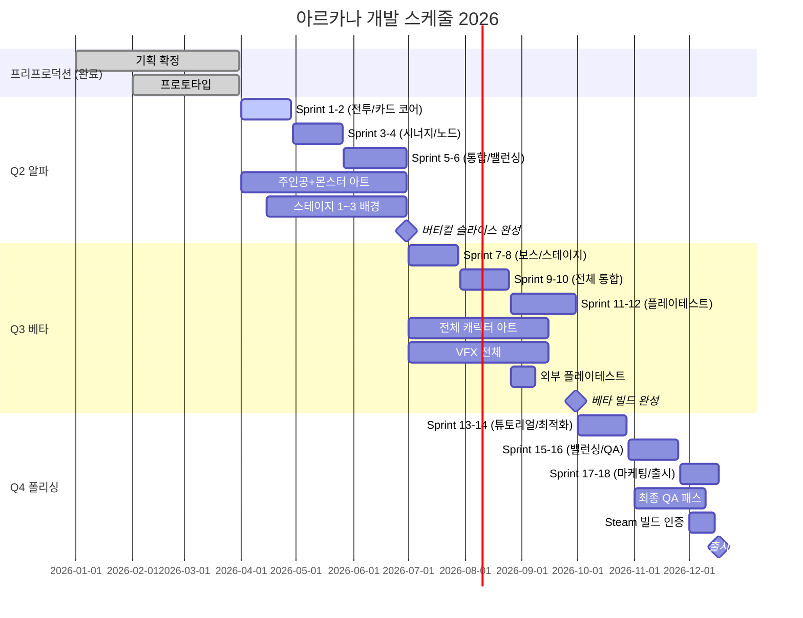

# 아르카나 프로젝트 개발 스케줄 v1.0

- 버전: v1.0
- 작성일: 2026-03-28
- 작성자: 체리 (이채연, PM)
- 참조: 메인시스템_V2, 천칭시스템기획서_V1, 몬스터컨셉기획서_V1

---

## 1. 마일스톤 개요

| 페이즈 | 기간 | 주요 목표 | 완료 기준 |
|--------|------|-----------|-----------|
| **Q1 프리프로덕션** | 2026.01~03 | 기획 확정, 프로토타입 | ✅ 완료 단계 |
| **Q2 알파 (버티컬 슬라이스)** | 2026.04~06 | 핵심 시스템 구현, 스테이지 1~3 플레이어블 | 전투/카드/천칭 시스템 100%, 내부 플레이테스트 통과 |
| **Q3 베타** | 2026.07~09 | 전체 콘텐츠 완성, 외부 검증 | 모든 스테이지 플레이어블, 1차 밸런싱 완료, 외부 플레이테스트 준비 |
| **Q4 폴리싱 & 출시** | 2026.10~12 | 완성도 향상, Steam 배포 | 60fps 안정, 전체 QA 패스, 심의/배포 완료 |

---

## 2. 마일스톤별 주요 산출물

### Q1 프리프로덕션 (완료 ✅)

| 산출물 | 담당 | 상태 |
|--------|------|------|
| 게임 컨셉 기획서 | 보스 (BD) | ✅ 완료 |
| 메인 시스템 문서 | 체리 (PM) | ✅ 완료 |
| 천칭 시스템 기획서 | 체리 (PM) | ✅ 완료 |
| 전투/턴/증강/파티/노드 시스템 기획 | 보스 (BD) | ✅ 완료 |
| 아트 컨셉 / 캐릭터 비주얼 컨셉 | 체리·송이 (PM·AD) | ✅ 완료 |
| Unity 프로젝트 세팅 (URP 2D) | 우디 (TD) | ✅ 완료 |
| 코어 전투 프로토타입 | 진 (Programmer) | ✅ 완료 |

### Q2 알파 — 버티컬 슬라이스 (2026.04~06)

| 산출물 | 담당 | Story Points |
|--------|------|-------------|
| 턴/전투 시스템 구현 | 진 + 우디 | 34 SP |
| 카드 드로우/플레이/시너지 시스템 | 진 | 21 SP |
| 천칭 시스템 구현 | 진 | 13 SP |
| 증강·파티·노드 시스템 구현 | 진 + 우디 | 34 SP |
| 세이브/로드 | 진 | 8 SP |
| 주인공 캐릭터 아트 (idle/attack/hit/KO) | 아트트리오 | 5명-주 |
| 잡몬스터 4종 아트 | 아트트리오 | 8명-주 |
| 스테이지 1~3 배경 (3레이어 패럴랙스) | 령 (BA) | 6명-주 |
| 캐릭터 애니메이션 (Spine) | 모션듀오 | 6명-주 |
| 전투 UI/HUD | 밍키 (UX) | 13 SP |
| 노드맵 UI | 밍키 (UX) | 8 SP |
| 전투 VFX (스킬 이펙트 1세트) | 니니 (VFX) | 8 SP |
| BGM 2곡 + 전투 SFX | 주디 (SD) | — |
| 1차 밸런싱 (천칭 수치 검증) | 보스 (BD) | — |
| QA 플레이테스트 계획 수립 | 보니 (QA) | — |

### Q3 베타 (2026.07~09)

| 산출물 | 담당 |
|--------|------|
| 나머지 캐릭터 아트 전체 | 아트트리오 |
| 중간보스·최종보스 아트 | 아트트리오 |
| 스테이지 4 배경 | 령 (BA) |
| 전체 캐릭터 애니메이션 완성 | 모션듀오 |
| 전투 VFX 전체 세트 | 니니 (VFX) |
| BGM 전체 (추정: 8~10곡) + SFX 완성 | 주디 (SD) |
| 카드 UI 전체 + 메인/메뉴 UI | 밍키 (UX) |
| 2차 밸런싱 (외부 플레이테스트 반영) | 보스 (BD) |
| 전체 시스템 통합 테스트 | 보니 (QA) + 외부팀 |
| 스팀 스토어 페이지 초안 | 주디 (PD) |

### Q4 폴리싱 & 출시 (2026.10~12)

| 산출물 | 담당 |
|--------|------|
| 성능 최적화 (60fps 목표) | 우디 (TD) + 진 |
| 3차 밸런싱 & 최종 조정 | 보스 (BD) |
| 튜토리얼 구현 | 진 + 밍키 |
| 최종 QA 전체 패스 | 보니 (QA) + 외부팀 |
| Steam 빌드 인증 | 우디 (TD) + 체리 (PM) |
| 트레일러 + 마케팅 에셋 | 주디 (PD) + 니니 (VFX) |
| Day-1 패치 계획 | 보니 (QA) |

---

## 3. 스프린트 개요 (Q2~Q4)

> 2주 단위 스프린트. 매 스프린트 마지막 날: 플레이어블 빌드 리뷰 + 회고.

### Q2 알파 (Sprint 1~6)

| 스프린트 | 기간 | 목표 |
|----------|------|------|
| Sprint 1 | 04.01~04.14 | 턴 매니저 + 카드 드로우 기본 구현, 전투 UI 와이어프레임 |
| Sprint 2 | 04.15~04.28 | 데미지 계산 + 천칭 시스템 연동, 주인공 캐릭터 아트 시작 |
| Sprint 3 | 04.29~05.12 | 시너지 시스템 + 증강 시스템, 전투 HUD 구현 |
| Sprint 4 | 05.13~05.26 | 노드맵 + 파티 시스템, 스테이지 1 배경 완성 |
| Sprint 5 | 05.27~06.09 | 세이브/로드 + 전체 통합, 캐릭터 Spine 애니메이션 |
| Sprint 6 | 06.10~06.30 | 내부 플레이테스트 + 버그 수정, 1차 밸런싱 |

**Q2 완료 기준**: 전투→노드→전투 루프 완전 동작, 내부 플레이테스트 통과

### Q3 베타 (Sprint 7~12)

| 스프린트 | 기간 | 목표 |
|----------|------|------|
| Sprint 7 | 07.01~07.14 | 잡몬스터 AI 고도화 + 중간보스 구현 |
| Sprint 8 | 07.15~07.28 | 스테이지 2~3 완성 + 사건 노드 콘텐츠 |
| Sprint 9 | 07.29~08.11 | 최종보스 + 엔딩 시퀀스, VFX 전체 |
| Sprint 10 | 08.12~08.25 | 전체 콘텐츠 통합 + 사운드 연동 |
| Sprint 11 | 08.26~09.08 | 외부 플레이테스트 실시 + 피드백 반영 |
| Sprint 12 | 09.09~09.30 | 2차 밸런싱 + 베타 QA 전체 패스 |

**Q3 완료 기준**: 게임 처음~끝 전체 플레이 가능, 크리티컬 버그 0

### Q4 폴리싱 (Sprint 13~18)

| 스프린트 | 기간 | 목표 |
|----------|------|------|
| Sprint 13 | 10.01~10.14 | 튜토리얼 + 접근성 개선 |
| Sprint 14 | 10.15~10.28 | 성능 최적화 1차 (프로파일링 기반) |
| Sprint 15 | 10.29~11.11 | 3차 밸런싱 + UI 폴리싱 |
| Sprint 16 | 11.12~11.25 | 최종 QA 전체 패스 + Steam 빌드 테스트 |
| Sprint 17 | 11.26~12.09 | 마케팅 에셋 (트레일러, 스크린샷, 프레스킷) |
| Sprint 18 | 12.10~12.17 | 출시 빌드 확정 + Day-1 패치 준비 |

**Q4 완료 기준**: 60fps 안정, Steam 인증 통과, 출시 준비 완료

---

## 4. 역할별 WBS 요약 (에픽 수준)

| 역할 | 담당자 | Q2 에픽 | Q3 에픽 | Q4 에픽 |
|------|--------|---------|---------|---------|
| **TD** | 우디 | Unity URP 최적화, 에셋 파이프라인 | 성능 모니터링 | 최종 최적화, Steam 빌드 |
| **Programmer** | 진 | 전투/카드/천칭/증강/파티/노드/세이브 | AI 고도화, 보스 패턴 | 튜토리얼, 버그 수정 |
| **BD** | 보스 | 수치 프레임워크 수립, 1차 밸런싱 | 외부 테스트 반영, 2차 밸런싱 | 3차 밸런싱, 최종 조정 |
| **AD** | 송이 | 아트 파이프라인 관리, QC | 전체 아트 QC | 최종 아트 폴리싱 |
| **CA** | 아트트리오 | 주인공 + 잡몬스터 4종 아트 | 나머지 캐릭터 전체 + 보스 | 최종 수정 |
| **BA** | 령 | 스테이지 1~3 배경 | 스테이지 4 + 이벤트 배경 | 배경 폴리싱 |
| **Animator** | 모션듀오 | 주인공 Spine 애니 | 전체 캐릭터 애니 완성 | 컷신/연출 |
| **UX** | 밍키 | 전투 HUD + 노드맵 UI | 카드 UI + 메인 UI 전체 | UI 폴리싱 |
| **VFX** | 니니 | 스킬 이펙트 1세트 | VFX 전체 세트 | VFX 폴리싱 |
| **SD** | 주디 | BGM 2곡 + 전투 SFX | BGM 전체 + SFX 완성 | 사운드 믹싱 |
| **QA** | 보니 | 테스트 계획 + 스프린트 QA | 외부 플레이테스트 운영 + 전체 QA | 최종 QA 패스 |
| **PD** | 주디 | 프로젝트 비전 유지, 의사결정 | 콘텐츠 승인 | 마케팅, 출시 총괄 |
| **PM** | 체리 | 스프린트 계획·회고, WBS 관리 | 리스크 관리, 외부 플레이테스트 조율 | Steam 인증, 일정 관리 |

---

## 5. 주요 리스크 Top 5

| # | 리스크 | 확률 | 영향 | 대응 전략 |
|---|--------|------|------|-----------|
| P0 | **스코프 크리프** — 기획 변경이 개발 중반 이후 누적 | High | High | 주간 스코프 리뷰, PD 승인 없는 기능 추가 금지 |
| P1 | **핵심인력 의존** — 진(프로그래머) 1인 체제 | High | High | Q2 중 보조 프로그래머 채용 검토, 코드 문서화 의무화 |
| P1 | **밸런싱 이슈** — 천칭/증강 수치 설계 난도 | High | Medium | Q2부터 플레이테스트 데이터 수집, 보스 BD 전담 |
| P2 | **아트 병목** — 콘텐츠 볼륨 대비 아트 인력 | Medium | High | Q3 배경/몬스터 일부 외주 검토 (추정: $14K~22K) |
| P2 | **기술 부채** — 빠른 프로토타이핑으로 인한 코드 품질 저하 | Medium | Medium | 스프린트마다 리팩토링 태스크 20% 확보 |

---

## 6. 마일스톤 간트 차트

---

## 7. 핵심 날짜 요약

| 날짜 | 이벤트 |
|------|--------|
| **2026-03-31** | Q1 종료 / Q2 킥오프 |
| **2026-06-30** | 버티컬 슬라이스 완성 (내부 플레이테스트) |
| **2026-08-26** | 외부 플레이테스트 시작 |
| **2026-09-30** | 베타 빌드 완성 |
| **2026-11-01** | 최종 QA 패스 시작 |
| **2026-12-17** | 출시 목표 🚀 |

---

## 8. 다음 액션

- [ ] **3/31까지**: Q2 Sprint 1 백로그 확정 (주디·보스·우디·진과 협의)
- [ ] **4/1**: Q2 킥오프 미팅 (전체 팀, 30분)
- [ ] **4/7까지**: 보조 프로그래머 채용 필요 여부 PD에게 에스컬레이션
- [ ] **4/14**: Sprint 1 리뷰 & 회고 (첫 플레이어블 빌드 확인)
