# UI기획서_V6_장보성

## 슬라이드 1

**UI기획서**

Light life 202313190 장보성

---

## 슬라이드 2

**문서 개요**

UI의 필요 기능,기획의도를 중점으로 작성한 문서

  - 게임 구조의 시각화하기전 필요 정보를 지정하기 위한 문서
**UI 기획의도, 목표**

게임 UI 시스템의 구조, 화면 구성, 인터랙션, 상태, 데이터 연결 방식을 정의함

**크기, 색상, 배치 위치,아이콘 모양, 애니메이션 등 기획되지 않은 UI디자인은 그래픽파트가 담당함**

| 역할 | 역할 |
| --- | --- |
| UI 그래픽 | UI 그래픽 제작 |
| 프로그래머(클라이언트 담당) | UI 구현 |
| 기획자 | 기능 정의 |

---

## 슬라이드 3

**UI 디자인 목표**

**정보를 빠르게 인지 할 수 있는 UX 목표**

  - 플레이 중 정보 인지 속도 1초 이내
  - **HUD 최소 시선 이동**
플레이어의 편의성 좋은 UX 목표

  - **한 손 플레이 가능 (마우스 만)**
  - **클릭,드래그 호버링 주로 이용**
| 항목 | 내용 |
| --- | --- |
| 스타일 | (UI그래픽의 지정) |
| 주요 색상 | (UI그래픽의 지정) |
| 강조 색 | (UI그래픽의 지정) |
| UI 프레임 | (UI그래픽의 지정) |

---

## 슬라이드 4

**핵심 플레이루프**

게임의 전체적인 UI화면 플로우

> 이 게임 기획 문서의 이미지는 앱의 화면 전환에 대한 흐름을 보여 주고 있습니다.

### 이미지 레이아웃

*   화면의 상단에는 앱을 실행하면 로비 화면으로 이동하는 것을 나타냅니다. 
*   화면의 중앙에는 게임의 주요 화면들과 그에 따른 하위 화면들이 어떤 경로로 이동하는지 보여 주고 있습니다. 
*   화면의 하단에는 게임 화면의 등장 우선순위를 정리하여 보여 주고 있습니다.

### 이미지 상세 설명

*   앱을 실행하면 로비 화면으로 이동합니다.
*   로비 화면에서는 스테이지 선택 화면으로 이동합니다.
*   스테이지 선택 화면에서는 전투 스테이지, 보스 스테이지, 사건 스테이지 중 한 곳으로 이동합니다.
*   전투 스테이지에서는 전투 승리 여부를 판단합니다.
    *   승리한 경우, 보상 선택 화면으로 이동합니다.
    *   패배한 경우, 게임 결과 화면으로 이동합니다.
*   보상 선택 화면에서는 보상 확인 화면으로 이동합니다.
*   보상 확인 화면에서는 토벌 선택 화면으로 이동합니다.
*   토벌 선택 화면에서는 로비 화면으로 이동합니다.
*   보스 스테이지에서는 게임 결과 화면으로 이동합니다.
*   사건 스테이지에서는 사건 화면으로 이동합니다.
*   사건 화면에서는 보상 선택 화면으로 이동합니다.
*   게임 결과 화면에서는 토벌 선택 화면으로 이동합니다.

### 화면 등장 우선순위

*   캐릭터 선택 화면
*   증강 선택 화면
*   보상 화면

### 아이콘 설명

*   직사각형: 화면
*   원: 앱 실행과 끝을 나타냅니다.

---

## 슬라이드 5

**기준 해상도 및 비율**

### 16:9비율

### (1920 x 1080px)

**가장 보편적인 크기 화면인 1920 x 1080px 사용**

  - PC 기준으로 가장 보급율이 높음
  - 캐릭터 배치할 공간 및 시킬 및 코스트 관리를 위한 공간 확보 필요함
---

## 슬라이드 6

**규격 지정 방법(예시)**

**크기 단위는 PX를 사용한다.**

마진

  - 마진 밖으로 UI가 배치가 되면 안된다.!!!
#### 설정

#### 버튼

#### 24px

#### 시작 버튼

#### 지정된 와이어프레임

#### 크기를 넘기면 안된다.

#### 60px

#### 18px

#### UI 그래픽은 와이어프레임의

---

## 슬라이드 7

**Grid 규칙**

모든 UI는 8px 단위로 배치한다.(UI 그래픽이 지정해 줘야함)

예)

  - 8px,16px,24px,32px
기획의도

  - 여러 화면에서 여백, 요소 간격, 배열을 통일하여 안정감 있는 레이아웃을 위함.
  - 많은 정보를 체계적으로 정돈하여 가독성을 높이기 위함
---

## 슬라이드 8

**HUD 규칙**

예)

  - HUD = 플레이어가 상호작용 불가능한 UI
기획의도

  - 여러 화면에서 여백, 요소 간격, 배열을 통일하여 안정감 있는 레이아웃을 위함.
  - 많은 정보를 체계적으로 정돈하여 가독성을 높이기 위함
---

## 슬라이드 9

**UI Scene 구조**

레이어 순서

#### UI 그래픽이 한번 확인하고 확정 바람

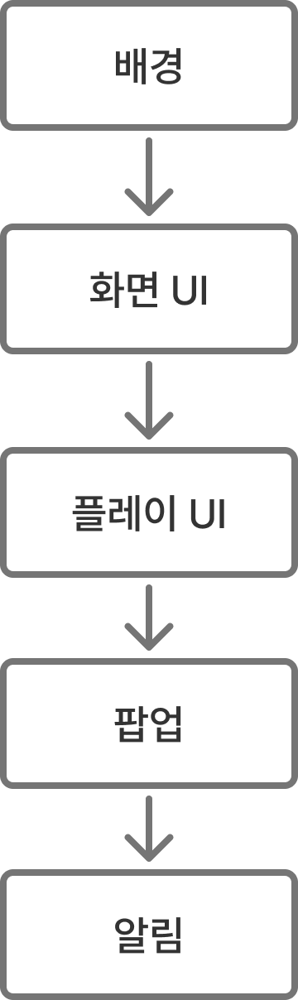

> 이 이미지는 게임 기획 문서의 일부로, 게임의 UI(User Interface) 구성 요소들의 계층적 구조를 보여주는 다이어그램입니다. 

이미지는 다섯 개의 사각형 블록으로 구성되어 있으며, 각 블록은 직사각형의 테두리로 둘러싸여 있고, 블록 내부에는 한국어로 된 텍스트가 포함되어 있습니다. 블록들은 수직으로 배열되어 있으며, 각 블록 아래에는 아래쪽을 가리키는 회색 화살표가 있습니다.

블록의 레이아웃과 구조는 다음과 같습니다.

- 첫 번째 블록: 배경
- 두 번째 블록: 화면 UI
- 세 번째 블록: 플레이 UI
- 네 번째 블록: 팝업
- 다섯 번째 블록: 알림

각 블록은 동일한 크기로 그려져 있으며, 블록과 블록 사이에는 일정한 간격이 있습니다. 배경, 화면 UI, 플레이 UI, 팝업, 알림과 같은 텍스트는 블록의 중앙에 위치해 있습니다.

이 구조도는 게임의 UI 요소들이 어떤 순서로 구성되는지, 그리고 각 요소가 어떤 관계를 가지는지 보여줍니다.

---

## 슬라이드 10

텍스트 규격

가독성

  - 텍스트의 문장은 가독성이 좋게 2줄씩만
  - 작성할 텍스트가 2줄을 넘어갈 경우 문장을 작성하고 한 칸씩 띄어서 추가로 작성
    - 예시
기획되지 않은 UI 디자인은 그래픽파트가 담당함  (글꼴, 크기, 외곽선등)

사건설명 어쩌구저쩌구 어쩌구저쩌구 어쩌구저쩌구 어쩌구저쩌구

어쩌구저쩌구 어쩌구저쩌구 어쩌구저쩌구 어쩌구저쩌구 어쩌구저

---

## 슬라이드 11

카메라 무빙

**무빙을 통한 강조 되어야 할 정보**

예) 스킬 시전자나 대상을 카메라로 줌인

자연스러운 화면 전환

  - 애니메이션을 통한 자연스러운 화면 전환으로 플레이어 몰입도에 지장을 줄임
주의

  - 액션성보다 출력에 대한 피드백에 초점
레퍼런스

  - 리버스1999
    - 아이콘의 애니메이션 화면 전환 및 애니메이션 카메라 무빙

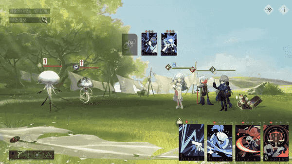

> (이미지 설명 실패: Error code: 400 - {'error': {'message': 'animated GIFs are not supported', 'type': 'invalid_request_error'}})

---

## 슬라이드 12

**선택에 따른 배치 규격**

왼쪽 부정문, 오른쪽 긍정문

부정

긍정

---

## 슬라이드 13

버튼 상호작용

버튼의 공통적 상호작용 규격 표시용

상태 규격

  - 마우스와 상호작용하지 않을 경우 Normal상태
  - 마우스가 버튼 위에 있을 경우 Hovered상태
  - 마우스가 버튼에서  벗어날 경우 Normal 상태
  - 마우스가 버튼을 클릭할 때 Pressed 상태
예시 이미지

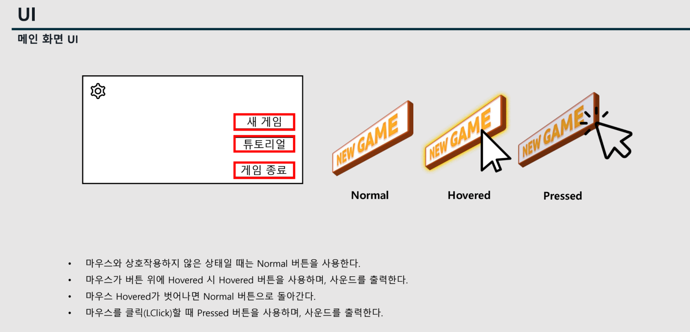

> 해당 문서의 제목은 UI로, 세부 카테고리로는 메인 화면 UI입니다.

문서의 레이아웃은 상단 좌측에 **UI**라는 타이틀과 **메인 화면 UI**라는 세부 카테고리가 표시되어 있습니다. 

그 아래에 게임 메뉴 버튼의 목록이 있습니다. 메뉴 버튼은 게임 화면의 상단 왼쪽에 표시되며 톱니바퀴 모양의 아이콘을 포함합니다. 버튼은 빨간색 테두리로 표시된 영역 안에 **새 게임**, **튜토리얼**, **게임 종료**의 세 가지가 있습니다.

메뉴 버튼의 디자인과 상태에 대한 설명이 있습니다. 버튼은 Normal, Hovered, Pressed 세 가지 상태로 표시됩니다.

*   Normal: 버튼이 기본 상태일 때입니다. 버튼은 노란색의 테두리와 텍스트가 있으며 그림자 효과가 있습니다.
*   Hovered: 마우스가 버튼 위에 올라갔을 때입니다. 버튼은 밝은 노란색으로 바뀌고 커서가 올라가 있습니다.
*   Pressed: 버튼을 클릭했을 때입니다. 버튼은 약간 기울어지고 짙은 노란색으로 바뀌며 커서가 클릭된 상태로 표시됩니다.

버튼의 상태에 대한 상세한 설명이 있습니다.

*   마우스와 상호작용하지 않은 상태일 때는 Normal 버튼을 사용합니다.
*   마우스가 버튼 위에 Hovered 시 Hovered 버튼을 사용하며 사운드를 출력합니다.
*   마우스 Hovered가 벗어나면 Normal 버튼으로 돌아갑니다.
*   마우스를 클릭(LClick)할 때 Pressed 버튼을 사용하며 사운드를 출력합니다.

---

## 슬라이드 14

텍스트 박스 상호작용

텍스트 박스의 공통적 상호작용 규격 표시용

  - Textbox는 추가적인 정보를 상호작용 시 제공하는 정보의 텍스트
  - 텍스트 박스의 위치는 좌측 상단에 표기
  - 만약 공간경우 상호작용 관계없이 여유공간에 배치한다.
상호작용 규격

  - 텍스트 박스는 조건에 맞게 등장, 소멸합니다
예시 이미지

#### 상호작용 불가한 허드

#### 추가적 정보 제공임!!!

팝업된 텍스트 박스

> 이미지는 한국어로 번역된 게임 인터페이스의 일부입니다. 상단에는 큰 이미지와 텍스트가 있고, 하단에는 여러 개의 버튼과 정보가 표시된 패널이 있습니다.

상단 이미지 영역:
- 배경 이미지: 어둡고 흐린 하늘이 배경이며, 강가에 많은 사람들이 모여 있고 말을 탄 인물들이 보입니다. 
- 텍스트: 
  - "도겸, 지원을 구하다: 당신은 이전부터 도겸을 공경해왔기에 그와 친밀하게 지냈습니다. 하지만 도겸의 불충한 신하들 중 한 명이 조승을 해치려는 바람에, 조승의 아들인 조조가 복수를 위해 도겸에게 쳐들어갔습니다. 도겸은 당신에게 침략자를 막아달라며 지원을 요청했습니다."

중앙 패널:
- 왼쪽 상단: 
  - "도겸은 돕는다" 라는 문구가 있고, 검색창과 "도겸" 이라는 이름이 보입니다. 
  - "이야기", "배반 행위", "선전 포고", "선전 포고", "외교 관계" 라는 항목이 있습니다. 
- 중앙: 
  - "당신에 대한 태도 +41" 이라는 문구와, 금색 유비 캐릭터가 보입니다. 
  - "유비" 라는 이름과, 왼쪽에 있는 캐릭터의 정보를 나타내는 것으로 추정되는 "우호적" 이라는 단어가 보입니다. 
  - "금정적 요소 (+40)" 
  - "+36 아군과 조조를 맺음"
  - "+2 적군과 전쟁 중"
  - "+2 우군과 조약을 맺음"
  - "현재 태도: +41"
  - "다음 턴 추세: +40" 
- 오른쪽: 
  - " 돕지 않는다" 라는 문구가 있고, 검색창과 "조조" 라는 이름이 보입니다. 
  - "포고: 조조, 도겸" 
  - "관계: 도겸에게 -80" 
  - "관계: 조조에게 +80" 

화면 오른쪽 하단:
- 지도의 일부가 보입니다. 
- 지도의 오른쪽 상단에는 "활건적" 이라는 이름과, 옆에 녹색 왕관 모양의 아이콘이 있습니다. 
- 지도의 왼쪽 하단에는 "팽성" 이라는 이름과, 옆에 녹색 왕관 모양의 아이콘이 있습니다.

> 이미지는 검은색 윤곽선으로 그려진 컴퓨터 마우스 커서를 묘사하고 있습니다. 커서의 윤곽선은 굵고 뚜렷하며, 배경은 흰색입니다. 

커서의 모양은 전통적인 컴퓨터 마우스 포인터와 유사하며, 일반적으로 화면에서 항목을 클릭하거나 선택할 때 사용됩니다. 윤곽선은 단단하고 선명하며, 내부 공간은 비어 있습니다.

구체적으로, 커서의 윤곽선은 왼쪽 상단에서 오른쪽 하단으로 대각선 방향을 가리키고 있습니다. 윤곽선은 매끄럽고 곡선이 아닌 날카로운 선으로 그려져 있습니다.

전체적으로, 이 이미지는 디지털 인터페이스에서 탐색 및 상호 작용을 용이하게 하는 기본 요소인 마우스 커서를 나타냅니다.

---

## 슬라이드 15

**UI 네이밍규격**

데이터 Row ID 규칙 [System_[Name]_[Variant]

#### 예시

#### MON_Frog

#### MON_Chicken

#### ITEM_Potion_Small

#### ITEM_Potion_Large

| 네이밍 | 설명 |
| --- | --- |
| BTN | 버튼 |
| IMG | 이미지 |
| TXT | 텍스트 |
| BAR | 게이지 |
| SLOT | 슬롯 |
| TAB | 탭 |
| POP | 팝업 |
| HUD | 허드 구성요소 |

---

## 슬라이드 16

핵심 화면

프로젝트에 우선적으로 필요한 핵심 화면

---

## 슬라이드 17

로비 화면

#### E

| 알파벳 | 이름 | 타입 | 설명 |
| --- | --- | --- | --- |
| A | 스테이지  진행 단계 | BAR | 이번 런에서 현재까지 클리어한 진행된 스테이지의 정보  클릭을통해 게임을 시작할 수 있음을 인지 시켜야 함 |
| B | 보유 캐릭터 | HUD | 현재 보유 중인 캐릭터를  시각화하는 이미지  또한 캐릭터의 파티 편성이 변경 가능해야함 |
| C | 보유 증강 리스트 | HUD | 현재 보유 중인 증강의  (종류, 개수)  알려주는 이미지  스크롤로 많은 양의 증강 아이콘 들도 볼 수 있게 함 |
| D | 윤회하기 | BTN | 기존 런을 일부스텟을 유지하고 초기화하는 버튼  런을 초기화하는 질문하는 팝업 띄움 |
| E | 설정 | BTN | 설정 팝업을 열기 위한 버튼 중요도는 높지 않음 |

#### 스테이지 진행 단계

#### 보유중인 캐릭터

#### 보유중인 증강

#### 리스트

#### A

#### B

#### C

게임 전반적 컨셉을 보여주며 플레이하기 전 휴식 및 각 컨텐츠와 연결되는 중앙허브 화면

#### D

#### 증강

#### 아이콘

#### 보유 갯수

#### 윤회하기

---

## 슬라이드 18

스테이지 선택 화면

#### 현재 진행중 스테이지 3-2

#### E

#### F

#### I

#### J

| 알파벳 | 이름 | 타입 | 기능 |
| --- | --- | --- | --- |
| A | 진행된 스테이지 수 |  | 현재 진행중인 스테이지의  위치를 한눈에 보여주기 위함 |
| B | 보유중인 캐릭터 리스트 |  | 플레이어가 자신의 상태 및 관리를 위한 아이콘   플레이어가 클릭을 하여 상세 정보 팝업을 통해  캐릭터 교체, 보유 증강 확인, 보유 토템확인을 할 수 있게 한다. |
| C | - | - | - |
| D | - | - | - |
| E | 지나간 스테이지 |  | 지나간 스테이지는 딤드 및 선택 불가 |
| F | 진행불가 루트 |  | 갈 수 없다는 루트를 표기 |
| G | 현재 위치 아이콘 |  | 플레이어가 현재 위치한 스테이지 위에 아이콘을 두어  플레이어 위치 표기 |
| H | 현재 이동 가능한 루트 |  | 현재 상태에서 이동 가능한 루트는 색 변화 가 선이 아닌 점으로 이루어 짐 |
| I | 보스 스테이지 |  | 보스는 각 스테이지의 마지막으로서  다른 일반적인  스테이지와 구분이 되어야 한다. |
| J | 설정 |  | 설정 팝업을 열기 위한 버튼 중요도는 높지 않음 |

#### A

#### H

스테이지 구분및 현재 자신의 상태를 파악하고 다음으로 자신이 향할 스테이지를 선택하는데 도움을 줌

#### B

#### G

#### 캐릭터

#### 교체창

> 이미지는 게임 기획 문서의 일부로 보이는 이미지입니다. 이미지의 구성 요소는 다음과 같습니다.

*   이미지의 형태: 이미지의 형태는 네모입니다. 네모의 네 귀퉁이는 모두 둥근 형태입니다. 
*   배경: 이미지의 배경은 흰색입니다. 
*   테두리: 이미지의 테두리는 회색입니다. 
*   이미지: 이미지 중앙에는 악마의 얼굴을 묘사한 그림이 있습니다. 악마의 얼굴은 검은색으로 그려져 있습니다. 얼굴의 형태는 둥근 형태이며 눈썹이 있는 공간에는 두 개의 뿔이 그려져 있습니다. 눈은 두 개이며 눈꼬리가 올라가 있습니다. 눈은 동그라미 모양입니다. 눈과 눈 사이에는 공간이 있습니다. 눈 아래에는 입이 미소를 머금고 있는 듯한 모습으로 그려져 있습니다. 

위와 같은 이미지 설명을 바탕으로 게임 기획에 사용된 이미지임을 유추해 보았을 때, 악마 캐릭터의 얼굴을 상징하는 아이콘으로 사용된 것으로 추정됩니다.

> 이미지는 게임 기획 문서의 일부로 보이는 이미지입니다. 이미지의 구성 요소는 다음과 같습니다.

*   **배경**: 이미지는 흰색 배경에 검은색 테두리가 있는 사각형 모양입니다. 모서리는 약간 둥글게 처리되어 있습니다.
*   **아이콘**: 이미지 중앙에는 검은색으로 악마의 얼굴을 묘사한 아이콘이 있습니다. 악마의 얼굴은 단순화된 형태로 표현되었으며, 두 개의 뿔과 눈만으로 구성되어 있습니다. 눈은 반쯤 감긴 듯한 모습으로 표현되어 있습니다.

아이콘의 크기는 이미지의 대부분을 차지하며, 테두리는 이미지의 크기에 비해 상대적으로 얇게 처리되어 있습니다. 

이미지에는 텍스트가 포함되어 있지 않습니다.

> 이미지는 게임 기획 문서의 일부로, 질문을 나타내는 검은색 물음표 아이콘이 포함된 흰색 사각형을 보여줍니다.

*   **아이콘**: 중앙에 있는 커다란 검은색 물음표 아이콘(?)이 있습니다. 
*   **배경**: 물음표 아이콘은 둥근 모서리가 있는 흰색 사각형 안에 있습니다. 
*   **테두리**: 흰색 사각형은 얇은 회색 테두리로 둘러싸여 있습니다. 
*   **배경**: 이미지의 배경은 투명입니다.

> 이미지는 게임의 스킬 또는 특성 트리 관련 화면으로 추정됩니다. 화면 상단에는 여러 아이콘이 배치되어 있고, 화면 중앙에는 여러 노드들이 선으로 연결된 트리 구조가 있습니다. 화면 하단에는 캐릭터 또는 플레이어의 정보로 추정되는 아이콘들이 있습니다.

상세한 설명은 다음과 같습니다.

*   화면 상단(좌측에서 우측순)
    *   캐릭터 그림 2개
    *   카드로 추정되는 녹색 사각형
    *   책으로 추정되는 보라색 물건
    *   유리잔으로 추정되는 물건
    *   깔때기로 추정되는 물건
    *   정보 버튼으로 추정되는 아이콘
    *   톱니바퀴 모양의 설정 버튼으로 추정되는 아이콘
*   화면 중앙
    *   중앙에 노란색으로 강조된 노드가 있습니다. 이 노드에는 노란색의 타워 또는 탑과 유사한 아이콘이 있습니다.
    *   이 노드는 노란색 선으로 연결된 다른 노드들과 상호 연결되어 있습니다. 
    *   각 노드에는 다양한 아이콘들이 있으며, 일부 노드에는 물음표가 표시되어 있습니다.
*   화면 하단
    *   6개의 아트록이 원형으로 그룹지어져 있습니다. 각 아트록은 서로 다른 색상과 모양을 가지고 있습니다. 
    *   각 아트록의 머리 위에는 다양한 색상의 작은 원이 있습니다. 
    *   각 아트록의 앞에는 금색 트로피가 있습니다.

---

## 슬라이드 19

스테이지 진행 표기 방법

뒷 배경

  - 공간은 전적
노드 이동 가능 불가능 시각화

  - 현재 이동 가능한 스테이지,노드와
불가능한 노드를 시각적으로

**색상에 차이나 딤드등을 통해**

차별점을 두어야 한다.

예시 이미지

#### 어떤 스테이지로 이동 가능한지 및 어떤 이벤트가 발생할지 예상이 되도록

#### 현재 진행중 스테이지 3-2

#### 캐릭터

#### 교체창

> 이미지는 게임의 일부로 보이는 네트워크 또는 맵을 보여 주고 있습니다. 

### 이미지 중앙 부분

*   이미지 중앙에는 원형의 불이 타오르고 있는 구조물이 있습니다. 이 구조물은 노란색 불꽃이 타오르고 있는 모습으로 표현되어 있습니다. 
*   구조물 아래에는 노란색 깔때기 모양의 아이콘이 있습니다. 
*   구조물에서 아래로 내려오는 선이 연결되어 있는 큐브 형태의 아이콘과 그 옆에 있는 원통형의 아이콘이 있습니다. 

### 이미지 상단 왼쪽 부분

*   이미지 왼쪽 위에는 숫자가 85로 적혀 있는 주황색 원이 있고 그 아래로 검이 엑스(X) 모양으로 교차된 아이콘이 있습니다. 

### 이미지 중앙 왼쪽 부분

*   이미지 중앙 왼쪽에는 숫자가 85로 적혀 있는 주황색 원이 있고 그 아래로 검이 엑스(X) 모양으로 교차된 아이콘이 있습니다. 

### 이미지 중앙 아래 부분

*   이미지 중앙 아래에도 숫자가 85로 적혀 있는 주황색 원이 있고 그 아래로 검이 엑스(X) 모양으로 교차된 아이콘이 있습니다.

### 이미지 오른쪽 부분

*   이미지 오른쪽에는 여러 가지 아이콘이 모여 있습니다. 
*   이미지 오른쪽 상단에는 노란색 원과 회색 사각형이 겹쳐진 아이콘이 있고, 그 아래에는 노란색 원과 회색 삼각형이 겹쳐진 아이콘이 있습니다. 
*   그 아래에는 위험을 나타내는 삼각형 경고등이 빨간색으로 표시되어 있고, 노란색 원과 숫자가 251로 적혀 있는 아이콘, 그리고 회색 사각형과 회색 삼각형이 겹쳐진 아이콘이 있습니다. 
*   또한, 노란색 원과 회색 체크 표시가 있는 아이콘, 노란색 불꽃 모양의 아이콘, 노란색 가스 모양의 아이콘, 노란색 사람 모양의 아이콘이 있습니다. 

### 이미지 배경

*   이미지의 배경은 짙은 파란색이며, 여러 선이 교차되어 있습니다. 

전체적으로 이 이미지는 게임의 일부로 보이는 네트워크 또는 맵을 보여 주고 있습니다.

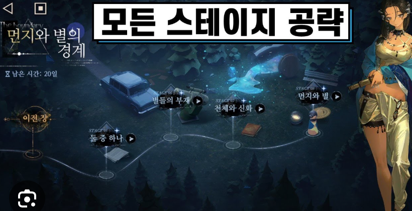

> 이 게임의 이름은 'The Boundary: 먼지 와 별의 경계'입니다. 
화면 상단 왼쪽에는 게임의 타이틀과 함께 '포기한 시간: 20일'이라는 문구가 있습니다. 화면 상단 중앙에는 흰색 사각형에 검은색으로 '모든 스테이지 공략'이라고 적혀 있습니다.

화면 왼쪽 상단에는 뒤로가기 버튼과 카메라 아이콘이 있습니다. 화면 왼쪽 하단에는 카메라 모양의 버튼이 있습니다.

화면 중앙에는 게임의 맵이 있습니다. 맵에는 자동차, 컵, 책, 부채, 유리잔 등의 오브젝트가 배치되어 있습니다. 자동차는 왼쪽 상단에, 컵과 책은 중앙에, 부채와 유리잔은 오른쪽에 있습니다. 오브젝트와 오브젝트 사이에는 흰색의 연결선이 있습니다. 이 연결선은 여러 오브젝트를 순서대로 잇고 있으며, 화살표 모양의 아이콘으로 각 오브젝트가 이어지는 방향을 나타냅니다. 

자동차 오브젝트 위에는 '이전 장'이라는 문구가 있고, 컵과 책 오브젝트 위에는 각각 '별들의 부재', '천체와 신화'라고 적혀 있습니다. 유리잔 오브젝트 위에는 '먼지 와 별'이라고 적혀 있습니다. 

자동차 오브젝트 왼쪽에는 나침반이 있고, 그 위에는 'STAGE 05'이라고 적혀 있습니다. 컵과 책 오브젝트 위에는 각각 'STAGE 06', 'STAGE 07'이라고 적혀 있습니다. 유리잔 오브젝트 위에는 'STAGE 08'이라고 적혀 있습니다.

화면의 오른쪽에는 한 여성 캐릭터가 있습니다. 검은 머리를 가진 이 여성은 녹색과 노란색이 조합된 옷을 입고 있습니다. 오른손에 총을 들고 있습니다.

> 이미지는 게임 기획 문서의 일부로, 검은색 뿔이 달린 가면의 실루엣이 그려진 흰색 사각형 아이콘입니다.

아이콘의 구조는 다음과 같습니다.

*   **모서리가 둥근 사각형**: 이미지의 테두리는 모서리가 둥근 사각형입니다. 테두리는 회색이며, 약간의 그림자가 있습니다.
*   **흰색 배경**: 사각형 내부의 배경은 흰색입니다.
*   **검은색 가면**: 흰색 배경 중앙에는 검은색 뿔이 달린 가면의 실루엣이 그려져 있습니다. 가면의 윤곽은 검은색이며, 가면의 눈 부분에는 검은색으로 된 두 개의 타원형이 그려져 있습니다. 가면의 왼쪽과 오른쪽에는 각각 뿔이 하나씩 그려져 있습니다. 두 뿔은 바깥쪽을 향해 있습니다.

> 이미지는 게임 기획 문서의 일부로 추정되는 이미지입니다. 이미지의 구성 요소는 다음과 같습니다.

*   **배경**: 이미지는 흰색 배경에 검은색 테두리가 있는 사각형입니다. 테두리는 둥근 모서리를 가지고 있습니다.
*   **아이콘**: 이미지 중앙에는 검은색으로 된 악마의 얼굴이 그려져 있습니다. 악마의 얼굴은 두 개의 뿔이 있는 것으로 묘사되어 있습니다. 눈은 두 개이며, 눈동자가 없는 빈 눈으로 표현되어 있습니다. 입은 그려져 있지 않습니다. 전체적으로 간결한 선과 단순한 형태로 표현된 악마의 얼굴입니다.

아이콘의 크기는 사각형의 크기에 비해 적절하며, 이미지에서 중심을 차지하고 있습니다. 

텍스트가 포함되어 있지 않습니다.

> 이미지는 게임 기획 문서의 일부로, 하나의 아이콘을 나타냅니다.

이미지는 검은색 배경에 회색 테두리가 있는 흰색 사각형으로 구성되어 있습니다. 사각형의 네 모퉁이는 모두 둥글게 처리되어 있습니다. 

흰색 사각형 중앙에는 큰 검은색 물음표가 있습니다. 물음표의 왼쪽 상단과 하단에는 각각 테두리가 있습니다.

이미지에는 텍스트가 포함되어 있지 않습니다.

---

## 슬라이드 20

전투 화면

| 알파벳 | 이름 | 타입 | 설명 |
| --- | --- | --- | --- |
| A | 아군 SD |  | 아군 캐릭터의 SD캐릭터로서 행동, 상태에 대한 피드백을 부여함 |
| B | 궁극기 게이지 |  | 궁극기에 사용을 위해 조건을 게이지 형태로 보여주는 게이지  궁극기 사용 가능할 시 구분이 되어야 함 |
| C | HP 게이지 |  | HP 프로그래스바로서 현재 남은 HP가 남아있는 정도 표기 (정확히 남은 HP 수치는 표기 x) |
| D | 상태 효과 |  | 캐릭터에 적용된 특수효과  (버프, 디버프) |
| E | 적 행동 유형 |  | 다음 턴의 적이 사용할 스킬의 유형을 파악할 수 있도록 하는 스킬 아이콘 |
| F | 스킬 카드 |  | 플레이어가 현재 보유한 스킬 카드 아이콘   사용 불가능한 카드는 딤드 처리 등으로 구분이 되도록  시너지가 효과를 얻는 카드나 사용 시 이득인 카드는 글로우등 으로 강조 |
| G | 소모될 코스트 |  | 카드를 사용하면 소모되는 카드의 코스트 수 |
| H | 특수 카드 스킬 |  | 플레이어가 처치한 적의 카드  시너지가 자유로운 특수한 카드 일반카드와 구분이 되도록 해야함 |

플레이어가 전투 중 원하는 공격 방식과 적의 행동을 예측하기 쉽도록 표기

#### C

#### G

#### E

#### D

#### H

#### B

#### C

#### A

#### F

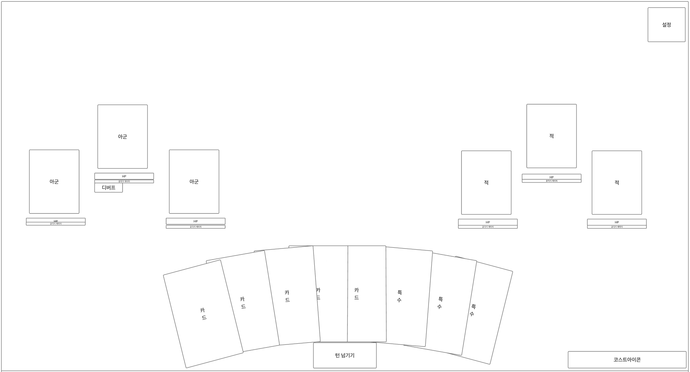

> 이미지는 게임 기획 문서의 일부로, 게임 화면의 레이아웃과 구조를 보여주는 와이어프레임 또는 목업(Mockup)입니다. 

화면 상단 우측에는 '설정'이라는 텍스트가 포함된 작은 사각형 버튼이 있습니다.

화면 중앙 상단에는 양쪽에 두 쌍의 큰 사각형이 있습니다. 왼쪽 쌍에는 '아군'이라는 텍스트가 포함된 두 개의 큰 사각형이 있고, 오른쪽 쌍에는 '적'이라는 텍스트가 포함된 두 개의 큰 사각형이 있습니다. 각 큰 사각형 아래에는 'HP'라는 라벨이 붙은 가로로 긴 작은 사각형이 있습니다. 왼쪽 쌍의 왼쪽 큰 사각형 아래에는 '디버프'라는 라벨이 붙은 또 다른 작은 사각형이 있습니다.

화면 중앙 하단에는 일렬로 나란히 배치된 여러 개의 사각형이 아치형으로 배치되어 있습니다. 왼쪽부터 '카드', '카드', '카드', '카드', '턴 넘기기', '특수', '특수', '특수'라는 텍스트가 포함된 사각형들이 있습니다.

화면 하단 우측에는 '코스트 아이콘'이라는 텍스트가 포함된 작은 사각형이 있습니다.

전체적으로 이 게임은 대전 게임으로 추정되며, 플레이어와 적이 서로 상대방의 HP를 감소시키기 위해 카드를 사용하거나 특수 능력을 사용하는 게임으로 보입니다.

---

## 슬라이드 21

전투 화면

플레이어의 현재 상태나 정보를 전달하는 목적

#### C

| 알파벳 | 이름 | 타입 | 설명 |
| --- | --- | --- | --- |
| A | 턴 넘기기 버튼 |  | 플레이어의 턴을 종료하고 적군 턴으로 변경하는 버튼 |
| B | 코스트 수 |  | 플레이어가 현재 사용한 수와 최대 보유할 수 있는 수를 보여줌 |
| C | 설정 |  | 설정 팝업을 열기 위한 버튼 중요도는 높지 않음 |
| D | 밸런스 |  | 주인공세력과 더 월드 세력의 균형을 나타내는 시스템  정방향과 역방향스킬  어느쪽의 세력이 더 우세한지 확실히 표기해야 함 |

#### A

B

#### 밸런스

#### D

> 이미지는 게임의 UI/UX에 대한 와이어프레임 또는 기획 문서로 보입니다. 

*   화면 상단 우측에 설정 버튼이 있습니다.
*   게임 화면은 상단과 하단으로 나뉩니다.
*   상단에는 플레이어와 적의 정보가 표시됩니다.
    *   플레이어는 좌측에 2개, 우측에 2개로 총 4개의 영역으로 나뉘어져 있습니다. 각 영역에는 이름과 HP 정보가 표시되는 것으로 추정됩니다. 
    *   플레이어 영역에는 HP 바와 디버프가 표시됩니다.
*   하단에는 카드, 특수, 턴 넘기기, 코스트 아이콘 등의 정보가 표시됩니다.
    *   카드는 7개, 특수는 3개로 총 10개의 영역으로 나뉘어져 있습니다. 
    *   플레이어와 적의 정보가 표시되는 상단과 하단을 연결하는 영역에는 '턴 넘기기' 버튼이 있습니다. 
    *   화면 하단 우측에는 코스트 아이콘이 있습니다.

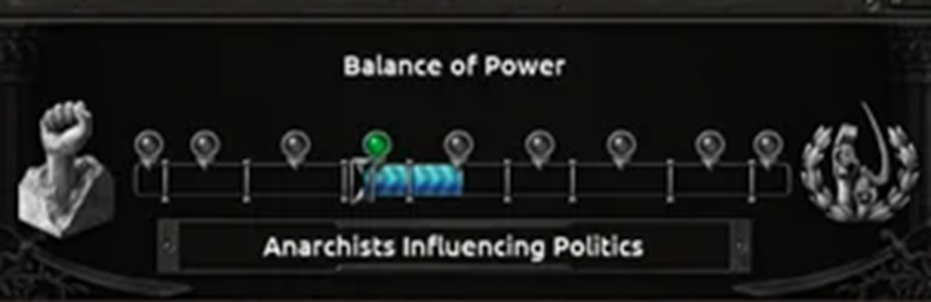

> 이미지는 게임 기획 문서의 일부로, 정치적 영향력과 권력의 균형을 나타내는 그래픽 요소로 구성되어 있습니다. 이미지를 상세하게 분석해 보겠습니다.

### **상세 설명**

#### **1. 배경 및 레이아웃**
- 배경은 주로 **검은색**이며, 상단과 하단에 **장식적인 테두리**가 있습니다. 테두리는 다소 어둡고 복잡한 패턴을 가지고 있어, 게임의 분위기를 강조하는 듯합니다.

#### **2. 텍스트 요소**
- **제목: "Balance of Power"**
  - 이미지 상단에 흰색 텍스트로 **"Balance of Power"**라는 제목이 있습니다. 이는 권력의 균형을 의미하며, 게임의 핵심 메커니즘을 상징합니다.

- **하단 텍스트: "Anarchists Influencing Politics"**
  - 이미지 하단에는 **"Anarchists Influencing Politics"**라는 문구가 있습니다. 이는 무정부주의자(Anarchists)가 정치에 미치는 영향력을 나타냅니다.

#### **3. 시각적 요소**
- **왼쪽 아이콘: 주먹**
  - 이미지 왼쪽에는 **흰색 손 모양의 조각상**이 있습니다. 주먹을 쥐고 있는 모습으로, 저항이나 혁명을 상징하는 아이콘으로 보입니다.

- **오른쪽 아이콘: 무정부주의 상징**
  - 이미지 오른쪽에는 **낫과 망치에 월계관이 씌워진 로고**가 있습니다. 이는 무정부주의를 상징하는 아이콘으로, 공산주의나 노동자 운동과 관련된 이미지로 보입니다.

#### **4. 중간 그래프**
- **슬라이더 그래프**
  - 이미지 중앙에는 **수평선 위에 여러 개의 핀(또는 마커) 아이콘**이 있습니다. 총 8개의 핀 아이콘이 일정한 간격으로 배치되어 있으며, 각 핀은 서로 연결된 선으로 이어져 있습니다.

- **활성화된 슬라이더**
  - 이 그래프의 중앙 부분에 **푸른색 원통 형태의 오브젝트**가 있습니다. 이 오브젝트는 **녹색 원형 마커**와 연결되어 있으며, 슬라이더의 현재 위치를 나타냅니다.

- **슬라이더의 의미**
  - 슬라이더는 정치적 영향력의 균형을 나타내는 요소로 보입니다. 왼쪽과 오른쪽에 있는 아이콘은 두 가지 극단적인 세력을 상징하며, 슬라이더의 위치는 무정부주의자(Anarchists)가 정치에 미치는 영향력을 나타냅니다.

### **종합 분석**
- 이 그래픽은 게임 내에서 **권력의 균형**을 시각적으로 표현한 요소로 보입니다. 
- **무정부주의자(Anarchists)**가 정치에 미치는 영향력이 어느 정도인지를 나타내는 **슬라이더**로 활용될 가능성이 있습니다. 
- **게임의 진행에 따라 슬라이더가 움직이며, 이에 따라 게임의 상황이 변화할 수 있습니다.**

---

## 슬라이드 22

사건 선택지 화면

사건설명 어쩌구저쩌구 어쩌구저쩌구 어쩌구저쩌구 어쩌구저쩌구 어쩌구저쩌구 어쩌구저쩌구

#### 사건 이미지

| 알파벳 | 이름 |  | 설명 |
| --- | --- | --- | --- |
| A | 사건 제목 |  | 사건의 제목으로 간략한 사건 종류의 구분을 위함 |
| B | 사건 이미지 |  | 사건의 상황을 시각화해서  한눈에 파악할 수 있도록 함 |
| C | 사건 상세 내용 |  | 사건 내에 있는 사건의 내용 (상황)에 대한 내용 서술용 |
| D | 행동 선택 | Button | 플레이어가 해당 사건에서 행할 행동의 선택지 |
| E | 효과 대상 아이콘 | Image | 대상 사건 종류나  캐릭터의  아이콘으로 효과 적용 대상 표기 |
| F | 효과 설명 | Text | 적용되는 효과의 설명을 표기하기 위함 |
| G | 스크롤 바 | Scrollbar | 정보량이 많을 때 스크롤 바로 화면을 내릴 수 있게 하여 많은 양을 정보를 볼 수 있게 |

행동1 어쩌구저쩌구 어쩌구저쩌구 어쩌구저쩌구 어쩌구저쩌구

선택 시 얻는 / 보상

선택 시 얻는 / 보상

선택 시 얻는 / 보상

선택 시 얻는 / 보상

선택 시 얻는 / 보상

행동2 어쩌구저쩌구 어쩌구저쩌구 어쩌구저쩌구 어쩌구저쩌구

선택 시 얻는 / 보상

선택 시 얻는 / 보상

선택 시 얻는 / 보상

선택 시 얻는 / 보상

사건 내용

선택 시 얻는 / 보상

#### A

#### B

#### C

#### D

#### E

#### G

#### F

사건에 따른 선택으로 어떤 보상이나 이벤트를 볼지 고르기 쉽게 돕는 명확한 보상을 위한 화면

#### 보상 종류 아이콘

> 이미지는 게임의 한 장면으로, 지휘관(유저)이 현재 플레이 중인 게임 화면입니다. 화면은 여러 섹션으로 나뉘어져 있습니다.

상단 왼쪽에는 흰색 배경에 게임에 대한 설명이 포함된 텍스트가 있습니다. 텍스트는 두 부분으로 나뉘며, 첫 부분은 설명의 제목으로 추정되며, 두 번째 부분은 더 자세한 설명을 담고 있습니다. 이 텍스트 옆에는 분홍색 네모 안에 정사각형 안에 국기 비슷한 도안이 그려져 있습니다.

화면 상단 오른쪽에는 전투 장면이 포함된 이미지 상자가 있습니다. 이미지 속에는 여러 명의 캐릭터가 배를 타고 바다에 있는 것으로 보입니다.

중앙 왼쪽에는 여러 개의 탭이 있고, 그중 '수송' 탭이 선택된 상태입니다. 이 탭 아래에는 여러 항목이 나열되어 있으며, 각 항목에는 아이콘과 설명이 포함되어 있습니다. 항목 중 일부는 다음과 같습니다.

*   군량: +41
*   충정: 없다
    *   공격: 0/40
    *   공격: 0/40

탭 왼쪽에는 여러 개의 아이콘이 세로로 나열되어 있습니다.

화면 하단 왼쪽에는 '수호석'이라는 항목이 있습니다. 이 항목 아래에는 여러 줄의 설명이 포함되어 있습니다.

*   공격력: +5 (주황색 숫자)
*   공격력: +5 (주황색 숫자)
*   공격력: +10 (주황색 숫자)
*   공격력: +20 (주황색 숫자)

화면의 나머지 부분은 게임의 맵으로 채워져 있습니다. 맵에는 여러 색상의 선과 아이콘이 표시되어 있습니다.

전체적으로 이 화면은 게임의 전투 또는 전략과 관련된 정보를 제공하고 있습니다.

---

## 슬라이드 23

윤회 종료 화면

#### 윤회 결과

#### 스테이지 진행 단계

#### 보유중인 캐릭터

윤회 종료

#### 보유중인 증강

#### 리스트

#### C

#### D

#### E

#### F

#### 실패

#### A

#### B

| 알파벳 | 이름 | 타입 | 설명 |
| --- | --- | --- | --- |
| A | 윤회 결과 |  | 현재 화면이 어떤 화면인지 구분 시켜주는 장치 |
| B | 결과 표기 |  | 실패 또는 클리어 시의 결과를 표기해 간략화하며 확실한 정보 표기 |
| C | 윤회 진행도 |  | 현재까지 클리어하며 진행된 스테이지를 보여주어 패배의 절망감 약화 |
| D | 보유 캐릭터 리스트 |  | 현재 보유 중인 캐릭터를 알려주는 이미지 리스트 |
| E | 보유 증강 리스트 |  | 현재 보유 중인 증강의  (종류, 개수)  알려주는 이미지  스크롤로 많은 양의 증강 아이콘 들도 볼 수 있게 함 |
| F | 윤회종료 |  | 이번 회차 윤회 내용을 확인 하고 보상화면으로 이동하기 위한 버튼 |

패배를 보다 경험 축적에 도움을 주며 달성한 성과 또한 보여주어 패배에 대한 완충 장치

#### 추후에 자신을 처치한 적을 표기하거나 할 수 있기에 확장성 있게 공간을 일부 비워둬도 좋을 듯함

#### 자신을 처치한 적

---

## 슬라이드 24

토템 선택 화면

#### 선택 완료

토템으로 만들 캐릭터 선택

999999/999999

#### 취소

| 알파벳 | 이름 |  | 설명 |
| --- | --- | --- | --- |
| A | 선택 가능 수량 |  | 얼마나 많이 선택이 가능한 지 여부를 수치화 |
| B | 캐릭터 이미지 |  | 토템으로 사용할 캐릭터 선택 |
| C | 토템 효과 종류 |  | 토템 효과에 대한 대분류로 버프 유형 판단 |
| D | 토템 효과 상세 내용 |  | 토템 효과에 대한 구체적인 내용 서술용 |
| E | 최소 |  | 선택된 내용 취소하는 버튼 |
| F | 선택 완료 |  | 선택된 내용을 확정하는 버튼 |

공격력 증가

디버프 관련 스킬 강화

스킬 코스트 감소

캐릭터 이미지

캐릭터 이미지

캐릭터 이미지

효과 상세 내용

효과 상세 내용

효과 상세 내용

#### A

#### B

#### C

#### D

함께 했던 캐릭터를 상기시키며 플레이어의 선택을 버프 내용을 표기하기 위한 화면

#### F

#### E

#### 토템으로 만들 캐릭터 선택 후

#### 2. 결정

---

## 슬라이드 25

보상 선택 종류

---

## 슬라이드 26

증강 선택 화면

증강 이미지

#### 증강

#### 증강

#### 선택 완료

선택 가능한 증강

999999/999999

#### 취소

#### B

#### D

#### A

#### F

#### E

| 알파벳 | 이름 | 타입 | 설명 |
| --- | --- | --- | --- |
| A | 선택 가능 수량 |  | 얼마나 많이 선택이 가능한 지 여부를 수치화 |
| B | 증강 이미지 |  | 증강 효과에 따라  다른 이미지를 사용하여 플레이어가 버프 종류에 따라 구분이 되게 함 |
| C | 증강 효과 종류 |  | 증강 효과에 대한 대분류로 버프 유형 판단 |
| D | 증강 효과 상세 내용 |  | 증강 효과에 대한 구체적인 내용 서술용 |
| E | 최소 |  | 선택된 내용 취소하는 버튼 |
| F | 선택 완료 |  | 선택된 내용을 확정하는 버튼 |
| G | 보유중인 증강 |  | 보유중인 증강을 보여주는 칸이라는걸 인지할 수 있도록 |
| H | 증강 아이콘 |  | 증강 효과에 따라  아이콘으로  사용하여 플레이어가 버프 종류와 소지중인 버프를 간략화해서 구분이 되게 함 |
| I | 동일 증강의 보유 수 |  | 만약 동일한 증강을 가지고 있을 경우 숫자로 몇 개 가지고 있는지 표기 |

사건설명 어쩌구저쩌구 어쩌구저쩌구 어쩌구저쩌구 어쩌

구저쩌구 어쩌구저쩌구 어쩌구저쩌구 어쩌구저

공격력 증가

#### C

플레이어가 자신이 원하는 증강 종류와 어떤 증강이 플레이에 도움이 되는지 판단하기 편한 화면

#### 상시 표기가 되지 않아도 되므로 버튼을 누르거나 하여 볼 수 있게 함(탭TAB)

> 이 게임 기획 문서의 일부인 이미지는 다음과 같은 내용을 포함하고 있습니다.

*   이미지 상단 왼쪽에는 작은 검은색 사각형에 **녹색**의 "전개 완료"라는 텍스트가 있습니다.
*   이미지 중앙에는 두 개의 캐릭터가 있습니다. 
    *   **왼쪽 캐릭터**: 등에 날개가 달린 상반신 노출의 캐릭터로, 머리는 하트 모양의 분홍색 뿔이 있고, 눈은 **하늘색**입니다. 
    *   **오른쪽 캐릭터**: 긴 하얀 머리의 캐릭터로, 눈은 **하늘색**이며, 이마에는 보석이 박힌 액세서리를 착용하고 있습니다. 
    *   두 캐릭터 모두 **보라색** 테두리의 사각형 안에 그려져 있습니다.
*   두 캐릭터 아래에는 **하얀색**의 긴 가로줄이 있습니다. 가로줄 안에는 왼쪽에 **주황색 불꽃**과 **녹색 불꽃**이 그려진 동그란 모양의 아이콘과 함께 각각 6/2, 2/2이라는 숫자가 있습니다. 
*   가로줄 오른쪽에는 **돋보기** 모양의 아이콘이 있습니다.
*   이미지 하단에는 **검은색**의 긴 가로줄이 있습니다. 가로줄 안에는 하얀색의 텍스트로 다음과 같은 설명이 있습니다. 

    *   가하는 일반 공격/전투 스킬 피해가 적의 방어력을 일정 비율 무시하며, 해당 효과는 격파 상태의 적에게 추가로 증가한다
*   이미지 가장 하단에는 **녹색**의 긴 가로줄이 있습니다. 가로줄 안에는 **검은색**의 텍스트로 "변식·화학"이라는 단어가 있습니다.

이러한 레이아웃과 구조로 인해 이 이미지는 게임 내 아이템이나 스킬 카드를 설명하는 용도로 사용되고 있음을 알 수 있습니다.

> 이 게임 기획 문서의 일부인 이미지는 다음과 같은 내용을 포함하고 있습니다.

### 이미지 설명

*   이미지 상단에는 작은 검은색 사각형에 **녹색**의 "전개 완료"라는 텍스트가 있습니다.
*   이미지 중앙에는 두 캐릭터가 있습니다. 
    *   첫 번째 캐릭터는 등에 날개가 달린 여성 캐릭터로, **하반신이 노출된 복장**을 하고 있습니다. 
    *   두 번째 캐릭터는 긴 **백발**에 눈을 가린 듯한 복면을 하고 있습니다. 
    *   두 캐릭터 모두 **스텔라 판타지** 세계관에 나오는 캐릭터로 추정됩니다.
*   두 캐릭터 아래에는 **하얀색 막대**가 있습니다. 이 막대에는 **6/2**과 **2/2**이라는 숫자가 있는 두 개의 녹색 원이 있습니다. 
    *   두 원 사이에는 돋보기 아이콘이 있습니다.
*   이미지 하단에는 **검은색 막대**에 **하얀색**의 텍스트가 있습니다. 이 텍스트는 다음과 같습니다.

    *   가하는 일반 공격/전투 스킬 피해가 적의 방어력을 일정 비율 무시하며, 해당 효과는 격파 상태의 적에게 추가로 증가한다
*   막대 하단에는 **녹색 막대**에 **검은색**의 텍스트가 있습니다. 이 텍스트는 다음과 같습니다.

    *   변식·화학

### 레이아웃 및 구조

*   이미지는 **세로 구조**로 구성되어 있습니다.
*   이미지 상단에는 캐릭터와 관련된 정보가 있습니다.
*   이미지 하단에는 캐릭터 효과에 대한 정보가 있습니다.

> 이 게임 기획 문서의 일부인 이미지는 다음과 같은 레이아웃과 구조로 구성되어 있습니다.

상단에는 작은 검은색 사각형에 **'전개 완료'**라는 녹색 텍스트가 포함되어 있습니다. 이미지 중앙에는 두 캐릭터가 있습니다. 

*   왼쪽에는 상의를 탈의한 남성이 가슴에 손을 얹고 있고, 머리는 하트 모양의 분홍색 뿔이 있고 눈을 가리고 있습니다. 
*   오른쪽에는 긴 하얀 머리의 여성이 왼쪽을 보고 있습니다. 

두 캐릭터는 각각 청색 테두리의 마름모 안에 들어 있습니다. 

두 캐릭터 아래에는 **'빛나는 해파리'**라는 텍스트가 있고, 그 밑에는 하얀색으로 된 가로로 긴 사각형이 있습니다. 왼쪽에는 불꽃이 그려진 아이콘과 **'6/2'**라는 텍스트가 있고, 가운데에는 불이 붙은 듯한 모양의 아이콘과 **'2/2'**라는 텍스트가 있습니다. 사각형 오른쪽에는 돋보기 모양의 아이콘이 있습니다.

중앙의 이미지 아래에는 큰 검은색 사각형이 있습니다. 사각형 안에는 하얀색 텍스트로 **'가하는 일반 공격/전투 스킬 피해가 적의 방어력을 일정 비율 무시하며, 해당 효과는 격파 상태의 적에게 추가로 증가한다'**라는 설명이 있습니다.

가장 하단에는 **'변식·화학'**이라는 텍스트가 포함된 녹색의 가로로 긴 사각형이 있습니다.

이러한 레이아웃과 구조로 이미지는 게임 캐릭터와 그에 대한 정보를 제공하며, 게임의 전략과 진행에 중요한 역할을 하는 요소로 사용될 수 있습니다.

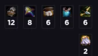

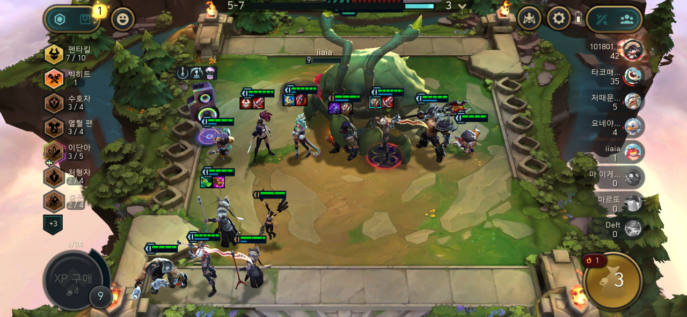

> 이미지는 모바일 게임 화면입니다. 

### 화면 레이아웃

화면은 여러 영역으로 나뉘어져 있습니다.

*   **상단 바**: 화면 상단에는 게임 진행 상황과 관련된 정보가 표시됩니다. 여기에는 "5-7"이라는 텍스트와 함께 중간에 진행 상황을 나타내는 바가 있고, 우측에는 톱니바퀴 모양의 설정 버튼과 사람 모양의 버튼이 있습니다. 
*   **좌측 패널**: 화면 왼쪽에는 캐릭터에 관련된 정보가 표시된 패널이 있습니다. 패널에는 여러 캐릭터의 정보가 표시되어 있습니다. 
*   **게임 맵**: 화면 중앙에는 게임이 진행 중인 맵이 있습니다. 맵에는 여러 캐릭터와 몬스터가 있습니다. 
*   **우측 패널**: 화면 오른쪽에는 플레이어의 정보가 표시된 패널이 있습니다. 패널에는 플레이어의 프로필과 점수가 표시되어 있습니다.

### 캐릭터 정보

*   캐릭터는 각각 고유한 모습과 능력을 가지고 있습니다. 
*   캐릭터의 모습과 능력은 게임 진행에 영향을 미칩니다.

### 게임 진행 상황

*   게임은 현재 진행 중이며, 플레이어들은 몬스터를 공격하고 있습니다.
*   게임의 목표는 상대 팀의 몬스터를 처치하고, 자신의 팀의 몬스터를 보호하는 것으로 보입니다.

### 기타 요소

*   화면에는 다양한 아이콘이 있습니다. 
*   아이콘은 게임 진행에 도움이 되는 다양한 기능을 제공합니다.

---

## 슬라이드 27

상세 후순위 UI

---

## 슬라이드 28

전투 시뮬레이션 턴 화면

#### 공격실행

#### 카드

#### 아군

#### 카드

#### 카드

#### 카드

#### 카드

#### 카드

#### 카드

99

99

99

99

99

99

#### 적

#### 적

이름

#### 아군

이름

#### 아군

이름

이름

이름

#### 적

이름

#### 현재 턴 수

#### A

#### D

#### E

99

#### F

#### C

#### C

#### C

#### C

| 알파벳 | 타입 |  | 설명 |
| --- | --- | --- | --- |
| A | Text |  |  |
| B | Image |  |  |
| C | IMAGE |  |  |
| D | Progress bar |  |  |
| E |  |  |  |
| F |  |  |  |
| G |  |  |  |

#### 선택한 카드

---

## 슬라이드 29

전투 화면 (플레이어 턴)

#### 공격실행

#### 카드

#### 아군

#### 카드

#### 카드

#### 카드

#### 카드

#### 카드

#### 카드

99

99

99

99

99

99

#### 적

#### 적

9999

이름

#### 아군

이름

#### 아군

이름

이름

이름

#### 적

이름

#### 현재 턴 수

#### 보스

이름

#### A

#### B

#### D

#### E

99

#### F

#### C

#### C

#### C

#### C

| 알파벳 | 타입 |  | 설명 |
| --- | --- | --- | --- |
| A | Text |  |  |
| B | Image |  |  |
| C | IMAGE |  |  |
| D | Progress bar |  |  |
| E |  |  |  |
| F |  |  |  |
| G |  |  |  |

#### 보유 증강

#### 선택한 카드

---

## 슬라이드 30

전투 화면 (몬스터 턴)

#### 공격실행

#### 카드

#### 아군

#### 카드

#### 카드

#### 카드

#### 카드

#### 카드

#### 카드

99

99

99

99

99

99

#### 적

#### 적

9999

이름

#### 아군

이름

#### 아군

이름

이름

이름

#### 적

이름

#### 현재 턴 수

#### 보스

이름

#### A

#### B

#### D

#### E

99

#### F

#### C

#### C

#### C

#### C

| 알파벳 | 타입 |  | 설명 |
| --- | --- | --- | --- |
| A | Text |  |  |
| B | Image |  |  |
| C | IMAGE |  |  |
| D | Progress bar |  |  |
| E |  |  |  |
| F |  |  |  |
| G |  |  |  |

#### 보유 증강

#### 선택한 카드

---

## 슬라이드 31

승패 확인 화면

| 알파벳 |  |
| --- | --- |
| 1-배경 딤드 | 뒷 배경 딤드 처리, 조작 불가 |
| 2-승패 텍스트 | 영문으로 이미지로 전투 결과에 따라 승리 또는 패배의 이미지를 띄운다 |

#### 공격실행

#### 카드

#### 아군

#### 아군

#### 아군

#### 카드

#### 카드

#### 카드

#### 카드

#### 카드

#### 카드

코스트 수 X 9999

99

99

99

99

99

99

99

#### 적

#### 적

#### 적

### VICTORY

#### 1

#### 2

전투 결과에 따른 승패여부를 보여주는 화면

전투가 끝나고 N초 동안 띄우는 화면

> 이미지는 게임의 한 장면을 캡처한 것으로 보입니다. 이 게임은 FPS(First-Person Shooter) 장르로 추정되며, 플레이어의 시점에서 게임이 진행되고 있습니다.

*   화면 상단에는 게임과 관련된 여러 정보가 표시됩니다.
    *   화면 상단 중앙에는 "L0ST"이라는 문구가 적힌 표지판이 보입니다.
    *   화면 상단 중앙에는 시계가 표시되어 있습니다. 시계는 6초를 가리킵니다.
    *   화면 상단에는 두 개의 가로 막대가 있습니다. 왼쪽 막대는 녹색이며 오른쪽 막대는 적색입니다. 녹색 막대의 왼쪽에는 숫자 8이, 오른쪽에는 숫자 13이 표시되어 있습니다. 
    *   녹색 막대의 왼쪽에는 작은 동그라미가 있고, 그 옆에 숫자가 표시되어 있습니다. 
    *   막대 오른쪽에는 세 명의 플레이어 얼굴이 보입니다.
*   화면 왼쪽 상단에는 미니맵이 있습니다. 미니맵은 회색으로 표시되어 있으며, 파란색 점이 여러 개 보입니다. 
*   화면 왼쪽 하단에는 작은 창이 있습니다. 창에는 플레이어의 이름과 프로필 사진이 표시되어 있습니다. 
*   화면 중앙에는 검은색 총이 보입니다. 
*   화면 오른쪽에는 여러 정보가 표시된 창이 있습니다.
    *   창 상단에는 "KILLED BY"라는 문구와 함께 킬한 상대방의 프로필 사진과 이름이 표시되어 있습니다. 
    *   그 아래에는 "COMBAT REPORT"라는 문구가 표시되어 있습니다. 
    *   상대방의 킬과 데스, 어시스트가 표시되어 있습니다. 
    *   상대방이 사용한 총과 킬, 데스가 표시되어 있습니다. 
    *   상대방의 남은 체력이 표시되어 있습니다. 
    *   화면 오른쪽 하단에는 상대방이 사망한 시간과 상대방이 사용한 장비가 표시되어 있습니다.

---

## 슬라이드 32

캐릭터 상세 화면

| 알파벳 |  |
| --- | --- |
|  |  |
|  |  |
|  |  |
|  |  |
|  |  |
|  |  |
|  |  |

#### 스킬 일러스트

#### 돌아가기

#### 캐릭터 이름

#### 전투 스테이더스

#### 현재 캐릭터에

#### 적용된 증강

#### 스킬1

#### 스킬2

#### 궁극기

---

## 슬라이드 33

스킬 상세 화면

| 알파벳 |  |
| --- | --- |
|  |  |
|  |  |
|  |  |
|  |  |
|  |  |
|  |  |
|  |  |

#### 캐릭터

#### LD 일러스트

#### 돌아가기

#### 캐릭터 이름

#### 전투 스테이더스

#### 현재 캐릭터에

#### 적용된 증강

#### 스킬1

#### 스킬2

---

## 슬라이드 34

팝업

---

## 슬라이드 35

#### 카드

보상 확인 팝업

#### 공격실행

코스트 수 X 9999

99

99

99

99

99

99

99

| 알파벳 | 이름 | 타입 | 설명 |
| --- | --- | --- | --- |
| A |  |  |  |
| B |  |  |  |
| C |  |  |  |
| D |  |  |  |
| E |  |  |  |
| F |  |  |  |
| G |  |  |  |

#### A

플레이어가 결과적으로 획득한 보상을 각인 시키는 역할

#### 보상 내용

선택 완료

999K

999K

999K

999K

999K

999K

999K

보상이름

보상이름

보상이름

보상이름

보상이름

보상이름

보상이름

증강 이미지

사건설명 어쩌구저쩌구 어쩌구저쩌구 어쩌구저쩌구 어쩌구저쩌구 어쩌구저쩌구 어쩌구저쩌구 어쩌구저

공격력 증가

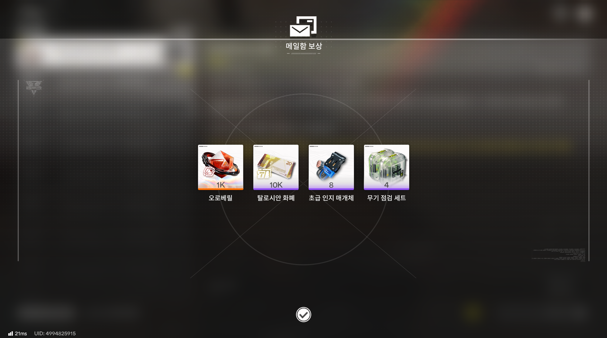

> 이미지는 게임 내 메일함 보상을 확인하는 화면입니다. 화면 상단에는 흰색 선으로 된 테두리 안에 메일 봉투가 겹쳐진 아이콘과 '메일함 보상'이라는 문구가 있습니다. 

아이콘 아래에는 네 개의 보상이 있습니다. 보상은 다음과 같습니다.

*   **오로배릴 1K**: 주황색의 오로배릴 광석이 그려져 있습니다. 
*   **10K 탈로시안 화폐**: 금색 동전이 쌓여 있고, 그 옆에 20이라는 숫자가 적혀 있습니다. 
*   **초급 인지 매개체 8**: 파란색 기계장치가 그려져 있습니다. 
*   **무기 점검 세트 4**: 은색 기계장치가 그려져 있습니다. 

각 보상 아래에는 수령할 수 있는 개수가 숫자로 표시되어 있습니다.

화면 하단에는 흰색 동그라미 안에 체크 표시가 있습니다.

화면 왼쪽 하단에는 서버 지연 속도인 것 같은 '21ms'와 UID: 4994825915가 적혀 있습니다.

---

## 슬라이드 36

선택 완료

취소

선택 스킵 확인 팝업

| 알파벳 |  |
| --- | --- |
|  |  |
|  |  |
|  |  |
|  |  |
|  |  |
|  |  |
|  |  |

#### 선택할 기회가 남아 있습니다.

#### 선택하지 않고 진행하시겠습니까?

#### 주의!!!

선택 완료

취소

플레이어가 실수로 선택했을 경우에 불쾌감 방지!

---

## 슬라이드 37

선택 완료

취소

선택 스킵 확인 화면

| 알파벳 |  |
| --- | --- |
|  |  |
|  |  |
|  |  |
|  |  |
|  |  |
|  |  |
|  |  |

#### 게임 종료하시겠습니까?

게임 종료

취소

---

## 슬라이드 38

#### 카드

#### 음향

#### 돌아가기

설정 팝업

#### 공격실행

코스트 수 X 9999

99

99

99

99

99

99

99

| 알파벳 | 타입 |  | 설명 |
| --- | --- | --- | --- |
| A | Text |  |  |
| B | Image |  |  |
| C | IMAGE |  |  |
| D | Progress bar |  |  |
| E |  |  |  |
| F |  |  |  |
| G |  |  |  |

#### A

#### 아군

#### 아군

#### 아군

#### 적

전체 음향

전체 음향

전체 음향

전체 음향

전체 음향

#### 카드

#### 카드

#### 카드

#### 카드

#### 카드

#### 카드

#### 적

#### 아군

#### 아군

#### 적

게임 종료

#### 음향

#### 단축키

#### 돌아가기

전체 음향

전체 음향

전체 음향

전체 음향

전체 음향

플레이어가 자신에 맞게

#### A

#### A

#### A

#### A

#### A

#### A

---

## 슬라이드 39

보류

---

## 슬라이드 40

로딩 화면

| 알파벳 |  |
| --- | --- |
|  |  |
|  |  |
|  |  |
|  |  |
|  |  |
|  |  |
|  |  |

스킬1의 스킬은 공격형 스킬로서 단일의 적에게 어쩌구저쩌구 어쩌구저쩌구 어쩌구저쩌구 어쩌구저쩌구 어쩌구저쩌구 어쩌구저쩌구 어쩌구저쩌구 어쩌구저쩌구 어쩌구저쩌구 어쩌구저쩌구 어쩌구저쩌구 어쩌구저쩌구 어쩌구저쩌구 어쩌구저쩌구 어쩌구저쩌구 어쩌구저쩌구 어쩌구저쩌구 어쩌구저쩌구 어쩌구저쩌구 어쩌구저쩌구 어쩌구저쩌구 어쩌구저쩌구 어쩌구저쩌구 어쩌구저쩌구 어쩌구저쩌구 어쩌구저쩌구 어쩌구저쩌구 어쩌구저쩌구 어쩌구저쩌구 어쩌구저쩌구 어쩌구저쩌구 어쩌구저쩌구 어쩌구저쩌구 어쩌구저쩌구어쩌구저쩌구어쩌구저쩌구어쩌구저

스킬1어쩌구저쩌구 어쩌구저쩌구 어쩌구저쩌구 어쩌구저쩌구 어쩌구저쩌구 어쩌구저쩌구 어쩌구저쩌구 어쩌구저쩌구 어쩌구저쩌구

윤회를 시작하기 위한 스테이지 생성 시간 같은 큰 용량의 데이터를 로딩하기 위한 시간 벌기 페이지

> 이미지는 검은색 배경에 하얀색으로 그려진 배의 방향키를 나타냅니다. 방향키는 가운데 동그란 축을 중심으로 6개의 뼈대가 방사형으로 퍼져있고, 각 뼈대 끝에는 동그란 구체가 있습니다. 방향키의 바깥쪽 테두리는 동그란 원 모양이며, 뼈대는 가운데 축에서 바깥쪽으로 뻗어져 나와 있습니다.

---

## 슬라이드 41

알림 시스템

| 유형 |  |  | 접근성 |
| --- | --- | --- | --- |
| Toast | 시스템 텍스트 | N초 후 소멸 | 터치로 닫기 |
| Modal | 확인 필요 사항 | 사용자 응답 까지 | 해당 아이콘 클릭 |
| Banner |  |  |  |
| Tooltip | 기능 설명 | 사용자 응답 까지 | 해당 아이콘 클릭, 해당 키 입력 |
| Outline | 외곽 강조 | 사용자 응답 까지 | 해당 아이콘 클릭 |

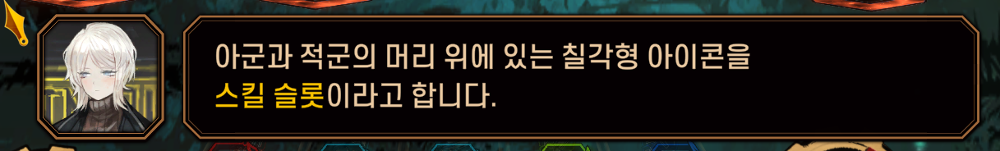

> 해당 이미지에는 게임 캐릭터의 일러스트, 게임 내 텍스트 상자와 같은 UI 요소가 포함되어 있습니다.

1. 캐릭터 일러스트

*   이미지의 왼쪽에는 게임 캐릭터의 일러스트가 있습니다. 
*   캐릭터는 흰 머리를 짧게 자른 헤어스타일을 가지고 있으며, 눈은 파란색입니다. 
*   캐릭터는 짙은색이 섞인 갈색의 터틀넥을 입고, 그 위에 검은색 옷을 입고 있습니다.

2. 텍스트 상자

*   이미지의 가운데에는 게임 내 텍스트 상자가 있습니다. 
*   텍스트 상자는 검은색이며, 테두리는 금색입니다. 
*   텍스트 상자 안에는 "아군과 적군의 머리 위에 있는 칠각형 아이콘을 스킬 슬롯이라고 합니다."라는 문구가 적혀 있습니다. 
*   문장 중 "스킬 슬롯" 부분은 노란색으로 강조 표시되어 있습니다.

3. 아이콘

*   이미지의 아래쪽에는 여러 개의 아이콘이 있습니다. 
*   아이콘은 칠각형의 형태이며, 각각 다른 색상으로 구분되어 있습니다. 
*   아이콘은 텍스트 상자의 내용과 관련이 있는 것으로 추정되며, 게임에서 스킬 슬롯을 나타내는 아이콘으로 사용될 수 있습니다.

4. 레이아웃

*   이미지의 레이아웃은 캐릭터 일러스트, 텍스트 상자, 아이콘 순으로 구성되어 있습니다. 
*   캐릭터 일러스트는 이미지의 왼쪽에 위치하고, 텍스트 상자는 이미지의 가운데에 위치합니다. 
*   아이콘은 이미지의 아래쪽에 위치하며, 여러 개가 나열되어 있습니다. 
*   레이아웃은 깔끔하고 정돈되어 있으며, 각 요소가 서로 충돌하지 않고 잘 배치되어 있습니다.

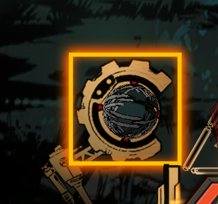

> 이미지는 게임 기획 문서의 일부로 보이는 이미지입니다. 이미지 중앙에는 노란색 사각형이 있고, 그 안에는 기어와 같은 모양의 테두리 안에 구체가 있습니다. 구체는 회색과 검은색으로 이루어져 있으며, 여러 개의 선이 교차하는 듯한 패턴이 있습니다. 구체의 표면에는 몇 개의 붉은 점이 있습니다.

노란색 사각형의 테두리는 밝은 노란색으로 강조되어 있습니다. 이미지의 오른쪽 하단에는 로봇의 팔 부분으로 보이는 금속 구조물이 있습니다. 배경은 짙은색으로, 약간의 텍스처가 있는 듯합니다.

이미지에는 텍스트가 포함되어 있지 않습니다. 전체적으로 게임의 UI 요소나 특정한 게임 메커니즘을 상징하는 아이콘처럼 보입니다.

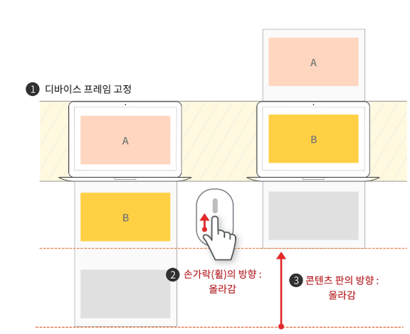

> 이 이미지는 게임 기획 문서의 일부로, 디바이스 프레임 고정과 관련된 설명을 담고 있습니다. 이미지의 레이아웃과 구조는 다음과 같습니다.

*   이미지의 상단에는 노트북 컴퓨터 두 대가 나란히 배치되어 있습니다. 왼쪽 노트북 화면에는 'A'레이블이 붙어 있고 오른쪽 노트북 화면에는 'B'레이블이 붙어 있습니다. 
*   두 노트북 아래에는 노트북을 상징하는 도형 안에 각각 노란색과 회색의 사각형이 그려져 있습니다. 
*   가운데에는 마우스 포인터 아이콘이 있고, 마우스 포인터 아래에는 빨간색의 2개의 화살표가 위로 향하는 아이콘이 있습니다. 
*   이미지 하단에는 3개의 번호가 매겨진 설명이 있습니다.

    *   1번: 디바이스 프레임 고정 
    *   2번: 손가락(월)의 방향: 올라감 
    *   3번: 콘텐츠 판의 방향: 올라감 

이러한 레이아웃과 구조를 통해 이 이미지는 디바이스 프레임 고정과 관련된 게임 기획 문서의 일부로, 디바이스의 화면이 고정되고 콘텐츠가 위로 올라가는 방향으로 이동하는 것을 설명하고 있습니다.

---

## 슬라이드 42

강조 활용 방법

튜토리얼과 같은 플레이어에게 행동을 강제해야 할 경우 사용된다.

필요한 부분만 상호작용 할 수 있게하며 불필요한 부분은 상호작용을 불가능하게 하여

딤드로 표시한다.

---
