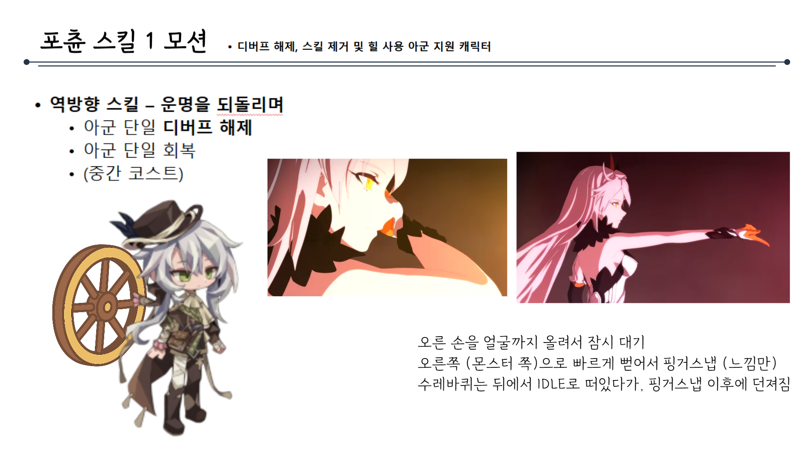
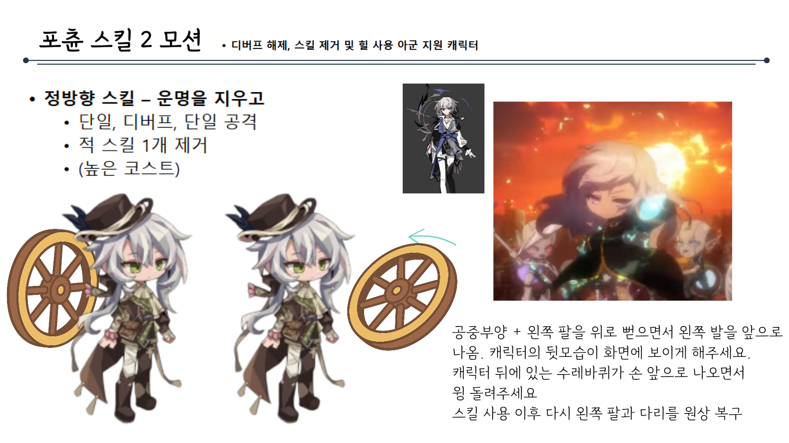
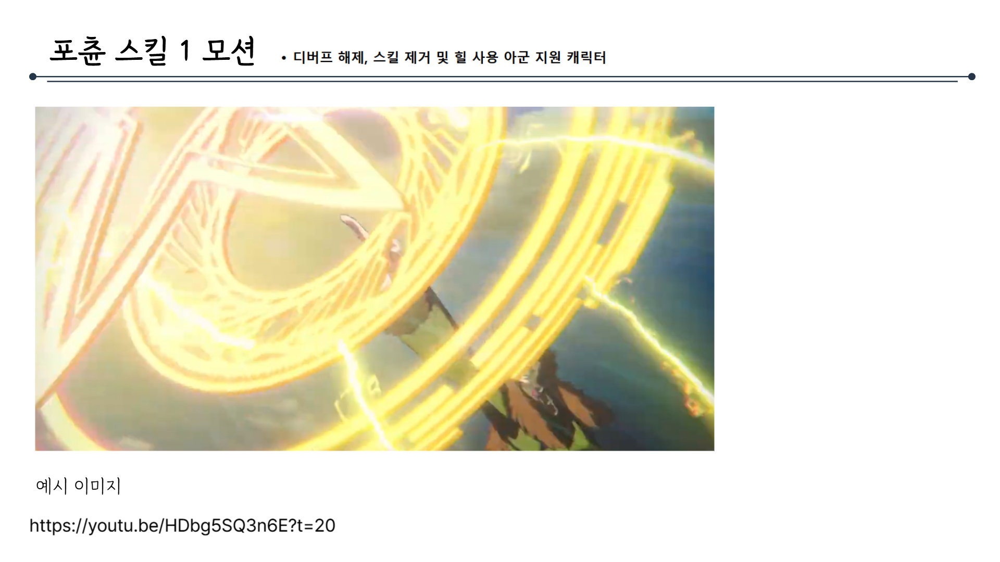
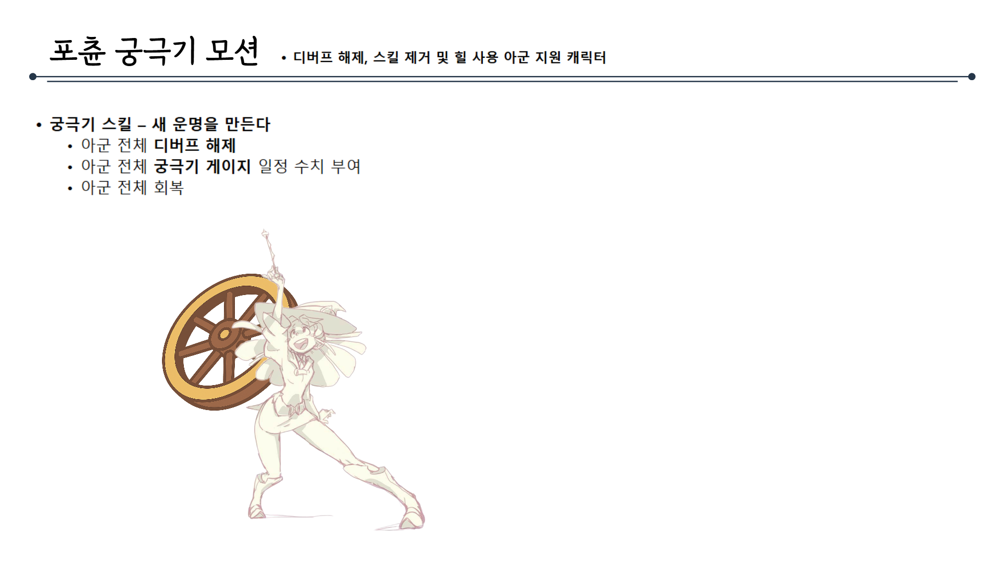
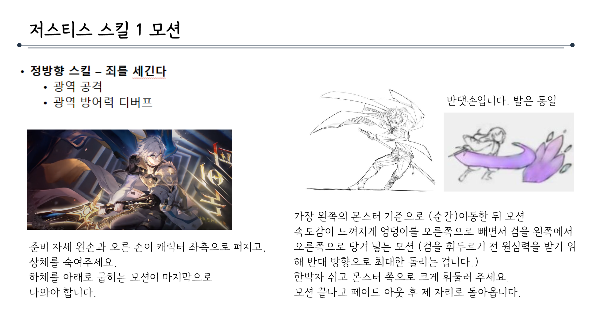
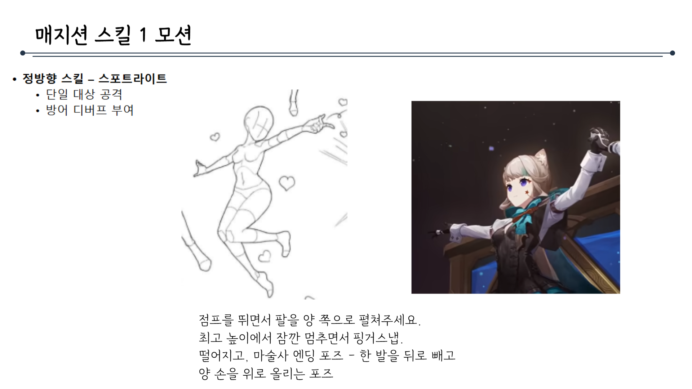
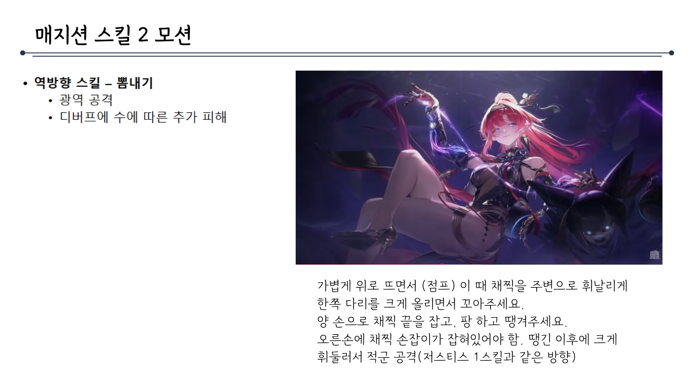
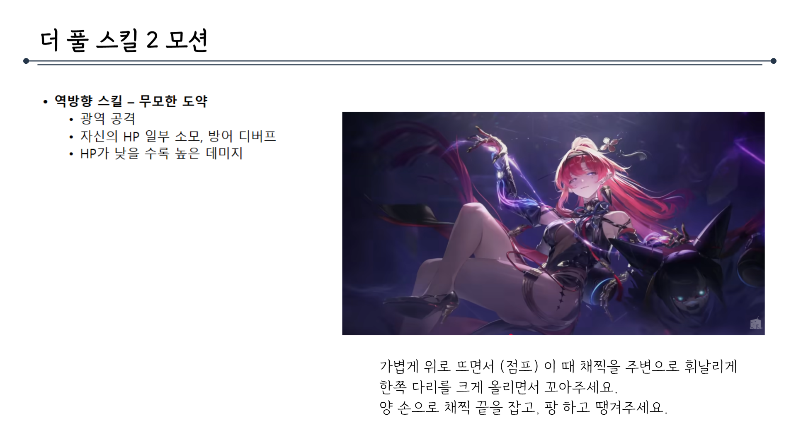

# 모션이펙트제안서_V0_김주연

## 슬라이드 1

> 이미지는 순백의 배경에 검은색 한글 텍스트가 포함되어 있습니다. 

가장 큰 폰트 사이즈로 **"컨셉 기획서"** 라는 문구가 중앙에 위치하고, 조금 더 작은 폰트 사이즈로 그 아래에 **"모션 이펙트 기획서"** 라는 문구가 위치합니다.

이미지에는 이외에 다른 시각적 레이아웃, 구조, 다이어그램, UI 요소, 캐릭터, 아이콘 등은 포함되어 있지 않습니다.

---

## 슬라이드 2

> 해당 문서에는 게임 캐릭터의 포춘 스킬 1모션에 대한 설명이 포함되어 있습니다.

문서의 구조는 다음과 같습니다.

*   문서의 제목은 포춘 스킬 1모션입니다. 
*   문서의 오른쪽 상단에는 디버프 해제, 스킬 제거 및 힐 사용 아군 지원 캐릭터라고 적혀 있습니다. 
*   왼쪽에는 게임 캐릭터의 일러스트가 있습니다. 
    *   캐릭터는 흰머리에 녹색 눈을 가지고 있습니다. 
    *   캐릭터는 카우보이 모자를 쓰고 있습니다. 
    *   캐릭터는 손에 쇠스랑을 들고 있습니다. 
    *   쇠스랑 뒤에는 바퀴가 있습니다. 
*   왼쪽에는 게임 캐릭터의 스킬에 대한 설명이 있습니다. 
    *   역방향 스킬 - 운명을 되돌리며 
    *   아군 단일 디버프 해제 
    *   아군 단일 회복 
    *   (중간 코스트) 
*   가운데와 오른쪽에는 게임 캐릭터의 포춘 스킬 1모션에 대한 설명이 있습니다. 
    *   캐릭터의 모습이 클로즈업 되어 있습니다. 
    *   캐릭터는 오른손에 불을 쥐고 있습니다. 
    *   캐릭터는 왼쪽으로 시선을 돌리고 있습니다. 
    *   오른 손을 얼굴까지 올리며 잠시 대기 
    *   오른쪽, 즉 몬스터 쪽으로 빠르게 뻗어서 핑거스냅을 합니다. 수레바퀴는 뒤에서 IDLE로 떠있다가, 핑거스냅 이후에 던져짐

---

## 슬라이드 3

> 해당 문서에는 게임 캐릭터의 스킬에 대한 기획 내용이 포함되어 있습니다. 문서의 제목은 포춘 스킬 2모션입니다. 

문서의 상단에는 타이틀과 함께 디버프 해제, 스킬 제거 및 힐 사용 아군 지원 캐릭터에 대한 설명이 포함되어 있습니다.

좌측에는 게임 캐릭터의 스킬에 대한 설명이 포함되어 있습니다. 정방향 스킬의 이름은 운명을 지우고이며, 단일, 디버프, 단일 공격, 적 스킬 1개 제거가 가능하며, 높은 코스트를 가지고 있다고 설명하고 있습니다.

좌측 하단에는 캐릭터의 모습이 2개 그려져 있습니다. 두 캐릭터 모두 하얀 머리를 가지고 있으며, 녹색 눈동자를 가지고 있습니다. 모자를 쓰고 있으며, 가방을 메고 있습니다. 캐릭터의 앞뒷면이 그려져 있습니다.

우측 상단에는 작은 이미지 창에 게임 캐릭터가 그려져 있습니다. 하얀 머리를 가지고 있으며, 눈동자는 파란색입니다. 검은색 옷을 입고 있으며, 허리춤에는 칼을 차고 있습니다.

우측 하단에는 게임 캐릭터의 전투 장면이 포함되어 있습니다. 캐릭터는 분홍색 머리를 가지고 있으며, 눈동자는 보라색입니다. 금속 갑옷을 입고 있습니다. 배경은 주황색이며, 불꽃이 터지고 있습니다. 캐릭터 뒤로 작은 캐릭터들이 그려져 있습니다.

우측 하단 하단에는 게임 캐릭터의 모션에 대한 설명이 포함되어 있습니다. 공중부양 + 왼쪽 팔을 위로 뻗으면서 왼쪽 발을 앞으로 내밉니다. 캐릭터의 뒷모습이 화면에 보이게 합니다. 캐릭터 뒤에 있는 수레바퀴가 손 앞으로 나오면서 링 돌려주십시오. 스킬 사용 이후 다시 왼쪽 팔과 다리를 원상 복구.

---

## 슬라이드 4

> 이 문서는 게임 기획 문서의 일부로, **"포춘 스킬 1 모션"**에 대한 설명입니다. 문서의 레이아웃과 구조는 다음과 같습니다.

*   **제목 영역**: 문서의 상단에는 **"포춘 스킬 1 모션"**이라는 제목이 큰 글씨로 표시되어 있습니다. 제목 오른쪽에는 작은 글씨로 **".디버프 해제, 스킬 제거 및 힐 사용 아군 지원 캐릭터"**라는 설명이 있습니다. 
*   **수평선**: 제목 아래에는 긴 수평선이 그어져 있습니다. 이 수평선은 제목과 본문 영역을 구분하는 역할을 합니다.
*   **이미지 영역**: 이미지의 중앙에는 노란색의 밝은 빛이 강조된 일러스트가 있습니다. 이 일러스트는 캐릭터가 스킬을 사용하는 모션을 표현한 것으로 보입니다. 
*   **레이아웃**: 이미지는 가로로 긴 직사각형 모양이며, 문서의 중앙에 위치해 있습니다. 
*   **텍스트 영역**: 이미지 아래에는 **"예시 이미지"**라는 문구가 있고, 그 밑에 **YouTube 링크**가 있습니다. 

    *   유튜브 링크: https://youtu.be/HDbg5SQ3n6E?t=20

이 문서는 게임의 캐릭터가 사용하는 스킬에 대한 정보를 제공하며, 이미지와 설명을 통해 스킬의 효과를 직관적으로 이해할 수 있도록 구성되어 있습니다.

---

## 슬라이드 5

> 이미지는 게임 캐릭터의 기술과 관련된 설명이 포함된 게임 기획 문서의 일부입니다.

### 이미지 내용:

1. **제목 및 설명**
   - **제목**: 포춘 궁극기 모션
   - **설명**: 디버프 해제, 스킬 재거 및 힐 사용 아군 지원 캐릭터

2. **기술 설명**
   - 궁극기 스킬: 새 운명을 만든다
     - 아군 전체 디버프 해제
     - 아군 전체 궁극기 게이지 일정 수치 부여
     - 아군 전체 회복

3. **캐릭터 일러스트**
   - 큰 수레바퀴를 들고 있는 캐릭터의 그림이 그려져 있습니다.
   - 캐릭터는 역동적인 자세로 표현되어 있으며, 수레바퀴를 들고 있는 손과 발의 움직임이 강조되어 있습니다.
   - 캐릭터의 의상은 날개가 달린 가운과 비슷한 형태로 묘사되어 있습니다.

4. **디자인 및 레이아웃**
   - 제목과 설명은 문서의 상단에 위치해 있으며, 제목과 설명 사이에 점 두 개가 선으로 연결되어 있습니다.
   - 기술 설명은 제목 아래에 글머리 기호로 나열되어 있습니다.
   - 캐릭터 일러스트는 문서의 왼쪽 하단에 배치되어 있습니다.

이 문서는 게임 내 캐릭터의 궁극기 모션과 그 효과를 설명하는 데 사용되고 있습니다. 캐릭터의 역할은 아군의 디버프를 해제하고, 궁극기 게이지를 충전하며, 회복을 제공하는 지원형 캐릭터로 설정되어 있습니다.

---

## 슬라이드 6

> 해당 문서에는 게임 내 캐릭터의 스킬 모션에 대한 설명이 포함되어 있습니다.

문서의 제목은 **저스티스 스킬 1모션**이며, 스킬명은 **정방항 스킬 - 죄를 세긴다**입니다. 이 스킬은 **광역 공격**과 **광역 방어력 디버프**의 효과가 있습니다.

문서에는 이미지 3개가 포함되어 있습니다.

*   첫 번째 이미지: 게임 내 캐릭터의 공격 모션을 캡처한 이미지입니다. 이미지 속 캐릭터는 흰머리에 금색 갑옷을 착용하고 있으며, 오른손에 빛나는 검이 있습니다. 캐릭터는 왼쪽을 향해 자세를 취하고 있습니다. 
*   두 번째 이미지: 연필로 그려진 캐릭터의 스킬 모션 그림입니다. 캐릭터는 양손에 날이 넓은 쌍검을 들고 있으며, 손가락과 손목이 강조되어 있습니다. 
*   세 번째 이미지: 연필로 그려진 여성 캐릭터가 날개와 같은 무언가를 타는 듯한 모습을 묘사한 그림입니다.

문서는 두 부분으로 나뉘며, 왼쪽에는 텍스트와 첫 번째 이미지가, 오른쪽에는 나머지 두 개의 이미지와 텍스트가 있습니다.

왼쪽의 텍스트는 다음과 같습니다.

*   **정방항 스킬 - 죄를 세긴다**
    *   광역 공격
    *   광역 방어력 디버프

준비 자세 원손과 오른 손이 캐릭터 좌측으로 펴지고, 상체를 숙여주세요. 하체를 아래로 굽히는 모션이 마지막으로 나와야 합니다.

오른쪽의 텍스트는 다음과 같습니다.

가장 원쪽의 몬스터 기준(순간)으로 이동한다. 모션 속도감이 느껴지게 엉덩이를 오른쪽으로 빼면서 검을 왼쪽에서 오른쪽으로 당겨 넣는 모션(검을 휘두르기 전 원심력을 받기 위해 반대 방향으로 최대한 돌리는 겁니다.) 한박자 쉬고 몬스터 쪽으로 크게 휘둘러 주세요. 모션 끝나고 페이드 아웃 후 제자리로 돌아옵니다.

---

## 슬라이드 7

> 해당 문서에는 게임 캐릭터의 스킬 모션에 대한 정보가 포함되어 있습니다. 문서의 제목은 '저스티스 스킬 2 모션'이며, 다음과 같은 내용이 포함되어 있습니다.

*   **텍스트**: 문서에는 여러 줄의 텍스트가 포함되어 있습니다. 첫 줄은 '저스티스 스킬 2 모션'이며, 두 번째 줄부터는 게임에서 사용되는 스킬에 대한 설명입니다. 스킬 이름은 '역방항 스킬 - 건드리 지마'이며, 이 스킬은 지정한 아군을 공격한 적에게 반격 데미지를 입히는 기능입니다. 
*   **이미지**: 문서에는 두 장의 이미지가 포함되어 있습니다. 첫 번째 이미지는 한 캐릭터의 모습이며, 두 번째 이미지는 캐릭터가 스킬을 사용하는 장면입니다.

문서의 레이아웃은 왼쪽에 이미지, 오른쪽에 텍스트가 포함된 구조입니다. 이미지는 게임 캐릭터의 모습과 스킬을 사용하는 모습을 표현하고 있으며, 텍스트는 스킬의 기능과 사용 방법을 설명합니다.

---

## 슬라이드 8

> 네, 요청하신 이미지의 내용을 상세하게 설명해 드리겠습니다.

이미지는 게임 기획 문서의 일부로 보입니다. 제목은 "저스티스 스킬 2 모션"이며, 가로로 긴 선이 제목 위쪽에 그어져 있습니다.

*   첫 번째 줄의 제목은 **저스티스 스킬 2 모션**입니다.
*   제목 아래에 점 3개로 이루어진 기호와 함께 3줄의 설명이 있습니다.
    *   첫 번째 기호는 **궁극기 - 내가 세운 정의**입니다. 
    *   두 번째 기호는 **단일 공격 HP가 일정% 이하 적에게 추가 피해**입니다. 
    *   세 번째 기호는 **해당 궁극기로 처치 시**입니다. 
        *   그 밑에 **궁극기 재사용 가능, 시전 중 발동된 공격력 강화**라고 적혀 있습니다.

이상으로 이미지의 상세한 설명을 마치겠습니다.

---

## 슬라이드 9

> 해당 문서에는 게임 내 캐릭터의 스킬 동작에 대한 설명이 포함되어 있습니다.

문서의 구조는 다음과 같습니다.

*   제목: **매지션 스킬 1 모션**
*   제목 아래에는 가로로 긴 점선이 있습니다.
*   왼쪽에는 게임 캐릭터의 동작을 묘사한 그림과 설명이 있습니다. 
    *   그림은 캐릭터의 동작을 나타내는 선과 하트가 조합된 스케치입니다. 
    *   그림의 설명은 다음과 같습니다.

        점프를 뛰면서 팔을 양쪽으로 펼쳐주세요. 최고 높이에서 잠깐 멈추면서 핑거스냅. 마술사 엔딩 포즈 - 한 발을 뒤로 빼고 양 손을 위로 올리는 포즈
*   오른쪽에는 게임 캐릭터의 실제 동작을 캡처한 사진이 있습니다.
    *   캐릭터는 하늘이나 우주를 배경으로 벽에 기대어 서 있습니다.
    *   캐릭터는 한쪽 발을 뒤로 뺀 채로 양팔을 들어 올리고 있습니다. 
*   왼쪽 상단에는 스킬에 대한 설명이 있습니다.
    *   정방향 스킬 - 스포트라이트
        *   단일 대상 공격
        *   방어 디버프 부여

---

## 슬라이드 10

> 해당 문서에는 게임 내 캐릭터의 스킬 동작과 관련된 설명이 포함되어 있습니다.

문서의 제목은 **매지션 스킬 2 모션**이며, 파란색 선이 제목 위 아래로 길게 이어져 있습니다.

좌측 상단에는 게임 캐릭터의 스킬에 대한 설명이 있습니다.

*   역방향 스킬 - 뺑내기
*   광역 공격
*   디버프에 수에 따른 추가 피해

문서의 우측에는 캐릭터의 모습이 삽입되어 있습니다. 삽입된 이미지에는 분홍색 머리를 한 여성 캐릭터가 그려져 있습니다. 여성 캐릭터는 흰색 스타킹과 높은 굽의 부츠를 착용하고 있으며, 오른손에 지팡이를 들고 있습니다. 

이미지 하단에는 캐릭터의 동작에 대한 설명이 있습니다.

*   가볍게 위로 뜨면서(점프) 이 때 채찍을 주변으로 휘날리게 한쪽 다리를 크게 올리면서 꼬아주세요.
*   양 손으로 채찍 끝을 잡고, 팡 하고 땡겨주세요.
*   오른손에 채찍 손잡이가 잡혀있어야 함. 땡긴 이후에 크게 휘둘러서 적군 공격(저스티스 1스킬과 같은 방향)

---

## 슬라이드 11

> 이미지는 게임 기획 문서의 일부로, **'더 풀 스킬 1모션'**에 대한 설명이 포함되어 있습니다.

*   레이아웃 및 구조: 페이지 상단에 **'더 풀 스킬 1모션'**이라는 큰 제목이 있고, 왼쪽에 점이 있는 긴 라인이 가로로 이어져 있습니다. 
*   왼쪽에는 세 가지 주요 항목이 있습니다. 
    *   **정방향 스킬 - 첫 가능성**
    *   **단일 공격**
    *   **시전자 디버프 수에 따라 높은 데미지**
*   페이지 하단에는 캐릭터의 동작에 대한 설명이 있습니다. 
    *   점프를 뛰면서 팔을 양쪽으로 펼쳐주세요.
    *   최고 높이에서 잠깐 멈추면서 핑거스냅.
    *   마술사 엔딩 포즈 - 한 발을 뒤로 빼고 양 손을 위로 올리는 포즈

---

## 슬라이드 12

> 해당 문서에는 게임 캐릭터의 스킬에 대한 설명이 포함되어 있습니다. 문서의 제목은 '더 풀 스킬 2모션'이며, 이미지와 함께 캐릭터의 스킬에 대한 구체적인 정보가 제공됩니다.

문서의 구조는 다음과 같습니다.

*   제목: 더 풀 스킬 2모션
*   이미지: 게임 캐릭터의 모습
*   캐릭터 설명: 이미지 아래에 위치하며, 캐릭터의 동작에 대한 설명이 포함되어 있습니다.

문서의 레이아웃은 깔끔하고 정돈되어 있으며, 이미지와 텍스트가 균형 있게 배치되어 있습니다.

### 문서에 포함된 텍스트 번역

*   더 풀 스킬 2모션
*   역방향 스킬 - 무기한 도약
    *   광역 공격
    *   자신의 HP 일부 소모, 방어 디버프
    *   HP가 낮을수록 높은 데미지
*   가볍게 위로 뜨면서(점프) 이 때 채찍을 주변으로 휘날리게 한쪽 다리를 크게 올리면서 꼬아주세요. 양 손으로 채찍 끝을 잡고, 팡 하고 땡겨주세요.

### 이미지 속 캐릭터

이미지 속 캐릭터는 여성 캐릭터로, 분홍색 머리를 가지고 있습니다. 그녀는 블랙과 레드의 섹시한 의상을 입고 있으며, 오른쪽에는 작은 날개가 달린 투구를 쓴 작은 캐릭터가 함께 그려져 있습니다. 캐릭터는 채찍을 들고 있으며, 이를 이용해 무언가를 하는 듯한 모습을 보여주고 있습니다. 배경은 보라색이며, 조명이 켜져 있어 어둡지 않은 것이 특징입니다.

---
