# 배경컨셉_V0_이채연

## 슬라이드 1

배경 컨셉

---

## 슬라이드 2

이 문서를 읽을 때..

모든 것은 수정될 수 있습니다.

궁금한 점이 있으면 언제든 담당자 이채연에게 연락 부탁드립니다. (새벽에도  OK )

이채연 010 2988 7090

---

## 슬라이드 3

메인 화면 배경 참고

실내

작전 회의 하는 공간

테이블, 책장

테이블 위에 지도

왼쪽 ld 캐릭터 배치 할 걸 상정

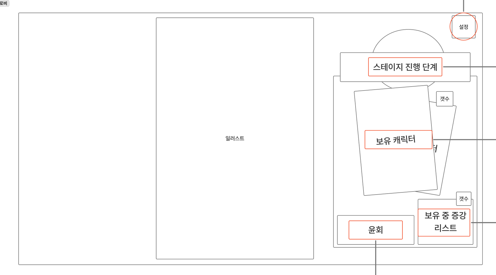

> 이 문서는 게임의 UI/UX를 설계한 와이어프레임입니다. 

왼쪽에는 게임 화면의 큰 틀을 나타내는 큰 직사각형 영역이 있습니다. 이 영역 중앙에는 '일러스트'라고 적혀 있습니다. 이는 게임의 메인 화면에 표시될 일러스트레이션을 의미하는 것으로 추정됩니다.

오른쪽 상단에는 '설정'이라는 원이 있습니다. 이는 게임의 설정 기능을 나타내는 아이콘일 수 있습니다.

오른쪽에는 여러 개의 직사각형과 선이 복잡하게 연결된 구조가 있습니다. 이 구조는 게임의 진행과 관련된 다양한 요소들을 보여 주는 것으로 보입니다.

1. **스테이지 진행 단계**: 스테이지 진행과 관련된 정보를 표시하는 영역으로 추정됩니다.
2. **보유 캐릭터**: 플레이어가 현재 보유하고 있는 캐릭터를 표시하는 영역입니다.
3. **윤희**: 특정 캐릭터의 이름일 수 있습니다. 
4. **보유 증강 리스트**: 플레이어가 보유하고 있는 증강 아이템 리스트를 표시하는 영역입니다.

이러한 요소들이 어떻게 상호작용하는지, 구체적인 기능은 무엇인지에 대한 자세한 정보는 제공되지 않았습니다. 하지만 이 와이어프레임은 게임의 핵심적인 UI 요소들을 어떻게 배치하고 구성할 것인지에 대한 초기 설계 단계를 보여 주고 있습니다.

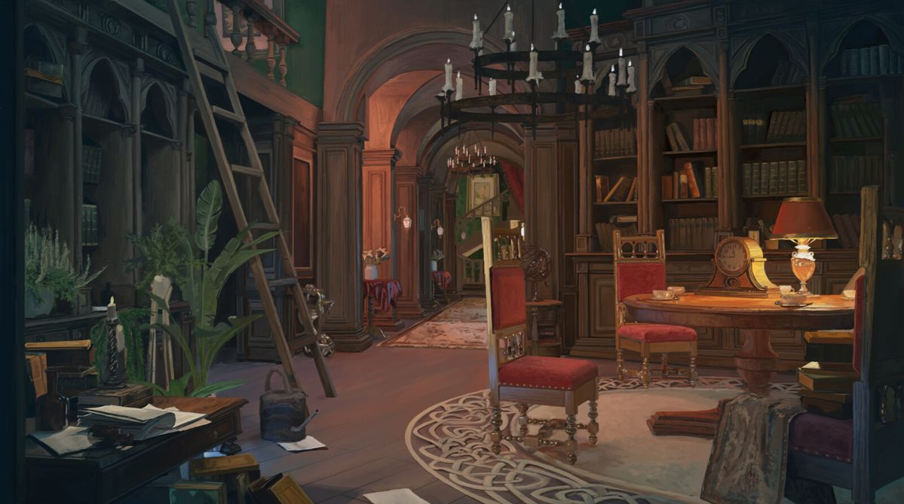

> 이미지는 오래된 도서관이나 서재와 같은 공간을 묘사하고 있습니다. 이 공간은 여러 개의 책장이 있고, 높은 층고와 아치형의 통로가 있는 넓은 공간입니다.

*   **가구 및 장식품**
    *   책상: 책상 위에는 종이, 펜, 그리고 책이 펼쳐져 있습니다. 
    *   의자: 빨간색 의자가 여러 개 보입니다. 
    *   테이블: 여러 사람이 앉을 수 있는 큰 테이블이 있습니다. 테이블 위에는 컵과 접시가 놓여 있습니다. 
    *   램프: 테이블 위에 램프가 있습니다. 
    *   시계: 벽에 걸린 시계가 보입니다. 
    *   식물: 큰 화분이 여러 개 보입니다. 
    *   사다리: 높은 곳에 있는 책을 꺼내기 위한 긴 사다리가 있습니다. 
*   **책장**
    *   책장은 여러 층으로 구성되어 있으며, 많은 책들이 꽂혀 있습니다. 
*   **조명**
    *   샹들리에: 공간 중앙에 샹들리에가 있습니다. 
    *   벽 sconce: 벽에 sconce가 있습니다. 
*   **바닥 및 벽**
    *   바닥: 바닥에는 깔개가 있습니다. 
    *   벽: 벽은 나무로 되어 있으며, 여러 개의 아치형 통로가 있습니다. 
*   **색상**
    *   전반적으로 어둡고 무거운 색상이지만, 조명으로 인해 밝은 부분도 있습니다. 

이 공간은 공부나 연구를 하기에 적합한 공간으로 보입니다.

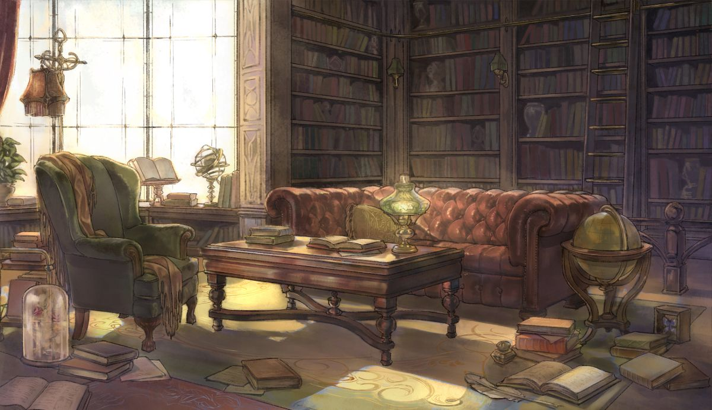

> 이미지는 풍부한 디테일과 따뜻한 조명으로 가득 찬, 오래된 도서관이나 서재를 연상케 하는 실내 공간을 묘사하고 있습니다. 이 공간은 책으로 둘러싸여 있으며, 여러 가지 장식품과 가구가 배치되어 있습니다. 

### 공간의 구성 요소:

1. **가구:**
   - **소파:** 이미지 중앙에는 고급스러운 가죽 소파가 자리 잡고 있습니다. 소파의 디자인은 전통적인 스타일로, 버튼이 달린 가죽 패턴이 특징입니다. 소파는 공간의 중심에 위치하며, 편안한 휴식 공간을 제공합니다.
   - **의자:** 소파 왼쪽에는 고급스러운 녹색 가죽 의자가 있습니다. 의자는 팔걸이가 있고, 고급스러운 천이나 가죽으로 덮여 있으며, 소파와 조화로운 분위기를 연출합니다.

2. **테이블 및 책:**
   - **커피 테이블:** 소파와 의자 사이에 나무로 된 커피 테이블이 있습니다. 테이블 위에는 여러 권의 책과 작은 오브제들이 놓여 있습니다. 테이블 아래에는 여러 권의 책이 바닥에 떨어져 있어, 이곳이 학습이나 독서를 위한 공간임을 암시합니다.
   - **책들:** 방 전체에 많은 책들이 바닥에 쌓여 있거나, 책장에 꽂혀 있습니다. 책장마다 다양한 크기와 색상의 책들이 빼곡하게 들어서 있습니다.

3. **장식품:**
   - **책장:** 벽면을 따라 여러 층으로 된 책장들이 배치되어 있습니다. 책장에는 다양한 책들이 꽂혀 있고, 일부 선반에는 장식품이나 작은 오브제들이 놓여 있습니다.
   - **램프:** 테이블 위에 아름다운 디자인된 램프가 있습니다. 램프는 공간을 따뜻하고 아늑하게 만드는 요소입니다.
   - **지구본:** 의자 옆에는 전통적인 스타일의 지구본이 있습니다. 이는 공간의 지적, 학문적인 측면을 강조하는 요소로 보입니다.

4. **창문:**
   - 큰 창문에서 밝은 햇살이 들어오고 있습니다. 햇빛이 공간을 비추며, 따뜻한 분위기를 조성하고 있습니다.

5. **기타 요소:**
   - **식물:** 창문 근처에는 작은 화분에 심긴 식물이 있어 자연의 느낌을 더하고 있습니다.
   - **유리 돔:** 바닥에는 유리 돔이 있는 작은 용기가 있습니다. 이 안에는 무엇인가 작은 물체가 들어 있는 듯합니다.

### 전체적인 분위기:
이 공간은 고요하고 편안한 분위기를 가지고 있습니다. 책과 가구의 배열이 조화롭고, 빛이 자연스럽게 들어와 따뜻한 느낌을 줍니다. 이곳은 독서나 학문적 탐구를 위한 공간으로 사용되고 있음을 알 수 있습니다.

---

## 슬라이드 4

노드 화면 배경 참고

테이블 위에 올라가 있는 타로 천(무늬o) 느낌.

노드는 타로 카드 형태나 단순 아이콘으로 표시

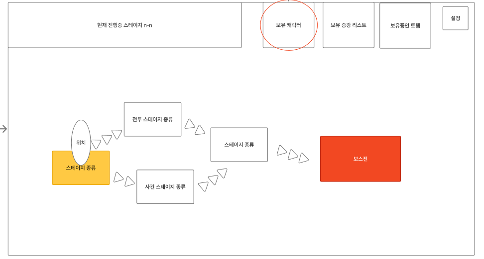

> 이미지는 게임 기획 문서의 일부로, 현재 진행 중인 스테이지의 구조를 나타내고 있습니다. 이미지의 레이아웃과 구조를 설명하면 다음과 같습니다.

*   상단에는 '현재 진행중 스테이지 n-n'이라는 텍스트가 왼쪽에 위치하고, 오른쪽에는 '보유 캐릭터', '보유 증장 리스트', '보유중인 토템', '설정'이라는 텍스트가 입력된 4개의 빈 사각형이 나란히 위치해 있습니다. 이 중에서 '보유 캐릭터' 라고 쓰인 원이 빨간색으로 강조되어 있습니다.
*   이미지의 중앙에는 여러 개의 사각형과 화살표가 있습니다. 왼쪽에는 노란색 사각형이 있고, 그 옆에는 하얀색 타원이 있습니다. 노란색 사각형 안에는 '스테이지 종류'라는 텍스트가 있고, 하얀색 타원 안에는 '위치'라는 텍스트가 있습니다. 
*   노란색 사각형과 하얀색 타원 옆에는 '진투 스테이지 종류', '사고 스테이지 종류'라는 텍스트가 입력된 두 개의 하얀색 사각형이 위치해 있습니다. 이 두 개의 사각형은 각각 노란색 사각형과 하얀색 타원과 연결되어 있습니다. 
*   두 개의 하얀색 사각형과 연결된 화살표는 중앙의 빈 사각형과 연결되어 있습니다. 빈 사각형 안에는 '스테이지 종류'라는 텍스트가 있습니다. 
*   '스테이지 종류' 사각형과 보스전으로 향하는 화살표가 있습니다. 화살표의 끝에는 '보스전'이라는 텍스트가 입력된 주황색 사각형이 있습니다.

이러한 레이아웃과 구조를 통해 게임의 진행 흐름을 보여주고 있습니다.

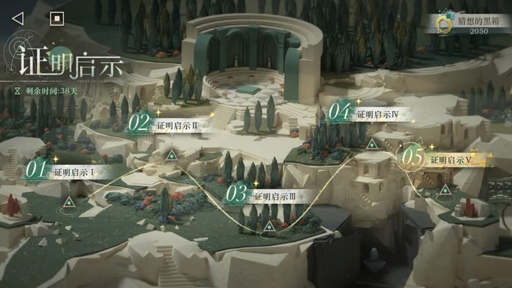

> 이미지는 게임의 맵 화면입니다. 게임 속 세계는 신비로운 분위기의 판타지 세계관으로, 흰색의 거대한 건축물들과 푸른 식물들이 어우러져 있습니다.

화면 상단 왼쪽에는 흰색의 타이포그래피로 구성된 게임의 제목과 같은 문구가 있고, 그 아래에 작은 글씨로 "구글플레이" 로고가 있습니다. 화면 상단 오른쪽에는 노란색 원과 시계가 있고 그 옆에 "2050"이라는 숫자가 있습니다.

화면 중앙에는 5개의 노드(Node)가 있습니다. 각 노드는 숫자와 함께 녹색으로 강조되어 있습니다. 노드들은 다음과 같습니다.

*   **01 증명후시 I**: 왼쪽 상단에 위치하며, 녹색으로 강조된 숫자 "01"과 함께 표시됩니다. 
*   **02 증명후시 II**: 중앙 상단에 위치하며, 녹색으로 강조된 숫자 "02"과 함께 표시됩니다. 
*   **03 증명후시 III**: 중앙 하단에 위치하며, 녹색으로 강조된 숫자 "03"과 함께 표시됩니다. 
*   **04 증명후시 IV**: 오른쪽 상단에 위치하며, 녹색으로 강조된 숫자 "04"과 함께 표시됩니다. 
*   **05 증명후시 V**: 오른쪽 하단에 위치하며, 노란색으로 강조된 숫자 "05"과 함께 표시됩니다.

각 노드 사이에는 노란색의 연결선이 그어져 있습니다. 각 노드에는 작은 삼각형 아이콘이 있습니다.

화면 왼쪽 상단에는 흰색 배경에 검은색 테두리가 있는 버튼이 두 개 있습니다. 버튼 중 왼쪽에는 뒤로가기 화살표가 있고, 오른쪽에는 정사각형 아이콘이 있습니다.

전체적으로 이 화면은 게임의 진행 상황을 보여주는 맵으로, 플레이어가 현재 어느 위치에 있는지, 그리고 다음에 어디로 이동해야 하는지 알 수 있도록 설계되어 있습니다.

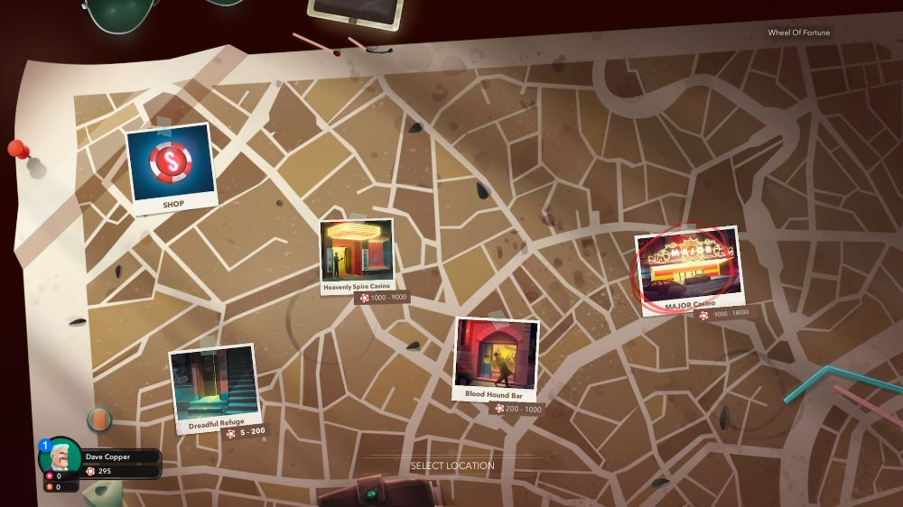

> 이미지는 게임의 맵 화면을 보여주고 있습니다. 이 화면은 여러 위치를 표시한 지도와 플레이어의 현재 상태를 나타내는 정보를 포함하고 있습니다. 

화면의 중앙에는 여러 장소가 표시된 지도가 있습니다. 지도는 갈색 배경에 흰색 선으로 도로가 표시되어 있습니다. 지도에는 여러 위치가 표시되어 있습니다. 각 위치는 사진과 이름, 그리고 숫자로 된 설명이 포함되어 있습니다.

위치는 다음과 같습니다.

*   상점: 사진 속에는 하얀색 테두리의 사각형 안에 하얀색 달러 기호가 새겨진 빨간색과 하얀색의 구가 있고 그 밑에는 'SHOP'이라는 단어가 있습니다. 
*   Dreadful Refuge: 왼쪽 하단부에 위치하며, 계단이 있는 방으로 구성되어 있습니다. 설명에는 배팅 금액의 범위가 5\~200으로 표시되어 있습니다. 
*   Heavenly Spire Casino: 중앙 상단부에 위치하며, 노란색의 둥근 형태의 조명이 있는 방으로 구성되어 있습니다. 설명에는 배팅 금액의 범위가 1000\~3000으로 표시되어 있습니다. 
*   Blood Hound Bar: 중앙에 위치하며, 분홍색 벽과 아치형 출입구로 구성되어 있습니다. 설명에는 배팅 금액의 범위가 200\~1000으로 표시되어 있습니다. 
*   Major Casino: 오른쪽 상단부에 위치하며, 여러 개의 슬롯머신이 있는 방으로 구성되어 있습니다. 설명에는 배팅 금액의 범위가 3000\~8000으로 표시되어 있습니다. 

화면의 왼쪽 하단부에는 플레이어의 정보가 표시되어 있습니다. 플레이어의 이름은 'Dave Copper'로, 그의 프로필 사진과 함께 표시되어 있습니다. 플레이어의 돈은 295로 표시되어 있습니다. 

화면의 중앙 하단부에는 'SELECT LOCATION'이라는 단어가 표시되어 있습니다. 이는 플레이어가 원하는 장소를 선택할 수 있는 버튼으로 추정됩니다.

화면의 오른쪽 하단부에는 여러 색깔의 선이 표시되어 있습니다. 이는 지도상의 길 또는 경로로 추정됩니다.

화면의 상단부에는 여러 물건이 표시되어 있습니다. 구체적으로 안경과 휴대전화가 보입니다. 이는 플레이어의 아이템 또는 도구로 추정됩니다.

화면의 오른쪽 상단부에는 'Wheel Of Fortune'이라는 단어가 표시되어 있습니다. 이는 게임의 이름 또는 기능으로 추정됩니다.

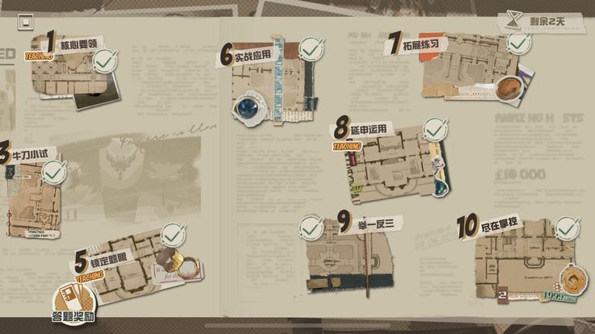

> 이미지는 게임 기획 문서의 일부로, 여러 번호가 매겨진 구역과 각 구역에 대한 설명이 포함된 도면이 표시되어 있습니다. 이미지를 상세하게 분석해 보겠습니다.

### **이미지 레이아웃 및 구조**

이미지는 여러 구역으로 나뉘어져 있으며, 각 구역에는 번호와 설명, 그리고 체크 표시가 포함된 원이 있습니다. 배경은 오래된 종이 문서를 연상케 하는 질감과 색상으로 디자인되어 있습니다.

### **세부 요소 설명**

1. **번호 및 도면**
   - 각 구역은 **1부터 10까지의 번호**가 매겨져 있으며, 번호 옆에는 해당 구역의 도면이 있습니다.
   - 도면은 **건물 내부의 구조**를 나타내고 있으며, 벽, 방, 통로 등이 표시되어 있습니다.

2. **체크 표시**
   - 각 도면의 구석에는 **체크 표시가 포함된 원**이 있습니다. 이는 완료 여부를 나타내는 아이콘으로 보입니다.

3. **텍스트 설명**
   - 각 구역에는 **한국어로 번역하면 '수련 연습', '실전 응용', '추격전', '연기 연습' 등** 다양한 활동이나 미션을 암시하는 설명이 포함되어 있습니다.
   - 일부 텍스트는 **주황색, 녹색, 흰색 등 강조된 색상**으로 표시되어 있습니다.

4. **아이콘 및 그래픽 요소**
   - 도면에는 **다양한 아이콘**이 포함되어 있으며, 이는 특정 활동이나 오브젝트를 나타낼 수 있습니다.
   - 예를 들어, **1번 구역에는 컵 모양의 아이콘**, **5번 구역에는 오븐과 프라이팬이 있는 아이콘**이 있습니다.

5. **배경**
   - 배경은 **오래된 책이나 문서의 질감**을 연상케 하며, **페이드된 텍스트와 이미지**가 포함되어 있습니다.

### **종합 분석**

- 이 이미지는 **게임의 미션, 레벨, 혹은 스토리 진행**과 관련된 맵 또는 플로우차트처럼 보입니다.
- 각 구역은 **특정 활동이나 미션을 수행하는 공간**으로 설정된 것으로 추정되며, 플레이어는 각 구역을 탐색하고 완료해야 할 수 있습니다.
- 체크 표시가 완료된 상태로 보아, **이미 완료된 미션 또는 레벨 진행 상황**을 보여줄 가능성도 있습니다.

이 이미지는 게임 개발을 위한 **기획 문서의 일부**로 사용될 가능성이 크며, 개발자가 레벨 디자인, 미션 구조, 게임 진행 흐름을 정리하기 위해 활용할 수 있는 자료로 보입니다.

---

## 슬라이드 5

뷰 참고

> 이미지는 게임 화면입니다. 

상단 왼쪽에는 동그란 프로필 사진이 있고 그 옆에 하트 모양의 아이콘 3개가 있습니다. 

그 밑에는 다이아몬드 모양의 아이콘에 별이 그려진 아이콘이 있습니다. 

화면 상단에는 체력 게이지 모양의 붉은색 긴 바가 있고, 그 오른쪽에는 숫자와 동그란 원이 있습니다. 

화면 왼쪽에는 'Excellent!'라고 쓰여 있고, 그 밑에는 '687★'라고 쓰여 있습니다. 

화면 중앙에는 노란색 말풍선에 '죽어라!'라고 적혀 있습니다. 

화면 중앙 하단에는 작은 캐릭터가 있고 그 옆에 큰 캐릭터가 무기를 들고 있습니다. 

화면 하단 왼쪽에는 가로로 된 파란색 바가 있습니다. 

화면 배경에는 파괴된 듯한 건물과 불타는 석상들이 있습니다. 

오른쪽 하단에는 횃불이 있습니다. 

전체적으로 게임의 전투 장면으로 보입니다.

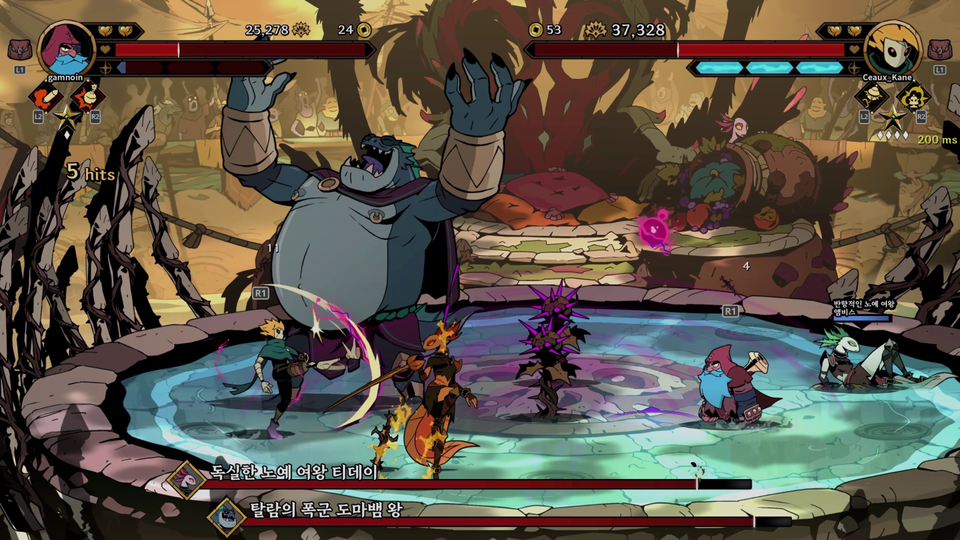

> 이미지는 게임의 한 장면을 보여 주고 있습니다. 

### 이미지 레이아웃

이미지는 게임 화면을 담고 있으며, 여러 캐릭터와 UI 요소가 포함되어 있습니다. 

*   화면 상단에는 플레이어의 정보가 표시된 영역이 있습니다. 
*   화면 중앙에는 여러 캐릭터가 전투를 벌이고 있습니다. 
*   화면 하단에는 게임과 관련된 정보가 표시된 영역이 있습니다.

### UI 요소

*   **캐릭터 정보 영역**: 화면 상단에는 플레이어의 정보가 표시된 영역이 있습니다. 이 영역에는 플레이어의 프로필, 레벨, HP, 골드 등이 표시되어 있습니다. 
    *   **플레이어 프로필**: 이미지의 왼쪽 상단에는 플레이어의 프로필이 표시되어 있습니다. 프로필에는 플레이어의 캐릭터 이미지, 이름, 레벨 등이 표시되어 있습니다. 
    *   플레이어의 HP: 플레이어의 HP는 화면 상단에 빨간색으로 표시되어 있습니다. 
    *   플레이어의 골드: 플레이어의 골드는 화면 상단에 노란색으로 표시되어 있습니다. 
*   **경험치바**: 플레이어의 경험치바가 화면 상단에 파란색으로 표시되어 있습니다. 
*   **적 정보**: 화면 상단 오른쪽에는 상대 플레이어의 정보가 표시되어 있습니다. 상대 플레이어의 프로필, 핑, 등이 표시되어 있습니다. 
*   **공격 횟수**: 화면 왼쪽 상단에는 플레이어의 공격 횟수가 표시되어 있습니다. 
*   **채팅 입력란**: 화면 오른쪽 상단에는 채팅 입력란이 있습니다. 
*   **게임 정보**: 화면 하단에는 게임과 관련된 정보가 표시된 영역이 있습니다. 이 영역에는 한국어 텍스트가 표시되어 있습니다.

### 캐릭터

*   화면 중앙에는 여러 캐릭터가 있습니다. 
    *   큰 캐릭터: 화면 중앙에는 큰 캐릭터가 있습니다. 이 캐릭터는 몬스터로 보입니다. 
    *   작은 캐릭터들: 이 몬스터를 중심으로 여러 작은 캐릭터들이 전투를 벌이고 있습니다. 

### 아이콘

*   화면 상단에는 여러 아이콘이 있습니다. 
    *   플레이어의 프로필 아이콘
    *   레벨 아이콘
    *   HP 아이콘
    *   골드 아이콘
    *   경험치바
    *   상대 플레이어의 프로필 아이콘
    *   상대 플레이어의 핑 아이콘

### 배경

*   배경에는 게임의 환경을 나타내는 그래픽이 있습니다. 

### 텍스트

*   화면에는 여러 텍스트가 있습니다. 
    *   플레이어의 이름: 화면 왼쪽 상단에는 플레이어의 이름이 표시되어 있습니다. 
    *   상대 플레이어의 이름: 화면 오른쪽 상단에는 상대 플레이어의 이름이 표시되어 있습니다. 
    *   한국어 텍스트: 화면 하단에는 한국어 텍스트가 표시되어 있습니다.

> 이미지는 게임의 한 장면을 보여 주고 있습니다. 

### 이미지의 구성 요소

*   화면 상단 왼쪽에는 캐릭터의 정보가 표시된 영역이 있습니다. 
*   캐릭터의 프로필 아이콘과 체력, 골드 등이 표시되어 있습니다. 
*   캐릭터의 프로필 아이콘은 녹색과 핑크색의 무늬가 있는 모자를 쓴 캐릭터의 모습입니다. 
*   체력 표시 줄은 빨간색이며, 그 옆에 체력 수치가 8,538로 표시되어 있습니다. 
*   그 옆에는 골드 동전 아이콘과 함께 20이라는 숫자가 표시되어 있습니다. 
*   화면 상단 왼쪽에는 네모 모양의 아이콘 4개가 있습니다. 
*   위쪽에 있는 아이콘은 하트 2개와 별이 그려진 아이콘입니다. 
*   아래쪽에 있는 아이콘은 하트, 별, Q가 적혀 있는 아이콘입니다. 
*   화면 중앙에는 큰 괭이가 있고 그 뒤로는 테이블이 있습니다. 
*   테이블 위에는 코인과 동전이 가득 놓여 있습니다. 
*   테이블 아래에는 통이 하나 놓여 있고 그 앞에는 로봇이 앉아 있습니다. 
*   로봇은 흰색이며 눈이 크고 검은 선으로 표현된 입을 가지고 있습니다. 
*   로봇은 큰 괭이를 잡고 있습니다. 
*   화면 왼쪽에는 여러 개의 기둥이 있고, 그 뒤로는 불이 활활 타오르는 모습이 보입니다. 
*   화면 오른쪽에는 벽이 있고, 그 앞에는 기둥이 있습니다. 
*   화면 중앙의 바닥에는 돌로 된 타일이 깔려 있습니다. 
*   화면 왼쪽에는 동전이 가득 쌓여 있습니다. 

### 이미지의 레이아웃

*   이미지는 게임의 한 장면을 보여 주고 있습니다. 
*   화면 상단 왼쪽에는 캐릭터의 정보가 표시된 영역이 있습니다. 
*   화면 중앙에는 큰 괭이와 테이블, 로봇이 있습니다. 
*   화면 왼쪽에는 기둥과 불이 타오르는 모습이 있습니다. 
*   화면 오른쪽에는 벽과 기둥이 있습니다. 
*   화면 중앙의 바닥에는 돌로 된 타일이 깔려 있습니다. 
*   화면 왼쪽에는 동전이 가득 쌓여 있습니다. 

### 이미지의 분위기

*   이미지는 어둡고 무거운 분위기를 가지고 있습니다. 
*   화면 중앙의 불이 타오르는 모습과 로봇의 모습이 조화되어 우울한 분위기를 연출합니다. 
*   화면 상단 왼쪽의 캐릭터 정보 영역은 게임의 진행 상황을 보여 주는 중요한 요소입니다. 
*   이미지는 게임의 한 장면을 보여 주는 것으로, 게임의 분위기와 상황을 파악하는 데 도움이 됩니다.

---

## 슬라이드 6

채색법

리버스1999 배경 참고

약 수분화

밟고 있는 배경 / 뒷 배경

레이어 나눠서 작업

앞쪽 프레임은 거의 안 움직임

채도 고정 명도 조절

색이 너무 다양하지 않게

메인 컬러 9 / 포인트 컬러 1

> 이미지는 실내 공간의 3D 렌더링 이미지입니다. 이 공간은 여러 개의 큰 창문으로 구성되어 있으며, 그 앞에는 다양한 식물들과 가구들이 배치되어 있습니다.

*   **창문:**
    *   이미지의 뒷벽을 대부분 차지하고 있는 큰 창문으로 구성되어 있습니다. 창문은 여러 개의 작은 유리창으로 나누어져 있으며, 밖은 숲과 같은 자연경관이 비치고 있습니다. 
    *   창문은 공간의 분위기를 밝고 환기 좋게 만들어 주는 요소로, 햇빛이 실내로 들어올 수 있게 합니다.

*   **식물:**
    *   공간 곳곳에 다양한 크기와 종류의 식물들이 배치되어 있습니다. 
    *   큰 화분부터 작은 화분까지 다양한 크기의 화분이 있으며, 일부 식물은 벽에 매달려 있거나 벽면을 따라 배치되어 있습니다.

*   **가구:**
    *   소파, 테이블, 의자 등이 배치되어 있습니다. 
    *   가구는 현대적이고 심플한 디자인의 것들이며, 편안한 휴식 공간을 조성하고 있습니다.

*   **조명:**
    *   2개의 벽면에 매달린 스탠드가 있습니다. 
    *   조명은 전체적으로 밝은 편은 아니지만, 각 영역을 적절하게 비추고 있습니다.

*   **바닥:**
    *   바닥은 광택이 나는 타일로 되어 있습니다. 
    *   바닥의 빛 반사로 인해 공간이 더 넓어 보이는 효과가 있습니다.

*   **벽:**
    *   벽면은 책으로 가득한 책장이 양쪽에 있습니다. 
    *   벽에는 그림 액자가 몇 군데에 배치되어 있습니다.

*   **공간의 분위기:**
    *   전반적으로 조도가 낮고, 햇빛이 드문드문 비추고 있어 다소 어둡지만, 식물과 가구들이 조화롭게 배치되어 있어 편안하고 아늑한 분위기를 조성하고 있습니다. 
    *   이 공간은 휴식이나 독서를 위한 공간으로 활용될 수 있습니다.

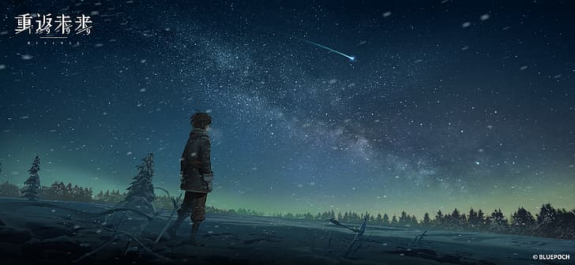

> 해당 이미지는 게임의 홍보용 이미지로 추정되며, 게임의 분위기를 상징하는 듯한 한 캐릭터와 배경으로 구성되어 있습니다.

이미지의 상단 왼쪽에는 흰색의 한자가 적혀있습니다. 위에서부터 아래로 **重返**과 **深渊**이라는 한자가 적혀있으며, **重返**과 **深渊** 사이에 **BLUEPOCH**이라는 영어 단어가 있습니다. 

이미지의 오른쪽 하단에는 **© BLUEPOCH**이라는 문구가 작게 적혀있습니다.

이미지의 중앙에는 눈밭에 홀로 서 있는 한 캐릭터가 있습니다. 캐릭터는 짙은 회색과 남색이 섞인 옷을 입고 있으며, 등에 무언가를 메고 있습니다. 캐릭터의 머리는 짧은 편이며, 머리카락은 남색에 가깝습니다. 캐릭터의 오른쪽에는 부러진 나무가 눈밭에 쓰러져 있습니다.

배경으로는 눈이 내리는 밤하늘이 있습니다. 밤하늘에는 수많은 별이 있으며, 은하수가 보입니다. 또한, 유성이 떨어지고 있습니다. 눈밭의 왼쪽과 오른쪽으로는 여러 나무들이 보입니다. 

전체적으로 감동적인 느낌을 주는 이미지입니다.

---

## 슬라이드 7

1스테이지 전투 노드 배경

꽃밭의 정원에서 열리는 티파티.

저지먼트가 있는 법정까지 가기 위한 중간 과정

맨 뒤쪽에 법정 외관이 흐리게 보여도 좋을 듯

정원에 퍼져있는 꽃은 노란 장미들로 부탁합니다.

장미, 테이블 보, 금빛 차를 제외하고는 채도를 확 낮춰 거의 회색으로 처리

차 관련된 조형물 (이상한 나라의 앨리스 참조)

하트 여왕 같은 느낌

붉은 빛 테이블 보, 금빛 차

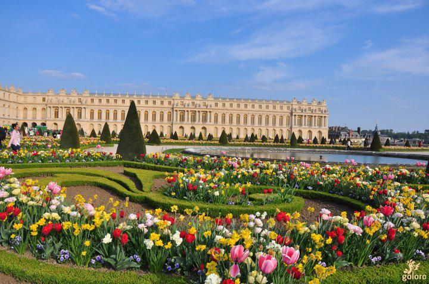

> 해당 이미지에는 텍스트가 포함되어 있지 않습니다.

시각적 레이아웃과 구조를 설명하면 다음과 같습니다.

*   이미지 중앙에는 분홍색, 노란색, 하얀색, 빨간색 등 다양한 색깔의 꽃들이 정원에 가득 피어 있습니다. 
*   이미지 왼쪽에는 커다란 하얀색의 궁전과 연못이 보입니다. 
*   궁전 앞 정원에는 여러 모양으로 예쁘게 잘린 녹색의 잔디가 보입니다. 
*   궁전의 뒷배경에는 하늘이 있으며, 구름이 조금 보입니다. 
*   이미지 오른쪽 하단에는 노란색의 로고가 있습니다.

> 이미지는 여러 가지 디저트가 혼합된 사진입니다.

중앙에는 하트 모양의 접시에 여러 가지 색깔의 젤리 같은 음식이 가득 담겨 있습니다. 이 접시의 왼쪽에는 아이스크림 한 스쿱이 보입니다. 이 아이스크림은 크림색이며, 표면에 빨간색의 작은 과일이 여러 개 뿌려져 있습니다. 이 아이스크림이 담긴 접시의 왼쪽에는 작은 파이 형태의 디저트가 여러 개 담긴 원형 접시가 보입니다. 

중앙의 하트 모양 접시의 오른쪽에는 금색 손잡이가 달린 흰색 컵이 보입니다. 이 컵 안에는 포크가 하나 들어가 있습니다. 이 컵의 아래에는 작은 접시가 하나 더 놓여 있습니다.

중앙의 하트 모양 접시의 왼쪽 상단에는 흰색 주전자와 작은 컵이 보입니다. 주전자의 오른쪽에는 아이스크림 한 스쿱이 담긴 작은 컵이 보입니다. 주전자의 왼쪽에는 작은 컵이 하나 더 보입니다.

이미지의 중앙에는 하트 모양의 접시와 컵, 접시들이 여러 개 보입니다. 모든 컵과 접시는 흰색이며, 초콜릿이 흘러나오고 있습니다. 컵과 접시는 모두 공중에 떠 있는 것처럼 보입니다. 배경은 짙은 갈색이며, 컵과 접시, 음식들은 가는 철사로 묶여 있는 것처럼 보입니다.

> 이미지는 분홍색 테이블 위의 차 컵과 주전자 탑을 보여줍니다. 

이미지 중앙에는 다양한 크기와 디자인의 차 컵과 접시가 여러 겹으로 쌓여 있습니다. 각 층마다 다른 패턴과 색상의 컵과 접시가 어우러져 있어 화려하고 독특한 구성을 이룹니다. 

컵과 접시들은 불안정하게 높이 쌓여 있으며, 일부 컵에서는 차가 쏟아지고 있습니다. 

분홍색 테이블의 왼쪽과 오른쪽에는 금색 기둥과 하얀 로프가 설치되어 있습니다.

배경에는 벽돌 벽과 진한 빨간색 커튼이 있습니다. 

이미지에는 텍스트가 포함되어 있지 않습니다.

---

## 슬라이드 8

1스테이지 중간 보스 노드 배경

붉은 색, 금색 기반 화려한 법정

정의의 여신 조각상이 배치되었으면 합니다.

조각상은 눈을 가리지 않고, 저울이 한쪽으로 과하게 기울어진 형태.

맨 뒤에 개 큰 저울 둬주세요

저울, 여신 예시 사진

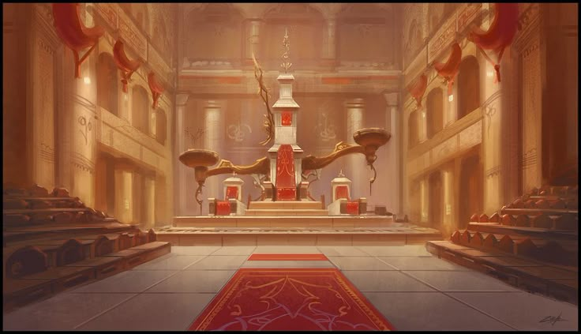

> 이미지는 고풍스러운 건축물이 있는 방을 묘사하고 있습니다. 이미지 중앙에는 붉은 색상의 깔개가 바닥에 깔려져 있고, 깔개 중앙에는 하얀색과 붉은색으로 이루어진 탑이 있습니다. 탑의 좌측과 우측에는 동일한 모양의 하얀색과 붉은색으로 이루어진 구조물이 있고, 구조물 위에는 횃불이 올려져 있습니다. 

구조물의 뒤로는 하얀색의 벽면에 무늬가 새겨져 있고, 벽면 좌측과 우측에는 기둥이 일렬로 세워져 있습니다. 기둥 앞쪽에는 좌석이 층을 이루며 배치되어 있습니다. 방의 벽면에는 붉은색의 둥근 형태의 장식품이 일정한 간격으로 배치되어 있습니다. 방의 바닥은 회색 타일로 이루어져 있습니다. 이미지의 전반적인 색조는 황금빛입니다.

> 이미지는 금색으로 만들어진 고전적인 디자인의 저울을 보여 주고 있습니다. 저울은 두 개의 접시와 금속 체인 그리고 화려한 금속 조각으로 장식된 받침대를 가지고 있습니다. 

이미지 중앙에 위치한 기둥은 투명한 유리 또는 수정처럼 생긴 장식품으로 장식되어 있습니다. 

저울의 왼쪽과 오른쪽에는 각각 금속으로 된 접시가 체인에 의해 매달려 있습니다. 

저울은 나무로 된 테이블 위에 놓여 있으며, 배경에는 흰색 벽이 있습니다. 

이미지에는 텍스트, 다이어그램, UI 요소, 캐릭터 또는 아이콘 등이 포함되어 있지 않습니다.

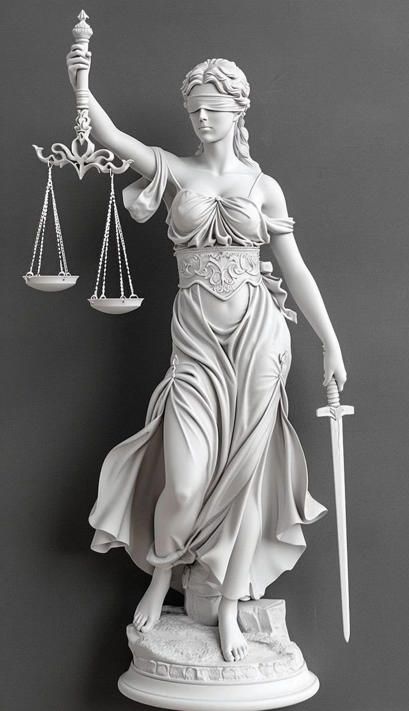

> 이미지는 정의의 여신상을 묘사하고 있습니다. 

정의의 여신상은 눈을 가린 모습으로, 한 손에는 저울을 들고 다른 한 손에는 검을 들고 있습니다. 

여신상의 머리는 단발머리이고, 가슴이 노출된 옷을 입고 있습니다. 

여신상의 옷은 허리 부분이 묶여 있고, 치마 부분은 여러 겹으로 표현되어 있습니다. 

여신상의 왼쪽 발은 뒤로 젖혀져 있고, 오른쪽 발은 앞으로 내민 자세로 있습니다. 

여신상의 뒤에는 검은 배경이 있습니다. 

전체적으로 정의의 여신상은 공정함과 정의를 상징하는 모습으로 표현되어 있습니다.

---

## 슬라이드 9

오른쪽 끝에 앉아있는 보스(엠페러)를

비추는 빛이 있으면 좋겠다.

앞쪽 프레임으로 찢어진 깃발

벽걸이 전등 정도 실루엣으로 표현

왕국 1

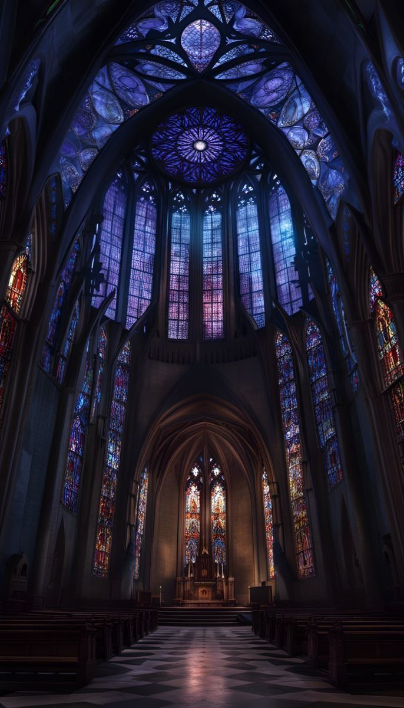

> 이미지는 고딕 건축 양식의 화려한 스테인드글라스 창문으로 장식된 교회의 내부를 묘사하고 있습니다. 높은 첨탑과 아치형 천장이 있는 긴 중앙 통로가 바닥의 검은색과 흰색 타일 위로 확장되어 있습니다. 

*   교회의 중앙에는 긴 통로를 따라 뻗어 있는 나무로 된 긴 벤치(의자)들이 양쪽에 줄지어 있습니다. 
*   벤치의 중앙에는 스테인드글라스 창문 아래에 위치한 제단이 있습니다. 
*   벽을 따라 여러 개의 스테인드글라스 창문이 있고, 그 위로는 높은 첨탑이 있는 대형 원형 창문이 있습니다. 
*   스테인드글라스 창문은 보라색, 파란색, 빨간색, 노란색 등 다양한 색상으로 빛나고 있습니다. 
*   바닥에 반사된 빛과 함께 내부가 아름답게 표현되어 있습니다. 
*   이 장소는 엄숙하고 고요한 분위기를 가지고 있어 신자들이 기도하거나 예배를 드리는 공간으로 사용됩니다. 
*   이미지는 게임 기획 문서의 일부로, 게임 속 장소의 분위기를 설정하는 데 사용될 수 있습니다.

> 이미지는 게임의 한 장면으로, 어둡고 신비로운 밤의 도시 풍경을 배경으로 합니다. 화면 상단에는 다양한 아이콘과 텍스트가 표시되어 있습니다.

*   화면 상단 왼쪽에는 둥근 모양의 아이콘과 함께 4개의 해골 아이콘이 있습니다. 그 옆에는 꽃과 숫자가 있습니다. 
*   화면 중앙에는 하얀색의 선으로 그려진 장식품이 있고 그 중앙에 한자로된 큰 텍스트가 있습니다. 
*   화면 중앙에는 작은 캐릭터가 서 있습니다.
*   화면 하단에는 다리가 있습니다.

---
