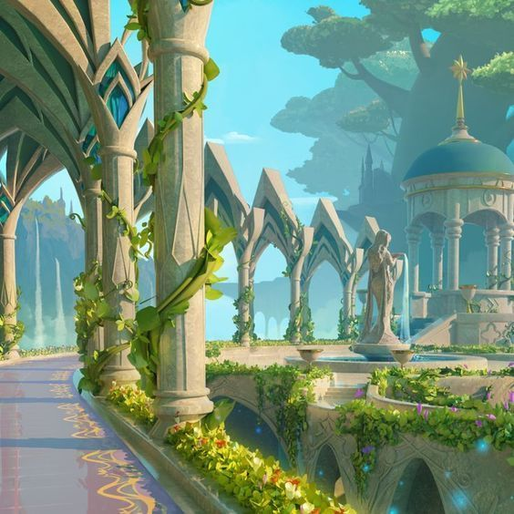
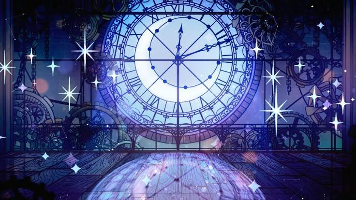
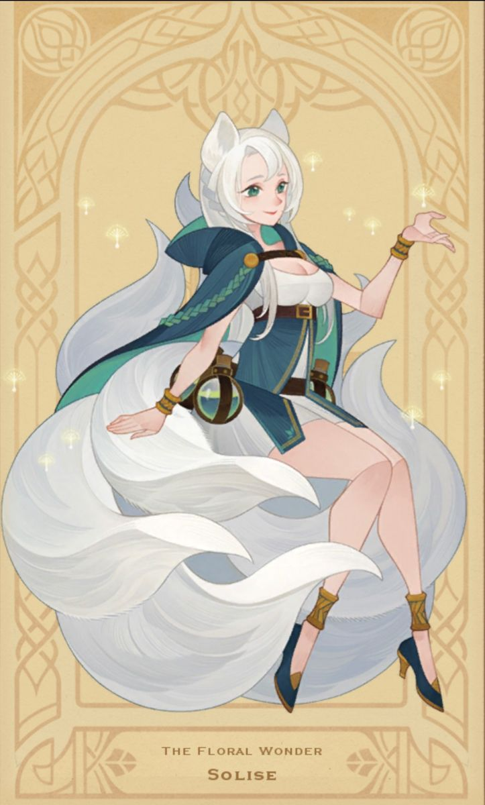
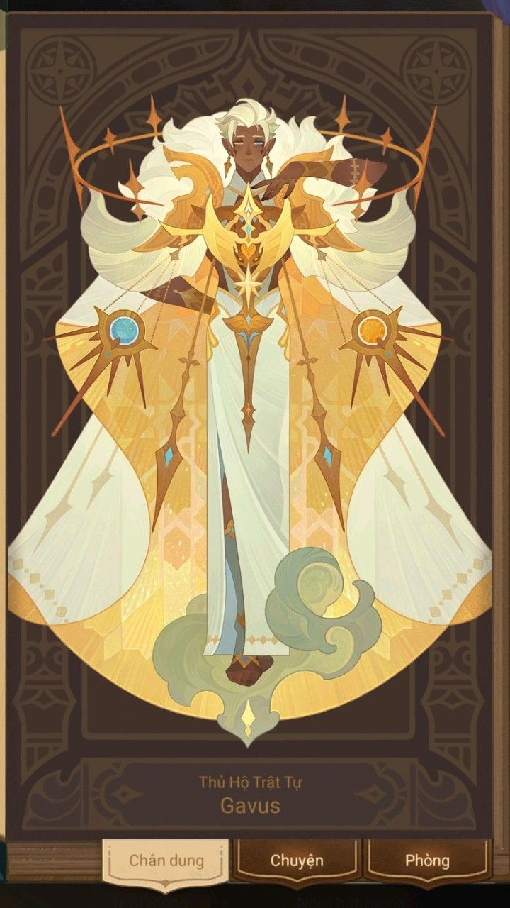
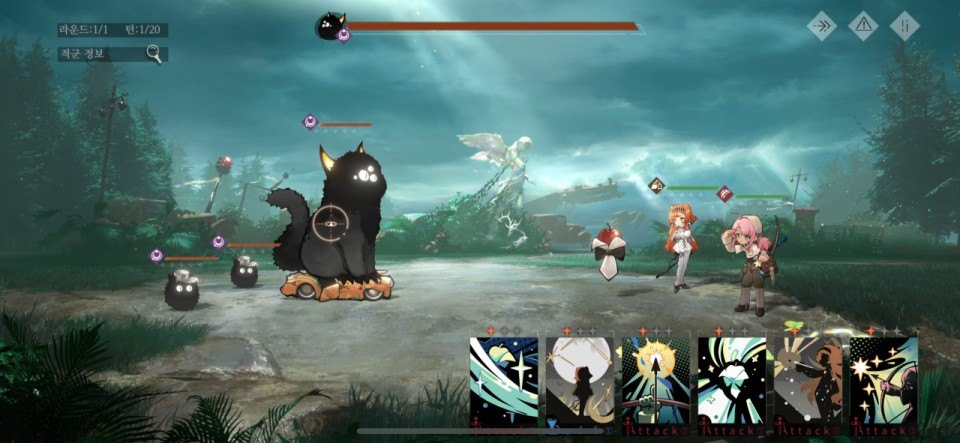
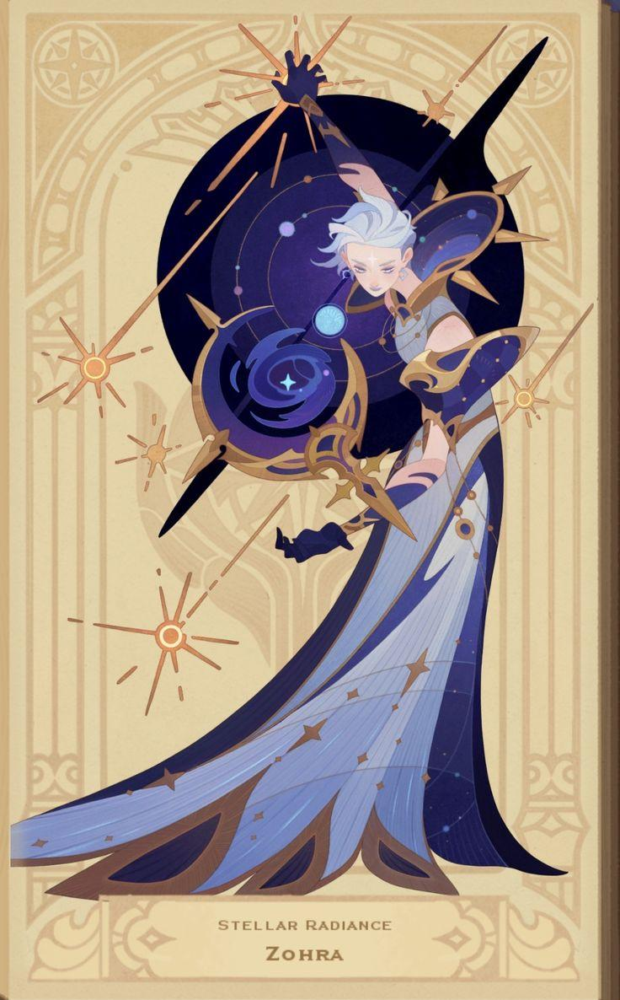
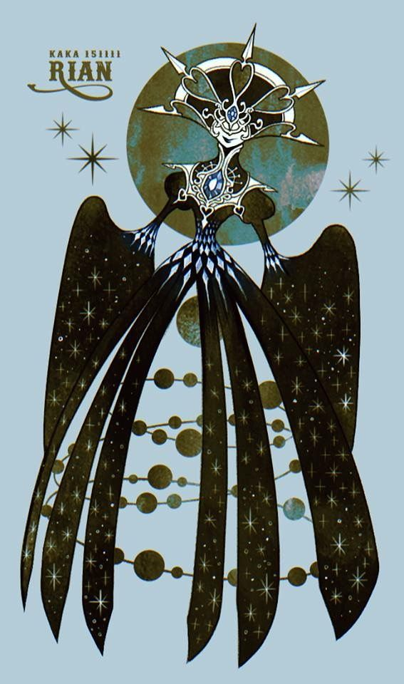

# 아트컨셉_V1_이채연

## 슬라이드 1

아트 컨셉

---

## 슬라이드 2

이 문서를 읽을 때..

모든 것은 수정될 수 있습니다.

궁금한 점이 있으면 언제든 담당자 이채연에게 연락 부탁드립니다. (새벽에도  OK )

이채연 010 2988 7090

---

## 슬라이드 3

1-1. 배경(초반)

#### 초반부에는 종교적 색체가 간접적으로만 드러남.

#### 좀 더 모험, 자연스러운 느낌

#### 전투 필드

> 이미지는 게임의 한 장면으로 추정되며, 다음과 같은 요소들을 포함하고 있습니다.

*   배경: 푸른 하늘과 하얀 구름, 그리고 먼 산들이 보입니다. 
*   바닥: 돌로 만들어진 바닥이며, 곳곳에 녹색의 풀들이 자라고 있습니다.
*   중앙: 바닥 중앙에는 원형의 금속판이 있습니다. 
*   왼쪽: 큰 돌과 방패가 세워져 있고, 그 옆에는 검이 있습니다. 
*   오른쪽: 여러 개의 돌 블록이 피라미드 형태로 쌓여 있습니다.

이미지에는 UI 요소나 캐릭터, 아이콘 등은 보이지 않습니다.

> 이미지는 게임의 한 장면을 묘사한 일러스트입니다. 

### 이미지의 주요 요소:

1. **건축물 및 구조물:**
   - 여러 개의 기둥이 일렬로 배치된 아치형 구조물이 있습니다. 기둥들은 고전적인 디자인의 석재로 만들어진 듯하며, 일부에는 녹색의 덩굴이 감겨 있습니다.
   - 아치형 구조물은 연속적으로 이어져 있으며, 그 위로는 하늘과 나무들이 보입니다.

2. **식물:**
   - 기둥과 벽을 따라 다양한 식물과 꽃들이 자라고 있습니다. 벽면에는 꽃과 녹색 식물들이 무성하게 덮여 있으며, 특히 벽 아래쪽에는 작은 꽃들이 많이 피어 있습니다.
   - 배경에는 큰 나무가 보입니다.

3. **조각상:**
   - 중앙의 구조물 아래에는 조각상이 있습니다. 조각상은 어떤 자세로 서 있는 모습이며, 자세히 표현되어 있습니다.

4. **건축물의 돔 형태 구조물:**
   - 오른쪽 배경에는 푸른색 돔 형태의 지붕을 가진 건축물이 있습니다. 이 건축물은 기둥이 있는 개방형 구조로 되어 있으며, 그 위에는 금색의 별 모양의 오브젝트가 있습니다.

5. **배경:**
   - 배경에는 더 많은 건축물과 나무들이 보이며, 멀리 안개가 자욱한 지역도 보입니다. 하늘은 밝은 청색이며, 몇 개의 구름이 떠 있습니다.

6. **지면 및 바닥:**
   - 바닥에는 타일 형태의 장식이 있으며, 노란색의 선이 그어져 있습니다. 길은 반사되는 빛이 보이도록 표현되어 있습니다.

### 전체적인 분위기:
- 이미지는 환상적이고 마법 같은 분위기를 가지고 있습니다. 밝고 화려한 색상과 식물들이 결합되어 신비로운 느낌을 줍니다. 건축물의 디자인은 고전적이면서도 판타지적인 요소를 포함하고 있어, 게임의 배경이나 세계관의 한 부분을 보여주는 듯합니다.

---

## 슬라이드 4

1-2 배경(후반)

#### 교단 건물(과할 정도로 종교적 색체 강함)

#### 최종 보스

#### 전투 배경

#### 2페이즈 (시계 깨지고 별하늘 보임)

> 이미지는 게임 기획 문서의 일부로 보이는 일러스트레이션입니다. 이미지는 여러 층으로 구성된 복도와 방이 있는 궁전 내부의 모습을 담고 있습니다. 

### 이미지의 레이아웃 및 구조

이미지는 다양한 크기와 모양의 기하학적 형태가 조합된 구조물로 구성되어 있습니다. 여러 층으로 이루어진 이 구조물은 금색 선과 금색 별 모양의 장식으로 꾸며져 있습니다. 

구조물의 주요 부분은 다음과 같습니다:

*   **기둥 및 아치**: 여러 개의 기둥이 각 층을 지지하고 있으며, 아치형 구조가 곳곳에 배치되어 있습니다.
*   **금색 장식**: 기하학적 패턴과 금색 선이 구조물의 윤곽을 강조하고 있습니다. 또한 여러 개의 금색 별들이 벽과 바닥에 배치되어 있습니다.
*   **층과 층의 연결**: 층과 층은 계단과 연결된 구조물로 이어져 있습니다.

이미지 중앙에는 아주 작은 사람 실루엣이 서 있는 것이 보입니다. 이 실루엣은 구조물의 규모를 가늠할 수 있는 요소로 사용된 것으로 추정됩니다.

전체적으로 이 구조물은 화려하고 장엄한 분위기를 연출하며, 게임의 배경이나 특정 장소로 사용될 가능성이 있습니다.

> 이미지는 게임의 한 장면을 보여 주고 있습니다. 

### 이미지 설명

*   벽이 무너진 듯한 구조물의 내부 공간이 그려져 있습니다. 
*   벽면과 바닥은 짙은 푸른색으로, 벽에는 금색 장식이 있습니다. 
*   벽이 무너진 곳으로는 푸른 밤하늘이 보입니다. 밤하늘에는 별들이 흩어져 있고, 몇몇 별들을 선으로 연결한 별자리가 보입니다. 
*   벽과 바닥의 경계면에는 여러 개의 큐브가 떠 있습니다. 큐브들은 서로 다른 방향으로 흩어져 있습니다. 
*   바닥에는 큐브가 떨어져 있는 공간이 있고, 그 앞쪽에는 작은 불빛이 있는 구조물이 보입니다. 
*   이미지 중앙 바닥에는 캐릭터가 서 있습니다. 캐릭터는 짙은 보라색과 하얀색의 옷을 입고 있습니다. 

이미지에는 텍스트나 UI 요소, 아이콘 등이 포함되어 있지 않습니다.

> 이미지는 게임 기획 문서의 일부로 보이는 이미지입니다. 이미지는 보라색과 푸른색이 조합된 배경에 커다란 시계가 중앙에 위치하고 있습니다.

*   시계는 12시 방향을 가리키고 있으며, 시계의 바깥 테두리에는 로마 숫자가 새겨져 있습니다. 
*   시계 중앙에는 하트 모양의 달이 있고, 시계 테두리 안쪽에는 별들이 그려져 있습니다. 
*   시계의 뒷배경에는 기어와 체인 등이 보이는 오래된 기계 장치의 모습이 보입니다. 
*   시계의 앞면에는 유리나 수정처럼 반짝이는 물질로 만들어진 듯한 투명한 보호 장치가 덮여 있습니다. 
*   시계 아래쪽 바닥에는 시계가 반사되어 보입니다. 
*   이미지의 왼쪽과 오른쪽에는 기어와 체인, 톱니바퀴 등이 벽면을 장식하고 있습니다. 
*   이미지의 전반적인 배경은 보라색과 푸른색으로 이루어져 있으며, 여러 개의 반짝이는 별이 흩어져 있습니다.

---

## 슬라이드 5

2-1 아군 캐릭터

#### 서사, 특징이 잘 나타나는 아이템들.

#### 적대적 캐릭터보다 자유로운 색 구성.

#### 카드 형태에서는 배경 간략화

#### 명확히 나뉜 경계, 간결한 채색과 상징색(포인트)

> 해당 이미지에는 게임 캐릭터 일러스트가 포함되어 있습니다.

*   캐릭터는 여성으로, 금발의 긴 머리를 가지고 있습니다. 검은색 머리띠를 하고 있으며, 왕관을 머리에 쓰고 있습니다. 
*   캐릭터는 흰색과 하늘색이 조합된 날개 형태의 의상을 입고 있습니다. 
*   캐릭터의 왼쪽에는 보라색과 검은색 리본이 묶여져 있습니다. 
*   캐릭터는 왼쪽으로 몸이 약간 기울어진 상태로 그려져 있습니다. 
*   배경은 흰색입니다.

> 이미지는 게임 캐릭터의 정보를 보여주는 UI 화면입니다. 화면 상단에는 하얀 머리와 짙은 갈색 피부를 가진 캐릭터가 중앙에 위치해 있습니다. 캐릭터는 흰색과 노란색의 옷을 입고 있으며, 노란색의 홀을 들고 있습니다. 캐릭터의 옷과 홀에는 다양한 모양의 무늬가 새겨져 있습니다.

화면 하단에는 세 개의 탭이 있습니다. 왼쪽 탭에는 "Chân dung"이라는 텍스트가, 가운데 탭에는 "Chuyện"이라는 텍스트가, 오른쪽 탭에는 "Phòng"이라는 텍스트가 있습니다. 세 탭 모두 회색으로 색상이 채워져 있지 않은 것으로 보아, 현재 탭이 활성화되지 않은 것을 알 수 있습니다.

탭 밑에는 "Thủ Hộ Trật Tự Gavus"이라는 문구가 있습니다. 캐릭터의 이름으로 추정됩니다.

전체적으로 이 화면은 게임 캐릭터의 정보를 보여주는 프로필 화면으로 보입니다.

> 해당 이미지에는 한 캐릭터가 그려져 있습니다. 

*   캐릭터의 생김새: 
    *   긴 하얀색 머리카락에 녹색 눈동자를 가지고 있습니다. 
    *   캐릭터의 머리에는 하얀색 귀가 두 개 있습니다. 
    *   캐릭터의 오른쪽 팔꿈치와 손목에는 금색 팔찌를 착용하고 있습니다. 
    *   캐릭터의 왼팔에는 보라색 망토를 입고 있습니다. 
    *   캐릭터의 왼쪽 허리에는 시계를 착용하고 있습니다. 
    *   캐릭터의 왼쪽 허벅지에는 하얀색 스타킹을 착용하고 있습니다. 
    *   캐릭터의 발에는 검은색과 금색의 부츠를 착용하고 있습니다. 
*   캐릭터가 그려진 배경: 
    *   노란색을 바탕으로 한 이미지 상단에는 Celtic knot가 그려져 있습니다. 
    *   이미지 하단에는 "THE FLORAL WONDER"과 "SOLISE"라는 문구가 적혀 있습니다. 
    *   이미지에는 노란색 테두리가 있습니다. 
*   캐릭터가 표현하는 동작: 
    *   캐릭터는 왼쪽 다리를 굽힌 채 공중부양하는 듯한 자세를 취하고 있습니다. 
    *   캐릭터의 왼쪽 팔은 들어올려진 상태이며, 손가락을 활짝 펼친 채입니다. 
    *   캐릭터의 오른쪽 팔은 앞으로 뻗어진 채 손바닥이 위를 향하고 있습니다. 
    *   캐릭터의 뒤에는 긴 머리카락이 펼쳐져 있습니다. 
    *   이미지 곳곳에는 반짝이는 듯한 흰색 불빛이 표현되어 있습니다.

---

## 슬라이드 6

2-2. 아군 캐릭터

#### 전투 시

#### 4.5~5등신

#### 머리, 머리카락, 팔, 다리, 손목으로 파츠 분리

#### 파츠는 캐릭터 별로 추가되거나 삭제될 수 있음

#### 카드 형태에서는 LD

#### 라이브 2D 희망 (눈 깜빡이기 등..)

> 해당 이미지 속 게임 화면 상단에는 시계 모양의 아이콘과 숫자가 표시되어 있습니다. 시계 아이콘 왼쪽에는 '6'이라는 숫자가, 그 오른쪽에는 'WAVE: 2/3'이라는 숫자와 문구가 표시되어 있습니다. 

화면 상단 왼쪽에는 머리색이 분홍색인 캐릭터가 흰색과 주황색이 섞인 옷을 입고 서있습니다. 이 캐릭터의 이름은 화면에 표시되지 않았지만, 캐릭터의 모습과 HP 바를 기반으로 유추해 보면, 해당 캐릭터는 **엘리시아**로 추정됩니다.

엘리시아의 오른쪽에는 주황머리를 한 캐릭터가 양손으로 창을 잡고 있습니다. 이 캐릭터는 **리디카**로 추정됩니다.

엘리시아와 리디카의 오른쪽에는 호랑이 캐릭터가 보입니다. 호랑이 캐릭터의 모습과 HP 바를 기반으로 유추해 보면, 해당 캐릭터는 **아루**로 추정됩니다.

화면 오른쪽에는 작은 눈사람 모양의 캐릭터 2개가 보입니다. 눈사람 모양의 캐릭터는 각각 **따에**와 **에티**로 추정됩니다.

화면 하단에는 여러 개의 빛나는 구체가 원형으로 배치되어 있습니다. 구체들은 여러 가지 색깔을 가지고 있으며, 각각 다른 능력을 가진 마법의 구체로 추정됩니다.

화면 하단 좌측과 우측에는 각각 커다란 원형 버튼이 있습니다. 버튼의 디자인과 배치를 기반으로 유추해 보면, 해당 버튼은 스킬을 사용하는 버튼으로 추정됩니다.

화면 중앙 하단에는 빛나는 구체가 일렬로 배치되어 있습니다. 이 구체들은 각각 다른 색깔을 가지고 있으며, 다른 능력을 가진 마법의 구체로 추정됩니다.

화면 우측 하단에는 네모 모양의 아이콘이 있습니다. 아이콘의 모양을 기반으로 유추해 보면, 해당 아이콘은 게임의 메뉴나 설정을 여는 버튼으로 추정됩니다.

> 이미지는 게임 캐릭터의 정보를 보여주는 UI 화면입니다. 화면 중앙에는 한 캐릭터의 모습이 크게 그려져 있습니다. 캐릭터는 짙은 밤색 피부와 흰 머리를 가지고 있으며, 흰색과 노란색의 화려한 옷을 입고 있습니다. 캐릭터의 양손에는 노란색의 오브젝트가 떠있습니다. 

화면 하단에는 캐릭터의 이름이 "Thủ Hộ Trật Tự Gavus"로 표기되어 있습니다. 화면 하단 중앙에는 캐릭터의 정보와 관련된 세 가지 탭이 있습니다. 왼쪽 탭에는 "Chân dung"이라는 텍스트가, 중앙 탭에는 "Chuyện"이라는 텍스트가, 오른쪽 탭에는 "Phòng"이라는 텍스트가 있습니다. 

탭의 디자인은 나무 패널을 연상시키며, 화면의 전반적인 디자인은 고전적이고 신비로운 느낌을 줍니다. 배경에는 복잡한 무늬가 새겨져 있어, 신화나 판타지 세계의 이미지를 연상시킵니다.

> 해당 이미지 속에는 게임 화면이 포함되어 있습니다. 

상단 왼쪽에는 라운드:1/1, 턴: 1/20이라는 텍스트가 회색 박스 안에 표시되어 있습니다. 

그 오른쪽에는 검색창이 있습니다. 

화면 상단 중앙에는 보스 몬스터를 상징하는 듯한 긴 가로줄이 있고, 그 위에 아이콘이 있습니다. 

화면 상단 오른쪽에는 네모 모양의 버튼 3개가 있습니다. 

화면 왼쪽 상단에는 가로로 긴 회색 창에 '적군 정보'라는 텍스트가 있고, 그 옆에 돗보기 모양의 검색 버튼이 있습니다.

화면 중앙에는 커다란 고양이 모양의 보스 몬스터가 있고, 그 앞에 작은 몬스터 3개가 무리를 지어 있습니다. 

보스 몬스터의 가슴에는 동그란 원이 겹쳐서 표시되고 있습니다. 

보스 몬스터의 위쪽과 옆에는 보라색 하트가 여러 개 떠 있습니다.

보스 몬스터의 오른쪽으로는 세 명의 캐릭터가 있습니다. 

가장 왼쪽에 있는 캐릭터는 흰색과 검은색 옷을 입고 머리가 붉은색입니다. 

가장 오른쪽에 있는 캐릭터는 분홍색 머리를 가지고 있고, 등에 커다란 활을 메고 있습니다. 

가운데 있는 캐릭터는 머리가 주황색이고, 흰색과 주황색 옷을 입고 있습니다.

화면 하단에는 다섯 개의 아이콘이 있습니다.

왼쪽부터 순서대로 설명하면, 

하늘색과 흰색의 날개가 있는 듯한 장식과 별들이 그려진 배경에 노란색으로 테두리가 있는 흰색 원이 있고, 그 위쪽에 노란색 별이 여러 개 그려져 있습니다. 

그 옆에는 노란색 머리카락의 캐릭터가 양손을 들어 올려 공격하는 듯한 자세의 모습이 그려져 있고, 그 아래 빨간색으로 'Attack'이라는 텍스트가 있습니다. 

그 옆에는 하얀색 머리카락의 캐릭터가 큰 칼을 들고 공격하는 모습이 그려져 있고, 그 아래 빨간색으로 'Attack'이라는 텍스트가 있습니다. 

그 옆에는 구릿빛 피부색의 머리카락 긴 캐릭터가 주먹을 쥐고 공격하는 모습이 그려져 있고, 그 아래 빨간색으로 'Attack'이라는 텍스트가 있습니다. 

마지막에는 분홍색 머리카락의 캐릭터가 손을 뻗어 공격하는 모습이 그려져 있고, 그 아래 빨간색으로 'Attack'이라는 텍스트가 있습니다.

전체적으로 게임 화면을 통해 전투 장면을 연출하고 있습니다.

---

## 슬라이드 7

3-1 적군 캐릭터(보스)

#### 종교적 포인트가 강렬한 디자인

#### 같은 집단이라는 것이 나타나는 요소가 있으면 됨.

#### 카드 형태에서는 배경 간략화

#### 명확히 나뉜 경계, 간결한 채색과 상징색(포인트)

> 이미지는 게임 캐릭터의 일러스트입니다. 

*   이미지 중앙에는 하얀 머리를 가진 캐릭터가 있습니다. 
*   캐릭터는 왼쪽을 응시하고 있으며, 왼쪽 귀에는 귀걸이를 착용하고 있습니다. 
*   캐릭터는 푸른색과 금색이 조합된 갑옷을 착용하고 있습니다. 
*   캐릭터의 뒤에는 커다란 보라색 원이 있고 그 위에는 노란색 별 모양의 오브젝트가 여러 개 있습니다. 
*   캐릭터 앞에는 보라색과 파란색의 나선형 구조물이 있습니다. 
*   이미지 하단에는 'STELLAR RADIANCE'와 'ZOHRA'라는 문구가 있습니다. 
*   이미지의 배경은 노란색이며, 테두리에는 무늬가 새겨져 있습니다.

> 이미지는 한 명의 여성 캐릭터를 중심으로 구성되어 있습니다. 이 캐릭터는 긴 검은 머리와 파란색과 금색이 조합된 복잡한 디자인의 의상을 입고 있습니다. 그녀의 옷은 상의와 하의가 분리된 형태로, 상의는 금색과 흰색으로 이루어진 갑옷 같은 디자인이고, 하의는 긴 치마 형태입니다. 치마의 색깔은 주로 파란색과 베이지색입니다.

캐릭터의 왼쪽에는 크고 복잡한 장치가 있습니다. 이 장치는 여러 개의 원형 구조로 되어 있으며, 가운데에 큰 보라색 구체가 있습니다. 이 구체는 밝은 빛을 발산하고 있습니다. 장치의 윗부분에는 날개와 같은 구조물이 있고, 그 옆에는 작은 구체가 또 다른 막대에 의해 지지되고 있습니다.

캐릭터의 왼손에는 구체가 달린 막대를 들고 있는 것으로 보입니다. 구체는 밝은 빛을 내뿜고 있으며, 막대의 구체와 장치의 구체는 서로 연관된 것처럼 보입니다.

캐릭터의 뒤에는 여러 개의 가는 선이 원을 그리며 퍼져 나가고 있습니다. 이러한 시각적 효과는 마법과 같은 특별한 능력을 상징하는 듯합니다.

캐릭터의 전반적인 디자인과 배경은 그녀가 마법사나 천체의 존재와 관련이 있음을 암시합니다. 캐릭터의 의상과 액세서리는 매우 화려하고 복잡하며, 그녀가 속한 세계의 고급스러운 측면을 반영하는 듯합니다.

> 이미지는 레오나르도 다빈치의 일러스트입니다.

이미지 중앙에는 노인이 화려한 의자에 앉아 있습니다. 노인은 긴 흰색 수염과 머리카락을 가지고 있으며 보라색 모자를 쓰고 있습니다. 모자의 앞에는 금색 장식이 있습니다. 노인은 보라색과 회색 옷을 입고 있으며, 왼쪽에는 금색 띠가 있고 오른쪽에는 회색 띠가 있습니다. 

노인은 왼손에 붓이 여러 개 꽂힌 막대를 들고 있습니다. 오른손에는 비행기 날개 모양의 물체를 들고 있습니다. 비행기 날개 모양의 물체는 금색 프레임으로 고정되어 있습니다.

노인의 뒤에는 여러 개의 붓이 꽂혀 있습니다. 의자 뒤에는 5개의 붓이 있고, 의자 앞에는 6개의 붓이 있습니다.

이미지 하단에는 "DA VINCI"와 "LEONARDO"라는 텍스트가 있습니다.

이미지 배경은 노란색이며, 복잡한 패턴이 그려져 있습니다. 배경에는 책 모양의 장식도 있습니다.

---

## 슬라이드 8

3-2. 적군 캐릭터

#### 전투 시

#### 4.5~5등신

#### 머리, 머리카락, 팔, 다리, 손목으로 파츠 분리

#### 파츠는 캐릭터 별로 추가되거나 삭제될 수 있음

#### 마이너 아르카나 컨셉

#### 잡 몬스터는 디자인 간결하게.

#### 사물 기반 크리쳐 추천!

> 이미지는 게임의 전투 화면으로 추정됩니다. 

화면 상단 왼쪽에는 '41/2', '턴 종료' 버튼이 있습니다. 화면 중앙 상단에는 두 개의 카드가 있고, 오른쪽에 '기절'이라는 아이콘이 있습니다. 

화면 왼쪽에는 세 마리의 몬스터가 있고, 화면 오른쪽에는 세 명의 캐릭터가 있습니다. 각 캐릭터와 몬스터 위에는 녹색과 주황색의 수평선이 있고, 각 라인에는 네 개의 아이콘이 있습니다. 

화면 하단 오른쪽에는 다섯 개의 카드가 있고, 각 카드에는 'Buff', 'Attack', 'Debuff', 'Attack'이라는 단어가 적혀 있습니다.

배경은 어두운 숲으로, 나무들이 죽어 있고 안개가 자욱합니다.

> 해당 이미지에는 중앙에 거대한 날개와 머리를 가진 무언가가 그려져 있습니다. 

날개는 검은색이며, 별들이 흩어져 있는 듯한 무늬가 그려져 있습니다. 

날개 위로는 여러 개의 뾰족한 무언가가 머리를 장식하고 있는 듯하며, 그 아래로는 은색과 하얀색으로 이루어진, 새의 가슴을 닮은 부분이 그려져 있습니다. 

그 아래로 여러 개의 구체가 은색 선으로 연결된 형태가 그려져 있습니다. 

배경에는 초록색과 하늘색이 혼합된 듯한 큰 원형의 무늬가 그려져 있으며, 그 위로 작은 별들이 흩어져 있습니다. 

이미지의 왼쪽 위에는 'KAKA 151111'이라는 글씨가 작게 적혀 있고, 그 밑에 'RIAN'이라는 단어가 큰 글씨로 적혀 있습니다. 

전체적으로 신비로운 느낌을 주는 이미지입니다.

> 해당 이미지는 타로카드 중 완드(Wands) 12가지의 카드를 보여 주고 있습니다. 완드 카드는 총 14가지로, 이미지에서는 12가지의 카드만 보여 주고 있습니다. 

카드의 레이아웃을 설명해 드리겠습니다.

*   타로 카드는 총 2행 6열로 구성되어 있습니다.
*   각 카드의 크기는 가로 7cm, 세로 10cm이며, 흰색 테두리가 있습니다.
*   카드의 배경색은 각 카드의 의미에 따라 베이지, 보라색, 노란색, 녹색 등 다양한 색상으로 구성되어 있습니다.

이제 카드의 구성을 하나씩 설명해 드리겠습니다.

1.  **KING of WANDS (완드의 왕)**: 황금 왕관을 쓴 왕이 지팡이를 들고 있는 모습입니다. 왕은 완드의 슈트를 상징하는 왕좌에 앉아 있습니다. 
2.  **ACE of WANDS (완드의 에이스)**: 지팡이를 들고 있는 손이 구름 위로 올라오고 있습니다. 지팡이 위에는 보라색 보석이 박혀 있는 원이 있습니다. 
3.  **QUEEN of WANDS (완드의 여왕)**: 여왕이 해바라기를 닮은 왕관을 쓰고 지팡이를 들고 있습니다. 
4.  **KNIGHT of WANDS (완드의 기사)**: 기사가 말을 타고 달리고 있습니다. 기사는 한 손에 횃불을 들고 있습니다. 
5.  **PAGE of WANDS (완드의 페이지)**: 페이지가 무릎을 꿇고 있습니다. 페이지의 한 손에는 횃불을 들고 있습니다. 
6.  **TWO of WANDS (완드의 2)**: 두 개의 지팡이를 들고 있는 두 손이 보입니다. 지팡이 위에는 보라색 보석이 박혀 있는 원이 있습니다. 
7.  **THREE of WANDS (완드의 3)**: 세 개의 지팡이를 들고 있는 손이 보입니다. 지팡이 위에는 보라색 보석이 박혀 있는 원이 있습니다. 
8.  **FOUR of WANDS (완드의 4)**: 녹색 화초와 보라색 꽃이 그려져 있습니다. 
9.  **FIVE of WANDS (완드의 5)**: 두 개의 손이 지팡이를 잡고 있습니다. 
10. **SIX of WANDS (완드의 6)**: 여섯 개의 지팡이 위에는 꽃이 있고, 아래에는 흰 리본이 묶여 있습니다. 
11. **SEVEN of WANDS (완드의 7)**: 한 사람이 두 개의 지팡이를 들고 있습니다. 
12. **EIGHT of WANDS (완드의 8)**: 여덟 개의 지팡이가 날고 있습니다. 
13. **NINE of WANDS (완드의 9)**: 한 사람이 어깨에 지팡이를 메고 있습니다. 
14. **TEN of WANDS (완드의 10)**: 열 개의 지팡이를 한 사람이 들고 있습니다. 

모든 카드에는 123RF 워터마크가 있습니다.

---

## 슬라이드 9

4. UI

#### 각종 아이콘은 최대한 간결하고 명확하게.

#### 검정 배경 + 금색 추천, 색을 많이 쓰지 않는 방향으로

#### 종이 질감 살려서 타로 책, 카드 느낌 살리기

#### 과하지 않은 아르누보풍 곡선 적극 활용

#### 모서리 강조

> 이미지는 검은 배경에 금색 선으로 디자인된 일러스트레이션 아이콘들이 모여 있는 이미지입니다. 

각각의 아이콘은 타원형 또는 직사각형의 틀에 담겨져 있으며, 별, 달, 태양, 행성, 돌, 수정, 손, 나침반, 눈, 다이아몬드 등의 다양한 천문학적, 우주적 요소들이 묘사되어 있습니다. 

아이콘들은 크게 두 가지 주제로 나뉘어 보입니다. 

첫 번째는 우주와 관련된 아이콘입니다. 

*   태양과 달
*   행성
*   별
*   우주 

두 번째는 수정과 관련된 아이콘입니다.

*   수정 
*   다이아몬드 

이러한 아이콘들은 종종 점성술, 천문학, 또는 영적, 미적 상징으로 사용되기도 합니다.

아이콘들은 다음과 같습니다.

1.  별과 달과 수정의 조합
2.  안드로메다 
3.  태양 
4.  밝음(Bright) 
5.  달(Lunar) 
6.  회전(Rotation) 
7.  응집(Cohesion) 
8.  다이아몬드 
9.  눈 
10. 달 
11. 태양 
12. 행성 
13. 수정 
14. 헬리오스(Helios) 
15. 자수정 
16. 인터스텔라 
17. 드림 캐쳐 
18. 나침반 
19. 새벽 
20. 달의 상승 
21. 낮과 밤 
22. 석재 
23. 태양 

이러한 아이콘들은 게임의 세계관, 아이템, 스킬, 상태, 또는 다양한 게임 내 요소들을 표현하는데 사용될 수 있습니다.

> 이미지는 다양한 형태의 장식용 그래픽 요소들을 보여주고 있습니다. 이미지의 중앙에는 "ORNAMENT"이라는 단어가 황금색의 장식적인 텍스트 박스 안에 표시되어 있습니다. 이 단어는 고딕체의 일반 글씨체로 표기되어 있습니다.

이미지는 크게 세로 4줄, 가로 3열로 나뉘어져 있습니다. 

1. **첫 번째 줄:**
   - 왼쪽: 하나의 큰 직사각형 프레임이 있습니다. 이 프레임은 네 개의 모서리에 꽃이나 덩굴 같은 모양의 장식이 있습니다.
   - 중앙: 중앙에는 가로로 긴 직사각형 프레임이 있습니다. 이 프레임도 모서리에 꽃이나 덩굴 같은 모양의 장식이 있습니다.
   - 오른쪽: 하나의 큰 직사각형 프레임이 있습니다. 이 프레임도 모서리에 꽃이나 덩굴 같은 모양의 장식이 있습니다.

2. **두 번째 줄:**
   - 왼쪽: 왼쪽에 하나의 장식적인 꾸밈이 있습니다. 
   - 중앙: 두 개의 직사각형 프레임이 나란히 있습니다. 이 프레임들은 모서리에 꽃이나 덩굴 같은 모양의 장식이 있습니다.
   - 오른쪽: 오른쪽에 하나의 장식적인 꾸밈이 있습니다.

3. **세 번째 줄:**
   - 왼쪽: 하나의 장식적인 꾸밈이 있습니다. 
   - 중앙: 하나의 가로로 긴 장식적인 꾸밮이 있습니다.
   - 오른쪽: 하나의 장식적인 꾸밮이 있습니다.

4. **네 번째 줄:**
   - 왼쪽: 하나의 장식적인 꾸밮이 있습니다. 
   - 중앙: 하나의 가로로 긴 장식적인 꾸밮이 있습니다.
   - 오른쪽: 하나의 장식적인 꾸밮이 있습니다.

모든 그래픽 요소는 금색으로 디자인되어 있으며, 배경은 검은색입니다. 이러한 디자인은 주로 인테리어, 그래픽 디자인, 또는 고급스러운 느낌을 주고 싶을 때 사용되는 장식 요소들입니다.

> 이미지는 오래된 종이 질감을 가진 배경 이미지입니다.

이미지 중앙에는 아무런 내용이 포함되어 있지 않습니다. 배경은 여러 갈색이 혼합된 듯한 색상으로 질감이 오래된 종이처럼 표현되어 있습니다. 

가장자리로 갈수록 진한 갈색조의 색상이 짙게 나타나며, 곳곳에 가로, 세로로 긁힌 듯한 가는 선들이 무작위로 표현되어 있습니다. 

전체적으로 이미지는 밝은 색조에서 어두운 색조까지 다양한 갈색 색조가 혼합되어 있으며, 오래된 종이의 질감을 사실적으로 표현하고 있습니다.

> 이미지는 오래된 책을 연 모습입니다. 책은 두꺼운 가죽 커버로 되어있고, 책갈피가 달려 있습니다. 책의 페이지는 노란색으로 변색되어 있고, 곳곳에 글씨가 적혀 있습니다.

*   책의 왼쪽 페이지에는 다음과 같은 요소가 있습니다.
    *   상단에는 "SiteName"이라는 제목과 "nice site slogan here..."라는 문구가 있습니다. 그 밑에는 손가락 지문이 있고, URL "http://sitemame.pl"이 있습니다.
    *   왼쪽 상단에는 종이 클립으로 고정된 종이가 있습니다. 종이에는 다음과 같은 메뉴가 적혀 있습니다.
        *   Menu strony
            *   strona glowna
            *   forum dyskusyjne
            *   galeria
            *   download
            *   artykuly
            *   redakcja
            *   reklama
            *   kontakt
    *   왼쪽 하단에는 편지지 봉투가 있습니다. 편지지에는 다음과 같은 문구가 적혀 있습니다.
        *   UJ TESTAMENTOM
        *   A MI URUNK
        *   JESUS KRISZTUSNAK
        *   UJ SZOVETSEGEL
    *   편지지 봉투 아래에는 편지지가 있습니다. 편지지는 왼쪽 상단에 스탬프가 찍혀 있고, 여러 줄의 손글씨가 적혀 있습니다.

*   책의 오른쪽 페이지에는 다음과 같은 요소가 있습니다.
    *   상단에는 "CONTENT"이라는 제목이 있습니다. 
    *   오른쪽 상단에는 "49"이라는 숫자와 "Autor: XYZ"이라는 문구가 있습니다.
    *   페이지의 대부분은 라틴어로 작성된 더미 텍스트로 채워져 있습니다.

*   페이지 하단에는 "Projekt i wykonanie: Decha Design"이라는 문구와 "Copyright SiteName. All rights reserved."이라는 문구가 있습니다.

---
