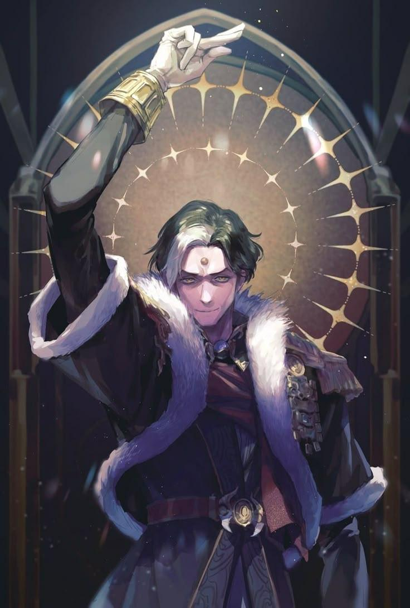
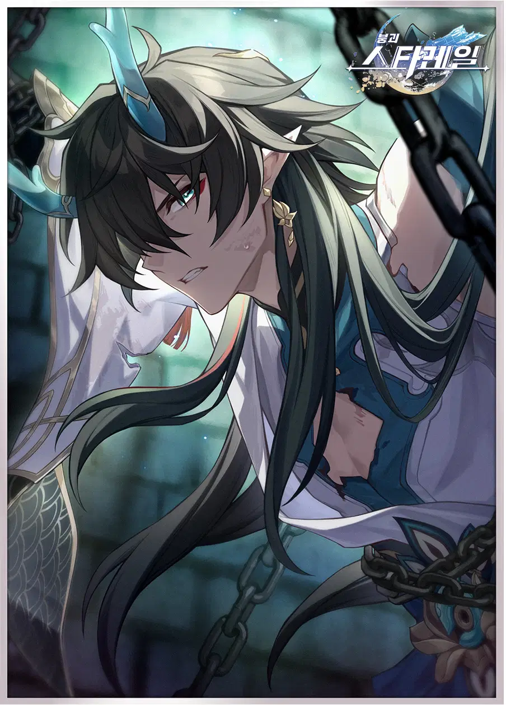
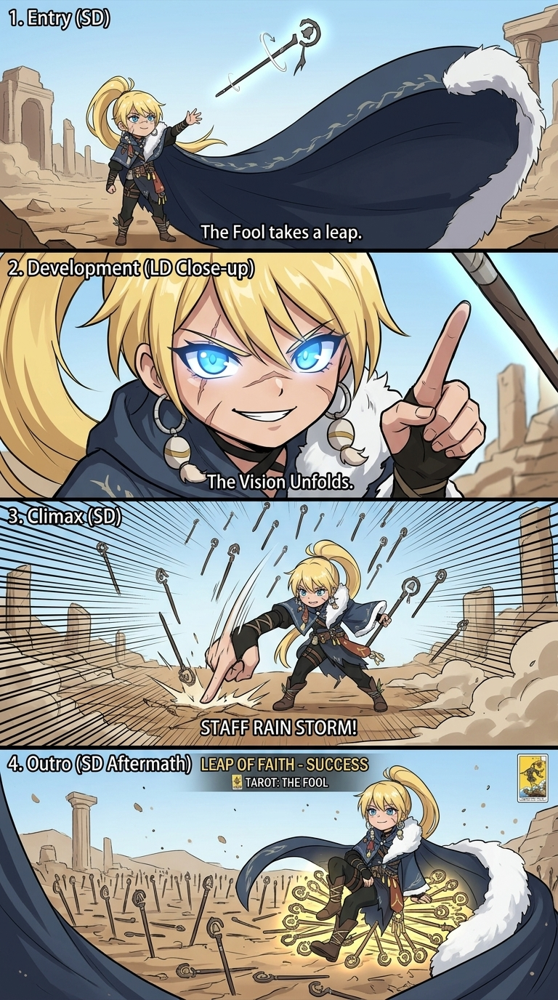

# 연출컨셉문서_V1_이채연

## 슬라이드 1

연출 컨셉 문서

이채연

---

## 슬라이드 2

이 문서를 읽을 때

절대 AI 러프를 믿지마십시오, 참고용입니다.

디자인과 미감은 디자이너분들의 몫입니다.

질문 있으면 언제든 연락 주세요

---

## 슬라이드 3

노드 화면 -> 전투 화면

수풀 같은 것이 화면을 가득 채운 상태로 한쪽으로 샥 지나가며 전투 연출

---

## 슬라이드 4

캐릭터 등장 애니메이션

---

## 슬라이드 5

더 풀 등장

#### 컷 1 (진입 - LD): 화면 왼쪽에서 지팡이가 먼저 쑥 들어옵니다. 카메라는 지팡이 끝을 따라가다 뒤이어 등장하는 더 풀의 발끝에서 멈추며, 느긋한 걸음으로 걸어 들어오는 하체만 보입니다. 후드를 쓴 채 지팡이를 바닥에 통통 두드리며 걷는 리듬감 있는 실루엣.

#### 컷 2 (전개 - LD): 카메라가 천천히 틸트 업(Tilt-up)하며 전신이 드러납니다. 지팡이를 어깨 위로 걸치고 그 위에 양손을 늘어뜨린 특유의 포즈. 까무잡잡한 피부 위로 햇살이 비치고, 후드 안쪽 그림자 사이로 한쪽 눈이 반짝이며 능글맞은 미소가 보입니다. 배경에 바람에 흩날리는 나뭇잎이나 풀씨가 날리며 방랑자의 분위기를 연출합니다.

#### 컷 3 (절정, 퇴장 - LD): 바람이 후드를 뒤로 확 젖히며 얼굴 전체가 드러나는 클로즈업. 바람에 빨간 머리카락이 크게 휘날리고, 기본적으로 웃는 얼굴이 카메라를 정면으로 바라봅니다. 동시에 발 밑에서 풀과 덩굴이 빠르게 자라나며 지팡이를 타고 올라오는 자연 이펙트. 타로 "The Fool" 카드가 화면에 떴다가 사라지며 애니메이션 마무리

---

## 슬라이드 6

하이 프리스테스  등장

#### 컷 1 (진입 - LD): 어두운 화면에서 촛불 하나가 켜지며, 그 불빛에 하이 프리스테스의 손만 비춰집니다. 길고 마른 손가락이 타로 카드 한 장을 테이블 위에 뒤집어 놓는 모션. 카드가 뒤집히는 순간 은빛 파문이 화면 전체로 퍼져나갑니다.

#### 컷 2 (전개 - LD): 은빛 파문이 가라앉으며 카메라가 천천히 줌 아웃(Zoom-out). 촛불 여러 개가 하이 프리스테스를 둘러싸고 있고, 꼿꼿한 자세로 앉아있는 전신이 서서히 드러납니다. 눈은 살짝 내리깔고 있으며, 배경에 달빛이나 장막 사이로 들어오는 푸른 빛이 신비로운 분위기를 만듭니다. 주름진 얼굴이지만 위엄 있고 아름다운 인상.

#### 컷 3 (절정, 퇴장 - LD): 하이 프리스테스가 천천히 눈을 들어 카메라를 정면으로 응시하는 얼굴 클로즈업. 눈동자 안에 달의 위상(초승달→보름달)이 빠르게 변화하며, 모든 것을 꿰뚫어 보는 듯한 시선. 입꼬리가 아주 미세하게 올라가며 의미심장한 미소. 타로 "The High Priestess" 카드가 화면에 떴다가 사라지며 애니메이션 마무리

---

## 슬라이드 7

더 스타  등장

---

## 슬라이드 8

궁극기 애니메이션

#### 컷 4개(진입, 전개, 절정, 퇴장)로 이루어진 1초에 24프레임 기준 애니메이션.

#### 진입, 퇴장은 3콤마 (1초당 3프레임, 1초 채우기 위해 8장 필요)

#### 전개는 2~3콤마 (1초당 2~3프레임, 1초 채우기 위해 8~12장 필요)

#### 절정은 1콤마 (1초당 1프레임, 1초 채우기 위해 24장 필요)

#### 캐릭터 모션 별로 완급 조절을 위해 줄거나 늘 수 있음. (디자이너 미감 의지)

#### AI 활용 필수

---

## 슬라이드 9

주인공 궁극기 스토리보드

#### 눈을 감고 있는 주인공의 얼굴이 확 클로즈업 된다. 상반신과 얼굴이 크게 클로즈업 되었을 때 주인공이 결연한 표정으로 눈을 번쩍 뜨면 눈이 빛나며 눈 안에 있는 수레바퀴가 반시계 방향으로 돌아간다.

#### 주인공이 오른손을 머리 위로 들어올려(카메라가 주인공의 올라가는 오른손을 따라 올라간다.) 핑거 스냅하면 카메라줌 아웃이 확 되면서 허공에 떠있는 주인공의 전신 보여주고 배경에 펼쳐진 거대한 수레바퀴가 점점 더 빨리 돌면서 녹색 빛이 뿜어져 나오며 마무리.

> 이미지는 한 남성의 캐릭터 일러스트입니다. 

*   캐릭터의 생김새

    *   짙은 녹색의 머리카락에 흰색이 섞여 있고, 눈은 노란색입니다. 캐릭터의 이마에는 노란색 점이 있습니다. 캐릭터는 하얀색 장갑을 착용하고 있으며, 팔꿈치까지 올라오는 금색 팔찌를 착용하고 있습니다. 
    *   캐릭터는 짙은색의 외투를 입고 있으며, 외투 안쪽과 깃 부분은 하얀색 털로 장식되어 있습니다. 허리에는 짙은색의 벨트를 착용하고 있습니다. 

*   배경 

    *   배경에는 큰 아치형의 무늬가 존재하며, 무늬 뒤로 노란색의 빛과 노란색 별 모양의 빛이 퍼져있습니다. 
    *   빛의 무늬는 짙은 보라색이며, 빛과 별 모양의 무늬는 금색입니다. 
    *   배경의 왼쪽과 오른쪽에는 짙은색의 기둥이 존재합니다. 

*   종합 

    *   캐릭터의 손은 위로 향하고 있으며, 캐릭터의 손가락은 펼쳐져 있습니다. 캐릭터는 웃는 표정으로 카메라를 응시하고 있습니다. 
    *   캐릭터의 외투와 배경의 아치형 무늬에는 보라색과 금색이 사용되어 조화롭습니다. 
    *   캐릭터의 짙은 녹색 머리카락과 노란색 눈, 이마의 노란색 점이 캐릭터의 개성을 강조하고 있습니다.

---

## 슬라이드 10

저스티스 궁극기 스토리보드

#### 저스티스가 족쇄에 묶여 있는 채로 대검을 질질 끌며 무겁게 앞으로 걸어나가는 모습을 사이드뷰로 하반신까지만 나오도록 연출한다.

#### 저스티스가 화면에서 반쯤 사라졌을 때 손잡이를 꽉 쥐는 클로즈업 샷으로 보여주고 저스티스가 쥔 손잡이부터 붉은 이펙트가 피어오른다. 카메라 구도가 정면으로 바꾸며 저스티스가 화면을 향해 달려들고 화면을 대각선으로 확 베어낸다.

> 이미지는 게임 캐릭터의 일러스트입니다. 

검은색과 흰색의 긴 머리를 가진 남성이 사슬에 묶인 채로 그려져 있습니다. 

*   캐릭터의 눈은 한쪽은 노란색, 다른 한쪽은 보라색입니다. 
*   캐릭터는 흰색과 남색의 옷을 입고 있으며, 머리는 검은색과 흰색입니다. 
*   캐릭터의 이마에는 푸른색 뿔이 있고, 귀에는 금색 귀걸이를 착용하고 있습니다. 
*   캐릭터의 오른쪽 팔목에는 사슬이 묶여 있고, 손에는 사슬이 쥐어져 있습니다. 
*   배경은 녹색과 검은색으로 되어 있습니다. 
*   이미지 오른쪽 상단에는 하얀색의 로고가 있습니다. 
*   로고의 왼쪽에는 한자가 적혀 있고, 오른쪽에는 '타워일'이라는 단어가 적혀 있습니다. 
*   이미지의 테두리는 회색입니다.

---

## 슬라이드 11

매지션 궁극기

#### [컨셉: 생명력을 찬탈하는 화려한 피날레]

#### 컷 1 (진입 - SD): SD 매지션이 채찍을 휘둘러 화면을 '착!' 소리와 함께 가로지릅니다. 그 궤적을 따라 서커스 막(Curtain)이 내려오며 LD 컷신 전환됩니다.

#### 컷 2 (전개 – LD): * 카메라: 매지션을 중심으로 원을 그리며 도는 오빗(Orbit) 무빙.

#### 액션: 화려한 조명 아래 매지션이 우아하게 턴을 하며 채찍을 허공에 휘두릅니다. 채찍이 지나간 자리에 아군의 실루엣이 아군들의 영혼(빛의 구체)으로 변해 매지션의 손바닥 위로 모여듭니다.

#### 컷 3 (절정 - LD): * 카메라: 매지션의 손에서 얼굴로 빠르게 줌 인(Zoom-in).

#### 액션: 모여든 에너지를 흡수한 매지션이 양손으로 턱을 괴는 '꽃받침' 포즈를 취하며 입맛 다시기하고 카메라를 응시합니다.

#### 컷 4 (퇴장 - SD): 서커스 막이 다시 올라가며 전투 필드. SD 매지션이 관객에게 인사하듯 모자를 벗어 가볍게 목례하는 포즈로 마무리합니다.

---

## 슬라이드 12

매지션 궁극기 AI

> 해당 이미지는 게임 기획 문서의 일부로, 마법사의 변신 시퀀스(Storyboard Sequence: Magician's Transformation) 관련된 다이어그램입니다. 

이미지 상단에는 타이틀 "STORYBOARD SEQUENCE: MAGICIAN'S TRANSFORMATION"가 있고, 그 아래에 다섯 가지의 컷(Cut)이 번호 순으로 나열되어 있습니다. 각 컷은 두 줄의 캡션과 함께 설명되어 있습니다. 

왼쪽 위에서부터 아래로, 그리고 오른쪽 위에서부터 아래로 순서대로 설명해 보겠습니다.

### Cut 1: ENTRY, SD (Cutscene Entry)
- **캐릭터**: 하얀색 긴 머리를 가진 소녀가 등장합니다. 머리는 양쪽으로 갈라진 긴 브레이드 헤어로 묶여 있고, 파란색 리본을 착용하고 있습니다. 
- **의상**: 짙은색의 마법사 같은 옷을 입고 있으며, 무릎까지 오는 긴 부츠를 착용하고 있습니다. 
- **배경**: 무대 커튼이 양쪽으로 드리워져 있고, 연기(또는 안개)가 바닥에 피어오르고 있습니다. 
- **설명**: "Cutscene Entry"로, 게임의 도입 부분을 나타냅니다.

### Cut 2: DEVELOPMENT, LD (Low Angle Development)
- **캐릭터**: 같은 캐릭터지만, 자세가 크게 달라졌습니다. 한쪽 손을 위로 뻗어 채찍을 휘두르는 듯한 자세를 취하고 있습니다. 
- **의상**: 이전과 동일하지만, 더 화려하고 디테일한 부분이 강조된 것 같습니다. 
- **배경**: 스포트라이트가 캐릭터를 비추고 있으며, 텐트 천장이 일부 보입니다. 
- **설명**: "Low Angle Development"로, 캐릭터의 발전과 성장을 상징하는 장면입니다.

### Cut 2: DEVELOPMENT, SD (Ally Absorption)
- **캐릭터**: 동일한 캐릭터가 등장하며, 손을 앞으로 내밀고 있습니다. 
- **배경**: 두 개의 짙은 실루엣이 마법사처럼 생긴 캐릭터의 뒤에 서 있습니다. 
- **효과**: 캐릭터 앞으로 빛나는 에너지 효과가 표현되어 있습니다. 
- **설명**: "Ally Absorption"으로, 동료의 힘을 흡수하는 장면입니다.

### Cut 4: CLIMAX, LD (Climax & Glow)
- **캐릭터**: 밝은 표정으로 두 손을 뺨에 갖다 댄 채로 빛나는 눈을 하고 있습니다. 
- **배경**: 짙은 밤하늘에 빛나는 별과 달이 보입니다. 
- **효과**: 캐릭터의 몸에서 빛나는 에너지 효과가 표현되어 있습니다. 
- **설명**: "Climax & Glow"로, 클라이맥스를 맞이한 캐릭터의 상태를 나타냅니다.

### Cut 5: OUTRO, SD (Sequence Outro)
- **캐릭터**: Cut 1과 동일한 자세와 표정으로 등장합니다. 
- **배경**: Cut 1과 동일한 무대 배경이며, 커튼이 양쪽으로 드리워져 있습니다. 
- **설명**: "Sequence Outro"로, 시퀀스의 마지막을 나타냅니다.

이처럼 각 Cut은 캐릭터의 변신 과정을 다양한 각도와 효과로 표현하고 있으며, 게임의 스토리보드 시퀀스를 계획하고 시각화한 자료로 활용될 것으로 보입니다.

---

## 슬라이드 13

더 풀 궁극기

#### [컨셉: 하늘에서 쏟아지는 지팡이의 비]

#### 컷 1 (진입 - SD): SD 더 풀이 지팡이를 공중으로 던지고 자신의 거대한 망토를 펼쳐 카메라를 완전히 덮어버립니다. 망토가 걷히며 LD 컷신 전환

#### 컷 2 (전개 – LD): * 카메라: 발끝에서 얼굴까지 천천히 틸트 업(Tilt-up) 하다가 미소를 짓는 순간 얼굴을 익스트림 클로즈업.

#### 액션: 평온하던 얼굴이 쾌녀 씨익 미소로 변하며 손가락을 하늘로 치켜듭니다. 하늘에는 수천 개의 지팡이 환영이 마법진과 함께 생성됩니다.

#### 컷 3 (절정 – LD): * 카메라: 하늘 높은 곳에서 지면을 향해 수직으로 떨어지는 버즈 아이 뷰(Bird＇s eye view).

#### 액션: 지휘자가 손을 내리듯 더 풀이 손을 내리치면, 지팡이 소나기가 화면 전체를 폭격합니다. 폭발 이펙트가 화면을 가득 채웁니다.

#### 컷 4 (퇴장 - SD): 연기가 자욱한 가운데 다시 전투 화면. SD 더 풀이 하늘에서 내려오는 자신의 지팡이를 가볍게 낚아채며 스탠딩 포즈로 복귀합니다.

---

## 슬라이드 14

더 풀 궁극기 AI

> 이미지는 타로 카드 'The Fool'과 관련된 일러스트레이션으로, 만화 스타일의 4단계 패널로 구성되어 있습니다. 각 패널은 다른 장면을 묘사하며, 스토리의 흐름을 시각적으로 표현하고 있습니다.

### **패널 1: 엔트리 (SD)**
- **캐릭터**:  
  - 주인공은 금발의 긴 머리를 높은 포니테일로 묶고 있습니다.  
  - 파란 눈동자와 날카로운 이목구비, 웃는 표정이 특징입니다.  
  - 짙은색 외투와 허리띠, 허벅지 부츠를 착용하고 있습니다.  
  - 오른손에 지팡이를 들고 있습니다.

- **배경**:  
  - 고대의 폐허가 배경으로 묘사되어 있습니다.  
  - 먼지가 흩날리고, 기둥과 돌들이 무너져 있는 모습입니다.

- **액션**:  
  - 주인공이 지팡이를 허공에 던지고 있습니다.  
  - 지팡이에서는 빛나는 오ーラ가 뿜어져 나오고 있습니다.

- **텍스트**:  
  - "The Fool takes a leap." (어리석은 자가 도약한다.)

- **레이아웃**:  
  - 패널 상단에 "1. Entry (SD)"라는 라벨이 있습니다.

### **패널 2: 전개 (LD 클로즈업)**
- **캐릭터**:  
  - 주인공이 클로즈업되어 있습니다.  
  - 지팡이를 들고 손가락을 가리키는 동작을 하고 있습니다.

- **배경**:  
  - 하늘색 배경이 주를 이루며, 일부 폐허가 배경에 보입니다.

- **액션**:  
  - 주인공의 표정은 자신감 넘치고 약간 도발적인 모습입니다.

- **텍스트**:  
  - "The Vision Unfolds." (비전이 펼쳐진다.)

- **레이아웃**:  
  - 패널 상단에 "2. Development (LD Close-up)"라는 라벨이 있습니다.

### **패널 3: 클라이맥스 (SD)**
- **캐릭터**:  
  - 주인공이 전투 자세를 취하고 있습니다.  
  - 지팡이를 휘두르고 있으며, 공격 동작을 취하고 있습니다.

- **배경**:  
  - 폐허가 더 선명하게 나타나고, 먼지와 모래가 날리고 있습니다.

- **액션**:  
  - 배경에 여러 개의 지팡이들이 날아다니는 효과가 표현되어 있습니다.  
  - 주인공의 동작과 공격이 강조된 장면입니다.

- **텍스트**:  
  - "STAFF RAIN STORM!" (지팡이 비를 내린다!)

- **레이아웃**:  
  - 패널 상단에 "3. Climax (SD)"라는 라벨이 있습니다.

### **패널 4: Outro (SD 여파)**
- **캐릭터**:  
  - 주인공이 지팡이를 꽂은 채로 앉아 있습니다.  
  - 지팡이들이 땅에 꽂혀 있고, 그 위로 노랗고 푸른 빛이 퍼져 나가는 효과가 있습니다.

- **배경**:  
  - 여전히 폐허가 배경으로 나타나지만, 전투 후의 여파가 강조된 모습입니다.

- **액션**:  
  - 주인공의 뒤로 지팡이들이 여러 개 꽂혀 있고, 만족스러운 표정을 짓고 있습니다.

- **텍스트**:  
  - "LEAP OF FAITH - SUCCESS" (믿음의 도약 - 성공)  
  - "TAROT: THE FOOL" (타로: 더 퍽)

- **레이아웃**:  
  - 패널 상단에 "4. Outro (SD Aftermath)"라는 라벨이 있습니다.

### **추가 요소**
- 패널 4의 오른쪽 하단에는 타로 카드 'The Fool'의 일러스트가 삽입되어 있습니다.

이 이미지는 'The Fool'의 여정을 통해 '믿음의 도약'을 표현하고 있으며, 각 패널이 스토리의 흐름을 잘 나타내고 있습니다.

---

## 슬라이드 15

하이 프리스테스 궁극기

---

## 슬라이드 16

하이 프리스테스 궁극기 AI

---

## 슬라이드 17

더 스타 궁극기

---

## 슬라이드 18

더 스타 궁극기 AI

---

## 슬라이드 19

최종 보스 1~2 페이즈 기믹 연출

---

## 슬라이드 20

최종 보스 2~3 페이즈 기믹 연출

---

## 슬라이드 21

저지먼트 등장

#### 1. 저지먼트를 상징하는 천칭 아이콘이 화면에 크게 나타나며

---
