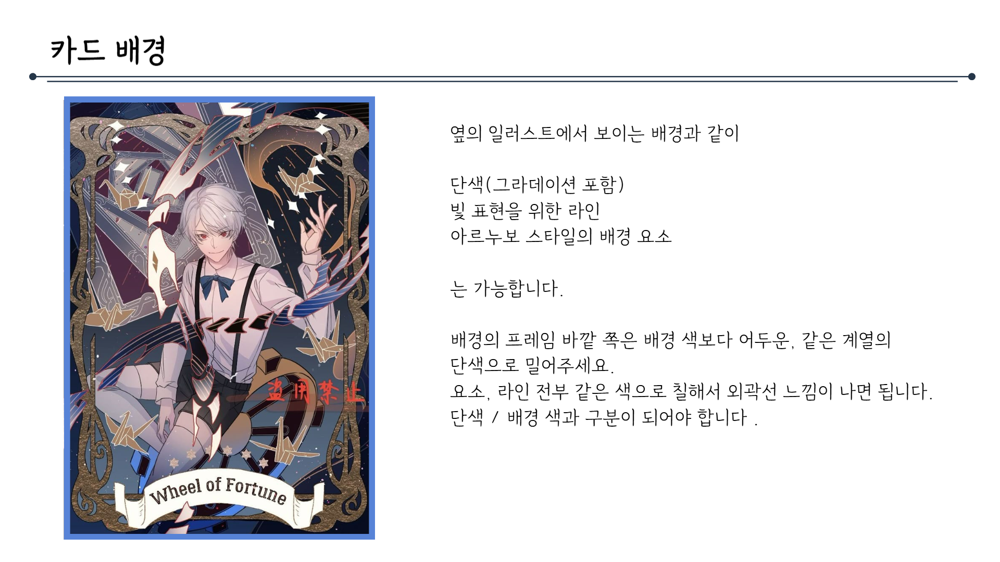
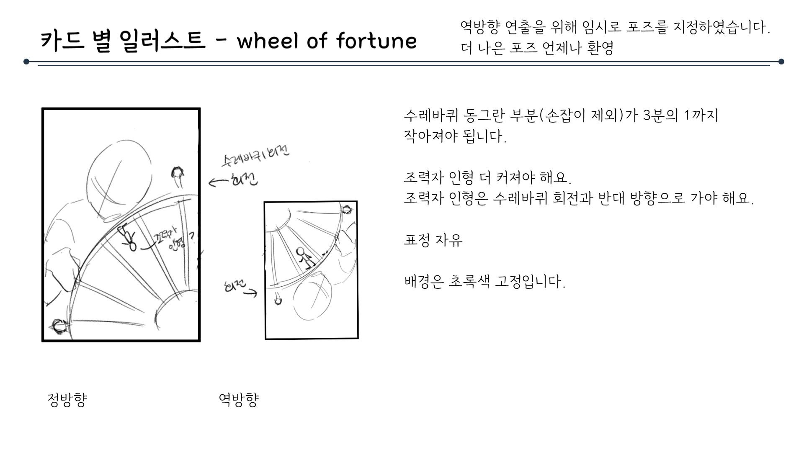
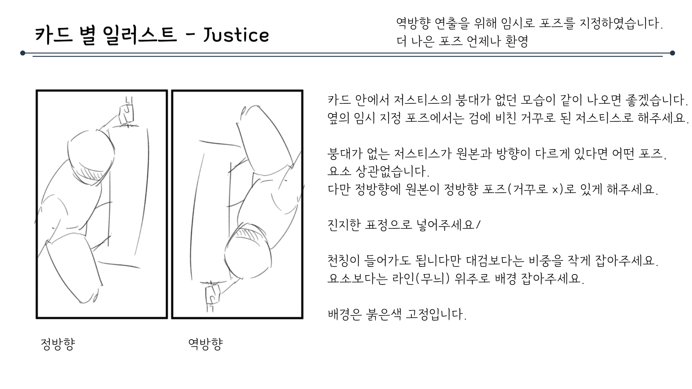
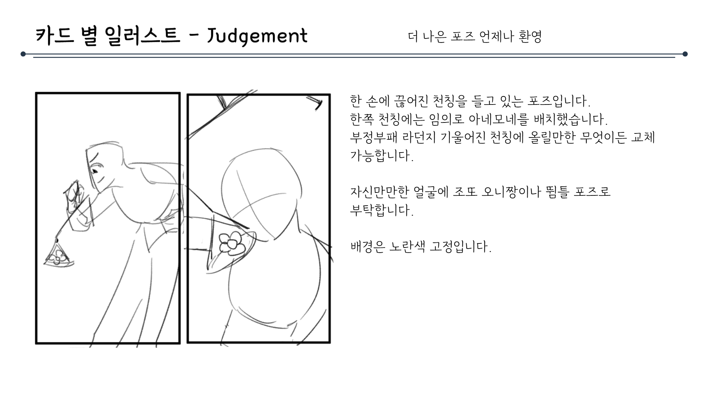
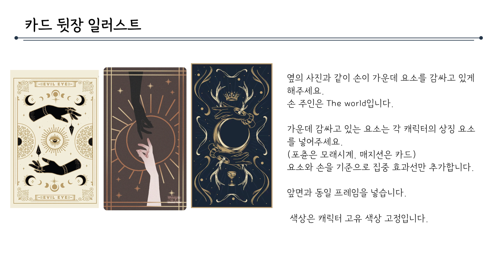
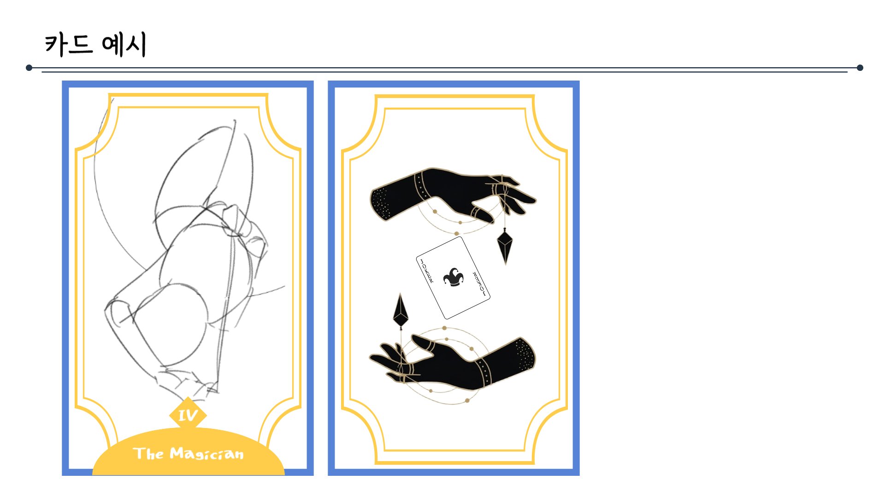

# 카드컨셉문서_V2_김주연

## 슬라이드 1

> 이미지는 흰색 배경에 검은색 텍스트가 포함된 간단한 구도입니다. 

가운데 정렬되어 있는 두 줄의 텍스트는 다음과 같습니다.

*   첫 줄: **컨셉 기획서** 
*   둘째 줄: **카드 컨셉**

텍스트는 기본적인 한글 폰트로 표시되어 있습니다. 이미지에는 아이콘, 캐릭터, 다이어그램, UI 요소 등이 포함되어 있지 않습니다.

---

## 슬라이드 2

> 이미지는 게임 기획 문서의 일부로, 카드 구성에 대한 설명입니다. 이미지의 주요 구성 요소는 다음과 같습니다.

*   **카드 구성**: 
    *   카드 구성에 대한 설명입니다.
*   **카드**: 
    *   카드는 배경, 캐릭터, 외곽 프레임, 하단 이름표로 나뉩니다.
    *   왼쪽에서부터 낮은 레이어로, 캐릭터는 프레임 위에 그려질 수 있지만, 이름표에는 가려집니다.
*   **카드 이미지**: 
    *   카드의 실제 이미지입니다. 
    *   카드는 세로로 길쭉한 직사각형 모양이며, 배경은 하늘색입니다. 
    *   카드에는 여러 캐릭터가 그려져 있습니다. 
    *   캐릭터들은 모두 귀여운 디자인이며, 꽃과 리본으로 장식되어 있습니다. 
    *   카드 하단에는 "THE WORLD"이라는 텍스트가 있습니다.
*   **배경**: 
    *   카드의 배경 이미지입니다. 
    *   카드의 큰 이미지에서 프레임 부분을 제거한 이미지로 보입니다. 
    *   하늘색 배경에 구름이 그려져 있습니다.
*   **프레임**: 
    *   카드의 프레임을 나타내는 이미지입니다. 
    *   노란색과 갈색으로 구성되어 있으며, 꽃과 리본으로 장식되어 있습니다.
*   **레이어**: 
    *   카드의 레이어를 나타내는 이미지입니다. 
    *   프레임 안에 캐릭터가 그려진 이미지입니다. 
    *   프레임과 동일한 디자인으로 되어 있지만, 프레임보다 작습니다. 
    *   프레임과 마찬가지로 노란색과 갈색으로 구성되어 있으며, 꽃과 리본으로 장식되어 있습니다. 
    *   프레임과 캐릭터 이미지의 합성 이미지로 보입니다.

이미지에서 사용된 아이콘과 UI 요소는 다음과 같습니다.

*   **아이콘**: 
    *   이미지 상단에는 라인 위쪽에 동그라미가 있는 가로선이 있습니다. 
    *   이미지 하단에는 이름표가 있습니다. 
    *   이름표는 갈색 리본 모양이며, "THE WORLD"라는 텍스트가 있습니다. 
*   **UI 요소**: 
    *   이미지 상단에는 "카드 구성"이라는 텍스트가 있습니다. 
    *   이미지 하단에는 카드 구성에 대한 설명이 있습니다.

---

## 슬라이드 3

> 이미지는 게임 기획 문서의 일부로, "카드 배경"에 대한 설명입니다. 이미지의 레이아웃과 구조는 다음과 같습니다.

*   **제목**: 이미지 상단에는 "카드 배경"이라는 제목이 있습니다.
*   **이미지**: 이미지 왼쪽에는 Wheel of Fortune 이라는 카드 이미지(타로카드)가 있습니다. 이 카드는 흰머리와 빨간 눈을 가진 남자가 카드를 들고 있는 일러스트입니다. 배경에는 여러 장의 카드가 있고, 종이비행기와 같은 오브젝트가 떠 있습니다. 
*   **내용**: 이미지 오른쪽에는 카드 배경에 대한 설명이 있습니다. 설명에 따르면, 카드 배경은 단색(그라데이션 포함), 빛 표현을 위한 라인, 아르누보 스타일의 배경 요소가 가능합니다. 배경의 프레임 바깥쪽은 배경 색보다 어두운, 같은 계열의 단색으로 밀어주라고 지시하고 있습니다.

이미지의 텍스트를 그대로 옮겨 적으면 다음과 같습니다.

카드 배경

옆의 일러스트에서 보이는 배경과 같이 

단색(그라데이션 포함)

빛 표현을 위한 라인 

아르누보 스타일의 배경 요소 

는 가능합니다.

배경의 프레임 바깥쪽은 배경 색보다 어두운, 같은 계열의 단색으로 밀어주세요.

요소, 라인 전부 같은 색으로 칠해서 외곽선 느낌이 나면 됩니다.

단색 / 배경 색과 구분이 되어야 합니다.

---

## 슬라이드 4

> 위쪽 상단에는 긴 가로줄이 있고, 왼쪽에는 '예시'라는 단어가 있습니다. 

오른쪽에 '예시입니다.'라는 문장이 있습니다.

가로로 긴 초록색 프레임이 있고, 프레임 속에는 하얀색 동그란 캐릭터가 칼을 들고 있습니다. 캐릭터는 눈을 X자로 뜨고 있으며, 눈과 코, 입이 있습니다. 볼에는 분홍색으로 된 블러셔가 그려져 있습니다. 

프레임의 위쪽에는 노란색으로 된 꾸밈이 있습니다. 프레임의 옆쪽에는 노란색으로 된 꾸밋이 있습니다.

---

## 슬라이드 5

> 이 문서는 게임 기획 문서의 일부로, '카드 별 일러스트 - wheel of fortune'이라는 제목이 있습니다. 문서의 주요 내용은 다음과 같습니다.

### 문서 구조:
- **제목**: "카드 별 일러스트 - wheel of fortune"
- **메모**: 
  - "역방향 연출을 위해 임시로 포즈를 지정하였습니다. 더 나은 포즈 언제나 환영"

### 이미지 설명:
문서에는 두 개의 스케치 이미지가 포함되어 있습니다.

1. **왼쪽 이미지 (정방향)**:
   - 큰 일러스트로, 캐릭터가 손잡이를 잡고 수레바퀴를 돌리는 모습을 묘사하고 있습니다.
   - 캐릭터의 머리, 몸, 팔, 손의 위치가 화살표와 함께 표시되어 있습니다.
   - 손잡이는 왼쪽에 위치해 있습니다.

2. **오른쪽 이미지 (역방향)**:
   - 작은 일러스트로, 캐릭터가 수레바퀴의 바깥쪽에 위치하며, 수레바퀴 회전과 반대 방향으로 이동하는 것을 표현하고 있습니다.
   - 캐릭터의 포즈는 자유롭게 설정할 수 있습니다.

### 텍스트 설명:
- 수레바퀴 동그란 부분(손잡이 제외)이 3분의 1까지 작아져야 합니다.
- 조력자 인형은 더 커져야 합니다.
- 조력자 인형은 수레바퀴 회전과 반대 방향으로 가야 합니다.
- 포정은 자유롭게 설정할 수 있습니다.
- 배경은 초록색으로 고정입니다.

### 레이아웃:
- 문서의 상단에는 제목과 메모가 위치해 있습니다.
- 왼쪽에는 두 개의 스케치 이미지가 나란히 배치되어 있습니다.
- 이미지 아래에는 각각 "정방향", "역방향"이라는 라벨이 있습니다.
- 오른쪽에는 이미지와 관련된 상세 설명이 있습니다.

이 문서는 게임 내에서의 캐릭터와 수레바퀴의 움직임 및 표현에 대한 초기 기획 단계를 보여주고 있습니다.

---

## 슬라이드 6

> 이미지는 게임 기획 문서의 일부로, "카드 별 일러스트 - Justice"라는 제목이 포함되어 있습니다. 이 문서에는 두 장의 캐릭터 그림과 이에 대한 설명이 포함되어 있습니다.

문서의 상단에는 "카드 별 일러스트 - Justice"라는 제목이 있고, 우측 상단에는 "역방향 연출을 위해 임시로 포즈를 지정하였습니다. 더 나은 포즈 언제나 환영"이라는 설명이 있습니다.

문서의 좌측에는 두 개의 그림이 나란히 배치되어 있습니다. 두 그림 모두 캐릭터가 무기를 들고 있는 모습을 표현하고 있습니다. 

두 그림은 각각 '정방향'과 '역방향'이라는 레이블이 붙어 있습니다. 

*   정방향 그림: 캐릭터가 정면을 향하고 있으며, 손에 무기를 들고 있습니다. 
*   역방향 그림: 캐릭터가 뒤를 향하고 있으며, 손에 무기를 들고 있습니다.

문서의 우측에는 그림에 대한 자세한 설명이 포함되어 있습니다. 

*   카드 안에서 저스티스의 봉대가 없던 모습이 같이 나오면 좋겠습니다. 옆의 임시 지정 포즈에서는 검에 비친 거꾸로 된 저스티스로 해주세요.
*   봉대가 없는 저스티스가 원본과 방향이 다르다면 어떤 포즈, 요소 상관없습니다. 다만 정방향에 원본이 정방향 포즈(거꾸로 x)로 있게 해주세요.
*   진지한 표정으로 넣어주세요/
*   천칭이 들어가도 됩니다만 대검보다는 비중을 작게 잡아주세요. 요소보단 라인이 위주 배경 잡아주세요.
*   배경은 붉은색 고정입니다.

이러한 설명을 통해, 이미지의 전반적인 레이아웃과 구조를 알 수 있습니다.

---

## 슬라이드 7

> 이 문서는 게임 기획 문서의 일부로, "The Magician"이라는 카드의 일러스트에 대한 지침을 제공합니다. 문서의 레이아웃과 구조는 다음과 같습니다.

*   **제목**: 문서의 제목은 "카드 별 일러스트 - The Magician"이며, 제목 위쪽에는 가는 선이 가로로 그어져 있습니다.
*   **이미지**: 문서의 왼쪽에는 두 개의 그림이 나란히 배치되어 있습니다. 두 그림 모두 인물과 링을 표현하고 있습니다. 왼쪽 그림은 정면에서의 모습을 보여주고, 오른쪽 그림은 역면에서의 모습을 보여줍니다. 
*   **설명**: 문서의 오른쪽에는 이미지와 관련된 설명이 있습니다. 설명은 다음과 같습니다.

    *   링에 매달린 상태로 뒤로 누운 포즈이고, 링에 머리카락이 걸려서 역방향에서도 하늘로 올라가지 않게 해주세요.
    *   라이브 2D에서 사용할 만한 카드나 서커스 용품을 추가해주세요. 이름표가 들어갈 하단 부분을 제외하고 2개에서 3개 정도 넣어주시면 됩니다.
    *   매지션의 역방향 스킬이 아군 살해인 점에서 채찍을 목과 가까이 배치 했습니다. 역방향에서 좀 더 교살같은 느낌이 있으면 좋겠어요.
    *   저박한이 스킨이 소프트라이트이기 때문에 사다리나 하단에서 오는 무대 조명을 하나 넣어주세요.
    *   악랄하게 웃거나 의심심장하게 바라보는 얼굴로 해주세요.
    *   배경은 파랑 고정입니다. (약간의 보라 그라데이션 가능)

    설명의 마지막에는 "역방향 연출을 위해 임으로 포즈를 지정하였습니다. 더 나은 포즈 언제나 환영"이라는 문구가 있습니다.

---

## 슬라이드 8

> 이미지는 게임 기획 문서의 일부로, "카트 별 일러스트 - The Fool"이라는 제목이 포함되어 있습니다. 문서의 레이아웃과 구조는 다음과 같습니다.

*   제목: "카트 별 일러스트 - The Fool"
*   부제목: "역방향 연출을 위해 임시로 포즈를 지정하였습니다. 더 나은 포즈 언제나 환영"
*   이미지: 두 개의 스케치 그림이 나란히 배치되어 있습니다. 
    *   왼쪽 그림: 캐릭터가 정면 방향으로 그려져 있습니다. 
    *   오른쪽 그림: 캐릭터가 역방향으로 그려져 있습니다.
*   텍스트: 이미지 오른쪽에 배치되어 있습니다. 내용은 다음과 같습니다.

    *   저런 드라마틱한 포즈가 아니어도 되지만, 폴댄스나 요가같은 유연한 포즈였으면 좋겠습니다.
    *   손에 들고 있는 것 지팡이 (복)입니다.
    *   지팡이 주변에 일렁거리는 효과나 라인 잡아주세요.
    *   라이브 투디를 위해 방랑자 느낌의 여행 수첩, 자연물 요소 등을 2개에서 3개 넣어주세요.
    *   쾌활하고 자유로운 얼굴로 해주세요.
    *   배경색은 캐릭터 색감 나오면 해당 색으로 고정됩니다.

전체적으로 이 문서에는 게임 개발을 위한 캐릭터 디자인과 관련된 지침과 예시가 포함되어 있습니다.

---

## 슬라이드 9

> 이미지는 게임 기획 문서의 일부로, "Judgement"라는 카드의 일러스트에 대한 설명입니다.

*   **제목:** "카드 별 일러스트 - Judgement" 
*   **부제목:** "더 나은 포즈 언제나 환영"

문서의 왼쪽에는 두 개의 스케치 이미지가 나란히 배치되어 있습니다. 두 이미지 모두 인물과 물건의 형태만 스케치되어 있고, 구체적인 디테일은 표현되어 있지 않습니다.

*   **첫 번째 이미지:** 인물이 한 손에 천칭을 들고 있는 자세를 표현하고 있습니다. 
*   **두 번째 이미지:** 인물의 뒷모습을 표현하고 있습니다. 한쪽 손에는 꽃을 들고 있습니다.

문서의 오른쪽에는 이미지와 관련된 설명이 있습니다.

*   **내용:** 
    *   한 손에 끌여진 천칭을 들고 있는 포즈입니다. 한쪽 천칭에는 임의로 아네모네를 배치했습니다. 부정의판 라던지 기욱어진 천칭에 올려만하 무어이든 교체 가능합니다.
    *   자신만만한 얼굴에 조또 오니짱이냐 똥를 포즈로 부탁합니다.
    *   배경은 노란색 고정입니다.

전체적으로 Judgement 카드의 일러스트에 대한 아이디어를 제시하고 있는 것으로 보입니다.

---

## 슬라이드 10

> 해당 이미지는 게임 기획 문서의 일부로, "카드 별 일러스트 - 마이너 아르카나"에 대한 설명입니다.

*   제목: "카드 별 일러스트 - 마이너 아르카나"
*   부제목: "마이너 아르카나..." 
*   레이아웃: 문서의 상단에 중앙 정렬되어 있습니다. 
*   시각적 구조: 제목과 부제목은 왼쪽 정렬되어 있습니다. 배경은 흰색이며, 제목과 부제목은 검은색입니다. 
*   아이콘: 이미지에는 아이콘이나 그래픽 요소는 포함되어 있지 않습니다.

---

## 슬라이드 11

> 이미지는 게임 기획 문서의 일부로, 카드 프레임에 대한 설명입니다. 

### 이미지 레이아웃

이미지는 다음과 같은 레이아웃을 가지고 있습니다.

*   왼쪽 상단에 **카드 프레임**이라는 타이틀과 긴 라인이 있습니다.
*   왼쪽에는 카드 프레임의 예시 이미지(그레이 스케일)가 있고, 오른쪽에는 프레임에 대한 설명과 카드 프레임의 일부분을 확대한 도형이 있습니다.

### 텍스트 설명

*   **카드 프레임** 
*   상단 중앙 혹은 하단 이름 위 중앙에 코스트가 들어갈 구역을 잡아주세요. - 다이아몬드 참조
*   하단에 반원 모양의 이름표가 있어야 합니다.
*   프레임에 디자인이 들어가도 되지만, 두꺼운 선으로 앞게 비워 지는 부분 없이 칠해주시고, 예시 이미지와 같이 좌, 우의 선은 직선으로 남겨주세요.
*   메이저 아르카나는 금색, 마이너 아르카나는 은색 고정입니다.
*   뒷장 레퍼런스 첨부합니다.

### 시각적 레이아웃과 구조

*   카드는 직사각형 모양이며, 상단과 하단에는 꽃과 같은 무늬가 있습니다. 왼쪽 상단과 하단에는 별 모양의 무늬가 있습니다. 
*   카드 프레임의 상단 중앙에는 다이아몬드 모양의 아이콘이 있고, 하단에는 반원 모양의 이름표가 있습니다. 
*   프레임의 왼쪽에는 무늬가 있고, 오른쪽에는 설명이 있습니다. 
*   프레임의 색상은 메이저 아르카나는 금색, 마이너 아르카나는 은색입니다.

---

## 슬라이드 12

> 이미지는 게임 기획 문서의 일부로, 카드 프레임에 대한 예시입니다. 

문서의 레이아웃과 구조는 다음과 같습니다.

*   제목: 문서의 상단에 '카드 프레임 예시'라는 제목이 있습니다.
*   수평선: 제목 아래에 긴 수평선이 있습니다.
*   카드 프레임 예시: 이미지의 중앙에 3개의 카드 프레임 예시가 있습니다. 
    *   첫 번째 프레임은 아치형의 상단과 아래에 꽃 모양의 장식이 있습니다.
    *   두 번째 프레임은 사각형으로 상단에 꽃 모양의 장식이 있고 아래에 꽃 모양의 장식이 있습니다.
    *   세 번째 프레임은 사각형으로 상단과 하단에 꽃 모양의 장식이 있습니다.
*   완성된 카드 프레임: 오른쪽에 두 장의 완성된 카드 프레임이 있습니다.
    *   첫 번째 카드는 검은색 배경에 금색 테두리가 있고, 가운데에 달과 별이 있습니다.
    *   두 번째 카드는 검은색 배경에 금색 테두리와 달과 별이 있습니다.
*   설명: 문서의 하단에 카드 프레임에 대한 설명이 있습니다. "곡선 디자인이 들어간다면 위의 두께 정도로 두껍게 색이 들어갈 정도로 해주세요."라는 문구가 있습니다.

이미지에서 사용된 색상은 베이지색, 회색, 검은색, 금색이 있습니다.

---

## 슬라이드 13

> 이미지는 게임 기획 문서의 일부로, 카드 뒷면 일러스트에 대한 설명과 예시 이미지를 포함하고 있습니다. 

### 이미지 내용:

1. **제목**:  
   - "카드 뒷장 일러스트"라는 제목이 이미지 상단에 위치해 있습니다.

2. **카드 뒷면 일러스트 예시**:  
   - 총 3개의 카드 뒷면 일러스트가 나란히 배치되어 있습니다.  
   - 각 카드는 서로 다른 디자인과 색상을 가지고 있으며, 일러스트 중앙에는 손과 상징적인 요소들이 그려져 있습니다.

3. **텍스트 설명**:  
   - 이미지 오른쪽에 다음과 같은 설명이 있습니다.  
     - "역의 사진과 같이 손이 가운데 요소를 감싸고 있게 해주세요."  
     - "손 주인은 The world입니다."  
     - "가운데 감싸고 있는 요소는 각 캐릭터의 상징 요소를 넣어주세요. (포춘은 모래시계, 매지션은 카드) 요소와 손을 기준으로 집중 효과선만 추가합니다."  
     - "앞면과 동일 프레임을 넣습니다."  
     - "색상은 캐릭터 고유 색상 고정입니다."

### 이미지 레이아웃:
- 이미지는 가로로 긴 형태이며, 상단에는 제목이 있고, 그 아래에 카드 예시 이미지들이 나란히 배열되어 있습니다. 
- 이미지 오른쪽에는 카드 디자인에 대한 상세한 설명이 포함되어 있습니다. 
- 배경은 흰색이며, 설명 텍스트는 검은색입니다.

---

## 슬라이드 14

> 해당 이미지에는 게임 기획 문서의 일부로 추정되는 카드 디자인에 대한 예시 2가지가 포함되어 있습니다.

*   이미지 상단 좌측에는 '카드 예시'라고 적혀 있습니다. 
*   이미지는 2개의 카드로 구성되어 있으며, 각각의 카드는 파란색과 노란색의 테두리로 구성되어 있습니다. 
*   왼쪽 카드는 하단에 노란색 테두리가 있고, 그 안에 하얀색 폰트로 **The Magician**이라고 적혀 있습니다. 
*   왼쪽 카드에는 완성이 되지 않은 스케치 형태의 그림이 그려져 있습니다. 
*   오른쪽 카드에는 하얀색 카드 한 장을 가운데에 두고 위, 아래로 검은색 손이 표현되어 있습니다. 검은색 손가락에서 하얀색 카드를 양쪽으로 감싸고 있는 듯한 형상입니다. 
*   카드의 그림과 배경은 하얀색으로 구성되어 있습니다.

---

## 슬라이드 15

> 이미지는 게임 기획 문서의 일부로, 카드 외관 표시(활성/비활성)에 대한 설명입니다. 이미지의 레이아웃과 구조는 다음과 같습니다.

*   **제목**: 이미지 상단에는 "카드 외관 표시(활성/비활성)"라는 제목이 있습니다.
*   **이미지**: 이미지 중앙에는 두 장의 카드 이미지가 나란히 배치되어 있습니다. 왼쪽은 비활성 상태, 오른쪽은 활성 상태를 나타냅니다. 두 이미지 모두 어두운 배경에 밝은 빛이 카드 중앙에서 뿜어져 나오는 듯한 형태를 가지고 있습니다. 
*   **텍스트**: 이미지 오른쪽에는 두 장의 카드에 대한 설명이 있습니다. 마우스가 카드 위로 올라가면 우측과 같이 카드 하단에서 빛이 올라가는 효과를 넣습니다. 카드에서 어두운 배경을 제외한 요소에 하이라이트 효과를 추가하고, 과하지 않은 아우라, 연기를 넣어주세요.

이미지의 세부적인 내용을 설명하면 다음과 같습니다.

*   **비활성 카드**: 왼쪽에 있는 카드는 비활성 상태입니다. 이 카드는 배경이 어둡고, 중앙에 있는 원형 로고가 약간 어둡습니다. 
*   **활성 카드**: 오른쪽에 있는 카드는 활성 상태입니다. 이 카드는 배경이 밝고, 중앙에 있는 원형 로고가 밝습니다. 또한 카드 하단에서 빛이 올라오는 효과가 있습니다.

전체적으로 이 이미지는 게임 내 카드의 활성/비활성 상태를 나타내는 그래픽 요소와 그에 대한 설명을 제공하고 있습니다.

---

## 슬라이드 16

> 해당 이미지에는 게임에 등장하는 카드의 디자인 초안이 포함되어 있습니다.

## 레이아웃

이미지는 상단과 하단으로 구분되는 레이아웃을 가지고 있습니다.

*   상단: 
    *   제목 영역입니다. 
    *   "궁극기 역방향 연출"이라는 문구가 중앙에 위치해 있습니다.
    *   문구 좌우에는 점이 있고, 점과 제목을 가로로 선이 연결해 줍니다.
*   하단: 
    *   왼쪽과 오른쪽에 동일한 카드 초안이 그려져 있습니다.
    *   카드의 레이아웃은 하단 중앙에 노란색 반원형이 있고 그 위에 다이아몬드 모양의 노란색 사각형이 있습니다.
    *   반원형 위쪽에는 카드의 스케치가 그려져 있고, 그 위쪽에는 노란색과 파란색의 테두리가 있습니다.

## 카드

*   카드에는 "The Magician"이라는 문구가 동일하게 표시되어 있습니다.
*   카드의 디자인은 하단 중앙에 노란색 반원형이 있고 그 위에 다이아몬드 모양의 노란색 사각형이 있습니다.
*   반원형 위쪽에는 카드의 스케치가 그려져 있고, 그 위쪽에는 노란색과 파란색의 테두리가 있습니다.

## 텍스트

*   이미지 상단에는 "궁극기 역방향 연출"이라는 문구가 있습니다.
*   이미지 우측에는 애니메이션과 관련된 지시사항이 있습니다. 
*   카트 하단에는 동일한 문구인 "The Magician"이 있습니다.

---
