# 캐릭터비주얼컨셉_V1_이채연

## 슬라이드 1

캐릭터 비주얼 컨셉

---

## 슬라이드 2

이 문서를 읽을 때..

모든 것은 수정될 수 있습니다.

궁금한 점이 있으면 언제든 담당자 이채연에게 연락 부탁드립니다. (새벽에도  OK )

캐릭터 별 나이는 모두 외형을 기준으로 합니다.

이채연 010 2988 7090

---

## 슬라이드 3

### 주인공

| 항목 | 내용 |
| --- | --- |
| 이름 | 휠 오브 포춘 |
| 성별 | 여성 |
| 키/나이 | 165cm/19세 |
| 체형 | 슬랜더, 평평한 가슴. |
| 성격 | 안정형 여친, 포용력 넓고 무던, 먼저 다가가진 않음. |
| 말투 |  |
| 역할 | 주인공 |

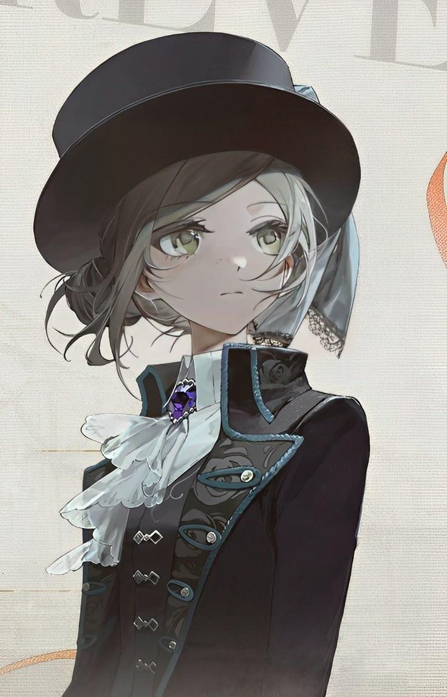

> 해당 이미지에는 한 명의 캐릭터가 등장합니다. 

*   **배경**: 배경은 연한 회색이며, 배경의 오른쪽 하단에는 주황색의 둥근 무늬가 있고, 배경의 상단에는 회색의 큰 글씨가 일부 보입니다. 
*   **캐릭터**: 이미지에 등장하는 캐릭터는 여성 캐릭터입니다. 
    *   **모자**: 캐릭터는 검은색의 탑 모자를 쓰고 있습니다. 모자의 옆면에는 하얀색의 얇은 천이 묶여있습니다. 
    *   **머리**: 캐릭터의 머리는 짧은 은색과 회색의 단발머리입니다. 
    *   **눈**: 캐릭터의 눈은 녹색입니다. 
    *   **의상**: 캐릭터는 검은색의 자켓을 입고 있습니다. 자켓의 앞면에는 6개의 단추와 푸른색의 테두리가 있습니다. 자켓 안쪽에는 검은색 바탕에 꽃 무늬가 그려진 셔츠를 입고 있습니다. 자켓의 왼쪽에는 하얀색의 커프가 달려있습니다. 커프에는 보라색의 보석이 박혀있는 브로치가 있습니다. 
    *   **액세서리**: 캐릭터는 하얀색의 손수건을 묶고 있습니다. 손수건은 왼쪽 어깨에 묶여있습니다. 
*   **구도**: 캐릭터는 정면이 아닌 약간 왼쪽을 향해 서 있습니다. 캐릭터의 시선은 정면이 아닌 약간 오른쪽을 향하고 있습니다.

> 이미지는 애니메이션 스타일의 일러스트레이션으로, 여성 캐릭터가 우산을 들고 있는 모습을 묘사하고 있습니다.

*   캐릭터: 짧은 갈색 머리와 녹색 눈을 가진 소녀입니다. 그녀는 검은색 모자를 쓰고 있으며, 모자의 뒤쪽에는 리본이 묶여 있습니다. 
*   의상: 검은색 재킷과 하의가 있는 옷을 입고 있습니다. 재킷에는 하얀색 프릴이 달려 있으며, 옷의 가슴 부분에는 커다란 보석이 달린 브로치가 있습니다. 
*   우산: 검은색과 회색 줄무늬가 있는 우산으로, 손잡이는 은색입니다. 
*   배경: 가려져 있습니다. 

전체적으로 이 일러스트레이션은 비 오는 날의 우울한 분위기를 연출하고 있습니다. 캐릭터의 표정은 약간 슬퍼 보입니다.

---

## 슬라이드 4

### 주인공

#### 골반 너무 넓지 않은

#### 여캐 체형

#### 손목, 발목 얇음

#### 얼굴이 좀 평범해서

#### 옷이 좀 과캐디여도 좋을 듯

#### 르네상스 해적? 같은 느낌

#### 팔 쪽이 강조 되는 느낌

#### 머리 장식이 있어도

#### 좋을 듯

#### 단검 쓸 것 같은 이미지

> 이미지는 인물 그리기 연습을 위한 인체 도식도입니다. 

도식도는 머리가 없는 여성의 모습을 나타내고 있습니다. 

전체적으로 입체감이 느껴지는 자세로 그려져 있습니다. 

오른팔을 뻗은 채로 왼쪽 손을 엉덩이에 올리고 있습니다. 

오른쪽 다리는 뒤로 빼고 왼쪽 다리는 앞으로 내밀어, S자 형태의 자세를 취하고 있습니다. 

발은 신발을 신고 있는 모습입니다. 

전체적으로 선만으로 표현되어 있으며, 윤곽만 있고 내부의 디테일은 표현되어 있지 않습니다. 

배경은 흰색입니다. 

이는 인체의 비율과 형태를 연습하기 위한 자료로 활용될 수 있습니다.

> 이미지는 게임 캐릭터의 의상 디자인에 대한 게임 기획 문서의 일부로 추정됩니다. 이미지 중앙에는 게임 캐릭터의 상반신이 나와 있습니다. 

### 의상 및 액세서리

*   **상의:** 크림색의 긴팔 셔츠를 입고 있습니다. 셔츠는 잠금 장치로 고정된 상태이며, 목 부분에는 여러 개의 목걸이를 착용하고 있습니다. 
*   **팔 부분:** 짙은 갈색의 가터와 같은 팔꿈치 보호대를 착용하고 있습니다. 
*   **허리 부분:** 짙은 파란색과 크림색의 혼합된 벨트를 착용하고 있습니다. 
*   **하의:** 짙은 파란색의 바지를 입고 있습니다. 

### 배경

*   배경에는 연한 녹색 커튼이 있습니다. 

### 텍스트 

*   이미지 하단 우측에 **rednote ID: 1094200242** 라고 쓰여있습니다. 

### 종합

*   이미지는 게임 캐릭터의 의상 디자인에 대한 게임 기획 문서의 일부로 추정되며, 캐릭터의 상반신의 의상과 액세서리, 배경 등이 포함되어 있습니다.

> 이미지는 게임 기획 문서의 일부로 추정되는 사진입니다. 사진 속에는 인형이 입고 있는 여러 겹의 옷과 장신구가 자세히 나와 있습니다.

사진 중앙에는 머리가 잘린 인형의 상반신이 있습니다. 인형은 여러 겹의 옷을 입고 있습니다. 가장 안쪽에는 흰색 긴팔 옷을 입고 있고, 그 위에 회색과 흰색이 섞인 조끼를 입고 있습니다. 조끼는 가운처럼 생겼으며, 가운데 부분이 트여 있습니다. 조끼의 왼쪽에는 여러 개의 벨트가 겹쳐져 있고, 오른쪽에는 여러 줄의 진주 목걸이가 목에 두르고 있습니다. 

인형의 왼쪽에는 여러 장의 손수건으로 추정되는 천이 묶여 있습니다. 이 천들은 다양한 무늬가 프린팅되어 있으며, 노란색, 녹색, 베이지색 등의 색상이 혼합되어 있습니다. 인형의 오른쪽 팔에는 여러 겹의 주름 장식이 달린 긴팔 옷이 입혀져 있습니다. 이 옷의 팔 부분에는 하얀 레이스가 달려 있습니다.

인형의 옷에는 다양한 장신구가 달려 있습니다. 목에는 여러 줄의 진주 목걸이와 금색 체인 목걸이가 있습니다. 허리에는 여러 개의 벨트와 금색 허리띠가 있습니다. 옷에는 여러 개의 주머니가 달려 있으며, 그 중 하나에는 작은 태그가 달려 있습니다. 태그에는 검은 글씨로 무언가가 적혀 있지만, 자세히 보이지 않아서 읽을 수 없습니다.

사진의 배경에는 연한 녹색 커튼이 있습니다. 커튼은 주름이 지도록 매달려 있으며, 인형의 뒤를 배경으로 하고 있습니다.

사진의 오른쪽 하단에는 작은 흰색 글씨로 "rednote ID: 094200042"라는 문구가 있습니다.

> 해당 이미지에는 한 명의 캐릭터가 등장합니다. 캐릭터는 긴 하늘색 머리카락과 짙은 회색 눈을 가지고 있습니다. 캐릭터는 남성을 상징하는듯한 단정한 검은색 정장과 하얀색 셔츠를 입고 있습니다. 

이미지 중앙에는 커다란 캐릭터가 있고, 왼쪽 하단에는 해당 캐릭터의 모습과 매우 유사한 작은 캐릭터가 있습니다. 큰 캐릭터와 작은 캐릭터 모두 동일한 복장을 하고 있지만, 큰 캐릭터의 머리카락이 더 길고, 눈이 더 크고, 몸이 더 큽니다.

큰 캐릭터의 정장 상의 왼쪽에는 커다란 터번 모양의 하얀색 손수건이 묶여있고, 그 위로 하늘색 보석이 박힌 큐빅 형태의 브로치가 있습니다. 캐릭터의 정장 바지 양쪽에는 주름이 지도록 디자인되어 있습니다. 캐릭터의 신발은 검은색으로, 발등 부분이 살짝 드러나는 형태입니다.

작은 캐릭터 또한 큰 캐릭터와 동일한 복장을 하고 있지만, 세부적인 디테일에서 조금씩 다릅니다. 작은 캐릭터의 정장 상의에는 손수건이 묶여있지 않고, 큐빅 형태의 브로치도 없습니다. 또한, 작은 캐릭터의 바지는 주름이 지지 않았고, 신발의 형태가 조금 더 단순합니다.

이미지 중앙에는 "@neuroHH Has nailt"이라는 문구가 흰색으로 표시되어 있습니다. 배경은 하얀색입니다.

---

## 슬라이드 5

### 조력자

| 항목 | 내용 |
| --- | --- |
| 이름 | 행드맨 |
| 성별 | 여성 |
| 키/나이 | 155cm/19세 |
| 체형 | 마른 미소녀 체형, 약 슬랜더, 가슴은 좀 나오게 |
| 성격 | 털털하고 웃음이 많음, 약간 엉뚱한 면이 있음, 활기참 |
| 말투 |  |
| 역할 | 분위기 메이커, 첫사랑 재질, 누구나 마음 속으로 짝사랑했던 그런 여자 |

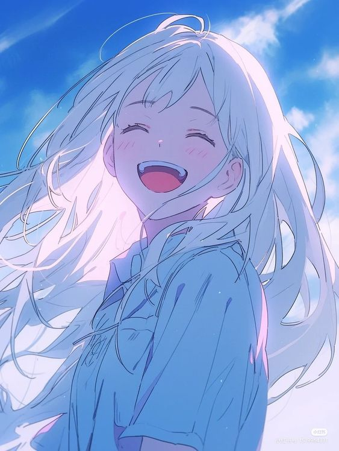

> 해당 이미지에는 애니메이션 스타일로 그려진 한 소녀가 등장합니다. 

*   **배경**: 이미지의 배경은 하늘이 그려져 있습니다. 하늬는 밝은 하늘색이며, 흰 구름들이 떠 있습니다. 
*   **캐릭터**: 이미지 중앙에는 하늘색 머리를 가진 소녀가 그려져 있습니다. 
    *   **머리**: 소녀의 머리는 긴 편이며, 머릿결은 잔잔하지 않고 잔잔하지 않게 그려져 있습니다. 
    *   **옷**: 소녀는 하늘색 반팔 티셔츠를 입고 있습니다. 
    *   **표정**: 소녀는 눈을 감고 크게 웃는 표정입니다. 뺨이 살짝 붉어져 있습니다. 
*   **레이아웃**: 이미지는 소녀의 상반신이 중앙에 위치하도록 구성되어 있습니다. 
*   **UI 요소**: 이미지에는 별다른 UI 요소가 포함되어 있지 않습니다. 오른쪽 하단 모퉁이에 작게 마스코트와 숫자가 포함된 로고가 있습니다. 

전체적으로 해당 이미지는 밝고 청량한 느낌을 주는 애니메이션 이미지입니다.

> 해당 이미지에는 한 여성 캐릭터가 그려져 있습니다. 

*   **배경** 밝은 노란색을 배경으로 여러 개의 노란색 꽃이 그려져 있습니다. 
*   **캐릭터** 긴 금발머리를 한 여성 캐릭터가 그려져 있습니다. 
    *   머리는 왼쪽으로 긴 땋은 머리를 하고 있습니다. 
    *   눈은 감긴 상태로 웃는 표정입니다. 
    *   입꼬리가 올라가 있는 것으로 보아 기쁜 감정으로 웃고 있는 것으로 추측됩니다. 
    *   캐릭터의 볼은 살짝 붉어진 상태입니다. 
    *   흰색의 민소매 드레스를 입고 있습니다. 
    *   드레스에는 노란색 리본이 묶여 있습니다. 
    *   드레스 양쪽 어깨에는 노란색의 퍼프가 달려 있습니다. 
*   **서명** 이미지 오른쪽 하단에는 검은색의 필체로 **Shim**이라는 문구가 적혀 있습니다. 
*   **전체적인 분위기** 밝고 화사한 분위기를 자아냅니다.

---

## 슬라이드 6

### 조력자

#### 얇은 허리, 다리.

#### 흔히 연예인 몸매 하면

#### 떠오르는 체형

#### 가슴 좀 더 크게

#### 여리여리한 느낌

#### 시골 소녀 같은 느낌.

#### 코르셋 말고 리본이 더 귀여움

#### 팔에 꽃다발을 안겨줘도 귀여울 듯

#### Sd 레퍼런스

#### 길게 내려오는 치마

#### 도톰한 짧은 치마

#### 펑퍼짐 바지

#### 셋 다 귀여울 듯

> 이미지에는 세 명의 여성 캐릭터에 대한 스케치가 포함되어 있습니다. 

*   **첫 번째 여성 캐릭터:** 첫 번째 여성 캐릭터는 왼쪽에 위치하고 있습니다. 이 캐릭터는 왼쪽 다리를 앞으로 뻗은 채로 서 있는 자세를 하고 있습니다. 손은 왼쪽 허벅지에 위치하고 있습니다. 
*   **두 번째 여성 캐릭터:** 가운데에 위치한 두 번째 여성 캐릭터는 한쪽 손을 머리 위로 올리고 다른 한쪽 손을 아래로 내린 채로 서 있습니다. 
*   **세 번째 여성 캐릭터:** 세 번째 여성 캐릭터는 오른쪽에 위치하고 있습니다. 이 캐릭터는 왼쪽 손을 뒤로 뻗은 채로 서 있는 자세를 하고 있습니다. 

이러한 자세들은 게임 캐릭터의 다양한 움직임을 표현하기 위한 기초적인 드로잉 연습으로 활용될 수 있습니다.

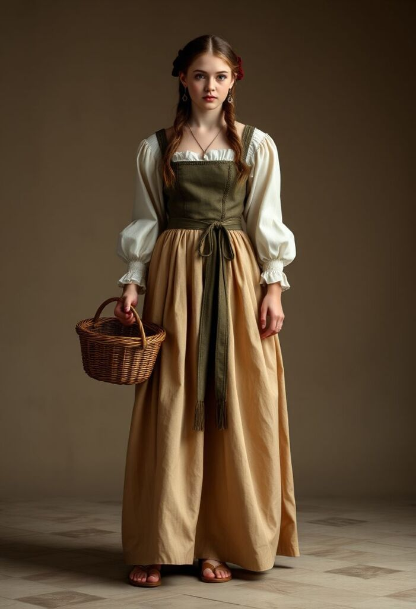

> 이미지는 게임 기획 문서의 일부로 보이는 이미지입니다. 이미지 중앙에 서 있는 한 여성의 모습을 담고 있습니다.

*   **여성 캐릭터:** 여성은 갈색 머리를 땋아 내린 헤어스타일을 하고 있으며, 올림머리의 옆 머리가 일부 풀어져 내린 상태입니다. 액세서리로 머리에 붉은색 리본을 착용하고 있습니다. 또한, 귀걸이와 목걸이를 착용하고 있습니다. 
*   **의상:** 여성은 흰색 긴팔 상의와 녹색과 베이지색이 조합된 긴 치마를 입고 있습니다. 상의는 퍼프 슬리브 디자인이며, 소매 부분에 레이스 디테일이 있습니다. 상의를 녹색 오버롤 안에 입은 모습이며, 오버롤 허리 부분에 끈이 묶여 있습니다. 치마는 베이지색이며, 녹색 띠가 이어져 있습니다. 
*   **신발:** 여성은 가볍고 편안해 보이는 베이지색 샌들을 착용하고 있습니다. 
*   **바구니:** 여성은 왼손에 둥근 모양의 짚으로 만든 바구니를 들고 있습니다. 바구니에는 아무것도 들어 있지 않은 것으로 보입니다. 
*   **배경:** 배경은 단조로운 베이지색 벽과 타일 패턴의 바닥으로 구성되어 있습니다. 

전체적으로 고전적이고 시골스러운 느낌을 주는 이미지이며, 여성은 아마도 마을 사람, 농부, 또는 상점 주인 등 다양한 역할을 맡을 수 있는 캐릭터로 설정된 것 같습니다.

> 이미지는 무대 위에 서 있는 한 여성의 사진입니다. 여성은 무대에서 조명 빛을 받으며 촬영되었습니다.

*   **인물과 의상:** 
    *   여성은 사진 중앙에 서 있습니다. 
    *   여성의 머리는 가운데를 가르마 타서 양옆으로 넘긴 헤어스타일이며, 머리색은 적갈색입니다. 
    *   여성은 화장을 한 상태이며, 입술에 짙은 색깔의 립스틱을 바른 것이 보입니다. 
    *   여성은 가슴 부분이 하얀색이고, 허리부터 아래는 갈색과 하얀색이 조합된 옷을 입고 있습니다. 
    *   가슴과 허리 라인은 베이지색, 그 위는 하얀색, 허벅지부터 발목까지는 갈색과 하얀색이 조합된 옷을 입고 있습니다. 
    *   여성의 신발은 샌들 타입의 신발을 착용하고 있습니다. 
*   **배경:**
    *   배경은 짙은색으로 추정되며, 무대 조명으로 인해 왼쪽에 벽으로 추정되는 구조물이 희미하게 보입니다. 
    *   바닥은 짙은 회색이며, 하얀색 선이 일정한 간격으로 그어져 있습니다. 
*   **종합:**
    *   사진 속 인물과 배경을 바탕으로, 이 여성은 연극이나 뮤지컬에 출연한 배우로 추정됩니다.

> 해당 이미지에는 한 명의 캐릭터가 그려져 있습니다. 

*   캐릭터의 생김새: 

    *   긴 회색 머리카락에, 왼쪽에는 파란색 리본, 오른쪽에는 검은색 리본을 묶고 있습니다. 
    *   눈은 큰 편이며, 눈동자는 분홍색입니다. 
    *   입꼬리가 올라가 있어 귀엽게 묘사되어 있습니다. 
*   캐릭터의 의상: 

    *   분홍색 하트 모양의 장식이 달린 하얀색 헤어밴드를 착용하고 있습니다. 
    *   분홍색과 하늘색 꽃 모양의 귀여운 장식이 달린 긴 머리를 가지고 있습니다. 
    *   검은색과 하얀색이 조합된 귀여운 디자인의 옷을 입고 있습니다. 
    *   무릎까지 오는 하얀색 스타킹을 착용하고 있습니다. 
    *   신발은 검은색 Mary Jane 타입의 구두를 신고 있습니다. 
*   배경 

    *   하얀색 배경에 연한 하늘색 테두리가 있습니다. 
    *   테두리 안에는 여러 가지의 하트와 꽃, 구름 모양이 그려져 있습니다. 
    *   이미지 하단 중앙에는 검은색 선으로 캐릭터의 실루엣이 그려져 있습니다. 
    *   이미지 오른쪽 하단에는 `redink_ 7417620994`라는 워터마크가 있습니다.

---

## 슬라이드 7

### 아군 1

| 항목 | 내용 |
| --- | --- |
| 이름 | 더 풀 |
| 성별 | 여성 |
| 키/나이 | 177cm/24세 |
| 체형 | 마른 근육, 겉으로는 안 드러나지만 벗겨보면 근육이 꽉 찬 느낌 |
| 성격 | 능글능글, 여유있고 규율에 얽매이지 않는 자유로움 |
| 말투 |  |
| 역할 | 방랑자, 유랑인, 중간에 합류를 위한 캐릭터. |

#### 몸만 참고

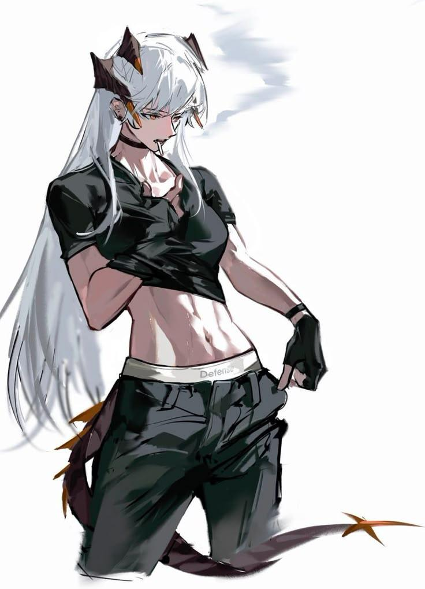

> 해당 이미지에는 한 여성 캐릭터가 그려져 있습니다. 

*   캐릭터의 생김새

    *   긴 은색 머리카락과 귀가 뾰족하게 생긴 캐릭터입니다. 
    *   눈은 노란색이며, 입꼬리가 올라가있는 표정으로 묘사되어 있습니다. 
    *   캐릭터의 허리에는 꼬리가 그려져 있으며, 꼬리의 끝부분은 노란색입니다. 
    *   캐릭터의 귀와 꼬리 끝 부분에는 노란색과 갈색이 섞여 있습니다. 
*   캐릭터의 의상

    *   검은색 반팔 티셔츠를 입고 있으며, 티셔츠 허리 부분에는 하얀색 띠가 묶여있습니다. 
    *   띠에는 "Defense"라는 단어가 적혀있습니다. 
    *   검은색 반바지를 입고 있으며, 왼쪽 장갑을 착용하고 있습니다. 
    *   신발은 착용하고 있지 않습니다. 
*   배경 

    *   흰색 배경이며, 캐릭터의 뒤로 연기처럼 흐릿하게 표현된 무늬가 있습니다. 
*   종합 

    *   전반적으로 위 캐릭터는 게임 캐릭터 기획안으로 추정되며, 악마와 같은 캐릭터의 모습을 보여주고 있습니다. 
    *   캐릭터의 표정과 자세를 통해 게임 속에서 강한 캐릭터의 모습을 표현하고 있습니다.

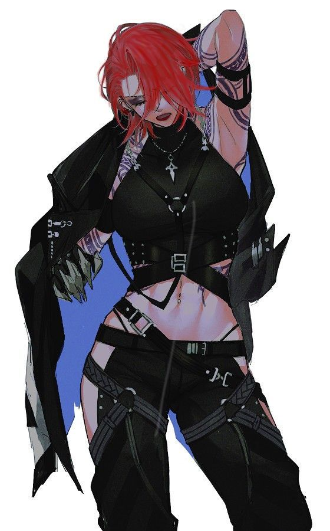

> 이미지는 검은색 의상을 입고 있는 빨간 머리의 여성 캐릭터를 묘사하고 있습니다. 

*   캐릭터의 머리는 빨간색이며, 머리카락이 얼굴을 가리고 있습니다. 눈은 한쪽이 반쯤 감겨져 있고, 입꼬리가 올라가 있는 것으로 보아 무언가 조롱하는 표정으로 보입니다. 
*   캐릭터는 검은색 옷을 입고 있으며, 허리 부분이 드러나는 상의와 비슷한 색상의 팬티를 입고 있습니다. 
*   상의는 가운데가 트여 있고, 허리에는 벨트를 착용하고 있습니다. 
*   하의는 검은색 바지이며, 허벅지 부분에 가터벨트를 착용하고 있습니다. 
*   캐릭터의 팔과 다리에는 여러 개의 스트랩과 가터가 묶여 있습니다. 
*   캐릭터는 목에 은색 펜던트가 달린 목걸이를 착용하고 있습니다. 
*   캐릭터의 왼팔은 뒤로 뻗어져 있으며, 팔꿈치부터 손목까지 여러 개의 검은색 띠가 묶여 있습니다. 
*   캐릭터의 오른손에는 날카로운 손톱이 달린 장갑을 착용하고 있습니다. 
*   캐릭터의 뒤에는 검은색 망토를 착용하고 있습니다. 
*   배경은 흰색이며, 캐릭터의 뒤에 약간의 파란색이 보이는 것으로 보아, 파란색 배경에 캐릭터가 서 있는 것으로 추정됩니다. 

전체적으로 캐릭터는 강하고 섹시한 인상을 주고 있습니다. 캐릭터의 표정과 자세로 보아, 공격적이거나 반항적인 성격을 가진 캐릭터로 추정됩니다.

---

## 슬라이드 8

### 아군 1

#### 양치기, 숲 떠돌이 같은 이미지

#### 기본적으로 웃는 얼굴

#### 피부도 타서 까무잡잡

#### 후드 쓰고 있는 복식

#### 자연 친화적, 생존 친화적

#### + 지팡이

#### Sd 레퍼런스

#### 지팡이 짚고 있는 느낌

#### 여유롭게 상체를 뒤로 약간 눕힘

> 이 그림은 흑백으로 그려진 삽화입니다. 남자가 구름이 감싸고 있는 산 정상에서 지팡이를 짚고 있는 모습을 묘사하고 있습니다.

*   인물: 중앙에 서 있는 남성이 있습니다. 남성은 머리가 짧고, 귀걸이를 착용하고 있습니다. 남성의 오른쪽에는 무늬가 있는 옷을 입고 있습니다. 왼팔에는 같은 무늬로 장식된 띠를 착용하고 있습니다. 남성의 왼팔에는 동일한 무늬의 띠를 착용하고 있습니다. 남성은 지팡이를 오른손에 쥐고 있습니다. 지팡이의 손잡이 윗부분은 곡선 형태로 디자인되어 있습니다. 
*   배경: 남성의 뒤로는 여러 구름이 감싸고 있습니다. 구름은 여러 형태로 그려져 있습니다. 구름은 남성의 머리 위로 여러 방향으로 퍼져 있습니다. 
*   전경: 산의 바위와 풀이 그려져 있습니다. 바위와 풀은 검은색으로 표현되어 있습니다. 풀이 무성한 모습으로 그려져 있습니다.

전체적으로 이 삽화는 신비로운 분위기를 연출하고 있습니다. 남성의 웅장한 모습과 구름, 바위와 풀이 조화롭게 그려져 있습니다.

> 이미지는 숲 속에 서 있는 한 인물의 상반신을 촬영한 사진입니다. 

*   인물은 베이지색의 긴 소매 옷을 입고 있습니다. 옷의 전면에는 갈색과 녹색 실로 나무가 수놓아져 있습니다. 동일한 패턴의 옷이 양쪽 팔에도 그려져 있습니다. 
*   녹색 후드를 뒤집어쓴 모습이며, 허리에는 두꺼운 가죽 허리띠를 착용하고 있습니다. 허리띠에는 가운데에 녹색 구슬이 달려있고, 왼쪽에는 주머니가, 오른쪽에는 화살통이 허리춤에 묶여 있습니다. 
*   인물은 왼손에 나무로 만든 지팡이를 쥐고 있습니다. 지팡이는 가운데가 비틀어져 있습니다. 
*   허리춤에 묶인 주머니에는 녹색의 풀이 가득 담겨 있습니다. 
*   인물은 숲을 배경으로 서 있습니다. 나무 줄기와 숲의 일부가 배경으로 보입니다. 
*   인물은 반쯤 눈을 가린 상태로, 입꼬리가 살짝 올라간 표정입니다.

> 이 게임 기획 문서에는 인물과 관련된 여러 의상 요소들이 포함되어 있습니다. 

왼쪽에는 긴 녹색 망토가 있고, 중앙에는 녹색 상의, 바지 및 액세서리가 있고, 오른쪽에는 녹색 상의와 긴 바지가 있습니다.

각각의 의상은 녹색과 베이지색으로 구성되어 있으며, 허리에는 가죽 벨트를 착용하고 있습니다. 왼쪽의 망토와 중앙의 상의에는 황금색 꽃 무늬가 있고, 각 의상에는 다양한 크기와 색상의 녹색 잎이 장식되어 있습니다.

중앙의 의상에는 허리 왼쪽에 작은 가방이 있고, 오른쪽에는 비슷한 크기의 가방이 있습니다. 왼쪽의 망토에는 녹색 구슬이 달린 장식품이 있고, 중앙의 의상에는 비슷한 녹색 구슬이 달린 장식품이 있습니다.

각각의 의상에는 고유한 디자인과 장식품이 있으며, 전반적으로 자연스럽고 유기적인 느낌을 줍니다. 배경은 베이지색이며, 오른쪽 중앙에는 "Mosaic"이라는 단어가 적혀 있습니다.

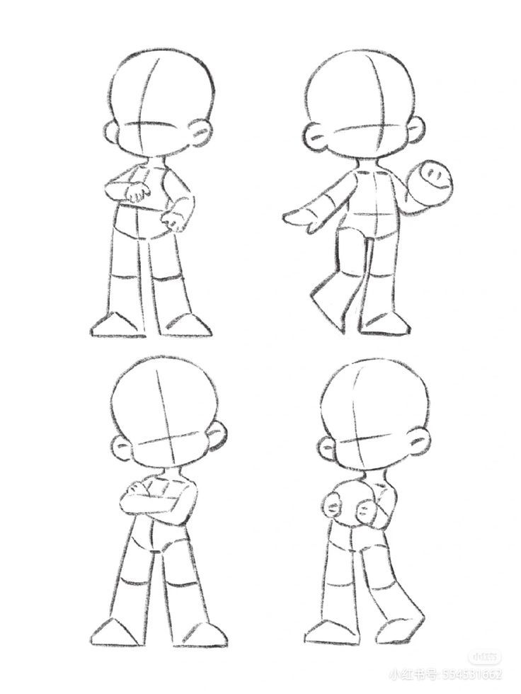

> 이 그림은 게임 캐릭터에 대한 기획 문서의 일부로 추정됩니다. 

그림은 네 부분으로 나뉘어져 있으며, 각 부분에는 동일한 캐릭터가 다른 포즈로 그려져 있습니다.

*   **상단 왼쪽 그림:** 캐릭터가 정면을 응시하며 왼팔을 굽혀서 손을 배꼽 근처에 위치시키고, 오른팔을 곧게 펴서 아래로 내린 자세를 하고 있습니다. 
*   **상단 오른쪽 그림:** 캐릭터가 왼쪽을 응시하며 왼팔을 옆으로 뻗고, 오른팔을 굽혀서 공을 잡은 듯한 자세를 하고 있습니다. 
*   **하단 왼쪽 그림:** 캐릭터가 정면을 응시하며 양팔을 교차한 채로 팔짱을 풀지 않은 자세를 하고 있습니다. 
*   **하단 오른쪽 그림:** 캐릭터가 오른쪽을 응시하며 왼팔을 굽혀서 손을 배꼽 근처에 위치시키고, 오른팔을 굽혀서 공을 잡은 듯한 자세를 하고 있습니다.

모든 그림에서 캐릭터의 눈, 코, 입 등 얼굴의 세부적인 모습은 그려져 있지 않습니다. 

각각의 그림은 캐릭터의 머리, 몸, 팔, 다리 등에 대한 윤곽과 비율을 나타내고 있습니다. 캐릭터의 머리는 원형으로 그려져 있으며, 몸과 팔, 다리는 단순화된 직선과 곡선으로 표현되어 있습니다.

이미지 하단 중앙에는 작은 글씨로 중국어로 추정되는 문자가 포함되어 있습니다.

---

## 슬라이드 9

### 아군 2

| 항목 | 내용 |
| --- | --- |
| 이름 | 저스티스 |
| 성별 | 남성 |
| 키/나이 | 155cm/13세 |
| 체형 | 짜리몽땅, 팔 다리가 긴 어린이~청소년 체형. |
| 성격 | 냉정하고 무뚝뚝, 자기 희생적. 책임감 있어 보이는 가장 같지만 어린아이 같은 면모를 숨기지 못함. |
| 말투 |  |
| 역할 | 적군이었다가 아군이 된 캐릭터, 죄책감과 속죄. 적군에 대한 부정적 인식 강화. |

#### 얼굴 인상 참고

> 해당 이미지에는 한 명의 캐릭터가 등장합니다. 

*   캐릭터의 생김새: 

    *   남성화장 캐릭터입니다. 
    *   머리카락은 검은색이며, 약간 푸른빛이 도는 녹색이 섞여 있습니다. 머리카락이 귀엽고 약간 흐트러진 듯한 스타일입니다. 눈동자는 밝은 노란색입니다. 
    *   오른쪽 귀에는 귀고리를 착용하고 있습니다. 
*   캐릭터의 의상: 

    *   검은색 재킷과 회색 반팔 드레스셔츠를 입고 있습니다. 
    *   검은색 넥타이를 착용하고 있습니다. 
    *   검은색 반바지를 입고 있습니다. 
    *   무릎까지 오는 하얀색 긴 양말을 착용하고 있습니다. 
    *   검은색 구두를 신고 있습니다. 
*   캐릭터의 표정: 

    *   약간 화가 난 듯한 표정입니다. 
*   캐릭터의 배경: 

    *   배경은 하얀색입니다. 
*   이미지 하단에 표기된 문구: 

    *   XIAO | @amoon_e 
    *   DO NOT USE & DO NOT REUPLOAD | AI TRAINING PROHIBITED

> 이미지 중앙에 있는 캐릭터는 애니메이션 스타일의 일러스트입니다. 

*   캐릭터의 머리는 검은색이며, 이마에는 하얀색과 보라색의 눈물 모양의 무늬가 있고, 눈은 노란색입니다. 귀 근처 머리에는 청록색 줄무늬가 있고, 왼쪽 귀 뒤로는 긴 청록색 머리카락이 목까지 내려와 있습니다. 
*   캐릭터는 베이지색 후드를 머리에 쓰고 있습니다. 후드 윗부분에는 흰색 줄무늬가 있고, 후드 아래로는 검은색과 흰색 줄무늬가 그려져 있습니다. 
*   캐릭터는 흰색과 검은색이 섞인 옷을 입고 있습니다. 가슴에는 빨간색과 녹색의 한자가 그려져 있고, 그 아래에는 2026.01.21이라는 날짜가 적혀 있습니다. 
*   왼쪽 팔에는 녹색 줄무늬가 그려져 있고, 오른쪽 어깨에는 날카로운 가시 모양의 장식이 있습니다. 
*   허리에는 검은색 허리띠를 착용하고 있고, 허리띠 아래에는 흰색 옷이 묶여 있습니다. 
*   캐릭터의 옆에는 'Xiao'라는 단어가 적혀 있습니다. 

전체적으로 이 캐릭터는 신비롭고 조금은 위협적인 분위기를 가지고 있습니다.

---

## 슬라이드 10

### 아군 2

#### 어린이~ 청소년이지만

#### 청소년에 좀 더 가깝게

#### 위 그림보다 근육 추가

#### 부분 갑주 + 망토

#### 대검 사용 or 소드를 대검처럼 활용

#### + 눈가리개

#### Sd 레퍼런스

#### 어깨는 갑주로 강조

#### 덩치 커보이게,

#### 망토로 아래쪽 강조

> 해당 이미지는 게임 캐릭터의 컨셉 아트입니다. 

이미지 중앙에 있는 캐릭터는 동일한 캐릭터의 다른 각도에서 본 모습입니다. 

가장 왼쪽에 있는 그림은 캐릭터의 전체 모습을 보여줍니다. 

*   키가 크고 날씬한 체형을 가지고 있습니다. 
*   눈은 감고 있으며, 눈썹은 짙고 두꺼운 편입니다. 
*   코는 오뚝한 편이며, 입꼬리가 살짝 올라가 있습니다. 
*   피부는 밝은 편이며, 얼굴에 주근깨가 있습니다. 
*   머리카락은 짙은 갈색이며, 머리카락이 약간 헝클어져 있습니다. 
*   짙은 회색의 민소매 상의에 허리춤에 벨트를 착용하고 있습니다. 
*   짧은 치마를 입고 있으며, 바지 위에 허벅지 부위까지 올라오는 긴 부츠를 착용하고 있습니다. 
*   짙은 갈색의 망토를 착용하고 있으며, 망토의 깃 부분에는 짙은 회색 털이 덧대어져 있습니다. 
*   부츠와 망토의 깃 부분에 동일한 짙은 회색 털이 덧대어져 있습니다.

오른쪽 상단, 중앙, 하단에는 각각 다른 각도에서 본 캐릭터의 모습이 그려져 있습니다. 

*   상단에는 정면이 아닌 측면을 강조하여 그렸습니다. 
*   눈을 뜨고 있으며, 짙은 눈썹과 짙은 갈색 머리카락을 가지고 있습니다. 
*   중앙과 하단에는 각각 옆과 아래에서 본 캐릭터의 머리를 묘사하고 있습니다. 
*   눈을 감고 있으며, 짙은 눈썹과 짙은 갈색 머리카락을 가지고 있습니다. 

전체적으로 이 캐릭터는 중세 판타지 세계의 전사나 모험가로 추정되며, 짙은 색상의 옷과 망토를 착용하고 있습니다.

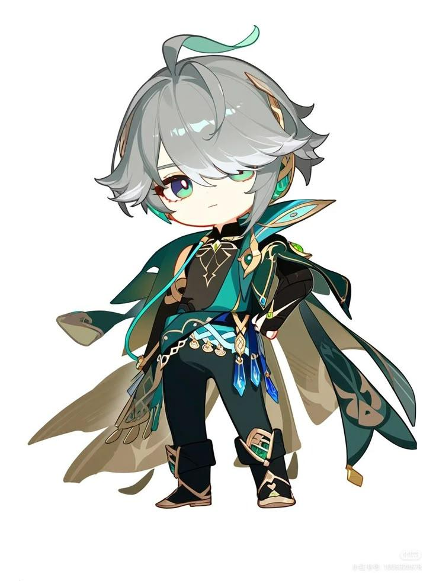

> 해당 이미지에는 한 명의 캐릭터가 그려져 있습니다. 

*   캐릭터의 생김새: 

    *   짧은 회색 머리카락과 녹색 눈을 가지고 있습니다. 
    *   왼쪽 눈 밑에 눈물을 흘리는 듯한 형태의 붉은 선이 그려져 있습니다. 
    *   이마에는 리본으로 묶인 듯한 머리카락이 있습니다. 
*   캐릭터의 의상: 

    *   검은 바지와 부츠를 착용하고 있습니다. 
    *   녹색과 금색이 조합된 상의를 입고 있습니다. 
    *   녹색 망토를 착용하고 있습니다. 
    *   녹색과 금색이 조합된 장갑을 착용하고 있습니다. 
    *   허리에는 금색과 파란색의 허리띠를 착용하고 있습니다. 
    *   왼쪽 부츠에는 녹색의 장식이 있습니다. 
*   배경: 

    *   흰색 배경입니다. 
*   추가적인 요소: 

    *   우측 하단 모퉁이에 아주 작은 크기의 한자가 포함되어 있습니다. 

이로써 이미지 내 포함된 모든 요소를 상세하게 설명하였습니다.

> 이미지는 중세 갑옷을 입은 전사의 상반신을 묘사하고 있습니다. 

*   전사는 어깨와 가슴을 덮는 금속 갑옷을 착용하고 있습니다. 갑옷은 어깨 부분에서 목을 감싸는 형태로 디자인되어 있으며, 금속 재질로 만들어진 것으로 보입니다. 
*   전사의 머리는 금속으로 만들어진 투구로 보호되고 있습니다. 투구는 얼굴을 가리고 코와 입을 덮는 형태입니다. 
*   왼쪽 어깨에는 추가적인 방어구를 착용하고 있습니다. 
*   갑옷은 어깨와 가슴을 보호하기 위해 여러 조각으로 구성되어 있으며, 각 조각은 서로 연결되어 있습니다. 
*   갑옷의 표면은 거칠고, 녹이 슨 것처럼 보입니다. 이는 오랜 시간 동안 전투에서 사용된 갑옷임을 암시합니다. 
*   전사는 목에 푸른색의 망토를 착용하고 있습니다. 
*   오른쪽에는 검이 보입니다. 

전반적으로, 이 전사는 중세의 기사나 무사를 연상케 하는 모습입니다.

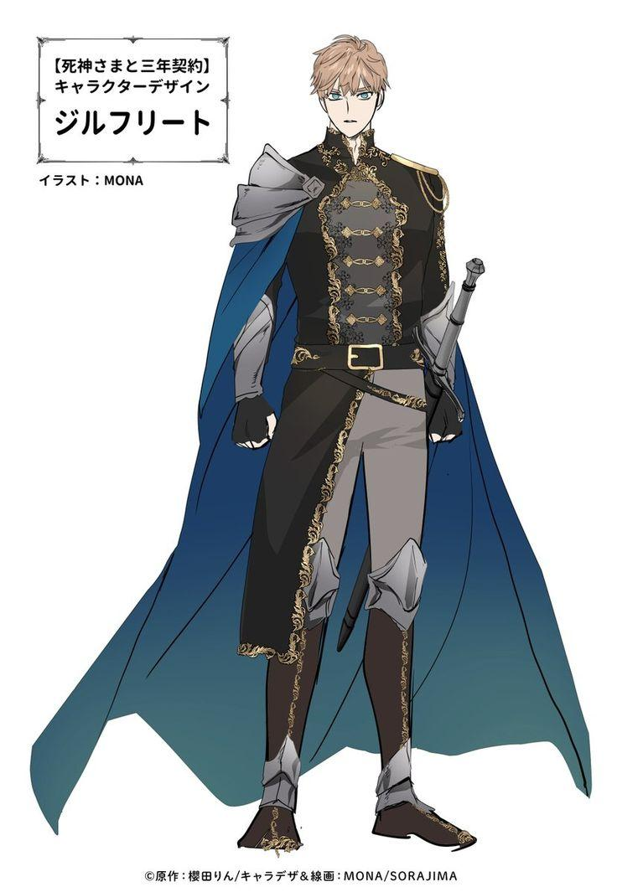

> 해당 이미지에는 한 명의 캐릭터가 등장합니다. 캐릭터의 이름은 지ルフリート (질프리트)입니다.

*   캐릭터의 생김새: 짧은 금발에 파란 눈을 가지고 있습니다. 
*   캐릭터의 의상: 블랙과 그레이, 네이비블루색이 조합된 군복과 같은 디자인의 유니폼을 입고 있습니다. 유니폼에는 금색의 장식이 어우러져 있습니다. 유니폼 안쪽으로는 회색의 셔츠를 입고 있습니다. 왼쪽에는 검이 있습니다. 등에 네이비 블루색의 망토를 착용하고 있습니다.

등장하는 텍스트는 다음과 같습니다.

*   왼쪽 상단: 

    *   사각형 테두리 안: 【死神さまと三年契約】キャラクターデザイン (저작권 표기)
    *   지ルフリート (캐릭터 이름)
*   왼쪽 중단: イラスト：MONA (일러스트레이터)
*   하단 중앙: 

    *   저작권 표시
    *   원작: 桜田りん / 캐릭터 디자인 & 설정: MONA/SORAJIMA

---

## 슬라이드 11

### 아군 3

| 항목 | 내용 |
| --- | --- |
| 이름 | 매지션 |
| 성별 | 여성 |
| 키/나이 | 165cm/21세 |
| 체형 | 얇은 허리, 허벅지 강조 살짝 통통해서 살이 눌리는 체형 |
| 성격 | 능글맞음, 예측 불가, 선/악 안 따지고 재밌으면 다임~,광기 |
| 말투 |  |
| 역할 | 예측 불가의 말광량이/광대, 인형술사 같은 느낌, |

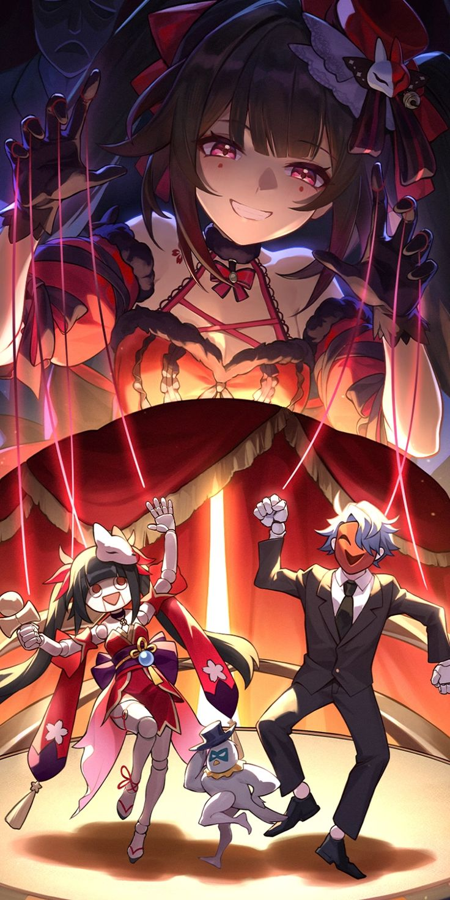

> 해당 이미지 속에는 네 명의 캐릭터가 등장합니다. 

가장 위에는 검은 머리와 붉은 눈을 가진 소녀가 크게 그려져 있습니다. 이 소녀의 머리에는 리본이 있고, 입가에는 미소를 띤 표정이 그려져 있습니다. 이 소녀의 양 손목에서는 여러 가닥의 핑크색 실이 이어져 내려오고 있습니다. 

해당 소녀의 아래에는 세 명의 캐릭터가 함께 그려져 있습니다. 

왼쪽에는 검은 머리와 노란 머리가 섞인 소녀가 그려져 있습니다. 이 소녀는 고양이 귀가 달린 분홍색과 보라색의 옷을 입고 있습니다. 이 소녀의 왼손은 허공에 들고 있습니다. 

이 소녀의 오른쪽에는 하얀 머리를 가진 남성이 슈트와 넥타이를 입고 춤을 추는 듯한 자세로 그려져 있습니다. 

마지막으로, 이 남성의 왼쪽에는 작은 새가 등장합니다. 이 새는 고양이 귀가 달린 모자를 쓰고 있습니다. 

네 명의 캐릭터 모두 조명이 비추는 밝은 바닥을 배경으로 그려져 있습니다. 배경에는 붉은 커튼이 있고, 그 위로 하얀 조명이 새어 나오고 있습니다.

> 다음은 제공한 이미지에 대한 상세한 설명입니다.

이미지 중앙에는 하얀 피부에 긴 흑발을 가진 여성 캐릭터가 배치되어 있습니다. 이 캐릭터는 블랙과 화이트 색상의 의상을 입고 있으며, 검은색 조커 모자를 쓰고 있습니다. 

여성의 양쪽 눈썹은 검은색 X자 모양으로 꾸며져 있고, 눈동자는 핑크색입니다. 입꼬리가 올라간 표정으로 묘사되어 있습니다. 

여성의 의상은 블랙 드레스와 화이트 가터벨트, 무릎까지 올라오는 블랙 스타킹으로 구성되어 있습니다. 

등 뒤로는 날개를 펼친 듯한 모습이 그려져 있습니다. 

여성은 쇠사슬이 달린 그네를 양손에 잡고 흔들고 있습니다. 

배경에는 핑크색과 흰색 줄무늬가 그려져 있으며, 검은색과 하얀색 체크무늬도 일부 보입니다. 

이미지 상단에는 스파이크가 달린 눈 모양이 그려져 있습니다.

---

## 슬라이드 12

### 아군 3

#### 광대 복장, 짧고 약간 섹시하게

#### 제발 허벅지를 드러나게 해주세요.

#### 밴딩이나 장식을 추가하면 좋을 듯

#### 위 체형보다 조금만 더 통통하게

#### 끈 같은 것에 살이 눌릴 정도.

#### SD 레퍼런스

#### 과한 자세 좋아요.

#### 공중에 떠있는 형태여도 좋을 듯

#### 체인, 검, 가면, 채찍, 인형 조종 줄 등 광대랑 어울리는 무기로 들려주세요

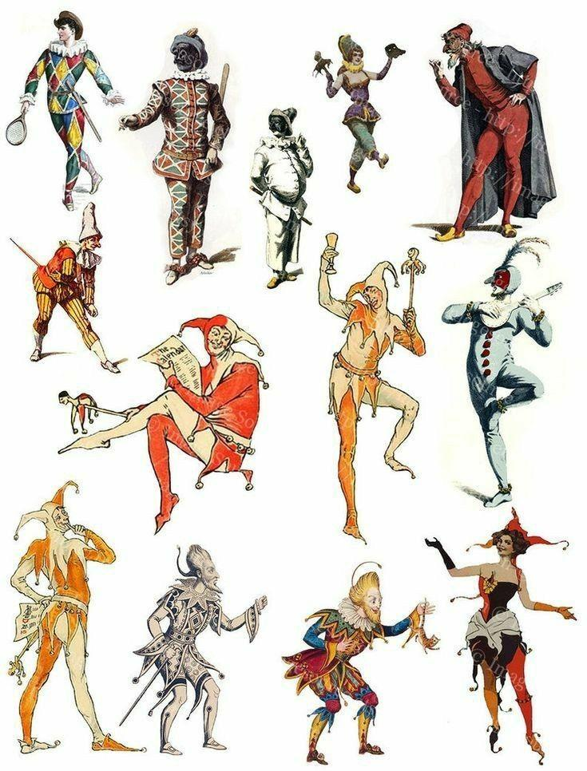

> 해당 이미지 속에는 14명의 서커스 광대의 모습이 그려져 있습니다. 

가장 왼쪽 상단부터 인물들을 소개해 드리겠습니다.

*   첫 번째 인물: 남성이 테니스 라켓과 검을 들고 있습니다. 
*   두 번째 인물: 남성이 방패를 들고 있습니다. 
*   세 번째 인물: 배가 나온 남성이 양손을 귀에 가까이 가져다 대고 있습니다. 
*   네 번째 인물: 여성이 새 두 마리를 들고 뛰어가고 있습니다. 
*   다섯 번째 인물: 남성이 검은 망토를 입고 있습니다. 

가장 왼쪽에서 두 번째 줄의 인물들입니다.

*   다섯 번째 인물: 남성이 부채를 들고 있습니다. 
*   여섯 번째 인물: 남성이 신문지를 들고 있습니다. 
*   일곱 번째 인물: 남성이 곤봉을 들고 있습니다. 
*   여덟 번째 인물: 남성이 바이올린을 들고 있습니다. 

가장 왼쪽에서 세 번째 줄의 인물들입니다.

*   아홉 번째 인물: 남성이 머리를 손으로 감싸고 있습니다. 
*   열 번째 인물: 남성이 칼을 들고 있습니다. 
*   열한 번째 인물: 남성이 고양이를 안고 있습니다. 
*   열두 번째 인물: 여성이 부채를 들고 있습니다. 

모든 인물들이 각기 다른 분장을 하고 있으며, 각자의 개성이 돋보이는 자세로 그려져 있습니다.

> 이 자료는 13명의 서커스 광대의 모습입니다.

## 레이아웃

이미지는 3행 4열의 레이아웃으로 구성되어 있습니다.

## 등장 인물

각각의 인물은 다양한 색상과 디자인의 옷을 입고 있습니다. 

*   1행 1열: 남자가 라켓과 막대를 들고 있습니다. 그는 하키스틱처럼 생긴 라켓을 들고 있고, 몸에는 하키 선수처럼 격자 무늬 옷을 입고 있습니다. 
*   1행 2열: 남자가 막대를 들고 있고, 몸에는 1행 1열의 인물과 비슷한 격자 무늬 옷을 입고 있습니다. 
*   1행 3열: 남자가 들고 있는 컵을 마시고 있습니다. 
*   1행 4열: 남자가 검은 망토를 입고 있습니다. 
*   2행 1열: 남자가 막대를 들고 있습니다. 
*   2행 2열: 남자가 신문을 읽고 있습니다. 
*   2행 3열: 남자가 막대를 들고 있습니다. 
*   2행 4열: 남자가 키를 들고 있습니다. 
*   3행 1열: 남자가 머리를 만지고 있습니다. 
*   3행 2열: 남자가 칼을 들고 있습니다. 
*   3행 3열: 남자가 오렌지색 고양이를 안고 있습니다. 
*   3행 4열: 여성이 오렌지 고양이를 안고 있습니다. 

## 공통점

모든 인물은 다양한 색상과 디자인의 옷을 입고 있습니다. 또한, 모든 인물은 미소를 띤 채로 그려져 있습니다.

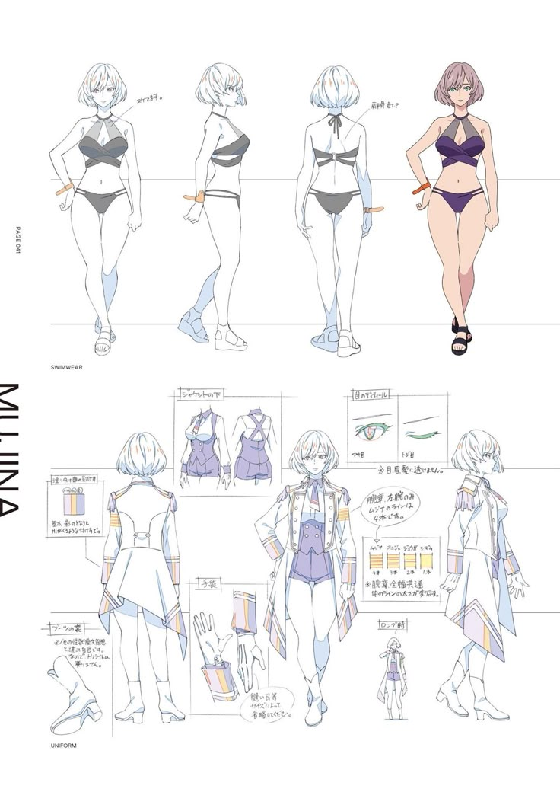

> 해당 이미지는 캐릭터의 디자인과 의상, 그리고 디테일한 부분에 대한 정보를 제공하는 캐릭터 컨셉 아트입니다. 이미지는 두 부분으로 나뉘어져 있으며, 상단에는 수영복 차림의 캐릭터 일러스트, 하단에는 유니폼 차림의 캐릭터 일러스트와 디테일한 부분에 대한 정보가 포함되어 있습니다.

### 상단 부분: 수영복 차림의 캐릭터

*   **캐릭터 일러스트:** 
    *   동일한 캐릭터의 다양한 각도(정면, 측면, 후면)의 일러스트가 그려져 있습니다. 
    *   왼쪽부터 차례대로 정면, 측면, 후면, 컬러 일러스트입니다. 
    *   캐릭터는 짧은 머리를 가지고 있으며, 각 상태에서 비슷한 포즈를 취하고 있습니다. 
    *   이 캐릭터는 왼쪽 허벅지 위쪽에 팔목 형태의 액세서리를 착용하고 있습니다. 
*   **의상:** 
    *   캐릭터는 수영복을 착용하고 있습니다. 
    *   수영복은 회색과 보라색으로, 상의와 하의로 구성되어 있습니다. 
    *   수영복의 디자인은 각 상태에서 자세히 묘사되어 있습니다.

### 하단 부분: 유니폼 차림의 캐릭터

*   **캐릭터 일러스트:** 
    *   유니폼을 착용한 캐릭터의 다양한 각도(정면, 측면, 후면)의 일러스트가 그려져 있습니다. 
    *   캐릭터의 머리카락은 수영복 차림과 동일하지만, 눈동자 색이 더 밝아진 모습입니다. 
    *   유니폼은 주로 흰색, 보라색, 노란색으로 구성되어 있습니다. 
*   **의상 디테일:** 
    *   유니폼의 디자인과 디테일이 자세히 묘사되어 있습니다. 
    *   의상의 구조와 장식, 액세서리 등이 상세하게 그려져 있습니다. 
    *   유니폼에는 여러 장식과 패턴이 포함되어 있어 세련된 디자인을 보여줍니다. 
*   **추가 정보:** 
    *   캐릭터의 신발, 장갑, 얼굴 등 세부 사항에 대한 정보가 포함되어 있습니다. 
    *   캐릭터의 액세서리와 소품에 대한 정보도 자세히 제공됩니다.

### 레이아웃 및 구조

*   **이미지 레이아웃:** 
    *   이미지는 두 부분으로 나뉘어져 있으며, 상단에는 수영복 차림의 캐릭터, 하단에는 유니폼 차림의 캐릭터가 배치되어 있습니다. 
    *   각 캐릭터의 일러스트는 다양한 각도에서 그려져 있어 입체적인 모습을 보여줍니다. 
*   **텍스트와 라벨:** 
    *   이미지에는 일본어로 작성된 텍스트와 라벨이 포함되어 있습니다. 
    *   텍스트는 캐릭터의 의상, 액세서리, 디테일한 부분에 대한 설명을 제공합니다. 
    *   라벨은 각 요소의 위치와 명칭을 명확히 표시합니다.

### 종합

*   이 이미지는 캐릭터의 다양한 의상과 디테일한 부분에 대한 정보를 제공하는 상세한 컨셉 아트입니다. 
*   수영복과 유니폼 두 가지 버전의 의상이 포함되어 있으며, 각 의상의 디자인과 구조가 자세히 묘사되어 있습니다. 
*   이미지는 캐릭터의 다양한 각도에서의 모습을 보여주어, 캐릭터의 전체적인 디자인과 미적 감각을 강조합니다. 
*   텍스트와 라벨을 통해 각 요소에 대한 자세한 설명이 제공되어, 디자이너나 개발자가 참고하기 용이합니다. 
*   전반적으로, 이 이미지는 캐릭터의 시각적 매력을 강조하며, 게임이나 애니메이션에서의 활용을 위한 기초 자료로 사용될 수 있습니다.

> 해당 이미지에는 두 개의 캐릭터가 그려져 있습니다. 

*   **왼쪽 캐릭터**는 무릎을 꿇은 자세로 왼쪽을 향해 몸이 돌아가 있고, **오른쪽 캐릭터**는 오른쪽을 향해 몸이 돌아가 있는 자세로 한쪽 손을 허벅지에 올리고 다른 한쪽 손을 앞으로 내밀어 무언가를 말하는 듯한 자세를 하고 있습니다. 
*   두 캐릭터 모두 머리가 크고 눈이 큰 아기 같은 생김새로 그려져 있습니다. 
*   **왼쪽 캐릭터**는 파란색 선으로 그려졌고, **오른쪽 캐릭터**는 빨간색 선으로 그려졌습니다. 
*   **왼쪽 캐릭터**의 이마에는 땀방울이 세 개 그려져 있고, **오른쪽 캐릭터**의 눈에는 하트가 그려져 있습니다. 
*   두 캐릭터의 머리 주변에는 하트, 별, 불꽃 등이 그려져 있어 두 캐릭터가 서로를 좋아하는 듯한 묘사가 표현되어 있습니다. 
*   이미지 하단 중앙에는 보라색으로 **@yun_kie**라고 쓰여 있습니다. 
*   이미지의 배경은 하얗습니다.

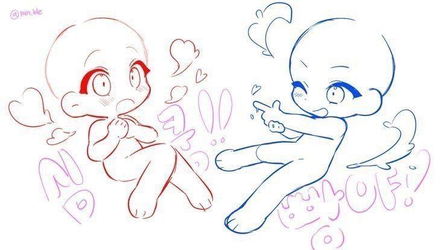

> - **이미지 설명:**

  - 두 개의 작은 천사 캐릭터가 그려져 있습니다.

  - 왼쪽 천사는 빨간색으로 그려져 있고, 오른쪽 천사는 파란색으로 그려져 있습니다.

  - 두 천사 모두 날개를 가지고 있으며, 하트와 같은 심볼이 주변에 있습니다.

  - 왼쪽 천사는 두 손을 입에 대고 놀란 표정을 하고 있고, 오른쪽 천사는 왼쪽을 향해 손가락을 가리키며 당황한 표정을 하고 있습니다.

  - 이미지 하단에는 "No!"와 "Love!"라는 단어가 낙서체로 적혀 있습니다.

  - 이미지 왼쪽 상단에는 "@min_ble"라는 아이디가 적혀 있습니다.

- **텍스트:**

  - "No!" (왼쪽, 낙서체, 보라색)

  - "Love!" (오른쪽, 낙서체, 보라색)

  - "@min_ble" (왼쪽 상단, 보라색)

---

## 슬라이드 13

### 아군 4

| 항목 | 내용 |
| --- | --- |
| 이름 | 더 스타 |
| 성별 | 남성 |
| 키/나이 | 148.5cm |
| 체형 | 전형적인 쇼타 체형. 초 5~6정도. 무릎이 핑크 |
| 성격 | 말랑말랑 활기참, 어리숙하고 미숙한 부분이 있으며 그 점을 부끄러워함. 완벽함을 추구하지만 완벽하지 못함. |
| 말투 |  |
| 역할 | 팀 내 막내, 반짝반짝 빛나고 챙겨주고 싶어지는 포지션 |

#### 인상 참고

#### 체형 참고

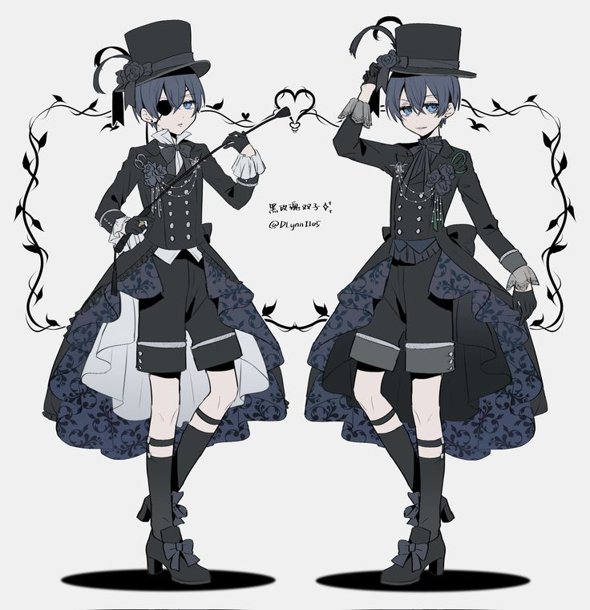

> 해당 이미지는 게임 캐릭터의 설정화입니다. 

두 명의 캐릭터가 동일한 배경에 그려져 있습니다. 두 캐릭터는 동일한 캐릭터로 보이며, 착용하고 있는 의상과 액세서리, 헤어스타일과 안경 형태 등이 동일합니다. 

### 캐릭터 외형

*   머리카락: 은색 단발머리입니다. 
*   눈: 양쪽 눈 모두 밝은 하늘색입니다. 
*   피부: 하얀색입니다. 
*   신발: 높은 굽의 부츠를 착용하고 있습니다. 
*   모자: 검은색 탑 모자를 쓰고 있습니다. 

### 캐릭터 1

*   눈가 왼쪽에 검은 안대를 착용하고 있습니다. 
*   왼손에 지팡이를 들고 있습니다. 
*   허리춤에 손을 올리고 있습니다. 

### 캐릭터 2 

*   오른쪽 손으로 모자를 벗어던지듯이 올리고 있습니다. 
*   왼팔을 뒤로 빼고 있습니다. 

### 의상 

*   검은색과 보라색이 조합된 혼합 컬러의 바지입니다. 
*   검은색과 보라색이 조합된 혼합 컬러의 긴 소매 재킷을 입고 있습니다. 
*   재킷 안쪽으로는 흰색의 안감이 있습니다. 
*   재킷 위로 보라색 꽃 무늬가 있는 망토를 착용하고 있습니다. 
*   검은색과 흰색이 조합된 혼합 컬러의 넥타이를 착용하고 있습니다. 
*   검은색과 흰색이 조합된 혼합 컬러의 긴 소매 셔츠를 입고 있습니다. 
*   검은색과 흰색이 조합된 혼합 컬러의 긴 부츠를 착용하고 있습니다. 
*   부츠에는 리본이 묶여 있습니다. 

### 배경 

*   배경은 연한 회색입니다. 
*   캐릭터의 옆에는 검은색으로 된 덩굴이 그려져 있습니다. 
*   덩굴은 캐릭터의 모자와 손에 묶여 있습니다. 
*   캐릭터의 머리 위로 하트 모양의 꽃이 그려져 있습니다. 
*   이미지 중앙에 한복을 입은 두 캐릭터의 그림과 아이디 "@ Dywn1105"가 적혀 있습니다.

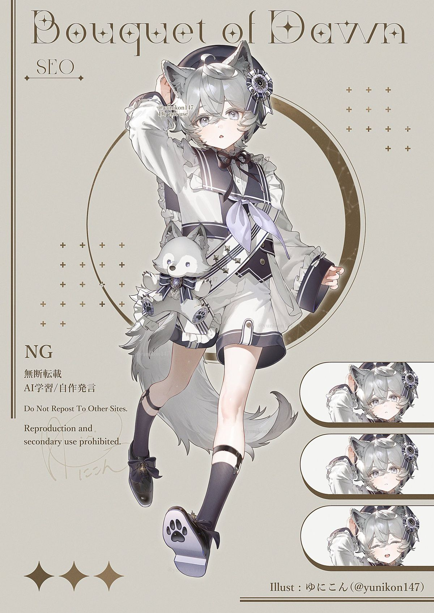

> 이미지는 "Bouquet of Dawn"라는 게임의 캐릭터 소개 페이지입니다. 페이지의 레이아웃과 구조는 다음과 같습니다.

*   **타이틀**: 페이지 상단에는 "Bouquet of Dawn"라는 타이틀과 "SEO"라는 문구가 있습니다.
*   **메인 이미지**: 중앙에는 흰색과 검은색 옷을 입은 소녀가 있습니다. 소녀는 짧은 흰색 머리를 가지고 있으며, 고양이 귀와 꼬리를 가지고 있습니다. 그녀는 작은 동물 인형을 안고 있습니다. 
*   **텍스트**: 페이지 왼쪽에는 "NG"라는 문구와 함께 "무단 전재", "AI 학습/자작 발언", "Do Not Repost To Other Sites.", "Reproduction and secondary use prohibited."라는 경고 메시지가 있습니다.
*   **캐릭터 프로필**: 페이지 하단에는 세로로 세 개의 작은 이미지들이 있습니다. 이 이미지들은 캐릭터의 다양한 표정을 보여줍니다.
*   **일러스트 정보**: 페이지 하단에는 일러스트에 대한 정보가 있습니다. 일러스트는 ゆにこん(@yunikon147)이 제작하였습니다.

전체적으로 이 페이지는 게임 캐릭터에 대한 정보를 제공하고 있습니다.

---

## 슬라이드 14

### 아군 4

#### 바지와 니삭스 사이 살 영역 좁게

#### 달라붙는 짧은 반바지, 벙벙한 겉옷

#### + 코트 테일 + 금속제 장식 많이

#### 머리카락으로 강아지 or 롭이어 토끼 귀 형태 만들기

#### 체형 참고

#### 마른 쇼타 체형

#### 손이 작다.

#### 발도 작다.

#### Sd 스탠딩 레퍼런스

> 해당 이미지에는 두 명의 캐릭터가 등장합니다. 두 캐릭터는 동일한 인물로, 앞과 뒤의 모습입니다.

*   **캐릭터의 생김새**

    *   눈색: 캐릭터의 눈색은 한쪽 눈이 적안이며, 다른 한쪽 눈이 감겨있습니다. 
    *   머리색: 검은색입니다.
    *   머리 길이: 짧은 편입니다.
*   **캐릭터의 의상**

    *   상의: 흰색입니다. 
    *   하의: 검은색입니다.
    *   신발: 검은색 부츠를 착용하고 있습니다.
    *   액세서리: 귀고리, 허리띠를 착용하고 있습니다. 
    *   망토: 파란색 망토를 착용하고 있습니다.

캐릭터의 앞면과 뒷면이 그려져 있습니다. 

*   **캐릭터의 앞면**

    *   정면을 응시하고 있습니다. 
    *   왼쪽 눈이 감겨져 있습니다. 
    *   입꼬리가 살짝 올라가 있습니다. 
    *   왼쪽 귀고리가 노출되어 있습니다. 
*   **캐릭터의 뒷면**

    *   머리가 왼쪽으로 약간 기울어져 있습니다. 
    *   뒷면에서 보이는 왼쪽 팔꿈치가 살짝 구부러져 있습니다. 
    *   뒷면에서 보이는 오른쪽 손이 허벅지 뒤쪽에 위치해 있습니다. 
    *   뒷면에서 보이는 왼쪽 손이 뒤로 뺻어져 있습니다. 

캐릭터의 전체적인 분위기는 단정한 느낌을 주고 있습니다.

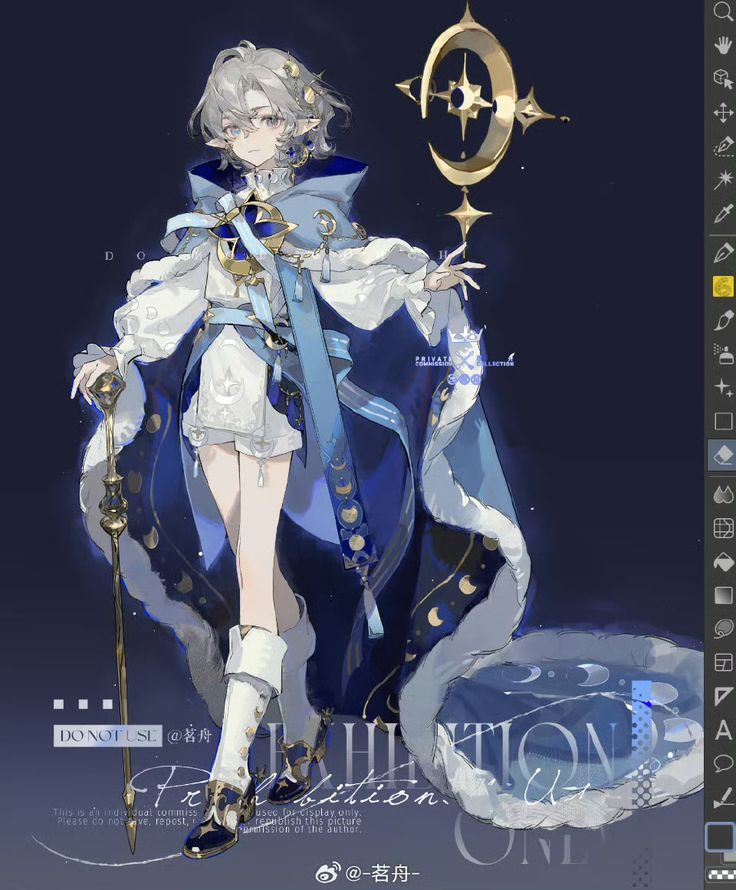

> 해당 이미지는 게임 캐릭터의 디자인 컨셉 아트입니다. 

### 캐릭터 

*   **캐릭터:** 이미지는 게임에 등장하는 캐릭터의 컨셉 아트입니다. 
*   **성별:** 여성 캐릭터로 추정됩니다. 
*   **머리 색:** 회색 단발머리입니다. 
*   **눈 색:** 보라색 눈동자입니다. 
*   **피부 색:** 하얀 피부입니다. 
*   **귀:** 애니메이션 캐릭터처럼 뾰족한 귀를 가지고 있습니다. 
*   **의상:** 흰색과 하늘색, 그리고 금색 악센트가 가미된 의상을 입고 있습니다. 
*   **액세서리:** 귀걸이와 머리핀이 보입니다. 
*   **무기:** 오른손에 홀을 들고 있습니다. 
*   **아이템:** 왼손에 달이 그려진 금색 아이템을 들고 있습니다. 
*   **문양:** 캐릭터의 옷과 홀, 아이템 등에 달과 별 모양의 금색 문양이 그려져 있습니다. 

### 배경 

*   **배경:** 짙은 남색 배경에 캐릭터가 중앙에 위치하고 있습니다. 
*   **문구:** 이미지 중앙 하단에 하얀색과 회색의 워터마크가 있습니다. 
*   **레이어 창:** 이미지 오른쪽에 포토샵의 레이어 창이 보입니다. 
*   **디자인 툴:** 레이어 창 옆에 디자인 툴이 여러 가지 보입니다. 

### 마크 및 문구 

*   **워터마크:** 이미지 중앙 하단에 하얀색과 회색의 워터마크가 있습니다. 
*   **내용:** "DO NOT USE"와 "This is an individual commission work. Please do not use, repost, or redistribute this picture without permission of the author."라는 문구가 영어와 한자로 표기되어 있습니다. 
*   **작가:** 이미지 하단에 "@若舟"라는 문구가 있습니다.

> 해당 이미지에는 한 명의 캐릭터와 여러 마리의 물고기, 그리고 수중 시설이 포함되어 있습니다.

*   캐릭터: 분홍색 머리를 가진 소녀가 중앙에 위치하고 있습니다. 이 소녀는 녹색 눈동자를 가지고 있으며, 파란색과 하얀색이 조합된 모자를 쓰고 있습니다. 또한, 파란색과 하얀색이 조합된 옷을 입고 있으며, 옷에는 하얀색과 분홍색 리본이 묶여 있습니다. 그리고 팔꿈치와 무릎 부분에 하얀색과 분홍색이 조합된 프릴이 있고, 옷 왼쪽에는 주황색과 하얀색의 구슬이 달린 목걸이를 착용하고 있습니다. 이 캐릭터는 왼팔을 뻗고 있고, 오른손은 허공에 떠 있는 상태입니다.

*   물고기: 이 캐릭터 주변에는 여러 마리의 물고기들이 헤엄치고 있습니다. 물고기들은 주황색, 노란색, 그리고 하얀색 등 다양한 색상으로 그려져 있으며, 일부는 캐릭터와 같은 방향으로 수영하고, 일부는 다른 방향으로 수영하는 모습입니다.

*   수중 시설: 배경에는 수중 시설이 있습니다. 이 시설은 파란색과 하얀색으로 디자인되어 있으며, 여러 개의 유리나 금속 재질로 된 구조물이 보입니다. 이 구조물 안에는 더 많은 물고기들이 수영하는 모습이 보입니다.

*   배경: 배경은 밝은 빛과 반짝임으로 가득 차 있습니다. 물방울과 빛나는 입자들이 떠다니는 모습이 보이며, 수중 세계의 마법 같은 분위기를 연출하고 있습니다.

*   바닥: 바닥은 보라색과 파란색으로 빛나고 있습니다. 빛나는 선과 반짝임이 바닥에 가득하며, 수중 세계의 신비로움을 강조하고 있습니다.

전체적으로 이 이미지는 환상적이고 마법 같은 수중 세계를 표현하고 있습니다.

---

## 슬라이드 15

### 아군 5

| 항목 | 내용 |
| --- | --- |
| 이름 | 하이 프리스테스 |
| 성별 | 여성 |
| 키/나이 | 170cm/67세 |
| 체형 | 가슴 크고 꼿꼿한 느낌. |
| 성격 | 신중하고 차분하다. 우아하고 고고한 느낌의 비밀스러운 여제 같은 스타일 |
| 말투 |  |
| 역할 | 신비롭고 믿음이 가는 조언자, 리더 캐릭터. 계략가 |

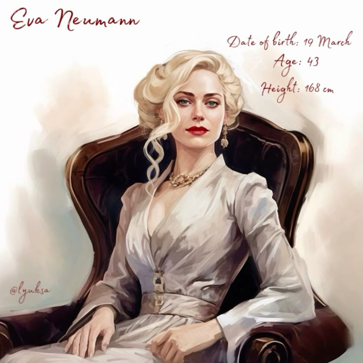

> 이미지 중앙에는 여성, 에바 노이만의 모습이 그려져 있습니다. 여성은 금발의 머리를 가지고 있으며, 회갈색의 눈과 붉은 입술이 특징입니다. 그녀는 화이트 컬러의 벨벳 재킷을 입고 있으며, 목에는 금색 목걸이를 착용하고 있습니다. 또한 귓구멍에 금으로 만든 귀걸이를 착용하고 있습니다. 여성은 짙은 갈색의 가죽 의자에 앉아 있습니다.

이미지 상단 왼쪽에는 "Eva Neumann"이라는 이름이 붉은 필기체로 적혀 있습니다. 이미지 상단 오른쪽에는 "Date of birth: 19 March", "Age: 43", "Height: 168 cm"이라는 문구가 붉은 필기체로 적혀 있습니다. 이미지 하단 왼쪽에는 "@lyuksa"라는 문구가 붉은 필기체로 적혀 있습니다. 배경은 밝은 회색과 흰색으로 구성되어 있습니다.

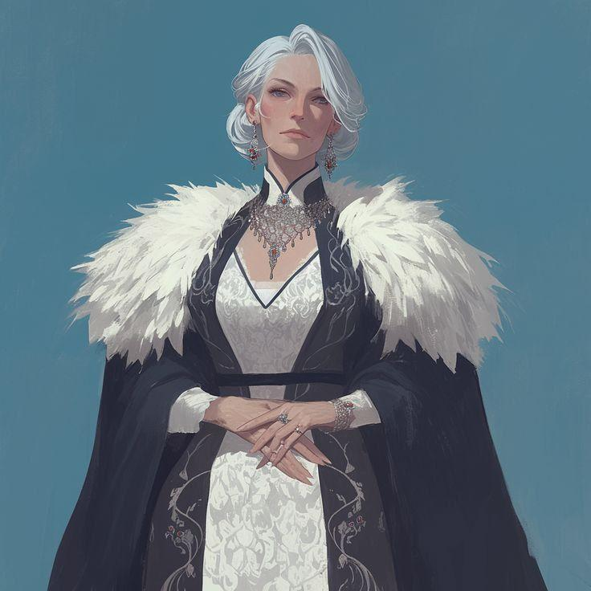

> 해당 이미지에는 게임 캐릭터 일러스트가 포함되어 있습니다.

중앙에 위치한 여성 캐릭터는 허리를 굽혀 정중한 자세를 취하고 있습니다. 

*   캐릭터의 머리는 은색이며, 짧은 헤어스타일을 가지고 있습니다. 
*   눈은 파란색이며, 입꼬리가 살짝 올라가 미소를 띤듯한 인상을 주고 있습니다. 
*   캐릭터는 흰색 드레스를 입고 있으며, 그 위에 검은색 망토를 착용하고 있습니다. 
*   망토에는 날개처럼 흰색 깃털이 달려 있어 고급스러운 느낌을 줍니다. 
*   귀고리는 보라색과 금색으로 구성되어 있으며, 목걸이는 여러 개의 은색 체인으로 구성되어 있습니다. 
*   손목에는 금색 팔찌를 착용하고 있습니다. 
*   배경은 단조로운 청색으로 구성되어 있습니다.

전체적으로 이 캐릭터는 고급스럽고 우아한 인상을 주는 캐릭터입니다.

---

## 슬라이드 16

### 아군 5

#### 시민 스타일 복식

#### 모자부터 이어진 얼굴을 가린 베일

#### 넣으면 좋겠다.

#### 레퍼런스 이미지보다는 가슴 크게

#### 곡선 강조.

#### 팔 다리 길게

#### 전체적 모양새는 긴 삼각형

#### SD 모양새도

#### 아래로 갈 수록

#### 펑퍼짐

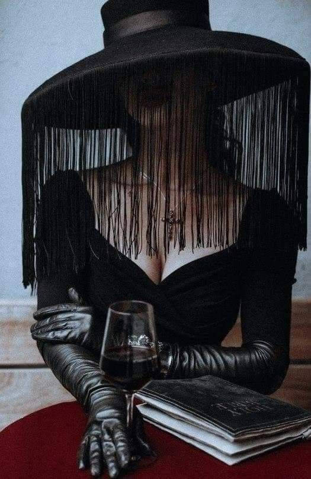

> 이미지는 검은색 드레스와 장갑, 그리고 큰 검은색 모자를 쓴 여성의 상반신 사진입니다. 여성의 얼굴은 보이지 않고, 모자의 장식으로 인해 눈만 희미하게 보입니다. 

*   여성은 검은색 테이블에 팔꿈치를 대고 앉아 있으며, 왼손에는 와인잔을 들고 있습니다. 
*   테이블 위에는 책이 쌓여 있습니다. 
*   배경은 회색 벽과 나무 패널이 보입니다. 
*   사진 속 인물이나 사물에 게임과 관련된 UI 요소나 아이콘 등은 보이지 않습니다. 
*   사진 속 텍스트는 없습니다.

> 스페인 17세기 패션

이미지 중앙 상단에 **"Spanish fashion XVII century"**라고 쓰여 있습니다. 

이미지 상단 왼쪽에는 **17세기 후반**의 여성 복식이 그려져 있습니다. 긴, 구불구불한 갈색 머리를 가진 여성은 오프숄더 스타일의 노란색 드레스를 입고 있습니다. 

그 오른쪽에는 검은 머리를 한 여성의 초상화가 있고, 하단에는 **일반 시민**의 옷차림으로 추정되는 검은색과 하얀색의 긴 옷을 입은 여성이 그려져 있습니다. 

가운데에는 **검은색과 금색의 화려한 드레스**를 입은 여성과 **남성**이 그려져 있습니다. 

오른쪽 상단에는 **부유한 남성**의 복장으로 추정되는, 검은색 망토와 넓은 챙이 있는 검은 모자를 쓴 남성이 그려져 있습니다. 

오른쪽 하단에는 **갑옷**을 입은 남성이 그려져 있습니다. 

화면 하단에는 의복에 사용된 **4가지 패턴**이 작은 직사각형으로 표시되어 있습니다. 

이미지의 배경은 **연한 복숭아색**입니다.

> 해당 이미지는 두 여성 캐릭터의 컨셉 아트로 추정됩니다. 

왼쪽 여성 캐릭터는 머리를 묶은 포니테일 헤어스타일을 하고 있습니다. 눈은 반쯤 감긴 채로 묘사되었고, 입꼬리가 살짝 올라가 미소를 띤 듯한 인상을 주고 있습니다. 여성 캐릭터는 긴 소매가 있는 드레스를 입고 있습니다. 드레스는 가슴 부분이 노출된 디자인이며, 목선은 사각형 모양입니다. 양쪽 팔꿈치까지 올라오는 긴 소매가 특징입니다. 드레스의 상의와 하의 구분이 뚜렷하며, 상의와 하의 모두 복잡한 무늬가 새겨져 있습니다. 특히 허리 부분에는 띠가 묶여 있습니다. 

오른쪽 여성 캐릭터는 긴 웨이브 헤어스타일에 왕관을 쓰고 있습니다. 왕관 뒤로 칼이 양쪽으로 하나씩 꽂혀 있는 것이 특징입니다. 왕관을 쓴 여성 캐릭터는 긴팔을 가진 드레스를 입고 있습니다. 드레스 위로는 케이프가 어깨에 걸쳐져 있습니다. 케이프에는 하트 모양의 무늬가 곳곳에 그려져 있습니다. 케이프의 앞부분에는 묶여 있는 밧줄 모양의 장식이 허리 부분에 있습니다. 

두 캐릭터 모두 얼굴을 제외한 전신이 그려져 있으며, 그림 하단 왼쪽에는 Eileen Rudisill Miller라는 이름이 쓰여 있습니다.

> 해당 이미지는 게임에 등장하는 캐릭터의 모습입니다. 

이미지 중앙을 기준으로 위, 아래로 세로 4줄로 나뉘어져 있습니다. 

각각의 캐릭터는 이름이 있으며, 다음과 같습니다.

1열(위에서부터): 
* ADVENTURER(모험가)
* BARBARIAN(야만인)
* KNIGHT(기사)
* SWORD MASTER(검객)

2열(위에서부터): 
* WIZARD(마법사)
* PRIEST(사제)
* DRUID(드루이드)

3열(위에서부터): 
* ROGUE(도적)
* ARCHER(궁수)
* MONK(승려)

각각의 캐릭터들은 각 직업에 맞는 무기와 방어구를 착용하고 있습니다. 

* ADVENTURER(모험가): 한손검과 방패를 들고 있습니다.
* BARBARIAN(야만인): 한손검과 투구를 들고 있습니다.
* KNIGHT(기사): 한손검과 방패를 들고 있습니다.
* SWORD MASTER(검객): 한손검을 들고 있습니다.
* WIZARD(마법사): 지팡이를 들고 있습니다.
* PRIEST(사제): 지팡이를 들고 있습니다.
* DRUID(드루이드): 동물 가면을 쓰고 있습니다.
* ROGUE(도적): 단검을 들고 있습니다.
* ARCHER(궁수): 활을 들고 있습니다.
* MONK(승려): 맨손입니다.

모든 캐릭터는 만화풍의 일러스트로 그려져 있으며, 각 직업에 맞는 특징을 가지고 있습니다.

---

## 슬라이드 17

### 중간보스 1

| 항목 | 내용 |
| --- | --- |
| 이름 | 채리엇 |
| 성별 | 남성 |
| 키/나이 | 190cm/30세 |
| 체형 | 역삼각형의 다부진 근육 몸매 굳은 살 많은 굵은 손가락 |
| 성격 | 하고 싶은 대로 하는 성격.  화가 많고 원하는 대로 안되면 부숴버린다. |
| 말투 |  |
| 역할 | 힘만 좋은 교단의 개 칭찬 좋아하고 무자비한 악당 |

> 이미지는 게임 캐릭터가 등장하는 일러스트입니다. 

### 이미지 속 캐릭터

*   이미지 중앙에는 거대한 덩치를 가진 남성이 있습니다. 
*   남성의 머리는 흰색이며, 눈은 보라색입니다. 눈에는 핑크빛이 감돌고 있습니다. 
*   남성의 입꼬리는 올라가 있고, 송곳니가 날카롭게 표현되어 있어 공격적인 인상을 줍니다. 
*   남성은 보라색과 금색 장식이 달린 무늬가 있는 옷을 입고 있습니다. 
*   옷에는 흰색 털이 달려있어 고급스러운 느낌을 줍니다. 
*   남성의 오른팔에는 보라색과 금색으로 장식된 갑옷을 착용하고 있습니다. 
*   갑옷 위에는 보라색과 푸른색의 보석이 박혀 있습니다. 
*   또한, 남성의 왼팔에는 커다란 장갑을 착용하고 있습니다. 
*   장갑에는 날카로운 파란색 손톱이 달려있습니다. 
*   남성의 뒤에는 여러 명의 캐릭터가 보입니다. 
*   캐릭터들은 푸른색으로 빛나고 있어 요란한 인상을 줍니다. 
*   배경에는 커튼과 벽지가 그려진 벽이 보입니다. 
*   벽에는 그림 액자가 벽에 걸려있습니다. 
*   액자 안에는 두 명의 남성이 그려져 있습니다. 
*   방 안에는 점이 켜진 촛불이 여러 개 보입니다. 
*   또한, 방 안에는 창문도 보입니다. 
*   창문 밖으로 눈꽃이 날리고 있어, 이미지가 겨울이라는 계절감을 강조합니다. 
*   이미지는 전반적으로 짙은 푸른색을 띕니다. 
*   캐릭터의 날카로운 이빨과 요란한 장식, 그리고 요란한 배경은 이 캐릭터가 게임 속에서 어떤 역할을 하는지 궁금증을 자아냅니다. 
*   이 캐릭터는 게임 속에서 강력한 캐릭터로 추정됩니다. 
*   이 캐릭터는 게임 속에서 적을 공격하는 역할 혹은 강력한 캐릭터로 추정됩니다. 
*   이 캐릭터는 게임 속에서 다양한 기술을 가지고 있을 것으로 추정됩니다. 
*   이 캐릭터는 게임 속에서 플레이어를 도와주는 동료로 추정됩니다. 
*   이 캐릭터는 게임 속에서 플레이어를 방해하는 적으로 추정됩니다. 
*   이 캐릭터는 게임 속에서 플레이어와 대결하는 상대로 추정됩니다. 
*   이 캐릭터는 게임 속에서 플레이어와 협력하는 동료로 추정됩니다. 
*   이 캐릭터는 게임 속에서 플레이어를 도와주는 조력자로 추정됩니다. 
*   이 캐릭터는 게임 속에서 플레이어를 방해하는 장애물로 추정됩니다. 
*   이 캐릭터는 게임 속에서 플레이어와 협력하여 강력한 적을 물리치는 역할을 할 것으로 추정됩니다. 
*   이 캐릭터는 게임 속에서 플레이어와 협력하여 강력한 적을 물리치는 역할을 할 것으로 추정됩니다. 
*   이 캐릭터는 게임 속에서 플레이어와 협력하여 강력한 적을 물리치는 역할을 할 것으로 추정됩니다. 
*   이 캐릭터는 게임 속에서 플레이어와 협력하여 강력한 적을 물리치는 역할을 할 것으로 추정됩니다. 
*   이 캐릭터는 게임 속에서 플레이어와 협력하여 강력한 적을 물리치는 역할을 할 것으로 추정됩니다. 
*   이 캐릭터는 게임 속에서 플레이어와 협력하여 강력한 적을 물리치는 역할을 할 것으로 추정됩니다. 
*   이 캐릭터는 게임 속에서 플레이어와 협력하여 강력한 적을 물리치는 역할을 할 것으로 추정됩니다. 
*   이 캐릭터는 게임 속에서 플레이어와 협력하여 강력한 적을 물리치는 역할을 할 것으로 추정됩니다. 
*   이 캐릭터는 게임 속에서 플레이어와 협력하여 강력한 적을 물리치는 역할을 할 것으로 추정됩니다. 
*   이 캐릭터는 게임 속에서 플레이어와 협력하여 강력한 적을 물리치는 역할을 할 것으로 추정됩니다. 
*   이 캐릭터는 게임 속에서 플레이어와 협력하여 강력한 적을 물리치는 역할을 할 것으로 추정됩니다. 
*   이 캐릭터는 게임 속에서 플레이어와 협력하여 강력한 적을 물리치는 역할을 할 것으로 추정됩니다. 
*   이 캐릭터는 게임 속에서 플레이어와 협력하여 강력한 적을 물리치는 역할을 할 것으로 추정됩니다. 
*   이 캐릭터는 게임 속에서 플레이어와 협력하여 강력한 적을 물리치는 역할을 할 것으로 추정됩니다. 
*   이 캐릭터는 게임 속에서 플레이어와 협력하여 강력한 적을 물리치는 역할을 할 것으로 추정됩니다. 
*   이 캐릭터는 게임 속에서 플레이어와 협력하여 강력한 적을 물리치는 역할을 할 것으로 추정됩니다. 
*   이 캐릭터는 게임 속에서 플레이어와 협력하여 강력한 적을 물리치는 역할을 할 것으로 추정됩니다. 
*   이 캐릭터는 게임 속에서 플레이어와 협력하여 강력한 적을 물리치는 역할을 할 것으로 추정됩니다. 
*   이 캐릭터는 게임 속에서 플레이어와 협력하여 강력한 적을 물리치는 역할을 할 것으로 추정됩니다. 
*   이 캐릭터는 게임 속에서 플레이어와 협력하여 강력한 적을 물리치는 역할을 할 것으로 추정됩니다. 
*   이 캐릭터는 게임 속에서 플레이어와 협력하여 강력한 적을 물리치는 역할을 할 것으로 추정됩니다. 
*   이 캐릭터는 게임 속에서 플레이어와 협력하여 강력한 적을 물리치는 역할을 할 것으로 추정됩니다. 
*   이 캐릭터는 게임 속에서 플레이어와 협력하여 강력한 적을 물리치는 역할을 할 것으로 추정됩니다. 
*   이 캐릭터는 게임 속에서 플레이어와 협력하여 강력한 적을 물리치는 역할을 할 것으로 추정됩니다. 
*   이 캐릭터는 게임 속에서 플레이어와 협력하여 강력한 적을 물리치는 역할을 할 것으로 추정됩니다. 
*   이 캐릭터는 게임 속에서 플레이어와 협력하여 강력한 적을 물리치는 역할을 할 것으로 추정됩니다. 
*   이 캐릭터는 게임 속에서 플레이어와 협력하여 강력한 적을 물리치는 역할을 할 것으로 추정됩니다. 
*   이 캐릭터는 게임 속에서 플레이어와 협력하여 강력한 적을 물리치는 역할을 할 것으로 추정됩니다. 
*   이 캐릭터는 게임 속에서 플레이어와 협력하여 강력한 적을 물리치는 역할을 할 것으로 추정됩니다. 
*   이 캐릭터는 게임 속에서 플레이어와 협력하여 강력한 적을 물리치는 역할을 할 것으로 추정됩니다. 
*   이 캐릭터는 게임 속에서 플레이어와 협력하여 강력한 적을 물리치는 역할을 할 것으로 추정됩니다. 
*   이 캐릭터는 게임 속에서 플레이어와 협력하여 강력한 적을 물리치는 역할을 할 것으로 추정됩니다. 
*   이 캐릭터는 게임 속에서 플레이어와 협력하여 강력한 적을 물리치는 역할을 할 것으로 추정됩니다. 
*   이 캐릭터는 게임 속에서 플레이어와 협력하여 강력한 적을 물리치는 역할을 할 것으로 추정됩니다. 
*   이 캐릭터는 게임 속에서 플레이어와 협력하여 강력한 적을 물리치는 역할을 할 것으로 추정됩니다. 
*   이 캐릭터는 게임 속에서 플레이어와 협력하여 강력한 적을 물리치는 역할을 할 것으로 추정됩니다. 
*   이 캐릭터는 게임 속에서 플레이어와 협력하여 강력한 적을 물리치는 역할을 할 것으로 추정됩니다. 
*   이 캐릭터는 게임 속에서 플레이어와 협력하여 강력한 적을 물리치는 역할을 할 것으로 추정됩니다. 
*   이 캐릭터는 게임 속에서 플레이어와 협력하여 강력한 적을 물리치는 역할을 할 것으로 추정됩니다. 
*   이 캐릭터는 게임 속에서 플레이어와 협력하여 강력한 적을 물리치는 역할을 할 것으로 추정됩니다. 
*   이 캐릭터는 게임 속에서 플레이어와 협력하여 강력한 적을 물리치는 역할을 할 것으로 추정됩니다. 
*   이 캐릭터는 게임 속에서 플레이어와 협력하여 강력한 적을 물리치는 역할을 할 것으로 추정됩니다. 
*   이 캐릭터는 게임 속에서 플레이어와 협력하여 강력한 적을 물리치는 역할을 할 것으로 추정됩니다. 
*   이 캐릭터는 게임 속에서 플레이어와 협력하여 강력한 적을 물리치는 역할을 할 것으로 추정됩니다. 
*   이 캐릭터는 게임 속에서 플레이어와 협력하여 강력한 적을 물리치는 역할을 할 것으로 추정됩니다. 
*   이 캐릭터는 게임 속에서 플레이어와 협력하여 강력한 적을 물리치는 역할을 할 것으로 추정됩니다. 
*   이 캐릭터는 게임 속에서 플레이어와 협력하여 강력한 적을 물리치는 역할을 할 것으로 추정됩니다. 
*   이 캐릭터는 게임 속에서 플레이어와 협력하여 강력한 적을 물리치는 역할을 할 것으로 추정됩니다. 
*   이 캐릭터는 게임 속에서 플레이어와 협력하여 강력한 적을 물리치는 역할을 할 것으로 추정됩니다. 
*   이 캐릭터는 게임 속에서 플레이어와 협력하여 강력한 적을 물리치는 역할을 할 것으로 추정됩니다. 
*   이 캐릭터는 게임 속에서 플레이어와 협력하여 강력한 적을 물리치는 역할을 할 것으로 추정됩니다. 
*   이 캐릭터는 게임 속에서 플레이어와 협력하여 강력한 적을 물리치는 역할을 할 것으로 추정됩니다. 
*   이 캐릭터는 게임 속에서 플레이어와 협력하여 강력한 적을 물리치는 역할을 할 것으로 추정됩니다. 
*   이 캐릭터는 게임 속에서 플레이어와 협력하여 강력한 적을 물리치는 역할을 할 것으로 추정됩니다. 
*   이 캐릭터는 게임 속에서 플레이어와 협력하여 강력한 적을 물리치는 역할을 할 것으로 추정됩니다. 
*   이 캐릭터는 게임 속에서 플레이어와 협력하여 강력한 적을 물리치는 역할을 할 것으로 추정됩니다. 
*   이 캐릭터는 게임 속에서 플레이어와 협력하여 강력한 적을 물리치는 역할을 할 것으로 추정됩니다. 
*   이 캐릭터는 게임 속에서 플레이어와 협력하여 강력한 적을 물리치는 역할을 할 것으로 추정됩니다. 
*   이

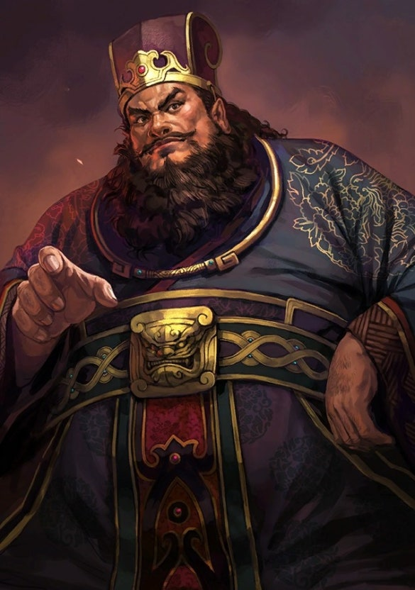

> 이미지는 왕관을 쓴 남성의 상반신 일러스트입니다.

*   **배경**: 배경은 보라색과 주황색으로 구성되어 있습니다. 구름이 잔뜩 낀 듯한 모습이며, 조명이 강한 빛이 아닌 부드러운 느낌을 주고 있습니다.
*   **캐릭터**: 이미지에 등장하는 인물은 수염과 머리카락이 긴 남성입니다. 왕관을 쓰고 있으며, 짙은 보라색과 금색이 조합된 화려한 옷차림을 하고 있습니다. 남성의 오른쪽 손가락은 뾰족하게 세워진 채로 앞으로 나와 있습니다. 왼팔은 옷소매에 팔꿈치 부분이 묶여 있는 듯한 모습이며, 손은 허리춤에 위치해 있습니다. 남성의 표정은 약간 찡그린 듯한 모습입니다.

*   **의상**: 남성이 입고 있는 보라색 옷에는 금색 패턴이 그려져 있습니다. 허리에는 녹색과 금색 띠를 두르고 있으며, 띠 중앙에는 용의 얼굴이 그려져 있습니다. 띠 아래에는 붉은색과 금색 띠가 여러 겹 걸쳐져 있습니다. 남성의 왼쪽 어깨에는 붉은색과 금색으로 장식된 망토 같은 옷이 어깨에 걸쳐져 있습니다.

*   **왕관**: 왕관은 보라색과 금색으로 구성되어 있습니다. 왕관의 중심에는 붉은 보석이 박혀 있습니다.

*   **전체적인 분위기**: 이 일러스트는 게임 캐릭터의 일러스트로 추정됩니다. 일러스트의 분위기는 웅장하고 화려한 느낌을 주고 있습니다.

---

## 슬라이드 18

### 중간보스 1 레퍼런스

#### 복식

#### 하층민식 전투복

#### (더럽고 찢어져야 할 듯)

#### 몸 자체가 크고 단단함

#### 피부 톤이 까무잡잡한 느낌

#### 너무 쾌남이 되지 않게 주의

#### 지성 빼주세요

#### SD 상태 스탠딩에서는

#### 더 과한 상체 근육 뚱뚱 데포르메로 디자인

#### SD 데포르메 예시

#### 주먹으로 싸우기

#### 너클 추가해도 좋을 듯

#### LD 데포르메 예시

> 해당 이미지는 게임 캐릭터의 의상 렌더링 이미지입니다.

*   **마네킹**

    *   이미지 중앙에는 게임 캐릭터의 의상이 마네킹에 입혀져 있습니다.
    *   마네킹은 머리 부분이 없으며, 마네킹 몸통에는 "ROYAL FORK"이라는 문구가 쓰여져 있습니다. 
    *   마네킹의 하단에는 바퀴가 달린 받침대가 있습니다.

*   **의상**

    *   상의

        *   흰색의 긴팔 옷이 마네킹에 걸쳐져 있습니다. 소매 부분은 여러 번 주름이 지도록 디자인되어 있습니다. 
        *   회갈색의 조끼가 흰색 옷 위쪽에 걸쳐져 있습니다. 조끼 앞면에는 꽃 무늬 패턴이 그려져 있습니다. 
        *   조끼 위쪽에는 가죽 재질의 끈이 어깨에 걸쳐져 있습니다. 
        *   조끼 앞면에는 허리 부분에 두꺼운 허리띠가 묶여져 있습니다. 허리띠 왼쪽에는 비슷한 색깔의 가죽 재질로 만든 검이 꽂혀 있습니다. 
    *   하의

        *   검은색의 바지가 무릎까지 내려오는 긴 장화로 대체되어 있습니다. 
        *   바지 왼쪽 허벅지에는 단추 4개가 나란히 달려있습니다. 
    *   신발

        *   장화와 동일한 검은색의 긴 부츠가 발에 착용되어 있습니다. 
    *   액세서리

        *   목에는 노란색과 빨간색으로 된 펜던트가 달린 목걸이가 착용되어 있습니다.

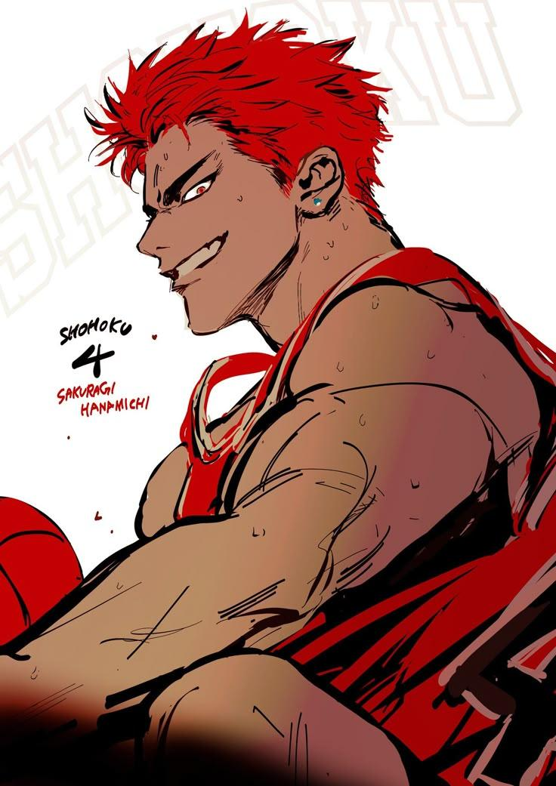

> 사쿠라기 하나미치(桜木 花道, Sakuragi Hanamichi) 

*   **캐릭터 이름:** 사쿠라기 하나미치
*   **별명:** 쇼호쿠의 붉은 악마
*   **등장:** 원작 만화 1권 1화, 애니메이션 1화
*   **성우:** 타카하시 히로키(일본), 이경태(한국)
*   **나이:** 중 3
*   **신장:** 188cm
*   **체중:** 83kg
*   **주요 기술:** 덩크슛, 블록슛

붉은 머리의 남자, 사쿠라기 하나미치는 슬램덩크의 주인공입니다. 그는 키가 크고 덩치가 있지만, 농구 경험이 없어 서툽니다. 하지만, 그의 잠재력과 노력으로 최고의 선수가 됩니다.

사쿠라기 하나미치는 쇼호쿠 고등학교에 입학한 후, 농구부에 가입합니다. 그는 처음에는 농구에 서툴렀지만, 코치인 아카기 타카시와 팀원들의 지원으로 성장합니다.

사쿠라기 하나미치는 강력한 피지컬과 공격적인 플레이 스타일로 유명합니다. 그는 덩크슛과 블록슛에 능하며, 공격과 수비에서 모두 활약합니다.

사쿠라기 하나미치는 또한, 그의 성격으로도 유명합니다. 그는 열혈적이고, 공격적이며, 때때로 충동적인 행동을 합니다. 하지만, 그는 또한, 팀을 위해 희생하고, 팀원들을 위해 최선을 다하는 선수입니다.

사쿠라기 하나미치는 슬램덩크에서 가장 인기 있는 캐릭터 중 하나입니다. 그는 그의 매력적인 성격과 인상적인 농구 실력으로 많은 팬들을 사로잡았습니다.

사쿠라기 하나미치는 슬램덩크의 성공에 큰 기여를 한 캐릭터입니다. 그는 농구의 매력을 널리 알렸고, 많은 사람들에게 농구를 즐기는 계기를 제공했습니다.

사쿠라기 하나미치는 일본 만화와 애니메이션에서 가장 상징적인 캐릭터 중 하나입니다. 그는 그의 열정, 노력, 그리고 헌신으로 많은 사람들에게 영감을 주었습니다.

이미지 중앙에 붉은 머리의 남자, 사쿠라기 하나미치가 있습니다. 그는 붉은색 농구 유니폼을 입고 있습니다. 그의 옆에는 농구공이 있습니다. 이미지 왼쪽에는 그의 이름과 별명이 적혀 있습니다. 배경은 하얗고, 그의 이름과 팀 로고가 희미하게 새겨져 있습니다.

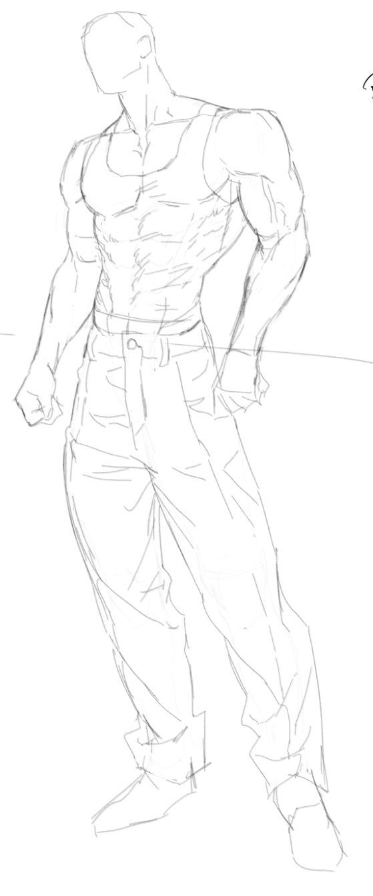

> 이 그림은 게임 캐릭터의 콘셉트 아트 또는 초기 스케치로 보입니다. 

*   인물: 근육질의 남성이 그려져 있습니다. 
*   자세: 남자는 왼쪽을 향해 서 있습니다. 왼팔을 굽힌 채로 손을 엉덩이 위에 올리고, 오른팔을 옆으로 뻗은 채로 손을 허벅지 위에 위치시키고 있습니다. 
*   얼굴: 얼굴은 그려져 있지 않습니다. 
*   근육: 근육의 형태가 선으로 표현되어 있습니다. 
*   옷: 짧은 반바지처럼 생긴 바지를 입고 있습니다. 바지의 허리춤은 낮고, 바지 길이는 무릎까지 올라옵니다. 
*   배경: 배경은 흰색이며, 추가적인 디테일이나 배경 요소는 없습니다. 
*   전반적인 스타일: 그림은 연필 스케치처럼 보이며, 디테일보다는 형태와 비율을 중점으로 그려진 듯합니다. 

이 스케치는 게임 캐릭터의 초기 디자인 과정 중 하나일 가능성이 있습니다.

> 이미지는 게임의 전투 장면을 보여 주고 있습니다. 게임 화면은 상단과 하단으로 나뉩니다.

상단 절반은 게임 세계의 풍경을 보여 주는 필드이며, 하단 절반은 다양한 색상의 보석이 있는 인터페이스를 표시합니다.

상단 절반을 자세히 살펴보면:

* 화면 왼쪽 상단에는 시계 모양의 아이콘이 있고 그 옆에 '6'이라는 숫자가 있습니다. 그 옆에는 'WAVE: 2/3'이라는 텍스트가 있습니다.
* 화면 왼쪽에는 빨간 머리의 여성이 있고 그 옆에 주황색 머리의 여성이 있습니다. 
* 빨간 머리의 여성과 주황색 머리의 여성의 머리 위에는 각각 흰색의 새와 작은 사람의 모습이 보입니다. 
* 주황색 머리의 여성 오른쪽에는 호랑이 같은 괴물이 있고 그 뒤에 작은 사람의 모습이 보입니다. 
* 필드 오른쪽에는 나무가 있고 그 뒤에 작은 괴물들이 보입니다. 나무에는 보라색 불이 있고 그 옆에 '99'이라는 숫자가 있습니다.

하단 절반을 자세히 살펴보면:

* 화면 하단 절반의 왼쪽에는 원형의 회전하는 듯한 아이콘이 있습니다. 
* 그 옆에는 여러 색상의 보석이 일렬로 나열되어 있습니다. 보석의 색깔은 하얀색, 파란색, 보라색, 노란색, 주황색 등 다양합니다. 
* 화면 하단 절반의 오른쪽에는 또 다른 원형의 회전하는 듯한 아이콘이 있고 그 옆에 하얀색의 네모로 된 아이콘이 있습니다.

---

## 슬라이드 19

### 중간보스 2

| 항목 | 내용 |
| --- | --- |
| 이름 | 허밋 |
| 성별 | 여성 |
| 키/나이 | 175cm/72세 |
| 체형 | 마른 근육, 길쭉한 느낌 |
| 성격 | 말이 많지 않음, 신중하고 침착. |
| 말투 |  |
| 역할 | 충성 계열 지능 캐릭터, 아군 NPC의 반대 되는 쪽. |

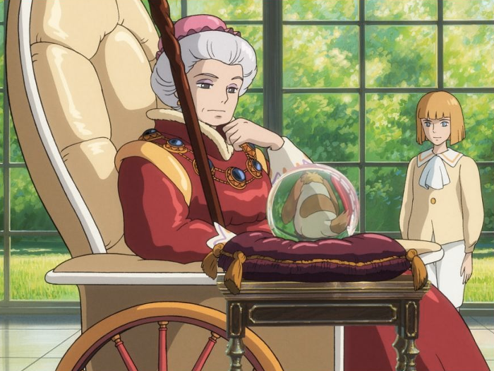

> 해당 이미지는 애니메이션 스타일의 일러스트입니다. 

전경에는 커다란 베개가 있는 휠체어에 노인이 앉아 있습니다. 노인은 흰 머리를 짧게 자르고 왼쪽 귀 위로 머리를 고정하는 핑크색 머리장식을 하고 있습니다. 오른쪽 귀는 노출되어 있습니다. 눈은 약간 내려가 있고, 왼팔을 굽힌 채 턱을 괴고 있습니다. 노인은 붉은색과 노란색이 조합된 화려한 옷을 입고 있으며, 가슴에는 여러 개의 보석이 달린 장식품을 착용하고 있습니다. 

휠체어 오른편에는 보라색 천이 깔린 작은 테이블이 있습니다. 테이블 위에는 투명한 반구형 돔 안에 작은 강아지가 들어 있습니다. 강아지는 앞을 보고 있습니다. 

휠체어 뒤로는 커다란 창문과 바깥 풍경이 보입니다. 창문 밖으로는 나무와 잔디가 보입니다. 

노인의 오른쪽 뒤로는 짧은 머리의 소녀가 서 있습니다. 소녀는 연한 노란색 재킷과 하얀색 바 collar가 달린 흰색 블라우스를 입고 있습니다. 소녀의 눈은 약간 왼쪽을 보고 있습니다. 

이미지 전반적으로 밝은 분위기가 감돌고 있습니다.

---

## 슬라이드 20

### 중간보스 2 레퍼런스

#### 팔 다리가 길쭉하고 얇은 느낌

#### 살짝 창백한 피부, 주름 많이.

#### 장교 같은 느낌.

#### 비밀스러운 느낌으로

#### 후드를 씌워도 좋을 듯

#### 푸근한 할머니처럼

#### 나왔다가 후드 벗으면서

#### 섹시 할머니가 되는거 좋네요

#### SD는 지팡이 짚은 포즈

#### 얇고 길쭉한 형태감

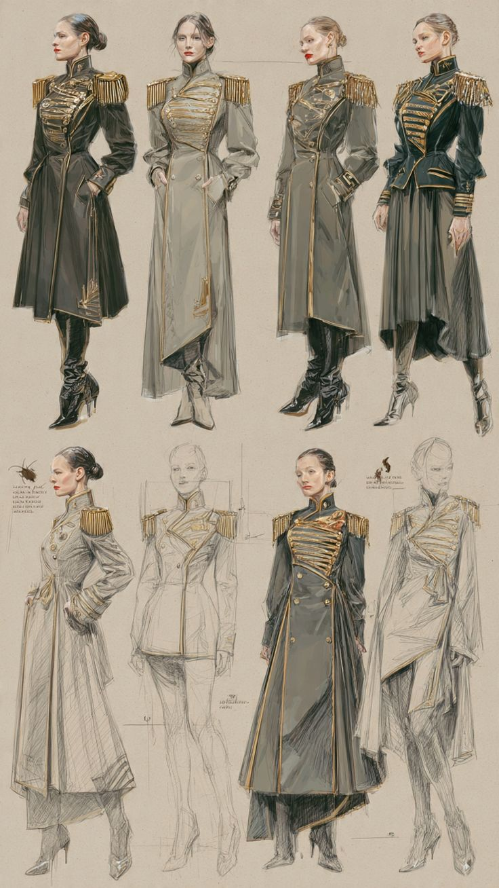

> 이미지는 게임 캐릭터의 의상 디자인에 대한 컨셉 아트입니다. 이미지에는 여러 벌의 군복을 입은 여성 캐릭터의 그림이 포함되어 있습니다. 

이미지의 레이아웃은 두 행으로 구성되어 있습니다. 상단 행에는 네 명의 캐릭터가 있고, 하단 행에는 다섯 명의 캐릭터가 그려져 있습니다. 상단 행의 네 명의 캐릭터는 완성된 버전의 그림이며, 하단 행의 다섯 명의 캐릭터는 스케치 버전입니다.

상단 행의 캐릭터부터 순서대로 설명하겠습니다.

*   첫 번째 캐릭터(왼쪽)는 검은색과 금색의 군복을 입고 있습니다. 그녀의 머리는 뒤로 묶여 있고, 입술은 빨갛게 칠해져 있습니다. 그녀는 검은색 부츠를 착용하고 있습니다.
*   두 번째 캐릭터는 회색과 금색의 군복을 입고 있습니다. 그녀의 머리는 뒤로 묶여 있고, 입술은 빨갛게 칠해져 있습니다. 그녀는 회색 부츠를 착용하고 있습니다.
*   세 번째 캐릭터는 회색과 금색의 군복을 입고 있습니다. 그녀의 머리는 뒤로 묶여 있고, 입술은 빨갛게 칠해져 있습니다. 그녀는 검은색 부츠를 착용하고 있습니다.
*   네 번째 캐릭터는 검은색과 금색의 군복을 입고 있습니다. 그녀의 머리는 뒤로 묶여 있고, 입술은 빨갛게 칠해져 있습니다. 그녀는 회색 부츠를 착용하고 있습니다.

하단 행의 캐릭터를 순서대로 설명하겠습니다.

*   첫 번째 캐릭터(왼쪽)는 회색과 금색의 군복을 입고 있습니다. 그녀의 머리는 뒤로 묶여 있고, 입술은 빨갛게 칠해져 있습니다. 그녀는 스케치 버전으로 그려져 있습니다. 
*   두 번째 캐릭터는 회색과 금색의 군복을 입고 있습니다. 그녀는 스케치 버전으로 그려져 있습니다.
*   세 번째 캐릭터는 회색과 금색의 군복을 입고 있습니다. 그녀의 머리는 뒤로 묶여 있고, 입술은 빨갛게 칠해져 있습니다. 
*   네 번째 캐릭터는 하얀색과 금색의 군복을 입고 있습니다. 그녀는 스케치 버전으로 그려져 있습니다.
*   다섯 번째 캐릭터는 하얀색과 금색의 군복을 입고 있습니다. 그녀는 스케치 버전으로 그려져 있습니다.

모든 캐릭터는 유사한 포즈를 취하고 있으며, 각자의 개성을 나타내는 독특한 의상과 액세서리를 가지고 있습니다. 배경은 베이지색이며, 각 캐릭터의 의상과 액세서리에 대한 세부 사항이 포함된 노트가 곳곳에 있습니다.

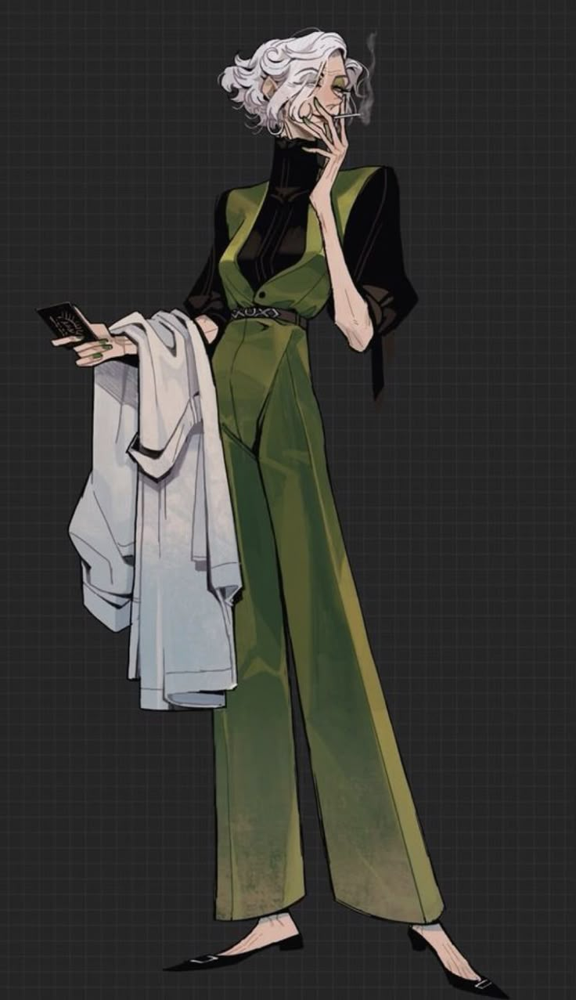

> 이미지는 한 여성 캐릭터의 일러스트입니다. 

*   여성 캐릭터는 머리가 허벅지까지 오는 녹색 바지, 검은색과 녹색이 조합된 상의를 입고 있습니다. 
*   여성 캐릭터의 왼쪽에는 회색 옷이 걸쳐져 있습니다. 
*   여성 캐릭터는 오른손에 타로 카드를 들고 있습니다. 
*   여성 캐릭터는 왼손에 담배를 물고 있습니다. 
*   여성 캐릭터는 검은색 하이힐을 신고 있습니다. 
*   여성 캐릭터의 배경은 검은색이며, 검은색 바탕에 회색 격자 무늬가 있습니다. 
*   여성 캐릭터의 신장은 격자 무늬 32칸입니다. 
*   여성 캐릭터의 체형은 날씬한 편입니다. 
*   여성 캐릭터의 머리는 허벅지까지 오는 은발입니다. 
*   여성 캐릭터의 눈은 녹색입니다. 
*   여성 캐릭터의 손톱과 발톱은 녹색입니다. 
*   여성 캐릭터의 의상에는 허리 부분에 벨트가 있습니다. 
*   여성 캐릭터의 바지 허리춤은 매우 낮습니다. 
*   여성 캐릭터의 바지는 매우 헐렁합니다. 
*   여성 캐릭터의 신발은 하이힐입니다. 
*   여성 캐릭터의 신발은 뾰족한 모양입니다. 
*   여성 캐릭터의 신발은 발등 부분이 노출되어 있습니다. 
*   여성 캐릭터의 신발은 발가락 부분이 둥근 모양입니다. 
*   여성 캐릭터의 신발은 발뒤꿈치가 노출되어 있습니다. 
*   여성 캐릭터의 신발은 녹색과 유사한 색상의 가터벨트를 착용하고 있습니다. 
*   여성 캐릭터의 상의는 검은색입니다. 
*   여성 캐릭터의 상의는 왼쪽 어깨가 노출되어 있습니다. 
*   여성 캐릭터의 상의는 짧은 소매입니다. 
*   여성 캐릭터의 상의는 가슴 부분이 노출되어 있습니다. 
*   여성 캐릭터의 상의는 배 부분이 노출되어 있습니다. 
*   여성 캐릭터의 상의는 배꼽이 노출되어 있습니다. 
*   여성 캐릭터의 상의는 허리 부분이 노출되어 있습니다. 
*   여성 캐릭터의 상의는 옆 트임으로 가슴과 배 부분이 노출되어 있습니다. 
*   여성 캐릭터의 상의는 옆 트임으로 허리 부분이 노출되어 있습니다. 
*   여성 캐릭터의 상의는 옆 트임으로 옆구리 부분이 노출되어 있습니다. 
*   여성 캐릭터의 상의는 옆 트임이 깊게 트여 있습니다. 
*   여성 캐릭터의 상의는 옆 트임이 옆구리까지 트여 있습니다. 
*   여성 캐릭터의 상의는 옆 트임이 허리까지 트여 있습니다. 
*   여성 캐릭터의 상의는 옆 트임이 가슴까지 트여 있습니다. 
*   여성 캐릭터의 상의는 가슴 부분이 트여 있습니다. 
*   여성 캐릭터의 상의는 배 부분이 트여 있습니다. 
*   여성 캐릭터의 상의는 허리 부분이 트여 있습니다. 
*   여성 캐릭터의 상의는 옆구리 부분이 트여 있습니다. 
*   여성 캐릭터의 상의는 옆 트임이 깊게 트여 있습니다. 
*   여성 캐릭터의 상의는 옆 트임이 옆구리까지 트여 있습니다. 
*   여성 캐릭터의 상의는 옆 트임이 허리까지 트여 있습니다. 
*   여성 캐릭터의 상의는 옆 트임이 가슴까지 트여 있습니다. 
*   여성 캐릭터의 상의는 가터벨트를 착용하고 있습니다. 
*   여성 캐릭터의 상의는 가터벨트가 허리 부분에 있습니다. 
*   여성 캐릭터의 상의는 가터벨트가 옆구리 부분에 있습니다. 
*   여성 캐릭터의 상의는 가터벨트가 가슴 부분에 있습니다. 
*   여성 캐릭터의 상의는 가터벨트가 배 부분에 있습니다. 
*   여성 캐릭터의 상의는 가터벨트가 허리 부분에 있습니다. 
*   여성 캐릭터의 상의는 가터벨트가 옆구리 부분에 있습니다. 
*   여성 캐릭터의 상의는 가터벨트가 가슴 부분에 있습니다. 
*   여성 캐릭터의 상의는 가터벨트가 배 부분에 있습니다. 
*   여성 캐릭터의 상의는 가터벨트가 허리 부분에 있습니다. 
*   여성 캐릭터의 상의는 가터벨트가 옆구리 부분에 있습니다. 
*   여성 캐릭터의 상의는 가터벨트가 가슴 부분에 있습니다. 
*   여성 캐릭터의 상의는 가터벨트가 배 부분에 있습니다. 
*   여성 캐릭터의 상의는 가터벨트가 허리 부분에 있습니다. 
*   여성 캐릭터의 상의는 가터벨트가 옆구리 부분에 있습니다. 
*   여성 캐릭터의 상의는 가터벨트가 가슴 부분에 있습니다. 
*   여성 캐릭터의 상의는 가터벨트가 배 부분에 있습니다. 
*   여성 캐릭터의 상의는 가터벨트가 허리 부분에 있습니다. 
*   여성 캐릭터의 상의는 가터벨트가 옆구리 부분에 있습니다. 
*   여성 캐릭터의 상의는 가터벨트가 가슴 부분에 있습니다. 
*   여성 캐릭터의 상의는 가터벨트가 배 부분에 있습니다. 
*   여성 캐릭터의 상의는 가터벨트가 허리 부분에 있습니다. 
*   여성 캐릭터의 상의는 가터벨트가 옆구리 부분에 있습니다. 
*   여성 캐릭터의 상의는 가터벨트가 가슴 부분에 있습니다. 
*   여성 캐릭터의 상의는 가터벨트가 배 부분에 있습니다. 
*   여성 캐릭터의 상의는 가터벨트가 허리 부분에 있습니다. 
*   여성 캐릭터의 상의는 가터벨트가 옆구리 부분에 있습니다. 
*   여성 캐릭터의 상의는 가터벨트가 가슴 부분에 있습니다. 
*   여성 캐릭터의 상의는 가터벨트가 배 부분에 있습니다. 
*   여성 캐릭터의 상의는 가터벨트가 허리 부분에 있습니다. 
*   여성 캐릭터의 상의는 가터벨트가 옆구리 부분에 있습니다. 
*   여성 캐릭터의 상의는 가터벨트가 가슴 부분에 있습니다. 
*   여성 캐릭터의 상의는 가터벨트가 배 부분에 있습니다. 
*   여성 캐릭터의 상의는 가터벨트가 허리 부분에 있습니다. 
*   여성 캐릭터의 상의는 가터벨트가 옆구리 부분에 있습니다. 
*   여성 캐릭터의 상의는 가터벨트가 가슴 부분에 있습니다. 
*   여성 캐릭터의 상의는 가터벨트가 배 부분에 있습니다. 
*   여성 캐릭터의 상의는 가터벨트가 허리 부분에 있습니다. 
*   여성 캐릭터의 상의는 가터벨트가 옆구리 부분에 있습니다. 
*   여성 캐릭터의 상의는 가터벨트가 가슴 부분에 있습니다. 
*   여성 캐릭터의 상의는 가터벨트가 배 부분에 있습니다. 
*   여성 캐릭터의 상의는 가터벨트가 허리 부분에 있습니다. 
*   여성 캐릭터의 상의는 가터벨트가 옆구리 부분에 있습니다. 
*   여성 캐릭터의 상의는 가터벨트가 가슴 부분에 있습니다. 
*   여성 캐릭터의 상의는 가터벨트가 배 부분에 있습니다. 
*   여성 캐릭터의 상의는 가터벨트가 허리 부분에 있습니다. 
*   여성 캐릭터의 상의는 가터벨트가 옆구리 부분에 있습니다. 
*   여성 캐릭터의 상의는 가터벨트가 가슴 부분에 있습니다. 
*   여성 캐릭터의 상의는 가터벨트가 배 부분에 있습니다. 
*   여성 캐릭터의 상의는 가터벨트가 허리 부분에 있습니다. 
*   여성 캐릭터의 상의는 가터벨트가 옆구리 부분에 있습니다. 
*   여성 캐릭터의 상의는 가터벨트가 가슴 부분에 있습니다. 
*   여성 캐릭터의 상의는 가터벨트가 배 부분에 있습니다. 
*   여성 캐릭터의 상의는 가터벨트가 허리 부분에 있습니다. 
*   여성 캐릭터의 상의는 가터벨트가 옆구리 부분에 있습니다. 
*   여성 캐릭터의 상의는 가터벨트가 가슴 부분에 있습니다. 
*   여성 캐릭터의 상의는 가터벨트가 배 부분에 있습니다. 
*   여성 캐릭터의 상의는 가터벨트가 허리 부분에 있습니다. 
*   여성 캐릭터의 상의는 가터벨트가 옆구리 부분에 있습니다. 
*   여성 캐릭터의 상의는 가터벨트가 가슴 부분에 있습니다. 
*   여성 캐릭터의 상의는 가터벨트가 배 부분에 있습니다. 
*   여성 캐릭터의 상의는 가터벨트가 허리 부분에 있습니다. 
*   여성 캐릭터의 상의는 가터벨트가 옆구리 부분에 있습니다. 
*   여성 캐릭터의 상의는 가터벨트가 가슴 부분에 있습니다. 
*   여성 캐릭터의 상의는 가터벨트가 배 부분에 있습니다. 
*   여성 캐릭터의 상의는 가터벨트가 허리 부분에 있습니다. 
*   여성 캐릭터의 상의는 가터벨트가 옆구리 부분에 있습니다. 
*   여성 캐릭터의 상의는 가터벨트가 가

> 이 사진은 한 노인을 묘사하고 있습니다. 노인은 흰 머리를 가지고 있으며, 짙은 녹색의 스웨터를 입고 있습니다. 그 아래에는 짙은 갈색의 꽃무늬가 있는 드레스를 입고 있습니다. 그녀는 검은색 신발을 신고 있으며, 짙은 파란색의 가방을 들고 있습니다. 오른손에 지팡이를 잡고 있습니다.

사진의 배경에는 나무 벤치가 보입니다. 벤치는 짙은 갈색이며, 벽돌 벽 앞에 위치해 있습니다. 벽 뒤로는 녹색의 나무가 보입니다.

전체적으로 이 사진은 일상의 한 장면을 포착한 것으로 보입니다. 노인의 모습과 배경의 벤치, 벽돌 벽, 그리고 나무가 자연스럽고 편안한 분위기를 조성하고 있습니다.

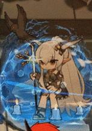

> 이미지는 게임 기획 문서의 일부로 보이는 이미지입니다. 이미지 중앙에는 하얀색 긴 머리를 가진 소녀 캐릭터가 있습니다. 캐릭터는 마법사처럼 생긴 옷을 입고 있으며, 손에는 지팡이를 들고 있습니다. 지팡이의 머리 부분에는 노란색과 흰색의 빛나는 구체가 있습니다. 

캐릭터의 뒤로는 푸른색의 둥근 무늬가 그려져 있으며, 그 안에는 작은 새가 날고 있는 모습이 그려져 있습니다. 새의 날개는 짙은 회색이며, 날개 위로는 작고 하얀 구름이 떠 있습니다. 

캐릭터의 앞쪽에는 세 개의 촛불이 있으며, 모두 푸른색입니다. 이 촛불들은 캐릭터가 서 있는 파란색 테두리 안쪽에 있습니다.

화면 왼쪽 하단에는 빨간색 삼각형 화살표가 있습니다. 이 화살표는 지팡이를 들고 있는 캐릭터의 앞으로 향하고 있습니다.

이미지 상단에는 짙은 회색의 돌출된 부분이 보입니다. 

이미지 오른쪽과 왼쪽에는 흰색 테두리가 있습니다.

---

## 슬라이드 21

### 중간보스 3

| 항목 | 내용 |
| --- | --- |
| 이름 | 저지먼트 |
| 성별 | 여성 |
| 키/나이 | 155cm/17세 |
| 체형 | 얇은 여자아이 체형 |
| 성격 | 성가신 여자아이, 질투 많고 찌질, 거만, 와가마마, 츤데레(메스가키 아님) |
| 말투 |  |
| 역할 | 저스티스의 경쟁자, 인정 욕구가 커서 주인공을 처리하려는 포지션 |

> 해당 이미지에는 한 여성 캐릭터가 그려져 있습니다. 

*   **캐릭터의 생김새**: 
    *   노란색의 짤막한 머리카락을 가지고 있습니다. 
    *   눈은 노란색이며 눈꼬리가 살짝 올라가 있습니다. 
    *   캐릭터의 얼굴은 하얗습니다. 
*   **캐릭터의 옷차림**:
    *   검은색의 민소매 가디건을 입고 있습니다. 
    *   가디건은 목 부분이 하얀색이며, 가디건의 버튼은 5개입니다. 
    *   가디건의 소매 부분은 여러 번 접혀 있습니다. 
    *   허벅지까지 오는 하얀색의 긴 양말을 착용하고 있습니다. 
    *   검은색의 단화를 신고 있습니다. 
    *   귀걸이를 착용하고 있습니다. 

캐릭터의 배경은 하얀색입니다.

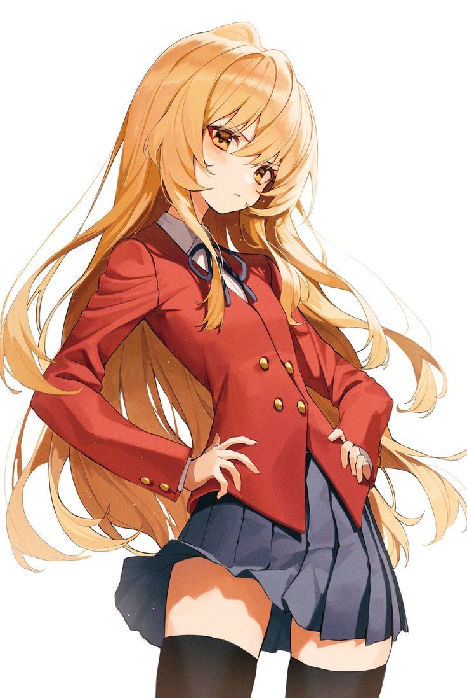

> 해당 이미지에는 애니메이션 스타일의 캐릭터 일러스트가 포함되어 있습니다.

*   캐릭터: 이미지 중앙에 있는 캐릭터는 **길고 풍성한 금발**을 가지고 있으며, **주황색 눈**을 가진 여성 캐릭터입니다. 
*   캐릭터의 **옷차림**: 빨간색 **자켓**과 **파란색**의 **타이**를 착용하고 있습니다. 
*   캐릭터의 **하의**: **짧은 치마**와 **검은색 스타킹**을 착용하고 있습니다. 
*   **배경**: 해당 캐릭터는 **하얀색 배경**에 혼자 서 있습니다. 
*   **포즈**: 캐릭터는 **왼쪽 손을 엉덩이**에 올리고 **오른쪽 손**은 **옆구리**에 둥글게 말아 넣은 채로 **왼쪽을 향해** 고개를 돌리고 있습니다. 

전체적으로 이미지 속 캐릭터는 **여학생**의 모습을 하고 있습니다.

---

## 슬라이드 22

### 중간보스 3

#### 얇은 어린 아이 체형.

#### 가슴 작게,하얀 피부

#### 동글동글한데 눈꼬리 삐죽

#### 눈썹 얇음

#### 아가씨 같은 느낌

#### 위 레퍼런스보다 움직이기 편하게

#### 양산을 가지고 있어도 좋고

#### 숄을 무기처럼 활용해도 좋음

#### Sd 레퍼런스

#### 말광량이 같은 느낌

#### 좀 더 화내는 표정이면

#### 좋을 듯..

> 해당 이미지에는 애니메이션 스타일의 캐릭터 일러스트가 포함되어 있습니다.

*   **시각적 레이아웃 및 구조:** 이미지 중앙에 애니메이션 스타일의 여성 캐릭터가 배치되어 있습니다. 이 캐릭터는 길고 검은 머리와 파란 눈을 가지고 있습니다. 그녀의 머리는 양쪽으로 갈라진 포니테일 스타일로 묶여 있으며, 앞머리는 가운데로 갈라져 있습니다. 캐릭터는 하얀색 셔츠에 보라색 넥타이, 검은색 치마, 그리고 분홍색 가디건을 입고 있습니다. 또한, 그녀는 검은색 가터벨트를 착용하고 있습니다. 이 캐릭터는 오른손을 머리카락에 올리고, 왼팔은 가디건 안쪽에 넣어 편안한 자세를 취하고 있습니다. 배경은 분홍색으로 설정되어 있습니다. 캐릭터의 시선은 정면이며, 입꼬리가 살짝 올라간 미소를 띠고 있습니다. 캐릭터의 왼쪽에는 그림자가 그려져 있습니다. 
*   **텍스트:** 이미지에는 텍스트가 포함되어 있지 않습니다.
*   **다이어그램:** 이미지에는 다이어그램이 포함되어 있지 않습니다.
*   **UI 요소:** 이미지에는 UI 요소가 포함되어 있지 않습니다.
*   **캐릭터:** 이미지에는 위에서 설명한 애니메이션 스타일의 여성 캐릭터 1명이 포함되어 있습니다.
*   **아이콘:** 이미지에는 아이콘이 포함되어 있지 않습니다.

전체적으로, 이 이미지는 게임 캐릭터의 소개나 홍보를 위한 일러스트로 사용될 수 있는 애니메이션 스타일의 캐릭터 일러스트입니다.

> 이것은 게임 기획 문서에 포함된 이미지입니다. 이미지는 한 여성의 모습을 담고 있습니다. 여성은 19세기 후반의 유럽 여성의 모습을 하고 있습니다. 여성의 신원은 불명입니다.

이미지 중앙에는 여성의 사진이 배치되어 있습니다. 여성은 바깥쪽으로 나가는 차양이 있는 모자를 쓰고 있습니다. 모자의 색깔은 베이지색이며, 모자 위에는 리본이 묶여있습니다. 

여성의 머리는 짧은 단발머리이며, 눈은 크지 않은 편입니다. 눈동자는 검은색입니다. 피부는 하얗고, 입술은 빨간색입니다. 여성은 화장을 한 것으로 보입니다.

여성은 하늘색과 금색이 조합된 드레스를 입고 있습니다. 드레스 윗부분은 하얀색 레이스로 장식되어 있고, 가슴 부분에는 하늘색 리본이 묶여 있습니다. 드레스 하단에는 금색 자수가 놓여져 있습니다. 

여성의 왼쪽에는 하얀색 기둥이 있습니다. 기둥 뒤로는 나무가 우거져 있습니다. 

이미지 오른쪽 하단에는 흰색의 'sunfacespell'이라는 문구가 있습니다. 이미지 하단에는 'http://sunfacespell.taobao.com/'이라는 문구가 있고, 오른쪽 하단에는 '@cnzkau'이라는 문구가 있습니다. 

테두리 장식으로는 사각형의 흰색 테두리가 있습니다. 테두리 안쪽에는 가는 선이 있고 바깥쪽에는 두꺼운 선이 있습니다. 테두리에는 네 개의 원이 있고, 원 안에는 화려한 무늬가 그려져 있습니다.

> 이미지는 게임 기획 문서의 일부가 아닌, 여성의 패션 사진입니다.

이미지 중앙에는 여성의 사진이 있습니다. 여성은 잔디밭에 서 있습니다. 

여성의 머리는 짙은 갈색이며, 긴 편입니다. 
눈은 감겨져 있고, 입술은 빨간색 립스틱을 바른 듯한 색상입니다. 
여성은 밀짚모자를 쓰고 있는데, 모자에는 보라색 꽃이 여러 개 붙어 있습니다. 

여성의 상의는 베이지색입니다. 
상의는 긴 소매가 있으며, 소매는 여러 겹의 주름이 잡혀 있습니다. 
고개를 숙이고 있어서 가슴 부분이 잘렸습니다. 
등과 어깨 부분에 레이스로 장식이 되어 있습니다.

하의는 연한 회색입니다. 
고 waist 일자 허리선이 특징이며, corset 형식의 허리 부분이 있습니다. 
허리 부분에는 리본이 묶여져 있습니다. 
치마의 밑단은 여러 겹의 주름이 잡혀 있습니다.

신발은 회색이며, 발등을 덮는 부츠입니다. 
발등과 발가락 부분이 가죽으로 되어 있고, 리본이 묶여 있습니다.

오른쪽 손에는 분홍색 꽃을 들고 있습니다.

사진의 배경에는 나무가 보입니다. 
나무 뒤로 분홍색 꽃이 피어 있습니다. 
사진 오른쪽으로는 인공적으로 조성된 산책로가 보입니다. 
산책로 뒤로 황금색 동상이 보입니다. 
산책로를 따라 나무가 심어져 있습니다. 
잔디밭 곳곳에 마른 잎이 떨어져 있습니다.

> 해당 이미지에는 4개의 일러스트가 포함되어 있습니다. 

각각의 일러스트는 귀여운 외형을 가진 4명의 캐릭터를 묘사하고 있습니다.

*   **왼쪽 상단**

    *   검은색과 하얀색의 줄무늬 꼬리가 달린 고양이 귀를 가진 소녀가 그려져 있습니다. 
    *   이 캐릭터는 검은 머리를 가지고 있으며, 노란색 눈과 함께 베이지색 고양이 귀 모양의 모자를 쓰고 있습니다. 
    *   캐릭터는 하얀색과 하늘색이 조합된 옷을 입고 있으며, 왼쪽에는 고양이 모양의 봉제 인형을 들고 있습니다. 
    *   이 캐릭터의 신발은 검은색과 하얀색 줄무늬가 그려진 운동화입니다. 
    *   캐릭터의 머리에는 노란색과 하늘색 리본이 묶여있습니다. 
    *   이 일러스트의 오른쪽 하단에는 `Sample`이라는 문구가 쓰여져 있으며, 일러스트 중간에는 일본어로 쓰인 문구가 포함되어 있습니다.

*   **오른쪽 상단**

    *   노란색 긴 머리를 가진 소녀가 그려져 있습니다. 
    *   이 캐릭터는 녹색 눈을 가지고 있으며, 노란색과 하얀색의 조합된 옷을 입고 있습니다. 
    *   이 캐릭터는 노란색과 하얀색의 긴 머리를 가지고 있으며, 머리의 뒤에는 네이비 블루색의 리본이 묶여있습니다. 
    *   이 캐릭터의 신발은 노란색과 하얀색의 조합된 샌들입니다. 
    *   이 일러스트의 왼쪽 하단에는 `Sample`이라는 문구가 쓰여져 있으며, 일러스트 중간에는 일본어로 쓰인 문구가 포함되어 있습니다.

*   **왼쪽 하단**

    *   핑크색 머리를 가진 소녀가 그려져 있습니다. 
    *   이 캐릭터는 핑크색 눈을 가지고 있으며, 핑크색과 하얀색이 조합된 옷을 입고 있습니다. 
    *   이 캐릭터는 핑크색의 긴 머리를 가지고 있으며, 머리의 뒤에는 하얀색의 꽃과 귀가 있습니다. 
    *   이 캐릭터는 핑크색 리본이 묶인 막대를 들고 있습니다. 
    *   이 일러스트의 오른쪽 하단에는 `Sample`이라는 문구가 쓰여져 있으며, 일러스트 중간에는 일본어로 쓰인 문구가 포함되어 있습니다.

*   **오른쪽 하단**

    *   검은색 머리를 가진 소녀가 그려져 있습니다. 
    *   이 캐릭터는 보라색 눈을 가지고 있으며, 핑크색과 하늘색이 조합된 옷을 입고 있습니다. 
    *   이 캐릭터는 하늘색과 보라색이 조합된 신발을 신고 있습니다. 
    *   이 캐릭터의 머리는 귀가 달린 파란색 모자를 쓰고 있습니다. 
    *   이 일러스트의 왼쪽 하단에는 `Sample`이라는 문구가 쓰여져 있으며, 일러스트 중간에는 일본어로 쓰인 문구가 포함되어 있습니다.

모든 일러스트의 배경은 하얀색입니다.

---

## 슬라이드 23

### 최종보스 1페이즈(튜토리얼에서도 등장)

| 항목 | 내용 |
| --- | --- |
| 이름 | 엠페러 |
| 성별 | 남성 |
| 키/나이 | 210cm / 23세 |
| 체형 | 망토, 두터운 옷으로 가려져 있음  내부는 거의 해골 |
| 성격 | 꼭두각시, 껍데기만 남음, 피폐하고 음침하고 어두움 |
| 말투 |  |
| 역할 | 진정한 최종 보스가 조종하는 꼭두각시, 얘도 이렇게 강한데 얠 조종하는 최종 보스는 얼마나 강한거야? 같은 느낌 |

#### 얼굴이 나올까? 싶지만..

#### 광대뼈 강조 피폐 남캐

> 이미지는 어둡고 신비로운 배경에 금속 갑옷을 입고 왕관을 쓴 캐릭터의 디지털 일러스트입니다. 

### 이미지 상세 설명

* **캐릭터와 왕관:**
  - 캐릭터는 어둡고 긴 머리칼을 가지고 있으며, 얼굴은 가려져 있습니다.
  - 왕관은 금속으로 만들어졌으며, 날카로운 형태의 톱니 모양과 중앙에 뾰족한 첨탑이 있습니다.
  - 왕관에는 문자들이 새겨져 있으며, "SHKTTT AIKII BHKD"로 보입니다.

* **의상:**
  - 캐릭터는 짙은 색의 로브 또는 갑옷을 입고 있습니다.
  - 어둡고 묵직한 분위기의 옷차림이 캐릭터의 신비로움을 강조합니다.

* **배경:**
  - 배경은 짙은 회색 또는 검은색으로 설정되어 있어, 캐릭터가 더욱 부각되게 표현되었습니다.

* **워터마크:**
  - 왼쪽 하단에는 화이트 컬러의 원형 로고가 있으며, 가운데에 "M"이 있고 그 위쪽으로 서명 또는 이니셜이 적혀 있습니다.

* **전체적인 분위기:**
  - 이미지는 어둡고 중후한 느낌을 주며, 판타지 세계의 강력한 캐릭터를 연상케 합니다.
  - 캐릭터의 왕관과 의상은 중세 판타지 또는 하이 판타지 세계의 악역 또는 강력한 마법사를 연상케 합니다.

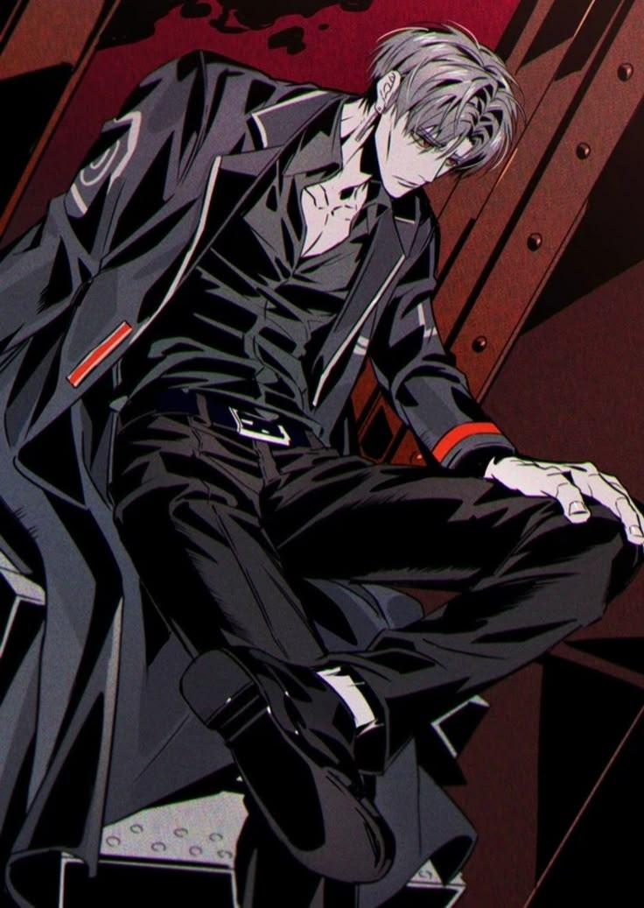

> 이미지는 만화풍으로 그려진 한 남성의 캐릭터 일러스트입니다. 

*   **배경**: 배경은 대체로 어둡고 무거운 분위기를 가지고 있습니다. 배경의 색은 짙은 빨간색과 짙은 갈색으로, 금속 느낌의 재질로 사각형의 무늬가 새겨져 있습니다. 벽면에 고정된 금속판에는 둥근 머리 나사가 일정한 간격으로 박혀 있습니다. 
*   **캐릭터**: 캐릭터는 짙은 회색의 짧은 머리를 가지고 있으며, 짙은 색의 눈을 가지고 있습니다. 캐릭터는 검은색 재킷을 입고 있으며, 재킷의 왼쪽 소매에는 주황색의 액센트가 있습니다. 재킷 안에는 검은색의 상의를 입고 있으며, 바지는 검은색입니다. 바지 허리춤에는 검은색 벨트를 착용하고 있습니다. 신발은 검은색이며, 발등 부분이 살짝 노출되어 있습니다. 
*   **자세**: 캐릭터는 왼쪽 다리를 굽혀서 앉아 있는 자세를 하고 있습니다. 캐릭터의 시선은 아래로 향하고 있습니다. 

전체적으로 이 캐릭터는 어둡고 신비로운 분위기를 가지고 있습니다. 캐릭터의 자세와 표정은 우울하거나 슬픈 감정을 나타내고 있는 것 같습니다.

---

## 슬라이드 24

### 최종보스 1페이즈

#### 망토, 갑주 섞인거

#### Or

#### 과하고 두터운 복식

#### 어느 쪽이든 낡고 부식

#### 배경에 이런 초상화 걸려도

#### 좋을 듯

#### Sd 레퍼런스

#### 왕좌에 앉아있다가

#### 일어나서

#### 축 늘어진 채로

#### 검 휘두르기

#### 여왕의 왕관을

#### 들고 있음

> 이미지는 다크한 판타지 세계관의 캐릭터 일러스트입니다. 

중앙에 위치한 캐릭터는 짙은 회색과 검은색의 갑옷을 입고 있습니다. 

갑옷은 날카로운 금속 조각으로 이루어져 있으며, 여러 개의 사슬로 묶여 있습니다. 

갑옷의 중앙에는 복잡한 디자인의 로고가 새겨져 있습니다. 

캐릭터의 머리는 가면으로 가려져 있으며, 가면 위에는 여러 개의 날카로운 금속 조각이 솟아 있습니다. 

캐릭터의 뒤로는 푸른색과 흰색의 빛이 감돌고 있습니다.

이미지의 상단에는 노란색과 흰색의 옷을 입은 캐릭터의 일부가 보입니다. 

이미지의 배경은 하얗고 밝은 색상으로, 캐릭터가 돋보이게 합니다. 

전체적으로 이미지의 분위기는 어둡고 중후한 느낌을 줍니다.

> 이미지는 왕실의식을 위한 전통 의복을 입은 사람의 모습을 보여주고 있습니다.

*   **왕관**: 왕실의식을 위한 전통 의복을 입은 사람의 머리에는 왕관이 있습니다. 왕관의 색은 주로 짙은 파란색과 금색으로 구성되어 있습니다. 왕관의 윗부분에는 하얀색의 털이 있는 것으로 보아, 모피로 만든 왕관 같습니다. 
*   **의복**: 왕관 아래에 있는 사람의 의복은 짙은 파란색의 벨벳 천으로 만들어진 것으로 보입니다. 
*   **가운**: 짙은 파란색의 긴 가운을 입고 있습니다. 가운 위에는 하얀색의 털가죽이 덮여있습니다. 
*   **목도리**: 목에는 금색의 목도리를 착용하고 있습니다. 
*   **벨트**: 허리에는 금색의 벨트를 착용하고 있습니다. 
*   **팔**: 왼쪽 팔에는 금색의 팔찌를 착용하고 있습니다. 
*   **가슴**: 가슴에는 꽃 모양의 금색 장식품을 착용하고 있습니다. 
*   **배경**: 배경은 짙은 검은색입니다.

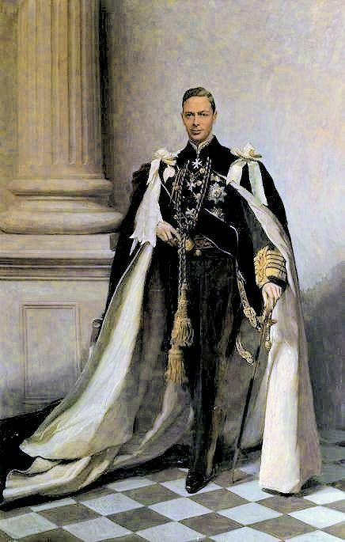

> 이미지는 게임 기획 문서의 일부가 아닌, 존 싱어 사거의 '알프레드 히치콕 경의 초상화(1912)'라는 유화 작품입니다.

이미지 중앙에는 흰머리가 희끗희끗한 중년 남성이 정면을 응시하며 서 있습니다. 신사처럼 단정한 복장과 단정한 머리가 인상적입니다. 

그는 짙은색의 금실 자수가 새겨진 제복을 입고 있습니다. 왼쪽 가슴에는 커다란 훈장을 찬 모습이 보입니다. 

오른쪽 허벅지에는 금색 끈으로 묶인 손잡이가 있는 무언가를 착용하고 있습니다. 

어깨에는 짙은색 망토를 두르고 있으며, 망토 위로도 금실이 자수가 새겨져 있습니다. 망토의 안감은 흰색이며, 왼쪽 어깨와 오른쪽 팔꿈치에 묶여 있습니다.

왼쪽에는 돌로 만들어진 기둥이 보입니다. 기둥 앞에는 검은색과 하얀색 타일로 만들어진 체크무늬 바닥이 있습니다.

이미지에는 별다른 UI 요소나 아이콘 등은 보이지 않으며, 게임과 관련된 어떠한 요소도 보이지 않습니다.

> 이 그림은 게임 캐릭터의 컨셉 아트 또는 캐릭터 디자인에 사용되는 것으로 추정되는 스케치입니다. 

그림에는 네 명의 캐릭터가 그려져 있습니다. 

*   **왼쪽 상단:** 뒤로 돌아앉은 자세의 캐릭터가 그려져 있습니다. 캐릭터는 손을 무릎 위에 올리고 있습니다. 
*   **오른쪽 상단:** 캐릭터가 왼쪽 손을 들어 흔드는 듯한 동작을 하고 있습니다. 
*   **왼쪽 하단:** 캐릭터가 코를 가리키는 듯한 동작을 하고 있습니다. 
*   **오른쪽 하단:** 의자에 앉아 있는 캐릭터가 그려져 있습니다. 

    모든 캐릭터는 머리가 크고 몸이 짧은 비율로 그려져 있습니다. 각 캐릭터의 동작과 표정은 감정이나 의도를 표현하는 데 중점을 둔 것으로 보입니다.

    배경에는 "KAIXIN"이라는 워터마크가 반복적으로 표시되어 있습니다.

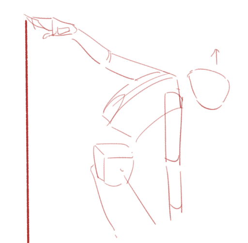

> 이미지는 게임 캐릭터의 자세를 묘사한 스케치입니다. 

가장 왼쪽에는 세로로 긴 빨간색 가이드 라인이 그려져 있습니다. 

가이드 라인의 오른쪽에는 캐릭터의 왼쪽 팔과 손가락이 그려져 있습니다. 손가락은 위를 가리키고 있습니다. 

팔꿈치 아래에는 사각형 모양의 오브젝트가 표현되어 있습니다. 

팔의 오른쪽 위에는 동그란 모양의 머리가 표현되어 있고, 머리 위에는 위쪽을 가리키는 화살표가 있습니다. 

팔과 몸통, 머리의 윤곽은 붉은색으로 표현되어 있고, 나머지는 흰색입니다. 

이는 게임 캐릭터의 콘셉트 아트 또는 동작 테스트를 위한 초기 스케치로 보입니다.

---

## 슬라이드 25

### 최종보스 (튜토리얼에서 등장 안함)

| 항목 | 내용 |
| --- | --- |
| 이름 | 더 월드 |
| 성별 | 여성 |
| 키/나이 | 300cm/23세 |
| 체형 | 가슴이 큼, 거대 여성, 손가락이 길고 얇고 뾰족 |
| 성격 | 자비로움, 자애로움. 모두의 행복을 위해 오류인 주인공을 제거하려 함 |
| 말투 |  |
| 역할 | 세계를 지휘하는 지휘자. 인외 마망 |

#### 이런 손 >

> 해당 이미지 속 인물은 흰머리, 하얀 웨딩드레스, 흰 장미 화관을 착용한 여성입니다. 

이미지 중앙에 있는 여성은 눈을 감고 있으며, 침대에 누워있는 모습입니다. 

여성의 머리 뒤에는 노란 별이 있고, 흰 꽃잎이 날아다니는 것을 확인할 수 있습니다.

전체적으로 이미지는 몽환적이고 신비로운 분위기를 가지고 있습니다. 침실의 분위기는 밝고 깨끗한 느낌이며, 여성의 평화로운 표정과 우아한 자세가 조화롭게 어우러져 있습니다. 

이미지 속에서는 조명 효과로 인해 빛과 그림자가 선명하게 대비되며, 여성의 피부를 부드럽게 비추는 빛이 그녀의 아름다움을 강조하고 있습니다.

이러한 이미지는 게임의 이벤트, 특히 중요한 캐릭터의 등장을 상징하거나, 게임의 특정 장면에서의 분위기를 설정하는 데 사용될 수 있습니다.

> 이미지는 흑백 일러스트로, 게임 기획 문서의 일부로 추정됩니다. 이미지는 어둡고 짙은 배경에 하늘이나 우주를 연상케 하는 배경에 은하, 별, 별자리가 흩어져 있습니다. 

중앙에는 한 인물이 어둡고 짙은 색상의 옷을 입고 있고, 이 인물은 고개를 숙인 채로 양손을 가슴 부위에 모으고 있습니다. 이 인물은 마스크나 가면과 같은 것으로 얼굴을 가리고 있어 구체적인 표정을 확인할 수 없습니다. 

이미지 상단에는 인물과 배경의 경계 부분에 희미한 원 모양의 무늬가 겹쳐져 있습니다. 배경에는 별자리들이 흩어져 있으며, 인물 위쪽 머리 부분에도 별자리가 그려져 있습니다. 

이미지 전반적으로 짙은 색조와 어둡고 흐린 분위기로 인해 신비롭고 고요한 느낌을 줍니다.

> 해당 이미지에는 게임에 등장하는 캐릭터의 모습이 그려져 있습니다.

이미지 중앙에 서 있는 여성 캐릭터는 온몸이 짙은 하늘색과 푸른색으로 표현되어 있습니다. 캐릭터의 상반신과 하반신에는 일정한 패턴의 무늬가 그려져 있으며, 캐릭터의 머리 위로는 여러 갈래로 갈라진 빛줄기들이 솟아오른 듯한 형상이 표현되어 있습니다. 캐릭터의 양팔과 양손에서는 여러 개의 가시가 솟아나와 있는 것을 확인할 수 있습니다. 

전체적으로 여성 캐릭터가 양팔을 벌리고 있는 모습이 마치 곤충의 모습을 닮았다고 할 수 있습니다. 캐릭터의 몸과 팔, 손가락 등에서 뻗어 나온 여러 개의 가시들은 날개처럼 표현되어 있어, 날아오를 듯한 모습을 보여 주고 있습니다. 캐릭터의 상의와 하의에는 가시 같은 날카로운 무늬들이 표현되어 있어, 날렵한 인상을 강조하고 있습니다.

배경은 흰색으로, 캐릭터가 중앙에 위치하도록 배치되어 있습니다. 캐릭터의 전체적인 색감과 배경의 흰색이 조화롭게 어우러져 시각적으로 깔끔한 이미지를 제공하고 있습니다.

---

## 슬라이드 26

### 최종보스 (튜토리얼에서 등장 안함)

#### 가슴 큰 길고 얇은 체형

#### (도자기 같은..)

#### 인간 피부 아니여도 됨

#### 팔 다리 늘려도 됨

#### 하늘 그 자체,..

#### 세계 그 자체 같은 복장

#### 마녀 같은 느낌

#### 하늘하늘하고

#### 옷이라는 느낌보단

#### 천을 두른 느낌

#### Sd 레퍼런스

#### 마에스트로 자세나

#### 누워서 떠다니는 자세

> 해당 이미지에는 한 명의 여성 캐릭터가 등장합니다. 여성 캐릭터는 온몸이 하얗고 긴 검은 머리카락을 가지고 있습니다. 여성 캐릭터의 상의는 노출이 심한 디자인으로, 양쪽 어깨가 노출되어 있고, 양쪽 가슴이 노출되어 있습니다. 하의는 길고 좁은 드레스입니다. 드레스의 색은 검은색이며, 드레스 끝과 머리카락 끝 부분에 푸른색이 가미되어 있습니다. 

여성의 오른쪽 손은 입꼬리 부분에 위치하고 있습니다. 여성의 왼팔은 노출되어 있습니다. 여성의 왼쪽 손은 보이지 않습니다. 

여성의 드레스 아래에는 검은색 액체가 있는 듯한 무늬가 있습니다. 

이미지 중앙에 캐릭터가 위치하고 있으며, 이미지의 배경은 하얀색입니다.

> 이미지는 게임 기획 문서의 일부가 아닌, 소셜 미디어에 업로드된 의상 사진입니다.

이미지 중앙에는 하얀 마네킹의 뒷면이 있습니다. 마네킹은 어깨와 허벅지까지 덮는 긴 천을 입고 있습니다. 천은 짙은 남색이며, 반짝이는 질감을 가지고 있습니다. 

천에는 여러 개의 별 모양의 보석이 무작위로 배치되어 있습니다. 보석은 대부분 은색이며, 투명한 재질로 만들어진 듯 반짝입니다. 

마네킹의 등 뒤쪽은 깊게 패인 브이넥 형태로 디자인되어 있습니다. 등 뒤에는 여러 개의 체인이 교차하며 연결되어 있고, 체인에는 꽃 또는 별 모양의 보석이 달려 있습니다. 

이미지의 오른쪽 하단에는 중국어로 작성된 문구와 함께 116731868884라는 숫자가 있습니다. 문구는 작은 홍서(小红书)라는 중국 소셜미디어 플랫폼의 로고 옆에 위치해 있습니다. 

이미지의 오른쪽 상단에는 De.Light 라는 문구와 함께 몇 개의 한자가 있습니다.

이미지의 배경은 검은색입니다.

> 이미지는 게임 기획 문서에 포함된 이미지로 추정됩니다. 이 이미지에는 스타일리시한 의상이 등장하며, 해당 의상은 흰색 마네킹에 착용되어 있습니다.

이미지 중앙에는 스타일리시한 디자인과 은은한 광택이 돋보이는 의상이 있습니다. 이 의상은 짙은 청색과 밝은 청색의 조합으로, 별과 달 모양의 장식이 특징입니다. 의상의 상단 부분은 스타일리시한 디자인으로 되어 있으며, 뒷면이 V자 모양으로 깊게 파여 있습니다. 어깨 부분에는 스타 모양의 장식이 있고, 등 뒤에는 달과 별 모양의 장식품이 달린 체인이 여러 개 걸쳐져 있습니다.

마네킹은 흰색이며, 목과 어깨 부분이 노출된 디자인입니다. 마네킹의 뒷면에는 여러 개의 체인이 걸쳐져 있으며, 각 체인에는 달과 별 모양의 장식품이 달려 있습니다.

이미지 하단에는 흰색 글씨로 "ALTCECORSETS.COM"이라는 웹사이트 주소가 적혀 있습니다. 또한, 이미지 중앙에는 흰색 원 안에 "A"와 "C"가 겹쳐진 로고가 있습니다.

이미지의 배경은 흰색이며, 조명은 밝고 균일합니다. 전반적으로 이 의상은 고급스럽고 스타일리시한 느낌을 주며, 게임 캐릭터의 의상으로 적합해 보입니다.

> 이 그림은 한 남자가 지휘봉을 들고 있는 모습을 묘사하고 있습니다.

*   **배경**: 그림의 배경은 흰색입니다.
*   **인물**: 중앙에 있는 남자는 검은 선으로 그려져 있습니다. 그는 손에 지휘봉을 들고 있으며, 다른 한 손은 가슴 앞에 위치해 있습니다. 남자는 머리에 꽃을 쓰고 있으며, 턱시도 형태의 옷을 입고 있습니다. 그의 표정은 다소 심각하거나 집중된 것처럼 보입니다.

이 그림은 음악 공연, 지휘자, 또는 예술과 관련된 컨셉을 표현한 것으로 보입니다. 검은 선과 흰색 배경의 단순한 구도로 인해, 이 그림은 개략적인 스케치 또는 컨셉 아트처럼 보입니다.

> 이 그림은 게임 캐릭터의 컨셉 아트 또는 캐릭터 디자인 시트입니다. 여기에는 동일한 캐릭터의 다양한 자세가 나와 있습니다.

### 이미지 레이아웃
- 이미지는 3행 3열의 격자 레이아웃으로 구성되어 있습니다.
- 각 행과 열은 고르게 배치되어 있습니다.

### 캐릭터 자세
각각의 자세는 다음과 같습니다:

1. **첫 번째 행:**
   - **왼쪽 위:** 엎드린 자세로 상체를 일으킨 모습. 
     - 설명: "支起上半身躺着(2)" (상체를 일으켜 누운 자세 (2))
   - **오른쪽 위:** 뒤로 누운 자세.
     - 설명: "仰面躺" (엎드려 있음)
   - **가운데 위:** 한쪽 다리를 굽힌 채 옆으로 누운 자세. 발등을 잡고 있음.
     - 설명: "快乐扭腿" (즐거운 자세)

2. **두 번째 행:**
   - **왼쪽 중간:** 옆으로 누운 자세, 베개를 끌어안고 있음.
     - 설명: "趴在抱枕上" (베개에 엎드려 있음)
   - **오른쪽 중간:** 옆으로 누워서 베개를 끌어안고 있는 자세.
     - 설명: "抱着抱枕侧躺" (베개를 안고 옆으로 누운 자세)

3. **세 번째 행:**
   - **왼쪽 아래:** 엎드린 자세.
     - 설명: "支撑脸颊侧躺" (볼을 괴고 옆으로 누운 자세)
   - **오른쪽 아래:** 옆으로 누운 자세로 한쪽 손가락을 세우고 있음.
     - 설명: "撅脸侧躺" (입을 삐죽이고 옆으로 누운 자세)

### 캐릭터 디자인
- 캐릭터는 머리가 크고 몸이 간결하게 표현된 심플한 디자인입니다.
- 선은 검은색이며, 몸은 하얀색이고 일부는 옅은 파란색 음영이 들어가 있습니다.

### 텍스트
- 각 캐릭터 자세 아래에 중국어 설명이 있습니다.

이 컨셉 아트는 캐릭터의 다양한 움직임을 표현하고 있으며, 게임 내 애니메이션 또는 상호작용에 활용될 수 있습니다.

---
