# 노드시스템_V5_김주연

## 슬라이드 1

> 이미지는 게임 기획 문서의 일부로, "시스템기획서"와 "노드 시스템"이라는 제목이 포함된 페이지입니다.

*   **텍스트**: 
    *   중앙에 **검은색** 글씨로 "시스템기획서"와 "노드 시스템"이 표시되어 있습니다.
    *   텍스트는 **한글**로 작성되어 있습니다.
    *   텍스트의 크기는 두 줄로, 첫 줄에는 "시스템기획서", 두 번째 줄에는 "노드 시스템"이 더 작은 크기로 표시되어 있습니다.
*   **다이어그램 및 UI 요소**: 
    *   이미지에는 텍스트 외에 다른 시각적 요소나 레이아웃은 포함되어 있지 않습니다.
    *   배경은 **흰색**입니다.
*   **시각적 레이아웃과 구조**: 
    *   페이지 중앙에 제목이 집중되어 있어, 간결하고 명확한 구조를 보여줍니다.
    *   레이아웃은 심플하며, 텍스트가 중앙에 위치하여 가독성을 높입니다.

종합적으로, 이 페이지는 게임의 시스템 기획서 중 노드 시스템에 관한 소개 또는 제목 페이지로 사용될 수 있습니다.

---

## 슬라이드 2

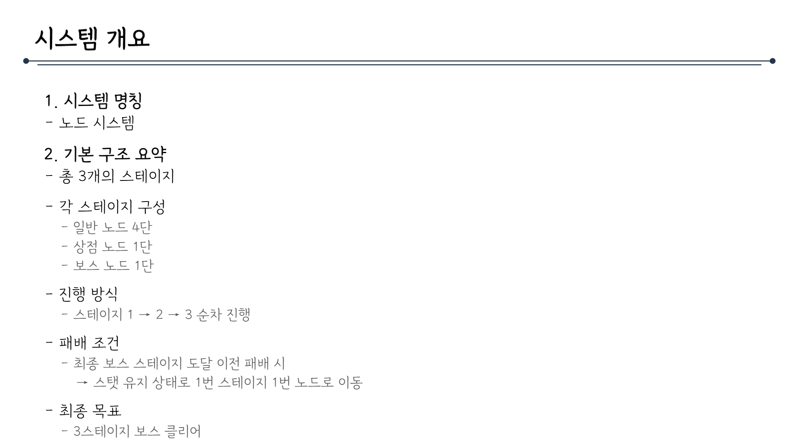

> 이미지는 게임 기획 문서의 일부로, 시스템 개요에 대한 정보를 제공하고 있습니다. 문서의 구조와 내용을 상세하게 설명해 드리겠습니다.

### 문서의 구조
- **제목**: "시스템 개요"라는 제목이 페이지 상단에 위치해 있습니다.
- **분할선**: 제목 아래에 긴 분할선이 그어져 있어, 제목과 본문 내용을 시각적으로 구분하고 있습니다.

### 내용
1. **시스템 명칭**
   - 시스템의 이름은 "노드 시스템"입니다.

2. **기본 구조 요약**
   - 이 시스템은 총 **3개의 스테이지**로 구성되어 있습니다.
   - **각 스테이지의 구성**:
     - 일반 노드 4단
     - 상점 노드 1단
     - 보스 노드 1단

3. **진행 방식**
   - 스테이지 1 → 2 → 3으로 순차적으로 진행됩니다.

4. **패배 조건**
   - 최종 보스 스테이지 도달 이전에 패배할 경우:
     - 스탯 유지 상태로 **1번 스테이지 1번 노드**로 이동합니다.

5. **최종 목표**
   - **3스테이지 보스 클리어**입니다.

### 레이아웃
- 문서의 레이아웃은 깔끔하고 체계적입니다.
- 각 항목은 숫자와 기호(-, →)를 사용하여 체계적으로 나열되어 있어 가독성이 좋습니다.
- 텍스트는 왼쪽 정렬되어 있으며, 충분한 여백이 있어 시각적으로 편안합니다.

이 문서는 게임의 노드 시스템에 대한 기본적인 구조와 진행 방식을 설명하고 있으며, 개발 또는 기획 단계에서 중요한 참고 자료로 활용될 것으로 보입니다.

---

## 슬라이드 3

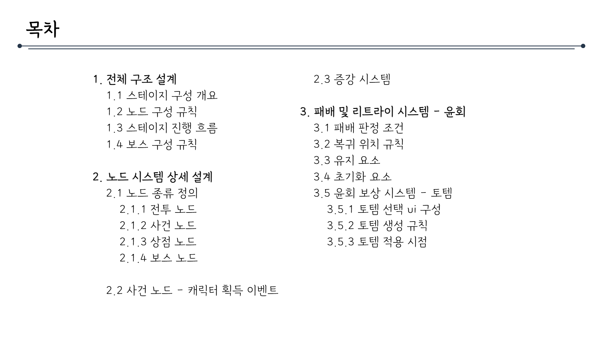

> 이미지는 게임 기획 문서의 일부로 보이는 목차 페이지입니다. 페이지의 레이아웃과 구조, 포함된 텍스트를 상세하게 설명해 드리겠습니다.

### 레이아웃 및 구조

*   페이지의 배경은 흰색이며, 상단 왼쪽에 **목차**라는 타이틀과 함께 긴 가로선이 그어져 있습니다. 
*   가로선은 왼쪽에 점이 하나 있고 오른쪽에 점이 하나 있는 형태입니다.
*   목차는 총 3개의 큰 카테고리로 구성되어 있으며, 각각의 큰 카테고리에는 세부 항목들이 번호 순으로 나열되어 있습니다.

### 텍스트 내용

*   **목차**
    *   1. 전체 구조 설계
        *   1.1 스테이지 구성 개요
        *   1.2 노드 구성 규칙
        *   1.3 스테이지 진행 흐름
        *   1.4 보스 구성 규칙
    *   2. 노드 시스템 상세 설계
        *   2.1 노드 종류 정의
            *   2.1.1 전투 노드
            *   2.1.2 사건 노드
            *   2.1.3 잠시 멈춤 노드
            *   2.1.4 보스 노드
        *   2.2 사건 노드 - 캐릭터 획득 이벤트
    *   2.3 장비 시스템
    *   3. 패배 및 리트라이 시스템 - 윤희
        *   3.1 패배 판단 조건
        *   3.2 복귀 위치 규칙
        *   3.3 유지 요소
        *   3.4 초기화 요소
        *   3.5 윤희 보상 시스템 - 토템
            *   3.5.1 토템 선택 UI 구성
            *   3.5.2 토템 생성 규칙
            *   3.5.3 토템 즉시 용 시스템

---

## 슬라이드 4

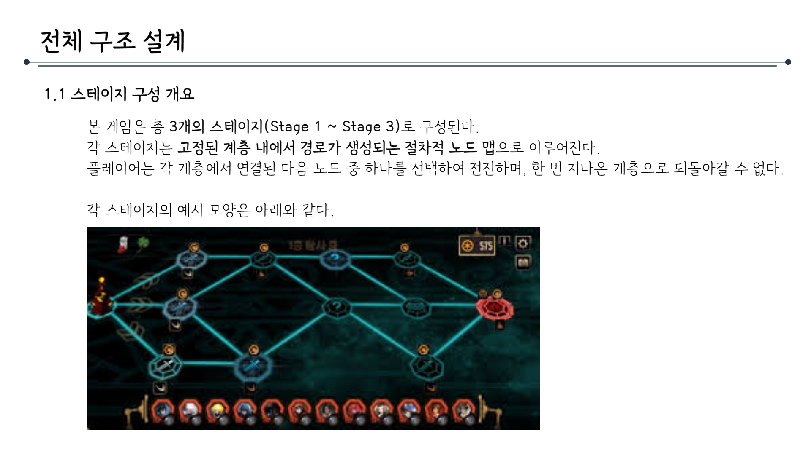

> 해당 이미지는 게임 기획 문서의 일부로, 게임의 전체 구조 설계에 관한 내용을 담고 있습니다. 

### 이미지 내용:

1. **제목**: 
   - "전체 구조 설계"라는 제목이 표시되어 있습니다.

2. **1.1 스테이지 구성 개요**:
   - 본 게임은 총 **3개의 스테이지 (Stage 1 ~ Stage 3)**로 구성됩니다.
   - 각 스테이지는 **고정된 계층** 내에서 경로가 생성되는 **절차적 노드 맵**으로 이루어져 있습니다.
   - 플레이어는 각 계층에서 연결된 다음 노드 중 하나를 선택하여 전진하며, **한 번 지나온 계층으로 돌아갈 수 없습니다**.

3. **스테이지 예시**:
   - 각 스테이지의 예시 모습이 제공됩니다.
   - 이미지 중앙에는 여러 개의 노드가 **파란색 선**으로 연결된 **망 형태의 구조**가 보입니다.
   - 노드는 원형이며, 일부 노드는 **하이라이트 처리**되어 있고, 노드 안에는 **아이콘**이 표시되어 있습니다.
   - 화면 상단 우측에는 **"55"**라는 숫자가 표시된 아이콘이 있고, 그 옆에 **세 개의 아이콘**이 보입니다.
   - 화면 하단에는 **여러 캐릭터 아이콘**이 **빨간색 테두리**로 강조되어 배열되어 있습니다.

### 레이아웃 및 구조:
- **텍스트 부분**: 
  - 제목과 1.1 스테이지 구성 개요에 대한 설명이 **왼쪽 정렬**되어 있습니다.
  - 설명 텍스트는 **두 단락**으로 나누어져 있습니다.

- **이미지 부분**:
  - 스테이지 예시 이미지 (**가로 방향**)가 중앙에 배치되어 있습니다.
  - 이미지는 **어두운 배경**에 **파란색 선과 노드 아이콘**이 강조되어 보입니다.

이 구조는 게임의 스테이지 구성을 설명하기 위해 **텍스트와 이미지를 함께 사용**하고 있으며, 게임의 진행 방식과 스테이지의 시각적 레이아웃을 명확히 표현하고 있습니다.

---

## 슬라이드 5

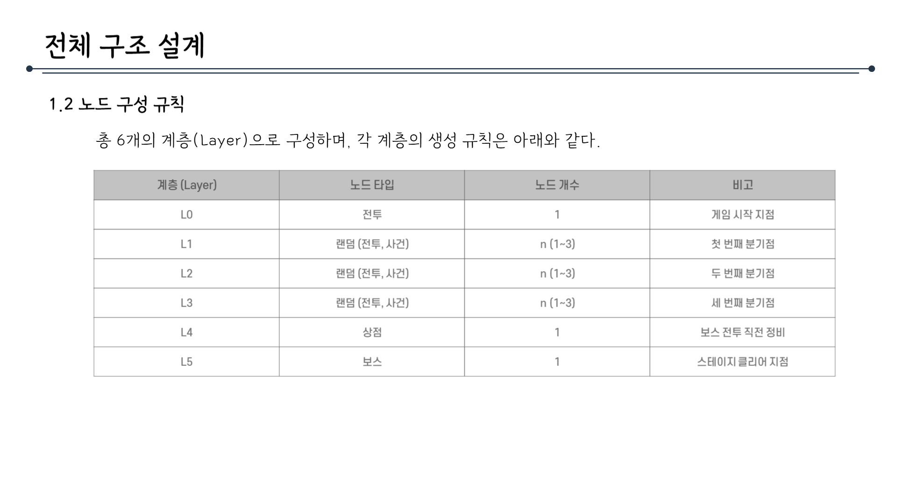

> 해당 이미지는 게임 기획 문서의 일부로, 게임의 전체 구조 설계에 관한 내용을 담고 있습니다. 문서의 제목은 "전체 구조 설계"이며, 하위 제목은 "1.2 노드 구성 규칙"입니다.

문서의 핵심은 게임의 구조를 6개의 계층(Layer)으로 구성하고, 각 계층의 생성 규칙을 정의하는 것입니다. 

### 문서 내용:

1. **제목 및 하위 제목**
   - **제목**: 전체 구조 설계
   - **하위 제목**: 1.2 노드 구성 규칙

2. **설명 텍스트**
   - 총 6개의 계층(Layer)으로 구성되며, 각 계층의 생성 규칙은 아래와 같다.

3. **테이블**
   테이블은 5개의 열과 6개의 행으로 구성되어 있습니다. 각 열의 이름은 다음과 같습니다.
   - **계층(Layer)**: 각 계층을 L0부터 L5까지 표시
   - **노드 타입**: 각 계층에서 생성되는 노드의 타입을 표시
   - **노드 개수**: 각 계층에서 생성되는 노드의 개수를 표시
   - **비고**: 해당 계층에 대한 추가 설명을 표시

   각 행은 L0부터 L5까지의 계층을 나타내며, 세부 내용은 다음과 같습니다:

   - **L0**
     - 노드 타입: 전투
     - 노드 개수: 1
     - 비고: 게임 시작 지점

   - **L1**
     - 노드 타입: 랜덤 (전투, 사건)
     - 노드 개수: n (1~3)
     - 비고: 첫번째 분기점

   - **L2**
     - 노드 타입: 랜덤 (전투, 사건)
     - 노드 개수: n (1~3)
     - 비고: 두번째 분기점

   - **L3**
     - 노드 타입: 랜덤 (전투, 사건)
     - 노드 개수: n (1~3)
     - 비고: 세번째 분기점

   - **L4**
     - 노드 타입: 상점
     - 노드 개수: 1
     - 비고: 보스 전투 직전 정비

   - **L5**
     - 노드 타입: 보스
     - 노드 개수: 1
     - 비고: 스테이지 클리어 지점

### 레이아웃 및 구조
- 문서의 상단에는 큰 제목인 "전체 구조 설계"가 있고, 그 아래에 "1.2 노드 구성 규칙"이 있습니다.
- 설명 텍스트는 제목 아래에 위치하며, 테이블은 문서의 주요 내용을 구성합니다.
- 테이블의 각 열은 동일한 너비를 가지며, 텍스트는 왼쪽 정렬되어 있습니다.

이 구조는 게임의 흐름을 체계적으로 설계하기 위한 규칙을 제시하며, 각 계층의 목적과 특성을 명확히 정의하고 있습니다.

---

## 슬라이드 6

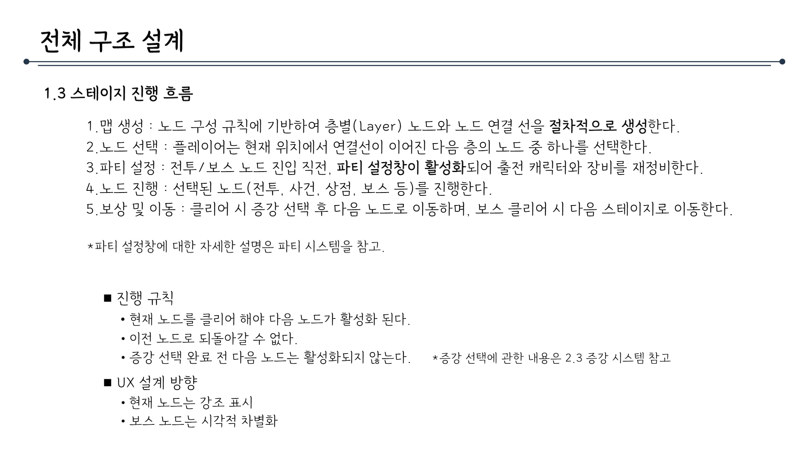

> 이미지는 게임 기획 문서의 일부로, **전체 구조 설계**에 대한 내용을 담고 있습니다. 문서의 제목은 화면 상단에 위치하며, 중간에 가는 가로선이 그어져 있습니다.

### **1.3 스테이지 진행 흐름**

1. **맵 생성**: 
   - 노드 구성 규칙에 따라 **레이어(Layer) 노드**와 노드 연결 선을 절차적으로 생성합니다.

2. **노드 선택**: 
   - 플레이어는 현재 위치에서 연결된 다음 층의 노드 중 하나를 선택합니다.

3. **파티 설정**: 
   - 전투/보스 노드 진입 직전, **파티 설정창이 활성화되어** 출전 캐릭터와 장비를 재설정할 수 있습니다.

4. **노드 진행**: 
   - 선택된 노드(전투, 사건, 상점, 보스 등)를 진행합니다.

5. **보상 및 이동**: 
   - 클리어 시 증강 선택 후 다음 노드로 이동하며, 보스 클리어 시 다음 스테이지로 이동합니다.

> **파티 설정창에 대한 자세한 설명은 파티 시스템을 참조하세요.**

### **진행 규칙**

- 현재 노드를 클리어해야 다음 노드가 활성화됩니다.
- 이전 노드로 돌아갈 수 없습니다.
- 증강 선택 완료 전 다음 노드는 활성화되지 않습니다.

> **증강 선택에 관한 내용은 2.3 증강 시스템을 참조하세요.**

### **UX 설계 방향**

- 현재 노드는 강조 표시합니다.
- 보스 노드는 시각적으로 차별화합니다.

문서는 게임의 스테이지 진행 구조와 규칙, 사용자 경험(UX) 설계 방향을 체계적으로 설명하고 있으며, 게임 개발을 위한 기초적인 가이드라인을 제공하고 있습니다.

---

## 슬라이드 7

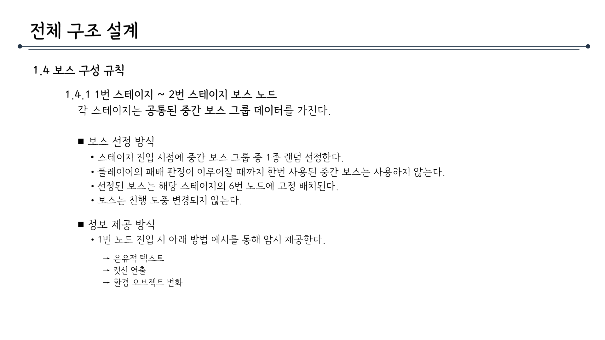

> 이 문서는 게임 기획 문서의 일부로, 게임의 전체 구조 설계에 대한 내용을 담고 있습니다. 문서의 제목은 "전체 구조 설계"이며, 아래에 1.4 "보스 구성 규칙"이 있습니다.

### 1.4 보스 구성 규칙

- **1.4.1 1번 스테이지 ~ 2번 스테이지 보스 노드**
  - 각 스테이지에는 공통된 중간 보스 그룹 데이터가 있습니다.

#### 보스 선정 방식
- 스테이지 진입 시점에 중간 보스 그룹 중 1종을 랜덤으로 선정합니다.
- 플레이어의 패배 판단이 이루어질 때까지 한 번 사용된 중간 보스는 사용하지 않습니다.
- 선정된 보스는 해당 스테이지의 6번 노드에 고정 배치됩니다.
- 보스는 진행 도중 변경되지 않습니다.

#### 정보 제공 방식
- 1번 노드 진입 시 아래 방법 예시를 통해 암시 제공합니다.
  - 은유적 텍스트
  - 컷신 연출
  - 환경 오브젝트 변화

문서는 전체적으로 게임의 보스 선정 방식과 정보 제공 방식에 대해 구체적으로 설명하고 있습니다.

---

## 슬라이드 8

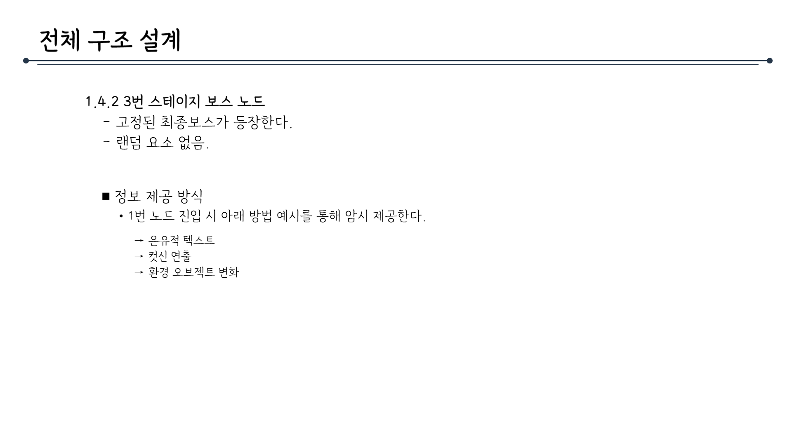

> 이미지는 게임 기획 문서의 일부로, 전체 구조 설계에 대한 내용을 담고 있습니다. 문서의 레이아웃과 구조는 다음과 같습니다.

*   **제목**: 문서의 제목은 "전체 구조 설계"로, 페이지 상단에 위치해 있습니다.
*   **1.4.2 3번 스테이지 보스 노드**: 
    *   고정된 최종보스가 등장한다.
    *   랜덤 요소 없음.
*   **정보 제공 방식**: 
    *   1번 노드 진입 시 아래 방법 예시를 통해 암시 제공한다.
        *   은유적 텍스트
        *   컷신 연출
        *   환경 오브젝트 변화

문서의 배경색은 흰색이며, 텍스트는 검은색입니다. 폰트는 고딕체로 추정되며, 크기는 10-12포인트로 추정됩니다. 

문서의 레이아웃은 간결하고 명확하며, 가독성이 뛰어납니다.

---

## 슬라이드 9

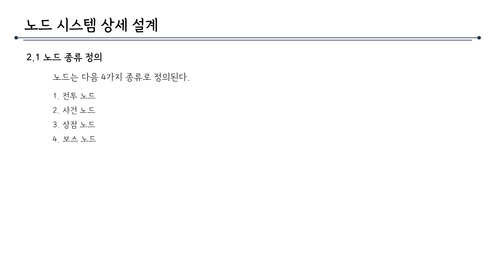

> 이미지는 게임 기획 문서의 일부로, "노드 시스템 상세 설계"에 대한 설명을 담고 있습니다. 문서의 구조와 내용을 상세히 분석해 보겠습니다.

### 레이아웃 및 구조
- **제목**: 문서의 상단에는 "노드 시스템 상세 설계"라는 제목이 중앙에 위치해 있습니다. 제목 위쪽과 아래쪽에 각각 점이 있는 수평선이 그려져 있어, 제목을 강조하고 있습니다.
- **문단 구조**: 제목 아래에 바로 "2.1 노드 종류 정의"라는 소제목이 있습니다. 이 소제목 아래에 노드의 정의와 종류가 나열되어 있습니다.

### 텍스트 내용
- **제목**: 노드 시스템 상세 설계
- **소제목**: 2.1 노드 종류 정의
- **설명**: 노드는 다음 4가지 종류로 정의된다.
  - 1. 전토 노드
  - 2. 사건 노드
  - 3. 상점 노드
  - 4. 보스 노드

### 시각적 요소
- **수평선**: 문서의 상단과 하단에 점이 있는 수평선이 그려져 있어, 제목을 강조하고 있습니다.
- **목록**: 노드의 종류는 번호가 매겨진 목록으로 나열되어 있어, 각 항목이 순서 있게 구분됩니다.

### 요약
이 문서는 게임의 노드 시스템에 대한 설계 문서로, 노드의 종류를 네 가지로 정의하고 있습니다. 레이아웃은 깔끔하며, 제목과 소제목이 명확하게 구분되어 있습니다. 목록은 번호를 매겨 가독성을 높였습니다.

---

## 슬라이드 10

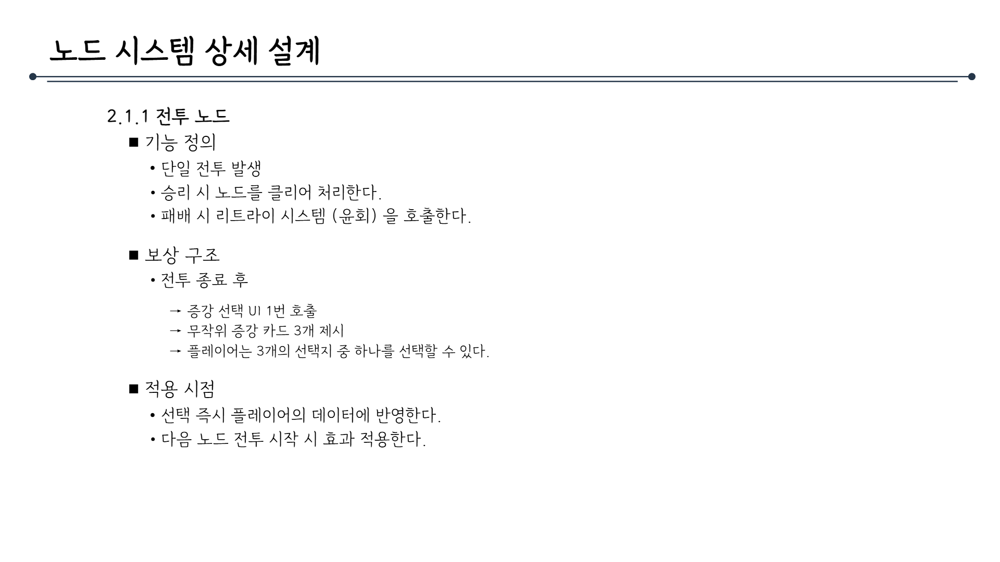

> 이미지는 게임 기획 문서의 일부로, "노드 시스템 상세 설계"에 대한 정보를 제공합니다. 문서의 레이아웃과 구조는 다음과 같습니다.

*   제목: "노드 시스템 상세 설계" (가운데 정렬)
*   수평선이 제목 아래에 위치하며, 선의 왼쪽과 오른쪽 끝에 점이 있습니다.
*   2.1.1 전투 노드
    *   기능 정의
        *   단일 전투 발생
        *   승리 시 노드를 클리어 처리한다.
        *   패배 시 리트라이 시스템(윤회)을 호출한다.
    *   보상 구조
        *   전투 종료 후
            *   장비 선택 UI 1번 호출
            *   무작위 장비 카드 3개 제시
            *   플레이어는 3개의 선택지 중 하나를 선택할 수 있다.
    *   적용 시점
        *   선택 즉시 플레이어의 데이터에 반영된다.
        *   다음 노드 전투 시작 시 효과가 적용한다.

문서의 레이아웃은 간단하고 명확하며, 게임의 노드 시스템에 대한 상세한 정보를 제공합니다.

---

## 슬라이드 11

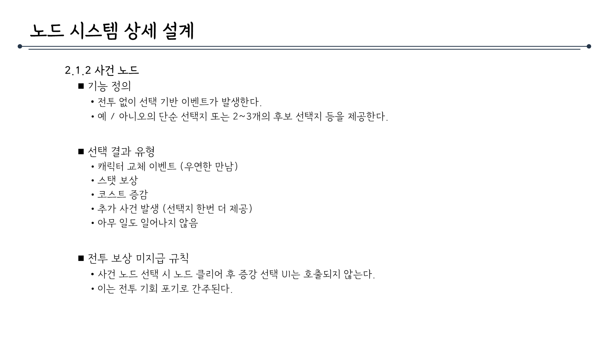

> 이미지는 게임 기획 문서의 일부로, '노드 시스템 상세 설계'라는 제목이 있습니다.

문서의 레이아웃과 구조는 다음과 같습니다.

*   제목: '노드 시스템 상세 설계'
*   가로 라인: 제목 아래에 점이 있는 가로 라인이 있습니다.
*   내용: 2.1.2 사건 노드

    *   기능 정의
        *   전투 없이 선택 기반 이벤트가 발생한다.
        *   예/아니오의 단순 선택지 또는 2~3개의 후보 선택지 등을 제공한다.
    *   선택 결과 유형
        *   캐릭터 교체 이벤트 (우연한 만남)
        *   스탯 보상
        *   코스트 증가
        *   추가 사건 발생 (선택지 한번 더 제공)
        *   아무 일도 일어나지 않음
    *   전투 보상 미지급 규칙
        *   사건 노드 선택 시 노드 클리어 후 증강 선택 1는 호출되지 않는다.
        *   이는 전투 기회 포기라 간주된다.

문서의 전반적인 레이아웃은 깨끗하고 정돈되어 있으며, 게임의 노드 시스템에 대한 상세한 정보를 제공합니다.

---

## 슬라이드 12

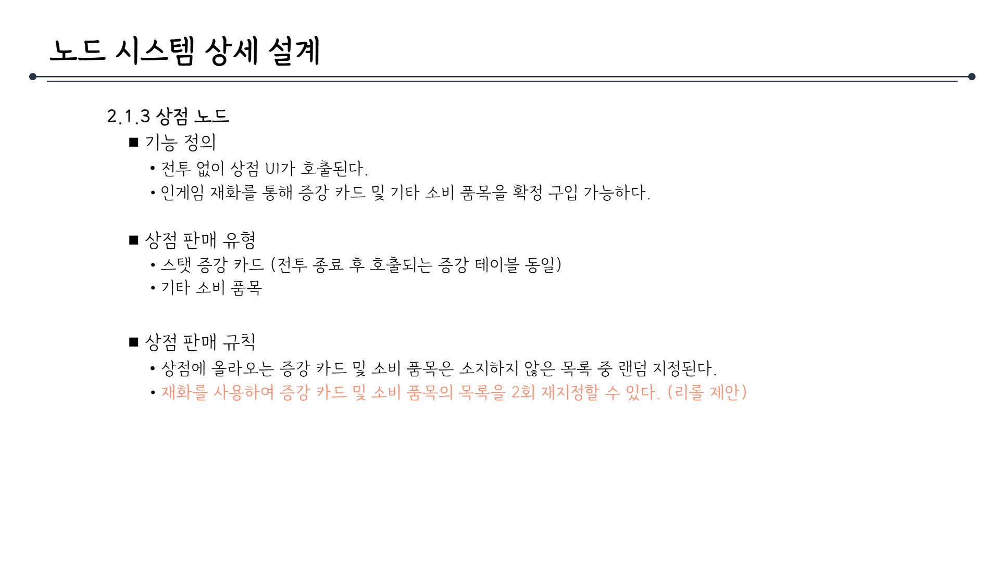

> 이미지는 게임 기획 문서의 일부로, "노드 시스템 상세 설계"에 대한 내용을 담고 있습니다. 문서의 레이아웃과 구조는 다음과 같습니다.

*   제목: "노드 시스템 상세 설계" 
*   수평선이 제목 아래에 위치하며, 선의 좌우 끝에 점이 있습니다.
*   문서의 주요 내용은 2.1.3 상점 노드입니다. 
*   내용이 3개의 하위 문단으로 나누어져 있습니다.

    *   첫 번째 문단: 기능 정의

        *   전투 없이 상점 UI가 호출됩니다.
        *   인게임 재화를 통해 증강 카드 및 기타 소비 품목을 확정 구매 가능합니다.
    *   두 번째 문단: 상점 판매 유형

        *   스탯 증강 카드 (전투 종료 후 호출되는 증강 테이블 동일)
        *   기타 소비 품목
    *   세 번째 문단: 상점 판매 규칙

        *   상점에 올라오는 증강 카드 및 소비 품목은 소지하지 않은 목록 중 랜덤 지정됩니다.
        *   재화를 사용하여 증강 카드 및 소비 품목의 목록을 2회 재지정할 수 있습니다. (리롤 제안)

---

## 슬라이드 13

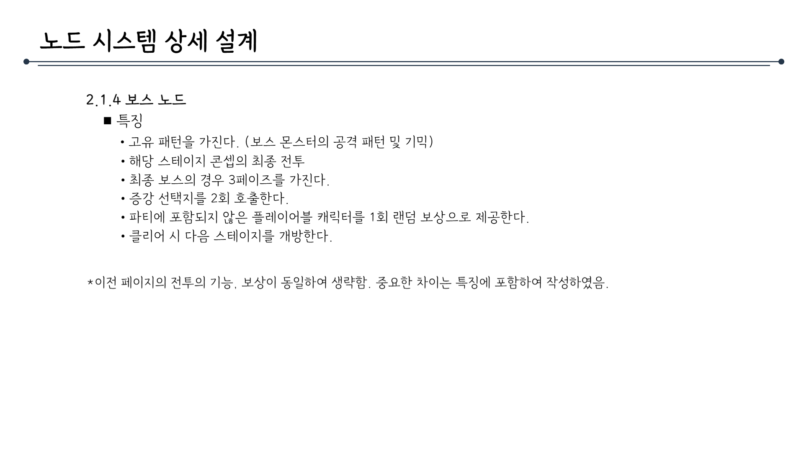

> ## 노드 시스템 상세 설계

### 2.1.4 보스 노드

#### 특징
- 고유 패턴을 가진다. (보스 몬스터의 공격 패턴 및 기믹)
- 해당 스테이지 클리어의 최종 전수
- 최종 보스의 경우 3페이즈를 가진다.
- 증강 선택지를 2회 호출한다.
- 파티에 포함되지 않은 플레이어블 캐릭터를 1회 랜덤 보상으로 제공한다.
- 클리어 시 다음 스테이지를 개방한다.

*이전 페이지의 전투의 기능, 보상이 동일하여 생략함. 중요한 차이점은 특징에 포함하여 작성하였음.*

---

## 슬라이드 14

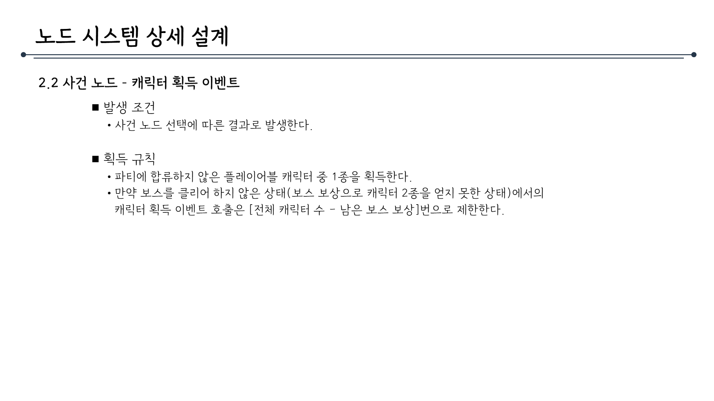

> 이미지는 게임 기획 문서의 일부로, '노드 시스템 상세 설계'라는 제목이 있습니다. 문서의 주요 내용은 다음과 같습니다.

*   **제목:** 노드 시스템 상세 설계
*   **문단 1:** 
    *   2.2 사건 노드 - 캐릭터 획득 이벤트
*   **문단 2:** 
    *   발생 조건 
        *   사건 노드 선택에 따른 결과로 발생한다.
*   **문단 3:**
    *   획득 규칙 
        *   파티에 합류하지 않은 플레이어블 캐릭터 중 1종을 획득한다.
        *   만약 보스를 클리어 하지 않은 상태(보스 보상으로 캐릭터 2종을 얻지 못한 상태)에서 캐릭터 획득 이벤트 호출은 \[전체 캐릭터 수 - 남은 보스 보상]번으로 제한한다.

문서는 기본적으로 흰색 배경에 검은색 텍스트로 구성되어 있습니다. 레이아웃은 깔끔하고 정돈되어 있으며, 텍스트는 왼쪽 정렬되어 있습니다.

---

## 슬라이드 15

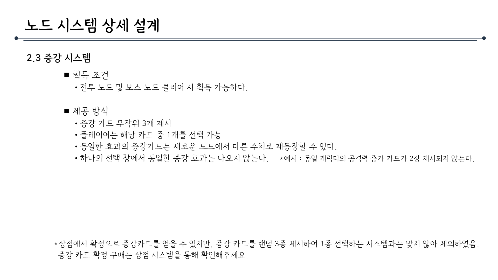

> 이미지는 게임 기획 문서의 일부로, "노드 시스템 상세 설계"에 대한 내용을 담고 있습니다. 문서의 레이아웃과 구조는 다음과 같습니다.

*   제목: "노드 시스템 상세 설계"라는 제목이 중앙에 위치해 있습니다.
*   수평선: 제목 아래에 긴 수평선이 그어져 있습니다.
*   내용: 제목과 수평선 아래에 2.3 증강 시스템이라는 문단이 있습니다. 이 문단에는 획득 조건과 제공 방식에 대한 설명이 포함되어 있습니다.

    *   **획득 조건**

        *   전투 노드 및 보스 노드 클리어 시 획득 가능하다.
    *   **제공 방식**

        *   증강 카드 무작위 3개 제시
        *   플레이어는 해당 카드 중 1개를 선택 가능
        *   동일한 효과의 증강카드는 새로운 노드에서 다른 수치로 재등장할 수 있다.
        *   하나의 선택 창에서 동일한 증강 효과는 나오지 않는다. (예시: 동일 캐릭터의 공격력 증가 카드가 2장 제시되지 않는다.)
*   추가 설명: 문서 하단에는 다음과 같은 추가 설명이 있습니다.

    *   상점에서 확률로 증강카드를 얻을 수 있지만, 증강 카드를 랜덤 3종 제시하여 1종 선택하는 시스템과는 맞지 않아 제외하였음. 증강 카드 확정 구매는 상점 시스템을 통해 확인해주세요.

문서의 레이아웃은 깨끗하고 정돈되어 있으며, 게임의 노드 시스템에 대한 상세한 설명을 제공하고 있습니다.

---

## 슬라이드 16

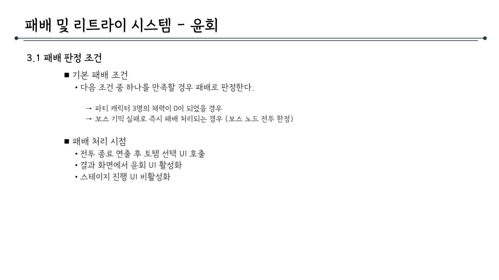

> 패배 및 리트라이 시스템 - 윤희

### 3.1 패배 판단 조건

*   **기본 패배 조건**
    *   다음 조건 중 하나를 만족할 경우 패배로 판단한다.
        *   파티 캐릭터 3명의 체력이 0이 되었을 경우
        *   보스 기믹 실패로 즉시 패배 처리되는 경우 (보스 노드 전투 한정)

*   **패배 처리 시점**
    *   전투 종료 직후 토템 선택 UI 호출
    *   결과 화면에서 윤희 UI 활성화
    *   스테이지 진행 UI 비활성화

---

## 슬라이드 17

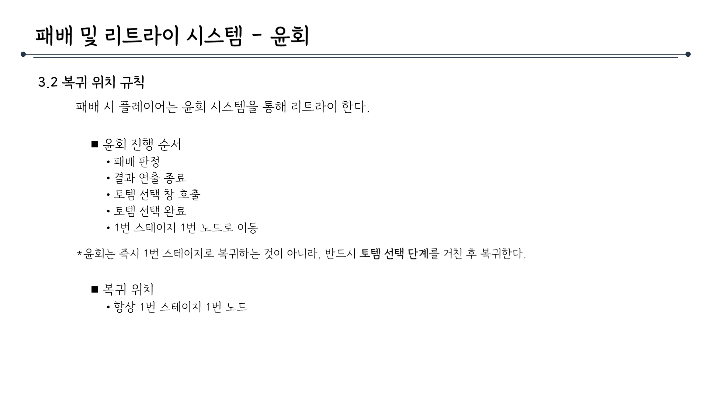

> 이미지는 게임 기획 문서의 일부로, "패배 및 리트라이 시스템 - 윤회"에 대한 설명입니다. 문서의 레이아웃과 구조는 다음과 같습니다.

*   제목: "패배 및 리트라이 시스템 - 윤회"
*   부제목: "3.2 복귀 위치 규칙"
*   내용:
    *   패배 시 플레이어는 윤회 시스템을 통해 리트라이 합니다.
    *   윤회 시행 순서:
        *   패배 판단
        *   결과 연출 종료
        *   토템 선택 창 호출
        *   토템 선택 완료
        *   1번 스테이지 1번 노드로 이동
    *   \*윤회는 즉시 1번 스테이지로 복귀하는 것이 아니라, 반드시 토템 선택 단계를 거친 후 복귀합니다.
    *   복귀 위치:
        *   항상 1번 스테이지 1번 노드

문서는 왼쪽에 제목과 부제목이 있고, 오른쪽에 내용이 나열되어 있습니다. 내용은 여러 항목으로 나누어져 있으며, 각 항목은 작은 점으로 구분됩니다. 문서의 배경은 흰색이며, 텍스트는 검은색입니다. 

전체적으로 문서의 레이아웃은 간단하고 명확하며, 게임의 패배 및 리트라이 시스템에 대한 정보를 체계적으로 제공합니다.

---

## 슬라이드 18

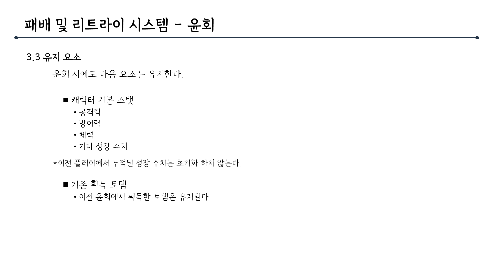

> 패배 및 리트라이 시스템 - 윤회

### 3.3 유지 요소

윤회 시에도 다음 요소는 유지한다.

* 캐릭터 기본 스탯
  * 공격력
  * 방어력
  * 체력
  * 기타 성장 수치

  *이전 플레이에서 누적된 성장 수치는 초기화 하지 않는다.*

* 기존 획득 토템
  * 이전 군회에서 획득한 토템은 유지된다.

---

## 슬라이드 19

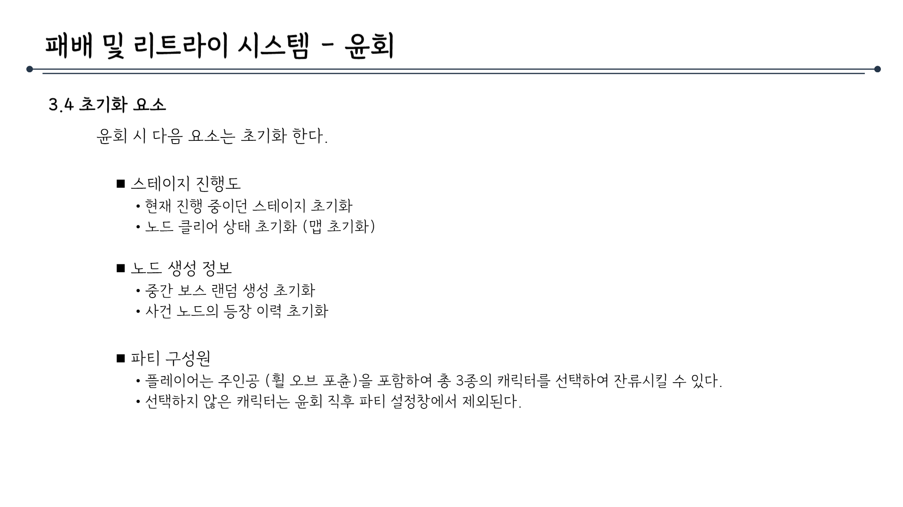

> 패배 및 리트라이 시스템 - 윤회

### 3.4 초기화 요소

윤회 시 다음 요소는 초기화 한다.

*   스테이지 진행도 
    *   현재 진행 중이던 스테이지 초기화
    *   노드 클리어 상태 초기화 (맵 초기화)
*   노드 생성 정보
    *   중간 보스 랜덤 생성 초기화
    *   사건 노드의 등장 이력 초기화
*   파티 구성원 
    *   플레이어는 주인공 (휠 오브 포춘)을 포함하여 총 3종의 캐릭터를 선택하여 잔류시킬 수 있다.
    *   선택하지 않은 캐릭터는 윤회 직후 파티 설정창에서 제외된다.

---

## 슬라이드 20

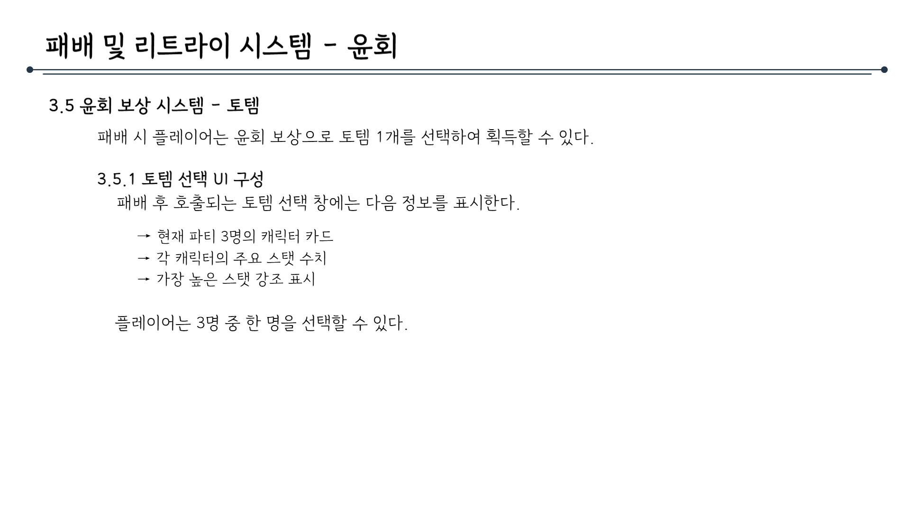

> 패배 및 리트라이 시스템 - 운회

### 3.5 운회 보상 시스템 - 토템

패배 시 플레이어는 운회 보상으로 토템 1개를 선택하여 획득할 수 있다.

### 3.5.1 토템 선택 UI 구성

패배 후 호출되는 토템 선택 창에는 다음 정보를 표시한다.

* 현재 파티 3명의 캐릭터 카드
* 각 캐릭터의 주요 스탯 수치
* 가장 높은 스탯 강조 표시

플레이어는 3명 중 한 명을 선택할 수 있다.

---

## 슬라이드 21

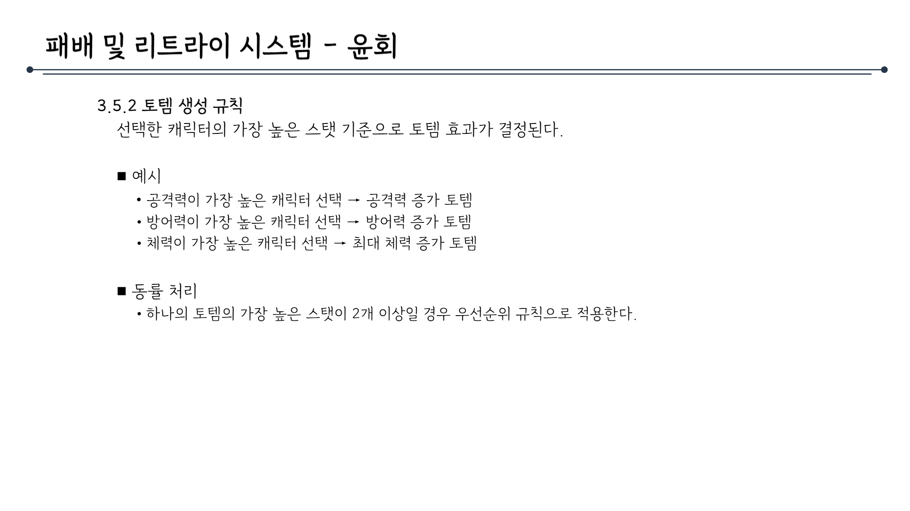

> 패배 및 리트라이 시스템 - 윤희

### 3.5.2 토템 생성 규칙
선택한 캐릭터의 가장 높은 스탯 기준 토템 효과가 결정된다.

- 예시
  - 공격력이 가장 높은 캐릭터 선택 → 공격력 증가 토템
  - 방어력이 가장 높은 캐릭터 선택 → 방어력 증가 토템
  - 체력이 가장 높은 캐릭터 선택 → 최대 체력 증가 토템

- 동률 처리
  - 하나의 토템의 가장 높은 스탯이 2개 이상일 경우 우선순위 규칙으로 적용한다.

---

## 슬라이드 22

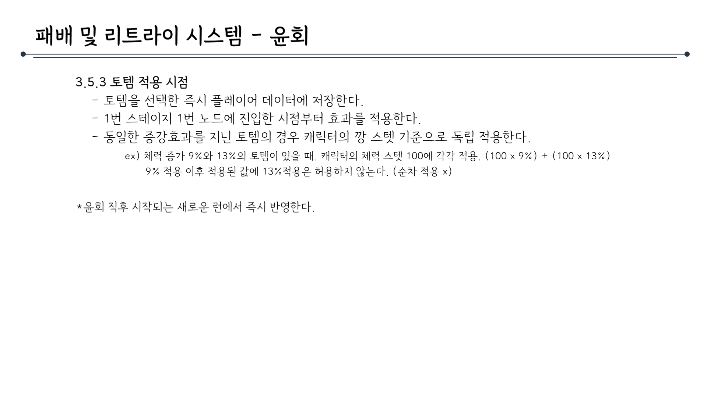

> 패배 및 리트라이 시스템 - 윤희

### 3.5.3 토템 적용 시점

- 토템을 선택한 즉시 플레이어 데이터에 저장한다.
- 1번 스테이지 1번 노드에 진입한 시점부터 효과를 적용한다.
- 동일한 증강효과를 지닌 토템의 경우 캐릭터의 깡 스텟 기준을로 독립 적용한다.

예) 체력 증가 9%와 13%의 토템이 있을 때, 캐릭터의 체력 스텟 100에 각각 적용. (100 x 9%) + (100 x 13%)
 
9% 적용 이후 적용된 값에 13% 적용은 허용하지 않는다. (순차 적용 X)

*윤희 직후 시작되는 새로운 런에서 즉시 반영한다.

---
