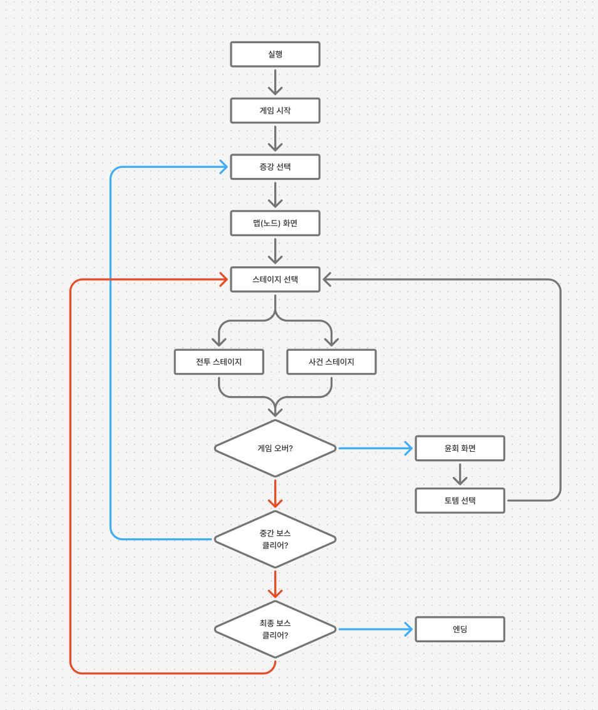
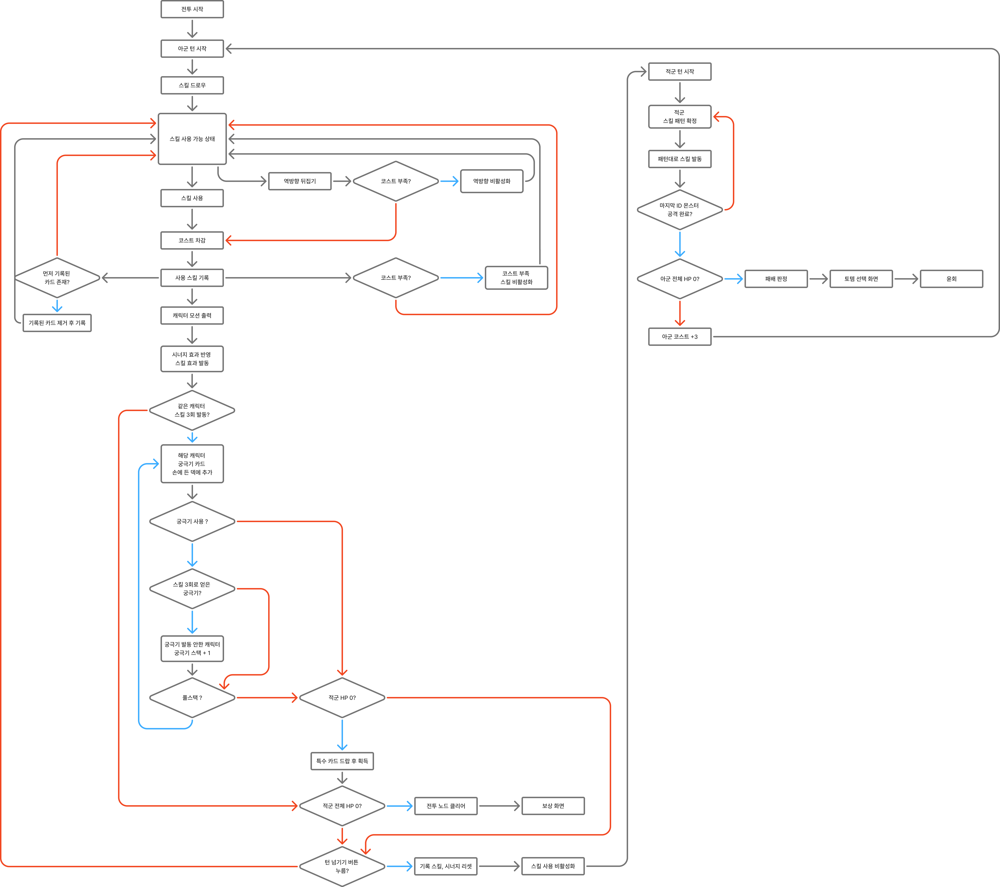

# 메인시스템_V2_이채연

## 슬라이드 1

메인 시스템 문서

---

## 슬라이드 2

이 문서를 읽을 때..

모든 것은 수정될 수 있습니다.

궁금한 점이 있으면 언제든 담당자 이채연에게 연락 부탁드립니다. (새벽에도  OK )

이채연 010 2988 7090

---

## 슬라이드 3

플레이 루프

> 이 게임 기획 문서의 일부인 이미지는 게임의 흐름도를 나타내고 있습니다. 이미지의 구조와 레이아웃, 그리고 포함된 텍스트와 다이어그램, UI 요소, 캐릭터, 아이콘 등을 상세하게 설명하겠습니다.

### 이미지 레이아웃 및 구조

*   이미지는 게임의 흐름을 보여주는 순서도로, 여러 개의 사각형과 다이아몬드 모양의 블록으로 구성되어 있습니다.
*   각 블록은 화살표로 연결되어 있어 게임의 진행 흐름을 나타냅니다.
*   배경은 회색 점선 패턴이 있는 흰색입니다.

### 텍스트 설명

*   이미지에는 여러 개의 사각형과 다이아몬드 블록에 한국어로 된 텍스트가 포함되어 있습니다. 
*   주요 텍스트는 다음과 같습니다.
    *   실행
    *   게임 시작
    *   증강 선택
    *   맵(노드) 화면
    *   스테이지 선택
    *   전투 스테이지
    *   사건 스테이지
    *   게임 오버?
    *   윤회 화면
    *   토탈 선택
    *   중간 보스 클리어?
    *   최종 보스 클리어?
    *   엔딩

### 다이어그램 및 흐름

*   게임의 흐름은 다음과 같습니다.
    1.  **실행** → 게임 시작 → **증강 선택** → 맵(노드) 화면 → **스테이지 선택**
    2.  스테이지 선택 후에는 두 가지 경로가 있습니다.
        *   **전투 스테이지**: 게임 오버? → 중간 보스 클리어? → 최종 보스 클리어? → 엔딩
        *   **사건 스테이지**: 윤회 화면 → 토탈 선택

### 시각적 요소

*   블록과 화살표: 사각형과 다이아몬드 블록은 게임의 각 단계를 나타내며, 화살표는 각 단계 간의 흐름을 보여줍니다.
*   색상: 주요 흐름을 강조하기 위해 빨간색, 파란색, 검은색의 선이 사용되었습니다.

### UI 요소

*   이미지에는 전통적인 UI 요소는 포함되어 있지 않지만, 게임의 흐름을 논리적으로 구성하기 위한 블럭과 화살표가 있습니다.

### 캐릭터 및 아이콘

*   이미지에 캐릭터나 아이콘은 포함되어 있지 않습니다.

이 이미지는 게임의 전반적인 구조와 진행 흐름을 설명하기 위해 설계되었습니다. 각 단계와 결정에 따라 게임의 결과가 달라지는 구조로 되어 있습니다.

---

## 슬라이드 4

세계관

#### 아르카나(카드)를 부여 받고 모든 것의 운명이 정해진 채 태어나는 세계관.

#### 사람이 살아가는 과정에서 카드의 힘이 강해지거나 약해지곤 한다.

#### 주인공은 기억을 가지고 윤회하는 능력을 가지고 있다.

소년기

청년기

노년기

주인공 카드

공격력 3

공격력 6

공격력 10

죽음

공격력 8

윤회

주인공 카드

주인공 카드

주인공 카드

---

## 슬라이드 5

튜토리얼

#### 운명을 정하는 절대적 존재인 최종 보스를 물리치기 위해 모험을 떠난 주인공 일행.

#### 하지만 최종 보스가 조력자(히로인)가 죽으면서 주인공은 윤회한 뒤 역방향의 힘을 각성하고 조력자와 아군의 죽음을 막기 위해 다시 여정을 떠난다.

아군 1

조력자

주인공

아군 1

조력자

주인공

죽음

죽음

최종보스

윤회

아군 1

조력자

주인공

---

## 슬라이드 6

노드 시스템

게임은 최종 보스까지 4개의 스테이지로 이루어져 있다.

한 스테이지는 기본적으로 3개의 전투 노드와 1개의 보스 노드로 이루어진다.

모든 스테이지의 첫 번째 노드는 전투 노드로 고정하고, 네번째 노드(스테이지의 마지막 노드)는 보스 노드로 고정한다.

모든 스테이지는 4개의 노드만 존재한다.

보스

전투

전투

전투

1 스테이지

---

## 슬라이드 7

전투 노드

중간

보스

각 스테이지가 시작할 때 보스의 종류가 정해지고 보스에 대한 힌트를 텍스트나 컷신으로 은유적으로 나타낸다.

전투 노드를 클리어 하면 증강을 받고 다음 노드로 진행할 수 있다.

이때 적은 확률로 사건 노드가 등장할 수 있다.

전투

전투

클리어

1 스테이지

---

## 슬라이드 8

사건 노드

#### 낮은 확률로 사건 노드, 혹은 특별한 사건 노드가 나타났을 때 플레이어가 사건 노드로 향할지 전투 노드로 향할지 선택할 수 있다.

중간

보스

전투

전투

클리어

사건

중간

보스

전투

전투

클리어

사건

노드 완료

사건 노드를 선택한 상황

1 스테이지

1 스테이지

---

## 슬라이드 9

사건 노드

#### 사건 노드를 선택해 완료한 상황에서도 사건 노드 선택지가 또 등장할 수 있다.

#### 노드를 완료할 때마다 사건 노드가 등장할 확률은 전 노드의 종류에 간섭 받지 않고 항상 동일하다.

중간

보스

전투

전투

클리어

사건

중간

보스

전투

전투

클리어

사건

노드 완료

사건 노드를 선택한 상황

사건

1 스테이지

1 스테이지

---

## 슬라이드 10

보스 노드

스테이지의 맨 끝에 존재하는 노드다.

최종 스테이지를 제외하고 보스 노드를 클리어하면 다음 스테이지로 넘어간다.

마지막 스테이지일 경우 최종 보스가 등장한다.

중간 보스

전투

전투

클리어

사건

3 스테이지

최종

보스

전투

전투

최종 스테이지

전투

---

## 슬라이드 11

아군 팀 구성

파티는 총 3명을 넘어갈 수 없다.

보유하고 있는 캐릭터가 3명 이상일 경우 캐릭터 파티 변경 컨텐츠가 활성화 된다.

보유 하고 있는 캐릭터를 파티 자리에 드래그 앤 드랍 하면 파티에 포함 된다.

아군 1 (주인공)

#### 아군 4

#### 아군 5

#### 아군 3

팀 구성 과정 예시

#### 아군 2

---

## 슬라이드 12

캐릭터 스탯

#### 캐주얼 게임이라서 이해하기 쉬운 형태로 고정.

#### 공격력 – 공격, 버프, 디버프 관련 스킬에 영향을 줌

#### 방어력 – 방어, 버프, 디버프 관련 스킬에 영향을 줌

#### Hp – 힐, 버프, 디버프 관련 스킬에 영향을 줌

아군 1

아군 2

아군 3

#### 공격력: 100

#### 방어력: 20

#### Hp: 80

#### 공격력: 10

#### 방어력: 120

#### Hp: 80

#### 공격력: 60

#### 방어력: 70

#### Hp: 100

---

## 슬라이드 13

전투 플로우

> 이미지는 게임 기획 문서의 일부로 보이는 플로우차트입니다. 이 플로우차트는 게임의 전투와 관련된 로직을 표현하고 있습니다. 이미지를 분석하여 각 요소들을 상세하게 설명해 드리겠습니다.

### 이미지 레이아웃

이미지는 크게 두 부분으로 나뉩니다. 

*   왼쪽 부분: 이 부분은 주로 아군과 관련된 플로우차트로 구성되어 있습니다. 여기에는 스킬 사용, 비용, 카드 사용 등 다양한 조건과 결과가 포함되어 있습니다.
*   오른쪽 부분: 이 부분은 주로 적군과 관련된 플로우차트로 구성되어 있습니다. 여기에는 적군의 스킬 발동, HP, 패배 처리 등 적군의 상태와 행동에 따른 흐름이 표현되어 있습니다.

### 텍스트 설명

플로우차트에는 여러 가지 텍스트가 포함되어 있습니다. 이 텍스트들은 대부분 한글로 작성되어 있으며, 게임의 로직과 관련된 다양한 조건과 결과를 설명하고 있습니다. 주요 텍스트 내용은 다음과 같습니다.

*   **전투 시작**: 전투가 시작되는 조건입니다.
*   **스킬 사용**: 스킬을 사용할 수 있는 상태인지 확인합니다.
*   **비용 부족**: 스킬을 사용하기 위한 비용이 부족한지 확인합니다.
*   **카드 사용**: 카드를 사용할 수 있는지 확인합니다.
*   **HP 0**: 아군 또는 적군의 HP가 0인지 확인합니다.
*   **패배 처리**: 패배 처리와 관련된 로직입니다.

### 화살표 및 흐름

플로우차트에는 여러 개의 화살표가 포함되어 있습니다. 이 화살표들은 각 조건과 결과 사이의 흐름을 나타냅니다. 화살표의 색상은 구분을 위해 사용된 것으로 보입니다.

*   **빨간색 화살표**: 주로 아군의 로직 흐름을 나타냅니다.
*   **파란색 화살표**: 주로 적군의 로직 흐름을 나타냅니다.

### 도형

플로우차트에는 다양한 도형이 포함되어 있습니다. 이 도형들은 각 조건과 결과를 표현합니다.

*   **사각형**: 주로 처리 과정을 나타냅니다.
*   **마름모**: 주로 조건을 나타냅니다.

### 아이콘

플로우차트에는 아이콘이 포함되어 있지 않습니다.

### 구조

플로우차트는 다음과 같은 구조로 구성되어 있습니다.

*   **시작**: 전투 시작 또는 적군 스킬 패턴 확인
*   **조건 확인**: 스킬 사용 가능 상태, 비용 부족, 카드 사용 등 다양한 조건 확인
*   **결과**: 조건에 따른 결과 처리 (예: 스킬 발동, HP 감소, 패배 처리 등)
*   **반복**: 특정 조건에 따라 반복되는 로직

이러한 구조를 통해 게임의 전투 로직을 체계적으로 표현하고 있습니다.

---

## 슬라이드 14

전투 시스템

#### 카드

#### 덱

#### 아군

#### 몬스터

#### 턴 표시

#### 전투 노드를 선택했을 때 진행되는 단계.

#### 몬스터 팀이나 아군 팀 중 한쪽의 모든 캐릭터 hp가 0이 되었을 때 종료된다.

#### 몬스터 팀의 hp가 0이 되었을 때 아군팀의 승리 판정, 아군팀의 hp가 0이 되었을 때 아군팀의 패배 판정.

전투 화면 예시

#### 코스트 표시

---

## 슬라이드 15

캐릭터 HP

#### 아군 1

#### 캐릭터는 각자 hp를 가지고 있다.

#### Hp가 0이 된 캐릭터는 전투 불능 상태에 빠진다.

#### 전투 불능이 된 캐릭터의 스킬 카드는 스킬 덱에서 제외되고 드로우 한다.

#### 아군 2

#### 아군 3

스킬 C

스킬 C

스킬 C

스킬 A

스킬 B

스킬 A

스킬 A

스킬 B

스킬 B

#### 아군 1

#### 아군 2

#### 아군 3

아군 2

전투 불능

스킬 카드 제외됨

스킬 A

스킬 A

스킬 A

스킬 B

스킬 B

스킬 B

스킬 C

스킬 C

스킬 C

스킬 A

스킬 A

스킬 A

스킬 A

스킬 A

스킬 A

스킬 C

스킬 C

스킬 C

스킬 C

스킬 C

스킬 C

스킬 B

스킬 B

스킬 B

스킬 B

스킬 B

스킬 B

---

## 슬라이드 16

특수 카드 시스템

#### 잡 몬스터의 hp가 0이 되었을 때 전투 불능 상태가 되며 특수 카드를 드랍한다.

#### 몬스터 A

#### 몬스터 B

#### 몬스터 C

#### 몬스터 A

#### 몬스터 B

#### 몬스터 C

몬스터 B

전투 불능

특수 카드 1

---

## 슬라이드 17

특수 카드 시스템

특수 카드는 드랍된 턴의 다음 아군 턴에 획득하고 획득한 노드(웨이브가 있을 경우 획득한 웨이브) 내에 사용하지 않은 특수 카드는 사라진다.

특수 카드는 드래그 앤 드랍으로 사용할 수 있다.

특수 카드는 시너지를 이어나갈 수 있도록 만들어준다.

특수 카드는 스킬 코스트를 소모하지 않는다.

#### 카드

#### 덱

#### 아군

#### 몬스터

특수 카드 사용 화면 예시

특수 카드 1

획득한

특수 카드

---

## 슬라이드 18

스킬 보유

정방향 스킬 1개(역방향으로  전환 가능)

궁극기 1개

스킬 A

궁극기

정방향

스킬 2개

스킬W

스킬 U

궁극기

스킬 X

#### 정방향 스킬 3개

아군 캐릭터

잡 몬스터

중간 보스 1페이즈

스킬 Y

중간 보스 2페이즈

#### 정방향 스킬 3개

#### 궁극기 1개

페이즈

전환 기믹

스킬 Y

스킬 U

스킬 A

스킬 Z

스킬 Z

---

## 슬라이드 19

패시브

모든 아군 캐릭터는 패시브를 보유하고 있다.

패시브는 아군 캐릭터가 파티에 포함 되면 적용된다.

패시브 효과는 캐릭터에 따라 다르고, 서로가 유기적으로 연결될 수 있도록 한다.

아군 1

아군 2

아군 3

아군 4

힐을 받으면 아군 방어력 증가

스킬 사용 시 확률적으로 아군힐

확률적으로 발동되는 패시브의

확률을 올린다.

방어력이 증가하면 자힐

---

## 슬라이드 20

스킬 보유

스킬 P

궁극기

#### 정방향 스킬 3개

스킬 O

스킬 S

최종 보스 1페이즈

스킬 N

#### 정방향 스킬 3개

스킬 S

최종 보스 2페이즈

스킬 P

스킬 N

#### 정방향 스킬 4개

#### 궁극기 1개 (페이즈 전환 기믹인 즉사 패턴임)

스킬 S

최종 보스 3페이즈

페이즈

전환 기믹

페이즈

전환 기믹

스킬 O

스킬 P

---

## 슬라이드 21

카드 드로우

#### 카드

#### 덱

#### 아군 1

#### 아군 2

#### 아군 3

#### 아군 캐릭터 1명이 스킬 1개를 각 6개씩 보유. 파티에 있는 3명의 캐릭터가 보유 중인 스킬 총 18장으로 카드 덱이 이루어진다.

스킬 A

스킬 A

스킬 A

스킬 A

스킬 A

스킬 A

스킬 C

스킬 C

스킬 C

스킬 B

스킬 B

스킬 B

스킬 B

스킬 B

스킬 B

스킬 C

스킬 C

스킬 C

---

## 슬라이드 22

### 카드 드로우

플레이어 턴이 시작되면 18장 중 6장을 균등확률로 뽑는다.

각 스킬 카드는 드래그 앤 드랍 방식으로 전투 화면에 올려 정, 역 방향을 결정한 뒤 사용할 수 있다.

역방향으로 카드를 돌릴 때 코스트를 소모한다.

스킬 카드를 사용하면 캐릭터 모션을 출력하고 즉각적으로 효과가 발동한다.

스킬 A

스킬 A

스킬 B

스킬 B

스킬 A

스킬 C

#### 카드

#### 덱

#### 아군

#### 몬스터

#### 턴 표시

전투 화면 예시

스킬B

스킬 B

---

## 슬라이드 23

시너지

시너지는 앞서 발동된 카드의 종류와 그 다음으로 올리는 카드의 종류 조합에 따라 발동된다.

정방향 세트, 역방향 세트, 같은 스킬 다른 방향 세트 3가지로 나뉜다.

정방향 세트 예시

역방향 세트 예시

같은 스킬 다른 방향 세트 예시

스킬 A

스킬 A

스킬 B

스킬 A

스킬 C

스킬 B

스킬 A

스킬B

스킬B

스킬 A

스킬 C

스킬 A

스킬 A

스킬 A

스킬 B

스킬 B

스킬 C

스킬C

---

## 슬라이드 24

시너지

스킬 A

스킬 A

스킬 B

스킬 C

스킬 A

스킬 C

#### 카드

#### 덱

#### 아군

#### 몬스터

전투 화면 예시

직전에 사용한 스킬과 시너지를 일으킬 수 있는 카드는 사용을 위해 드래그 했을 때 윤곽선이 반짝인다.

스킬C

스킬 C

---

## 슬라이드 25

시너지

#### 카드

#### 덱

#### 아군

#### 몬스터

전투 화면 예시

시너지 효과는 시너지를 일으키는 카드 기준으로 적용된다.

스킬 C

스킬 C

공격력의

50% 만큼의

전체 피해

공격력의

100% 만큼의

전체 피해

시너지 적용 시

시너지 미적용 시

시너지 예시

스킬 A

스킬 A

스킬 B

스킬 C

스킬 A

스킬 C

스킬C

스킬 C

---

## 슬라이드 26

스킬 코스트

스킬 A

스킬을 사용할 때 소비하는 코스트, 기본 최대 코스트 10칸

아군 첫 턴에는 코스트가 가득 찬 상태로 시작한다.

아군 첫 턴을 제외하고 아군팀 턴이 돌아올 때마다 3칸 회복한다.

전 턴에서 사용하지 않은 코스트는 다음 턴으로 이월된다.

증강, 캐릭터 스킬 등으로 최대 코스트 칸이 늘거나 디버프 등으로 최대 코스트 칸이 감소할 수 있다.

스킬의 대상이 단일인지 복수인지에 따라 소비 코스트가 다르다.

스킬 B

#### 복수 대상

#### 코스트 2

#### 단일 대상

#### 코스트 1

#### 아군 팀 2 턴 시작

#### 아군 팀 1턴

#### 사용한 스킬

#### 코스트 3 회복

---

## 슬라이드 27

아군 궁극기

아군 캐릭터 1

한 캐릭터의 스킬을 3회 사용하면 궁극기가 카드 형태로 손 덱에 들어온다.

아군 캐릭터 2

아군 캐릭터 3

스킬 A

스킬 A

스킬 A

사용한 스킬

#### 카드

#### 덱

스킬 A

스킬 A

스킬 B

스킬 C

스킬 A

스킬 C

궁극기 1

---

## 슬라이드 28

아군 궁극기

궁극기를 사용하면 궁극기를 사용하지 않은 캐릭터에게 궁극기 스택을 하나씩 부여한다.

일정 스택이 쌓이면 궁극기가 카드 형태로 손 덱에 들어온다.

스택으로 얻은 궁극기 카드는 사용해도 스택을 부여하지 않는다.

아군 캐릭터 1

아군 캐릭터 2

아군 캐릭터 3

궁극기 1

사용한 궁극기

궁극기 스택

---

## 슬라이드 29

아군 궁극기

일정 스택이 쌓이면 스택을 초기화하고 궁극기가 카드 형태로 손 덱에 들어온다.

스택으로 얻은 궁극기 카드는 사용해도 스택을 부여하지 않는다.

아군 캐릭터 1

아군 캐릭터 2

아군 캐릭터 3

#### 카드

#### 덱

스킬 A

스킬 A

스킬 B

스킬 C

스킬 A

스킬 C

궁극기 3

---

## 슬라이드 30

적군 궁극기

궁극기9

각 보스 캐릭터의 사용 완료 된 스킬의 횟수를 집계하여 일정 횟수가 충족되면 궁극기가 활성화 된다.

궁극기가 활성화 되면 바로 발동 한다.

궁극기를 사용한 뒤부터 다시 횟수가 집계 된다.

궁극기99

궁극기999

궁극기9

궁극기99

궁극기999

스킬 Z

스킬Z

스킬 Z

사용한 스킬

다음 턴

스킬 Q

중간 보스1

중간 보스2

중간 보스1

중간 보스2

중간 보스3

중간 보스3

---

## 슬라이드 31

적 스킬 패턴

잡 몬스터는 정방향 스킬 카드 2개를 가진다.

순서 상관이 있는 , 1개 이상 2개 미만 스킬로 이루어진 세트를 지닌다.

여섯가지 스킬 패턴을 가진다.

Ex) [W],[X],[W,W],[W,X],[X,W],[X,X]

스킬 세트는 중복이 있는 랜덤 확률이기 때문에 같은 스킬 패턴을 연달아 사용할 수도 있다.

스킬W

스킬 X

잡 몬스터

---

## 슬라이드 32

적 스킬 패턴

중간보스 몬스터는 정방향 스킬 3개를 가진다.

2페이즈부터는 스킬 스택에 따라 활성화 되는 궁극기를 가진다.

순서 상관이 있는 , 1개 이상 2개 미만의 스킬로 이루어진 세트를 지닌다.

Ex) [Y],[Z],[Y,Y],[Y,Z],[Z,Y],[Z,Z]

스킬 세트는 중복이 있는 랜덤 확률이기 때문에 같은 스킬 패턴을 연달아 사용할 수도 있다.

스킬 Y

궁극기

#### 정방향 스킬 3개

스킬 Z

중간 보스 1페이즈

스킬 Y

스킬 Z

중간 보스 2페이즈

#### 정방향 스킬 3개

#### 궁극기 1개

페이즈

전환 기믹

스킬 U

스킬 U

---

## 슬라이드 33

적 스킬 패턴

최종 보스 몬스터는 정방향 스킬 3개를 가진다.

순서 상관이 있고, 2개 이상 3개 미만의 스킬로 이루어진 세트를 지닌다.

최종 보스의 스킬 패턴 내에 있는 스킬은 중복되지 않는다.

3페이즈에 진입하면 정방향 스킬 4개와 스킬 스택에 따라 활성화 되는 궁극기를 가진다.

스킬 세트 예시 Ex) [S,O],[O,P],[S,P,N],[P,N,P],[S,Y,O],[N,S,P]…

스킬 세트는 중복이 있는 랜덤 확률이기 때문에 같은 스킬 패턴을 연달아 사용할 수도 있다.

궁극기

#### 정방향 스킬 3개

최종 보스 1페이즈

#### 정방향 스킬 3개

최종 보스 2페이즈

#### 정방향 스킬 4개

#### 궁극기 1개 (페이즈 전환 기믹인 즉사 패턴임)

최종 보스 3페이즈

스킬 P

스킬 O

스킬 S

스킬 N

스킬 S

스킬 P

스킬 N

스킬 S

페이즈

전환 기믹

페이즈

전환 기믹

스킬 O

스킬 P

---

## 슬라이드 34

버프, 디버프

스킬 A

스킬 A

스킬 B

스킬 B

스킬 A

스킬 C

#### 카드

#### 덱

#### 아군

#### 몬스터

전투 화면 예시

한 개체마다 아래쪽에 버프, 디버프가 아이콘 형태로 표시된다.

디버프 표시

버프 표시

---

## 슬라이드 35

턴 시스템

---

## 슬라이드 36

증강 시스템

#### 선택

#### 선택

#### 선택

1번 아군

최대 HP +100

2번 아군

공격력 +10%

1번 아군 스킬

범위 +1

전투 노드를 승리하고 나서 확정적으로 등장하는 단계

캐릭터의 스탯을 성장 시킬 수 있는 선택지 3개를 제시한다.

낮은 확률로 스킬을 성장 시킬 수 있는 증강이 등장한다.

선택지를 선택하면 해당 내용이 바로 적용된다.

전투 노드 클리어 후

증강 보상 예시

---

## 슬라이드 37

증강 시스템

#### 선택

#### 선택

#### 선택

1번 아군 스킬

적용 턴 +1

2번 아군 스킬

회복량 + 10%

1번 아군 스킬

범위 +1

중간 보스 노드를 클리어하면 스킬 관련 증강 선택지만 주어진다.

중간 보스 노드 클리어 후

증강 보상 예시

---

## 슬라이드 38

캐릭터 토템화 시스템

#### 아군 팀의 캐릭터 전체의 hp가 0이 되었을 때 패배 판정 이후 캐릭터 토템화 단계로 넘어간다.

#### 이 단계에서 패배 판정 당시 스탯의 아군 캐릭터 중 하나를 선택해 토템으로 만들 수 있다.

#### 선택

#### 선택

#### 선택

아군 1

아군 2

아군 3

#### 공격력: 100

#### 방어력: 20

#### Hp: 80

#### 공격력: 10

#### 방어력: 120

#### Hp: 80

#### 공격력: 60

#### 방어력: 70

#### Hp: 100

---

## 슬라이드 39

캐릭터 토템화 시스템

#### 선택한 캐릭터 특성 중 가장 좋은 수치를 가진 특성이 윤회 후 첫번째 노드부터 패시브 버프로 적용된다.

#### 토템은 턴, 노드, 윤회가 넘어가도 사라지지 않고 플레이어가 삭제할 수 없다.

#### (예시)

#### 공격력이 가장 높은 캐릭터 : 아군 팀 대상 공격력 버프

#### Hp가 가장 높은 캐릭터 : 아군 팀 hp 증가

#### 아군 1 토템

#### 아군 1

#### 공격력: 100

#### 방어력: 20

#### Hp: 80

#### 아군 팀 대상

#### 공격력 버프 토템

#### 캐릭터 토템화

---
