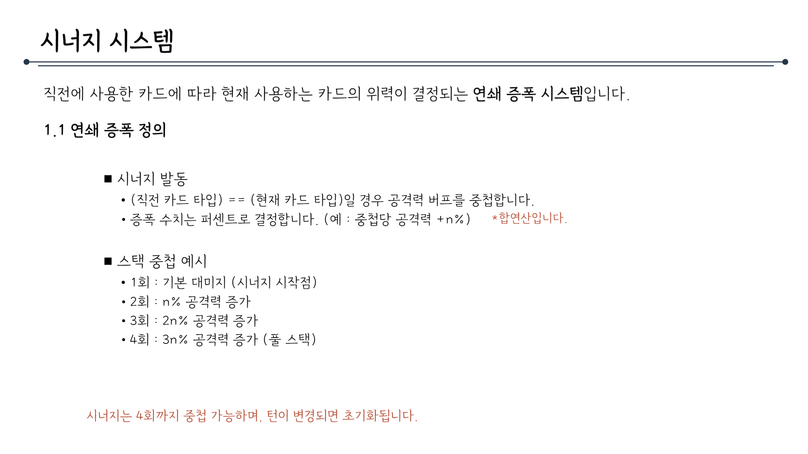
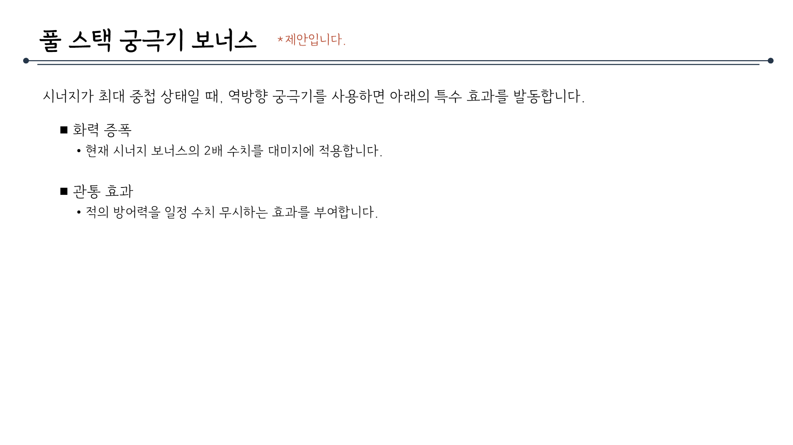

# 시너지시스템_V2_김주연

## 슬라이드 1

> 이 이미지에는 게임 기획 문서의 일부로 보이는 제목이 포함되어 있습니다.

가로로 긴 직사각형 모양의 흰색 배경에 검은색의 한글 텍스트가 포함되어 있습니다.

텍스트는 두 줄로 작성되어 있으며, 첫 번째 줄에는 큰 글씨로 **"시스템기획서"**가 적혀 있고, 두 번째 줄에는 조금 더 작은 글씨로 **"시너지 시스템"**이라고 적혀 있습니다.

이미지에는 아이콘, 캐릭터, 그래프, 표, UI 요소 등이 포함되어 있지 않습니다.

---

## 슬라이드 2

> 해당 이미지는 게임 기획 문서의 일부로, 목차를 정리한 것으로 보입니다. 

*   화면 상단 좌측에는 '목차'라는 타이틀 텍스트가 있고, 우측에는 긴 가로선이 있습니다. 
*   '목차' 타이틀과 가로선은 동일한 레벨에 위치해 있습니다. 
*   목차는 총 2개의 항목으로 구성되어 있습니다. 
*   1번 항목은 '시너지 시스템'으로, 하위 항목으로 1.1, 1.2, 1.3이 있습니다. 
*   1.1은 '연쇄 증폭 (시너지 시스템) 정의', 1.2는 '카드 분류', 1.3은 '스택 관리 규칙'입니다. 
*   2번 항목은 '풀스택 궁극기 보너스 (제안)'입니다. 
*   배경은 흰색이며, 검은색 텍스트가 포함되어 있습니다. 
*   폰트는 고딕체로 추정되며, 크기나 굵기는 동일합니다.

---

## 슬라이드 3

> ## 이미지의 텍스트 설명

이미지에는 게임 기획 문서의 일부로 보이는 '시너지 시스템'이라는 제목의 섹션이 포함되어 있습니다. 

### 제목
- **시너지 시스템**: 이 제목은 게임 내의 새로운 시스템 또는 메커니즘을 소개하는 헤딩으로, **굵은 글씨**로 표시되어 있습니다.

### 부제목
- 직전에 사용한 카드에 따라 현재 사용하는 카드의 위력이 결정되는 연쇄 증폭 시스템입니다.

### 1.1 연쇄 증폭 정의
- 이 부분은 **1.1 연쇄 증폭 정의**라는 소제목으로, 시너지 시스템의 구체적인 작동 원리를 설명합니다.

### 목록
- 시너지 발동
  - (직전 카드 타입) == (현재 카드 타입)일 경우 공격력 버프를 중첩합니다.
  - 증폭 수치는 퍼센트로 결정합니다. (예: 증폭당 공격력 +n%) *합연산입니다.

- 스택 중첩 예시
  - 1회: 기본 대미지 (시너지 시작점)
  - 2회: n% 공격력 증가
  - 3회: 2n% 공격력 증가
  - 4회: 3n% 공격력 증가 (풀 스택)

### 추가 정보
- 시너지는 4회까지 중첩 가능하며, 턴이 변경되면 초기화됩니다.

### 레이아웃 및 구조
- **제목**: 화면 상단에 **'시너지 시스템'**이라는 제목이 중앙에 위치해 있습니다.
- **내용**: 제목 아래에 **간단한 설명 문장**이 있으며, **1.1 연쇄 증폭 정의**라는 소제목이 포함된 **두 개의 목록**이 있습니다.
  - 첫 번째 목록은 **'시너지 발동'**에 대한 조건과 규칙을 설명합니다.
  - 두 번째 목록은 **'스택 중첩 예시'**로, 시너지가 어떻게 중첩되는지 구체적인 수치를 들어 설명합니다.
- **추가 정보**: 페이지 하단에는 **시너지의 중첩 한계와 턴 변경 시 초기화되는 규칙**에 대한 **빨간색** 강조 문구가 있습니다.

### 시각적 요소
- **아이콘**: 이미지에는 별다른 **아이콘**이나 **그래픽 요소**는 포함되어 있지 않습니다.
- **색상**: 
  - 기본 텍스트는 **검은색**으로 작성되어 있습니다.
  - 강조 설명 부분은 **빨간색**으로 표시되어 있습니다.
- **레이아웃**: 
  - 내용은 **왼쪽 정렬**로 배치되어 있으며, 
  - **글씨 크기**는 제목과 내용에 따라 **다양한 크기**로 구분됩니다.

---

## 슬라이드 4

> 해당 이미지는 게임 기획 문서의 일부로, "시너지 시스템"에 대한 설명입니다. 

## 레이아웃 및 구조

이미지는 다음과 같은 레이아웃 및 구조로 구성되어 있습니다.

*   **제목 영역**: 
    *   페이지 상단 중앙에 **'시너지 시스템'**이라는 타이틀과 함께 꾸밈선이 위치해 있습니다. 
*   **본문 영역**: 
    *   왼쪽 정렬되어 있으며, 1.2, 1.3과 같은 항목과 하위 문단으로 구성되어 있습니다.

## 상세한 텍스트 설명

이미지에는 다음과 같은 텍스트가 포함되어 있습니다.

*   **타이틀**: 시너지 시스템
*   **1.2 카드 분류**:
    *   정방향 마이너 카드
    *   정방향 메이저 카드
    *   역방향 메이저 카드 (궁극기)
*   **1.3 스택 관리 규칙**:
    *   시너지 유지
        *   동일 타입의 카드, 혹은 특수 카드를 연속 사용할 시 유효합니다.
        *   특수카드는 직전 카드의 타입 상관 없이 시너지 효과를 받습니다.
    *   시너지 초기화
        *   타입 불일치: 정방향 마이너 카드 시너지 도중 정방향 메이저 카드를 사용 시 스택을 초기화합니다.
        *   궁극기 사용: 궁극기 사용 시 중첩된 모든 시너지를 보너스로 사용 후 초기화합니다. \*뒷장 궁극기 제안 참조
        *   턴 종료: 자신의 턴이 종료되면 모든 스택이 소멸됩니다.

## 다이어그램 및 UI 요소

이미지에는 텍스트 외에 다른 시각적 요소가 포함되어 있지 않습니다.

---

## 슬라이드 5

> 이미지는 게임 기획 문서의 일부로, **풀 스택 궁극기 보너스**라는 제목의 섹션을 보여 주고 있습니다. 문서의 구조와 내용을 상세하게 설명해 드리겠습니다.

### **문서의 구조**
- **제목**:  
  - "풀 스택 궁극기 보너스"라는 큰 제목이 중앙에 위치해 있습니다.  
  - 제목 오른쪽에는 **`*제안입니다.`**라는 작은 글씨가 빨간색으로 표시되어 있습니다.  
- **수평 라인**:  
  - 제목 아래에 길게 수평선이 그어져 있습니다. 이 라인의 왼쪽과 오른쪽에는 작은 검은 점이 있습니다.  
- **본문**:  
  - 제목과 수평 라인 아래에 설명 문단이 있습니다.

### **내용 설명**
1. **설명 문단**:  
   - "시너지가 최대 중첩 상태일 때, 역방향 궁극기를 사용하면 아래의 특수 효과를 발동합니다."  
   - 이 문단은 시너지가 최대치일 때 궁극기를 사용하면 발생하는 효과에 대해 설명하고 있습니다.

2. **효과 목록**:  
   - 두 가지 효과가 **검은 사각형 점**과 함께 나열되어 있습니다.  
   - **화력 증폭**:  
     - "현재 시너지 보너스의 2배 수치를 대미지에 적용합니다."  
     - 시너지 보너스가 화력에 2배로 적용된다는 내용입니다.  
   - **관통 효과**:  
     - "적의 방어력을 일정 수치 무시하는 효과를 부여합니다."  
     - 적이 가진 방어력을 일정 부분 무시하는 효과가 있다는 설명입니다.

### **시각적 레이아웃**
- 배경은 **흰색**입니다.  
- 모든 텍스트는 **검은색**이며, 강조하는 부분(*제안입니다.)만 **빨간색**으로 표시되어 있습니다.  
- 레이아웃은 깔끔하고 간결하며, 게임의 밸런스나 플레이 메커니즘과 관련된 중요한 정보가 포함된 기획 문서임을 알 수 있습니다.

이 문서에서는 특정 조건에서 궁극기를 사용할 때 발생하는 두 가지 효과, 즉 **화력 증폭**과 **관통 효과**에 대해 설명하고 있습니다.

---
