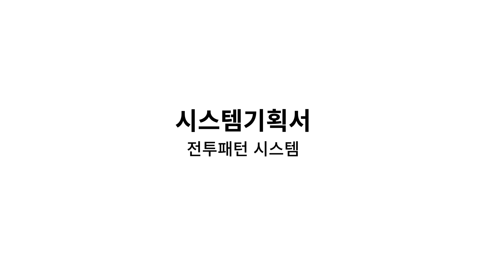
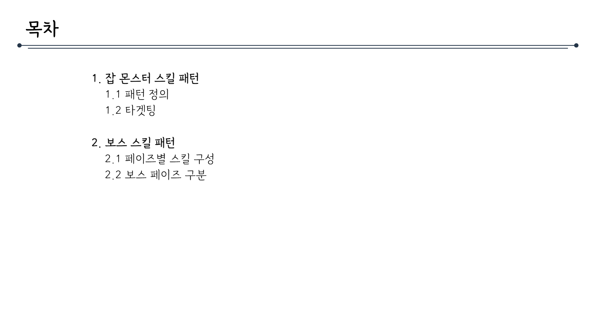
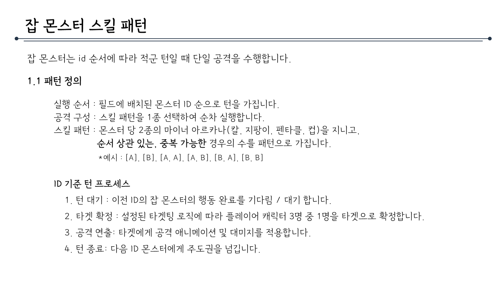
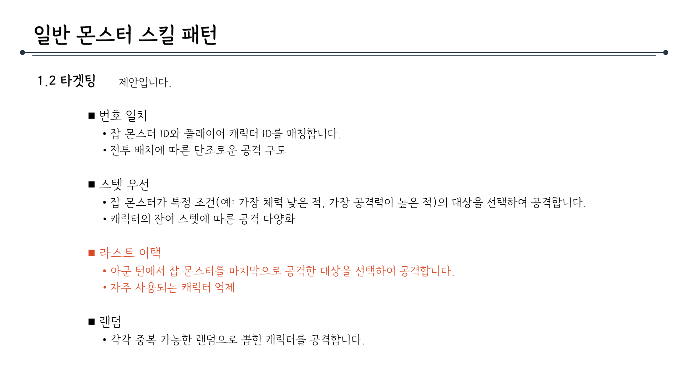
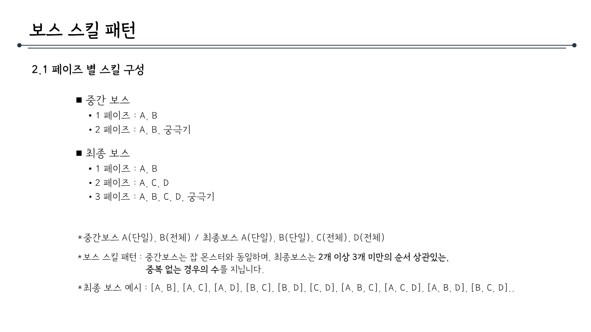
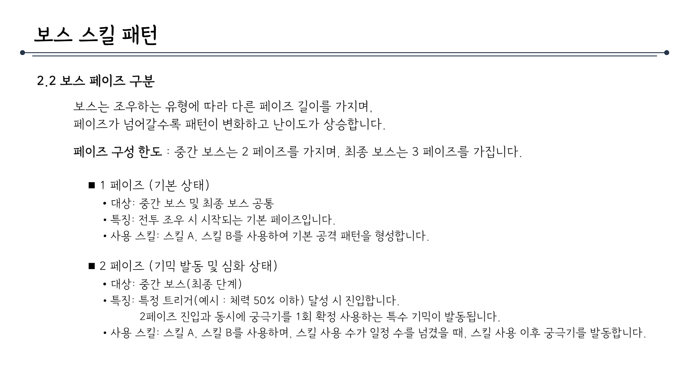
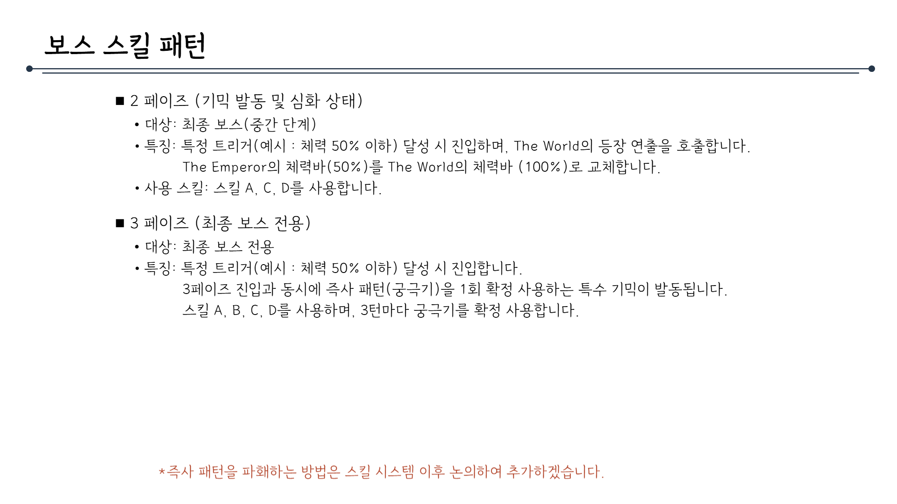

# 전투패턴시스템_V3_김주연

## 슬라이드 1

> 이 이미지에는 게임 기획 문서의 일부로 보이는 텍스트가 포함되어 있습니다. 이미지의 중심에 큰 글씨로 **"시스템기획서"** 라고 적혀있고, 그 아래에 작은 글씨로 **"전투패턴 시스템"**이라고 적혀 있습니다. 

이미지의 배경은 흰색이며, 검은색의 동일한 폰트로 작성되어 있습니다. 

이 외에는 이미지 내에 다른 시각적 레이아웃, 구조, 다이어그램, UI 요소, 캐릭터, 아이콘 등은 포함되어 있지 않습니다.

---

## 슬라이드 2

---

## 슬라이드 3

> 이미지는 게임 기획 문서의 일부로 보이는 목차 페이지입니다. 페이지의 구조와 내용을 상세히 설명해 드리겠습니다.

### 레이아웃
- **제목**: 페이지 상단 왼쪽에 **"목차"**라는 제목이 있습니다.
- **디자인 요소**: 제목 아래에 긴 가로선이 있으며, 선의 양쪽 끝에는 작은 점이 있습니다. 이는 페이지의 레이아웃을 강조하기 위한 디자인 요소로 보입니다.

### 목차 내용
목차는 크게 두 가지 주제로 나누어져 있습니다.

#### 1. 잡 몬스터 스킬 패턴
- **1.1 패턴 정의**: 잡 몬스터의 스킬 패턴에 대한 정의를 설명하는 부분입니다.
- **1.2 타게팅**: 잡 몬스터가 플레이어를 대상으로 삼는 방식(타게팅)에 대한 설명이 포함됩니다.

#### 2. 보스 스킬 패턴
- **2.1 페이즈별 스킬 구성**: 보스의 스킬이 여러 페이즈로 나누어져 있으며, 각 페이즈에서 사용하는 스킬에 대한 구성을 설명합니다.
- **2.2 보스 페이즈 구분**: 보스의 전투 페이즈를 어떻게 구분할 것인지에 대한 설명이 포함됩니다.

### 텍스트 및 시각적 요소
- **텍스트**: 모든 텍스트는 한국어입니다.
- **폰트**: 동일한 폰트와 크기, 스타일로 작성되어 있어 통일감이 있습니다.
- **구조**: 각 항목은 숫자와 점으로 구분되어 있어 깔끔하고 체계적인 구조를 보여줍니다.

이 목차는 게임의 몬스터와 보스의 스킬 패턴에 대한 체계적인 정리를 목적으로 하며, 게임 개발 과정에서 중요한 참고 자료로 사용될 것으로 보입니다.

---

## 슬라이드 4

> 해당 문서의 제목은 **잡 몬스터 스킬 패턴**이며, 게임 내 잡 몬스터의 공격 패턴에 대해 설명하고 있습니다.

문서의 레이아웃은 다음과 같습니다.

*   문서의 상단에는 **잡 몬스터 스킬 패턴**이라는 타이틀과 설명이 있습니다.
*   타이틀 밑에는 **1.1 패턴 정의**라는 소제목과 설명이 있습니다.
*   **1.1 패턴 정의** 밑에는 **실행 순서**, **공격 구성**, **스킬 패턴**에 대한 설명과 예시가 있습니다.
*   **1.1 패턴 정의** 다음에는 **ID 기준 턴 프로세스**라는 소제목과 4개의 항목에 대한 설명이 있습니다.

문서의 내용을 상세하게 설명하면 다음과 같습니다.

*   잡 몬스터는 ID 순서에 따라 공격 턴일 때 단일 공격을 수행합니다.
*   패턴 정의는 다음과 같습니다.
    *   실행 순서: 필드에 배치된 몬스터 ID 순으로 턴을 가집니다.
    *   공격 구성: 스킬 패턴을 1종 선택하여 순차 실행합니다.
    *   스킬 패턴: 몬스터 당 2종의 마이너 아르카나(칼, 지팡이, 팬타클, 컵)를 지니고, 순서 상관 있는, 중복 가능한 경우의 수를 패턴으로 가집니다.
    *   예시: \[A], \[B], \[A, A], \[A, B], \[B, A], \[B, B]
*   ID 기준 턴 프로세스는 다음과 같습니다.
    1.  턴 대기: 이전 ID의 잡 몬스터가 해도 완료를 기다림 / 대기함
    2.  타겟 확정: 설정된 타게팅 로직에 따라 플레이어 캐릭터 3명 중 1명을 타겟으로 확정함
    3.  공격 연출: 타겟에게 공격 애니메이션 및 대미지를 적용함
    4.  턴 종료: 다음 ID 몬스터에게 주도권을 넘김

---

## 슬라이드 5

> 해당 이미지는 게임 기획 문서의 일부로, '일반 몬스터 스킬 패턴'이라는 제목의 파트 중 '1.2 타게팅' 파트에 대한 설명입니다.

*   제목: 일반 몬스터 스킬 패턴

    *   가로로 긴 긴 선이 타이틀 위 아래로 각각 위치해 있습니다. 
    *   제목의 폰트는 검은색, 고딕체, 16포인트 크기입니다.
*   1.2 타게팅: 재안입니다.

    *   왼쪽 정렬로 되어있습니다. 
    *   검은색, 고딕체, 12포인트 크기입니다.
*   1.2 타게팅 파트에서는 총 4가지의 패턴에 대해서 설명하고 있습니다. 
    *   번호 일치
        *   검은색 네모로 된 글머리입니다.
        *   잡 몬스터 ID와 플레이어 캐릭터 ID를 매칭합니다. 
        *   전투 배치에 따른 단조로운 공격 구조 
    *   스텟 우선 
        *   검은색 네모로 된 글머리입니다.
        *   잡 몬스터가 특정 조건(예: 가장 체력 낮은 적, 가장 공격력이 높은 적)의 대상을 선택하여 공격합니다. 
        *   캐릭터의 잔여 스텟에 따른 공격 다양화 
    *   라스트 어택 
        *   주황색 네모로 된 글머리입니다.
        *   아군 턴에서 잡 몬스터를 마지막으로 공격한 대상을 선택하여 공격합니다. 
        *   자주 사용되는 캐릭터 억제 
    *   랜덤 
        *   검은색 네모로 된 글머리입니다.
        *   각각 중복 가능한 랜덤으로 뽑힌 캐릭터를 공격합니다.

---

## 슬라이드 6

> ## 문서 레이아웃 및 구조

- **제목**: 문서의 제목은 **"보스 스킬 패턴"**으로, 중앙에 위치해 있습니다.

- **분할선**: 제목 아래에 긴 분할선이 그어져 있습니다.

- **문서 구조**: 
  - **2.1 페이즈별 스킬 구성**: 
    - 중간의 보스 정보
    - 최종 보스 정보
  - **스킬 패턴 설명**: 
    - 중간 보스와 최종 보스의 스킬 패턴에 대한 설명
  - **최종 보스 예시**: 
    - 최종 보스의 스킬 조합 예시

## 텍스트 설명

- **제목**: 보스 스킬 패턴

- **2.1 페이즈별 스킬 구성**:
  - **중간 보스**:
    - 1 페이즈: A, B
    - 2 페이즈: A, B, 궁극기
  - **최종 보스**:
    - 1 페이즈: A, B
    - 2 페이즈: A, C, D
    - 3 페이즈: A, B, C, D, 궁극기

- **스킬 패턴 설명**:
  - 중간 보스: A(단일), B(전체) / 최종 보스 A(단일), B(단일), C(전체), D(전체)
  - 보스 스킬 패턴: 중간 보스는 잡 몬스터와 동일하며, 최종 보스는 2개 이상 3개 미만의 순서 상관있는, 중복 없는 경우의 수를 적용합니다.

- **최종 보스 예시**: 
  - [A, B], [A, C], [A, D], [B, C], [B, D], [C, D], [A, B, C], [A, C, D], [A, B, D], [B, C, D]

---

## 슬라이드 7

> ## 문서 레이아웃

*   이 문서는 한국어로 작성된 게임 기획 문서입니다.
*   문서의 제목은 **"보스 스킬 패턴"**이며, **2.2 보스 페이즈 구분**에 대한 설명입니다.
*   문서의 구조는 다음과 같습니다.
    *   **제목**: "보스 스킬 패턴"이라는 제목이 중앙에 위치하며, 밑줄이 그어져 있습니다.
    *   **부제목**: "2.2 보스 페이즈 구분"이라는 부제목이 있습니다.
    *   **설명**: 보스는 조우하는 유형에 따라 다른 페이즈 길이를 가지며, 페이즈가 넘어갈수록 패턴이 변화하고 난이도가 상승합니다.
    *   **페이즈 구성 한도**: 중간 보스는 2페이즈를 가지며, 최종 보스는 3페이즈를 가집니다.
    *   **페이즈별 설명**: 1페이즈와 2페이즈에 대한 설명이 있습니다.

## 페이즈 구성

*   **1페이즈 (기본 상태)**
    *   대상: 중간 보스 및 최종 보스 공통
    *   특징: 전투 조우 시 시작되는 기본 페이즈입니다.
    *   사용 스킬: 스킬 A, 스킬 B를 사용하여 기본 공격 패턴을 형성합니다.
*   **2페이즈 (기믹 발동 및 심화 상태)**
    *   대상: 중간 보스(최종 단계)
    *   특징: 특정 트리거(예시: 체력 50% 이하) 달성 시 진입합니다. 2페이즈 진입과 동시에 궁극기를 1회 확정 사용하는 특수 기믹이 발동됩니다.
    *   사용 스킬: 스킬 A, 스킬 B를 사용하며, 스킬 사용 수가 일정 수를 넘겼을 때, 스킬 사용 이후 궁극기를 발동합니다.

---

## 슬라이드 8

> 본문은 게임 기획 문서의 일부로, 보스 스킬 패턴에 대한 설명입니다.

## 레이아웃 및 구조

문서는 다음과 같은 레이아웃 및 구조로 구성되어 있습니다:

*   **제목**: 문서의 제목은 **"보스 스킬 패턴"**으로, 게임에서 보스의 스킬 사용 패턴에 대한 정보를 제공합니다.
*   **분할선**: 제목 아래에 긴 분할선이 있습니다. 이 분할선은 제목과 본문을 구분하는 역할을 합니다.
*   **본문**: 본문은 두 개의 주요 항목으로 구성되어 있습니다. 각각의 항목은 **2 페이즈 (기믹 발동 및 심화 상태)**와 **3 페이즈 (최종 보스 전용)**에 대한 설명입니다.

## 상세 설명

### 2 페이즈 (기믹 발동 및 심화 상태)

*   대상: 최종 보스 (중간 단계)
*   특징: 특정 트리거 (예시: 체력 50% 이하) 달성 시 진입하며, The World의 등장 연출을 호출합니다. 
*   The Emperor의 체력바 (50%)를 The World의 체력바 (100%)로 교체합니다.
*   사용 스킬: 스킬 A, C, D를 사용합니다.

### 3 페이즈 (최종 보스 전용)

*   대상: 최종 보스 전용
*   특징: 특정 트리거 (예시: 체력 50% 이하) 달성 시 진입합니다. 
*   3페이즈 진입과 동시에 즉사 패턴 (궁극기)을 1회 확정 사용하는 특수 기믹이 발동됩니다. 
*   스킬 A, B, C, D를 사용하며, 3턴마다 궁극기를 확정 사용합니다.

### 추가 정보

*   **즉사 패턴을 파훼하는 방법**은 스킬 시스템 이후 논의하여 추가하겠습니다.

## 텍스트 이외의 요소

*   **아이콘**: 문서에는 아이콘은 없습니다.
*   **다이어그램**: 문서에는 다이어그램이 없습니다.
*   **UI 요소**: 문서에는 UI 요소가 없습니다.
*   **캐릭터**: 문서에는 캐릭터가 묘사되어 있지 않습니다.

본 문서의 레이아웃은 간결하고 명확하며, 게임 개발을 위한 체계적인 정보 제공을 목적으로 합니다.

---
