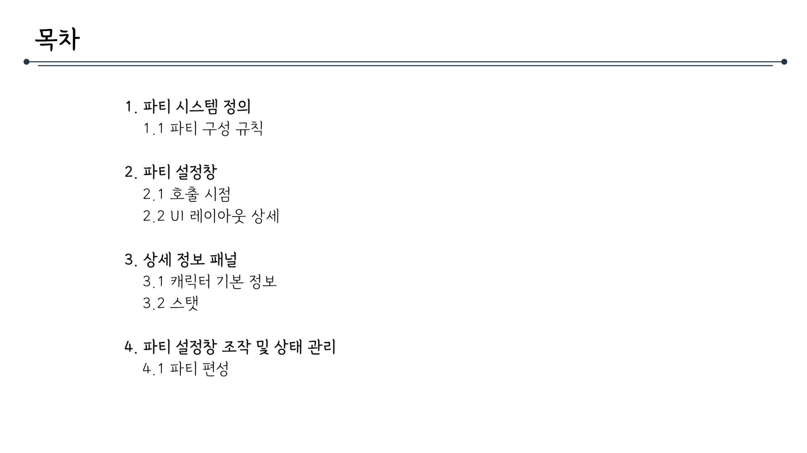
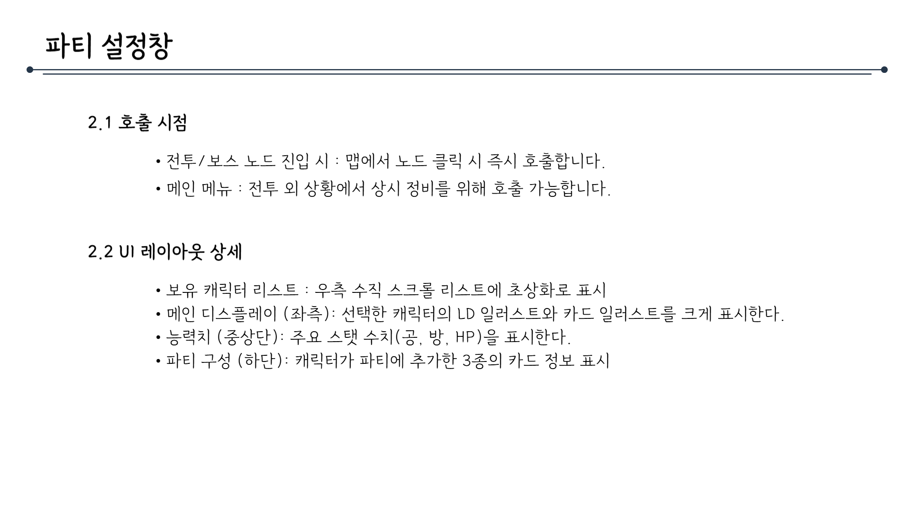
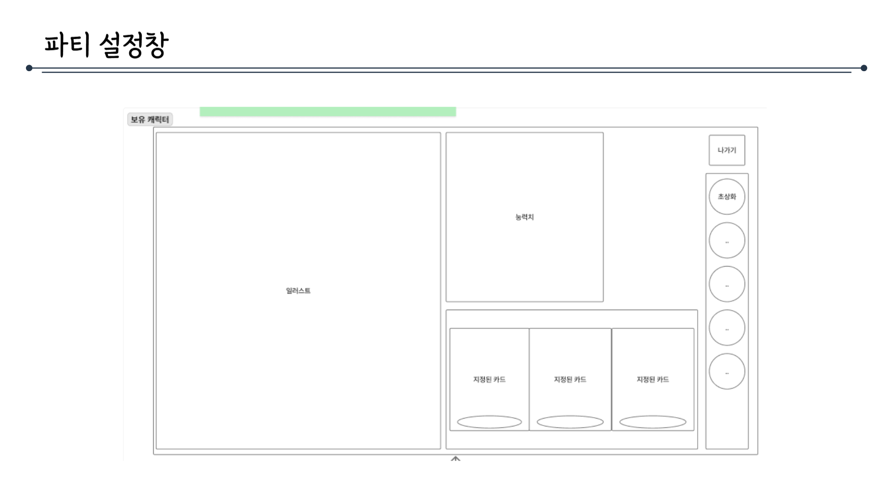
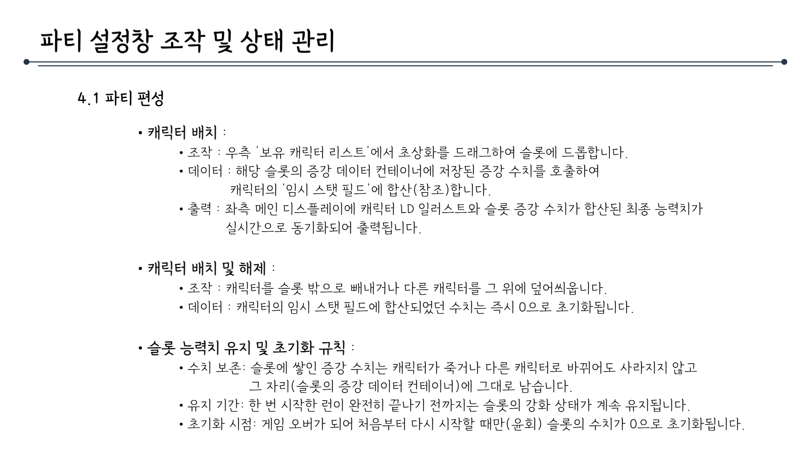

# 파티시스템_V2_김주연

## 슬라이드 1

> 이미지는 게임 기획 문서의 일부로, "시스템 기획서"와 "파티 시스템"이라는 제목이 포함된 텍스트로 구성되어 있습니다.

*   **텍스트**: 이미지 중앙에 **검은색** 글씨로 "시스템 기획서"와 "파티 시스템"이라는 문구가 있습니다. 
*   **레이아웃 및 구조**: 
    *   텍스트는 두 줄로 구성되어 있으며, 첫 번째 줄에는 "시스템 기획서"가 있고 두 번째 줄에는 "파티 시스템"이 있습니다.
    *   글씨 크기: "시스템 기획서"가 "파티 시스템"보다 큽니다. 
    *   텍스트는 이미지의 중앙에 위치해 있습니다. 
    *   배경은 **하얀색**입니다.

---

## 슬라이드 2

> 이미지는 게임 기획 문서의 일부로 보이는 목차 페이지입니다. 페이지의 레이아웃과 구조를 설명하고, 포함된 텍스트를 그대로 옮겨 적겠습니다.

### 레이아웃 및 구조 설명

*   페이지 상단 왼쪽에 **목차**라는 제목이 있습니다.
*   제목 아래에 긴 가로선이 있으며, 선의 왼쪽과 오른쪽 끝에 작은 원이 있습니다.
*   목차는 총 4개의 항목으로 구성되어 있습니다.
*   각 항목은 번호와 제목으로 구성되어 있으며, 하위 항목이 있는 경우 항목 번호와 제목이 들여쓰기로 구분됩니다.

### 포함된 텍스트

*   **목차**
*   1.  파티 시스템 정의  
    1.1 파티 구성 규칙
*   2.  파티 설정창  
    2.1 호출 시점  
    2.2 UI 레이아웃 상세
*   3.  상세 정보 패널  
    3.1 캐릭터 기본 정보  
    3.2 스탯
*   4.  파티 설정창 조작 및 상태 관리  
    4.1 파티 편성

---

## 슬라이드 3

> 이 문서는 게임의 '파티 시스템 정의'에 관한 설명입니다. 파티 시스템은 플레이어가 스테이지를 진행하며 획득한 캐릭터 중 전투에 출전할 최종 엔트리를 구성하고 관리하는 시스템입니다.

문서의 레이아웃은 다음과 같습니다.

*   제목: **파티 시스템 정의** 
*   제목 아래에 긴 가로선이 있습니다.
*   본문은 두 문단으로 구성되어 있습니다.
*   첫 문단은 파티 시스템에 대한 간략한 설명입니다.
*   두 번째 문단은 **1.1 파티 구성 규칙**이라는 문단으로, 파티 구성에 관한 규칙을 나열한 것입니다.

두 번째 문단의 내용은 다음과 같습니다.

*   **최대 인원**: 한 파티는 최대 3종의 캐릭터로 구성됩니다.
*   **출전 필수 조건**: 최소 1명 이상의 캐릭터가 편성되어야 전투 노드 진입이 가능합니다.
*   **슬롯 기반 편성**: 파티는 총 3개의 독립된 슬롯으로 구성됩니다.
*   **캐릭터 중복 제한**: 하나의 파티 내에서 동일한 캐릭터 카드를 중복하여 배치할 수 없습니다.
*   **증강 데이터의 귀속**: 획득한 증강 수치는 캐릭터가 아닌 해당 슬롯에 영구 귀속됩니다.

이 규칙들은 플레이어가 파티를 구성하고 관리하는 데 중요한 지침을 제공합니다.

---

## 슬라이드 4

> 이 문서는 게임의 **파티 설정창**에 대한 설명입니다.

문서의 레이아웃은 다음과 같습니다.

*   문서의 상단에는 **파티 설정창**이라는 타이틀과 긴 밑줄이 있습니다.
*   왼쪽에 점을 기준으로 두 문단이 작성되어 있습니다.
*   첫 문단에는 **2.1 호출 시점**이라는 소제목이 있고, 2개의 항목이 있습니다.
*   두 번째 문단에는 **2.2 UI 레이아웃 상세**라는 소제목이 있고, 4개의 항목이 있습니다.

문서의 내용은 다음과 같습니다.

### 2.1 호출 시점

*   전투/보스 노드 진입 시: 맵에서 노드를 클릭하면 즉시 호출됩니다.
*   메인 메뉴: 전투 외 상황에서 상시 정비를 위해 호출 가능합니다.

### 2.2 UI 레이아웃 상세

*   보유 캐릭터 리스트: 우측 수직 스크롤 리스트에 초상화로 표시됩니다.
*   메인 디스플레이(좌측): 선택한 캐릭터의 LD 일러스트와 카드 일러스트가 크게 표시됩니다.
*   능력치(중상단): 주요 스탯 수치(공, 방, HP)를 표시합니다.
*   파티 구성(하단): 캐릭터가 파티에 추가할 3종의 카드 정보가 표시됩니다.

---

## 슬라이드 5

> 이미지는 게임의 '파티 설정창' 기획 문서의 일부입니다. 

### 레이아웃 및 구조

- **타이틀**: 
  - 화면 상단에는 "파티 설정창"이라는 타이틀이 있습니다.

- **탭**: 
  - 화면 상단에는 탭 형태의 메뉴가 있으며, "보유 캐릭터" 탭이 선택된 상태입니다.

- **메인 영역**: 
  - 큰 프레임 안에 여러 섹션이 포함되어 있습니다.
  - 왼쪽 큰 영역에는 "일러스트"가 표시될 예정입니다.
  - 오른쪽 상단에는 "농력치"라는 레이블이 붙은 영역이 있습니다.

- **하단 영역**: 
  - 세로로 긴 버튼들이 오른쪽에 나열되어 있습니다. 버튼 안에는 미묘한 차이가 있지만, 구체적인 내용은 알 수 없습니다.

- **카드 영역**: 
  - 하단에는 3개의 작은 카드 영역이 있으며, 각 카드 영역에는 "지정된 카드"라는 레이블이 붙어 있습니다.

- **버튼**: 
  - 화면 오른쪽에는 여러 개의 버튼이 세로로 나열되어 있습니다. 버튼의 내용은 구체적으로 알 수 없지만, 각 버튼은 동그란 모양입니다.

- **상호 작용 요소**: 
  - "나가기"와 "초상화" 버튼이 오른쪽 상단에 있습니다.

### 텍스트 내용

- **타이틀**: 파티 설정창
- **탭**: 보유 캐릭터
- **레이블**:
  - 일러스트
  - 농력치
  - 지정된 카드 (총 3회)
- **버튼**:
  - 나가기
  - 초상화

### 요약

이 화면은 게임의 파티를 설정하는 창입니다. 플레이어는 보유한 캐릭터를 선택하고, 각 캐릭터의 농력치를 확인하며, 지정된 카드를 설정할 수 있습니다. 화면 오른쪽의 버튼들은 추가적인 상호 작용을 위한 것으로 추정됩니다.

---

## 슬라이드 6

> 이미지는 게임의 상세 정보 패널에 대한 설명입니다. 

## 레이아웃 및 구조

이미지는 다음과 같은 레이아웃 및 구조로 구성되어 있습니다.

*   제목: "상세 정보 패널" 
*   가로로 긴 검은 점이 있는 선
*   본문: 
    *   첫 문단: "파티 설정창의 캐릭터 리스트에서 특정 캐릭터를 클릭했을 때 좌측에 출력되는 정보이다."
    *   3.1 캐릭터 기본 정보 
        *   이름: 캐릭터의 명칭 (예시: Wheel of Fortune)
        *   역할군 (포지션): 딜, 힐 등 사용 가능한 포지션 텍스트 표시
        *   비주얼: 카드 및 LD 일러스트
        *   추가 스토리: 캐릭터의 배경 설정 및 보스 진행 후 추가 텍스트 표시
    *   3.2 스탯 
        *   기본 능력치: 캐릭터 카드가 가진 고유 스탯입니다.
        *   최종 능력치: 기본 능력치 + 슬롯 증가 수치로 계산됩니다.
            *   예외처리: 캐릭터가 어느 파티 슬롯에도 배치되지 않은 상태(대기 상태)일 경우, 적용되는 슬롯 증가 수치는 0으로 처리됩니다.
        *   시각적 구분: 슬롯에 배치된 상태에서는 증가된 수치만큼 강조 색상(예: 빨강)으로 슬롯 증가 수치가 표기됩니다. (예) 공격력 35 +40 

## 텍스트

이미지의 텍스트를 다음과 같습니다.

*   상세 정보 패널 
*   파티 설정창의 캐릭터 리스트에서 특정 캐릭터를 클릭했을 때 좌측에 출력되는 정보이다.
*   3.1 캐릭터 기본 정보 
    *   이름: 캐릭터의 명칭 (예시: Wheel of Fortune)
    *   역할군 (포지션): 딜, 힐 등 사용 가능한 포지션 텍스트 표시
    *   비주얼: 카드 및 LD 일러스트
    *   추가 스토리: 캐릭터의 배경 설정 및 보스 진행 후 추가 텍스트 표시
*   3.2 스탯 
    *   기본 능력치: 캐릭터 카드가 가진 고유 스탯입니다.
    *   최종 능력치: 기본 능력치 + 슬롯 증가 수치로 계산됩니다.
        *   예외처리: 캐릭터가 어느 파티 슬롯에도 배치되지 않은 상태(대기 상태)일 경우, 적용되는 슬롯 증가 수치는 0으로 처리됩니다.
    *   시각적 구분: 슬롯에 배치된 상태에서는 증가된 수치만큼 강조 색상(예: 빨강)으로 슬롯 증가 수치가 표기됩니다. (예) 공격력 35 +40 

## 다이어그램 및 UI 요소

이미지에는 다이어그램 및 UI 요소가 포함되어 있지 않습니다.

## 캐릭터

이미지에는 캐릭터가 포함되어 있지 않습니다.

## 아이콘

이미지에는 아이콘이 포함되어 있지 않습니다.

---

## 슬라이드 7

> 이 문서는 게임 개발을 위한 기획 문서 중 일부로, **파티 설정창 조작 및 상태 관리**와 관련된 설명을 담고 있습니다. 문서의 레이아웃과 구조는 다음과 같습니다.

*   **제목**: 문서의 제목은 **파티 설정창 조작 및 상태 관리**이며, 제목 아래에 가는 선이 가로로 그어져 있습니다.
*   **버전 또는 섹션**: 문서의 왼쪽 상단에는 **4.1 파티 편성**이라는 텍스트가 있습니다. 이는 이 문서가 4.1 버전의 파티 편성 기능과 관련된 설명임을 나타냅니다.

문서의 주요 내용은 다음과 같습니다.

### 4.1 파티 편성

*   **캐릭터 배치**:
    *   조작: 우측의 **보유 캐릭터 리스트**에서 초상화를 드래그하여 슬롯에 드롭합니다.
    *   데이터: 슬롯의 증강 데이터 컨테이너에 저장된 증강 수치를 호출하여 캐릭터의 **임시 스탯 필드**에 합산(참조)합니다.
    *   출력: 좌측 메인 디스플레이에 캐릭터 LD 일러스트와 슬롯 증강 수치가 합산된 최종 능력치가 실시간으로 동기화되어 출력됩니다.
*   **캐릭터 배치 및 해제**:
    *   조작: 캐릭터를 슬롯 밖으로 빼내거나 다른 캐릭터를 그 위에 덮어씌웁니다.
    *   데이터: 캐릭터의 임시 스탯 필드에 합산되었던 수치는 즉시 0으로 초기화됩니다.
*   **슬롯 능력치 유지 및 초기화 규칙**:
    *   수치 보존: 슬롯에 쌓인 증강 수치는 캐릭터가 죽거나 다른 캐릭터로 바뀌어도 사라지지 않고 그 자리(슬롯의 증강 데이터 컨테이너)에 그대로 남습니다.
    *   유지 기간: 한 번 시작한 런이 완전히 끝나기 전까진 슬롯의 강화 상태가 계속 유지됩니다.
    *   초기화 시점: 게임 오버가 되어 처음부터 다시 시작할 때만(윤회) 슬롯의 수치가 0으로 초기화됩니다.

문서는 게임 내에서 파티를 설정하고 관리하는 방법에 대해 설명하고 있습니다. 여기에는 캐릭터를 배치하고, 배치된 캐릭터의 능력치를 출력하고, 캐릭터를 교체하거나 슬롯에서 해제하는 방법 등이 포함됩니다. 또한 슬롯에 쌓인 능력치의 유지 및 초기화 규칙에 대해서도 설명하고 있습니다.

---
