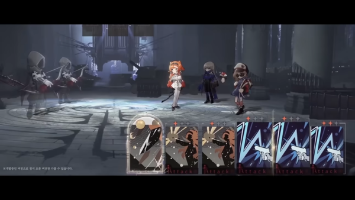
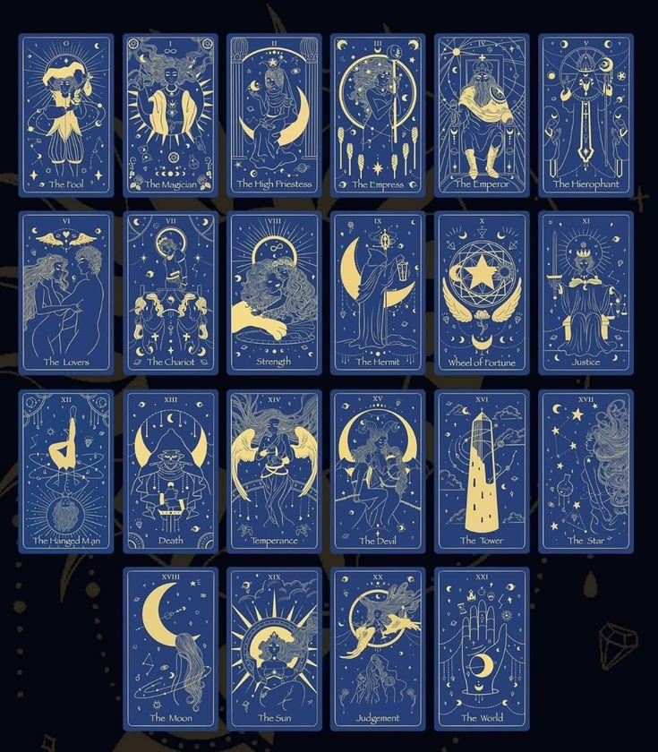
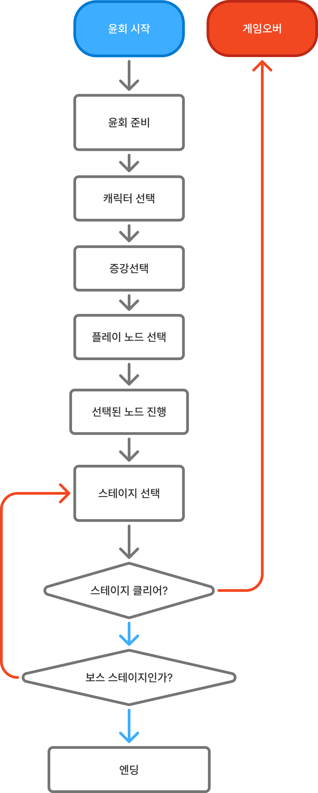

# 게임컨셉기획서_V0_장보성

## 슬라이드 1

게임컨셉기획서

Light life 202313190 장보성

---

## 슬라이드 2

**변경사항**

변경된 내용 정리

| 일시 | 작업자 | 변경 사항 |
| --- | --- | --- |
| 2026.02.11 | 장보성 | 컨셉기획서PPT버전으로 작성 |
|  |  |  |

---

## 슬라이드 3

**게임 개요**

### 아르카나

#### 로그라이트

#### 전략

#### 카드

#### 타로

#### 카드

#### 장르

#### 2D, 로그라이트

#### 턴제 전략 게임

#### 타겟층

#### 20~30대의 캐주얼 게이머

#### 목표를 클리어 할 때의 쾌감을 좋아하는 도전적인 플레이어

#### 플랫폼

#### PC

> 다음은 제공한 이미지에 대한 상세한 설명입니다.

이미지 중앙에는 게임 화면이 있습니다. 게임 화면에는 여러 캐릭터가 등장합니다.

*   게임 화면 중앙에는 주황색 머리를 가진 여성 캐릭터가 있고, 그 옆에는 회색 머리 여성 캐릭터와 검은 옷을 입은 캐릭터가 있습니다. 
*   이 캐릭터들은 모두 게임 속 캐릭터로 보입니다. 
*   화면 왼쪽에는 두 명의 캐릭터가 보입니다. 이 캐릭터들은 가면을 쓴 것 같은 모습이며, 무기를 들고 있는 것으로 보입니다. 
*   이 캐릭터들은 적으로 추정됩니다.

화면 하단에는 4개의 작은 화면이 있습니다. 

*   이 화면들은 각각 다른 캐릭터의 공격 모션을 보여 주는 애니메이션입니다. 
*   각 화면의 하단에는 "Attack"이라는 텍스트가 있습니다. 
*   각 화면의 상단에는 작은 빨간색 점이 있습니다.

화면 왼쪽 하단에는 작은 텍스트가 있습니다.

*   텍스트는 한국어이며, 내용은 "공격 애니메이션"으로 추정됩니다.

전체적으로 이 이미지는 게임의 전투 장면을 보여 주는 것으로 보입니다.

> 이미지는 게임 '다크에스트 던전'의 스크린샷입니다. 

### 이미지 설명

* 화면 상단에는 일러스트가 있습니다. 
  * 게임 캐릭터와 몬스터가 그려져 있습니다. 
  * 캐릭터는 총 6명이며, 각기 다른 모습과 무기를 가지고 있습니다. 
  * 캐릭터의 모습은 다음과 같습니다.
    * (왼쪽부터) 터번을 머리에 두른 캐릭터가 창을 들고 있습니다. 
    * 다음 캐릭터는 긴 머리를 가지고 있고, 모자를 쓴 후 손에 단검을 들고 있습니다. 
    * 다음 캐릭터는 온몸에 갑옷을 입고 있으며, 손에는 큰 도끼를 들고 있습니다. 
    * 다음 캐릭터는 가죽 갑옷을 입고 있으며, 손에는 단검을 들고 있습니다. 
    * 큰 키의 몬스터가 맨몸으로 큰 무기를 들고 있습니다. 
    * 마지막 캐릭터는 가면과 갑옷을 입고 있으며, 손에는 창을 들고 있습니다. 
* 화면 하단에는 게임 UI가 있습니다. 
  * 캐릭터 정보 칸
    * 캐릭터 이름: Tarlof Bounty Hunter 
    * 캐릭터 모습: 남성의 모습으로, 온몸에 갑옷을 입고 있습니다. 
    * 체력: 25.0/25.0 
    * 스트레스: 48.8/100 
    * 캐릭터 능력치 
      * ACC: 80 
      * DMG: 6-11 
      * CRT: 17% 
      * DEF: 15 
      * PROT: 2 
      * SPD: 4 
    * 장비 칸 
      * (왼쪽 위) 도끼 
      * (오른쪽 위) 방패 
      * (왼쪽 아래) 
      * (오른쪽 아래) 
  * 스킬 카드 
    * 카드가 5개가 있으며, 각 카드에는 고유한 그림이 그려져 있습니다. 
    * 카드 번호는 왼쪽부터 1번부터 5번까지입니다. 
  * 지도 
    * 방을 이동할 수 있는 통로와 방이 표시되어 있습니다. 
    * 각 방에는 고유한 그림이 그려져 있습니다. 
    * 일부 방은 미지의 방으로 표시되어 있습니다. 
    * 현재 플레이어의 위치는 흰색 사각형으로 표시되어 있습니다.

> 해당 이미지는 타로카드 메이저 아르카나 22장 세트를 보여 주고 있습니다. 

블랙 배경에 금색 및 노란색으로 디자인된 타로 카드는 4행 7열로 구성되어 있습니다. 

각 카드의 하단에는 카드의 이름이 있고, 카드 안에는 일러스트와 카드 넘버가 있습니다. 

카드의 디자인은 일러스트와 카드를 둘러싼 테두리로 구성되어 있습니다.

테두리 안에는 카드의 넘버가 로마 숫자로 표기되어 있고, 일러스트는 노란색과 금색으로 그려져 있습니다. 일러스트 안에는 달, 별, 태양, 불, 물방울, 동물, 사람 등 여러가지 요소가 포함되어 있습니다.

카드의 이름은 다음과 같습니다.

1. The Fool
2. The Magician
3. The High Priestess
4. The Empress
5. The Emperor
6. The Hierophant
7. The Lovers
8. The Chariot
9. Strength
10. The Hermit
11. Wheel of Fortune
12. Justice
13. The Hanged Man
14. Death
15. Temperance
16. The Devil
17. The Tower
18. The Star
19. The Moon
20. The Sun
21. Judgement
22. The World

이러한 타로 카드 세트는 점술이나 운세 읽기에 사용되며, 각 카드는 고유한 의미와 해석을 가지고 있습니다.

---

## 슬라이드 4

**게임 개발 방향**

#### 빠른

#### 몰입

#### 전투

#### 전략

#### 스킬

#### 해석

패시브 키워드 등 전략적인 고려 요소 제공

빠르게 인상을 주기 위해 전투에 전략 요소 부여

스킬이 각 카드의 의미에 따라 어울려야 몰입도를 해치지 않음w

---

## 슬라이드 5

**핵심 재미요소**

#### 전략의 재미:

#### 플레이어가 빨리 게임에 몰입할 수 있도록 전투내에 전략을 중점

#### 전략의 재미

#### 전략의 재미:

#### 희귀 노드 등장보상에 랜덤성을 추가함

#### 예상치 못한 보상의 재미

#### 운적요소 포함으로 보상을 기대함

#### 전략의 재미:

#### 자신의 노드를 골라 피로도를 스스로 조절할 수 있도록

#### 선택의 재미

#### 전략의 재미:

#### 회귀를 통해 같은 적의 공략을 하거나기존 윤회의 능력치를 이전 받아 점점 강해짐

#### 회귀를 통한 강화

> 이미지는 검은색과 흰색으로 구성된 그래픽입니다. 

가장 중앙에는 하얀색 시침과 분침이 있는 검은색 원형 시계가 있습니다. 시계는 시침이 10시 방향, 분침이 12시 방향을 가리키고 있습니다. 시계의 오른쪽에는 빈 공간이 있고, 왼쪽에는 5개의 검은색 점이 수직으로 배치되어 있습니다. 

시계 중앙의 검은 원을 감싸는 큰 원이 하나 더 있습니다. 이 원은 일부분이 끊어져 있습니다. 끊어진 부분의 왼쪽 끝에는 검은색 화살표가 있습니다. 화살표는 시계 방향의 반대로 회전하는 방향을 나타내고 있습니다. 

전체적으로 이 그래픽은 시간과 반복되는 순환을 상징하는 듯한 인상을 줍니다.

> 이미지는 화살표와 기호가 포함된 단순한 다이어그램입니다.

*   이미지의 왼쪽 상단에는 **X** 표시가 있습니다.
*   왼쪽 하단에는 **O** 표시가 있습니다.
*   오른쪽 상단에는 **O** 표시가 있습니다.
*   오른쪽 하단에는 **X** 표시가 있습니다.
*   왼쪽 하단의 **O**에서 시작하여 오른쪽 상단의 **O**로 이어지는 화살표가 있습니다.

이러한 레이아웃과 기호는 일반적으로 게임이나 퍼즐, 혹은 전략을 설명하는 데 사용되는 것 같습니다.

> 이미지는 하나의 화살표가 중앙에서 갈라져 3개의 화살표로 분산되는 형태를 나타내고 있습니다.

구체적으로 설명하면, 하나의 아래쪽 화살표가 가운데에서 세 개로 갈라지며, 각각 다른 방향을 가리킵니다. 

*   가운데 화살표는 위쪽을 가리키고
*   왼쪽 화살표는 왼쪽을 가리키며
*   오른쪽 화살표는 오른쪽을 가리킵니다.

이러한 형태는 선택이나 결정, 다양한 방향이나 가능성을 상징하는 아이콘으로 자주 사용됩니다.

> 해당 이미지는 게임 기획 문서의 일부로 보이는 이미지입니다. 이미지에는 하얀색 배경에 검은색 주사위가 하나 그려져 있습니다.

주사위는 3D 형태로 그려져 있으며, 주사위의 각 면에는 하얀색으로 동그라미가 그려져 있습니다. 

주사위는 5개의 면이 보이는데, 보이는 면에는 다음과 같은 정보가 있습니다.

* 주사위 윗면에는 왼쪽 위, 오른쪽 위, 왼쪽 아래, 오른쪽 아래에 각각 점이 찍혀 있습니다. (총 4개의 점)
* 주사위 오른쪽 면에는 정중앙에 점이 찍혀 있습니다. (총 1개의 점)
* 주사위 앞면에는 왼쪽 위, 오른쪽 아래에 각각 점이 찍혀 있습니다. (총 2개의 점)

나머지 면은 보이지 않아서 확인할 수 없습니다.

주사위 모서리는 하얗게 강조되어 있습니다.

전체적으로 간결하고 심플한 디자인의 주사위 아이콘입니다.

---

## 슬라이드 6

**세계관**

**세계관 특징**

  - 운명의 교단이라는 종교 중심의 세계
  - 이들이 따르는 운명의 신은 모두에게 각자의 운명을 한 질서의 세계
**시놉시스**

  - 아르카나라는 운명의 신이 이 세상을 만들어냄
  - 모든 생명체는 자신만의 운명을 가지고 태어남
  - 운명을 지키려는 교단과 자유를 위해 운명을 거부하는 세력간의 혼란스러운 세계
#### 너무 고어, 인육 장기자랑 금지! 자세한 묘사는 금지!!!

#### 너무 가벼운 유치 찬란한 분위기 금지!!!

> 이미지는 게임 기획 문서의 일부로 보이는 일러스트입니다.

이미지 중앙에는 노란색과 갈색의 뿔이 달린 머리장식을 착용한 소녀가 그려져 있습니다. 소녀의 머리는 베이지색이며, 눈은 보라색입니다. 눈동자는 옅은 하늘색입니다. 눈꼬리가 올라가있어 귀엽고 발랄한 인상을 주고 있습니다. 입꼬리도 살짝 올라가있어 소녀가 웃고 있는 것처럼 보입니다. 볼에는 분홍색 블러시가 그려져 있습니다.

소녀의 머리 위로는 노란색 리본이 있고, 리본의 왼쪽에는 노란색과 갈색 뿔이 있습니다. 뿔의 왼쪽에는 노란색 깃털이 보입니다.

소녀의 왼쪽 귀는 보이지 않으며, 오른쪽 귀에는 노란색과 갈색 귀걸이를 착용하고 있습니다.

소녀의 목에는 노란색과 갈색의 목걸이를 착용하고 있습니다.

소녀의 상의는 하얀색이며, 그 위에 노란색 조끼를 입고 있습니다. 

배경은 하늘색입니다.

이미지 하단에는 텍스트가 포함되어 있지 않으며, 이미지 상단에도 텍스트가 포함되어 있지 않습니다.

이미지에는 UI 요소가 포함되어 있지 않습니다.

이미지에는 캐릭터가 1명이며, 아이콘은 포함되어 있지 않습니다.

이미지에는 빠짐없이 상세하게 설명하였습니다.

> 이미지는 게임 기획 문서의 일부로, 다채로운 캐릭터들이 등장하는 장면입니다. 이미지 중앙에는 긴 흑발을 가진 남성이 전면에 서 있습니다. 그는 짙은 회색 눈동자와 창백한 피부를 가지고 있으며, 가슴과 팔을 노출한 토플리스 차림을 하고 있습니다. 그의 옷은 짙은 색상의 가죽 흉갑을 입고 있으며, 허리춤에는 허리띠를 착용하고 있습니다.

흑발 남성의 뒤로는 다양한 캐릭터들이 배치되어 있습니다.

*   왼쪽 하단: 회색 머리와 수염을 가진 노인이 앉아 있습니다. 그는 파란색 옷을 입고 있으며, 왼손에 지팡이를 들고 있습니다.
*   왼쪽 상단: 남자가 양손으로 창을 잡고 있습니다. 그는 붉은 머리를 가지고 있으며, 가죽 갑옷과 헬멧을 착용하고 있습니다.
*   오른쪽 상단: 근육질의 남성이 계단 위에 서 있습니다. 그는 회색 수건을 머리에 두르고 있으며, 회색 천을 몸에 두르고 있습니다. 오른손에 창을 들고 있습니다.
*   오른쪽 하단: 짧은 금발을 가진 소녀가 무릎을 꿇고 앉아 있습니다. 그녀는 핑크색과 흰색 옷을 입고 있습니다.

중앙에 있는 흑발 남성의 가슴에는 붉은색의 타원형 UI 요소가 겹쳐져 있습니다. 이 요소에는 하얀색의 한국어가 적혀 있습니다. 구체적으로는 '안줄겁니다'라는 문구가 적혀 있습니다.

이미지의 배경은 돌로 만들어진 아치형의 통로입니다. 벽은 회색 돌로 구성되어 있으며, 바닥은 회색과 짙은 회색의 돌로 만들어진 무늬가 있습니다. 벽면에는 횃불이 걸려 있어 통로를 밝히고 있습니다. 배경의 벽면에는 사람의 해골이 그려져 있는 것을 확인할 수 있습니다.

전체적으로 이 이미지는 다크 판타지 세계관을 가진 게임의 한 장면을 묘사하고 있습니다.

---

## 슬라이드 7

**코어 루프**

**코어루프 설명**

**코어루프를 통한 전략적으로 성장은 전투의 전략과 맞물려 피로도가 너무 쌓이기에**

**코어루프에서는 증강이라는 보상과 비례해 적이 강해지는 성장을 한다.**

플레이어는 윤회를 시작하기 전 준비를 함

  - 증강 선택/캐릭터 선택등
플레이어는 자신이 이동할 노드를 선택함

  - 전투/보너스/보스/사건등
노드를 클리어하지 못하면 게임 오버

  - 다음 윤회를 위한 보상을 얻음
노드를 다 클리어 후 보스까지 클리어하면 엔딩

> 본문에서 제공한 이미지는 게임의 흐름을 나타내는 순서도입니다.

위 순서도는 게임의 시작부터 종료까지의 과정을 단계별로 나타내고 있습니다. 각 단계는 직사각형의 상자 안에 한글로 설명되어 있으며, 각 단계 사이의 흐름은 화살표로 연결되어 있습니다.

순서도의 상단에는 두 개의 원형 상자가 있습니다. 왼쪽은 파란색으로 "유희 시작"이라는 텍스트가 있고, 오른쪽은 빨간색으로 "게임오버"라는 텍스트가 있습니다.

파란색 원형 상자 아래에는 다음과 같은 직사각형 상자가 나열되어 있습니다.

1. **유희 준비**: 게임 준비 단계
2. **캐릭터 선택**: 플레이어가 사용할 캐릭터를 선택하는 단계
3. **증강 선택**: 캐릭터의 능력치나 아이템 등을 선택하는 단계
4. **플레이 노드 선택**: 플레이어가 진행할 노드를 선택하는 단계
5. **선택된 노드 진행**: 선택한 노드를 진행하는 단계
6. **스테이지 선택**: 플레이어가 진행할 스테이지를 선택하는 단계

위 단계들을 거쳐 스테이지 클리어 여부에 따라 두 가지로 나뉩니다.

* 스테이지를 클리어하면 직사각형 화살표로 표시된 질문인 보스 스테이지인가? 라는 판단을 합니다. 
* 이 질문에 대한 답이 예스라면 엔딩으로 진행하고, 노라면 빨간색 화살표를 따라 게임오버로 진행합니다.

스테이지 클리어에 실패할 경우 빨간색 화살표를 따라 게임오버로 진행합니다.

즉, 이 순서도는 게임의 시작부터 종료까지의 과정을 단계별로 나타내고 있으며, 각 단계 사이의 흐름을 화살표로 연결하여 보여 주고 있습니다.

---

## 슬라이드 8

**메타 루프**

**스테이지를 진행해나가며 중간 중간 지정된 보스전 준비함**

**중간에 게임 오버 시 윤회 스테이지로 처음 초기화됨**

**전 윤회에서 얻은 능력치의 일부 돌려받음**

#### 메타루프 완료까지 예상 플레이 타임

#### 최소 15분~ 최대 20분 (20분 이내 최종 보스를 클리어 할 수 있어야 함)

> 이 게임 기획 문서의 이미지는 앱의 실행부터 종료까지의 흐름을 보여 주는 플로우차트입니다. 각 단계는 다음과 같습니다.

1. **앱 실행**: 
- 앱이 실행됩니다.

2. **로비**:
- 앱 실행 후 로비 화면으로 이동합니다.

3. **윤회 진행**:
- 로비에서 게임이 시작되어 윤회가 진행됩니다.

4. **게임 오버?**:
- 윤회 진행 중 게임이 오버되는지 확인합니다.

5. **윤회 결과 확인**:
- 게임이 오버된 후 윤회 결과를 확인합니다.

6. **윤회 보상 선택**:
- 윤회 결과에 따라 보상을 선택합니다.

7. **종료**:
- 모든 과정이 완료되면 앱이 종료됩니다.

이 플로우차트는 게임의 진행 흐름을 단계별로 명확히 보여 주고 있습니다.

---

## 슬라이드 9

**플레이 경험 곡선**

#### 난이도 낮춤

#### 특정한 단계마다 보스를 등장시키는 난이도

**도전을 클리어 했을 때 도파민으로 재미요소**

•플레이어가 도전적인 몬스터를 클리어 했을 때의 쾌감

•보스 다음 조우할 적의 난이도는 낮춰 자신이 강해졌다고 느끼게 함

> 이 그래프는 게임 난이도 곡선을 보여주는 그래프입니다. 영어 원제는 "THE DIFFICULTY SAW!"이며, 그래프의 제목은 게임 난이도와 시간에 따른 상관관계를 보여주는 그래프입니다.

그래프는 가로축이 시간, 세로축이 게임 난이도를 나타냅니다. 

*   그래프의 배경은 Tutorial, Level 1, Level 2, Level 3, Level 4, Climax의 6개의 영역으로 나뉘어져 있습니다. 
*   각 영역은 서로 다른 색상으로 표시되어 있습니다. 
*   그래프는 검은 실선과 점선으로 표시되어 있습니다. 
*   검은 실선은 게임 난이도의 상승 곡선을 나타냅니다. 
*   검은 점선은 새로운 게임 메커니즘의 도입을 나타냅니다.

그래프의 모양은 톱니 모양을 연상시키며, 게임 난이도가 상승하다가 새로운 메커니즘이 도입될 때 잠시 하락하는 패턴을 반복합니다. 

이는 게임에서 플레이어에게 주어지는 도전 과제가 점점 더 어려워지지만, 새로운 메커니즘이 도입되면 잠시 난이도가 하락하여 플레이어가 새로운 메커니즘에 익숙해질 수 있는 시간을 주는 것을 의미합니다. 

이러한 패턴은 게임의 난이도가 플레이어의 진행에 따라 점진적으로 증가하도록 설계되었음을 보여줍니다.

---

## 슬라이드 10

**제작 범위**

**제작범위**

  - 주인공 캐릭터 3종, 조력자(튜토리얼) 캐릭터 1종, 추가 캐릭터 1종
  - 중간 보스 캐릭터 2종, 최종 보스 캐릭터 1종
  - 중간 보스 캐릭터 2종과 최종 보스 캐릭터 1종의 스킬 구현.
  - 최종 보스 1종의 궁극기 구현
  - 캐릭터 당 스킬 1개씩, 궁극기 1개씩  총 4가지 스킬과 궁극기 4개 구현.
  - 모든 스킬과 궁극기의 역방향 버전의 효과 구현
  - 대체할 수 있는 추가 스킬 3종과 스킬의 역방향 버전의 효과 구현
---
