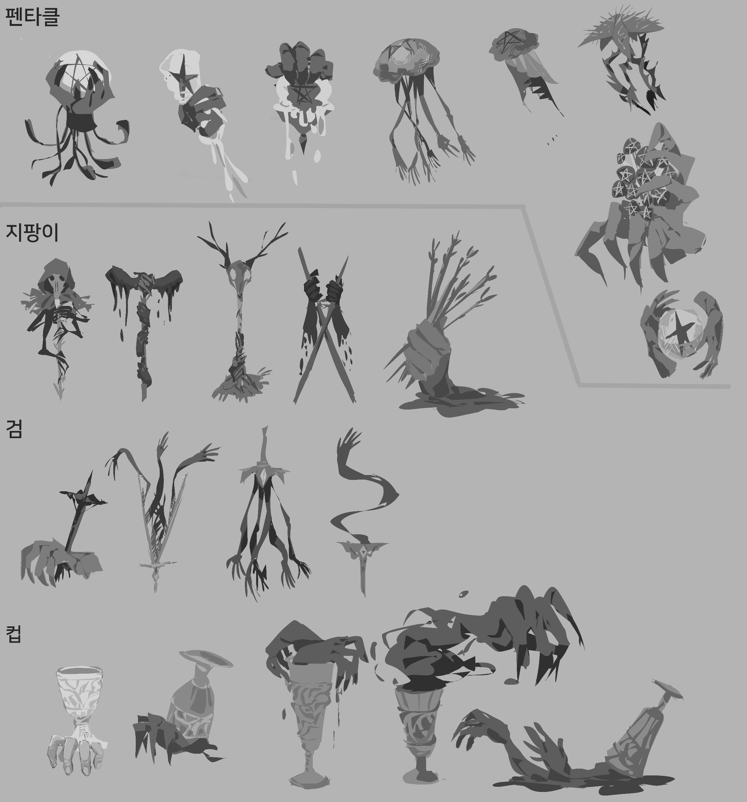
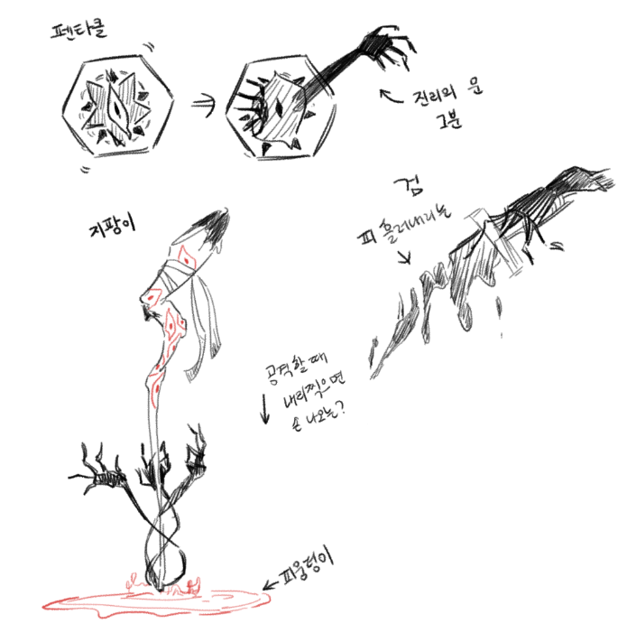

# 몬스터컨셉기획서_V1_이채연

## 슬라이드 1

몬스터 컨셉 기획서

이채연

---

## 슬라이드 2

이 문서를 읽을 때..

모든 것은 수정 될 수 있습니다.

궁금한 점이 있으면 언제든 담당자 이채연에게 연락 부탁드립니다. (새벽에도 OK)

이채연 010 2988 7090

---

## 슬라이드 3

잡 몬스터의 정의

#### 전투 노드에서 등장하는 적군을 의미한다.

#### 보스 노드에서 보스와 함께 등장하는 경우도 있다.

#### 궁극기를 가지고 있지 않고 인간이 아닌 모습으로 통일한다.

---

## 슬라이드 4

잡 몬스터

### 공격력

### 방어력

### HP

### 마이너 2

#### 마이너 스킬 2개를 가지고 있다.

#### 전투 불능 상태가 되면 보유하고 있는 마이너 카드 중 하나를 랜덤으로 드랍한다.

---

## 슬라이드 5

중간 보스 몬스터의 정의

#### 보스 노드에서 등장하는 적군을 의미한다.

#### 궁극기를 가지고 있고 인간 형태로 통일한다.

---

## 슬라이드 6

중간 보스 몬스터

### 공격력

### 방어력

### HP

### 마이너 3

#### 마이너 스킬 3개, 고유 1개, 궁극기 1개를 가지고 있다.

#### 전투 불능 상태가 되면 전투가 종료된다.

### 고유 1

### 궁극기 1

---

## 슬라이드 7

잡몬스터 비주얼

#### 모든 잡 몬스터는 해당 물체로 죽은 사람의 원령이 붙어 움직이는 것처럼 안 징그럽게 디자인.

#### 각 물건마다 인간의 그림자 형체(눈, 손)를 넣어 디자인.

#### (죽을 때 당시처럼 디자인되면 베스트 -> ex. 잔 안에 익사한 사람이 컵 주변을 잡고 있는 손 그림자)

#### 컵, 검, 지팡이, 오망성 4 종류의 잡 몬스터가 있다.

AD 시안 예시(컵 디자인 참고)

PD 시안 예시(디자인 참고)

> 해당 이미지에는 게임 기획 문서에 포함된 일러스트가 흑백으로 그려져 있습니다.

이미지 상단 좌측에는 **펜타클**이라는 단어가 적혀 있고, 각 행의 좌측에는 **지팡이**, **검**, **컵**이라는 단어가 적혀 있습니다.

각 단어 옆에는 여러 형태의 오브젝트들이 그려져 있습니다.

- **펜타클**: 
  - 구체 안에 펜타클이 내장된 오브젝트
  - 구체에서 촉수가 여러 개 달린 오브젝트
  - 펜타클이 내장된 구체가 용암처럼 녹아내리는 오브젝트
  - 일반적인 해파리 형태의 오브젝트
  - 해파리 형태의 오브젝트가 뒤집어진 모습
  - 가시가 여러 개 달린 오브젝트
  - 별이 여러 개 내장된 오브젝트
  - 구체 안에 별이 내장된 오브젝트를 양손으로 잡고 있는 모습

- **지팡이**:
  - 해골 형태의 오브젝트
  - 지팡이 머리 부분이 용암처럼 녹아내린 오브젝트
  - 사슴의 머리뼈에 왕관이 씌워진 오브젝트
  - 검이 교차된 오브젝트
  - 여러 개의 화살이 묶여 있는 오브젝트

- **검**:
  - 새 형태의 오브젝트
  - 새의 날개 형태의 오브젝트
  - 여러 개의 손가락이 달린 오브젝트
  - 뱀 형태의 오브젝트
  - 새의 날개와 비슷한 형태의 오브젝트

- **컵**:
  - 화려한 잔을 손가락이 잡고 있는 오브젝트
  - 화려한 잔을 괴물이 잡고 있는 오브젝트
  - 화려한 잔에 괴물의 손이 올라와 있는 오브젝트
  - 화려한 잔을 괴물이 물어뜯고 있는 오브젝트
  - 화려한 잔에 괴물의 손과 발이 올라와 있는 오브젝트

> 해당 이미지는 게임 기획 문서의 일부로, 게임 속 아이템 혹은 오브젝트의 디자인과 관련된 아이디어를 손으로 직접 그려서 기록한 것으로 보입니다. 

이미지 상단에는 두 개의 도형이 있습니다. 왼쪽은 여덟 개의 변이 있는 도형 안에 꽃과 같은 무늬가 그려져 있고, 오른쪽에는 같은 모양의 도형이 있지만, 안에서 꽃이 터져 나오는 듯한 모습으로 그려져 있습니다. 두 도형은 오른쪽을 가리키는 화살표로 연결되어 있습니다. 

두 도형의 오른쪽 위에는 '전리품 그분'이라는 단어가 있고, 왼쪽 위에는 '판타클'이라는 단어가 있습니다. 

이미지 중앙 우측에는 칼집이 있는 긴 검이 그려져 있습니다. 검의 날에는 피가 묻어 있고, 검의 손잡이 부분에는 여러 개의 날이 붙어 있는 모습입니다. 

이미지 하단 좌측에는 사람의 상반신이 그려져 있습니다. 눈을 감고 있는 사람의 머리 위로 여러 개의 손이 뻗어져 있고, 그 손들은 모두 손가락이 길쭉하게 표현되어 있습니다. 

사람의 몸에서는 붉은 피가 흘러나오고 있습니다. 피는 손과 몸이 엉켜 있는 부분에서 흘러나와, 마치 뿌리처럼 아래로 뻗어져 있습니다. 

이미지 곳곳에는 한글이 적혀 있습니다. 

*   '지팡이'
*   '공격했을 때 어떻게?'
*   '피울기라민스'
*   '피뿌리'

이러한 내용을 바탕으로, 게임 속 아이템 혹은 오브젝트의 디자인과 관련된 아이디어 스케치라고 추측하였습니다.

---

## 슬라이드 8

잡 몬스터 스킬

#### 각 몬스터는 각기 다른 마이너 스킬을 지닌다. 이때, 몬스터들이 가진 마이너 스킬은 캐릭터도 사용할 수 있다.

#### 오망성: 버프, 회복 관련검: 데미지, 공격력 디버프

#### 컵: 데미지, 회복 디버프

#### 지팡이: 데미지, 방어력 디버프

#### Ex)

#### 오망성 : 단일, 회복

#### 검 : 광역, 데미지

#### 컵 : 단일, 데미지 + 방어 디버프

#### 지팡이: 단일 공격 + 디버프 수에 따른 추가 데미지

---
