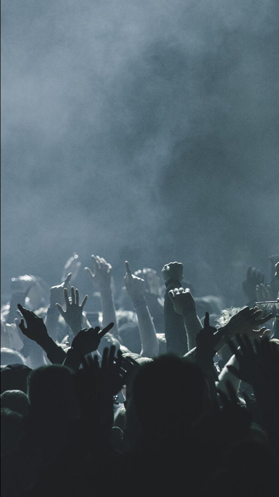
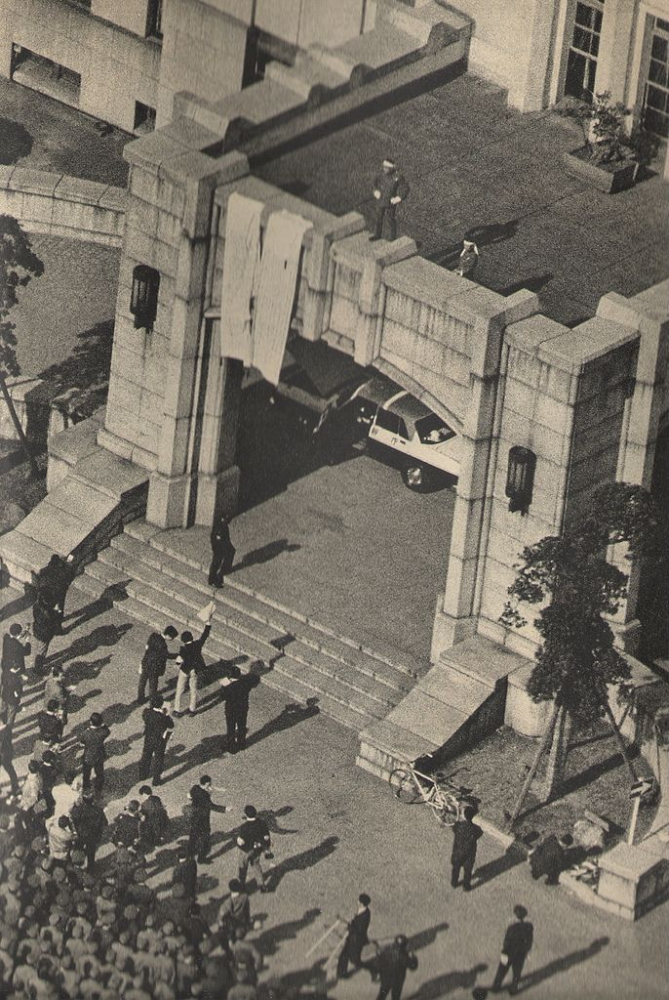
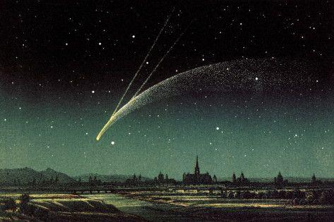
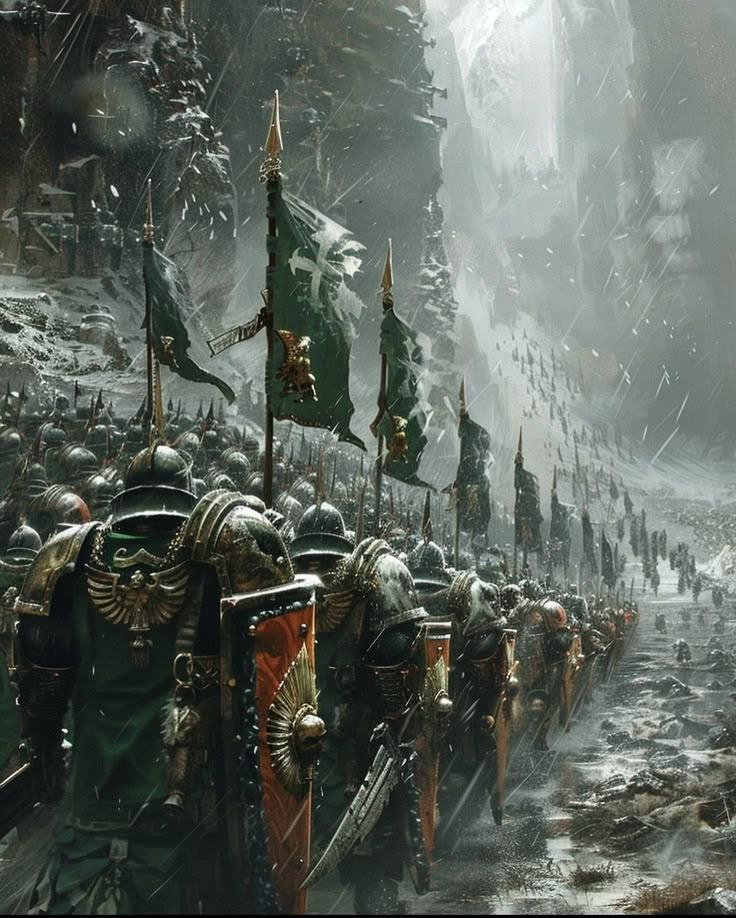

# 사건컨셉기획서_V0_장보성

## 슬라이드 1

사건 컨셉

Light life 202313190 장보성

---

## 슬라이드 2

사건 컨셉

**사건이란?**

  - 플레이어가 마주하는 사건 그 자체
  - 플레이어는 선택지에서 자신의 행동을 골라 결과를 얻는 이벤트
**한번 선택한 선택지는**

  - 리스크와 보상에 명확한 정보를 제공하고 유저가 선택하게 하게 해야함
  - 선택지에 리스크를 인지시키게 함으로 플레이어가 수용할 수 있게!
---

## 슬라이드 3

사건의 경험

**재미요소 및 경험 목표**

  - 선택을 통해 얻는 보상이 달라져 결과를 보는 재미
  - 전투에서의 피로도를 줄이는 조금 쉬어 가는 스테이지
  - 더 좋아 보이는 또는 자신이 원하는 선택지를 골라 결과를 보는 재미
  - 플레이어를 세계관에 몰입하게 만드는 장치임
플레이어가 선택하는 것이 정답!

  - 플레이 스타일에 따라 선택이 달라짐
  - 현재 상황에 따라 보상의 가치가 달라짐
  - **전략적 선택 경험을 제공함!!!**
---

## 슬라이드 4

사건의 보상

사건읋 통해 얻을 수 있는 보상의 가치

  - 캐주얼 유저들은 큰 손해를 보는 것을 매우 싫어함(손실 회피 심리)
  - 사건 내의 보상은 확실한 성장을 이룰 수 있다 라는 선택지 간에 결과의 차이를 크게 두어야 한다.
보상내용은 임시일 뿐 데이터 테이블에서 관리한다.

#### 이번 보상 대박인데? 다 부숴버리겠다!

#### 보유한 세팅에 맞게

#### 이걸 선택해야지

---

## 슬라이드 5

사건의 주의점

사건을 제작할 때 고려해야 할 사항

  - 전투와 전혀 상관없는 퀴즈가 나오거나 운빨 테스트가 나오면 유저는 억까 당하는 불쾌감!!!
  - 유저가 사건 노드에서 간단한 선택으로 다음 전투를 이기기 위한 전략은 짜게하여 몰입도는 유지시켜야함!!
  - 사건내의 보상은 확실한 성장을 이룰 수 있다 라는 선택지 간에 보상 종류에 차이를 크게 둠
  - 선택을 통해 확률은 있어도 디버프만 얻는 경우는 없게 해야한다.
---

## 슬라이드 6

사건 선택

사건설명 어쩌구저쩌구 어쩌구저쩌구 어쩌구저쩌구 어쩌구저쩌구 어쩌구저쩌구 어쩌구저쩌구

행동1 어쩌구저쩌구 어쩌구저쩌구 어쩌구저쩌구 어쩌구저쩌구

행동1에 대한 효과 +20% 어쩌구저쩌구 어쩌구저쩌구 어쩌구저쩌구

행동1에 대한 효과 +20% 어쩌구저쩌구 어쩌구저쩌구 어쩌구저쩌구

행동1에 대한 효과 +20% 어쩌구저쩌구 어쩌구저쩌구 어쩌구저쩌구

뭐랑 관련 증강 3개 선택 어쩌구저쩌구 어쩌구저쩌구 어쩌구저쩌구

행동1에 대한 효과 +20% 어쩌구저쩌구 어쩌구저쩌구 어쩌구저쩌구

행동2 어쩌구저쩌구 어쩌구저쩌구 어쩌구저쩌구 어쩌구저쩌구

행동2에 대한 효과 +20% 어쩌구저쩌구 어쩌구저쩌구 어쩌구저쩌구

행동2에 대한 효과 +20% 어쩌구저쩌구 어쩌구저쩌구 어쩌구저쩌구

행동2에 대한 효과 +20% 어쩌구저쩌구 어쩌구저쩌구 어쩌구저쩌구

행동2에 대한 효과 +20% 어쩌구저쩌구 어쩌구저쩌구 어쩌구저쩌구

사건설명 어쩌구저쩌구 어쩌구저쩌구 어쩌구저쩌구 어쩌구저쩌구 어쩌구저쩌구 어쩌구저쩌구 어쩌구저

어쩌구저쩌구 어쩌구저쩌구 어쩌구저쩌구 어쩌구저

사건설명 어쩌구저쩌구 어쩌구저쩌구 어쩌구저쩌구 사건설명 어쩌구저쩌구 어쩌구저쩌구 어쩌구저쩌구 어쩌구저쩌구 어쩌구저쩌구 어쩌구저쩌구 어쩌구저

사건설명 어쩌구저쩌구 어쩌구저쩌구 어쩌구저쩌구 어쩌구저쩌구 어쩌구저쩌구 어쩌구저쩌구 어쩌구저

어쩌구저쩌구 어쩌구저쩌구 어쩌구저쩌구 어쩌구저

어쩌구저쩌구 어쩌구저쩌구 어쩌구저쩌구 어쩌구저

행동2에 대한 효과 +20% 어쩌구저쩌구 어쩌구저쩌구 어쩌구저쩌구

#### A

#### B

#### C

#### D

#### E

#### F

| 알파벳 | 이름 | 설명 |
| --- | --- | --- |
| A | 사건 제목 | 사건의 제목으로 간략한 사건 종류의 구분을 위함 |
| B | 사건 이미지 | 사건의 상황을 시각화해서  한눈에 파악할 수 있도록 함 |
| C | 사건 상세 내용 | 사건 내에 있는 사건의 내용 (상황)에 대한 내용 서술용 |
| D | 행동 선택 | 플레이어가 해당 사건에서 행할 행동의 선택지 |
| E | 효과 대상 아이콘 | 대상 사건 종류나  캐릭터의  아이콘으로 효과 적용 대상 표기 |
| F | 효과 설명 | 적용되는 효과의 설명을 표기하기 위함 |
| G | 스크롤 바 | 정보량이 많을 때 스크롤 바로 화면을 내릴 수 있게 하여 많은 양을 정보를 볼 수 있게 |

#### 현재 보유 캐릭터

#### 현재 보유 증강

---

## 슬라이드 7

사건 1 – 붕괴

상황

  - 멀리서 거대한 탑이 무너진다.
  - 어떻게 할까?
| 선택지 | 보상 |
| --- | --- |
| 안에 있는 물건을 훔친다. | 최대 체력 – N, 증강 +N , 캐릭터 사망 |
| 안에 있는 사람을 구한다. | 최대 체력 – N, 사건 1-1 출력 |
| 빨리 대피한다. | 코스트 증가 |

> 이 사진은 흑백 사진으로, 기울어진 탑의 모습을 담고 있습니다. 탑은 정교한 조각과 장식품으로 장식되어 있으며, 지면과 45도 각도로 기울어져 있습니다. 탑의 표면에는 돌출된 장식 요소가 있고, 상단에는 첨탑이 있습니다.

사진의 전경에는 사람들이 보입니다. 이들은 군중으로 보이며, 탑의 붕괴를 목격하거나 촬영하는 모습입니다. 어떤 사람들은 탑에서 멀어지고 있고, 어떤 사람들은 탑에 더 가까이 다가가고 있습니다.

사진의 배경에는 여러 건축물이 보입니다. 이들 중 일부는 손상된 것으로 보이며, 먼지가 떠다니고 있어 최근에 폭발이나 지진 등의 사건이 발생했을 가능성을 암시합니다.

탑의 붕괴 장면을 포착한 이 사진은 역사적인 사건을 기록한 것으로 추정되며, 도시의 주요 구조물이 파괴된 후의 모습을 보여 주고 있습니다. 사진 속 인물과 건축물의 디테일, 그리고 붕괴된 탑의 모습이 인상적입니다.

---

## 슬라이드 8

사건 1-1 붕괴

상황

  - 구해준 인물이 보상을 주겠다고 한다.
  - 무엇을 요구할까?
| 선택지 | 보상 |
| --- | --- |
| 증강을 교환하자 한다. | 증강 +N |
| 구해준 인물을 죽이고 물건을 훔친다. | 캐릭터 증강 +N, 캐릭터 사망 |
| 난 너를 가지고 싶어 | 캐릭터 보상 |

> 이 사진은 흑백 사진으로, 기울어진 탑의 모습입니다. 탑은 정사각형의 기단부로 구성되어 있으며, 그 위로 다양한 조각과 장식이 있는 둥근 형태의 구조물이 올라가고 있습니다. 탑의 상부에는 십자가가 있는 듯한 구조물이 있습니다.

사진의 왼쪽에는 탑의 기단부 아래에서 먼지가 피어오르고 있습니다. 탑의 기울어짐으로 인해 구조물의 일부가 무너져 내린 것으로 보입니다.

탑 주변에는 여러 사람이 서 있거나 걸어가고 있습니다. 어떤 사람들은 탑의 붕괴를 지켜보고 있고, 어떤 사람들은 이미지를 벗어나거나 탑에서 멀어지고 있습니다.

사진의 오른쪽에는 탑과 유사한 건축 양식의 건물이 보입니다. 이 건물은 더 작고 탑처럼 기울어지지 않았습니다.

사진의 전반적인 분위기는 파괴와 혼돈을 전달합니다. 탑의 붕괴는 중요한 사건인 것 같습니다. 사람들은 이 사건에 대해 논의하거나 대피하는 것으로 보입니다.

탑의 기울어짐과 그 주변의 상황은 이 사진이 역사적인 사건을 기록한 것임을 암시합니다. 탑의 붕괴는 정치적이거나 사회적 변화를 상징하는 것으로 보입니다. 사진 속 사람들의 표정과 행동은 긴장과 불확실성을 반영하고 있습니다.

탑의 기울어짐은 우연히 일어난 사건일 수도 있지만, 사진 속 사람들의 반응은 이 사건이 중요한 의미를 가지고 있음을 시사합니다. 탑의 붕괴는 과거의 한 시대가 끝나는 것을 상징하는 것 같습니다.

사진 속 탑의 모습은 게임 기획 문서의 일부로 사용되고 있습니다. 이 사진은 게임의 배경이나 스토리에 사용될 수 있습니다. 사진 속 탑의 붕괴는 게임의 주요 이벤트나 상징적인 순간을 나타낼 수 있습니다.

---

## 슬라이드 9

사건 2 - 도망치는 부상자

  - 상황
    - 도망치는 윤회 교단 복장의 부상자가 있다.
  - 어떻게 할까?
| 선택지 | 보상 |
| --- | --- |
| 직접 죽인다. | 캐릭터 증강 +N |
| 별을 쫓는 자에게 넘긴다. | 증강 +N |
| 도와준다. | 코스트 증가 |

> 이미지는 어둡고 스팀이 자욱한 중세 느낌의 석조 건물의 내부 공간을 보여 주고 있습니다. 이미지 중앙에는 검은 후드를 쓴 캐릭터가 있고, 그 뒤로는 비슷한 복장을 한 두 명의 캐릭터가 횃불을 들고 있는 모습이 보입니다.

중앙 캐릭터는 하얀색의 더러운 로브를 입고 있으며, 왼쪽 어깨에 피가 묻어 있습니다. 허리에는 검은 벨트를 착용하고 있고, 가슴에는 삼각형의 펜던트를 목걸이로 착용하고 있습니다. 얼굴은 후드로 가려져 보이지 않습니다. 

중앙의 캐릭터는 왼팔을 구부리고 주먹을 쥐고 있으며, 오른팔은 앞으로 뻗어 무언가를 가리키는 듯한 자세를 취하고 있습니다.

이미지 왼쪽에는 횃불이 벽에 설치되어 있고, 그 뒤로는 아치형의 벽과 기둥이 보입니다. 이미지 오른쪽 상단에는 검은 천이 벽에 걸려 있는데, 삼각형과 눈이 그려져 있는 문양이 보입니다.

전체적으로 어둡고 스팀이 자욱한 분위기이며, 캐릭터의 복장과 분위기로 보아 게임의 세계는 중세 판타지 세계관으로 추정됩니다. 캐릭터의 복장과 자세, 그리고 횃불을 들고 있는 배경 캐릭터들의 모습으로 보아, 이 세계관에서는 후드를 뒤집어쓴 캐릭터들이 어떤 비밀스러운 결사나 집단의 일원인 듯한 느낌을 줍니다.

---

## 슬라이드 10

사건  3 – 변화의 문

상황

  - 폐허가 된 길을 지나던 중, 길 한가운데에  수상한 검은 문 하나가 서 있다.
  - 들어온 발자국과 지나간 발자국이 달라 보인다.
  - 어떻게 할까?
| 선택지 | 보상 |
| --- | --- |
| 문으로 들어간다. | 캐릭터 보상, 전체 증강 +N |
| 문을 닫는다 | 캐릭터 증강 +N |

> 이미지는 방의 일부를 보여 주고 있습니다. 이미지 중앙에는 검은색 문이 있고, 그 오른쪽에는 벽시계와 테이블이 있습니다.

*   **검은색 문**

    *   문은 검은색이며, 테두리와 손잡이 부분에 금색 장식이 있습니다.
    *   문의 오른쪽에는 금색 손잡이와 열쇠 구멍이 있습니다.
    *   문의 왼쪽에는 큰 금색 사각형 프레임이 있고, 아래에도 작은 금색 사각형 프레임이 있습니다.
*   **벽시계**

    *   벽시계는 금색 프레임에 노란색 시침과 분침이 있습니다.
    *   시계는 벽에 걸려 있으며, 벽시계의 오른쪽에는 작은 스위치 판넬이 있습니다.
*   **테이블**

    *   테이블은 금색 다리와 금색 링 모양의 받침이 있습니다.
    *   테이블 위에는 검은색 촛대와 하얀색 양초가 3개 있습니다.

이미지에는 문, 벽시계, 테이블, 촛대, 양초, 스위치 판넬이 포함되어 있습니다. 레이아웃은 왼쪽에 문이 있고, 오른쪽에 벽시계와 테이블이 있습니다. 방의 벽은 회색이고, 바닥은 갈색입니다.

---

## 슬라이드 11

사건  4 – 반가운 지원군

상황

  - 화난 듯한 별을 쫓는 자 무리가 있다.
  - 자신들이 선봉에 서겠다고 한다.
  - 물자를 좀 나눠 달라한다.
  - (후순위)다음 전투 시 전투의 흔적을 간단하게 남겨 주면 어떨까? (널부러져 있는 시체나 무기등 )
| 선택지 | 보상 |
| --- | --- |
| 물자를 일부 넘긴다. | 이후 척 전투 노드의 적 몬스터가 피해를 받고 시작 |
| 우리가 처리하겠다고 한다. | 코스트 N개 획득 |

> 제공된 이미지는 게임 기획 문서의 일부가 아닌, 콘서트장에서 음악을 즐기는 사람들의 모습입니다.

이미지 중앙에 있는 사람들의 손을 중심으로 양쪽에 사람들이 자리 잡고 있습니다. 모든 사람의 손이 위로 향하고 있어 마치 콘서트장에서 음악을 즐기고 있는 듯한 모습을 보여 주고 있습니다. 

사진 속 사람들은 모두 손을 올리고 있지만, 손 모양은 제각각입니다. 어떤 사람은 주먹을 쥐고 있고, 어떤 사람은 손바닥을 활짝 펼쳤습니다. 어떤 사람은 두 손을 모두 올리기도 했습니다.

배경은 연기와 조명으로 인해 희미하고 어둡습니다. 이 분위기는 콘서트장이나 음악 페스티벌의 밤을 연상케 합니다. 

이미지에는 텍스트, 다이어그램, UI 요소, 캐릭터, 아이콘 등이 포함되어 있지 않습니다.

---

## 슬라이드 12

사건 5 - 수상한 야영지

상황

  - 모닥불이 있는 야영지를 발견했다.
  - 모닥불 위에 스프가 혼자 끓고 있다.
| 선택지 | 보상 |
| --- | --- |
| 스프를 몰래 마셔본다. | 캐릭터 증강 +N |
| 스프에 독을 넣는다. | 이후 척 전투 노드의 적 몬스터가 피해를 받고 시작 |
| 불을 더 키워 다 태워버린다. | 플레이어HP 감소  이후 척 전투 노드의  적 몬스터가 피해를 받고 시작 |

> 이미지는 야영지 풍경을 묘사하고 있습니다. 여러 개의 천막이 야영지에 텐트로 둘러싸여 있습니다. 

중앙에는 커다란 가마솥이 불 위에 올려져 있습니다. 가마솥 안에는 음식이 끓고 있는 것으로 보입니다. 

텐트 안에는 등불이 밝혀져 있습니다. 

전체적으로 따뜻하고 편안한 분위기를 연출하고 있습니다.

---

## 슬라이드 13

사건 6 – 균형의 샘

상황

  - 예로부터 존재한 질서의 샘으로
  - 두 개의 강물이 한 곳에서 섞인다.
  - 물이 닿은 곳은 모든 것이 안정된다.
| 선택지 | 보상 |
| --- | --- |
| 다 같이 들어간다. | 캐릭터 증강 +N |
| 시험 삼아 한 명만 들어간다. | 증강 +N |
| 물을 담아간다. | 코스트 증가 |

> 이미지는 숲 속의 작은 시냇물을 묘사하고 있습니다. 시냇물은 숲의 중심에 위치하며, 여러 개의 크고 작은 바위와 자갈이 깔린 모래사 위에 흐르고 있습니다. 시냇물의 물은 맑고 깨끗해 보이며, 숲의 나무와 식물들이 반영되어 있습니다.

시냇물의 가장자리에는 크고 작은 바위들이 흩어져 있으며, 그 위로는 이끼가 덮여 있습니다. 또한, 시냇물 주변에는 다양한 종류의 식물들이 자라고 있습니다. 나무들은 높고 우거져 있으며, 숲의 분위기를 더 깊게 만들어 주고 있습니다.

이미지의 전반적인 색조는 녹색이며, 숲의 신선함과 생명을 상징하는 듯합니다. 이끼가 덮인 바위, 나무, 식물들은 모두 녹색빛을 띠고 있으며, 시냇물의 물 역시 녹색빛을 반사하고 있습니다. 이러한 색조는 이미지를 더욱 생생하고 활기차게 만들어 줍니다.

이미지에는 텍스트, 다이어그램, UI 요소, 캐릭터, 아이콘 등이 포함되어 있지 않습니다.

---

## 슬라이드 14

사건 7 – 왜곡된 심판

상황

  - 저울이 있는 단상 위에서 한 사람이 소리친다.
  - 이자는 윤회 교단을 오랫동안 근무했으나 개인을 위해 배신을 한 자입니다.
  - 이자를 죽일까요? 살릴까요?
| 선택지 | 보상 |
| --- | --- |
| 그자는 무죄다! | 아군 Hp일부 감소, 전체 증강 +N |
| 내가 처리하겠다! | 캐릭터 증강 +N |
| 심판의 저울이 기울었다. | 코스트 증가 |

> 이 사진은 어떤 게임의 컨셉 아트 또는 프로토 타입 화면으로 보입니다. 

사진 중앙에는 큰 석조 건물의 입구가 있습니다. 입구 위쪽으로 사람들이 보이며, 입구 아래로는 자동차 한 대가 빠져나오고 있습니다. 

입구 왼쪽에는 돌로 만들어진 계단이 있고, 그 위로 사람들이 보입니다. 계단 아래쪽에는 사람들이 줄지어 서 있습니다. 

입구 오른쪽에는 나무가 심어져 있습니다. 나무 오른쪽으로는 또 다른 건물의 벽과 창문이 보입니다. 

사진의 왼쪽 하단에는 많은 사람들이 보입니다. 

사진의 전반적인 분위기는 검은색과 흰색으로 구성되어 있어, 마치 흑백 사진을 보는 것 같습니다. 사진 속 사람들의 모습과 건물의 구조를 통해, 이 게임이 1920년대 일본을 배경으로 한 게임임을 유추할 수 있습니다.

---

## 슬라이드 15

사건 8 – 떨어진 별

상황

  - 밤하늘에 유난히 밝은 별이 떨어졌다.
  - 빛이 떨어진 장소에서 빛이 빛나고 있다.
| 선택지 | 보상 |
| --- | --- |
| 빛을 따라간다 | 코스트 증가 |
| 여기서 휴식을 취한다 | 전체 증강 +N |

> 이미지는 밤하늘에 운석이 떨어지는 듯한 풍경을 묘사하고 있습니다. 

### 이미지 상세 설명

*   **배경**: 짙은 밤하늘에 수많은 별이 깜빡이고 있습니다. 밤하늘은 짙은 녹색과 검은색으로 그라데이션을 이룹니다. 
*   **운석**: 운석은 밝은 빛을 내며, 길게 트인 흔적을 남기며 떨어지고 있습니다. 운석은 노란색과 흰색으로 이루어져 있습니다. 
*   **지평선**: 지평선에는 마을과 강이 보입니다. 마을은 짙은 색상으로 그림자가 져 있고, 강은 밝은 색상으로 빛나고 있습니다.

이미지 중앙에 위치한 운석은 밤하늘을 가로지며 긴 흔적을 남기고 있습니다. 이미지의 전반적인 분위기는 신비롭고 웅장한 느낌을 주고 있습니다.

---

## 슬라이드 16

사건 9 – 붕괴

상황

  - 밤길에서 작은 등불 하나가 흔들린다.
  - 등불 주변에는 발자국이 하나뿐이다.
| 선택지 | 보상 |
| --- | --- |
| 빛을 따라간다 | 전체 증강 +N |
| 빛을 조사한다 | 스킬 카드 등장 확률 선택 |
| 빛을 끈다 | 코스트 증가 |

> 이미지는 짙은 안개가 자욱한 숲을 묘사하고 있습니다. 여러 그루의 큰 나무가 줄지어 서 있고, 그 앞에는 작은 관목이 깔려 있습니다. 나무들은 모두 짙은 회색과 검은색으로, 안개로 인해 멀리 있는 것들은 선명하지 않게 표현되어 있습니다. 바닥에는 작은 흙길이 나 있고, 그 위로도 관목이 자라고 있습니다. 

전체적으로 어둡고 짙은 안개가 자욱한 숲의 모습을 표현하고 있습니다.

---

## 슬라이드 17

사건 10 – 멈추지 않는 행군

상황

  - 먼 거리에서 군세가 진격하는 소리가 들린다.
  - 군세가 옆을 지나간다.
| 선택지 | 보상 |
| --- | --- |
| 진격에 합류 | 스킬 카드 등장 확률 선택 |
| 독을 든 음식을 준다 | 이후 척 전투 노드의 적 몬스터 체력, 방어력 N% 감소 |

> 이미지는 눈이 내리는 전장에서 행진하는 군대의 모습을 묘사하고 있습니다. 

*   이미지 중앙에는 녹색 갑옷을 입은 병사들이 줄을 지어 행진하고 있습니다. 
*   병사들은 방패를 들고 있으며, 일부 병사들은 깃발을 들고 있습니다. 
*   깃발에는 흰색 십자가가 그려져 있습니다. 
*   병사들의 갑옷에는 금속 장식이 있으며, 일부 병사들은 칼을 들고 있습니다. 
*   배경에는 눈이 내리는 산과 바위가 보입니다. 
*   이미지의 오른쪽에는 더 많은 병사들이 행진하고 있는 모습이 보입니다. 
*   전반적으로 이미지의 분위기는 춥고 어둡습니다. 
*   이미지의 왼쪽 하단에는 녹색 갑옷을 입은 병사의 뒷모습이 크게 보입니다. 
*   이 병사는 방패를 들고 있으며, 방패에는 금속 장식이 있습니다. 
*   병사의 갑옷에는 금속 어깨 장식이 있습니다. 
*   이 병사의 오른쪽에는 비슷한 갑옷을 입은 또 다른 병사가 보입니다. 
*   이 병사도 방패를 들고 있으며, 방패에는 금속 장식이 있습니다. 
*   이 병사의 갑옷에는 금속 어깨 장식이 있습니다. 
*   이 두 병사 뒤에는 많은 병사들이 줄을 지어 행진하고 있습니다. 
*   이들의 뒤로는 깃발을 들고 있는 병사들이 보입니다. 
*   깃발에는 흰색 십자가가 그려져 있습니다. 
*   이미지의 오른쪽에는 더 많은 병사들이 행진하고 있는 모습이 보입니다. 
*   전반적으로 이미지의 분위기는 춥고 어둡습니다. 
*   눈이 내리고 있어 시야가 흐립니다. 
*   이미지의 중앙에는 눈이 내리는 산과 바위가 보입니다. 
*   산과 바위에는 눈이 쌓여 있습니다. 
*   이미지의 오른쪽 상단에는 밝은 빛이 비추고 있습니다. 
*   이 빛은 눈을 통해 반사되어 이미지를 밝게 합니다. 
*   전반적으로 이미지는 전쟁터의 긴박한 상황을 묘사하고 있습니다. 
*   이미지의 색감은 춥고 어둡습니다. 
*   이미지는 게임의 한 장면을 묘사한 것으로 보입니다. 
*   게임의 배경은 중세 시대의 전쟁터로 추정됩니다. 
*   이미지의 분위기는 긴박하고 심각합니다. 
*   이미지는 게임의 스토리를 전달하는 데 중요한 역할을 합니다. 
*   이미지는 게임의 세계관과 캐릭터를 소개합니다. 
*   이미지는 게임의 분위기와 스토리를 전달합니다. 
*   이미지는 게임의 마케팅에 사용될 수 있습니다. 
*   이미지는 게임의 팬들에게 게임의 세계관과 스토리를 소개합니다. 
*   이미지는 게임의 팬들에게 게임의 분위기를 전달합니다. 
*   이미지는 게임의 팬들에게 게임의 캐릭터를 소개합니다. 
*   이미지는 게임의 팬들에게 게임의 세계관을 소개합니다. 
*   이미지는 게임의 팬들에게 게임의 스토리를 전달합니다. 
*   이미지는 게임의 팬들에게 게임의 분위기를 전달합니다. 
*   이미지는 게임의 팬들에게 게임의 캐릭터를 소개합니다. 
*   이미지는 게임의 팬들에게 게임의 세계관을 소개합니다. 
*   이미지는 게임의 팬들에게 게임의 스토리를 전달합니다. 
*   이미지는 게임의 팬들에게 게임의 분위기를 전달합니다. 
*   이미지는 게임의 팬들에게 게임의 캐릭터를 소개합니다. 
*   이미지는 게임의 팬들에게 게임의 세계관을 소개합니다. 
*   이미지는 게임의 팬들에게 게임의 스토리를 전달합니다. 
*   이미지는 게임의 팬들에게 게임의 분위기를 전달합니다. 
*   이미지는 게임의 팬들에게 게임의 캐릭터를 소개합니다. 
*   이미지는 게임의 팬들에게 게임의 세계관을 소개합니다. 
*   이미지는 게임의 팬들에게 게임의 스토리를 전달합니다. 
*   이미지는 게임의 팬들에게 게임의 분위기를 전달합니다. 
*   이미지는 게임의 팬들에게 게임의 캐릭터를 소개합니다. 
*   이미지는 게임의 팬들에게 게임의 세계관을 소개합니다. 
*   이미지는 게임의 팬들에게 게임의 스토리를 전달합니다. 
*   이미지는 게임의 팬들에게 게임의 분위기를 전달합니다. 
*   이미지는 게임의 팬들에게 게임의 캐릭터를 소개합니다. 
*   이미지는 게임의 팬들에게 게임의 세계관을 소개합니다. 
*   이미지는 게임의 팬들에게 게임의 스토리를 전달합니다. 
*   이미지는 게임의 팬들에게 게임의 분위기를 전달합니다. 
*   이미지는 게임의 팬들에게 게임의 캐릭터를 소개합니다. 
*   이미지는 게임의 팬들에게 게임의 세계관을 소개합니다. 
*   이미지는 게임의 팬들에게 게임의 스토리를 전달합니다. 
*   이미지는 게임의 팬들에게 게임의 분위기를 전달합니다. 
*   이미지는 게임의 팬들에게 게임의 캐릭터를 소개합니다. 
*   이미지는 게임의 팬들에게 게임의 세계관을 소개합니다. 
*   이미지는 게임의 팬들에게 게임의 스토리를 전달합니다. 
*   이미지는 게임의 팬들에게 게임의 분위기를 전달합니다. 
*   이미지는 게임의 팬들에게 게임의 캐릭터를 소개합니다. 
*   이미지는 게임의 팬들에게 게임의 세계관을 소개합니다. 
*   이미지는 게임의 팬들에게 게임의 스토리를 전달합니다. 
*   이미지는 게임의 팬들에게 게임의 분위기를 전달합니다. 
*   이미지는 게임의 팬들에게 게임의 캐릭터를 소개합니다. 
*   이미지는 게임의 팬들에게 게임의 세계관을 소개합니다. 
*   이미지는 게임의 팬들에게 게임의 스토리를 전달합니다. 
*   이미지는 게임의 팬들에게 게임의 분위기를 전달합니다. 
*   이미지는 게임의 팬들에게 게임의 캐릭터를 소개합니다. 
*   이미지는 게임의 팬들에게 게임의 세계관을 소개합니다. 
*   이미지는 게임의 팬들에게 게임의 스토리를 전달합니다. 
*   이미지는 게임의 팬들에게 게임의 분위기를 전달합니다. 
*   이미지는 게임의 팬들에게 게임의 캐릭터를 소개합니다. 
*   이미지는 게임의 팬들에게 게임의 세계관을 소개합니다. 
*   이미지는 게임의 팬들에게 게임의 스토리를 전달합니다. 
*   이미지는 게임의 팬들에게 게임의 분위기를 전달합니다. 
*   이미지는 게임의 팬들에게 게임의 캐릭터를 소개합니다. 
*   이미지는 게임의 팬들에게 게임의 세계관을 소개합니다. 
*   이미지는 게임의 팬들에게 게임의 스토리를 전달합니다. 
*   이미지는 게임의 팬들에게 게임의 분위기를 전달합니다. 
*   이미지는 게임의 팬들에게 게임의 캐릭터를 소개합니다. 
*   이미지는 게임의 팬들에게 게임의 세계관을 소개합니다. 
*   이미지는 게임의 팬들에게 게임의 스토리를 전달합니다. 
*   이미지는 게임의 팬들에게 게임의 분위기를 전달합니다. 
*   이미지는 게임의 팬들에게 게임의 캐릭터를 소개합니다. 
*   이미지는 게임의 팬들에게 게임의 세계관을 소개합니다. 
*   이미지는 게임의 팬들에게 게임의 스토리를 전달합니다. 
*   이미지는 게임의 팬들에게 게임의 분위기를 전달합니다. 
*   이미지는 게임의 팬들에게 게임의 캐릭터를 소개합니다. 
*   이미지는 게임의 팬들에게 게임의 세계관을 소개합니다. 
*   이미지는 게임의 팬들에게 게임의 스토리를 전달합니다. 
*   이미지는 게임의 팬들에게 게임의 분위기를 전달합니다. 
*   이미지는 게임의 팬들에게 게임의 캐릭터를 소개합니다. 
*   이미지는 게임의 팬들에게 게임의 세계관을 소개합니다. 
*   이미지는 게임의 팬들에게 게임의 스토리를 전달합니다. 
*   이미지는 게임의 팬들에게 게임의 분위기를 전달합니다. 
*   이미지는 게임의 팬들에게 게임의 캐릭터를 소개합니다. 
*   이미지는 게임의 팬들에게 게임의 세계관을 소개합니다. 
*   이미지는 게임의 팬들에게 게임의 스토리를 전달합니다. 
*   이미지는 게임의 팬들에게 게임의 분위기를 전달합니다. 
*   이미지는 게임의 팬들에게 게임의 캐릭터를 소개합니다. 
*   이미지는 게임의 팬들에게 게임의 세계관을 소개합니다. 
*   이미지는 게임의 팬들에게 게임의 스토리를 전달합니다. 
*   이미지는 게임의 팬들에게 게임의 분위기를 전달합니다. 
*   이미지는 게임의 팬들에게 게임의 캐릭터를 소개합니다. 
*   이미지는 게임의 팬들에게 게임의 세계관을 소개합니다. 
*   이미지는 게임의 팬들에게 게임의 스토리를 전달합니다. 
*   이미지는 게임의 팬들에게 게임의 분위기를 전달합니다. 
*   이미지는 게임의 팬들에게 게임의 캐릭터를 소개합니다. 
*   이미지는 게임의 팬들에게 게임의 세계관을 소개합니다. 
*   이미지는 게임의 팬들에게 게임의 스토리를 전달합니다. 
*   이미지는 게임의 팬들에게 게임의 분위기를 전달합니다. 
*   이미지는 게임의 팬들에게 게임의 캐릭터를 소개합니다. 
*   이미지는 게임의 팬들에게 게임의 세계관을 소개합니다. 
*   이미지는 게임의 팬들에게 게임의 스토리를 전달합니다. 
*   이미지는 게임의 팬들에게 게임의

---
