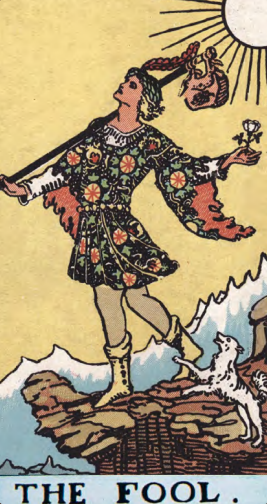
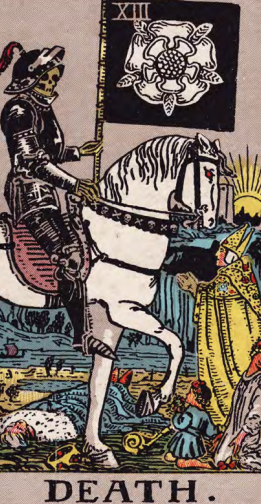
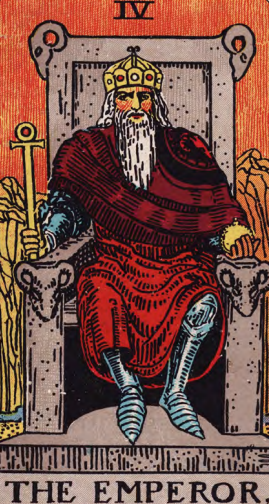

# 스토리세계관컨셉_V1_장보성

**세계관과 스토리 컨셉 기획서**

작성자: 장보성

Team: Light life

학번: 202313190

전화번호: 010-5617-3724

**내용**

**목차 **

## 문서 개요

게임내의 스토리 및 세계관을 지정하여 방향성, 컨셉 통일을 위함

## 세계관

**기획의도**

턴제 특성의 주인공의 선택을 운명을 깨부수는 캐릭터의 행동과 몰입할 수 있는 세계관

**시대적**

암흑기에서 > 르네상스 시대 14세기 인문주의로 변화되는 과정

**문화적**

군주제이지만 종교의 힘이 강한 세계 

운명의 교단이라는 종교 중심의 세계

불결한 운명을 정화한다라는 모순적인 교리로 살생을 서슴치 않는다.

**세계관 특징**

사람들은 각 각 자신만의 운명을 가지고 태어남

선천적으로  **Wheel Of Fortune, **Hangedman등 타로카드를 기반으로 권능을 지니고 있으며 권능의 세기는 경험에 따라 차이남

평상시에는 정방향효과의 권능을 사용하나 극한의 상황에 역방향의 권능을 사용할 수 있다.

**종족**

**	인간이 아닌 크리처 (판타지) 종족 또한 존재한다.**

**세력**

**아르카나**

교회와 황제가 통치하는 종교 국가이자 세계 그 자체 

운명의 교단

오랫동안 아르카나를 통치한 집단

운명에 따르는 것에 극도로 민감한 집단

꿈을 쫓는자

운명을 믿지 않거나 거부하며 자신의 꿈을 위해 살고 싶어하는 집단

**배경**** 스토리 (개발 내)**

아르카나라는 운명의 신이 모든 것에 운명을 지정하는 질서의 세계를 창조했다.

초반에는 운명의 교단으로 하나의 목표를 위해 각각의 운명을 짊어지며 (임시)200년간 번창했다.

하지만 태어날 때부터 자신의 운명을 타고난다는 사실에 일부 세력들은 반발하며 운명을 거부하기 시작했다.

이로 인해 점점 많은 변수로 인해 서서히 운명을 예측할 수 없게 되며 신앙이 점점 약해지며 운명을 믿지 않게 되었다.

운명의 교단은 Emperor의 권능으로 대다수의 국민을 복종시키는데 성공했으나 

더 많은 사람들이 자신의 운명에서 벗어나 혼돈에 빠지는 걸 막기 위해 **「****Judgment****」**의 지시의 따라 폭력으로 진압을 시도하다 실패하여 내전이 일어난 폭력으로 혼란스러운 상황

**이 세상의 주된 문제**

운명을 거부해 자유를 찾으려는 세력과 운명으로 질서를 유지하는 세력간의 내전

## 인게임 스토리

**시놉시스**

주인공은 운명이 정해진 세계를 부수려는 스토리

**활동**

개척

**스토리**

운명이라는 이유로 자신의 소중한 이들이 한순간에 죽임을 당했다. 

주인공은　복수를 위해 꿈을 쫓는자와 함께 The Emperor를 처리하러 갔다

주인공은 The Emperor의 권능으로 세뇌당해 자신의 손으로 동료를 죽임

조력자 Hangedman(꿈을 쫒는자)의 희생으로 주인공는 세뇌에서 풀려났을 때는 동료들이 학살당한 상황을 마주함

이 때 주인공은 절망하며 역방향의 능력을 발현시킴  

게임 시작!!!

결말 주인공 또한 아르카나를 빈사상태로 만들었으나 아르카나를 죽이면 운명의 권능이 모두 사라지며 조력자 또한 죽는다는 운명에 깨달음 

주인공은 조력자를 살리기 위해 권능으로 윤회를 다시하려 함

조력자는 주인공의 카드를 찢으면서 희생함(키스하거나 상관없음) 

주인공은 아르카나와 마지막 전투를 진행하며 승리함

조력자가 만들고 싶었던 세계를 바라보며 엔딩!

## 플레이 내의 스토리

**스토리**

운명이라는 이유로 자신의 소중한 이들이 한순간에 죽임을 당했다. 

주인공은　복수를 위해 꿈을 쫓는자와 함께 The Emperor를 처리하러 갔다

주인공은 The Emperor의 권능으로 세뇌당해 자신의 손으로 동료를 죽임

조력자 Hangedman(꿈을 쫒는자)의 희생으로 주인공는 세뇌에서 풀려났을 때는 동료들이 학살당한 상황을 마주함

이 때 주인공은 절망하며 역방향의 능력을 발현시킴  

게임 시작!!!

아르카나를 죽이면 운명의 권능이 모두 사라지며 조력자 또한 죽는다는 운명에 깨달음 

조력자는 주인공의 카드를 찢으면서 희생함(키스하거나 상관없음) 

주인공은 아르카나와 마지막 전투를 진행하며 승리함

## 주인공 Wheel Of Fortune 컨셉

> 해당 이미지는 타로카드 중 '운명의 바퀴 (Wheel of Fortune)' 카드입니다. 

### 이미지 상세 설명

*   이 카드는 주로 변화, 운명, 운, 순환 등을 상징합니다. 
*   이미지 중앙에는 큰 주황색의 원이 있습니다. 원 안에는 여러 기호가 새겨져 있으며, 원의 바깥쪽에는 히브리어 또는 룬 문자가 적혀 있습니다. 
*   원 위에는 이집트풍의 스핑크스가 앉아 있으며, 스핑크스의 왼쪽에는 날개를 펼친 채 책을 물고 있는 노란색 새가 있고, 오른쪽에는 붉은 악마의 손이 표현되어 있습니다. 
*   스핑크스 아래에는 구름 위에 노란색 날개 달린 소가 책을 물고 있습니다. 
*   스핑크스 위에는 로마 숫자 'X'가 있습니다. 
*   이미지 하단에는 'WHEEL of FORTUNE'이라는 문구가 있습니다. 
*   배경은 하늘색이며, 구름이 떠 있습니다. 

### 구성 요소

*   **스핑크스**: 이집트 신화에 나오는 상상의 동물로, 지혜와 신비로움을 상징합니다. 
*   **노란색 새**: 날개를 펼치고 책을 물고 있는 모습으로, 지식과 메시지를 전달하는 상징으로 보입니다. 
*   **붉은 악마의 손**: 운명의 변동성과 혼돈을 상징하는 요소로 보입니다. 
*   **노란색 날개 달린 소**: 날개를 펼치고 책을 물고 있는 모습으로, 평화와 번영을 상징하는 요소로 보입니다. 
*   **주황색 원**: 운명의 바퀴를 상징하며, 중앙에는 교차하는 선이 있고, 바깥쪽에는 히브리어 또는 룬 문자가 적혀 있습니다. 
*   **구름**: 하늘색 배경에 떠 있는 구름은 신비로움과 영적인 영역을 상징합니다. 
*   **'WHEEL of FORTUNE'**: 타로카드의 이름으로, 운명의 변화를 상징합니다. 
*   **로마 숫자 'X'**: 숫자 10을 의미하며, 완전함과 순환을 상징합니다.

**주인공(주인공 캐릭터)**

임시] 주인공은 운명이 정해진 세계를 부수려는 인물 

**키워드**

**Wheel Of Fortune**

**성격**

**능력**

운명의 교단에 모든걸 빼앗긴 주인공 

역방향의 능력으로 운명을 되돌릴 수 있다.

**주인공 목표 **

아르카나** **「THE WORLD」를 파괴하여
‘정해진 운명의 세계’대신 실존주의의 세계를 만들려 함

**인물간 관계**

아르카나** **「THE WORLD」를 파괴하여
‘정해진 운명의 세계’대신 실존주의의 세계를 만들려 함

## 조력자 Hangedman 컨셉

> 해당 이미지는 타로카드의 'The Hanged Man'을 묘사하고 있습니다. 

### 이미지 상세 설명:

1. **타로 카드 명칭 및 번호**:
   - 카드의 맨 위에는 로마 숫자 'XII'가 적혀 있습니다. 이는 이 카드가 타로 카드 점에서 12번에 해당한다는 것을 나타냅니다.

2. **나무와 인물**:
   - 나무는 십자가처럼 가로로 되어 있으며, 나무에는 덩굴이 감겨 있습니다.
   - 한 남성이 나무에 거꾸로 매달려 있습니다. 
   - 남성의 머리는 아래로 향하고 있으며, 눈은 감긴 상태입니다. 
   - 남성의 머리를 중심으로 노란색의 햇살이 퍼져 나가고 있습니다.

3. **인물의 복면 및 신발**:
   - 남성은 하늘색의 옷을 입고 있으며, 빨간색의 긴 부츠를 신고 있습니다.

4. **카드의 텍스트**:
   - 카드의 하단에는 'THE HANGED MAN'이라는 영문 텍스트가 있습니다.

5. **시각적 레이아웃**:
   - 이미지는 인물과 나무를 중심으로 구성되어 있습니다. 배경은 연한 회색빛을 띠고 있습니다.

이 카드는 희생, 새로운 관점, 그리고 일시적인 정지 등을 상징합니다.

**이름**

조력자(가명)

**성별**

**여성**

**특징**

희생하기전 조력자로서 주인공를 세뇌에서 풀어줌

어떻게든 죽는 캐릭터

주인공의 운명을 역방향으로 바꾸는데 영향을 주며 
자기자신을 주인공을 위해 희생함

내심 주인공을 좋아함 

결말: 자신이 만들고 싶었던 세계를 위해 스스로 희생함

 **Judgment의 여동생**

**키워드**

Hangedman

**게임 내 역할 **

튜토리얼 설명

주인공의 게임 진행 동기 제공

스토리의 로맨스

## 아군 캐릭터 The Fool 컨셉

> 주어진 이미지는 타로 카드 중 'THE FOOL' 카드를 묘사하고 있습니다.

이미지 중앙에는 젊은 남자가 등장합니다. 그는 화려한 꽃무늬 옷을 입고 있으며, 왼손에 꽃을 들고 오른손에 막대를 들고 있습니다. 그는 낭떠러지 가장자리에 서 있으며, 뒤로는 눈 덮인 산맥이 펼쳐져 있습니다. 

남자의 옆에는 흰색 개가 함께 서 있습니다. 남자의 머리 위로는 태양이 빛나고 있으며, 태양으로부터 여러 선이 방출되고 있습니다. 

카드의 하단에는 'THE FOOL'이라는 텍스트가 있습니다. 

이 카드는 새로운 시작, 순수함, 모험, 그리고 도전을 상징합니다.

**이름**

(가명)

**키워드**

**The Fool -> Temprance**

**특징**

정의를 우선시하는 바보 같은 성격

주변 인물에 따라 성장함

**목표 **

더 많은 정의를 세우며 더 많은 사람을 행복하게 만드는 것

**    캐릭터 변화**

정의롭지만 바보같은 상냥한 아이 > 새로운 시대를 이어나가는 성장한 영웅

**    전투 특징(임시)**

**성장하는 도화지: 파티에 포함된 캐릭터에 따라 디버프가 버프로 바뀌는 캐릭터**

**무모함: 방어력 디버프 -> 용맹함: 공격력 버프**

**서투름: 공방 디버프 -> 능숙한: 공방 버프**

**불안: 공격력 디버프 -> 신중함: **

**고집:  버프,디버프효과 약화 -> 끈기: **

**나약한: -> 이타적인: 캐릭터 생존시 아군 캐릭터 방어력버프**

**반항심: 버프 약화: **

## 아군 캐릭터 Death 컨셉

> 이미지는 타로 카드 중 '죽음(Death)' 카드를 묘사하고 있습니다. 이 카드는 메이저 아르카나(Major Arcana)의 13번째 카드입니다.

### 이미지 상세 설명:

1. **전사 및 백마:**
   - 왼쪽에는 갑옷을 입은 전사가 등장합니다. 전사는 하얀색의 말을 타고 있으며, 손에는 검은 깃발을 들고 있습니다. 깃발에는 하얀 꽃이 그려져 있고, 깃대에는 로마 숫자 'XIII'가 적혀 있습니다.

2. **깃발:**
   - 깃발에는 하얀 장미꽃이 그려져 있습니다. 장미꽃은 일반적으로 재생, 생명, 그리고 죽음을 상징하기도 합니다.

3. **배경:**
   - 배경에는 다양한 사람들이 고통스럽게 쓰러져 있거나 죽어 있는 모습이 그려져 있습니다. 이로써 죽음의 보편성과 필연성을 상징합니다.

4. **해와 여인:**
   - 오른쪽에는 밝은 햇살이 비치고 있으며, 그 앞에는 한 여성이 서 있습니다. 여인은 하늘색과 노란색 옷을 입고 있으며, 태양을 향해 손을 뻗고 있는 모습입니다. 이는 죽음 이후의 재생과 새로운 시작을 상징합니다.

5. **텍스트:**
   - 카드 하단에는 'DEATH'라는 단어가 크게 새겨져 있습니다. 이는 이 카드의 주제가 죽음임을 명확히 나타냅니다.

6. **색상과 분위기:**
   - 전반적으로 이미지는 짙은 색상과 강렬한 대비를 사용해 죽음의 엄숙함과 변화의 불가피성을 표현하고 있습니다.

이 카드는 단순히 물리적 죽음을 의미하는 것이 아니라, 변화, 전환, 그리고 새로운 시작을 상징하기도 합니다. 타로 카드 해석에서 '죽음' 카드는 종종 어떤 상황의 끝과 새로운 시작을 예고하는 중요한 상징으로 사용됩니다.

**이름**

(가명)

**키워드**

**Judgment**

**특징**

전 운명의 교단의 이단 심문관으로 많은 이들을 해치나 지속적으로 후회 및 회의감으로 흔들림

조력자의 오빠, 허밋 그레이스의 제자

조력자의 죽음으로 운명의 교단을 배신하게 됨

**목표 **

자신의 선택에 대한 탕감을 위해 운명의 교단을 무너트리려함

여동생의 복수 및 운명 개척

**    캐릭터 변화**

전 운명의 교단의 이단 심문관 > 

**    전투 특징(임시)**

**업보**: 해당 캐릭터의 **남은 체력에 비례해 공격력 증가**

무자비:  **공격한 적에게 피해량 증가**

## 아군 캐릭터 Judgment 컨셉

**이름**

(가명)

**키워드**

**Judgment**

**특징**

전 운명의 교단의 이단 심문관으로 많은 이들을 해치나 지속적으로 후회 및 회의감으로 흔들림

조력자의 오빠, 허밋 그레이스의 제자

조력자의 죽음으로 운명의 교단을 배신하게 됨

**목표 **

자신의 선택에 대한 탕감을 위해 운명의 교단을 무너트리려함

여동생의 복수 및 운명 개척

**    캐릭터 변화**

전 운명의 교단의 이단 심문관 > 

**    전투 특징(임시)**

**업보**: 해당 캐릭터의 **남은 체력에 비례해 공격력 증가**

무자비:  **공격한 적에게 피해량 증가**

## 아군 캐릭터 The Devil 컨셉

**이름**

(가명)

**키워드**

**The Devil**

**특징**

츤데레, 마음은 매우 여림, 티는 안 내려하지만 들어남

매우 선한 사람이나 **The Devil이라는 키워드로 인해 오랫동안 차별 받으며 삼**

**자유를 가져다 주는 것을 질서를 파괴하는 행위로 세간에 미움을 삼**

도덕적 반실재론을 따르는 탈옥수

**목표 **

모두에게 운명에 묶이지 않는 실존주의적 세계를 열기 위함

어린아이의 웃는 모습을 보기 위하여

**    전투 특징(임시)**

**본능**: 일정 체력이하의 적대적 NPC에 추가 데미지

**해방: 해당 캐릭터가 캐릭터(적,아군 상관 없이) 처치 시 공격력 증가**

## 적대적 NPC The Hermit 컨셉

**중간보스**

**이름**

허밋 그레이스

**키워드**

**중간보스: **「The Hermit」운둔자

잿빛 교황 (키포인트로 회색 추천)

**특징**

**오로지 아르카나의 번영만을 위한 그 외에는 아무것도 
관심이 없는 인물 어떤 것에도 흔들리지 않고 아르카나를 위한 결정만을 내리는 인물**

**Judgment를 진심으로 아낌**

**성격**

**냉철하며 직접 나서지 않으며 뒤에서 계속 지휘하는 흑막 같은 존재**

**전투 특징(임시)**

나만의 길: **버프, 디버프 면역효과 **

**업보**: 해당 캐릭터의 **남은 체력에 비례해 공격력 증가**

**사제관계: Judgment에 가하는 공격 디버프**

**(연출) 해당 캐릭터가 고독한 세상 효과 발동 시 일정 조건 달성 시 색상이 흑백으로 필터로 분위기 살림**

레퍼런스

> 이미지는 흑백의 인물 삽화로, 한 남성이 타원형 프레임 안에 그려져 있습니다. 남자는 긴 수염과 머리를 가지고 있으며, 머리는 짧게 잘려 있고, 눈썹은 짙습니다. 그는 손을 모으고 기도하는 듯한 자세로 그려져 있습니다. 남자의 뒤로는 도시의 풍경이 그려져 있습니다. 

오른쪽 상단에는 화환 모양의 무늬가 있고, 왼쪽 상단에는 방패 모양의 무늬가 있습니다. 삽화 아래에는 라틴어로 쓰인 문구가 있습니다. 삽화의 오른쪽에는 십자가가 그려져 있습니다. 

이미지 중앙에 있는 남성이 주요한 시각적 요소이며, 삽화의 분위기는 엄숙하고 고요합니다.

https://fr.wikipedia.org/wiki/Fran%C3%A7ois_Leclerc_du_Tremblay

## 적대적 NPC Justice 컨셉

> 이미지는 타로카드 중 'Justice' 카드를 묘사하고 있습니다. 카드는 정면을 향해 앉아 있는 왕을 보여주고 있습니다. 왕은 붉은색 옷과 녹색 금테로 장식된 망토를 입고 있습니다. 왕의 손에는 왼쪽에는 저울, 오른쪽에는 검이 들려 있습니다. 왕은 왕관을 쓰고 있으며, 그 위에는 로마 숫자 'XI'가 새겨진 노란색 반달 모양의 무늬가 있습니다. 왕의 뒤로는 붉은색 커튼이 있고, 그 앞에는 'JUSTICE'라는 단어가 쓰여 있습니다.

**중간보스**

**이름**

**Justice**

**키워드**

**중간보스: **「**Justice**」정의

눈 가리개를 함

**특징**

**남의 죄를 판단하며 심판을 함**

**자신이 남에게 벌을 줄 자격이 있는지 회의감을 가짐**

**성격**

**기계와 같이 벌을 내림**

**전투 특징(임시)**

카르마: **플레이어가 지금까지 처치한 캐릭터 수 에 비례하여 공격력 증가**

**회의감**: 플레이어진영의 캐릭터에 피해가 발생할 때 마다  방어력 약화됨

## 적대적 NPC The Emperor 컨셉

> 해당 이미지는 타로카드 중 'THE EMPEROR' 카드를 묘사하고 있습니다.

이미지 중앙에는 왕좌에 앉아 있는 황제(Emperor)가 있습니다. 황제는 흰 수염과 긴 머리를 가지고 있으며, 붉은색 옷과 갑옷을 입고 있습니다. 황제는 왼손에 홀을 들고 있으며, 오른쪽 팔꿈치는 왕좌의 팔걸이에 올려져 있습니다. 

황제가 착용하고 있는 왕관은 노란색이며, 왕관 위에는 4개의 보석이 박혀 있습니다. 

황제의 오른쪽에는 노란색의 무언가가 그려져 있지만 식물이름을 정확히 알 수 없습니다.

왕좌 뒤로는 주황색 벽이 있고, 그 위에는 'IV'라는 로마 숫자가 있습니다.

이미지 하단에는 'THE EMPEROR'이라는 카드 이름이 적혀 있습니다.

**이름**

루트비히 칸트(임시)

**키워드**

**중간보스: 「The Emperor」**

질서를 가장 중시하며 운명에 따르는 게 가장 중요하다 생각함

**전투 특징(임시)**

나를 따라라: 플레이어 파티의 캐릭터를 일정 턴 동안 몬스터로 바꿈

체계화된 조직: 생존한 몬스터 수에 비례해 버프

고집: 버프,디버프효과 감소

## 적대적 NPC THE WORLD 컨셉

**이름**

아르카나

**키워드**

**최종 보스: 「THE WORLD」**

아르카나 세계 그 자체

모든 윤회를 관장하는 존재

최종 보스를 클리어하며 이전 운명으로 결정되는 세계를 부숴 신세계의 제작 가능성을 만드는 엔딩으로 사용하기 적합함

**전투 특징(임시)**

카드 덱 자체를 재구성

윤회로 전 보스나 스킬등의 공격 수단으로 사용

주인공의 과거 선택을 재현

## 캐릭터 관계도

**캐릭터간의 관계성을 부여해 세계관 몰입도, 캐릭터의 깊이 및 약점 공략법 추가로 가벼운 전략요소 **

## 스토리 컨셉 방향성

**유연한 스토리 컨셉**

**캐릭터의 수의 조절을 위해 캐릭터 일부가 사라져도 어색하지 않게 각 캐릭터는 개별적 스토리 및 개인의 신념을 독립적으로 분리함**

**금지된 톤**

**너무 가벼운 유치 찬란한 분위기 금지!!!**

> 이미지는 게임 기획 문서의 일부로 보이는 일러스트입니다. 이미지 중앙에는 노란색과 흰색 옷을 입은 소녀가 그려져 있습니다.

*   **캐릭터:** 소녀는 머리가 크고 눈이 큰 동화 같은 캐릭터로 묘사되어 있습니다. 눈은 보라색과 파란색으로 그라데이션을 준 듯한 이채의 눈을 가지고 있습니다. 입꼬리가 올라가 있고, 볼에 분홍색 기운이 감도는 것으로 보아 기쁜 표정으로 보입니다. 
*   **머리:** 소녀의 머리는 가운데를 가르마 탄 장발입니다. 머리색은 노란색과 갈색이 혼합된 색상으로 묘사되어 있습니다. 
*   **장식:** 소녀의 머리에는 노란색 리본이 묶여 있습니다. 리본은 노란색과 흰색으로 이루어져 있으며, 리본의 가운데에는 노란색과 갈색으로 된 뿔이 표현되어 있습니다. 
*   **옷:** 소녀는 노란색과 흰색 옷을 입고 있습니다. 옷의 형태는 구체적으로 식별하기 어렵지만, 노란색과 흰색이 주요 색상으로 보입니다. 
*   **배경:** 배경은 파란색으로 표현되어 있습니다. 

전체적으로 이 일러스트는 밝고 활기찬 분위기를 전달하며, 게임의 캐릭터 소개 또는 홍보 자료로 사용될 수 있습니다.

**후엥~세계관의 감정의 깊이가 부적절해요!**

**너무 고어, 인육 장기자랑 금지! 자세한 묘사는 금지!!!**

> 이미지는 게임 기획 문서의 일부로 보이는 일러스트입니다. 이미지 중앙에 서 있는 남성을 중심으로, 그를 둘러싼 여러 캐릭터들이 묘사되어 있습니다.

중앙의 남성:
- 중앙에 위치한 남성은 짙은 회색 머리를 가지고 있으며, 눈은 녹색입니다.
- 그는 탄 벨트를 착용하고 있으며, 가슴과 팔 부분이 노출된 갑옷을 입고 있습니다.
- 그의 가슴에는 붉은색 테두리 안에 하얀색의 한국어 텍스트 "안줄겁다"가 표시되어 있습니다.

주변 캐릭터들:
- 왼쪽 하단: 머리가 개의 형태를 가진 듯한 캐릭터가 몸을 웅크리고 앉아 있습니다. 그는 파란색 옷을 입고 있습니다.
- 왼쪽 상단: 한 손에 창을 들고 있는 캐릭터가 벽에 기대어 서 있습니다. 그의 몸은 사람 형태이나 머리는 새의 형태입니다. 그의 뒤로는 붉은색의 둥근 형태의 장식품이 보입니다.
- 오른쪽 상단: 근육질의 남성이 오른팔을 들고 위협적인 자세를 취하고 있습니다. 그는 회색 옷을 입고 있으며, 얼굴에 두툼한 흉터가 있습니다.
- 오른쪽 하단: 짧은 갈색 머리를 가진 소녀가 손을 땅에 대고 엎드려 있습니다. 그녀는 핑크색 옷을 입고 있습니다.

배경:
- 배경은 돌로 만들어진 아치형 통로입니다. 벽과 바닥은 돌로 구성되어 있으며, 중앙에는 계단이 있습니다.
- 계단 뒤로는 복잡한 문양이 새겨진 큰 문이 보입니다.

이미지 전체적으로 게임의 분위기를 나타내는 듯하며, 판타지 세계관의 캐릭터들이 등장하는 장면으로 보입니다.

** 타겟층 고려 불필요한 갈등을 최소화**

**예외처리**

**슬프거나 캐릭터가 사망해도 됨 **

| 일시 | 작업자 | 변경 사항 |
| --- | --- | --- |
| 2026.01.28 | 장보성 | 세계관과 스토리 작업 시작 |
|  |  |  |
