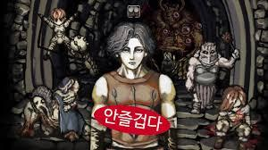
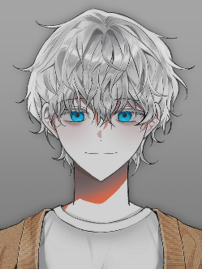
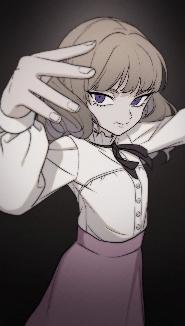
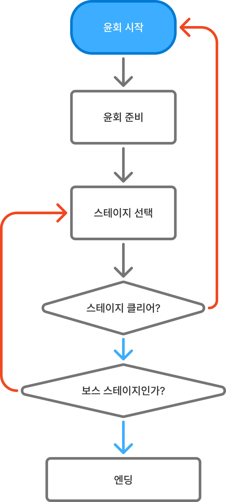
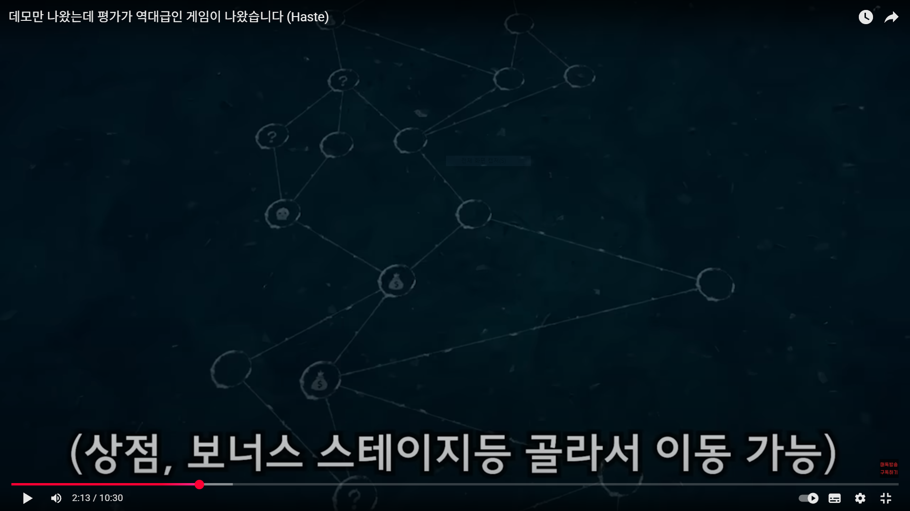
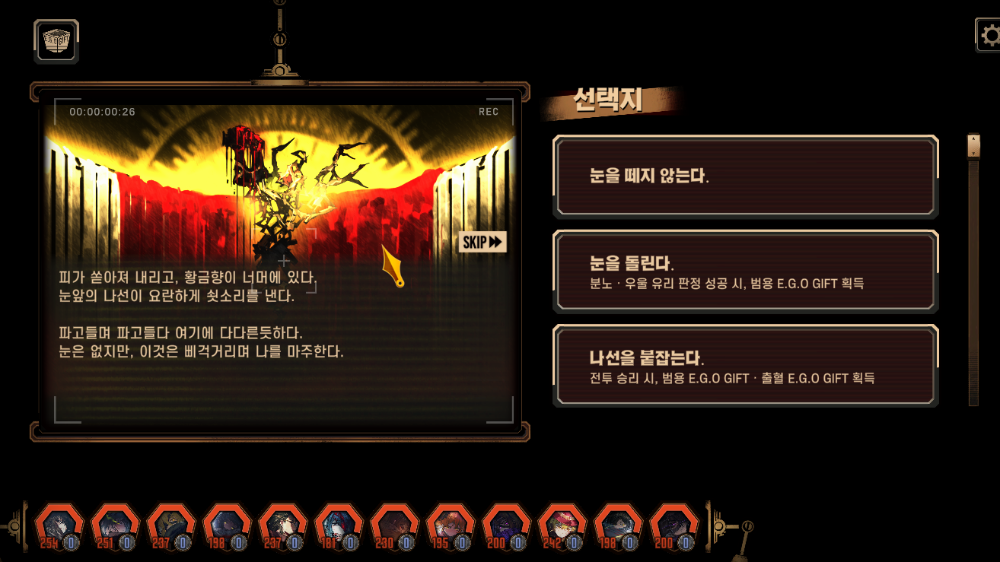
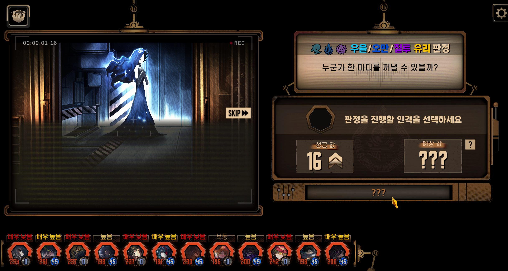
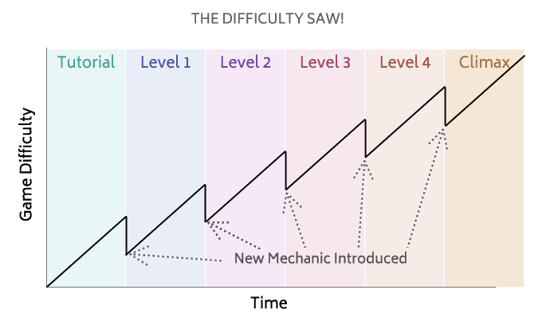
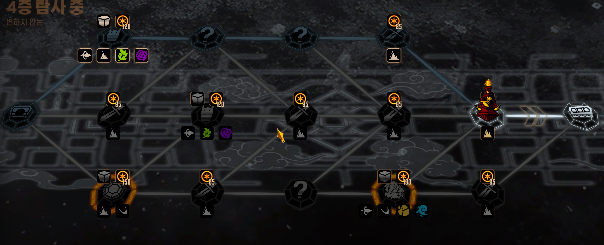

# 아르카나게임컨셉기획_V2_장보성

**아르카나**

작성자: 장보성

Team: Light life

학번: 202313190

전화번호: 010-5617-3724

**변경 내용**

**목차 **

## 문서 개요

프로젝트의 방향성을 지정하고 정리하기 위한 문서이다.

## 프로젝트 개요

**프로젝트명**

아르카나

**장르**

2D, 로그라이트

턴제 전략 게임

**플랫폼**

PC

해당 내용은 핵심 가치 목표 BM 따라 수정될 수 있음

**타겟층**

20~30대의 캐주얼 게이머

카드게임에 익숙하며 목표를 클리어 할때의 쾌감을 좋아하는 도전적인 플레이어

캐릭터의 성장 및 더 효율적으로 보스를 클리어하는 도전적인 플레이어

**예상 플레이 타임**

최소 15분~ 최대 20분 (20분 이내 최종 보스를 클리어 할 수 있어야 함)

**핵심 재미요소**

전투 안에서 전략이 나오게 함!!!!!

카드 사용 / 턴 운영 / 시너지 / 판단

캐릭터가 윤회하며 더욱 강해지는 **육성의 재미**

플레이어의 선택에 따라 달라지는 결과를 보는 **인지적 재미**

보스 및 어려운 도전을 클리어하는** 쾌감**

## 개발방향과 게임 특징

**핵심 개발 방향**

전략의 재미

플레이어가 전략을 짜 실행하는 인지적 재미요소를 느낄 수 있게 함

단순화

간단한 조작으로 전투를 진행할 수 있어야 함

카르마

플레이 중 게임오버가 되면 이전 윤회의 영향을 부여

운명

운명에서 벗어나거나 선택에 따라 전투나 사건의 결과가 바뀌는 역할

**전투의 기본 개념**

턴제 전투 시스템

스킬과 선택을 통해 결과를 봄 

플레이어가 **플레이한 행동**에 따라 이득 제공

패시브 키워드등 전략적인 고려 요소 제공

## 세계관 컨셉

**기획의도**

턴제 특성의 플레이어의 선택을 운명을 깨부수는 캐릭터의 행동과 몰입할 수 있도록 설계

**내용**

운명으로 모든 미래가 지정되는 세계

**키워드**

**아르카나, 해방(운명 부수기!), 윤회**

**금지된 톤**

**너무 가벼운 유치 찬란한 분위기 금지!!!**

> 이미지는 게임 기획 문서의 일부로 보이는 일러스트입니다. 이미지 중앙에는 노란색과 갈색 머리장식을 한 소녀가 그려져 있습니다. 소녀는 노란색 리본이 달린 노란색과 갈색 머리장식을 하고 있습니다. 머리장식은 소녀의 이마와 귀 위에 위치하고 있습니다. 소녀의 머리카락은 노란색과 갈색입니다. 눈은 보라색과 파란색이며 눈동자는 하트 모양입니다. 볼에는 분홍색 블러셔가 그려져 있습니다.

소녀는 노란색과 흰색 옷을 입고 있습니다. 옷에는 노란색 버튼이 있습니다. 배경은 하늘색입니다.

**너무 고어, 인육 장기자랑 금지! 자세한 묘사는 금지!!!**

> 이미지는 게임 기획 문서의 일부로, 한 남자가 중앙에 서 있고 그 뒤로 여러 캐릭터가 그 뒤에 서 있는 모습이 그려져 있습니다.

중앙에 있는 남자는 긴 회색 머리를 가지고 있으며, 짙은 회색 눈썹에 짙은 갈색의 눈동자를 가지고 있습니다. 남자는 두꺼운 가죽 갑옷을 입고 있습니다. 남성의 오른쪽 팔에는 가죽 갑옷이 찢어져 있으며, 오른쪽 귀에 피어싱을 한 것으로 보입니다. 남성의 가슴에는 붉은색의 타원이 겹쳐져 있고, 그 안에는 흰색의 한글이 적혀 있습니다. 

남성의 왼쪽에는 파란색 옷을 입은 남성이 무릎을 꿇은 채로 앉아 있습니다. 이 남성의 얼굴에는 긴 수염이 나 있습니다. 이 남성의 오른쪽에는 등에 커다란 무기를 메고 있는 남성이 있습니다. 이 남성의 얼굴은 보이지 않습니다. 

남성의 오른쪽에는 주먹을 불끈 쥐고 있는 남성이 있습니다. 이 남성은 근육질에 통통한 체형을 가지고 있습니다. 이 남성의 뒤로는 돌로 쌓아 만든 벽이 있습니다. 벽에는 여러개의 해골이 그려져 있습니다. 

중앙에 있는 남성의 발 앞에는 돌로 만들어진 계단이 있습니다. 계단 위로도 돌로 쌓아 만든 벽이 양쪽으로 존재하며, 계단 위에는 여러개의 해골이 그려진 큰 문이 존재합니다. 

이미지 하단에는 흰색의 여백이 있습니다.

**예외처리**

**슬퍼도 됨**

## 시놉시스(추후에 작성내용!)

**시놉시스**

플레이어가 운명이 정해진 세계의 윤회를 끊어내고 운명을 부수려는 스토리

**사건**

사건

**세계관 및 분위기**

세계관: 

문화적: 운명이 정해져 있는 판타지 세계

소규모 도시 국가들의 느슨한 연합

윤회를 통해

**문화적**

세계관: 

문화적: 운명이 정해져 있는 판타지 세계

## 캐릭터 컨셉

**주인공(플레이어 캐릭터)**

임시] 플레이어는 운명이 정해진 세계를 부수려는 인물 

**키워드**

**Wheel Of Fortune**

**성격**

순종적인 성격에서(정방향) → 스스로 변화 하려 결심하는 (역방향)

**주인공 목표 **

아르카나** **「THE WORLD」를 파괴하여
‘정해진 운명의 세계’이라는 개념 자체를 무너트리는 역할

**그래픽 컨셉**

넓은 타겟층으로 몰입하기 위한 중성적(여성에 가까운)인 외관을 가진 캐릭터

> 해당 이미지에는 한 남성의 상반신이 그려져 있습니다.

*   **인물:** 짧은 백금색 머리와 파란 눈을 가진 남성 캐릭터가 묘사되어 있습니다. 
*   **의상:** 남자는 민트색 티셔츠를 입고 그 위에 베이지색 후드티를 입고 있습니다. 
*   **배경:** 배경은 단조로운 회색입니다. 
*   **묘사:** 남자의 얼굴과 상체는 선명한 반면, 하체는 잘려나간 모습입니다.

> 이미지는 애니메이션 스타일의 캐릭터 일러스트입니다. 

### 캐릭터 묘사

*   **캐릭터:** 여성 캐릭터가 묘사되어 있습니다.
*   **머리 색상:** 옅은 갈색
*   **머리 스타일:** 긴 머리이며, 머리의 왼쪽에는 검은색 리본이 묶여 있습니다.
*   **눈 색상:** 보라색
*   **의상:** 
    *   흰색 블라우스에 회색 띠가 있고, 보라색 치마를 입고 있습니다.
    *   목에는 하얀색 깃이 있습니다.

### 포즈 및 표정

*   **손:** 오른손을 들어 손가락 세 개를 펴서 위협하는 듯한 포즈를 취하고 있습니다.
*   **표정:** 입꼬리가 올라가 있어 약간 웃는 듯한 표정을 하고 있습니다.

### 배경

*   **색상:** 배경은 검은색이며, 캐릭터 머리 뒤쪽에 밝은 회색 그라데이션이 적용되어 있습니다.

### 종합

*   이 일러스트는 게임 기획 문서의 일부로 사용될 수 있는 캐릭터 이미지입니다. 캐릭터의 디자인과 표정이 자세히 묘사되어 있습니다.

**캐릭터 변화**

순종적인 성격에서(정방향) → 스스로 변화하려 결심하는 (역방향)

**NPC**

**조력자**

임시] 플레이어는 운명이 정해진 세계를 부수려는 인물 

**키워드**

**미정**

**
적대적 NPC**

**최종 보스: 「THE WORLD」**

아르카나 세계 그 자체

모든 윤회를 관장하는 존재

최종 보스를 클리어하며 이존 운명으로 결정되는 세계를 부숴 신세계의 제작 가능성을 만드는 엔딩으로 사용하기 적합함

**전투 특징(임시)**

카드 덱 자체를 재구성

윤회로 전 보스나 스킬등의 공격 수단으로 사용

플레이어의 과거 선택을 재현

** 캐릭터 종류**

각 캐릭터는 종족이 분류되어 해당하는 종류에 따라 특성 및 행동 패턴 부여

## 플레이 컨셉

**전투 안에서 전략이 나오게 무게를 둠**

카드 사용 / 턴 운영 / 시너지 / 판단

**로그라이트의 전투 밖에서의 전략**

**간략하게 **

**윤회 플로우 차트**

> 이 게임 기획 문서의 이미지는 게임의 흐름도를 나타내고 있습니다. 이미지의 구조와 각 요소를 상세하게 설명해 드리겠습니다.

1. **흐름도 시작 부분 (파란색 버튼)**
   - **위치**: 이미지의 상단 중앙에 위치해 있습니다.
   - **모양**: 둥근 사각형입니다.
   - **텍스트**: "운영 시작"이라는 텍스트가 내부에 포함되어 있습니다.
   - **화살표**: 오른쪽으로 향하는 빨간색 화살표가 있습니다.

2. **운영 준비**
   - **위치**: 파란색 버튼 아래에 위치해 있습니다.
   - **모양**: 사각형입니다.
   - **텍스트**: "운영 준비"라는 텍스트가 내부에 포함되어 있습니다.
   - **화살표**: 아래로 향하는 회색 화살표가 있습니다.

3. **스테이지 선택**
   - **위치**: "운영 준비" 아래에 위치해 있습니다.
   - **모양**: 사각형입니다.
   - **텍스트**: "스테이지 선택"이라는 텍스트가 내부에 포함되어 있습니다.
   - **화살표**: 아래로 향하는 회색 화살표가 있습니다.

4. **스테이지 클리어?**
   - **위치**: "스테이지 선택" 아래에 위치해 있습니다.
   - **모양**: 사다리꼴 (아래로 갈수록 넓어짐)입니다.
   - **텍스트**: "스테이지 클리어?"라는 질문 형태의 텍스트가 내부에 포함되어 있습니다.
   - **화살표**: 아래로 향하는 파란색 화살표와 오른쪽으로 향하는 주황색 화살표가 있습니다.

5. **보스 스테이지인가?**
   - **위치**: "스테이지 클리어?" 아래에 위치해 있습니다.
   - **모양**: 사다리꼴 (아래로 갈수록 넓어짐)입니다.
   - **텍스트**: "보스 스테이지인가?"라는 질문 형태의 텍스트가 내부에 포함되어 있습니다.
   - **화살표**: 아래로 향하는 파란색 화살표가 있습니다.

6. **엔딩**
   - **위치**: "보스 스테이지인가?" 아래에 위치해 있습니다.
   - **모양**: 사각형입니다.
   - **텍스트**: "엔딩"이라는 텍스트가 내부에 포함되어 있습니다.
   - **화살표**: 없음

7. **화살표 경로**
   - **주황색 화살표**: 이미지의 왼쪽을 따라 위로 올라가며, "운영 시작"으로 돌아오는 경로를 나타냅니다.
   - **회색 화살표**: 각 단계 사이의 진행 경로를 나타냅니다.
   - **파란색 화살표**: 질문에 따라 진행 경로를 나타냅니다.

이 흐름도는 게임이 시작되고, 스테이지를 선택하여 클리어한 후, 보스 스테이지인지 확인하고 엔딩으로 마무리되는 과정을 나타내고 있습니다.

**플레이어****는 다음 할 스테이지 ****선택****함**

> 이미지는 동영상 플레이어 화면입니다.

상단에는 흰색의 텍스트가 있습니다. "데모만 나왔는데 평가가 역대급인 게임이 나왔습니다 (Haste)"라고 적혀 있습니다.

화면 중앙에는 회로처럼 생긴 도형이 있습니다. 여러 개의 원이 선으로 연결되어 있습니다. 원 안에는 일부 질문표시, 달러 표시, 저울 표시가 그려져 있습니다.

화면 하단에는 "(상점, 보너스 스테이지등 골라서 이동 가능)"이라는 텍스트가 회색으로 표시되어 있습니다.

화면 하단에는 플레이어 컨트롤러가 있습니다. 플레이어 바의 시간은 2:13/10:30입니다. 플레이어 바 왼쪽에는 플레이 버튼과 음소거 버튼이 있고, 오른쪽에는 설정 버튼, 전체 화면 버튼, 닫기 버튼이 있습니다.

화면 상단 오른쪽에는 시계와 방향키가 있습니다.

화면 오른쪽 하단에는 빨간색 텍스트가 있습니다. 내용은 "마무리" "구독하기"입니다.

**스테이지를 ****진행해나가며 중간 중간 지정된**** 보스전 준비****함**

**중간에 게임 오버 시 윤회 스테이지로 처음 초기화됨 **

**전 윤회에서 얻은 능력치의 일부 돌려받음**

**플레이어의 최종목표**

최종 보스 클리어

**내용**

등장 할 이벤트에 따라 각 스테이지는 종류가 분류됨

캐릭터별 독립 진행도 및 저장 (주인공과의 유대감 등…)

**접근성**

스테이지 클리어 할 다음 진행할 스테이지를 선택

**예외처리**

각 스테이지 종류는 확률적으로 등장할 수 있다. 

사건은 선택지를 주고 플레이어 선택에 따라 캐릭터를 성장, 변형 하는 방식. 

> 해당 이미지는 게임의 이벤트 혹은 퀘스트 진행에 관한 선택지를 보여주는 게임 화면입니다.

상단 왼쪽에는 동영상 재생창이 있습니다. 재생 시간은 26초로, 재생 버튼과 시계가 표시되어 있습니다. 우측 상단에는 'REC'라고 쓰여진 버튼이 있습니다. 화면 중앙에는 선택지가 있습니다.

*   눈을 뜯지 않는다
*   눈을 뜬다
*   나선을 붙잡는다 

선택지 옆에는 각 선택지에 대한 설명이 있습니다.

화면 하단에는 10개의 아이콘이 나열되어 있습니다. 각 아이콘에는 숫자가 표시되어 있습니다.

아이콘의 이미지는 캐릭터의 모습으로 추정되며, 숫자는 캐릭터의 레벨이나 포인트를 나타낼 수 있습니다.

아이콘은 원형의 테두리와 함께 육각형의 형태로 표시되어 있습니다.

아이콘의 앞부분에는 캐릭터의 모습이 그려져 있고, 뒤에는 숫자가 적혀 있습니다.

아이콘의 색깔은 주황색과 회색으로 구분됩니다.

주황색 아이콘은 6개이고 회색 아이콘은 4개입니다.

아이콘의 크기는 동일하며, 가로로 나란히 배치되어 있습니다.

화면의 배경은 검은색이며, 선택지와 아이콘에는 금색 테두리가 있습니다.

전체적으로 게임의 진행 상황을 보여주는 화면으로, 플레이어는 선택지를 선택하여 게임의 진행 방향을 결정할 수 있습니다.

> 이미지는 게임의 한 화면으로, 여러 가지 UI 요소와 캐릭터가 포함되어 있습니다.

상단 왼쪽에는 에피소드(Epi. Diff) 로고가 있고, 상단 중앙에는 타임 코드(00:00:01:16)가 표시되어 있습니다. 화면 왼쪽에는 큰 비디오 화면이 있습니다. 화면에는 한 여성이 등장합니다. 여성은 긴 머리를 가지고 있고, 긴 옷을 입고 있습니다. 배경은 어둡고, 벽에 금속 문이 있습니다. 비디오 화면 오른쪽 상단에는 빨간색 원과 REC 표시가 있습니다. 비디오 화면 아래에는 'SKIP' 버튼이 있습니다.

화면 오른쪽 상단에는 여러 아이콘과 함께 '우울/오만/절투 유리 판단'이라는 텍스트가 있습니다. 그 아래에는 '누군가 한 마디를 꺼낼 수 있을까?'라는 문구가 있습니다.

그 아래에는 '판정을 진행할 인격을 선택하세요'라는 텍스트가 있습니다. 그리고 두 개의 상자가 나란히 있습니다. 왼쪽 상자에는 '성공 값 16↑'라는 텍스트가 있고, 오른쪽 상자에는 '예상 값 ???'라는 텍스트가 있습니다.

화면 하단에는 여러 캐릭터의 프로필 사진이 나열되어 있습니다. 각 프로필 사진에는 이름과 숫자가 표시되어 있습니다. 프로필 사진은 12개이며, 각 사진 위에는 '매우 낮음', '매우 높음' 등의 텍스트가 표시되어 있습니다.

화면 하단 중앙에는 '???'이라는 텍스트가 있는 빈 입력란이 있습니다.

특별한 사건 노드가 더욱 적은 확률로 스테이지 선택 중 등장할 수 있다.

특별한 사건은 선택지를 주고 플레이어 선택에 따라 캐릭터를 크게 성장, 큰 변형 할 수 있는 방식.

## 플레이 경험 곡선

**기획의도**

**빠른 시간 내에 플레이어가 몰입을 할 수 있어야 함 **

**각 중간보스 단계를 넣어 해당보스를 클리어하는 재미 **

**클리어 할 때의 도파민을 느낄 수 있는 난이도 **

**특정한 단계별로 증가하는 플레이 난이도 **

> ## 이미지 분석

해당 이미지는 게임 난이도 곡선을 표현하고 있습니다. 영어 명칭은 'THE DIFFICULTY SAW!'이며, 게임 난이도와 시간에 따른 레벨의 흐름을 그래프로 나타내고 있습니다.

### 그래프 레이아웃

*   가로축: 시간(Time)
*   세로축: 게임 난이도(Game Difficulty)

### 그래프 구조

*   그래프는 Tutorial, Level 1, Level 2, Level 3, Level 4, Climax로 구성되어 있습니다.
*   각 레벨은 서로 다른 색상으로 표시되어 있습니다.
    *   Tutorial: 연한 청록색
    *   Level 1: 연한 보라색
    *   Level 2: 연한 분홍색
    *   Level 3: 연한 복숭아색
    *   Level 4: 연한 주황색
    *   Climax: 베이지색
*   검은 실선은 게임 난이도의 전반적인 상승세를 나타냅니다.
*   검은 점선은 새로운 메커니즘(New Mechanic Introduced)이 도입될 때마다 게임 난이도가 일시적으로 감소하는 것을 보여줍니다.

### 그래프의 의미

*   그래프는 게임의 난이도가 시간에 따라 어떻게 변하는지 보여줍니다.
*   게임의 난이도는 Tutorial부터 Climax까지 전반적으로 증가합니다.
*   각 레벨에서 새로운 메커니즘이 도입될 때마다 게임 난이도가 일시적으로 감소했다가 다시 증가합니다.

### UI 요소

*   그래프의 제목: THE DIFFICULTY SAW!
*   x축 레이블: Time
*   y축 레이블: Game Difficulty
*   레벨 레이블: Tutorial, Level 1, Level 2, Level 3, Level 4, Climax

### 아이콘

*   그래프에 아이콘은 없습니다.

### 캐릭터

*   그래프에 캐릭터는 없습니다.

### 텍스트

*   그래프에는 다음과 같은 텍스트가 포함되어 있습니다.
    *   THE DIFFICULTY SAW!
    *   Tutorial
    *   Level 1
    *   Level 2
    *   Level 3
    *   Level 4
    *   Climax
    *   Game Difficulty
    *   Time
    *   New Mechanic Introduced

**중간 보스전을 등장시켜 클리어 시 쾌감**

**특정한 단계마다 보스를 등장시켜 도전을 클리어****했을 때**** 도파민****으로 재미요소 확보**

아이템이나 확보나 사건을 해결하며 보스를 쓰러트리기 위한 준비 

> 이미지는 게임의 맵을 보여주고 있습니다. 

### 이미지의 레이아웃 및 구조

이미지는 여러 아이콘과 노드로 구성된 네트워크 같은 구조를 나타내고 있습니다. 

*   화면 왼쪽 상단에는 **4종 탐사중**이라는 타이틀과 **변하지 않는**이라는 부제가 있습니다.
*   화면 상단에는 여러 아이콘과 숫자가 있습니다. 
    *   노드로 이어진 선 위에 **120**이라는 숫자가 적혀있는 네모 아이콘과 불꽃, 식물, 보라색 구체 모양의 아이콘이 있습니다. 
    *   선의 중앙에는 물음표가 그려진 아이콘이 있습니다. 
*   화면 중앙에는 여러 개의 노드가 있습니다. 
    *   각 노드는 육각형이며, 노드의 중앙에는 **85** 혹은 **120**, **150**, **180**의 숫자가 노란색 원안에 적혀있습니다. 
    *   노드에는 불꽃, 책, 깃털 등의 아이콘이 있습니다. 
*   화면 하단에는 3개의 노드가 있습니다. 
    *   노드의 숫자는 모두 **85**이며, 책, 불꽃, 깃털 등의 아이콘이 있습니다. 
*   화면 오른쪽에는 노드와 연결된 파이프라인이 있고, 파이프 라인의 끝에 **라이터** 모양의 캐릭터가 있습니다. 
*   화면 오른쪽 상단에는 **스피커** 모양의 아이콘이 있습니다. 

### 이미지의 아이콘

아이콘은 다음과 같습니다.

*   노드 
*   책 
*   불꽃 
*   깃털 
*   라이터 
*   스피커 
*   물음표 
*   노란색 원 
*   보라색 구체 
*   식물 
*   숫자 

### 이미지의 텍스트

텍스트는 다음과 같습니다.

*   **4종 탐사중** 
*   **변하지 않는** 
*   **85** 
*   **120** 
*   **150** 
*   **180**

**반복된 전투의 지루함 해소 목표로 중간 보스 종류는 랜덤확률로 등장시킴**

## 제작 범위 & 확장 가능성

**제작범위**

주인공 캐릭터 3종, 조력자(튜토리얼) 캐릭터 1종, 추가 캐릭터 1종 

 윤회 시스템

중간 보스 캐릭터 2종, 최종 보스 캐릭터 1종 

중간 보스 캐릭터 2종과 최종 보스 캐릭터 1종의 스킬 구현. 

최종 보스 1종의 궁극기 구현 

캐릭터 당 스킬 1개씩, 궁극기 1개씩  총 4가지 스킬과 궁극기 4개 구현. 

모든 스킬과 궁극기의 역방향 버전의 효과 구현 

대체할 수 있는 추가 스킬 3종과 스킬의 역방향 버전의 효과 구현 

| 일시 | 작업자 | 변경 사항 |
| --- | --- | --- |
| 2026.01.22 | 장보성 | 초기컨셉기획서작성시작 |
| 2026.01.26 | 장보성 | 초기컨셉기획서작성 |
