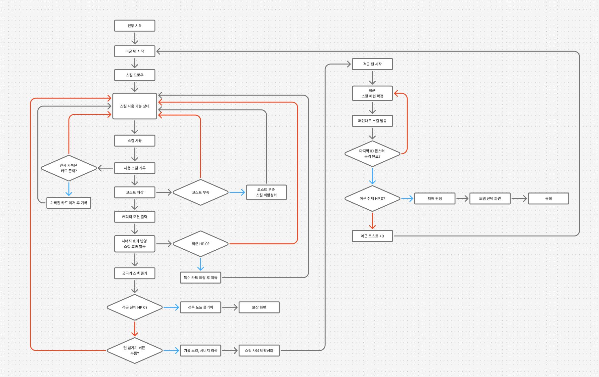
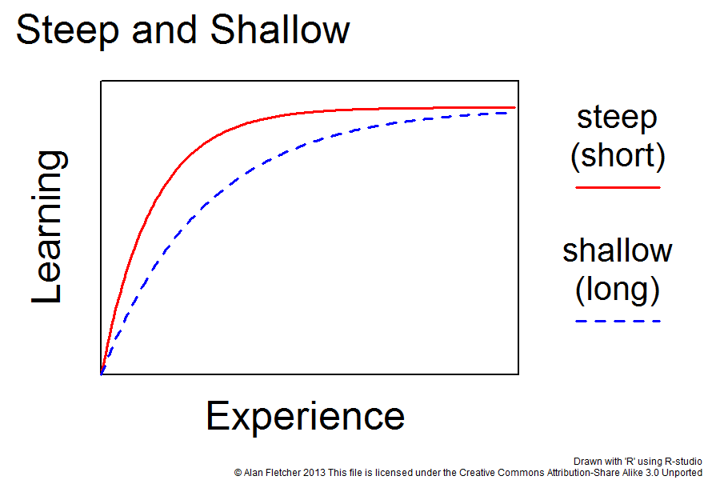
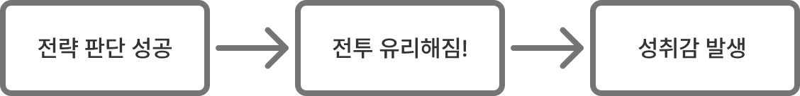
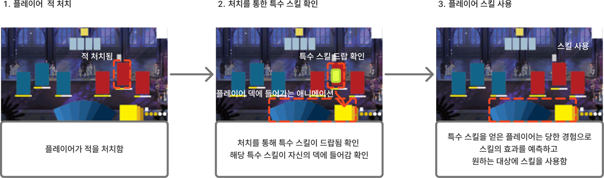
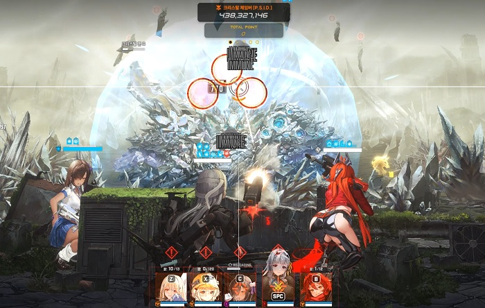

# 전투컨셉기획서_V4_장보성

## 슬라이드 1

전투 컨셉 기획서

Light life 202313190 장보성

---

## 슬라이드 2

**변경사항**

변경된 내용 정리

| 일시 | 작업자 | 변경 사항 |
| --- | --- | --- |
| 2026.03.08 | 장보성 | 컨투 컨셉 기획 방향성 작성 |
| 2026.03.09 | 장보성 | 플레이어 전투 경험 기획 |
| 2026.03.10 | 장보성 | 전투내의 재미요소 및 전략의 재미를 위한 전략 추가요소 |
| 2026.03.11 | 장보성 | 전투의 탬포 및 게임 컨셉 특성에 따른 게임의 컨셉 지정 |
| 2026.03.12 | 장보성 | 피드백 내용에 따른 수정 |

---

## 슬라이드 3

**문서 개요**

**게임의 핵심 콘텐츠인 전투의 컨셉을 지정하는 문서**

**전투 템포, 플레이 방식, 캐릭터 역할, 카드 구조를 통합적으로 설계한다.**

**전투 자체에서의 재미요소 따른 방향성 지정 문서!!!**

**전투 밸런싱은 따로 분리할 예정**

---

## 슬라이드 4

**전투 컨셉**

**불완전한 카드 드로우 속에서 덱 시너지와 전략 판단으로 매 턴 퍼즐을 해결하는 로그라이크 카드 전투 시스템**

**전투의 핵심**

  - 빠른 전투 템포
  - 랜덤으로 들어오는 덱
  - 캐릭터 중심 플레이
  - 카드 기반 전투
**핵심 전투 경험**

  - 매 턴 카드 선택 → 전략 실행 → 덱 성장
  - 랜덤 카드 획득을 통한 빌드 다양성
  - 보스 패턴 공략
---

## 슬라이드 5

**전투 내의 재미요소**

**전략을 짜는 재미**

  - **카드 드로우와 적 행동이 매 턴 달라짐=매 턴 새로운 전략 퍼즐을 해결하는 경험을 하게 된다.**
  - **제한된 카드와 에너지를 활용해 최적의 전략을 찾아가는 과정에서 발생한다.**
  - 자신의 전략을 통해 충분한 데미지나 원하는 결과가 나왔을 때의 재미
**성장을 직접적으로 느낄 수 있는 재미요소**

  - 노드를 진행을 통해 성장한 플레이어의 전투를 통해서 성장의 피드백을 받음
  - 사용 가능한 코스트 등이 늘어남으로 자신의 턴에 여러 번 딜을 넣는 자유로움
---

## 슬라이드 6

**전투 핵심 구조**

**전투내에 일어나는 플로우 차트**

아군 코스트 획득

> 이 문서는 게임 기획 문서의 일부로, 게임의 전투 시스템을 설명하는 플로우차트입니다. 

문서의 레이아웃과 구조는 다음과 같습니다.

*   중앙에 큰 사각형이 있고, 그 안에 여러 사각형과 마름모, 화살표가 복잡하게 연결되어 있습니다.
*   사각형과 마름모에는 한글로 된 텍스트가 포함되어 있습니다.

문서의 세부적인 내용은 다음과 같습니다.

1.  **전투 시작**: 
    *   전투가 시작되면 아군과 적군의 턴이 시작됩니다. 
    *   아군의 스킬 드로우로 스킬 사용 가능 상태가 됩니다.
2.  **스킬 사용**: 
    *   스킬을 사용하기 전에 사용 스킬 기록을 확인하고, 비용을 차감합니다. 
    *   비용이 부족한 경우, 스킬을 사용할 수 없습니다. 
    *   스킬을 사용할 경우, 시너지 효과 반영과 스킬 효과 발동이 이루어집니다. 
    *   아군의 HP가 0이 되면 전투가 패배합니다.
3.  **적군 턴**: 
    *   적군의 스킬 패턴을 확인하고, 패턴대로 스킬을 발동합니다. 
    *   마지막 ID 몬스터 공격 여부를 확인하고, 공격을 완료합니다. 
    *   아군의 HP가 0이 되면 전투가 패배합니다.
4.  **전투 종료**: 
    *   전투가 종료되면, 보상 화면으로 이동합니다. 
    *   전투 결과에 따라 경험치, 아이템 등의 보상을 획득할 수 있습니다.

결론적으로, 이 문서는 게임의 전투 시스템을 설명하는 중요한 자료입니다.

---

## 슬라이드 7

**전투 경험 스토리보드**

플레이어의 경험을 예상하여 제작한 전투 스토리보드

#### 위 스토리보드를 반복하며 효율적인 카드 사용으로 쉬워지는 전투 중에도 성장하는 느낌

#### 플레이어에게 지속적인 몰입감과 사고 기반 재미를 제공한다.

#### 자신의 판단이 전투 결과에 직접 영향을 미친다는 느낌을 받아야 함

#### 구조에 따른 재미요소(인지적 재미요소)

#### 전투 종료까지 반복

> 이미지는 게임 기획 문서의 일부로, 게임의 플레이 흐름을 단계별로 설명하고 있습니다. 이미지의 레이아웃은 6개의 동일한 구성 요소가 가로로 나열되어 있습니다. 각 구성 요소는 상단에는 게임 화면이 있고 하단에는 설명 텍스트가 포함된 흰색 박스로 구성되어 있습니다.

각 게임 화면은 동일한 배경을 공유하며, 막대 그래프, 부채꼴 그래프 및 여러 색상의 막대가 포함되어 있습니다. 막대 그래프와 부채꼴 그래프는 빨간색 테두리로 강조 표시되어 있습니다. 또한, 화살표 및 원과 같은 그래픽 요소가 포함되어 있습니다.

1. **플레이어 적 조우**: 플레이어는 외관 정보를 확인합니다. 이 단계에서는 적의 수, 사용 스킬 유형, 갖수 파악이 이루어집니다.

2. **플레이어가 활용 가능한 상황 파악**: 플레이어는 현재 자신의 상황을 파악합니다. 보유한 스킬, 비용 갯수 파악이 이루어집니다.

3. **플레이어 전략 설계**: 주어진 정보로 전략을 설계합니다. 플레이어는 현재 상황에 따라 사용할 스킬, 대상 등을 우선 순위 판단합니다.

4. **플레이어 스킬 사용**: 정보를 얻은 플레이어는 사용할 스킬을 드래그한 다음 드래그로 적에게 직접 입력합니다.

5. **플레이어 결과 출력**: 플레이어가 사용한 스킬에 따른 연출과 결과를 보여줍니다.

6. **플레이어 결과 확인 및 전략 재구상**: 결과에 따른 전략 수정이 이루어집니다. 행동 이후 결과에 따라 현재 상황을 파악 후 다음 사용할 스킬 등 전략 수정 및 재구상이 이루어집니다.

이 단계들은 플레이어가 게임에서 적을 조우하고, 전략을 설계하여 스킬을 사용하며, 결과를 확인하고 전략을 수정하는 과정을 나타냅니다.

> 해당 이미지는 게임 기획 문서의 일부로 사용된 그래프입니다. 

## 이미지 레이아웃

이미지는 다음과 같은 레이아웃을 가지고 있습니다.

- 제목: 이미지 상단 중앙에 **'Steep and Shallow'** 라는 큰 제목이 있습니다.
- 그래프: 이미지 중앙에 **'경험치(Experience)'** 와 **'숙련도(Learning)'** 축을 가진 그래프가 있습니다.
- 범례: 그래프 우측에 빨간색 실선과 파란색 점선에 대한 범례가 있습니다.
- 저작권: 이미지 하단에 저작권에 대한 정보가 있습니다.

## 그래프

그래프는 두 개의 곡선을 보여줍니다.

- 빨간색 실선: **'steep (short)'** 으로 표시된 곡선은 초기의 급격한 상승세를 보이며 빠르게 증가하다가 곧 수평선에 가까워집니다. 
- 파란색 점선: **'shallow (long)'** 으로 표시된 곡선은 비교적 완만한 상승세를 보이며, 천천히 증가하여 더 오랜 기간에 걸쳐 높은 수준에 도달합니다.

## 텍스트

- 제목: **'Steep and Shallow'** 
- 축 라벨: 
  - y축: **'Learning'** 
  - x축: **'Experience'**
- 범례: 
  - **'steep (short)'** 
  - **'shallow (long)'**
- 저작권 정보: 
  - **'Drawn with 'R' using R-studio'**
  - **'© Alan Fletcher 2013 This file is licensed under the Creative Commons Attribution-Share Alike 3.0 Unported'**

## 구조

- 그래프는 경험치에 따른 숙련도의 증가를 나타냅니다.
- 빨간색 실선은 짧은 기간 내에 급격한 학습 증가를 보여주고, 파란색 점선은 더 긴 기간에 걸쳐 서서히 학습이 증가하는 것을 나타냅니다.

---

## 슬라이드 8

**특수 카드 경험**

**적을 처치한 보상으로서 주어지는 비영구적인 무료 카드다.**

**특수 카드로 플레이어 목표 경험**

  - 적을 처치한 보상에 대한 만족감
  - 처치를 통해 떨어지는 추가적인 공격수단으로서 전략요소
  - 시너지 조합을 자유롭게 이용 가능해 시너지 조합이 더 쉬워지는 보상
  - 자신이 싫어하는 적의 카드를 그대로 적에게 되돌려주는 복수를 통한 쾌감

> 이미지는 게임 기획 문서의 일부로, 플레이어의 적 처치, 특수 스킬 획득, 그리고 스킬 사용에 이르는 과정을 순서대로 보여 주고 있습니다. 이미지의 레이아웃과 구조를 설명하고, 포함된 모든 텍스트, 다이어그램, UI 요소, 캐릭터, 아이콘 등을 상세하게 기술하겠습니다.

### 이미지 레이아웃 및 구조

이미지는 세 개의 동일한 게임 환경 화면으로 구성되어 있으며, 각 화면은 플레이어의 행동과 그에 따른 결과를 순서대로 나타내고 있습니다. 각 화면의 왼쪽 상단에는 순서 번호가 표시되어 있습니다.

1. **플레이어 적 처치**
2. **처치를 통한 특수 스킬 확인**
3. **플레이어 스킬 사용**

각 화면은 게임 화면과 텍스트 설명 영역으로 나뉘어져 있습니다.

### 게임 화면

각 게임 화면은 동일한 배경을 가지고 있으며, 여러 개의 기둥이 있는 어두운 실내 공간으로 설정되어 있습니다. 바닥에는 여러 개의 블록이 배치되어 있고, 그 위에 플레이어와 적이 표현되어 있습니다.

### 텍스트 설명 영역

각 게임 화면 아래에는 해당 화면의 상황을 설명하는 텍스트가 포함된 화이트 박스가 있습니다.

### 세부 요소 설명

1. **첫 번째 화면: 플레이어 적 처치**
   - **텍스트:** "플레이어가 적을 처치함"
   - **화면 요소:**
     - 여러 개의 블록이 바닥에 배치되어 있음.
     - 플레이어와 적이 표현되어 있음.
     - 붉은색으로 강조된 영역이 적을 나타내고 있음.
     - 강조된 영역 아래에 노란색, 하얀색, 노란색의 작은 막대가 표현되어 있음.

2. **두 번째 화면: 처치를 통한 특수 스킬 확인**
   - **텍스트:** "처치를 통해 특수 스킬이 드랍됨 확인, 해당 특수 스킬이 자신의 덱에 들어감 확인"
   - **화면 요소:**
     - 첫 번째 화면과 동일한 배경과 블록 배치.
     - 노란색으로 강조된 영역이 특수 스킬을 나타내고 있음.
     - 강조된 영역 아래에 노란색, 하얀색, 노란색의 작은 막대가 표현되어 있음.
     - 플레이어의 덱에 특수 스킬이 추가되는 애니메이션이 표현되어 있음.

3. **세 번째 화면: 플레이어 스킬 사용**
   - **텍스트:** "특수 스킬을 얻은 플레이어는 당한 경험으로 스킬의 효과를 예측하고 원하는 대상에 스킬을 사용함"
   - **화면 요소:**
     - 첫 번째 화면과 동일한 배경과 블록 배치.
     - 플레이어가 특수 스킬을 사용한 상태로 표현되어 있음.
     - 강조된 영역과 노란색, 하얀색, 노란색의 작은 막대가 표현되어 있음.

### 아이콘 및 UI 요소

- 아이콘은 별도로 표시된 것은 없지만, 게임 화면 내의 블록과 강조된 영역이 중요한 UI 요소로 작용하고 있습니다.
- 각 화면의 강조된 영역(붉은색, 노란색)은 중요한 게임 요소로 사용되고 있습니다.

### 캐릭터

- 플레이어와 적이 각 화면에 표현되어 있으며, 이들의 행동에 따라 화면이 전환됩니다.

이 이미지는 플레이어가 적을 처치하고, 그 과정에서 특수 스킬을 획득하여 사용하는 과정을 시각적으로 설명하고 있습니다. 각 단계의 텍스트 설명과 게임 화면이 순서대로 배열되어 있어, 게임의 흐름을 이해하기 쉽게 구성되어 있습니다.

---

## 슬라이드 9

**전투 내의 전략**

**불완전한 카드 드로우 속에서 덱 시너지와 전략 판단으로 매 턴 퍼즐을 해결하는 전투 시스템**

카드 덱을 기반으로 전투 전략을 구성함 확률·전략·자원관리를 핵심 플레이 요소로 삼는다.

  - 플레이어가 전략을 짜 효율적으로 승리 하는 걸 목표로 삼게 함
**전략을 통한 재미요소**

  - 전투 자체에서 전략을 짜게 하여 빠른 몰입감을 느끼게 함
  - 전투내의 전략으로 플레이어는 인지적 재미를 느낌
**전투내의 고려할 전략요소**

  - 현재 사용 가능한 카드
  - 코스트 관리, 궁극기 게이지
  - 정방향 역방향의 스킬 사용 우선순위
---

## 슬라이드 10

**자원 설계**

**제한된 자원**

  - 플레이어는 해당 턴에 생성된 코스트내의 스킬을 사용할 수 있음
  - 제한된 코스트로 플레이어에게 전략적인 선택을 요구함
**후반의 용도**

  - 코스트가 늘어남에 따라 플레이어는 사용할 수 있는 스킬 종류가 늘어나며 더 많은 스킬을 사용 할 수 있게됨.
  - 플레이어는 더 자유롭게 스킬을 사용하며 플레이를 하기 원할 것 이며 성장의 보상으로 제공함
  - 전 윤회보다 자유로운 전투를 위해 윤회를 여러 번 하는 동력원이 된다.
---

## 슬라이드 11

**시너지**

**제한된 자원**

  - 플레이어는 해당 턴에 생성된 코스트내의 스킬을 사용할 수 있음
  - 제한된 코스트로 플레이어에게 전략적인 선택을 요구함
**후반의 용도**

  - 코스트가 늘어남에 따라 플레이어는 사용할 수 있는 스킬 종류가 늘어나며 더 많은 스킬을 사용 할 수 있게됨.
  - 플레이어는 더 자유롭게 스킬을 사용하며 플레이를 하기 원할 것 이며 성장의 보상으로 제공함
  - 전 윤회보다 자유로운 전투를 위해 윤회를 여러 번 하는 동력원이 된다.
---

## 슬라이드 12

**인지적 재미요소**

**랜덤으로 변하는 상황에 따라 예상하고 다른 전략을 짬**

  - 달라진 상황에 따라 성공적인 대처에 대한 피드백
  - 플레이어가 선택하고 그에 따른 결과를 받아 몰입감 높힘
  - 자신의 선택으로 어려운 도전을 클리어 함에 대한 카타르시스
#### 확률 요소

#### 전략을 짜고 결과를 확인함

> 이미지는 검은색 배경에 흰색으로 그려진 클립보드 아이콘입니다. 클립보드의 상단에는 클립 형태의 흰색 윤곽선이 있고, 클립보드 중앙에는 다음과 같은 흰색 도형이 그려져 있습니다.

*   왼쪽 상단: 흰색 원 안에 작은 검은색 원이 있음
*   중앙: 굽이치는 화살표가 아래에서 위로 향하고 있음
*   오른쪽 하단: 흰색 x자

클립보드 아이콘의 왼쪽과 오른쪽에는 라운드된 직사각형 모서리가 있습니다. 배경은 흰색입니다.

---

## 슬라이드 13

**RNG (전투내의 확률 요소) 설계**

**전투 내의 확률 요소**

  - 고정된 패턴을 없애 반복적인 플레이를 방지함
  - 보상 결과 등에 변화를 주어 플레이어가 계속 도전하게함
  - 고숙련도보다 운에 의한 성공 가능성을 제공해 초보자도 성취감을 느낌
  - 콘텐츠 소모 후에도 랜덤 보상 등으로 플레이어 유지함
**플레이 중 확률로 인해 얻는 (억까)불쾌감을 줄여야 함**

  - 스킬은 사용할 캐릭터의 스킬은 랜덤으로 제공함
  - 드로우 시 기본적으로 정방향으로 제공함
  - 플레이어가 자신의 선택으로 등장 확률에 변화를 주어 확실한 이득을 줌
**확률의 중요도**

운의 영향으로 인해 전략이 사라지는 걸 우선적으로 막음

#### 확률 요소

#### 운에 요소가 강해 전략에 무력감을

#### 느끼지 않도록

> 해당 이미지는 게임 기획 문서의 일부로 보이는 이미지입니다. 이미지는 주사위 1개를 3D로 표현한 모습을 담고 있습니다. 주사위는 정육면체이며, 정면과 그 옆면이 살짝 보이도록 기울어진 모습입니다. 주사위 면에는 하얀색 테두리와 함께 면에 따라 다른 개수의 검은 점이 찍혀있습니다.

주사위는 3차원 공간에 있는 정육면체로 표현되어 있으며, 각 면에는 점들이 찍혀 있습니다. 주사위의 위쪽 면에는 점이 4개 찍혀 있고, 아래쪽 면에는 점이 3개 찍혀 있습니다. 주사위 옆면에는 점이 1개 찍혀 있습니다. 주사위 면의 점들은 정해진 규칙에 따라 찍혀 있습니다.

주사위 옆면의 오른쪽에는 하얀색으로 테두리가 그려져 있습니다. 주사위 면의 점들은 모두 동일한 크기와 모양입니다.

이미지의 배경은 하얀색입니다.

---

## 슬라이드 14

**전투 UX 설계**

**UX/UI는 전투 이해도와 전략성을 크게 영향을 끼침**

  - 가장 중요한 것은 필요 정보 전달과 조작 편의성이 핵심!!!!
  - 플레이어가 매 턴 상황을 빠르게 이해하고 전략적 결정을 내릴 수 있도록 함
**정보 가독성**

  - 적 행동과 카드 효과를 직관적으로 이해 가능 해야함
**빠른 의사결정**

  - 드래그 앤 드랍으로 원하는 대상에 바로 스킬을 사용할 수 있게함
**전략 피드백**

  - 플레이어가 어떤 행동으로 어떤 결과가 나왔는지를 보여줘야 함
  - 스킬의 데미지 표시나 턴내에서 스킬 사용을 통한 코스트가 표기가 되어야 함
#### 정보에 정확한 이해

#### 플레이어가 매 턴 상황을 빠르게 이해하고 전략적 결정

> 이미지는 흰색 배경에 검은색 실루엣으로 표현된 사람의 머리 측면 그림입니다. 

머리 내부에는 흰색 선과 원으로 이루어진 도형이 가운데에 있고, 이를 중심으로 흰색 플러스 기호(+)가 머리 내부에 3개, 외부에 1개가 있습니다.

구체적으로 설명하면 다음과 같습니다.

*   **배경**: 배경은 순수한 흰색입니다.
*   **머리 실루엣**: 검은색으로 채워진 사람의 머리 측면 실루엣이 중앙에 위치해 있습니다. 턱과 머리 꼭대기부터 목 아래까지 포함된 모습입니다. 
*   **흰색 도형**: 머리 내부 중앙에는 3개의 흰색 원과 이를 연결하는 두 개의 선으로 이루어진 단순화된 분자 구조 또는 연결 네트워크를 상징하는 듯한 도형이 있습니다. 가운데 원과 위쪽 원은 하나의 선으로 연결되어 있고, 가운데 원과 아래쪽 원은 다른 선으로 연결되어 있습니다. 
*   **플러스 기호(+)**:

    *   머리 내부: 흰색 플러스 기호가 3개가 있습니다. 

        *   1개는 왼쪽 귀 위쪽에 있습니다.
        *   1개는 오른쪽 관자놀이 위쪽에 있습니다.
        *   1개는 머리 위쪽 중앙에 있습니다.
    *   머리 외부: 흰색 플러스 기호가 1개 있습니다.

        *   1개는 머리 왼쪽에 있습니다.

이러한 시각적 표현은 창의성, 혁신, 아이디어, 또는 기술과 관련된 컨셉을 상징하는 아이콘으로 사용될 수 있습니다.

---

## 슬라이드 15

**일반 전투 컨셉**

**단순 패턴 적**

  - 적은 이해하기 쉬운 패턴을 가지기에 연습장으로서 활용 가능한 스테이지
**덱 테스트 환경**

  - 보스전을 위한 전투시스템을 익혀가는 전투!!!!
  - 상대적으로 약한 적이기에  다양한 또는 공격적인 스킬로 처치할 수 있는 여유를 제공
**덱 성장 경험 제공**

  - 강해진 플레이어의 피드백을 보여주는 스테이지
  - 난 성장하고 있다!!! 라는 경험
---

## 슬라이드 16

**보스 전투 경험**

**패턴 기반 전투**

  - 보스는 여러 행동 패턴을 가진다.
  - 적에 맞춰서 공격 우선 순위, 스킬 순서 고려할 경우 더욱 쉽게 클리어 할 수 있게 함
**기획의도**

  - 시너지로만 적을 효과적으로 공격한다는 전투 자체의 단순화를 맞기 위함
  - 보스 처치로 더 큰 보상을 얻어 플레이어에게 강한 성취감을 제공용
**유의 사항**

  - 초반에 보스를 공략한다 자체를 이해하기 어려움 → 갑자기 높아진 난이도에 불쾌감
**해결방법(소거법으로 이중에 선택하면 됨)**

  - 초반 튜토리얼에 보스마다 약점이 있다는 사실
  - 보스 전투 전에 보스 특징을 미리 알려주는 시스템을 제공한다.
    - 전투 패턴 시각화 위험한 스킬은 화살표나 느낌표등 공격 대상이나 스킬 유형 표기
    - 약점 UI외곽 글로우로 표기등

> 이미지는 게임의 한 장면을 보여주고 있습니다. 게임 화면은 여러 캐릭터와 다양한 UI 요소로 구성되어 있습니다. 

* 화면 상단 중앙에는 검은색 배경에 주황색과 흰색 텍스트로 "실드 파괴형 몬스터 Lv.5,0"과 경험치 및 포인트를 나타내는 숫자가 표시되어 있습니다. 
* 화면 상단 오른쪽에는 "TOTAL POINT"와 "0"이라는 텍스트가 있습니다. 
* 화면 중앙에는 여러 개의 주황색 원이 겹쳐져 있는 그래픽이 있습니다. 
* 화면 중앙 하단에는 여러 캐릭터의 모습과 함께 체력 바가 표시되어 있습니다. 
* 화면 하단 중앙에는 다섯 명의 캐릭터가 나란히 서 있습니다. 각 캐릭터의 머리 위에는 문자와 숫자가 표시되어 있습니다. 
* 화면 왼쪽에는 짧은 갈색 머리를 가진 여성이 서 있고, 
* 화면 오른쪽에는 빨간 머리를 가진 여성이 큰 칼을 들고 있습니다. 
* 화면 중앙에는 큰 로봇이 서 있습니다.

전체적으로 이 게임은 전투 게임으로 보입니다.

---
