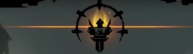
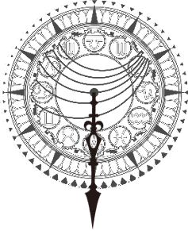

# 천칭컨셉기획서_V1_이채연

## 슬라이드 1

천칭 컨셉 기획서

이채연

---

## 슬라이드 2

천칭이란?

전투 노드에 진입 했을 때 화면 상단에 뜨는 수레바퀴(임시) 모양 시스템

플레이어가 역방향 카드를 사용하면 운명 저항 쪽으로 기울고

정방향 카드를 사용하면 운명 순응 쪽으로 기운다.

저항, 순응 방향에 각각 그라데이션으로 더월드 상징 색, 플레이어 상징색을 넣는다.

다키스트 던전 사기 시스템, 노 스트레이트 로드 락 앤 edm 시스템 레퍼런스

> 이 게임 기획 문서에 포함된 도면은 원형의 시계, 또는 천문학적 도구인 아스트롤라베(astrolabe)를 묘사하고 있습니다.

가장 바깥쪽 테두리에는 작은 삼각형 모양의 마커가 일정한 간격으로 배치되어 있습니다. 이 삼각형 마커들은 마치 시계의 시침, 분침을 나타내는 숫자 마커처럼 보이기도 합니다. 

안쪽으로 들어오면, 12개의 숫자가 원형으로 표시된 영역이 있습니다. 숫자들은 1부터 12까지 순서대로 배열되어 있으며, 각각의 숫자 옆에는 다양한 기호나 아이콘이 함께 그려져 있습니다. 이 기호들은 각 숫자와 관련된 상징적인 의미나 기능을 나타낼 수 있습니다.

그 안쪽에는 여러 개의 곡선이 그려져 있는데, 이 곡선들은 천체의 위치나 움직임을 나타내는 것으로 추정됩니다. 이 곡선들은 서로 다른 모양과 방향으로 배열되어 있어, 복잡한 천문학적 계산이나 움직임을 표현하는 듯합니다.

가장 안쪽에는 여러 아이콘과 도형이 원형으로 배열되어 있습니다. 이 아이콘들은 행성, 별 또는 다른 천체를 상징할 수 있습니다. 가운데에는 긴 선이 아래로 뾰족하게 끝나는 형태로 그려져 있습니다. 이 선은 아스트롤라베의 특징적인 요소인 듯하며, 아마도 방향이나 중심축을 나타내는 것으로 추정됩니다.

전체적으로 이 도면은 천문학적인 관찰이나 항법, 게임 내에서의 특정한 메커니즘을 상징하는 중요한 요소로 사용될 수 있습니다.

> 이미지는 게임의 한 장면을 보여주고 있습니다. 화면은 보라색과 녹색의 배경으로 구성되어 있으며, 여러 캐릭터와 오브젝트가 존재합니다.

*   화면 상단 왼쪽에는 캐릭터의 모습이 나타납니다. 캐릭터는 녹색과 노란색의 머리를 가지고 있으며, 분홍색의 반투명한 옷을 입고 있습니다. 캐릭터의 머리 위에는 하트 모양의 아이콘이 있습니다.
*   화면 상단 중앙에는 'EDM'이라는 텍스트가 나타납니다. 'EDM'은 분홍색과 흰색으로 구성되어 있으며, 그 아래에 있는 노란색 게이지 바는 주황색으로 채워져 있습니다.
*   화면 상단 오른쪽에는 노란색 화살표가 나타납니다. 화살표 위에는 분홍색의 '5'와 흰색의 '초'가 있습니다.
*   화면 중앙에는 두 명의 캐릭터가 나타납니다. 한 캐릭터는 녹색과 검은색 옷을 입고 있으며, 다른 캐릭터는 분홍색과 검은색 옷을 입고 있습니다. 두 캐릭터는 노란색의 불꽃을 뿜어내고 있습니다.
*   화면 하단에는 보라색의 바닥이 나타납니다. 바닥에는 여러 개의 보라색과 녹색의 사각형이 있습니다.

전체적으로 이 게임은 음악과 리듬에 맞춰 춤추는 게임인 것 같습니다. 캐릭터들은 음악에 맞춰 춤추고 있으며, 화면에는 음악과 관련된 아이콘들이 나타납니다. 또한, 캐릭터들은 특별한 능력을 사용하여 공격하는 것으로 보입니다.

---

## 슬라이드 3

기울기

세밀한 칸으로 나뉘어진 느낌.

기본적으로 스킬을 쓸 때마다 해당 스킬의 역/정방향 종류에 따라 역/정방향으로 전진한다.

캐릭터 패시브의 영향을 받을 경우 전진하는 칸 수가 달라질 수 있다.

운명

저항

역방향

스킬 사용

운명

순응

운명

저항

운명

순응

> 이 게임 기획 문서에 포함된 이미지는 하단의 도안처럼 생긴 원형의 일러스트입니다.

가장 바깥 테두리에는 뾰족한 삼각형이 일정한 간격으로 둘러져 있습니다. 

테두리의 안쪽에는 원형의 패턴이 그려져 있습니다. 안쪽으로 갈수록 더 촘촘하게 디자인되어 있습니다.

테두리 안쪽에는 12개의 숫자가 원형으로 배치되어 있습니다. 숫자의 디자인은 모두 제각각이며, 동일한 숫자가 반복되지는 않습니다.

숫자의 안쪽에는 가로로 긴 타원형이 가운데를 가로지르는 형태로 배치되어 있습니다. 가로로 긴 타원형의 위쪽과 아래쪽에는 선이 일정한 간격으로 그어져 있습니다.

가운데에는 뾰족한 화살표 모양의 선이 아래로 뻗어져 있습니다. 화살표의 가운데에는 동그라미가 있고, 동그라미의 아래에는 뒤틀린 듯한 모양의 선이 새겨져 있습니다.

전체적으로 이 일러스트는 중세 시대의 천문학이나 점성술에서 사용하는 도구인 아스트롤라베를 연상케 합니다.

> 이 게임 기획 문서에 포함된 도면은 원형의 시계나 나침반처럼 생긴 구조물에 대한 그림입니다. 도면의 중심에는 아래로 길게 뻗어 있는 화살표가 있고, 그 위로 여러 개의 곡선이 동심원 형태로 겹겹이 둘러싸고 있는 형태입니다. 

화살표의 머리 부분은 뾰족하게 생긴 원 모양이고, 화살표의 아래쪽에는 뾰족한 삼각형 모양의

---

## 슬라이드 4

세계관 연계 컨셉

운명 순응: 로우 리스크, 로우 리턴

정방향 사용 시 해당 방향으로 전진

운명에 순응하여 더 월드가 칭찬하는 느낌

+

기본적인 적의 방해

효과: 딜 넣은 만큼 hp 회복, 공격력 약간 약화

운명

저항

운명

순응

운명

저항

운명

순응

운명 저항: 하이 리스크, 하이 리턴

역방향 사용 시 해당 방향으로 전진

운명에 저항하여 아군팀이 각성하는 느낌

+

더 월드의 방해

효과: 아군팀 hp, 아군 방어력 약화, 공격력 증가.

> 이 게임 기획 문서의 일부로 보이는 이미지는 흑백의 일러스트로 그려진 원형의 도면입니다. 

가장 바깥쪽 테두리에는 뾰족한 삼각형이 일정한 간격으로 배치되어 있습니다. 

테두리 안쪽에는 숫자가 적혀 있는 원이 있습니다. 원의 가장 위쪽에는 12시 방향을 가리키는 숫자가 '0'으로 표시되어 있고, 시계 방향으로 1시부터 11시까지 숫자가 적혀 있습니다. 

이 원의 안쪽에는 여러 개의 선이 곡선을 이루며 뻗어 나와 있습니다. 이 선들은 마치 태양의 궤적을 나타내는 듯한 모습을 보여줍니다.

중앙에는 뾰족한 화살표가 아래쪽을 가리키고 있습니다. 화살표의 상단에는 작은 원이 있고, 그 위로는 두 개의 곡선이 교차하는 형태가 그려져 있습니다.

전체적으로 이 도면은 천문학이나 항법과 관련된 도구, 또는 게임 내에서의 특별한 장치나 기계의 모습을 연상케 합니다.

> 이 게임 기획 문서에 포함된 이미지는 하단의 도안처럼 생긴 원형의 일러스트입니다.

가장 바깥 테두리에는 뾰족한 삼각형이 일정한 간격으로 둘러져 있습니다. 원형의 중심에는 뾰족한 화살표가 아래로 내려오는 듯한 모습으로 디자인되어 있습니다. 화살표의 가운데에는 동그란 구체가 있고, 그 위로는 날개를 펼친 듯한 선이 대칭으로 그려져 있습니다. 

화살표의 상단과 하단에는 각각 구체를 중심으로 사각형과 원형의 무늬가 대칭으로 배치되어 있습니다. 원 안에는 여러 형태의 도안이 그려져 있는데, 구체적으로 묘사하면 다음과 같습니다.

*   위쪽에는 방패와 왕관이 그려진 도안이 가운데에 있고, 그 좌우에는 사자 머리의 도안이 있습니다. 
*   왼쪽에는 해골이 그려진 도안이 있고, 그 아래에는 악마의 뿔이 그려진 도안이 있습니다. 
*   오른쪽에는 해골이 그려진 도안이 있고, 그 아래에는 오각형의 별이 그려진 도안이 있습니다. 
*   아래쪽에는 해골과 십자가가 그려진 도안이 가운데에 있고, 그 좌우에는 사자 머리의 도안이 있습니다.

이러한 도안들은 위쪽에 있는 방패와 왕관 도안을 중심으로 대칭을 이루고 있습니다.

---

## 슬라이드 5

세계관 연계 컨셉

중립: 안정적 플레이

저항과 순응을 반복하며 운명 변동이 없는 상태

효과: 아무 효과 없음

운명

저항

운명

순응

> 이 게임 기획 문서에 포함된 도면은 원형의 시계나 나침반처럼 생긴 구조물에 대한 그림입니다. 도면의 중심에는 아래로 길게 뻗어 있는 화살표가 있고, 그 위로 여러 개의 원이 동심원 형태로 겹겹이 그려져 있습니다.

가장 바깥쪽에는 삼각형의 뾰족한 무늬가 일정한 간격으로 둘러져 있습니다. 이 삼각형 무늬의 바깥쪽에는 로마 숫자가 간격으로 표시되어 있습니다. 로마 숫자는 시계처럼 12시 방향부터 1시부터 12시까지 순서대로 표시되어 있습니다.

두 번째 원에는 여러 개의 작은 그림이 그려져 있는데, 구체적으로 어떤 그림인지는 식별하기 어렵습니다. 

세 번째 원에는 위로 활짝 핀 날개가 가운데에 그려져 있고, 그 위로 여러 개의 작은 원이 그려져 있습니다. 작은 원 안에는 구체적으로 어떤 그림인지는 식별하기 어렵습니다.

네 번째 원에는 가운데에 있는 날개와 연결된 화살표가 아래로 뻗어져 있습니다.

다섯 번째 원에는 가운데에 있는 날개와 연결된 화살표가 위로 뻗어져 있습니다.

이 도면은 게임의 세계관이나 메커니즘을 상징하는 중요한 요소로 사용될 수 있습니다.

---
