# 캐릭터컨셉_V2_장보성.pptm

## 슬라이드 1

캐릭터 컨셉 기획서

Light life 202313190 장보성

---

## 슬라이드 2

문서 개요

게임의 등장하는 캐릭터의 컨셉을 정리용 문서+

---

## 슬라이드 3

관계는 02월09일 회의 결정 후 구체화

---

## 슬라이드 4

우호 관계

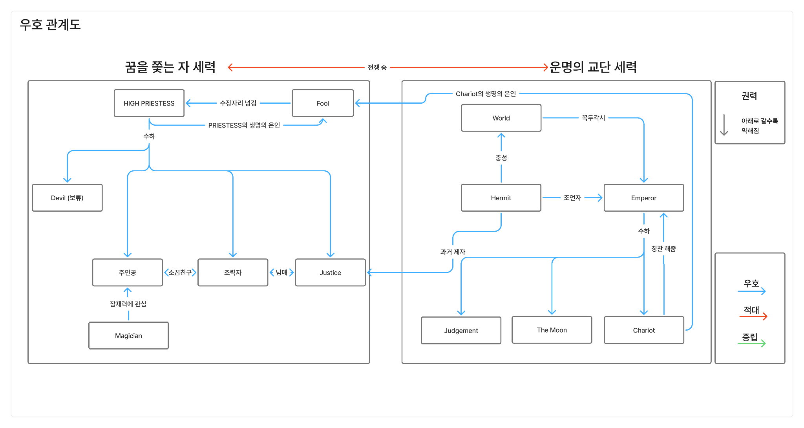

> 해당 이미지는 게임 기획 문서의 일부로, 타로카드를 상징하는 것들이 등장하는 게임 세계관의 세력 관계를 나타낸 우호 관계도입니다. 

## 레이아웃

이미지는 크게 두 개의 영역으로 나뉩니다. 왼쪽 영역은 '꿈을 쫓는 자 세력'이고, 오른쪽 영역은 '운명의 교단 세력'입니다. 두 영역의 상단에는 각각의 세력을 나타내는 명칭이 표시되어 있습니다.

## 구성 요소

각 영역에는 여러 개의 타로카드가 표시되어 있습니다. 각 타로카드는 직사각형의 상자로 표현되었으며, 그 안에 타로카드 이름이 영어로 적혀 있습니다. 타로카드들은 화살표로 연결되어 있으며, 각 화살표에는 한국어 텍스트가 적혀 있습니다.

## 화살표

화살표는 두 영역에 걸쳐 여러 개가 그려져 있습니다. 화살표의 방향은 관계의 방향을 나타냅니다. 화살표에는 한국어 텍스트가 적혀 있으며, 이는 두 타로카드 간의 관계를 설명하는 것으로 추정됩니다.

## 범례

이미지의 오른쪽 하단에는 범례가 있습니다. 범례는 세 개의 화살표로 구성되어 있으며, 각각 '우호', '적대', '중립'을 나타냅니다. 화살표의 색상은 빨간색, 파란색, 녹색입니다.

## 타로카드 목록

꿈을 쫓는 자 세력:

- Magician
- 주인공의 잠재력에 관심
- 소꿉친구
- 조력자
- 남매
- Justice
- Fool
- Priestess
- High Priestess
- Devil

운명의 교단 세력:

- Judgement
- The Moon
- Chariot
- Emperor
- Hermit
- World

## 설명

이미지는 게임 세계관의 세력 관계를 나타내는 복잡한 다이어그램입니다. 타로카드를 사용하여 각 캐릭터 또는 세력 간의 관계를 표현하고 있습니다. 화살표는 관계의 방향과 성격을 나타냅니다. 범례는 화살표의 색상이 의미하는 바를 설명합니다.

---

## 슬라이드 5

적대 관계

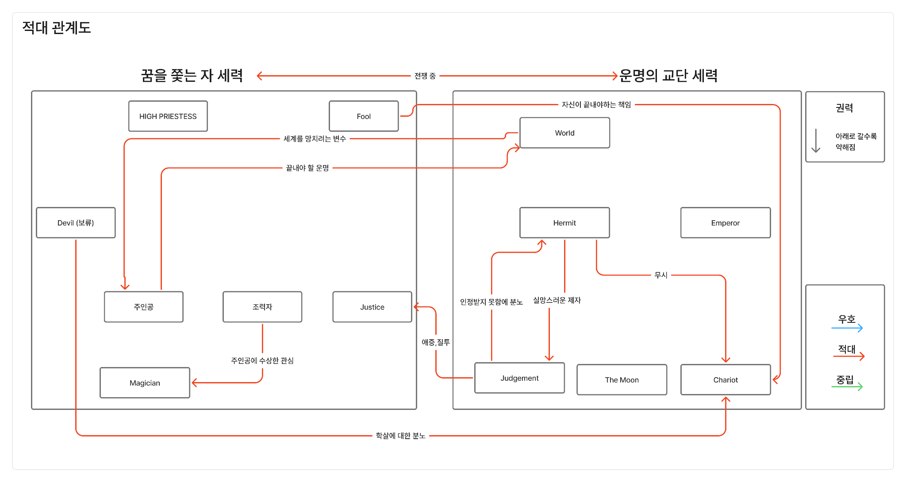

> 이미지는 게임 기획 문서의 일부로 보이는 적대 관계도를 보여 주고 있습니다. 이미지의 레이아웃과 구조를 설명하고, 포함된 모든 텍스트, 다이어그램, UI 요소, 캐릭터, 아이콘 등을 빠짐없이 상세하게 한국어로 설명해 드리겠습니다.

### 이미지 레이아웃

*   **제목 영역**: 이미지의 상단에는 **"적대 관계도"** 라는 타이틀과 함께 두 개의 세력에 대한 설명이 있습니다. 왼쪽에는 **"꿈을 쫓는 자 세력"**, 오른쪽에는 **"운명의 교단 세력"** 이라고 표시되어 있습니다. 
*   **세력도**: 두 세력 간의 관계를 나타내는 중심 도형은 사각형으로 둘러싸여 있습니다. 각 세력에 속한 캐릭터 또는 인물들은 작은 사각형 블록으로 표시되어 있으며, 이 블록들은 서로 화살표 선으로 연결되어 있습니다. 
*   **범례**: 이미지의 오른쪽 하단에는 **우호, 적대, 중립**에 대한 방향을 나타내는 화살표가 함께 표시되어 있습니다.

### 텍스트 설명

*   **타이틀**: "적대 관계도" 
*   **세력**: 
    *   **꿈을 쫓는 자 세력**: 이미지의 왼쪽에 위치하며, 마법사와 관련 인물들이 포함된 세력입니다.
    *   **운명의 교단 세력**: 이미지의 오른쪽에 위치하며, 운명과 관련된 교단 세력입니다.
*   **블록 내 텍스트**: 
    *   **꿈을 쫓는 자 세력**:
        *   **HIGH PRIESTESS**: 높은 여사제
        *   **Fool**: 어릿광대
        *   **Devil(보류)**: 악마
        *   **주인공**: 
        *   **조력자**: 
        *   **Magician**: 마법사
        *   **Justice**: 정의
    *   **운명의 교단 세력**:
        *   **World**: 세계
        *   **Hermit**: 은둔자
        *   **Emperor**: 황제
        *   **Judgement**: 심판
        *   **The Moon**: 달
        *   **Chariot**: 전차

### 다이어그램 설명

*   **화살표**: 
    *   이미지 내 화살표는 두 세력 간의 관계와 상호작용을 나타냅니다. 
    *   화살표의 방향은 관계의 방향성을 보여 주고 있습니다. 
    *   화살표의 색상은 관계의 종류를 구분하기 위해 사용된 것으로 보입니다. 
    *   빨간색 화살표는 적대 관계를 나타내고, 파란색 화살표는 우호 관계를 나타냅니다. 
    *   녹색 화살표는 중립적인 관계를 나타냅니다.

*   **블록 연결**: 
    *   각 블록은 인물 또는 집단을 나타내며, 이 블록들은 화살표로 연결되어 있습니다. 
    *   블록 간의 연결은 두 세력 간의 관계와 상호작용을 시각적으로 표현합니다.

### UI 요소

*   **범례**: 
    *   이미지의 오른쪽 하단에는 **우호, 적대, 중립**에 대한 방향을 나타내는 화살표가 함께 표시되어 있습니다.

### 캐릭터

*   **캐릭터**: 
    *   이미지에는 다양한 캐릭터들이 등장하며, 이들은 각각의 블록에 할당되어 있습니다. 
    *   캐릭터의 이름은 블록 내에 텍스트로 표시되어 있습니다.

### 아이콘

*   **아이콘**: 
    *   이미지에 포함된 아이콘은 없습니다.

---

## 슬라이드 6

아군 컨셉

---

## 슬라이드 7

**플레이어) Wheel Of Fortune**

**열성적이고 감정적이나 윤회를 할 때 무감각해짐**

**정해진 운명의 세계(아르카나)를 부수려는 플레이어**

**키워드**

  - 거부,윤회,포기하지 않는,감정적인,감정이 무뎌지는
**성격(구체화이 필요함)**

  - **희생적임, 진지할 때는 진지함**
  - **도움이 필요한 사람 챙겨주는 상냥한 성격**
**능력 컨셉(전투스킬의 구체화?)**

  - 운명을 되돌릴 수 있다.(게임오버 시 회귀로 윤회 시작)
  - 거부: (이전에 접촉한 적의 효과 면역?)2회차부터 자신을 조종하려는 모든 스킬 면역
  - **이전 윤회의 캐릭터의 스킬 사용함**
  - **보스전, 스킬 재활용**
**개인 스토리**

  - 아르카나 「THE WORLD」로 인해 Hangedman과 살아남은 생존자
  - 주인공으로 더 나은 운명을 찾고 그후에 운명을 깨부셔 모두가 더이상 운명에 얽히지 않는
  - 아르카나 「THE WORLD」를 파괴하여 실존주의의 세계를 만들려 함
**기획의도**

  - 변화하는 플레이어 캐릭터의 변화 및 기존 존재하는 스킬로 윤회의 특징표현
  - 플레이어가 회귀를 통한 성격,스킬의 성장을 잘 보여줌
| 캐릭터 명 | 벤더(미정) |
| --- | --- |
| 나이 | 18세 |
| 성별 | 남성,여성 (더 감정적) |
| 역할 | 운명을 거스르는 특수한 |
| 소속 | 꿈을 쫓는 자 |
| 전투 스타일 |  |

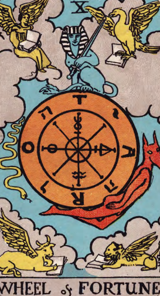

> 해당 이미지는 타로카드 중 '운명의 바퀴(Wheel of Fortune)'를 묘사하고 있습니다. 

### 이미지의 구성 요소

*   **배경**: 
    *   하늘색 배경에 회색 구름이 떠 있습니다. 
    *   구름은 바퀴의 상단과 하단, 그리고 네 개의 동물 아래에 위치해 있습니다. 
*   **중앙 요소**:
    *   큰 주황색 원형 오브젝트가 중앙에 있습니다. 
    *   이 오브젝트에는 내부에 원과 선이 교차하는 복잡한 기호가 새겨져 있습니다. 
    *   원의 바깥쪽에는 히브리어 또는 룬 문자가 원형으로 배치되어 있습니다. 
*   **동물 및 캐릭터**:
    *   네 마리의 날개 달린 동물: 
        *   위쪽: 노란색 날개를 가진 두 마리의 황금빛 그리핀 같은 동물이 책을 물고 있습니다. 
        *   아래쪽: 노란색 날개를 가진 두 마리의 황금빛 동물(소의 모습)이 책을 물고 있습니다. 
    *   중앙 상단: 이집트 스핑크스 같은 파란색 피부의 괴물이 손에 막대를 들고 있습니다. 
    *   오른쪽: 빨간색 악마의 손이 아래에서 바퀴를 받치고 있습니다. 
*   **텍스트**:
    *   'WHEEL of FORTUNE'이라는 단어가 이미지 하단에 있습니다. 
*   **시각적 레이아웃**:
    *   중앙의 주황색 바퀴가 가장 먼저 눈에 띕니다. 
    *   바퀴를 중심으로 동물이 대칭적으로 배치되어 있습니다. 
    *   스핑크스 같은 괴물은 바퀴 위 중앙에 위치해 있습니다. 
    *   악마의 손은 바퀴 아래쪽에 위치해 있습니다. 
    *   전반적으로 균형 잡힌 구도로 안정감을 줍니다. 

### 해석

*   '운명의 바퀴' 카드는 운명, 변화, 순환을 상징합니다. 
*   이 카드가 나타날 때는 인생의 큰 전환점이나 운명의 변화를 의미할 수 있습니다. 
*   카드 속 요소들은 각자의 역할과 상징을 가지고 있으며, 전체적으로 운명의 순환성과 변화를 나타내고 있습니다.

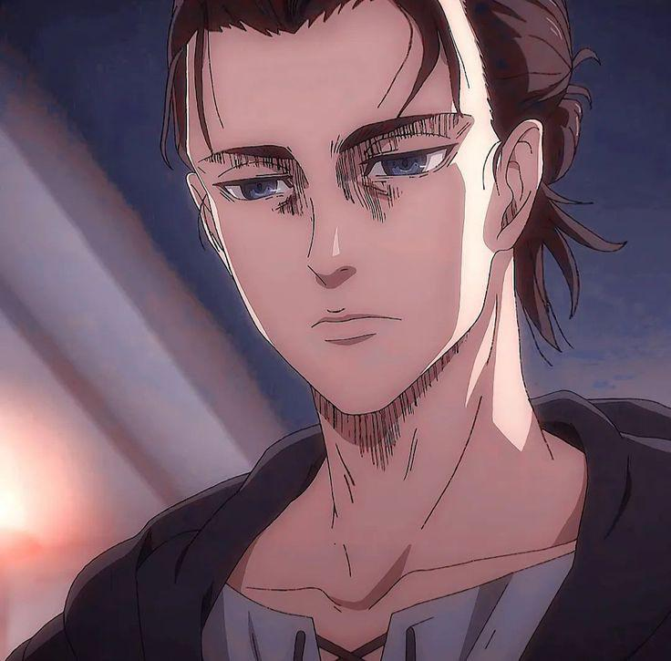

> 해당 이미지에는 게임 캐릭터의 얼굴과 상반신이 포함되어 있습니다. 

*   캐릭터는 짙은 갈색 머리를 짧게 자르고 귀가 노출된 상태입니다. 
*   눈은 짙은 회색이며, 눈꼬리가 올라가 있습니다. 
*   입꼬리도 살짝 올라가 있어 다소 화난 표정으로 보입니다. 
*   캐릭터는 짙은 회색과 검은색이 혼합된 후드 티셔츠를 입고 있습니다. 
*   티셔츠 안쪽에 연회색의 살짝 짧은 반팔 티셔츠를 입고 있습니다. 
*   배경은 짙은 남색이며, 왼쪽 하단에는 밝은 주황색의 빛이 존재합니다. 
*   해당 빛으로 인해 캐릭터의 왼쪽 얼굴과 왼쪽 귀, 목 부분에 하이라이트가 들어왔습니다. 
*   이미지의 오른쪽 절반은 짙은 남색의 배경으로 인해 어둡습니다. 
*   캐릭터의 왼쪽 눈과 오른쪽 눈꺼풀에는 짙은 회색의 눈물이 그려져 있습니다. 
*   캐릭터의 목과 가슴에는 짙은 회색의 선이 여러 개 그려져 있습니다. 
*   목과 귀에는 붉은 반점이 있습니다. 
*   캐릭터의 오른쪽 귀 뒤에는 머리카락이 묶여있습니다. 
*   이미지의 왼쪽에는 밝은 주황색의 빛이 존재합니다. 
*   빛은 캐릭터의 왼쪽 얼굴과 귀, 목 부분에 하이라이트를 주고 있습니다. 
*   이미지의 오른쪽 절반은 짙은 남색의 배경으로 인해 어둡습니다. 
*   전반적으로 캐릭터의 감정이나 상황을 표현하기 위해 그림자가 강조된 느낌이 있습니다.

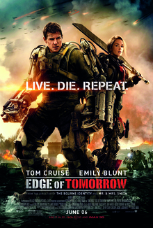

> 이미지는 영화 'EDGE OF TOMORROW'의 포스터입니다.

포스터 중앙에는 두 명의 배우가 등장합니다. 

*   왼쪽에는 남성 배우가 있고, 오른쪽에는 여성 배우가 있습니다. 남배우의 왼쪽에는 여성 배우가 있습니다. 

    *   남배우는 손목 보호대를 착용하고 왼팔에 기관단총을 메고 있습니다. 
    *   그의 오른쪽에는 여성 배우가 있습니다. 여성 배우는 큰 칼을 들고 있습니다. 
    *   두 배우의 뒤로는 여러 건물들과 탱크가 불타고 있으며, 연기, 불, 폭발 등이 터지고 있습니다.

포스터 상단에는 영화의 캐치프레이즈인 'LIVE. DIE. REPEAT.'가 적혀 있습니다.

포스터 하단에는 영화에 출연한 배우의 이름과 영화 제목이 있습니다.

*   배우의 이름은 다음과 같습니다.
    *   왼쪽에 있는 남성 배우의 이름은 'TOM CRUISE'입니다.
    *   오른쪽에 있는 여성 배우의 이름은 'EMILY BLUNT'입니다.
*   영화 제목은 'EDGE OF TOMORROW'이며, 글씨 색은 빨간색입니다.

포스터 하단 중앙에는 영화 개봉일이 있습니다. 

*   영화 개봉일은 'JUNE 06'입니다. 

포스터의 배경은 여러 건물들과 탱크가 불타고 있는 전쟁터를 연상케 합니다.

---

## 슬라이드 8

**Hangedman**

**무의미하게 희생되는 캐릭터 -> 마지막은 의미 있는 희생**

**깨달음을 얻다, 다른 시각을 가진, 내면에 집중하다.**

**키워드**

  - (타로카드의 키워드에 너무 욱여넣는다.)
  - (갭같은게 추가되는건 어떨까 함)
  - 소녀미, 짝사랑, 밝음,히로인, 희생
**성격**

  - **밝고 상냥한 성격(두려움을 숨기기 위해 억지로 오버하는)(좀 더  인간적인 면모 즉 입체적면을 보여주어야함)**
**능력 컨셉**

  - **전투안함!!!!!!NPC임!!!!Non Playable Character**
**개인 스토리**

  - (감정적인 것도 보다 다른 보상 및 동기가 필요하다.)
  - 플레이어의 소꿉친구로 플레이어를 챙겨주는 히로인
  - 플레이어 자체를 좋아하며 지켜주려 함
  - 윤회를 진행을 통해 자신이 죽어야 끝나는 걸 깨닫는다.
**기획의도**

  - 사랑이라는 플레이어가 게임을 진행하는 동기를 주는 장치
| 캐릭터 명 | 마리(미정) |
| --- | --- |
| 나이 | 18세 |
| 성별 | 여성 |
| 역할 | 희생되는 히로인 |
| 소속 | 꿈을 쫓는 자 |
| 전투 스타일 | 없음 |

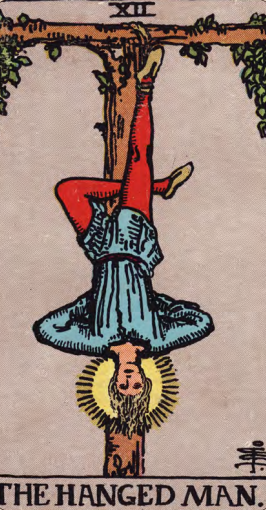

> 해당 이미지는 타로카드 중 'THE HANGED MAN' 카드를 묘사하고 있습니다.

이미지 중앙에는 거꾸로 매달린 남자가 있습니다. 

*   남자는 나무판에 왼쪽 다리는 굽혀지고 오른쪽 다리는 뻗어진 채로 뒤집힌 자세로 매달려 있습니다. 
*   남자의 머리는 아래로 향해 있고 눈은 감긴 채입니다. 
*   남자의 얼굴에는 평화로운 표정이 담겨 있습니다. 
*   남자의 머리 뒤에는 노란색으로 빛나는 무늬가 있습니다. 
*   남자는 하늘색 옷과 빨간색 스타킹 또는 양말을 착용하고 있습니다. 
*   나무판 위쪽에는 로마 숫자 'XII'가 적혀 있습니다. 
*   나무판의 왼쪽과 오른쪽에는 녹색의 덩굴손이 걸쳐져 있습니다. 
*   이미지 하단에는 'THE HANGED MAN'이라는 문구가 적혀 있습니다. 
*   'THE HANGED MAN'이라는 문구 오른쪽 하단에는 작은 문양이 그려져 있습니다. 
*   이미지 배경은 연한 회색입니다.

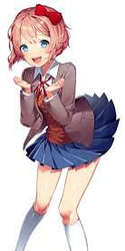

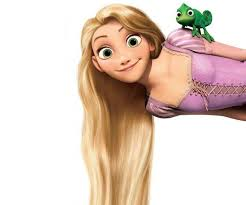

> 죄송합니다. 이미지는 게임 기획 문서의 일부가 아닌 디즈니 영화 Tangled의 라파엘과 패스칼을 묘사한 이미지로 보입니다.

이미지 중앙에는 큰 눈과 긴 금발을 가진 소녀가 얼굴을 앞으로 향하게 한 채로 목이 90도로 꺾여 있습니다. 소녀의 머리카락은 매우 길고, 그녀의 옷은 보라색입니다. 

그녀의 오른쪽 어깨 위에는 작은 녹색 카멜레온이 있습니다. 카멜레온은 큰 눈과 귀여운 외모를 가지고 있습니다.

이미지의 배경은 흰색입니다.

---

## 슬라이드 9

**아군 캐릭터 The HIGH PRIESTESS(NPC)**

**어른스러운 차분하며 인망있는 리더 폭력보다는 전략가**

**(수장이기에 PC보다는 NPC로 미션이나 정보 중심으로 설명충으로는 어떨까?)**

**꿈을 쫓는 자의 수장**

**키워드**

  - 지적인, 신비한, 신중한, 고요함, 전략적인
**성격**

  - **카리스마, 전략적인 인물,차분함 능력 컨셉**
**능력 컨셉**

  - **자신의 체력이 낮아질 수 록 아군에 더 강한 버프 부여**
  - **거인을 쓰러트려라: 체력이 가장 많은적에게 디버프**
  - **코스트 추가등 전투용 버프 부여**
**개인 스토리**

  - 혼란스러운 내전에서 꿈을 쫓는 자를 이끄는 인물
**기획의도**

  - 전략적인 캐릭터로서 플레이어가 믿고 윤회를 반복하거나 정보를 받을 수 있게하는 캐릭터
**레퍼런스**

  - 한스 란다, 요한 리베르토, 파우스트
| 캐릭터 명 | 이나리(미정) |
| --- | --- |
| 나이 | (외형30세) |
| 성별 | 여성 |
| 역할 | 꿈을 쫓는 자의 수장,전략가 |
| 소속 | 꿈을 쫓는 자 |
| 전투 스타일 | 아군 캐릭터 버프 |

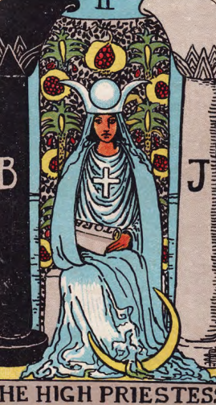

> 해당 이미지는 타로카드의 '대여제사장(The High Priestess)' 카드를 묘사하고 있습니다.

카드 중앙에는 푸른색 옷을 입은 여성이 앉아 있습니다. 이 여성은 하얀색 옷과 푸른색 망토를 입고 있으며, 머리는 푸른색 천으로 덮여 있습니다. 그녀의 앞에는 책이 놓여 있습니다. 

그녀의 뒤로는 화려한 무늬의 벽이 있고, 그 위에는 달이 보입니다. 그녀의 오른쪽에는 'J', 왼쪽에는 'B'라는 글자가 있습니다. 카드의 맨 아래에는 'HE HIGH PRIESTESS'라는 영문 텍스트가 있습니다.

카드의 레이아웃은 중앙에 인물이 위치하고, 그 뒤로 배경이 펼쳐져 있습니다. 오른쪽과 왼쪽에는 기둥 같은 구조물이 있고, 그 위에는 로마 숫자인 'II'가 있습니다.

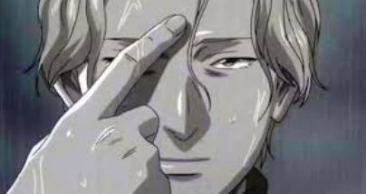

> 해당 이미지는 게임 기획 문서의 일부로 보이는 이미지입니다. 이미지는 흑백의 일러스트 이미지이며, 한 남성의 상반신이 묘사되어 있습니다.

이미지 중앙에는 눈과 코, 입이 선명하게 그려진 남성 얼굴이 있고, 얼굴 왼쪽에는 손가락 두 개가 눈을 가리는 듯한 모습이 그려져 있습니다. 

남성의 머리카락은 어깨까지 오는 짧은 길이이며, 머리카락과 눈썹, 손가락에는 머리카락에 가려져 있지만 손등과 손목에도 머리카락이 있는 것을 확인할 수 있습니다.

배경은 짙은 회색이며, 남성의 오른쪽에는 짙은 회색 바탕으로 인해 잘 보이지 않는 부분이 있습니다.

전체적으로 이미지는 짙은 회색과 밝은 회색을 사용하여 고대비의 이미지를 형성하고 있습니다.

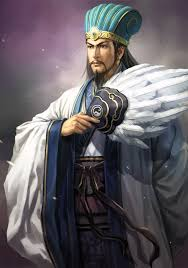

> 이 게임 캐릭터 일러스트는 전통적인 중국풍의 의상을 입은 남성을 묘사하고 있습니다. 

### 캐릭터 설명

* **의상**: 
  - **머리 장식**: 남자는 청록색과 금색 줄무늬가 있는 높은 투구 같은 머리 장식을 하고 있습니다. 이 장식의 중앙에는 금색 테두리가 있고, 정면에는 중앙에 보석이 박힌 듯한 장식이 있습니다.
  - **상의**: 넓은 소매의 흰색 로브를 입고 있으며, 어깨와 가슴 부분에 걸쳐진 짙은 청색의 안감이 있습니다. 
  - **허리**: 허리에는 짙은 보라색과 금색 띠가 묶여 있습니다. 띠 아래로는 허리 장식이나 갑옷 같은 부분이 묶여 있습니다.
  - **하의**: 짙은 색상의 바지를 입고 있습니다.

* **액세서리**:
  - 남자는 왼쪽 손에 둥근 모양의 검은색 물건을 들고 있습니다. 이 물건의 중앙에는 금색 테두리와 보석이 박혀 있습니다.

* **배경**:
  - 배경은 보라색과 회색이 혼합된 우주적인 느낌의 그라데이션을 띠고 있습니다. 배경에는 작은 별들이 흩어져 있습니다.

* **전체적인 분위기**:
  - 이미지는 고풍스럽고 화려한 디테일을 강조하며, 캐릭터가 신비로운 아우라를 발산하는 듯한 인상을 줍니다. 캐릭터의 의상과 액세서리는 전통적인 중국 문화와 판타지적인 요소를 혼합한 듯한 느낌을 줍니다.

* **구도**:
  - 캐릭터는 화면 중앙에 위치하며, 정면을 응시하고 있습니다. 캐릭터의 시선은 왼쪽을 향하고 있어, 마치 먼 곳을 응시하는 듯한 모습을 표현하고 있습니다.

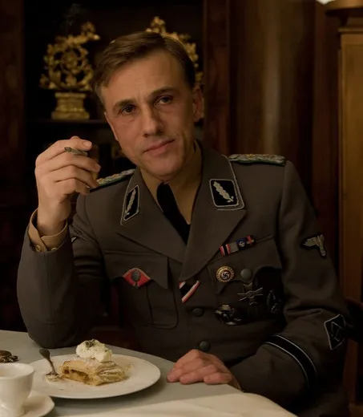

> 이미지는 게임 기획 문서의 일부가 아닌, 영화 '조커: 폴리쉬 카오스'의 한 장면으로 추정됩니다.

이미지 중앙에는 흰머리가 희끗희끗한 중년의 남성이 테이블에 앉아 있습니다. 남성은 짙은 녹색의 군복을 입고 있으며, 군복에는 여러 개의 훈장과 뜯어진 듯한 흔적이 있는 금속장식이 달려 있습니다. 왼쪽 가슴에는 붉은 바탕에 검은 십자가가 그려진 장식품이 보입니다. 남성의 오른쪽 손에는 반지 하나를 끼고 있습니다.

남성 앞 테이블에는 흰 접시에 케이크가 하나 놓여 있습니다. 케이크 위에는 하얀 크림이 올려져 있고, 케이크 왼쪽에는 포크가 놓여 있습니다. 테이블 오른쪽 하단에는 흰 컵이 하나 보입니다.

배경에는 짙은 색상의 나무 벽이 보입니다. 벽에는 금색의 조각상과 비슷한 장식품이 벽에 부착되어 있습니다. 나무 벽 오른쪽으로는 문틀의 일부가 보입니다.

이미지 중앙에 위치한 남성이 게임 캐릭터인지, 혹은 게임 속 인물인지는 불확실합니다.

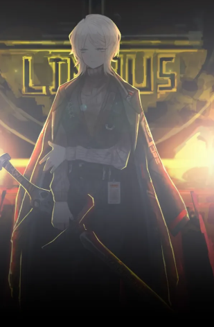

> 이미지는 게임 캐릭터와 배경으로 구성되어 있습니다.

*   캐릭터는 남성이며 짧은 흰색 머리를 가지고 있습니다. 눈은 감긴 상태입니다. 
*   캐릭터는 빨간색과 검은색이 조합된 옷을 입고 있습니다. 
*   허리춤에는 검이 있습니다. 
*   배경은 어둡고 불빛이 있습니다. 
*   배경 중앙에는 노란색으로 LITMUS라는 단어가 있습니다.

---

## 슬라이드 10

**아군 캐릭터 The Fool(NPC 어떰)**

**모든 역경에도 사람의 선한 마음을 믿고 행복하게 만들려는 떠돌이**

**(High priestes의 디버프와 The Fool의 버프로 연관)**

**(방랑자로서 플레이어 캐릭터에 적합지 않을까?)**

**키워드**

  - 쾌활함, 자책 ,규칙을 벗어던진,귀족, 자비로움,인자함
**성격**

  - 능글스러움,털털한 성격, 매일 웃고 있음
**능력 컨셉**

  - **속하지 않는: 버프, 디버프 무효**
  - **패시브 변수 창출: 이번턴에 소모한 스킬 코스트에 따라 적의 공격 약화**
  - **군의관: 공격 받은 적에 방어 디버프 일정 스텟 이상시 기절**
**개인 스토리(너무 복잡함)(자유로움 무소속)(뇌가 빠져 보이는 것 같지만 주변을 챙기는) (단순화 필요)**

  - 군의장교로서
  - **원래 죽었어야 할 THE CHARIOT을 살림(운명의 교단이 폭력진압으로 벌인 학살사건)을 벌여 자책**
  - **자신이 가문의 인정을 위해 남을 희생시켰다고 자책함**
  - 이 사건으로 첫 역방향을 발동하여 운명의 교단에 속하지 않게 됨
  - 자신은 사람을 돕기위해 만들기 위해 의사로서 자유롭게 떠돌아다님
**기획의도**

  - 소모한 코스트에 따른 적의 공격 약화로 코스트 선택의 전략에 중요성을 부여하는 캐릭터
  - 아무런 세력에 들어가지 않고 자신이 원하는 선한 일을 하려는 순수한 사람을 표현
**레퍼런스**

  - 닥터 텐마 켄조, 귀도 오르피스, 길다트,히루루크
| 캐릭터 명 | 요타(미정) |
| --- | --- |
| 나이 | (외관30세) |
| 성별 | 남성 |
| 역할 |  |
| 소속 | 과거)꿈을 쫓는 자/현재)무소속 |
| 전투 스타일 | 아군 캐릭터 버프 |

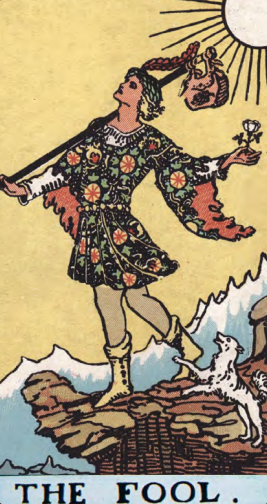

> 해당 이미지 속 인물은 타로 카드의 'THE FOOL' 카드를 묘사하고 있습니다.

### 이미지의 레이아웃

이미지는 인물과 강아지 그리고 바위, 산, 태양을 담고 있습니다. 

*   인물: 젊은 남성이 바위 끝에 서 있습니다. 
*   강아지: 흰색 강아지가 그 옆에 있습니다.
*   바위: 남성이 서 있는 바위는 산 중턱에 위치해 있습니다. 
*   산: 바위 뒤로 눈 덮인 산이 보입니다. 
*   태양: 하늘에는 태양이 그려져 있습니다.

### 의상 및 액세서리

*   남성의 머리는 곱슬머리이며, 녹색과 꽃무늬가 있는 옷을 입고 있습니다. 
*   남성의 왼쪽에는 흰색 장미가 있고, 오른손에는 막대가 있습니다. 
*   남성의 머리 위에는 오렌지색 고양이의 모습이 그려져 있습니다.

### 텍스트

이미지 하단에는 'THE FOOL'이라는 텍스트가 있습니다.

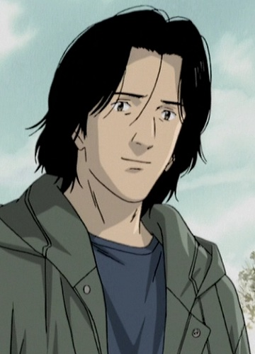

> 이미지는 애니메이션 스타일의 일러스트레이션으로, 한 남성의 상반신이 묘사되어 있습니다. 

### 캐릭터 묘사:

*   **얼굴과 표정**: 남성은 약간 긴 흑발을 가지고 있으며, 약간 오른쪽을 응시하는 듯한 시선을 가지고 있습니다. 그의 표정은 중립적이거나 약간 슬픈 듯한 인상을 주고 있습니다.
*   **의상**: 남성은 회색 후드 재킷을 입고 있으며, 그 밑에는 짙은 파란색의 티셔츠가 있습니다. 재킷은 단추로 고정되어 있으며, 왼쪽 상단 버튼이 잠겨 있는 것을 확인할 수 있습니다.

### 배경:

*   배경은 하늘색의 하늘과 흰 구름이 그려져 있습니다. 오른쪽 하단에는 희미하게 나무의 윤곽이 보입니다.

### 레이아웃:

*   이미지는 인물 중심의 구도로, 남성이 화면의 대부분을 차지하고 있습니다. 

종합적으로, 이 일러스트레이션은 애니메이션 스타일의 캐릭터를 묘사하며, 차분하고 감성적인 분위기를 전달합니다.

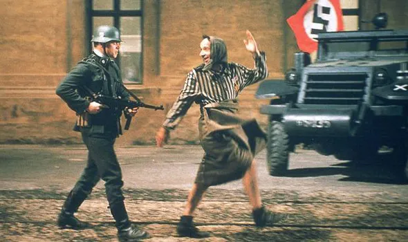

> 이미지는 게임 기획 문서의 일부로 보이는 이미지입니다. 이미지에는 독일 군인과 스트라이프 죄수복을 입은 여성, 군사용 차량이 보입니다.

*   독일군: 이미지 왼쪽에 있는 군인은 독일군으로 추정되며, 군용 헬멧과 소총을 착용하고 있습니다. 
*   스트라이프 죄수복을 입은 여성: 이미지 중앙에 있는 여성은 스트라이프 형태의 죄수복을 입고 있습니다. 여성은 왼팔을 들어 올리고, 오른쪽을 향해 걷고 있습니다. 
*   군사용 차량: 이미지 오른쪽에 있는 군사용 차량은 독일군의 상징인 스와스티카가 그려진 깃발이 차량 뒤로 보입니다. 
*   배경: 이미지 배경에는 독일군 시절의 건축 양식으로 추정되는 건물이 보입니다. 창문은 4칸으로 나뉘어져 있으며, 벽면은 회색빛 벽돌로 구성되어 있습니다. 

이러한 이미지의 구도로 보아, 이 게임은 2차 세계 대전을 배경으로 한 게임으로 추정됩니다.

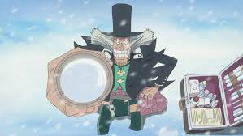

> 이미지는 애니메이션 스타일의 일러스트로, 한 캐릭터와 하나의 오브젝트가 포함되어 있습니다.

*   캐릭터: 바게리아라는 캐릭터로 추정됩니다. 바게리아는 검은 머리카락과 검은 옷, 녹색과 보라색이 조합된 정장을 입고 있습니다. 바게리아는 큰 손거울을 들고 있습니다. 
*   오브젝트: 바게리아의 오른쪽에는 보라색 케이스가 열려 있습니다. 케이스 안에는 여러 개의 보석이 들어 있습니다.

배경은 하늘이 푸른색이며, 눈이 내리고 있습니다.

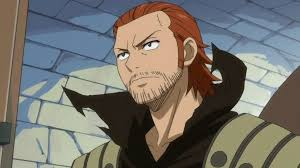

> 이미지는 애니메이션 캐릭터의 스크린샷으로 보입니다.

이미지 중앙에는 빨간 머리의 남성이 있습니다. 이 남성은 약간 구릿빛 피부톤을 가지고 있으며, 짧은 수염이 입과 턱 선을 따라 나 있습니다. 눈은 짙은 색이며, 약간 위협적인 표정을 짓고 있습니다.

남성의 머리는 약간 긴 편이며, 머리의 뒷부분은 묶인 듯한 모습을 하고 있습니다. 남성의 머리와 귀 사이에는 검은 날개 모양의 헤어 액세서리가 있습니다.

남성은 검은색 후드티를 입고 있으며, 그 위에 녹색과 회색의 갑옷을 착용하고 있습니다. 갑옷에는 여러 개의 버튼과 가죽끈이 있습니다.

배경에는 회색 벽이 있습니다. 벽은 돌로 만들어진 듯하며, 일부는 금이 가고 벗겨진 모습입니다. 벽 뒤로는 짙은 회색의 문틀과 문이 있습니다.

이미지 하단에는 흰색 공백이 있습니다. 이 공백은 게임의 UI나 인터페이스의 일부일 수 있습니다.

이미지에는 다른 시각적 요소나 아이콘 등은 보이지 않습니다.

---

## 슬라이드 11

**아군 캐릭터 Justice**

**세상을 돌아다니며 정의를 직접 찾으며 행하려하는 과거 재판관**

**키워드**

  - Justice, 냉정, 무표정, 판단형, 무자비,쇼타
**성격**

  - **평소에는 냉정, 무표정하지만 감정을 숨길 뿐 확실히 감정을 느낌**
  - 어른처럼 행동하려는 어린이
**능력 컨셉**

  - **캐릭터가 한 행동의 종류와 횟수에 따라 효과가 달라짐**
  - 아군을 공격한 적에게 반격 관련 수비 스킬
  - 서포트를 한 캐릭터에게 데미지가 넣기 어려움
  - (반격: 지정한 캐릭터의 딜량 값 비율로 단일 공격)
**개인 스토리**

  - **자신의 부적절한 판결로 동생 Hangedman이 죽을 뻔한 사실에 지금까지 정의롭지 못한 자신의 눈을 썰어 스스로 죄를 내리며**
**이단재판관에서 내려옴**

**이후 꿈을 쫓는 자와 합류하여 운명의 교단을 파괴해 잘못되는 심판을 없애려 함**

**기획의도**

  - 공격을 많이하는 적에 폭딜을 넣어 딜러를 먼저 처리하는 안전한 플레이
**레퍼런스**

  - 침묵의 기사, 태산지옥,하니 선배
| 캐릭터 명 | 미켈(미정) |
| --- | --- |
| 나이 | 26세(외관은 13살) |
| 성별 | 남성 |
| 역할 | 운명과 관계 없이 옳다고 생각하는 일을 행하는 인물 |
| 소속 | 꿈을 쫓는 자 |
| 전투 스타일 | 수비 중점으로 후반에 폭딜을 넣는 플레이 |

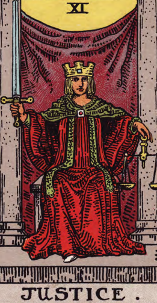

> 이미지는 타로카드의 "정의" 카드를 묘사하고 있습니다. 

카드 상단에는 노란색 배경에 로마 숫자 **XI**가 있습니다. 

카드 중앙에는 왕좌에 앉아 있는 남성이 등장합니다. 그는 붉은색 옷과 녹색 금테 두건을 착용하고 있습니다. 남성의 왼손에는 저울이 들려져 있고, 오른손에는 검이 들려져 있습니다. 

카드 하단에는 **JUSTICE**라는 단어가 영어로 적혀 있습니다.

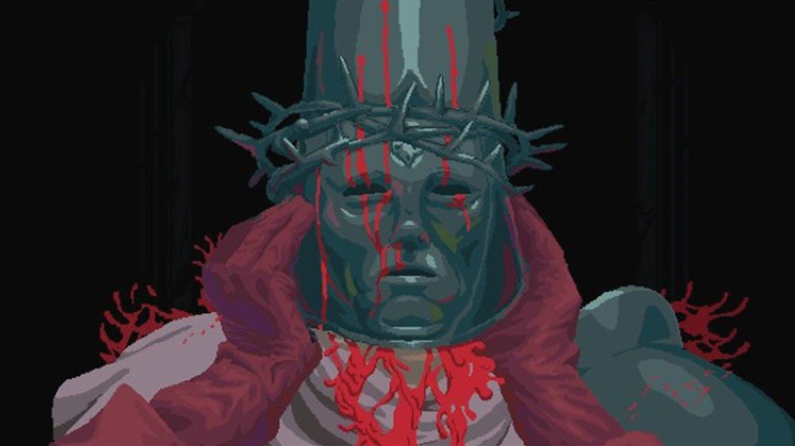

> 해당 이미지는 게임 기획 문서의 일부로 추정되며, 가톨릭에서 예수 그리스도의 고통과 희생을 상징하는 가시 면류관을 쓴 남성의 상반신 일러스트입니다.

이미지 중앙에는 어둡고 짙은 회색의 가시 면류관을 쓴 남성의 얼굴이 정면으로 그려져 있습니다. 남성의 눈은 감긴 상태이며, 입꼬리가 살짝 올라간 상태로 고통스러운 표정을 짓고 있습니다. 

남성의 가시 면류관에서는 붉은 피가 줄줄 흘러내리고 있으며, 남성의 흰색 옷에도 피가 튕겨나가 얼룩덜룩하게 물들어 있습니다. 남성의 양 어깨에는 붉은색의 두꺼운 천을 둘렀습니다. 

남성의 어깨와 팔꿈치에는 붉은 피가 튕겨나간 듯한 무늬가 그려져 있습니다. 배경은 짙은 검은색이며, 세로로 선 두꺼운 기둥이 양옆으로 배치되어 있습니다.

전체적으로 어둡고 짙은 색감으로 인해, 이 일러스트는 예수 그리스도의 십자가 고난을 표현한 것으로 추정됩니다.

> 이미지는 정의의 여신상을 묘사하고 있습니다. 

정의의 여신상은 금색 동상으로, 오른손에 저울을 들고 있습니다. 

정의의 여신상의 얼굴에는 눈을 가리는 천이 묶여있습니다. 

정의의 여신상의 머리는 왕관을 쓰고 있습니다. 

정의의 여신상의 왼쪽 어깨에는 망토가 어깨에 걸쳐져 있습니다.

정의의 여신상의 가슴과 배 부분에는 주름이 잡힌 옷이 표현되어 있습니다.

정의의 여신상의 배경에는 파란색 하늘이 펼쳐져 있습니다.

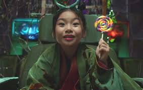

> 이미지 중앙에는 여성 캐릭터가 있습니다. 여성은 입꼬리가 올라간 채 활짝 웃고 있는 표정입니다. 여성의 오른쪽에는 막대 사탕이 있습니다. 여성은 녹색 옷을 입고 있으며, 머리는 녹색 머리띠로 묶여 있습니다.

배경에는 여러 가지 빛깔의 네모 칸이 있습니다. 네모 칸 안에는 알 수 없는 그래프가 그려져 있습니다. 여성은 녹색 의자에 앉아 있습니다.

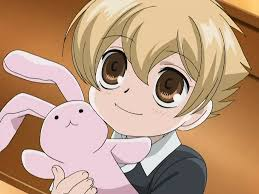

> 이미지에는 한 명의 캐릭터와 토끼 인형이 포함되어 있습니다.

*   캐릭터는 남자아이로, 짧은 금발과 큰 눈을 가지고 있습니다. 남자는 토끼 인형을 껴안고 있습니다.
*   남자는 흰색의 칼라가 달린 검은색 옷을 입고 있습니다.
*   토끼 인형은 분홍색이며, 귀가 길고 눈이 작습니다. 토끼의 얼굴에 미소를 띤 듯한 표정이 그려져 있습니다.
*   배경은 갈색이며, 가로로 긴 직사각형 모양입니다.

---

## 슬라이드 12

**아군 캐릭터 THE MAGICIAN**

**재미만을 쫓는 의문의 인물 키워드**

  - **THE CHARIOT, 우아함, 쇼맨십**
**성격**

  - **능글맞는, 동기 불명, 예측 불가, 신비 컨셉,**
**능력 컨셉(수정)**

  - **(대타 출동으로 얍삽한 플레이)**
  - **(대타 인형의 남은 HP에 비례해 코스트 할인) (수정필요)**
  - **1명의 대상에 디버프를 가하며 1명에**
  - **클라이맥스: 체력이 일정 이하인 적은 즉사기**
**개인 스토리**

  - 아르카나 「THE WORLD」를 파괴하여 혼돈으로 더 다양한 사건을 보고 싶어하는 캐릭터
  - 새로운 세계를 보고 싶어!!!!!!!!!!
**기획의도**

  - 신비주의컨셉의 매력을 주는 인물
  - 집중공격으로 원하는 적을 빠르게 무력화시키는 점 타격 전략
**레퍼런스**

  - ,하나비,RADIO DEMON,메타톤,히소카
| 캐릭터 명 | 악셀(미정) |
| --- | --- |
| 나이 | 1000세 |
| 성별 | (아트에서 결정) |
| 역할 | 분위기를 풀어주는 담당 |
| 소속 | 꿈을 쫓는 자 |
| 전투 스타일 | 1명에게 버프 혹은 디버프를 걸어 집중 타격 |

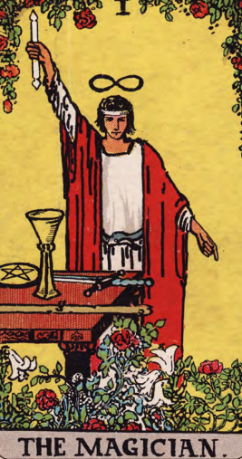

> 해당 이미지는 타로카드의 'The Magician' 카드를 묘사하고 있습니다. 

카드 상단에는 'I'이라는 숫자가 있고, 하단에는 'THE MAGICIAN'이라는 텍스트가 있습니다.

카드 중앙에는 마법사가 있습니다. 마법사는 오른손에 흰색 막대를 들고 있고, 왼손은 허공을 향해 뻗어 있습니다. 마법사의 머리 위로는 무한대를 나타내는 기호가 있고, 마법사는 붉은색 망토를 입고 있습니다.

마법사 앞에는 테이블이 있고, 테이블 위에는 컵, 펜타클, 소드, 완드 등의 물건이 놓여 있습니다.

마법사 주변으로는 꽃과 녹색의 덩굴이 감겨져 있습니다. 테이블 아래에는 흰색의 토끼가 그려져 있습니다. 배경은 노란색입니다.

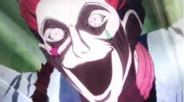

> 이미지는 애니메이션 스타일의 일러스트레이션으로, 한 인물의 클로즈업 얼굴을 묘사하고 있습니다. 이 인물은 하얀 얼굴에 검은 색칠이 되어 있으며, 입꼬리가 올라간 광기 어린 표정을 짓고 있습니다.

얼굴 중앙에 위치한 입은 크게 벌려져 있고, 위로 올라간 입꼬리는 이 인물의 조롱하고 즐거워하는 표정을 강조합니다. 눈은 하얗게 질려있고, 눈동자는 보이지 않습니다. 눈꺼풀 주변에 검은 색상이 덧대어져 있어 강렬한 인상을 줍니다.

얼굴의 왼쪽 위에는 분홍색의 혀가 나와 있습니다. 오른쪽 눈 아래로는 녹색의 눈물이 흘러내리고 있습니다. 

전체적으로 이 일러스트레이션은 강한 감정과 에너지를 전달하며, 이 게임이 어둡고 판타지적인 세계관을 가지고 있음을 암시합니다.

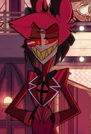

> ### 이미지 상세 설명

#### 캐릭터 묘사
- **캐릭터**: 악마로 추정되는 캐릭터가 중앙에 크게 그려져 있습니다.
- **외형**: 
  - 얼굴은 주로 빨간색과 노란색으로 구성되어 있습니다.
  - 눈은 빨간색이며, 눈동자가 뚫린 듯한 노란색 이목구비와 날카로운 치아가 표현되어 있습니다.
  - 머리는 두 부분으로 나뉘어져 있으며, 위쪽은 빨간색이고 아래쪽은 검은색입니다.
  - 머리 위쪽 부분은 마치 뿔처럼 날카롭게 생긴 두 개의 귀가 있습니다.
  - 입꼬리가 올라가 있어 웃는 듯한 표정을 하고 있습니다.

- **복장**: 
  - 캐릭터는 빨간색과 검은색이 주를 이루는 옷을 입고 있습니다.
  - 상의는 깃이 있는 형태이며, 앞면 중앙에 하얀색과 검은색으로 장식된 듯한 디자인이 있습니다.
  - 상의의 소매는 검은색이며, 팔꿈치까지 덮는 긴 소매입니다.
  - 가슴 부분에는 큼지막한 하얀색 십자가가 그려져 있고, 그 아래로 검은색 조끼를 입고 있습니다.

#### 배경
- 배경은 무대 또는 공연장처럼 보입니다.
- 배경의 상단에는 조명 시설이 보이며, 조명들이 켜져 있는 것을 확인할 수 있습니다.
- 배경의 왼쪽 상단에는 둥근 모양의 조명이 벽에 매달려 있습니다.

#### 전체적인 레이아웃
- 이미지는 게임 기획 문서의 일부로 추정되며, 캐릭터의 디자인과 배경이 포함되어 있습니다.
- 캐릭터가 중앙에 위치하며, 배경은 공연장이나 무대처럼 꾸며져 있습니다.

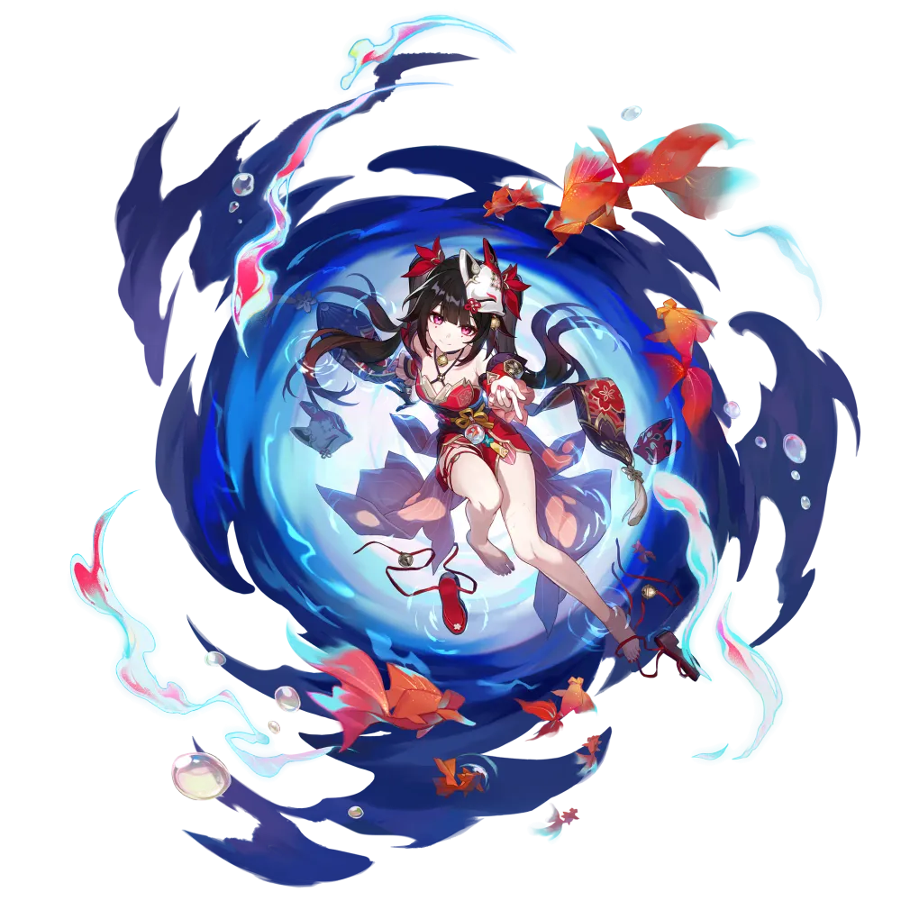

> 해당 이미지에는 한복을 입은 소녀가 등장합니다. 소녀의 신발은 분홍색이며, 머리는 왕관과 비슷한 장식으로 꾸며져 있습니다. 소녀의 눈은 분홍색이며, 긴 검은 머리를 가지고 있습니다. 

소녀는 커다란 나선형의 푸른색 에너지 소용돌이 안에 있습니다. 소용돌이 안에는 소녀와 함께 금붕어들이 떠 있습니다. 금붕어들은 주황색이며, 소용돌이의 위쪽에 몰려 있습니다. 

소녀의 머리 위에는 여러 개의 보라색과 하늘색의 불꽃이 흩어져 있습니다. 불꽃은 구불구불하게 생겼으며, 일부는 소녀의 몸을 관통하기도 합니다. 이미지의 배경은 하얀색입니다.

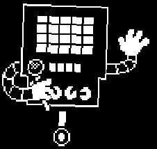

> 이 게임 기획 문서에 포함된 이미지에는 귀여운 디테일의 **포켓몬스터** 시리즈의 등장인물인 **삐삐**가 담겨 있습니다.

삐삐는 **원통형의 녹색 구조물** 안에 있습니다. 삐삐는 **눈을 감고** 있고, **왼쪽 귀**를 **오른쪽 손**으로 막고 있습니다. 삐삐의 **볼**은 분홍색이며, 삐삐의 **눈썹**은 검은색입니다. 

삐삐가 들어간 녹색 구조물은 **둥근 원통** 모양이며, 위쪽이 **오목**입니다. 구조물의 **바닥**은 평평합니다. 

구조물의 색과 삐삐의 피부색은 **비슷한 녹색**입니다. 

이미지의 배경은 **흰색**입니다.

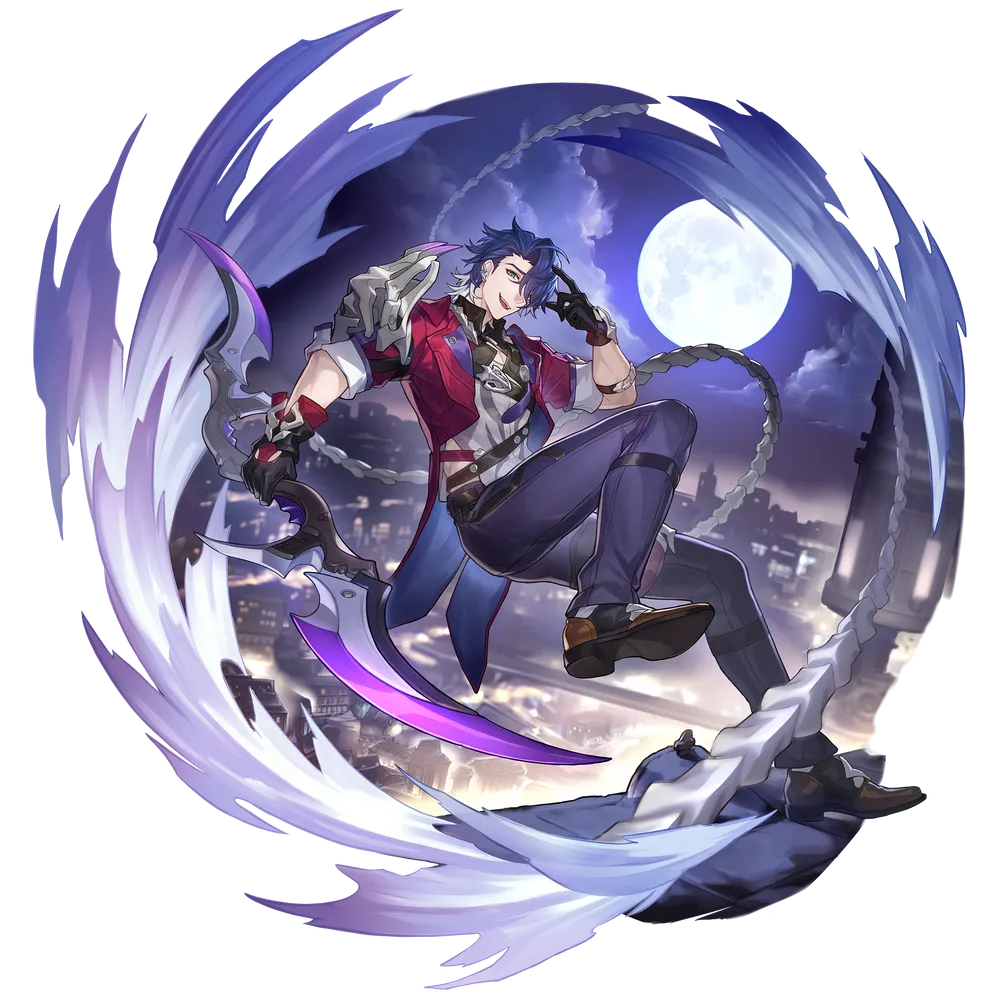

> 해당 이미지는 게임 캐릭터의 일러스트입니다.

이미지 중앙에는 한 명의 캐릭터가 있습니다. 이 캐릭터는 남성이며, 보라색 머리카락을 가지고 있습니다. 눈은 녹색입니다. 캐릭터는 왼쪽 귀 위쪽에 보라색 깃털이 있고, 오른쪽 귀에도 비슷한 깃털이 있습니다. 캐릭터는 흰색과 빨간색이 조합된 옷을 입고 있으며, 왼쪽 팔과 오른쪽 허벅지에는 붕대를 감고 있습니다. 캐릭터는 허벅지까지 오는 긴 부츠를 착용하고 있습니다.

캐릭터는 허벅지까지 오는 긴 부츠를 착용하고 있습니다. 오른손에 보라색 손잡이가 달린 낫과 같은 무기를 들고 있습니다. 무기의 손잡이에는 사슬이 묶여있습니다. 캐릭터는 사슬을 왼손에 쥐고 있습니다. 캐릭터의 뒤로는 보라색 달이 보입니다. 달 뒤로는 구름이 있습니다.

캐릭터를 중심으로 보라색과 흰색의 불꽃이 소용돌이처럼 감싸고 있습니다. 불꽃은 캐릭터의 무기와 머리카락, 옷과 섞여있습니다. 불꽃은 보라색과 흰색의 그라데이션을 이루고 있습니다.

캐릭터의 배경에는 도시의 야경이 보입니다. 도시의 건물은 불이 켜져 있고, 불꽃과 도시의 불빛이 섞여서 이미지가 화려합니다. 이미지의 전체적인 색조는 보라색과 흰색입니다.

---

## 슬라이드 13

적군 컨셉

---

## 슬라이드 14

**적군 캐릭터 The Chariot(우선순위1)**

**밑바닥에서 어떤 일이든지 해내며 만들어 진 영웅이 된 인물**

**키워드**

  - 영웅, 학살자, 노력파, 희생, 무식함
**성격**

  - **(롤의 문도 ?)(뇌까지 근육)(히히 칭찬 좋아요!)**
  - **과격함,더 많은 사람에게 칭찬 받기 위해 노력, 무슨 수를 쓰더라도 해결을 한다**
  - **야비한 일에는 머리가 의외로 잘 돌아가는**
**전투 컨셉**

  - **캐릭터를 소환함**
  - **소한한 캐릭터를 희생시켜 강한 공격**
  - **죽기살기: 체력이 낮을 때 특수한 버프(죽음과 관련된)**
**개인 스토리**

  - **운명의 날(운명의 교단이 폭력진압으로 벌인 학살사건)에 저항세력을 가장 많이 괴멸시킨 인물로**
**기획의도**

  - 모든 걸 희생해서라도 원하는 걸 가지려는 정복욕 넘치는 순수악 캐릭터
  - 공격대상으로 스킬 무효화
  - 스킬에 따른 전략을 짜는 전략 중심 전투
**레퍼런스**

  - DIO, 문도
| 캐릭터 명 | 판테라(미정) |
| --- | --- |
| 나이 | 약 50세 |
| 성별 | (아트에서 결정) |
| 역할 | 운명의 교단에서 이교도 정화로 학살의 주범 |
| 소속 | 운명의 교단 |
| 전투 스타일 | 아군을 희생시키며 공격, |

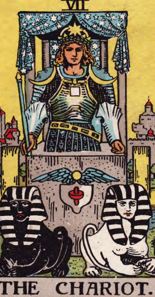

> 이미지는 타로 카드 중 전차(The Chariot) 카드를 묘사하고 있습니다. 이미지를 상세하게 분석해 보겠습니다.

### 이미지 구성 요소:

1. **전차와 기사:**
   - 중앙에는 중세 기사로 묘사된 남성이 있습니다. 기사는 금색 왕관을 쓰고 있으며, 금색과 파란색 갑옷을 입고 있습니다. 
   - 기사는 왼손에 홀을 들고 있으며, 오른손은 옆에 내려놓고 있습니다.
   - 기사는 화려한 장식이 달린 높은 등받이 의자에 앉아 있습니다. 등받이 위에는 금색 별이 달린 파란색 천이 펼쳐져 있습니다.

2. **전차:**
   - 기사가 앉아 있는 플랫폼이나 의자 아래에는 날개가 있는 문장이 있습니다. 문장 중앙에는 붉은 십자가가 그려져 있습니다.
   - 의자 앞쪽 바닥에는 두 마리의 스핑크스가 있습니다. 왼쪽에는 검은 스핑크스, 오른쪽에는 하얀 스핑크스가 자리 잡고 있습니다. 두 스핑크스 모두 이집트풍의 왕관을 쓰고 있습니다.

3. **배경:**
   - 배경에는 도시나 성곽이 그려져 있습니다. 노란색 배경과 대비되는 짙은 색상으로 묘사되어 있습니다.

4. **텍스트:**
   - 카드 상단에는 로마 숫자 **VII**가 있습니다.
   - 카드 하단에는 **THE CHARIOT**이라는 텍스트가 있습니다.

### 레이아웃 및 구조:
- 이미지는 기사가 중앙에 위치하고, 그 아래에 스핑크스 두 마리가 대칭적으로 배치된 구조입니다.
- 배경의 도시 풍경은 노란색 하늘과 대비되며, 전체적으로 균형 잡힌 구도로 표현되어 있습니다.

이 카드는 타로 카드에서 '전차(The Chariot)'로 불리며, 의지력과 통제를 상징합니다. 기사의 갑옷과 홀, 스핑크스 등은 각각 힘, 통제, 그리고 고대의 지혜를 나타냅니다.

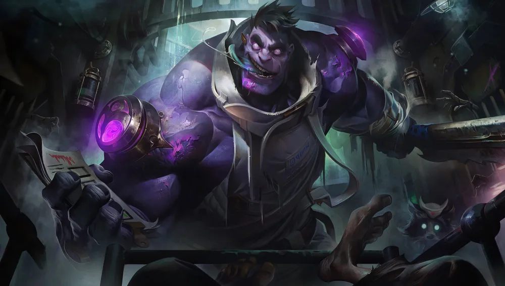

> 이미지는 비디오 게임의 캐릭터인 **레넥톤**을 묘사하고 있습니다. 레넥톤은 어둡고 위협적인 배경에 서 있습니다. 그는 큰 근육을 가지고 있고, 그의 몸은 보라색입니다. 그는 보라색 눈을 가지고 있으며, 그의 머리는 짧고 어수선합니다. 그는 금속 갑옷을 입고 있으며, 그의 왼팔에는 보라색의 빛나는 장치가 있습니다. 그는 손에 큰 칼을 들고 있습니다.

레넥톤의 오른쪽 아래에는 작은 로봇이 서 있습니다. 로봇은 녹색 눈을 가지고 있으며, 위협적인 표정으로 보입니다.

이미지의 배경은 어둡고, 스팀이 자욱한 기계 장치들이 보입니다. 램프가 벽에 매달려 있습니다. 전반적으로 이 이미지의 분위기는 어둡고 위협적이며, 레넥톤과 로봇은 강력한 힘을 상징하는 듯합니다.

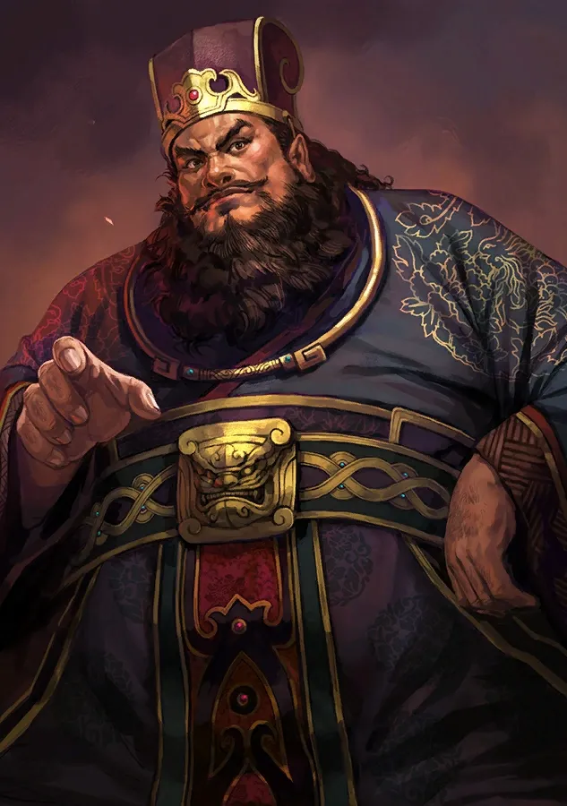

> 이미지는 게임 기획 문서에 포함된 일러스트레이션으로, 왕 또는 황제를 연상케 하는 캐릭터의 모습입니다.

### 캐릭터 묘사

*   **얼굴:** 짙은 갈색의 수염과 머리카락을 가지고 있으며, 짙은 눈썹과 날카로운 눈빛으로 강인한 인상을 줍니다. 입꼬리가 살짝 올라가 있어 다소 도발적인 표정을 짓고 있습니다.
*   **의복:** 전통적인 동양 스타일의 왕실 복장을 입고 있습니다. 보라색과 금색의 왕관을 쓰고 있으며, 짙은 보라색과 금색, 그리고 녹색이 혼합된 복잡한 패턴의 옷을 입고 있습니다. 가슴 중앙에는 금색의 용 머리가 새겨진 장식품이 있고, 허리에는 금색과 보라색의 허리띠를 착용하고 있습니다.

### 배경

*   배경은 보라색과 짙은 회색 구름이 혼합된 어둡고 흐린 하늘을 배경으로 하고 있어, 캐릭터가 강조되도록 설정된 것 같습니다.

### 전체적인 분위기

*   전체적으로 이 캐릭터는 권위롭고 강력한 왕 또는 황제와 같은 이미지를 나타내고 있습니다. 캐릭터의 표정과 자세는 자신감과 권력을 상징하며, 의복의 세부적인 디자인은 고풍스럽고 화려합니다.

---

## 슬라이드 15

**적군 캐릭터 The Hermit(우선순위1)**

**아무런 것도 요구하지 않으며 오직 아르카나의 유지를 위하는 교황**

  - 세상이 그를 사랑하지 않았지만 그는 세상을 사랑했다
**키워드**

  - 침묵, 아르카나 충성파, 스승, 침묵, 수호자
**성격**

  - **책임감있는, 애착있는, 희생적인**
**전투 컨셉**

  - **디버프, 버프 효과있는 아군에게 강화 공격**
  - **일정턴마다 강력한 스킬 준비(원기옥 같은 거)**
  - **준비되기전에 집중공격으로 기절시켜 스킬을 없애야함**
  - **(아군 캐릭터 한명을 등불에 가둠)(이를 파괴해야 함)(파괴 됬을 때 디버프)**
**개인 스토리**

  - 누구보다 감정이 없고 오직 아르카나라는 세계를 위해 살아온 인물
  - 하지만 현재 자신에게 남아있는 건 사망할 때 Justice를 보며 쓸쓸하다고 말하며 최후
**기획의도**

  - 스승의 제자 사랑을 보여주는 인간적인 적
  - 비운의 충성파 교황으로 입체적인 악당
  - 한번에 딜을 쏟아부을 때 도파민
**레퍼런스**

  - 축복의 모르고트,프랑수아 르클레르 뒤 트랑블레
| 캐릭터 명 | 그레이스(미정) |
| --- | --- |
| 나이 | (외관 50~60세) |
| 성별 | 남 |
| 역할 | 운명의 교단 교황으로 아르카나의 충신 |
| 소속 | 운명의 교단 |
| 전투 스타일 | 버프 디버프 무효화 및 차지앤 파이어로 타이밍 중심의 전투 |

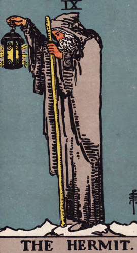

> 해당 이미지는 타로카드 "The Hermit"을 묘사하고 있습니다. 

이미지 중앙에는 눈 덮인 산길을 홀로 걷고 있는 노인이 있습니다. 노인은 회색빛의 긴 옷과 망토를 입고 있으며, 왼쪽에는 노란색 지팡이를 들고 있습니다. 노인의 왼손에는 노란색과 검은색으로 이루어진 랜턴이 들려져 있습니다. 랜턴 안에는 노란 불빛이 켜져 있습니다. 

노인의 얼굴에는 흰 수염이 가득 나 있고, 이마에는 주름이 지어져 있습니다. 노인은 눈을 내리깔고 앞으로 응시하며 걷고 있습니다. 

이미지 하단에는 노란색 띠가 가로로 그어져 있고, 그 위에 검은색 글씨로 "THE HERMIT"이라는 카드 이름이 적혀 있습니다. 이미지 상단 중앙에는 로마 숫자 "IX"가 있습니다. 

배경은 짙은 청색이며, 오른쪽 하단에는 작가의 서명이 있습니다. 

전체적으로 고요하고 고전적인 분위기를 전달합니다.

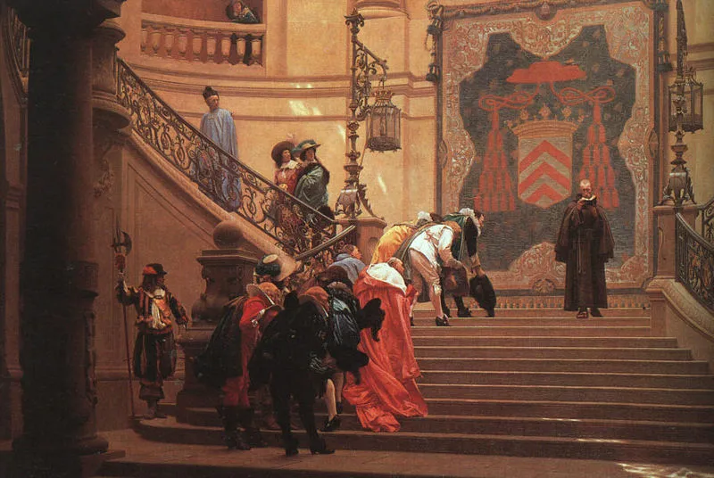

> 이미지는 16세기 말에서 17세기 초의 바로크 시대 유럽의 화려한 인테리어가 담긴 거대한 계단이 있는 웅장한 건축물의 내부 공간을 묘사하고 있습니다. 

주조명은 밝은 햇살이 오른쪽 위에서 비추고 있습니다. 

화면 왼쪽에는 벽을 따라 기둥이 줄지어 있고, 그 뒤로 난간이 있는 나선형 계단이 보입니다. 

난간 뒤로는 2층 벽면에 부조가 새겨진 난간이 또 하나 보입니다. 

나선형 계단 아래쪽에는 무장한 경계병이 보입니다. 

경계병의 오른쪽으로는 여러 명의 사람들이 무리를 지어 아래쪽으로 내려오고 있습니다. 

중앙의 주계단으로 내려오는 사람들의 모습이 그려져 있습니다. 

복장들을 살펴보면, 무장한 경계병과 수행인, 그리고 화려한 옷차림의 상류층으로 추정되는 사람들이 보입니다. 

가운데에서 우측으로 내려오는 사람들의 모습은 더 선명합니다. 

화려한 주황색 옷을 입은 여성이 선두에 있고, 그 뒤로 여러 사람들이 뒤따릅니다. 

그 뒤로 보이는 계단 오른쪽에는 벽면을 장식하고 있는 대형 벽걸이 카펫이 보입니다. 

카펫에는 독수리 문장이 그려져 있습니다. 

카펫 오른쪽으로는 긴 흑색 옷을 입은 남성이 우측을 향해 서 있습니다. 

그 뒤로는 벽면에 두 개의 벽 촛불이 보입니다. 

이미지에는 텍스트가 포함되어 있지 않습니다. 

시각적 레이아웃과 구조를 설명하면 다음과 같습니다. 

이미지는 크게 세 부분으로 나뉩니다. 

왼쪽에는 기둥과 계단이 있고, 중앙에는 사람들이 무리를 지어 계단을 내려오고 있습니다. 

오른쪽에는 대형 카펫과 벽 촛불, 그리고 흑색 옷을 입은 남성이 있습니다. 

이미지 중앙의 주된 시선은 계단을 내려오는 사람들의 모습에 집중되어 있습니다. 

이미지 상단에는 2층 난간과 벽면의 부조가 시선을 끌고 있습니다. 

이미지 하단에는 주계단과 그를 따라 움직이는 사람들이 있습니다. 

이미지 오른쪽에는 대형 카펫과 벽 촛불, 그리고 흑색 옷을 입은 남성이 있습니다. 

이미지 전반적으로는 웅장한 건축물의 내부 공간과 그 안에서 움직이는 사람들의 모습이 담겨 있습니다. 

이미지에는 다양한 캐릭터와 아이콘이 포함되어 있습니다. 

캐릭터는 다음과 같습니다. 

* 무장한 경계병 
* 수행인 
* 화려한 옷차림의 상류층 사람들 

아이콘은 다음과 같습니다.

* 부조가 새겨진 난간 
* 대형 벽걸이 카펫 
* 벽 촛불 
* 문장 

UI 요소는 포함되어 있지 않습니다.

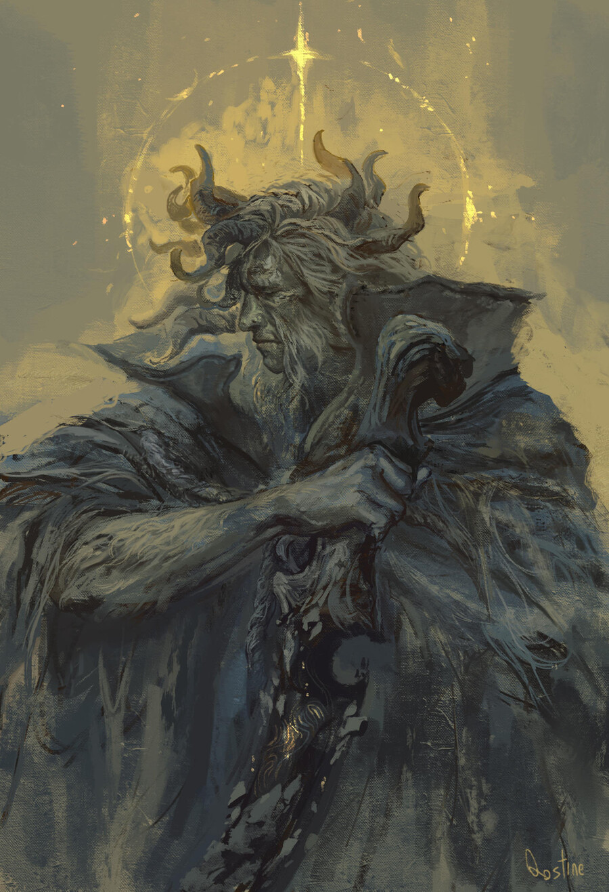

> 이 게임 기획 문서에 포함된 이미지는 짙은 회색과 금색조의 흐리고 탁한 배경을 바탕으로 한 인물 삽화입니다. 

이미지 중앙에는 거대한 뿔이 여러 개 달린 머리를 한 남성이 그려져 있습니다. 이 남성은 긴 흰색 수염과 머리카락을 가지고 있으며, 눈은 반쯤 감긴 듯한 모습을 하고 있습니다. 

그는 왼쪽 어깨를 드러낸 채로 짙은 색깔의 망토를 입고 있습니다. 망토의 왼쪽 어깨 부분에는 여러 개의 뿔이 솟아나와 있고, 망토의 오른쪽 부분에는 짙은 회색과 금색의 무늬가 그려져 있습니다.

남성의 오른쪽 손에는 거대한 낫을 쥐고 있습니다. 낫의 날 부분에는 불규칙한 톱니 모양이 새겨져 있습니다.

배경에는 노란색의 빛나는 별 모양의 무늬가 있고, 그 주위를 노란색의 구름 같은 것이 감싸고 있습니다.

이미지 하단 오른쪽에는 'dostine'이라는 이름이 노란색으로 쓰여져 있습니다. 

전체적으로 이 삽화는 짙은 색조와 금색의 강조된 부분들이 조화를 이루고 있어, 신화적이거나 판타지적인 분위기를 연출하고 있습니다.

---

## 슬라이드 16

**적군 캐릭터 Judgement**

**자신만이 자신의 운명을 심판을 할 수 있다고 믿는 캐릭터**

  - 정해진 운명의 세계(아르카나)를 부수려는 인물
  - Justice를 이기는 게 인생의 목표!!!
**키워드**

  - (애증?)거만,능력있는,승부욕 있는,판결,라이벌 의식,오만
**성격**

  - **거만한, 인정 받고 싶어하는**
**능력 컨셉**

  - 가장 강한 딜을 넣은 적에 약화 디버프, 다음턴에 공격
  - 유죄 판결: 누적된 공격에 따른 스탯에 비례해 광역 데미지
**개인 스토리**

  - 라이벌 의식이 강한 The Hermit의 제자 Justice가 떠난 후 재판관자리를 차지한 후임
**기획의도**

  - 인성 쓰레기 같은 대사같은걸로  플레이어가 처치할 동기 제공
  - 강한 딜러를 견제하며 전투하게 하는 전략적 플레이
**레퍼런스**

  - 나오야,카이가쿠,양양궁
| 캐릭터 명 | 이드(미정) |
| --- | --- |
| 나이 | 27세 |
| 성별 | (아트팀에서 원하는 대로) |
| 역할 | 아군의 캐릭터를 질투하는 찌질한 인물 |
| 소속 | 운명의 교단 |
| 전투 스타일 | 메인 딜러의 약할 분산, 스탯의 광역 |

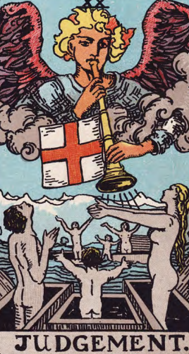

> 해당 이미지는 타로카드 "심판(Judgement)"을 묘사하고 있습니다. 

이미지 상단에는 큰 날개와 금빛 나팔을 들고 있는 천사가 그려져 있습니다. 천사의 머리색은 금발이며, 얼굴에 붉은 꽃을 올린 모습입니다. 천사 아래에는 흰색과 붉은색 십자가가 그려진 깃발이 보입니다.

이미지 하단에는 무덤에서 사람들이 일어나고 있는 모습이 묘사되어 있습니다. 사람들 대부분은 나체가 아닌 알몸으로 그려져 있으며, 양팔을 벌리고 하늘을 향해 시선을 고정하고 있습니다. 

이미지 하단 중앙에는 "JUDGEMENT"이라는 단어가 영문으로 표기되어 있습니다. 

전체적으로 이 타로 카드는 최후의 심판을 상징하는 카드로, 부활과 각성을 의미합니다.

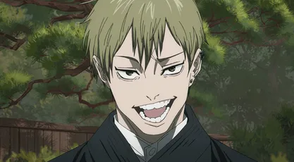

> 이미지는 애니메이션 캐릭터의 스크린샷입니다. 

### 이미지 상세 설명

*   **캐릭터 묘사**: 이미지 중앙에 있는 남성의 모습입니다. 
*   **얼굴**: 짧은 금발머리입니다. 눈은 녹색입니다. 
*   **표정**: 입꼬리가 올라간 사악한 표정입니다. 
*   **의상**: 검은색 옷을 입고 있습니다. 
*   **배경**: 나무가 배경으로 보입니다. 

이미지는 게임 기획 문서의 일부로, 이 캐릭터가 게임에 등장하는 캐릭터 중 하나임을 암시합니다.

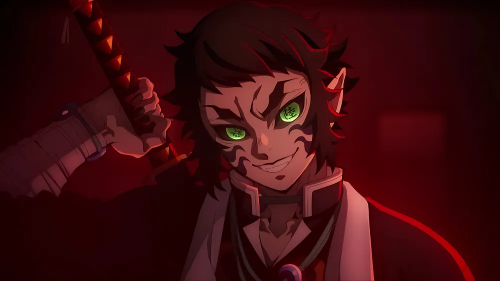

> 해당 이미지에는 한 명의 캐릭터가 등장합니다. 

*   캐릭터의 생김새 

    *   눈: 녹색의 눈동자를 가지고 있습니다. 
    *   머리: 짙은 갈색의 머리카락을 가지고 있습니다. 
    *   얼굴: 짙은 갈색의 줄이 얼굴에 그어져 있습니다. 
    *   의상: 짙은색의 상의와 밝은색의 긴팔 옷을 입고 있습니다. 
    *   무기: 허리춤에 칼을 착용하고, 한 손에는 검이 있습니다. 
    *   피부: 짙은 피부톤을 가지고 있습니다. 
    *   표정: 입꼬리가 올라간 미소를 띤 표정입니다. 

*   배경 

    *   짙은 보라색의 배경으로 어둡게 처리되어 있습니다. 
    *   캐릭터의 오른쪽 뒤편으로 붉은색의 빛줄기 형태가 보입니다. 

*   종합 

    *   전반적으로 어둡고 짙은 색감으로 표현되어 있어, 위협적이거나 공격적인 분위기를 조성하고 있습니다. 
    *   캐릭터의 미소와 녹색의 눈동자가 강조되어 있어, 이 캐릭터가 악한 성격을 가지고 있음을 암시하는 것 같습니다.

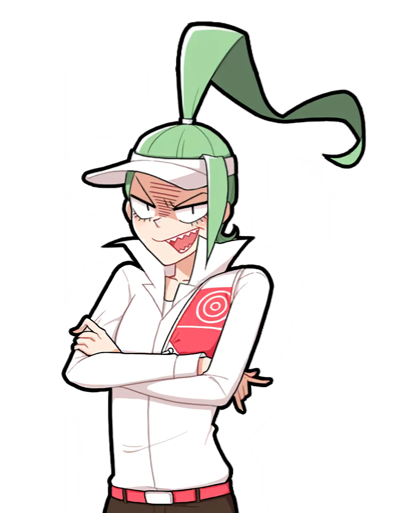

> 해당 이미지에는 한 명의 캐릭터가 등장합니다. 

*   캐릭터의 생김새: 

    *   녹색 머리카락에 머리를 묶은 듯한 헤어스타일을 가지고 있습니다. 
    *   눈은 반쯤 감긴 모습이며, 입꼬리가 올라간 표정으로 묘사되어 있습니다. 
    *   이마에는 흰색의 천이 감겨져 있습니다. 
*   캐릭터의 의상: 

    *   흰색의 긴팔 점퍼를 입고 있습니다. 
    *   왼쪽 가슴에는 원형의 빨간색 로고가 그려져 있습니다. 
    *   허리에는 빨간색 벨트를 착용하고 있습니다. 
    *   검은색 바지를 입고 있습니다. 
    *   흰색과 녹색의 모자를 쓰고 있습니다. 

캐릭터의 전체적인 분위기는 공격적이거나 반기는 모습으로 표현된 것으로 보입니다.

---

## 슬라이드 17

**적군 캐릭터 The Moon**

**(이중 인격의 캐릭터) 두려움의 원인을 파괴하는 냉정한 면 / 남을 따라 적극적으로 의존을 하여 책임 회피를 하려는 두려워하는 면**

**키워드**

  - 피해망상 ,정신적으로 미숙한, 내성적, 미지에 대한 공포,기록
**성격**

  - **모든 것에 두려워하며,분석하려 노력**
**능력 컨셉**

  - **2개의 모드로 각 모드에 마다 행동을**
  - **공격 모드: 일반 공격을 함**
  - **반격 모드: 해당 모드에서 공격을 받을 때 강한 반격**
  - **(들어온 패의 정방향 역방향의 방향을 서로 바꿈?)**
  - **동일한 스킬을 일정시간 동안 사용불가**
**개인 스토리**

  - 아르카나 그 자체 「THE WORLD」를 파괴하여
**시스템: 대사: 제발 공격하지마**

  - **3턴 동안 The Moon을 공격하지 않으면 바로 클리어 됨(대신 보상 없음)**
**기획의도**

  - 공포에 떠는 인물에 대한 동정심
  - 전투하지 않는 대가로 보상을 안 받는 선택의 깊이 부여
**레퍼런스**

  - 제노사이더 쇼,
| 캐릭터 명 | 세이디(미정) |
| --- | --- |
| 나이 | 27세 |
| 성별 | 여성 |
| 역할 | 기록관,서기관 |
| 소속 | 운명의 교단 |
| 전투 스타일 | 스킬봉인, 강력한 반격 |

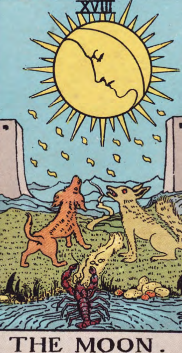

> 해당 이미지는 타로카드 "The Moon"을 묘사하고 있습니다. 

카드 상단에는 로마 숫자 'XVIII'가 있고, 노란색 달과 태양이 겹치는 일식처럼 생긴 노란색 구체가 그려져 있습니다. 

해당 구체는 밝은 빛을 내뿜고 있으며, 그 아래에는 들개 두 마리와 전복이 그려져 있습니다. 들개 두 마리는 달을 보고 울부짖고 있는 자세이고, 전복은 물가에서 모습을 드러내고 있습니다.

들개가 있는 곳은 잔잔한 물가로, 들개의 뒷편에는 멀리 산이 있고, 이미지 좌우에는 회색 탑 2개가 그려져 있습니다.

이미지 하단에는 'THE MOON'이라는 문구가 있습니다. 

전체적으로 고요하면서도 신비로운 밤의 풍경을 연상케 하며, 신화적이거나 몽환적인 분위기를 자아냅니다.

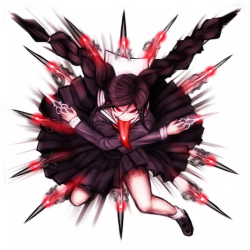

> 이미지는 게임 캐릭터의 일러스트입니다. 

검은색 머리, 검은색 눈, 하얀 피부톤을 가진 소녀가 그려져 있습니다. 

*   소녀의 머리는 왼쪽과 오른쪽으로 갈라진 투 사이드 업이며, 머리카락의 길이는 목까지 오는 긴 머리입니다. 
*   눈은 약간의 붉은 기운이 감도는 검은색입니다. 
*   입은 크게 벌려져 있고, 혀가 입 밖으로 나와 있습니다. 
*   소녀의 의상은 검은색입니다. 
    *   상의는 긴팔이며, 소매는 하얗게 트임이 있습니다. 
    *   하의는 치마이며, 여러 겹의 레이어드 원피스로 구성되어 있습니다. 
    *   신발은 로퍼이며, 발등 부분이 드러납니다. 
*   소녀의 몸 주변에는 여러 개의 날카로운 검은색 막대가 무작위로 뻗어 있습니다. 
*   막대 주변에는 붉은색 광선이 감돌고 있습니다. 
*   소녀의 몸에서는 붉은색의 기운이 뿜어져 나오고 있습니다. 
*   배경은 하얀색입니다.

---

## 슬라이드 18

**적군 캐릭터 The Emperor (1페이즈)**

**가장 소중한 배우자를 잃은 황제 / 모든 걸 가졌으나 모든 걸 잃은 황제**

**키워드**

  - 복수,허무,질서,아르카나의 꼭두각시,자신이 소환하는 것에 의존하는 왕
**성격**

  - 배우자가 죽은 후 매우 냉혹한 왕이 됨
**능력 컨셉 (The World의 1페이즈)**

  - **일정턴 동안캐릭터**
  - **중간 보스 중 하나의 스킬 사용**
  - **(그림자 형태의 중간보스 일정턴 소환)**
**개인 스토리**

  - **가장 소중한 배우자를 잃음으로 인해 질서라는 자신의 껍데기만 남은**
**기획의도**

  - 꼭두각시의 왕, 복수하려 한 존재에 사정을 부여해 캐릭터 개인의 감정 부여
  - 이전 보스의 스킬을 사용해 전투 패턴의 다양화
**레퍼런스**

  - 아스고어,마비노기 팔라딘(리안), 샤레니안의 기사단
| 캐릭터 명 | 하르트(미정) |
| --- | --- |
| 나이 | 약200년 |
| 성별 | 남성 |
| 역할 | 운명의 교단의 실질적인 권력자 |
| 소속 | 운명의 교단 |
| 전투 스타일 | 이전적 스킬 사용 |

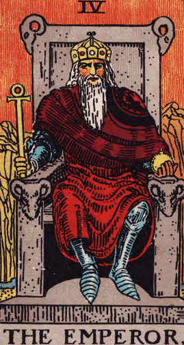

> 해당 이미지는 타로카드 "The Emperor" 입니다. 

*   이미지 상단 중앙에는 로마 숫자 $\text{IV}$가 있습니다.
*   이미지 중앙에는 왕좌에 앉아 있는 황제(Emperor)가 있습니다. 
    *   황제는 길고 흰 수염과 하얀 머리를 가지고 있습니다. 
    *   황제는 금색 왕관을 쓰고 있습니다. 왕관에는 보석이 박혀 있습니다. 
    *   황제는 붉은색 옷을 입고 있습니다. 
    *   황제는 왼쪽 손에는 홀을 들고 있으며, 오른쪽 팔꿈치는 왕좌의 팔걸이에 올려져 있습니다. 
    *   황제의 양쪽 무릎에는 갑옷이 착용되어 있습니다. 
*   황제가 앉아 있는 왕좌 뒤로는 주황색 벽이 있고, 벽 위에는 $\text{IV}$가 새겨져 있습니다. 
*   왕좌의 좌우에는 노란색과 하얀색의 장식품이 있습니다. 
*   이미지 하단에는 $\text{THE EMPEROR}$라는 문구가 있습니다.

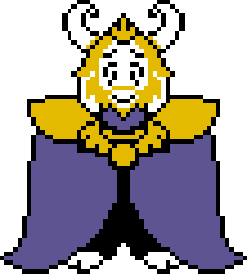

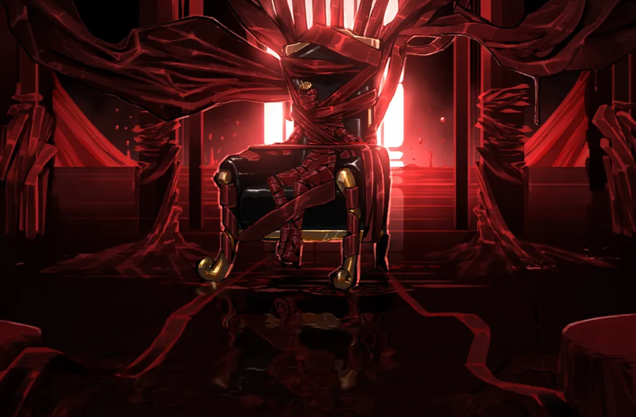

> 이미지는 게임 기획 문서의 일부로 보이는 이미지입니다. 이미지는 어둡고 붉은 색조로 채워져 있습니다. 

중앙에는 금속 재질로 만들어진 의자가 있습니다. 의자는 네 개의 금속 다리와 등받이, 팔걸이를 가지고 있습니다. 의자에는 붉은 천이 여러 겹으로 감겨져 있습니다. 

의자 뒤로는 여러 개의 창문으로 추정되는 구조물이 보입니다. 창문은 밝은 빛이 새어 나오고 있습니다. 

이미지 왼쪽과 오른쪽에는 붉은 천이 벽이나 기둥에 묶여 있는 모습이 보입니다. 

이미지 하단에는 의자의 반사된 모습이 어둡게 나타납니다.

이미지 전반적으로 붉은 색조가 강하게 나타납니다.

---

## 슬라이드 19

**적군 캐릭터 The World**

**왕의 죽음에 따라 운명의 교단을 흡수한 세계(아르카나)그 자체**

**키워드**

  - 일정보다 빠르게 강림한 신,운명,플레이어만이 죽일 수 있는 존재, 행복을 추구,세계의 지휘자
**성격**

  - 강림 이외에는 무관심, 방해되는건 처리,자비롭고 자애로움, 자신만의 정의를 따름
**능력 컨셉**

  - **공격은 심플한 일반공격(매우 아야함)**
  - **지정한 캐릭터의 얻은 증강 일정턴 초기화 (플레이어의 운명을 조절하는 연출)**
  - **필살기(차지 공격)(스턴을 통한 공격 끊기)**
  - **(역방향 봉인 디버프)**
**개인 스토리**

  - 러브크레프트같은 우주적 존재 오랬동안 존재해온 운명의 신, 자신이 이땅에 강림하기 위해 지금까지 운명을 조작해왔다.
  - Emperor이 무력화된 상황에 Emperor의 몸에 전의한다.
**기획의도**

  - 플레이어가 쓰러트려야 할 캐릭터 그 자체 동기부여
  - 윤회의 신 답게 이전 회귀와 현재 전투의 연관성 부여
**레퍼런스**

  - 엔티티, 은밀한 모략가, 이터널슈가 쿠키
| 캐릭터 명 | 더 월드 |
| --- | --- |
| 나이 | 추정불가 |
| 성별 | 없음 |
| 역할 | 최종보스, 쓰러트려야하는 존재 |
| 소속 | 없음 |
| 전투 스타일 | 회귀 스킬 사용 |

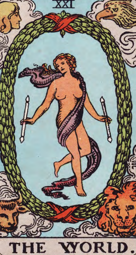

> 이미지는 타로카드 "The World"입니다. 

카드 중앙에는 타원형의 월계수가 있고 그 안에 여성과 뱀이 있습니다. 여성은 왼발은 뒤로 물리고, 오른발은 앞으로 내딛은 채로 두 개의 막대를 들고 있습니다. 뱀은 여성의 몸을 감고 있습니다. 

카드 상단에는 로마 숫자 'XXI'가 있고, 하단에는 'THE WORLD'이라는 텍스트가 있습니다. 

카드 테두리에는 사자, 타조, 얼굴, 그리고 구름이 그려져 있습니다. 

이미지 상단과 하단에는 흰색 테두리가 있습니다.

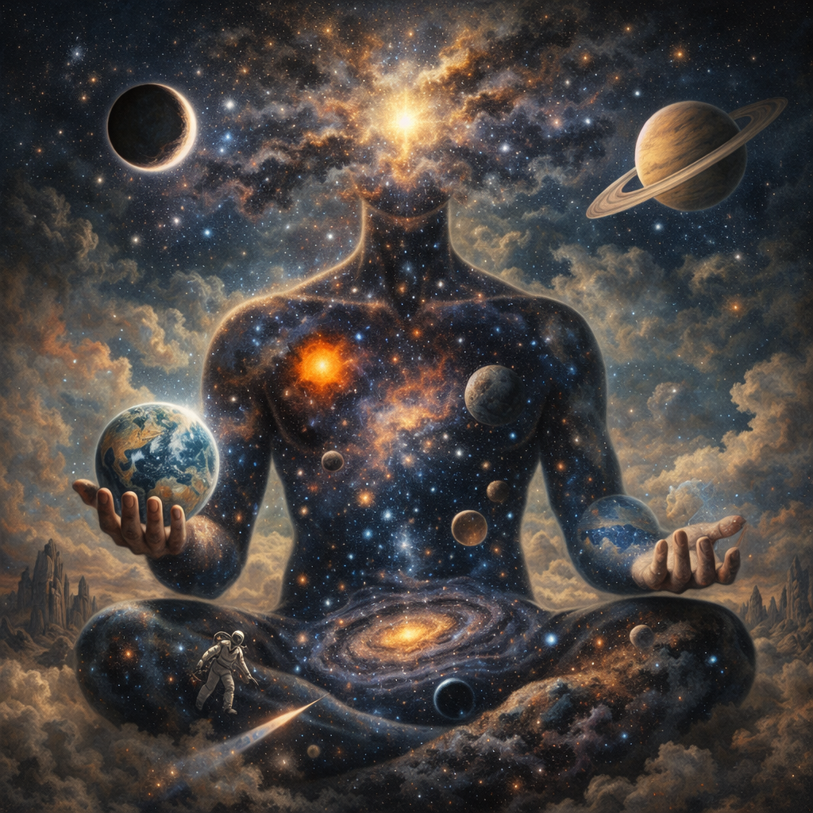

> 이미지는 우주를 배경으로 한 명상의자에 앉아 있는 사람의 모습을 표현하고 있습니다. 

*   화면의 중앙에는 명상의자에 앉아 있는 사람의 모습이 표현되어 있습니다. 
*   명상의자에 앉아 있는 사람의 신체에는 태양계, 별, 은하, 우주와 관련된 여러 천체가 표현되어 있습니다. 
*   명상의자에 앉아 있는 사람의 신체는 우주를 표현한 듯한 디자인으로 되어있습니다. 
*   명상의자에 앉아 있는 사람의 머리 위로는 밝은 빛이 표현되어 있습니다. 
*   명상의자에 앉아 있는 사람의 왼쪽 손에는 지구가 표현되어 있습니다. 
*   명상의자에 앉아 있는 사람의 오른쪽 손가락 사이로는 우주 공간이 표현되어 있습니다. 
*   명상의자에 앉아 있는 사람의 왼쪽 발 옆에는 우주복을 입은 우주인이 표현되어 있습니다. 
*   화면의 상단 왼쪽에는 달이 표현되어 있고, 상단 오른쪽에는 토성이 표현되어 있습니다. 
*   화면의 하단에는 산과 구름이 표현되어 있습니다. 
*   화면의 중앙에 있는 명상의자에 앉아 있는 사람의 뒤로는 수많은 별과 성운이 표현되어 있습니다. 
*   화면의 중앙에 있는 명상의자에 앉아 있는 사람과, 달, 토성, 우주, 별, 성운, 우주인 등은 노란색과 짙은 파란색을 메인 컬러로 활용하여 표현되어 있습니다.

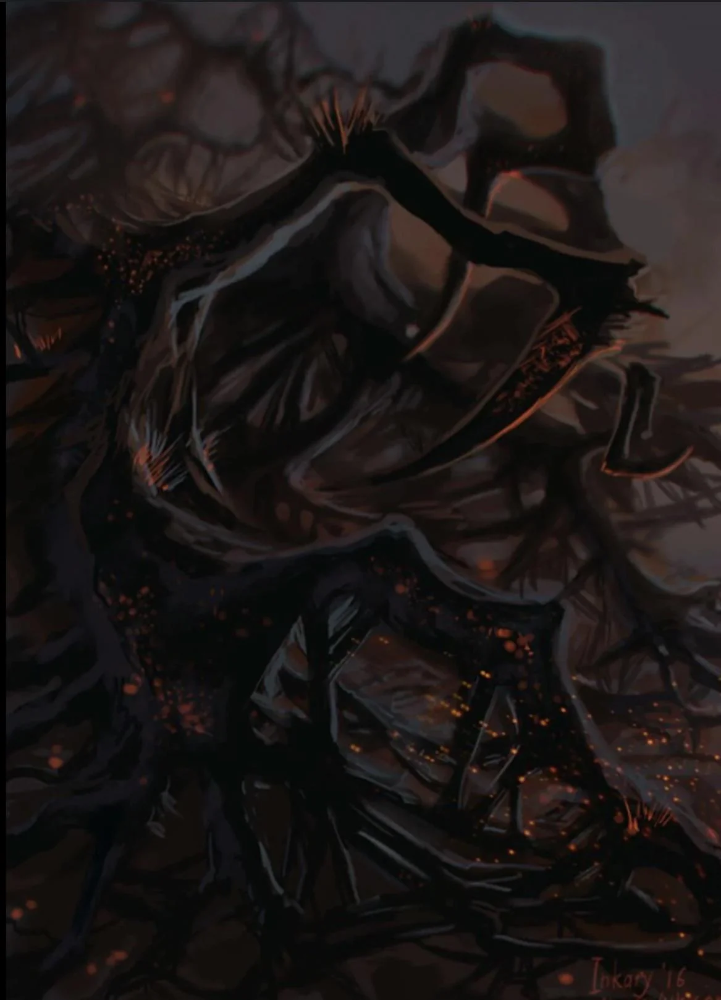

> 이미지는 짙은색 배경에 불규칙한 모양의 어두운 덩어리들이 뒤엉켜 있는 모습을 그리고 있습니다. 여러 개의 어두운 덩어리들이 서로 얽혀 있는 듯한 모습을 보여주며, 곳곳에 작은 주황색 빛이 반사되어 있는 것을 확인할 수 있습니다. 

이미지의 하단 우측에는 Inkary '16이라는 문구가 작게 적혀 있습니다. 

이미지에는 눈에 띄는 UI 요소나 아이콘, 텍스트가 포함되어 있지 않습니다.

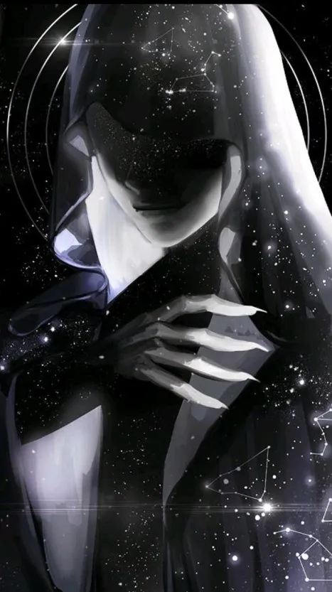

> 이미지는 흑백 일러스트로, 게임 기획 문서의 일부로 추정됩니다. 이미지는 어둡고 짙은 배경에 흰색과 밝은 회색조의 선명한 일러스트가 대비를 이룹니다.

이미지 중앙에는 한 인물이 어둡고 짙은색의 천을 머리와 몸에 두르고 있습니다. 이 인물은 눈을 감고 있으며, 손가락을 꼬아 가슴 부위에 위치시키고 있습니다. 

배경에는 은하계와 별들이 흩어져 있습니다. 인물 뒤에는 원 모양의 무늬가 있고, 그 위쪽에는 별자리가 그려져 있습니다. 

이미지 중앙에 위치한 인물의 분위기는 고요하고 고전적인 느낌을 줍니다. 배경의 별들과 별자리는 신비로움을 더해주고 있습니다. 

이미지에는 텍스트가 포함되어 있지 않습니다.

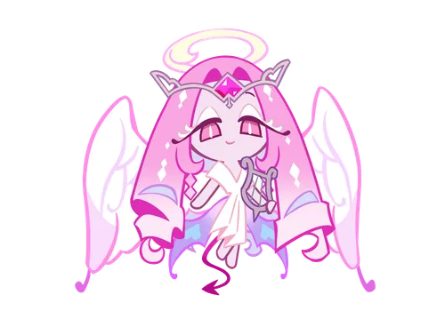

> 해당 이미지에는 분홍색의 머리카락과 날개를 가진 천사가 그려져 있습니다.

*   **캐릭터의 생김새**: 

    *   캐릭터는 긴 분홍색 머리카락을 가지고 있습니다. 
    *   캐릭터의 눈은 분홍색이며, 눈꼬리가 살짝 올라가 미소를 머금고 있는 듯한 인상을 주고 있습니다. 
    *   캐릭터의 머리에는 하트 모양의 보석이 박힌 왕관을 쓰고 있습니다. 
    *   왕관 옆에는 날개가 그려져 있습니다. 
    *   캐릭터의 뒤에는 후광이 표현되어 있습니다. 
*   **캐릭터의 의상**: 

    *   캐릭터는 흰색의 상의를 입고 있습니다. 
    *   캐릭터의 왼쪽에는 하트 모양의 아티팩트를 들고 있습니다. 
*   **이미지 구성**: 

    *   흰색 배경에 분홍색 캐릭터가 중앙에 위치하고 있습니다. 
    *   캐릭터의 날개와 꼬리, 후광이 표현되어 있습니다. 
    *   이미지의 구성은 간결하며, 캐릭터가 돋보일 수 있도록 중앙에 배치되었습니다.

---

## 슬라이드 20

보류

---

## 슬라이드 21

**적군 캐릭터 The Love**

**사람은 서로가 서로를 지지하기위해 뭉쳐있어야만 한다.**

**키워드**

  - 연민, 집착,웬디 증후군,남을 자신에게  의존시키려 함
**성격**

**능력 컨셉**

**개인 스토리**

  - 아르카나 그 자체 「THE WORLD」를 파괴하여
**개인 스토리**

  - 아르카나 그 자체 「THE WORLD」를 파괴하여
**기획의도**

  - 변화하는 플레이어 캐릭터의 변화 및 기존 존재하는 스킬로 윤회의 특징표현
  - 플레이어가 회귀를 통한
| 캐릭터 명 | 리베아 |
| --- | --- |
| 나이 |  |
| 성별 | 여성 |
| 역할 |  |
| 소속 |  |
| 전투 스타일 |  |

---

## 슬라이드 22

**아군 캐릭터 The Devil**

**겉은 거칠지만 자신의 사람에게는 상냥함**

**(표현이 어려우면 버릴 수 밖에)**

**키워드**

  - The Devil,복수,해방,부(모)성애,보호본능
**성격**

  - **자신의 사람만큼은 상냥한 인물**
  - **무기를 들고 있으나 자신의 사람들을 지키기 위해서 들고있는 무기**
  - **진지하지만 내면은 따뜻함 다혈질 한번 분노하면 눈 돌아가는 성격**
**능력 컨셉**

  - **(도발 어떰?)(폭딜)**
  - **어떤 캐릭터든 처치 시 할 때마다 체력 회복 및 강화**
  - **아군 캐릭터의 체력이 소모될 시**
**개인 스토리**

  - **(설명하기 어려울 것 같음)(표현이 어려움)**
  - **아무것도 지키 못했던 과거의 트라우마로 더 큰 힘으로 남을 지키려하는 인물**
  - **운명의 날(운명의 교단이 폭력진압으로 벌인 학살사건)에 가족이 학살당한 아버지고아를 데리고 도망친 인물**
  - 이로 인해 복수를 위해 살아온 인물
  - 고아를 자신의 아이처럼 아끼며 복수대신 아이의 성장을 목표로 살아가게 됨
**기획의도**

  - 나약함으로 인한 죄책감을 가지며 복수귀였으나 변화하는 캐릭터의 서사
  - 체력이 낮아질 때 강한 딜량으로 리스크에 대한 보상으로 도파민
**레퍼런스**

  - 켄파치, 조엘 밀러
| 캐릭터 명 | 엥겔 |
| --- | --- |
| 나이 | (외형30세) |
| 성별 | 모성애 또는 부성애? 상관없음 |
| 역할 | 꿈을 쫓는 자의 (애매모호 함) |
| 소속 | 꿈을 쫓는 자 |
| 전투 스타일 | 체력이 낮아질 수록 폭딜을 넣는 딜러 |

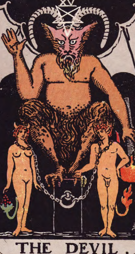

> 이미지는 타로카드 중 '악마(The Devil)' 카드를 묘사하고 있습니다. 이 카드는 전통적인 라이더-웨이트-스미스 타로 덱에서 15번 메이저 아르카나 카드입니다.

### 이미지 상세 설명:

1. **중앙의 악마:**
   - 악마는 큰 뿔과 귀를 가지고 있으며, 이마에는 오각별(펜타그램)이 뒤집힌 모습으로 그려져 있습니다. 
   - 오른손은 축복과 금지의 의미로 손바닥을 앞으로 향하게 들고 있으며, 왼손에는 횃불을 들고 있습니다.
   - 악마의 신체는 근육질이며 털이 많고, 꼬리가 있습니다.

2. **악마의 아래 두 인물:**
   - 악마의 아래에는 두 명의 작은 인간 형상이 있습니다. 이들은 악마에게 묶여 있는 것처럼 보입니다. 
   - 왼쪽 인물은 녹색과 빨간색의 과일이 달린 화환을 들고 있으며, 오른쪽 인물은 불덩이를 들고 있습니다.
   - 두 인물은 모두 벌거벗은 상태로 묘사되어 있으며, 이들은 악마의 지배를 받고 있는 것처럼 보입니다.

3. **텍스트:**
   - 이미지 하단에는 'THE DEVIL'이라는 단어가 크게 새겨져 있습니다.

4. **시각적 레이아웃과 구조:**
   - 이미지는 주로 짙은 색조와 강렬한 대비를 사용해 악마와 두 인간의 모습을 부각시키고 있습니다.
   - 배경은 짙은 색으로 처리되어 중심의 악마와 인간들을 강조합니다.

이 카드는 유혹, 속박, 욕망, 그리고 자유의 상실을 상징합니다. 타로 리딩에서 이 카드는 종종 부정적인 집착, 잘못된 욕망, 또는 도덕적으로 어려운 상황에 직면하고 있음을 나타낼 수 있습니다.

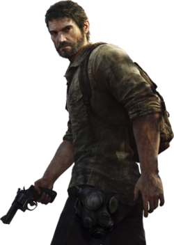

> 이미지는 비디오 게임 '라스트 오브 어스'의 주인공 조엘을 묘사하고 있습니다.

### 이미지 상세 설명

*   **인물:** 조엘은 게임의 주인공으로, 단단한 근육질의 남성의 모습입니다. 그는 왼쪽에 권총을 들고 있습니다. 
*   **의상:** 조엘은 더러운 녹색의 격자무늬 셔츠를 입고 있습니다. 그의 셔츠는 팔 부분이 묶여있고, 옷과 몸 곳곳에 먼지와 피가 묻어있어 그가 험난한 여정을 거쳤음을 암시합니다. 
*   **장비:** 조엘은 허리에 총알이 여러 개 들어간 탄창 벨트를 착용하고 있습니다. 그의 뒤에는 가방을 메고 있습니다. 가방은 조엘이 여행을 위해 준비한 물품이 들어 있을 것으로 추정됩니다.
*   **표정:** 조엘은 단호한 표정으로 앞으로의 위험에 대비하는 듯한 모습을 보여주고 있습니다.

### 레이아웃 및 구조

이미지는 정면이 아닌 측면에서 조엘을 촬영한 듯한 구도로, 화면 왼쪽에는 조엘이 쥐고 있는 손과 권총이 위치하고, 화면의 오른쪽에는 조엘의 몸통과 가방이 위치하고 있습니다. 화면의 배경은 하얀색으로, 조엘의 모습이 더욱 강조된 모습입니다.

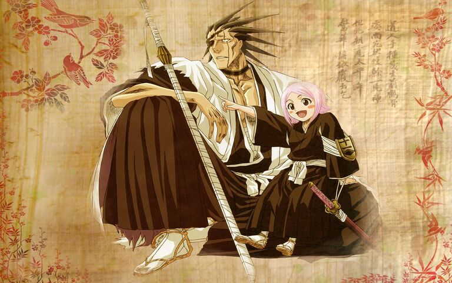

> 블리치 게임 기획 문서의 일부로 추정되는 이 이미지는 두 명의 애니메이션 캐릭터가 함께 앉아 있는 모습을 보여 주고 있습니다. 

### 이미지 상세 설명

*   **배경**: 배경은 전통적인 일본 문화를 연상케 하는 담 beige색의 텍스처드 패턴을 가지고 있습니다. 배경에는 붉은색 꽃과 새들의 패턴이 테두리를 따라 장식되어 있습니다. 오른쪽 상단에는 일본어로 쓰여진 문자가 있습니다. 
*   **캐릭터**:
    *   **왼쪽 캐릭터(남성)**: 이 캐릭터는 남성을 나타냅니다. 그는 하쿠레이(흰색 겉옷)와 검은색 하카마(허벅지까지 오는 긴 바지)를 입고 있습니다. 그의 머리는 뾰족하게 솟아올라가 있고, 눈썹은 길게 그려져 있습니다. 그는 오른손에 긴 검을 들고 있습니다. 
    *   **오른쪽 캐릭터(여성)**: 이 캐릭터는 여성으로, 분홍색 머리를 가지고 있습니다. 그녀는 검은색 도복을 입고 있으며, 왼쪽에는 비슷한 크기의 검을 착용하고 있습니다. 두 캐릭터는 함께 앉아 있으며, 여성 캐릭터가 남성 캐릭터의 팔을 잡고 있습니다. 
*   **구도**: 두 캐릭터는 배경의 중심에 위치하며, 상호작용하는 듯한 자세를 취하고 있습니다. 

### 종합

이 이미지는 블리치 게임의 캐릭터들을 소개하거나 홍보하기 위한 일러스트로 사용될 수 있습니다. 배경과 캐릭터의 의상, 그리고 무기 등을 통해 일본 문화를 기반으로 한 판타지 세계관을 표현하고 있습니다.

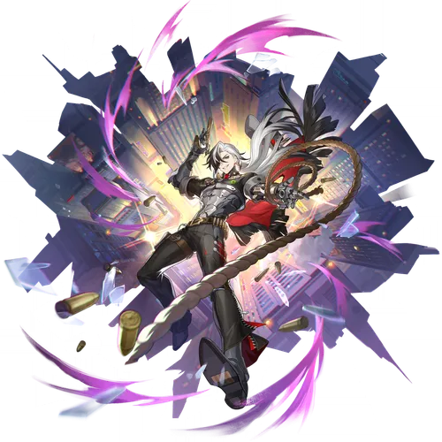

> 해당 이미지에는 한 명의 캐릭터가 등장합니다. 

*   캐릭터는 여성으로, 긴 은발과 은색 눈동자를 가지고 있습니다. 
*   캐릭터는 왼손에 기관단총을 들고 있습니다. 
*   캐릭터는 오른손에 거대한 낫을 들고 있습니다. 
*   캐릭터는 왼쪽 다리가 무릎이 굽혀진 상태로 공중돌핀 자세를 취하고 있습니다. 
*   캐릭터는 회색과 검은색의 갑옷을 입고 있습니다. 
*   캐릭터의 왼쪽 장갑에는 붉은색 천이 묶여 있습니다. 
*   캐릭터의 뒤로는 도시의 야경이 펼쳐져 있습니다. 
*   캐릭터의 머리 뒤로 보라색의 잔상이 표현되어 있습니다. 
*   캐릭터의 왼쪽 뒤로 총알이 떨어지고 있습니다.

전체적인 색감은 보라색과 회색, 검은색이 주를 이룹니다.

---
