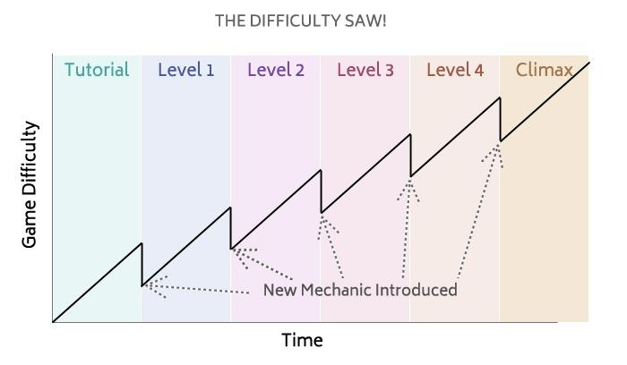
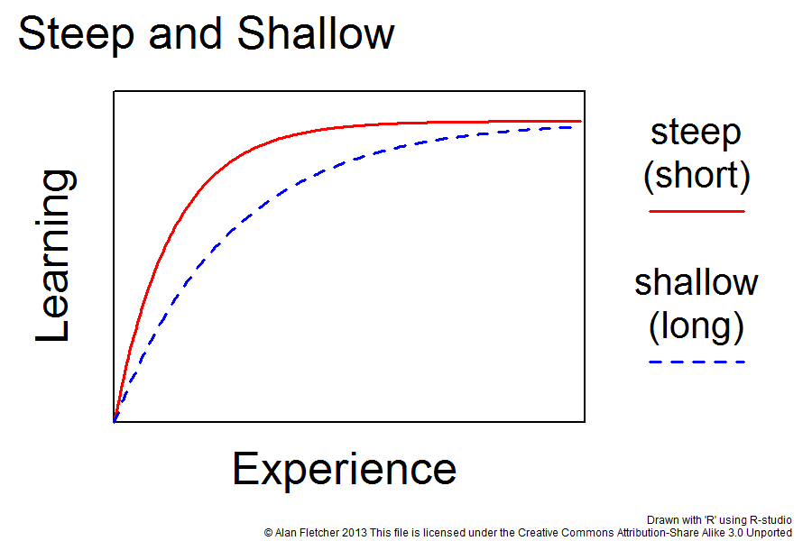
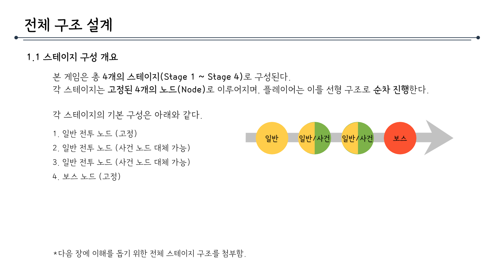

# 플레이경험기획문서_V2_장보성

## 슬라이드 1

**플레이 경험 기획서**

Light life 202313190 장보성

---

## 슬라이드 2

**변경사항**

변경된 내용 정리

| 일시 | 작업자 | 변경 사항 |
| --- | --- | --- |
| 2026.02.20 | 장보성 | 기획해야 할 항목 작성 |
| 2026.02.21 | 장보성 | 핵심 재미요소 |
| 2026.02.22 | 장보성 | 유의사항, 난이도 컨셉 |
| 2026.02.24 | 장보성 | 전체 난이도와 경험 직결 |
| 2026.02.25 | 장보성 | 전투 경험 구체화 |
| 2026.02.26 | 장보성 | 오타 수정 |

---

## 슬라이드 3

**문서 개요**

**프로젝트의 로그라이트 플레이 경험 구조를 정의함**

게임 전반의 설계 판단 기준이 되는 감정 설계 방향성과 구조적 원칙을 명확히 규정하기 위해 작성함

  - **기획 의도를 통합해 시스템,컨텐츠를 만들 수 있음!!!**
  - 플레이 시 감정,재미요소에 영향을 토대를 제공하는 문서
  - 시스템·밸런스 설계 이전 단계의 경험을 예상하고 기획!!!
---

## 슬라이드 4

**플레이어 경험 비전 문서**

**핵심 유저 경험 목표**

  - 짧은 시간 안에 빌드를 완성하고, 게임오버를 해도 성장하며 불쾌감을 줄이는캐릭터의 성장 순간을 체험하게 한다.
**플레이어가 느껴야 할 경험**

  - 예측 불가능한 적이나 사건 등장으로 흥미를 떨어지지 않는 로그라이트 경험
**경험 설계 목표**

  - 전투 안에서 전략이 나오게 함!!!!!
  - 캐릭터가 윤회하며 더욱 강해지는 육성의 재미
  - 플레이어의 선택에 따라 달라지는 결과를 보는 인지적 재미
  - 보스 및 어려운 도전을 클리어하는 쾌감
#### 인지적 재미

#### 회귀

#### 간단한 조작

#### 빠른

#### 성장

---

## 슬라이드 5

**핵심 경험 요소**

#### 전략의 재미:

#### 캐주얼

#### 전략의 재미:

#### 명확한 보상

#### 전략의 재미:

#### 빠른 몰입

#### 전략의 재미:

#### 선택의 자유

**중점으로 삼아야 게임의 방향성**

#### 진입장벽을 위해 전략의 중요도를

#### 낮춤

#### 승리에 대한

#### 명확한 보상으로 동기 제공

#### 전투 자체의 경험을 중점으로

#### 전략을 짜는 게임

#### 노드를 골라 피로도를 스스로 조절할 수 있도록 함

> 이미지는 검은색 인물 아이콘을 흰색 배경에 나타낸 그림입니다.

이미지 중앙에는 의자에 앉아 있는 사람의 실루엣이 검은색으로 그려져 있습니다. 

인물의 상반신은 왼쪽으로 기울어져 있고, 팔꿈치를 의자 팔걸이에 올리고, 머리는 뒤로 젖혀진 자세로 그려져 있습니다. 

인물의 몸은 단순화된 형태로 표현되었으며, 세부적인 근육이나 옷차림 등은 나타나지 않고, 형태를 간략화하여 표현하였습니다.

전체적으로 단순화된 형태와 대비되는 색상을 통해 시각적 명확성을 강조한 아이콘입니다.

> 해당 이미지는 게임 기획 문서의 일부가 아닌, 선물을 상징하는 픽토그램입니다.

이미지는 검은색 선으로 이루어진 선형 도형입니다. 도형은 선으로 이루어져 있으며, 가운데에 위치한 가로줄과 세로줄이 교차하는 형태입니다. 

도형의 상단에는 두 개의 동그란 형태가 겹쳐져 있는 듯한 모습으로 표현되어 있습니다. 이는 리본이나 선물 포장지의 매듭을 상징하는 것으로 보입니다.

전체적인 도형의 형태는 선형이며, 도형의 내부 공간은 채워져 있지 않습니다.

> 이미지는 검은색 배경에 흰색 실루엣의 클로킹 아이콘입니다. 클로킹 아이콘은 왼쪽에 3개의 짧은 선이 평행하게 나란히 있고, 그 옆에 둥근 원이 있습니다. 

둥근 원 내부에는 시계 바늘 모양의 실루엣이 있습니다. 시계 바늘은 시침과 분침이 있는 아날로그 시계의 짧은 바늘과 유사하지만 분침은 보이지 않습니다. 바늘은 오른쪽으로 치우쳐져 있고, 12시 방향이 아닌 3시 방향을 가리키는 것처럼 보입니다.

아이콘의 왼쪽에는 3개의 짧은 선이 평행하게 배치되어 있습니다. 이 선들은 원의 왼쪽에 위치하며, 원에서 방출되는 빛이나 에너지와 같은 효과를 나타내는 것처럼 보입니다. 

전체적으로 이 아이콘은 시간과 관련된 어떤 기능이나 개념을 상징하는 것으로 보입니다.

> 이미지는 화이트 배경에 검은색 선과 도형을 사용한 간단한 다이어그램입니다.

구성 요소:

검은색 원과 X자 모양: 이미지에는 총 2개의 원과 2개의 X자 모양이 있습니다. 

화살표: 굵은 검은색 화살표가 왼쪽 하단 원에서 시작되어 위로 곡선을 그리며 오른쪽으로 방향을 전환하여 가운데에 있는 원쪽으로 향하고 있습니다.

레이아웃:

왼쪽 상단: X자 모양
왼쪽 하단: 원
오른쪽 상단: 원
오른쪽 하단: X자 모양
화살표는 왼쪽 하단 원에서 시작하여 오른쪽 상단 원쪽으로 곡선으로 표시되어 있습니다.

구조:

이미지는 주로 원과 X자 모양이 대칭적으로 배치되어 있고, 화살표가 이들 사이를 연결하는 구조로 구성되어 있습니다. 화살표의 곡선 경로가 시각적 흐름을 강조하며, 원과 X자 모양이 교대로 배치되어 규칙적인 패턴을 형성합니다.

이 다이어그램은 두 지점 사이의 방향 또는 흐름을 나타내는 단순화된 표현으로 사용될 수 있습니다.

---

## 슬라이드 6

**유의해야 할 요소**

#### 전략의 재미:

#### 반복 피로 누적

#### 전략의 재미:

#### 확률 의존 체감 증가

#### 전략의 재미:

#### 후반 난이도 급상승 또는 붕괴

#### 전략의 재미:

#### 복잡한 시너지

#### 전략의 재미:

#### 플레이 동기 약화

**프로젝트 특성상 해결해야 할 문제**

#### 반복되는 전투에

#### 빠른 피로도 누적

#### 운에 요소가 강해 전략에 무력감을 느끼지 않도록

#### 뒤로 갈 수 록

#### 난이도가

#### 급상승하지 않도록 함

#### 복잡하고 직관적이지 않은 전략은 몰입도 저하

#### 패배의 좌절감

#### 게임 오버에도

#### 재도전 할 만한 보상

> 해당 이미지는 게임 기획 문서의 일부로 보이는 이미지입니다. 이미지는 검은색 주사위 아이콘을 포함하고 있습니다. 주사위는 정육면체로, 각 면에 하얀색으로 점을 찍어 숫자를 나타냅니다.

주사위는 3D 형태로 그려져 있으며, 주사위 면이 기울어져 있어 3개의 면이 보이는 각도로 표현되어 있습니다.

주사위 위쪽 면에는 4개의 점이 찍혀 있고, 아래쪽 면에는 3개의 점이 찍혀 있으며, 오른쪽 면에는 1개의 점이 찍혀 있습니다.

주사위 아이콘은 흰색 배경에 가운데에 위치해 있습니다.

> 배터리 잔량 부족 상태를 나타내는 아이콘입니다.

배터리 아이콘은 충전이 필요한 상태를 나타내는 것으로, 검은색 윤곽선 안에 흰색 사각형이 포함된 모습입니다. 배터리 잔량 표시기는 오른쪽에 작은 사각형이 하나 더 붙어 있는 형태로, 충전 단자를 나타냅니다.

사람의 모습은 검은색으로 그려져 있으며, 몸통과 팔, 다리 등이 단순한 선과 면으로 표현되어 있습니다. 머리는 원형으로 표현되었습니다. 

사람의 모습은 허리를 숙이고 무릎을 굽힌 자세로 묘사되어 있습니다. 이는 피로하거나 지친 상태를 나타내는 아이콘으로, 배터리 잔량 부족으로 인해 기력이 쇠한 상태를 표현한 것으로 보입니다.

아이콘의 전반적인 레이아웃은 흰색 배경에 배터리와 사람의 실루엣이 배치된 구조입니다.

> 해당 이미지는 게임 기획 문서의 일부로 추정되며, 막대 그래프를 통해 상승세를 나타내고 있습니다. 

구성 요소에 대한 상세한 설명은 다음과 같습니다.

*   검은색 막대 3개가 왼쪽에서 오른쪽으로 차례대로 놓여 있습니다. 막대의 크기는 왼쪽에서 오른쪽으로 갈수록 커지고 있습니다.
*   가장 오른쪽에 있는 막대는 다른 막대보다 훨씬 크고, 막대 위로는 커다란 검은색 위쪽 화살표가 있습니다.
*   막대는 동일한 너비를 가지고 있지만, 높이는 각각 다릅니다. 막대의 높이는 왼쪽에서 오른쪽으로 갈수록 높아지고 있습니다.
*   배경은 흰색입니다.

전체적으로 이 그래프는 어떤 지표가 시간이 지남에 따라 증가하고 있음을 나타내고 있습니다.

> 이미지는 게임이 끝났음을 나타내는 "GAME OVER" 라는 문구가 포함된 검은 사각형입니다.

*   검은 사각형의 레이아웃과 구조: 검은 사각형은 가로로 길쭉한 직사각형 모양이며, 네 개의 모서리가 모두 둥근 형태입니다. 
*   텍스트: 사각형 내부에는 **'GAME OVER'** 라는 흰색의 텍스트가 포함되어 있습니다. 
*   텍스트의 레이아웃과 구조: 텍스트는 두 행으로 구성되어 있으며, 첫 행에는 **'GAME'** 이고, 두 번째 행에는 **'OVER'** 입니다. 
*   텍스트의 폰트: 폰트는 동일한 두께의 획으로 구성된 산세리프 폰트입니다. 
*   배경: 검은 사각형의 배경은 흰색입니다.

> 이미지는 기어와 기어 연결을 나타내는 도형을 포함하고 있습니다.

구성 요소:

중앙의 큰 기어: 이미지 중앙에 하나의 큰 기어가 있습니다. 이 기어는 다른 여러 기어와 연결된 중심 역할을 하는 것으로 보입니다.

주변의 작은 기어: 중앙 기어의 주위에는 5개의 작은 기어가 있습니다. 이 기어들은 중앙 기어와 각기 다른 방향으로 배치되어 있습니다.

연결 라인: 중앙 기어와 작은 기어들은 짧은 선과 점선으로 연결되어 있습니다. 이러한 연결은 기어들이 서로 기계적으로 연결되어 있음을 나타냅니다.

레이아웃: 기어들은 대칭적인 구도로 배치되어 있습니다. 큰 기어가 중앙에 있고, 작은 기어들이 일정한 간격으로 주변에 배치되어 있습니다.

스타일: 모든 기어와 라인은 검은색으로 그려져 있으며, 배경은 하얀색입니다. 이는 단순하고 명확한 표현을 강조합니다.

이 도형은 기계적인 연결이나 시스템의 구조를 상징적으로 나타내는 아이콘으로 사용될 수 있습니다. 예를 들어, 소프트웨어의 시스템 구성, 기계 장치의 구조, 또는 프로세스 간의 연결을 설명하는 데 사용될 수 있습니다.

---

## 슬라이드 7

**윤회(코어 루프) 경험 기획**

#### 보스 다음 조우할 적의 난이도는 낮추는 난이도

#### 상대적으로 약해진 적 자신이 강해졌다고 느끼게 함

#### 높은 피로도의 전투 후 재정비 할 수 있게!

#### 난이도 낮춤

#### :보스와 전투

> ## 이미지 설명

해당 이미지는 게임 난이도 곡선을 표현한 그래프입니다. 영어 원제는 "THE DIFFICULTY SAW!"이며, 그래프의 제목은 게임 난이도와 시간에 따른 상관관계를 보여 줍니다.

### 그래프 레이아웃

*   가로축: 시간(Time)
*   세로축: 게임 난이도(Game Difficulty)

### 그래프 구조

*   배경: Tutorial, Level 1, Level 2, Level 3, Level 4, Climax으로 구분된 6개의 레벨로 구성되어 있습니다. 각 레벨은 서로 다른 색상으로 표시되어 있습니다.
*   선 그래프: 검은 실선과 점선으로 구성되어 있습니다.

### 그래프 흐름

*   그래프는 Tutorial부터 시작하여 Climax까지 진행됩니다. 
*   검은 실선은 게임 난이도의 전반적인 상승세를 나타냅니다. 
*   검은 점선은 새로운 게임 메커니즘(New Mechanic Introduced)이 도입되는 시점을 표시합니다.

### 레벨별 설명

*   Tutorial: 게임의 기본을 배우는 단계로, 난이도가 점차 상승합니다.
*   Level 1: 게임의 첫 번째 레벨로, 난이도가 상승하다가 새로운 메커니즘이 도입되면서 잠시 하락합니다.
*   Level 2: 난이도가 다시 상승하다가 새로운 메커니즀이 도입되면서 잠시 하락합니다.
*   Level 3: 난이도가 상승하다가 새로운 메커니즀이 도입되면서 잠시 하락합니다.
*   Level 4: 난이도가 상승하다가 새로운 메커니즀이 도입되면서 잠시 하락합니다.
*   Climax: 게임의 최고 난이도 단계로, 난이도가 지속적으로 상승합니다.

### 요약

*   그래프는 게임의 난이도가 시간에 따라 어떻게 변화하는지 보여 줍니다.
*   새로운 메커니즘이 도입될 때마다 난이도가 일시적으로 하락하다가 다시 상승하는 패턴을 반복합니다.
*   게임의 난이도는 전반적으로 상승하며, 최고 난이도인 Climax에 도달합니다.

> 이미지는 게임 기획 문서의 일부로, 플로우차트 형태의 다이어그램입니다. 이 다이어그램은 게임의 진행 흐름을 보여주고 있습니다. 

다이어그램의 구조와 텍스트를 상세하게 설명해 드리겠습니다.

1. **첫 번째 노드**: 
   - 왼쪽 상단에는 "1. 약한 적 또는 사건"이라는 텍스트가 포함된 사각형 박스가 있습니다.
   - 이 노드에서 오른쪽으로 화살표가 나와서 중앙의 또 다른 "1. 약한 적 또는 사건"으로 연결됩니다.

2. **중앙의 첫 번째 노드**:
   - 가운데에 "1. 약한 적 또는 사건"이라는 텍스트가 포함된 사각형 박스가 있습니다.
   - 이 노드에서 두 개의 화살표가 분기됩니다.
     - 위쪽 화살표는 "2. 보스 준비"로 연결됩니다.
     - 오른쪽 화살표는 "보스를 클리어 목표로 노드 진행"이라는 설명과 함께 "2. 보스 준비"로 연결됩니다.

3. **두 번째 노드**:
   - 위쪽으로 진행하는 화살표는 "2. 보스 준비"로 연결되며, 이 노드에는 "2. 보스 준비"라는 텍스트가 포함된 사각형 박스가 있습니다.
   - 이 노드에서 화살표가 하나 더 분기되어 위쪽으로 "3. 보스와 전투"로 연결됩니다.

4. **세 번째 노드**:
   - 오른쪽으로 진행하는 화살표는 "2. 보스 준비"로 연결되며, 이 노드에는 "2. 보스 준비"라는 텍스트가 포함된 사각형 박스가 있습니다.
   - 이 노드 아래쪽에는 "강해졌다는 보상!!"이라는 텍스트가 있습니다.

5. **최종 노드**:
   - 위쪽 경로의 "3. 보스와 전투"와 오른쪽 경로의 "3. 보스와 전투"가 동일한 위치에 있습니다.
   - 이 노드에는 "3. 보스와 전투"라는 텍스트가 포함된 사각형 박스가 있습니다.
   - 이 노드에서 오른쪽으로 화살표가 하나 더 분기되어 "클리어 시 도파민"이라는 텍스트와 함께 진행됩니다.

이 다이어그램은 게임에서 플레이어가 약한 적이나 사건을 겪은 후 보스와의 전투를 준비하고, 전투를 클리어하면 도파민(성취감을 주는 요소)을 느끼도록 설계된 게임의 흐름을 나타내고 있습니다.

---

## 슬라이드 8

**전체 경험 기획**

#### 윤회를 통한 캐릭터의 영구적 성장

#### 캐릭터 자체의 성장에 따라 플레이 난이도가 낮아지며

#### 간단한 전략요소로 빠른 전략 학습

#### 반복 플레이에 따른 전략 구성의 이해도가

#### 늘어나 플레이어 자체의 전략 성장

#### 전투 이해한 순간

> 이미지는 'Steep and Shallow'라는 제목의 그래프입니다. 그래프는 경험과 학습의 상관관계를 나타내고 있습니다. 

그래프의 가로축은 '경험'을 나타내고, 세로축은 '학습'을 나타냅니다. 

그래프 안에는 두 개의 곡선이 그려져 있습니다. 

*   실선: 완만한 곡선
*   점선: 가파른 곡선

두 곡선 모두 왼쪽 아래에서 시작하여 오른쪽 위로 올라갑니다. 

두 곡선은 모두 경험이 증가하면 학습도 증가하지만, 가파른 곡선(점선)은 초기의 학습 증가 속도가 빠르지만 금방 한계에 도달하는 반면, 완만한 곡선(실선)은 학습 증가 속도는 느리지만 지속적인 학습이 가능합니다.

오른쪽에는 그래프에 사용된 표현에 대한 설명이 있습니다.

*   steep (short): 가파른(짧은) 
*   shallow (long): 완만한 (긴)

이미지 하단에는 저작권 정보가 있습니다.

*   작성자: Alan Fletcher
*   작성년도: 2013
*   라이선스: 크리에이티브 커먼즈 저작자표시-동일조건변경허락 3.0 Unported 

이미지 하단에는 'Drawn with 'R' using R-studio'라는 문구가 있어서 이 그래프가 R-studio를 사용하여 작성되었음을 나타냅니다.

---

## 슬라이드 9

**전체 난이도 보완**

#### 초반 진입 장벽이 매우 높음

#### 시스템 설명 부족

#### 라이트 유저 이탈 가능성

#### 한계점 분석

#### 전투 학습 개선

#### 코인 기대값 시각화

#### 전투 튜토리얼 분리

#### 감정 완충 장치

#### 게임오버 시 능력치 보정

#### 이전 능력치 일부 유지

#### 콘텐츠 기획 관점 개선 제안

---

## 슬라이드 10

**프로젝트 제작용도에 따른 UX**

#### 한정된 시간으로 게임을 보여주기 위한 UX

#### 20분내에 클리어 가능

#### 중간 저장 없음

#### 게임 오버를 통해 크게 성장 시켜 다시 도전을 유도

#### 정보를 시각적 표현(단순화)을 통해 학습

**프로젝트 특성상 해결해야 할 문제**

---

## 슬라이드 11

**전투 코스트 구조 설계**

**항상 부족하다고 느끼는 자원 량**

  - 한정된 수량으로 전략의 필요성 부여 할 수 있도록
**자원간 상호작용**

  - 자원의 효과는 서로 상호작용이 가능하도록
**선택의 무게**

  - 모든 자원은 선택지 간 기회비용을 발생시킴
  - 코스트 보유량은 전략(전투) 난이도와 직결됨
#### 부족한 자원

#### 선택의 중요성

#### 자원간 상호작용

#### 플레이어가 초반에 얻는 자원 지정을 위함

---

## 슬라이드 12

**전투 중 부여할 경험**

**핵심 감정 키워드**

  - 호기심, 파악, 설계, 쾌감
**플레이어가 느껴야 할 상태**

  - 플레이어가  적을 파악하고 이를 자신의 방법대로 처치할 떄의 쾌감
**경험 설계 목표**

  - 전투 안에서 전략이 나오게 함!!!!!
  - 카드 사용 / 턴 운영 / 시너지 / 판단
  - 캐릭터가 윤회하며 더욱 강해지는 육성의 재미
  - 플레이어의 선택에 따라 달라지는 결과를 보는 인지적 재미
  - 보스 및 어려운 도전을 클리어하는 쾌감
#### 전략

#### 코스트 관리

#### 간단한 조작

| 경험 종류 | 기획 목표 |
| --- | --- |
| 전략성 | 턴마다 ‘최적 수’를 고민하고 |
| 긴장감 | 항상 패배 가능성이 열려 있는 상태 유지 |
| 통제감 | 운 요소가 존재하되, 극복 가능해야 함 |
| 인지적 재미 | 초반 선택이 후반 난이도에 직접 영향 (설계) |
| 도파민 | 보스 처치라는 명확한 보상 |

#### 보스를 첫 조우

---

## 슬라이드 13

**전투 스토리보드**

#### 전투 경험 핵심 목표

  - 아군의 상황 확인
  - 우선순위의 적 판단
  - 사용 가능한 스킬 확인
  - 키워드 연계 예상
#### 상태 확인

#### 스킬 확인

#### 공격할 대상 선택

#### 사용할 스킬 선택

#### 활성화된 키워드 확인

#### 행동 선택완료

#### 스킬 사용 확인

#### 스킬에 대한 결과 확인

#### 결과에 따른 플레이어의 반응

#### 다음 전략 구상 또는 결과의 만족감

#### 행동 결과

#### 행동 선택

---

## 슬라이드 14

**각 스테이지별 경험**

**선택의 강점**

  - 자신의 선택으로 피로도 조절 목적
**핵심 재미요소**

  - 우연히 나오는 사건 스테이지는 전투를 하지 않기에 피로도를 낮춤
  - 좋은 보상을 얻는 대신 전투를 진행할지 선택
  - 전투에서의 설계로 피로도가 쌓였을 때 약간 휴식하는 용도
#### 행운

#### 피로도

#### 단순 선택

#### 노드에서 스테이지를 선택하게 함

> 이 문서는 게임 기획 문서의 일부로, 게임의 전체 구조 설계에 대한 내용을 담고 있습니다. 문서의 제목은 "전체 구조 설계"이며, 1.1 스테이지 구성 개요라는 부제목이 있습니다.

문서의 첫 번째 문단에서는 게임이 총 4개의 스테이지로 구성되어 있으며, 각 스테이지는 4개의 노드로 구성되어 있다고 설명합니다. 각 노드는 고정되어 있으며, 플레이어는 이를 선형 구조로 순차 진행한다고 합니다.

두 번째 문단에서는 각 스테이지의 기본 구성에 대해 자세히 설명합니다. 각 스테이지의 기본 구성은 다음과 같습니다.

1.  일반 전투 노드 (고정)
2.  일반 전투 노드 (사건 노드 대체 가능)
3.  일반 전투 노드 (사건 노드 대체 가능)
4.  보스 노드 (고정)

이러한 기본 구성은 이미지의 다이어그램으로 시각화되어 있습니다. 다이어그램은 왼쪽에서 오른쪽으로 진행되는 화살표 모양으로, 각 노드를 원으로 표시하고 있습니다. 원의 색깔은 다음과 같습니다.

*   첫 번째 노드: 노란색 (일반)
*   두 번째 노드: 노란색과 녹색 (일반/사건)
*   세 번째 노드: 노란색과 녹색 (일반/사건)
*   네 번째 노드: 빨간색 (보스)

다이어그램의 화살표는 오른쪽을 가리키고 있으며, 이는 플레이어가 각 노드를 순차적으로 진행한다는 것을 나타냅니다.

문서의 마지막에는 작은 글씨로 "*다음 장에 이해를 돕기 위한 전체 스테이지 구조를 첨부함."이라는 문구가 있습니다. 이는 이 문서가 게임의 전체 구조 설계에 대한 개요를 제공하며, 다음 장에서 더 자세한 내용이 제공될 것임을 나타냅니다.

전체적으로 이 문서는 게임의 구조 설계에 대한 중요한 정보를 제공하고 있으며, 게임 개발에 있어 중요한 참고 자료가 될 것으로 보입니다.

---

## 슬라이드 15

**로그라이트 동기 구조**

  - 전투 생존
  - 다음 보상 획득
#### 단기 동기

#### 빌드 완성

#### 보스 돌파

#### 자신만의 전략 설정

#### 중기 동기

#### 게임 클리어

#### 적을 양학

#### 보지 못한 보스

#### 모든 캐릭터 성장

#### 장기 동기

---
