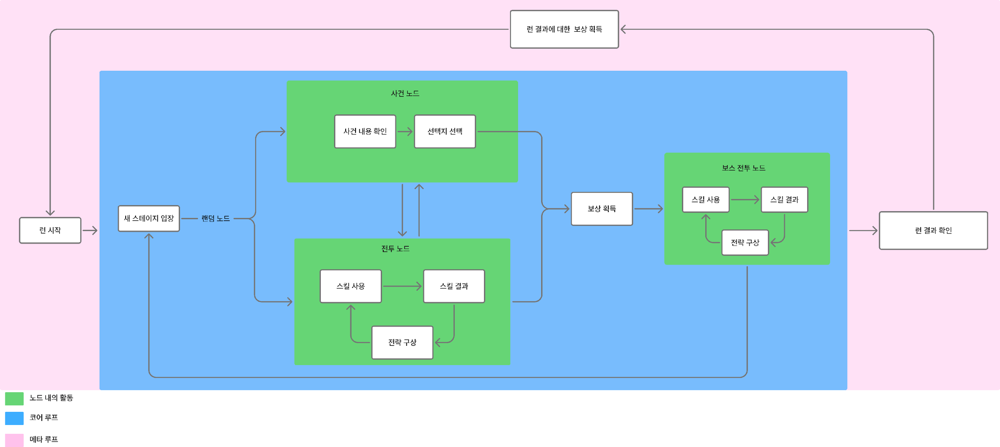
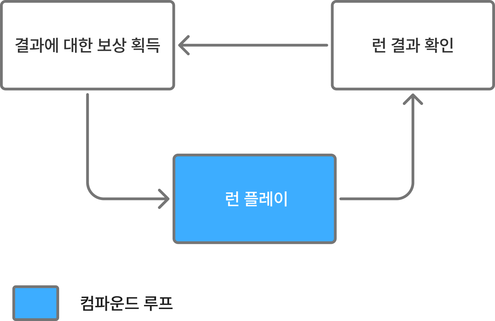
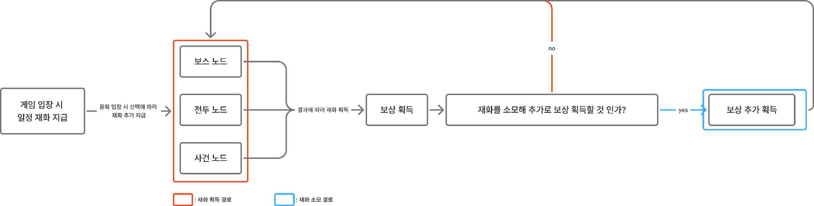
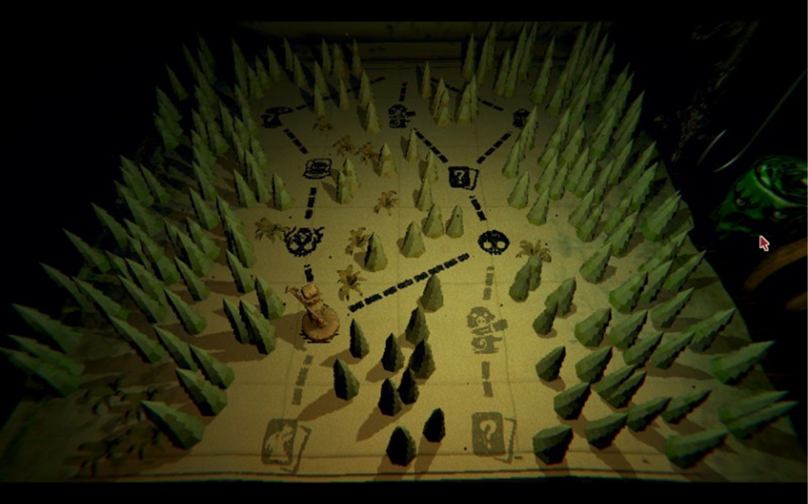
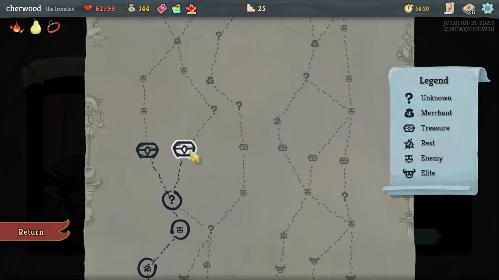
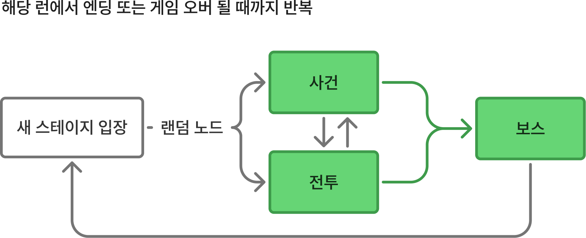
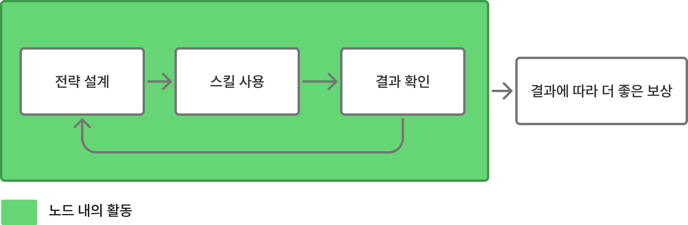
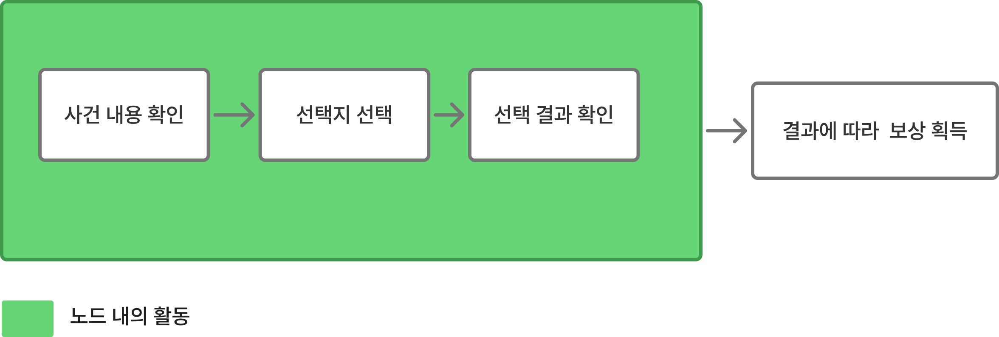

# 플레이루프컨셉_V1_장보성

## 슬라이드 1

플레이 루프 기획서

Light life 202313190 장보성

---

## 슬라이드 2

#### 메타루프

#### 코어 루프

**컨텐츠 순환 루프 컨셉**

**각 핵심 순환 루프의 기획의도**

#### 코어

#### 루프

#### 코어루프

#### 즉각적인 피드백으로 도파민을 주고 인지에 대한 피로도 감소

#### 성장에 따른 피드백을 전투를 통해 보여지게 하여 성장하는 재미

#### 플레이어의 선택을 통한 피드백을 줘 전략에 대한 재미

#### 코어 루프

#### 노드에서 플레이 결과에 따른 보상을 줌

#### 플레이어가 선택을 통해 원하는 노드로 진입시켜 빌드를 짜는 경험

#### 메타루프

#### 게임오버 시 일부 스탯을 유지시켜

#### 자신이 원하는 빌딩을 짤 수 있도록

#### 자신의 선택한 방향으로의 성장에 대한 피드백

---

## 슬라이드 3

#### 메타 루프

#### 코어 루프

**각 루프의 정의**

**각 루프의 활동 내용**

#### 코어

#### 루프

#### 코어루프

#### 전투,사건 상점 등 각 노드 내에서의 활동

#### 코어 루프

#### 게임 시작부터 런 종료까지의 활동

#### 메타 루프

#### 런 종료를 통해 성장하며 새 게임을 반복 플레이하는 루프

---

## 슬라이드 4

**플레이어 목표**

**단계 별 플레이어는 어떤 목표로 플레이를 지속할 지 보여줌**

  - **단기**
    - 해당 노드 클리어를 위함
    - 최대한 오래 살아 남아 좋은 보상을 얻기 위함
  - **중기**
    - 최종 보스를 엔딩을 보기 위함
  - **장기**
    - 플레이어의 성장으로 양학하는 결과의 재미
    - 자신만의 빌드로 게임을 클리어하는 도전의 재미
---

## 슬라이드 5

**전체 컨텐츠 순환 루프**

**게임의 핵심 사이클이 어떻게 굴러가는지 보여주는 시각화된 자료**

> 해당 이미지에는 게임의 핵심 시스템을 표현한 흐름도가 포함되어 있습니다. 이미지의 왼쪽 하단에는 범례가 존재하며, 게임의 핵심 루프를 표현한 것으로 추정됩니다. 

범례를 바탕으로 이미지의 레이아웃을 설명하면, 녹색은 노드 내의 활동, 파란색은 코어 루프, 분홍색은 메타 루프를 의미합니다.

메타 루프(분홍색 테두리)의 가장 왼쪽에는 '런 시작'이라는 텍스트가 포함된 사각형이 존재합니다. 이 사각형의 오른쪽에는 화살표가 존재하며, 화살표는 파란색 테두리 안으로 향하고 있습니다.

파란색 테두리 안에는 '랜덤 노드', '진투 노드', '보스 전투 노드'라고 적힌 녹색 사각형이 존재합니다. 각 녹색 사각형 안에는 두 개의 텍스트가 포함된 사각형이 존재합니다.

가장 위쪽에 위치한 '랜덤 노드'에는 '사건 내용 확인', '선택지 선택'이라는 텍스트가 포함된 사각형이 존재하며, 두 사각형에서 각각 화살표가 빠져나와 위쪽으로 향하고 있습니다. 화살표의 끝에는 '런 결과에 대한 보상 획득'이라는 텍스트가 포함된 사각형이 존재합니다.

가장 왼쪽에 위치한 '진투 노드'에는 '스킬 사용', '전략 구상'이라는 텍스트가 포함된 사각형이 존재합니다. 또한, '스킬 결과'라는 텍스트가 포함된 사각형도 존재하며, '스킬 사용'에서 '스킬 결과'로 화살표가 향하고 있습니다. '전략 구상'에서 '스킬 사용'으로 화살표가 이어져 있습니다. '진투 노드'에서 빠져나온 화살표는 '랜덤 노드'와 '보스 전투 노드'를 향하고 있습니다.

가장 오른쪽에 위치한 '보스 전투 노드'에는 '스킬 사용', '전략 구상'이라는 텍스트가 포함된 사각형이 존재합니다. 또한, '스킬 결과'라는 텍스트가 포함된 사각형도 존재하며, '스킬 사용'에서 '스킬 결과'로 화살표가 향하고 있습니다. '전략 구상'에서 '스킬 사용'으로 화살표가 이어져 있습니다. '보스 전투 노드'에서 빠져나온 화살표는 '런 결과 확인'이라는 텍스트가 포함된 사각형으로 향하고 있습니다.

'런 결과 확인'이라는 텍스트가 포함된 사각형에서 화살표가 빠져나와 '런 시작'으로 향하고 있습니다.

녹색 사각형과 화살표로 표현된 노드들은 게임의 핵심적인 흐름을 보여주고 있습니다. 각 노드들은 서로 유기적으로 연결되어 있으며, 플레이어의 선택에 따라 다양한 결과를 만들어냅니다.

---

## 슬라이드 6

**메타 루프**

**핵심 목표**

  - 플레이어가 런 종료를 겪을 수 록 성장함
  - 얼마나 성장했는지 확인하기 위한 반복 플레이로 재방문율 (UV)증가
**런 종료에도 일부 스탯 유지 가능하게 함**

  - 런 종료가 될 경우 해당 회차에서 일부 스탯 유지함
  - 런 종료의 일부 보상은 선택을 통해 성장함

> 해당 이미지는 게임 기획 문서의 일부로, 게임의 턴 기반 구조를 설명하는 플로우차트입니다. 

구성 요소:

텍스트 상자:
"결과에 대한 보상 획득" (왼쪽 상단)
"런 결과 확인" (오른쪽 상단)
"턴 플레이" (중앙)
화살표:
화살표가 왼쪽 상단, 오른쪽 상단, 중앙의 텍스트 상자를 연결하고 있습니다.
시작점: "턴 플레이"(중앙)
화살표가 중앙에서 왼쪽 상단으로 향하고 있습니다.
화살표가 중앙에서 오른쪽 상단으로 향하고 있습니다.
화살표가 왼쪽 상단에서 중앙으로 향하고 있습니다.
아이콘:
왼쪽 하단에 작은 파란색 사각형이 있습니다. 
레이아웃:
배경은 흰색입니다.
텍스트 상자는 회색 윤곽선으로 둘러싸여 있습니다.
화살표는 흐름을 나타내기 위해 텍스트 상자 사이를 연결합니다.
설명:
이 다이어그램은 게임의 턴 기반 구조를 나타냅니다. 
"턴 플레이"에서 시작하여 "결과에 대한 보상 획득"으로 이동하고, 다시 "턴 플레이"로 돌아와서 다음 턴을 진행합니다. 
사용자는 각 턴이 끝난 후 결과를 확인하고 보상을 획득하는 과정을 반복하게 됩니다. 
이러한 구조는 게임의 진행 흐름을 명확히 보여주며, 게임의 핵심 메커니즘을 설명하는 데 사용됩니다.

---

## 슬라이드 7

**플레이어 성장 루프**

**핵심 목표**

  - 보스, 전투, 사건 노드의 결과로 보상을 줌
  - 전투의 성과에 따라 재화를 보상으로 추가적으로 주어 목표를 세우게 함
  - 현재 자신이 보유하고 있는 재화를 소모해 추가로 보상을 받을 수 있도록 함

> 이 게임 기획 문서의 일부에는 여러 개의 노드와 화살표가 포함된 흐름도가 포함되어 있습니다. 주요 구성 요소와 레이아웃을 분석하면 다음과 같습니다.

*   **텍스트:**
    *   게임 입장 시 일정 재화 지급
    *   유희 입장 시 선택에 따라 재화 추가 지급
    *   보스 노드
    *   전투 노드
    *   사건 노드
    *   전투에 따라 재화 획득
    *   보상 획득
    *   재화를 소모해 추가 보상 획득할 것인가?
    *   보상 추가 획득
    *   no
    *   yes

*   **다이어그램 및 UI 요소:**
    *   흐름도에는 여러 노드가 포함되어 있습니다. 각 노드는 직사각형으로 표시되며, 노드 사이를 연결하는 화살표가 있습니다.
    *   화살표는 흐름의 방향을 나타냅니다.
    *   일부 노드에는 빨간색 또는 파란색으로 강조 표시된 부분이 있습니다.

*   **시각적 레이아웃과 구조:**
    *   흐름도는 왼쪽에서 오른쪽으로 진행됩니다.
    *   각 노드는 그룹으로 구분되어 있습니다.
    *   화살표는 노드 간의 관계를 나타냅니다.

*   **아이콘:**
    *   흐름도 하단에는 두 개의 작은 사각형이 있습니다. 
    *   왼쪽 사각형은 빨간색으로 강조 표시되어 있으며, ": 재화 획득 경로"라는 텍스트가 포함되어 있습니다.
    *   오른쪽 사각형은 파란색으로 강조 표시되어 있으며, ": 재화 소모 경로"라는 텍스트가 포함되어 있습니다.

전체적으로 이 흐름도는 게임에서 재화의 흐름을 나타내는 것으로 보입니다. 플레이어가 게임에 입장하면 일정량의 재화를 지급받고, 선택에 따라 추가 재화를 지급받을 수 있습니다. 이후 플레이어는 보스 노드, 전투 노드, 사건 노드 중 하나를 선택하여 진행하며, 전투에 따라 재화를 획득할 수 있습니다. 획득한 재화를 소모하여 추가 보상을 획득할 수도 있습니다.

---

## 슬라이드 8

**코어 루프**

**핵심 목표**

  - 게임 플레이의 단순화를 막음
  - 자신의 플레이 스타일에 따라 플레이 할 기회 제공함
**FUSM형태의 순환 루프**

  - 플레이어의 선택으로 원하는 노드에 입장함
  - 노드를 클리어하고 얻은 결과로 스테이지 진행함

> 이미지는 게임의 일부 레벨 또는 맵을 나타냅니다. 

### 이미지의 레이아웃과 구조

*   이미지 중앙에는 노란색의 사각형 바닥이 있고, 그 위에는 여러 개의 뾰족한 녹색 장애물이 무작위로 배치되어 있습니다. 
*   바닥에는 여러 개의 아이콘이 무작위로 그려져 있습니다. 
*   이미지 오른쪽 하단에는 녹색으로 빛나는 무언가가 보입니다. 
*   이미지 오른쪽 아래에는 하얀색 테두리와 빨간색으로 된 커서 화살표가 있습니다.

### 이미지의 텍스트

*   이미지에는 읽을 수 있는 텍스트가 없습니다.

### 이미지의 아이콘

*   이미지에는 여러개의 아이콘이 있지만, 자세히 식별할 수 있는 아이콘은 다음과 같습니다.
    *   중앙 상단에 있는 해골 모양의 아이콘
    *   중앙 하단에 있는 물음표가 그려진 아이콘
    *   바닥 곳곳에 그려진 동물 모양의 아이콘

### 이미지의 캐릭터

*   이미지에는 하나의 캐릭터가 있습니다. 
*   캐릭터는 노란색이며, 구체적으로 어떤 캐릭터인지는 식별하기 어렵습니다. 
*   캐릭터는 바닥 중앙에 위치하고 있습니다. 

### 이미지의 UI 요소

*   이미지에는 UI로 추정되는 요소가 보입니다. 
*   이미지 오른쪽 하단에 있는 화살표 모양의 커서입니다. 

전체적으로 이 이미지는 게임의 일부 레벨 또는 맵을 나타내며, 플레이어는 캐릭터를 조작하여 장애물을 피하고, 목표 지점에 도달하거나 미션을 수행해야 합니다.

> 이미지는 게임의 맵 화면을 보여 주고 있습니다. 화면 상단에는 여러 아이콘과 텍스트가 표시되어 있습니다.

*   화면 상단 왼쪽에는 "cherwood the Ironclad"라는 텍스트가 있고, 그 옆에는 하트 모양의 아이콘 2개와 불, 배, 고리 모양의 아이콘이 있습니다. 
*   그 옆에는 숫자가 적힌 아이콘들이 있습니다. 
    *   숫자는 62/93, 144, 25입니다.
*   화면 상단 오른쪽에는 시계 모양의 아이콘과 여러 문서, 톱니바퀴 모양의 아이콘이 있습니다. 
    *   시계 모양의 아이콘에는 54:30이라는 숫자가 표시되어 있고, 문서에는 [V2.0] (01-21-2020) 2U8CWQ1U0DW3H라는 텍스트가 표시되어 있습니다.

화면 중앙에는 회색 배경의 지도와 지도 위에 여러 아이콘과 선이 표시되어 있습니다.

*   지도의 오른쪽에는 범례가 있습니다. 
    *   범례에는 물음표, 상인, 보물, 휴식, 적, 엘리트 아이콘이 있고, 각각 Unknown, Merchant, Treasure, Rest, Enemy, Elite라는 텍스트가 표시되어 있습니다.

화면 왼쪽 하단에는 빨간색 버튼이 있습니다.

*   버튼에는 Return이라는 텍스트가 표시되어 있습니다.

지도의 아이콘은 다음과 같습니다.

*   노란색 커서가 가리키는 흰색 테두리가 있는 검은색 다이아몬드 아이콘 1개
*   검은색 다이아몬드 아이콘 1개
*   검은색 원과 물음표 아이콘 1개
*   검은색 원과 불상한 얼굴 모양의 아이콘 2개
*   검은색 선으로 연결된 여러개의 물음표 아이콘
*   여러개의 검은색 호랑이 얼굴 모양의 아이콘

> 이미지는 게임 기획 문서의 일부로, 게임의 진행 흐름을 나타내는 다이어그램입니다. 이미지의 구성 요소와 레이아웃을 상세하게 설명해 드리겠습니다.

### 텍스트 설명

*   이미지 상단에는 **"해당 런에서 엔딩 또는 게임 오버 될 때까지 반복"**이라는 텍스트가 있습니다. 이 텍스트는 게임이 끝날 때까지 아래에 있는 내용들이 계속 반복된다는 것을 나타냅니다.

### 다이어그램

*   다이어그램은 여러 개의 사각형 블록과 화살표로 구성되어 있습니다. 블록은 **흰색 블록**과 **녹색 블록**으로 나뉘며, 화살표는 **검은색 화살표**와 **녹색 화살표**로 나뉩니다.

### 블록 설명

*   **흰색 블록**
    *   왼쪽에 위치한 흰색 블록에는 **"새 스테이지 입장 - 랜덤 노드"**라는 텍스트가 있습니다. 이 블록은 새로운 스테이지로 진입할 때 사용되는 랜덤 노드를 의미하는 것으로 보입니다.
*   **녹색 블록**
    *   세 가지의 녹색 블록이 있습니다. 각각의 블록에는 **"사건"**, **"전투"**, **"보스"**라는 텍스트가 있습니다. 
    *   이 블록들은 게임 진행 중 발생할 수 있는 이벤트, 전투, 보스와의 대결 등을 나타내는 것으로 보입니다.

### 화살표 설명

*   **검은색 화살표**
    *   화살표는 블록 간의 연결을 나타냅니다. 
    *   흰색 블록에서 **"사건"**, **"전투"** 블록으로 화살표가 나뉘어져 있습니다. 이는 새로운 스테이지 진입 시 랜덤으로 사건 또는 전투가 발생할 수 있음을 의미합니다.
    *   **"사건"**과 **"전투"** 블록에서 위아래로 서로 이어져 있는 화살표는 사건과 전투가 반복될 수 있음을 나타냅니다. 
    *   **"사건"**, **"전투"** 블록에서 **"보스"** 블록으로 가는 화살표는 사건과 전투 이후 보스와의 대결로 이어질 수 있음을 의미합니다. 
    *   **"보스"** 블록에서 **"새 스테이지 입장"** 블록으로 이어지는 화살표는 보스와의 대결 이후 새로운 스테이지로 진입할 수 있음을 나타냅니다.

### 레이아웃 및 구조

*   다이어그램은 게임의 진행 흐름을 보여주는 구조로 설계되었습니다. 
*   새로운 스테이지로 진입하면 랜덤으로 사건 또는 전투가 발생하고, 이 둘은 반복될 수 있습니다. 사건 또는 전투를 거친 후에는 보스와의 대결로 이어지고, 보스와의 대결 이후에는 새로운 스테이지로 진입하는 구조입니다.

전체적으로 이 다이어그램은 게임의 진행 흐름을 나타내는 중요한 요소로, 게임 개발 과정에서 참조할 수 있는 중요한 자료로 활용될 것으로 보입니다.

---

## 슬라이드 9

**코어 루프 난이도**

**성장했다는 걸 느끼게 함**

  - 단기적으로 빠르게 성장함을 느낌으로 빠른 보상
난이도 낮춤

#### 플레이어가 강해짐을  쉽게 느끼도록 난이도 조절

#### 보스 다음 전투 노드의 적은 비교적 약한 적을 배치함

> ## 이미지 설명

해당 이미지는 게임의 난이도 곡선을 표현한 그래프입니다. 그래프는 게임의 난이도와 시간의 흐름에 따른 변화를 보여주고 있습니다.

### 그래프 구조

*   가로축: 시간
*   세로축: 게임 난이도

### 그래프 구간

*   Tutorial: 게임의 튜토리얼 구간으로, 게임 난이도가 완만한 상승세를 보입니다. 
*   Level 1: 튜토리얼 이후 첫 번째 레벨로, 난이도가 상승했다가 새로운 메커니즘이 도입되며 잠시 감소합니다.
*   Level 2: 두 번째 레벨로, 난이도가 다시 상승했다가 새로운 메커니즀이 도입되며 잠시 감소합니다.
*   Level 3: 세 번째 레벨로, 난이도가 상승했다가 새로운 메커니즐이 도입되며 잠시 감소합니다.
*   Level 4: 네 번째 레벨로, 난이도가 상승했다가 새로운 메커니즀이 도입되며 잠시 감소합니다. 
*   Climax: 게임의 클라이맥스로, 난이도가 지속적으로 상승합니다.

### 그래프의 특징

*   검은 실선: 게임 난이도의 전반적인 추세를 나타냅니다. 
*   점선 화살표: 새로운 메커니즘의 도입을 나타냅니다. 

### 요약

해당 그래프는 게임의 난이도가 시간에 따라 어떻게 변화하는지 보여주고 있습니다. 각 레벨에서 새로운 메커니즘이 도입되며 난이도가 일시적으로 감소하다가 다시 상승하는 패턴을 반복합니다. 이는 플레이어가 게임에 익숙해지고 새로운 도전을 받아들이도록 설계된 것으로 보입니다.

---

## 슬라이드 10

**노드 내의 전투**

**플레이어 경험 목표**

  - 성공적으로 상황에 대처 했을 때에 따라 결과를 보는 재미
  - 전투에서 현재 얼마나 강해졌는지 전투 중 피드백으로 성장에 대한 보상
  - 전투의 성과에 따라 보상을 지급해 최대한 성공적으로 클리어하는 목표 부여
**전투 경험에 대한 예시**

> 이 게임 기획 문서의 일부인 이미지는 전략 설계, 스킬 사용, 결과 확인으로 이어지는 게임 내의 순환 구조를 표현하고 있습니다.

*   녹색 배경의 큰 사각형은 '노드 내의 활동'을 의미합니다.
*   왼쪽에서 오른쪽으로 이어지는 화살표가 있는 3개의 흰색 사각형은 전략 설계, 스킬 사용, 결과 확인의 과정을 나타냅니다. 
*   이 3개의 흰색 사각형은 왼쪽에서 오른쪽으로 이어지는 화살표로 연결되어 있습니다. 
*   또한, 결과 확인에서 전략 설계로 이어지는 아래쪽 화살표가 있습니다. 이는 결과에 따라 더 좋은 보상을 얻는 것을 의미합니다. 
*   이 구조는 게임에서 플레이어가 전략을 설계하고, 스킬을 사용하며, 결과를 확인하는 순환적인 프로세스를 나타냅니다. 
*   결과에 따라 더 좋은 보상을 얻는 과정이 추가되어 있습니다.

---

## 슬라이드 11

**노드 내의 사건**

**플레이어 경험 목표**

  - 게임내의 스토리를 언급하여 플레이에 불편 없이 세계관에 몰입
  - 전투 노드에서의 피로도를 줄이기 위함
  - 세계관 내의 사건에서 플레이어의 선택에 따른 결과로 몰입도 부여
**전투 경험에 대한 예시**

> 이 게임 기획 문서의 일부인 이미지는 플로우차트입니다. 이 플로우차트는 게임에서 이벤트나 퀘스트와 관련된 흐름을 보여주는 것으로 추정됩니다. 아래는 이미지의 상세한 설명입니다.

*   **구조:**
    *   이미지는 녹색의 큰 사각형과 흰색 사각형으로 구성되어 있습니다.
    *   녹색 사각형은 노드 내의 활동을 의미합니다.
    *   흰색 사각형은 각 단계의 프로세스를 나타냅니다.
*   **텍스트:**
    *   왼쪽에서 오른쪽으로 순서대로 **사건 내용 확인**, **선택지 선택**, **선택 결과 확인**이라는 프로세스가 나열되어 있습니다.
    *   선택 결과 확인까지의 프로세스는 녹색 박스 안에 있으며, 선택 결과 확인의 결과에 따라 보상을 획득하는 과정은 회색 박스에 표시되어 있습니다.
*   **화살표:**
    *   각 흰색 사각형 사이에는 오른쪽을 가리키는 회색 화살표가 있습니다. 이는 프로세스가 왼쪽에서 오른쪽으로 순차적으로 진행됨을 나타냅니다.
    *   선택 결과 확인 단계 다음에는 결과에 따라 보상을 획득하는 단계로 진행됨을 나타냅니다.
*   **아이콘:**
    *   이미지에는 별도의 아이콘은 포함되어 있지 않습니다.

결론적으로, 이 플로우차트는 게임에서 이벤트나 퀘스트가 진행되는 과정을 보여줍니다. 사용자는 사건 내용을 확인하고, 선택지를 선택한 후, 선택 결과를 확인합니다. 이후 결과에 따라 보상을 획득하게 됩니다.

---
