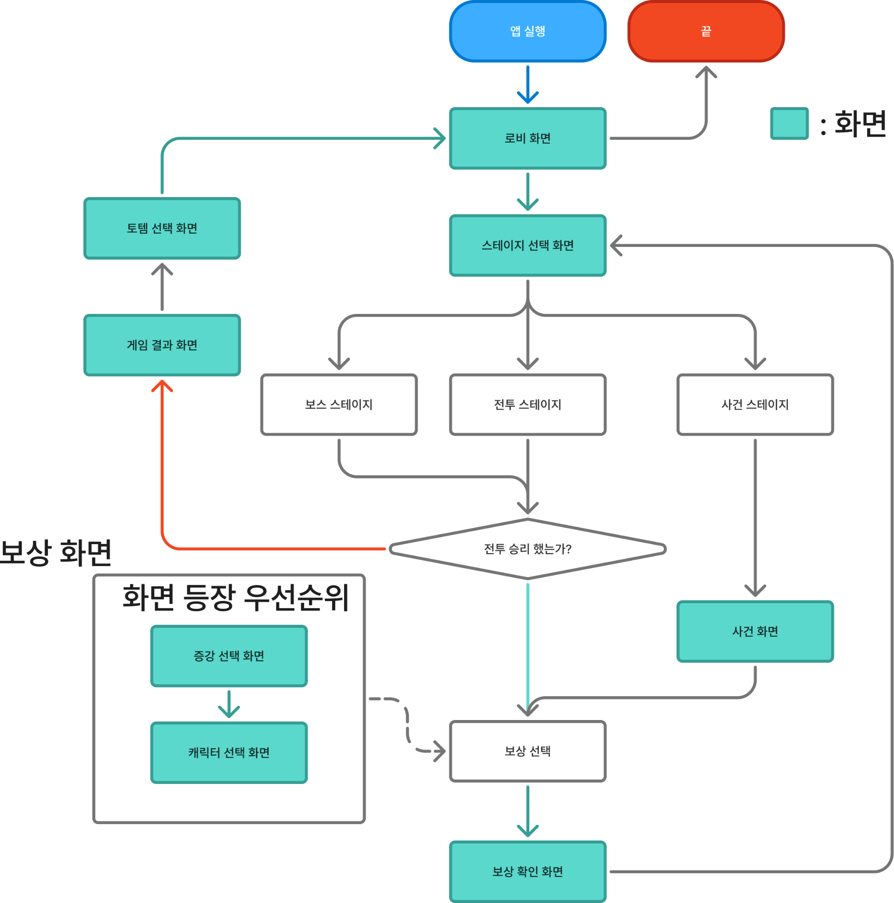
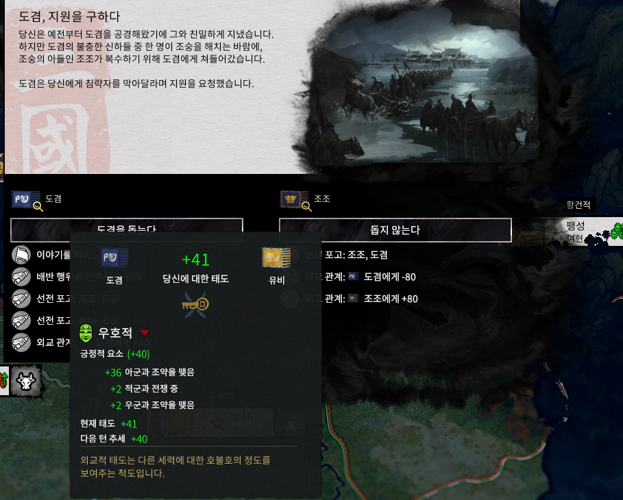
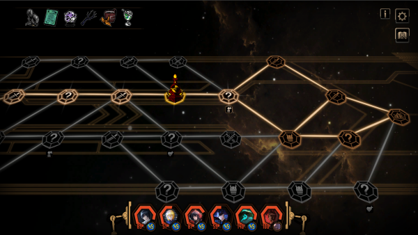
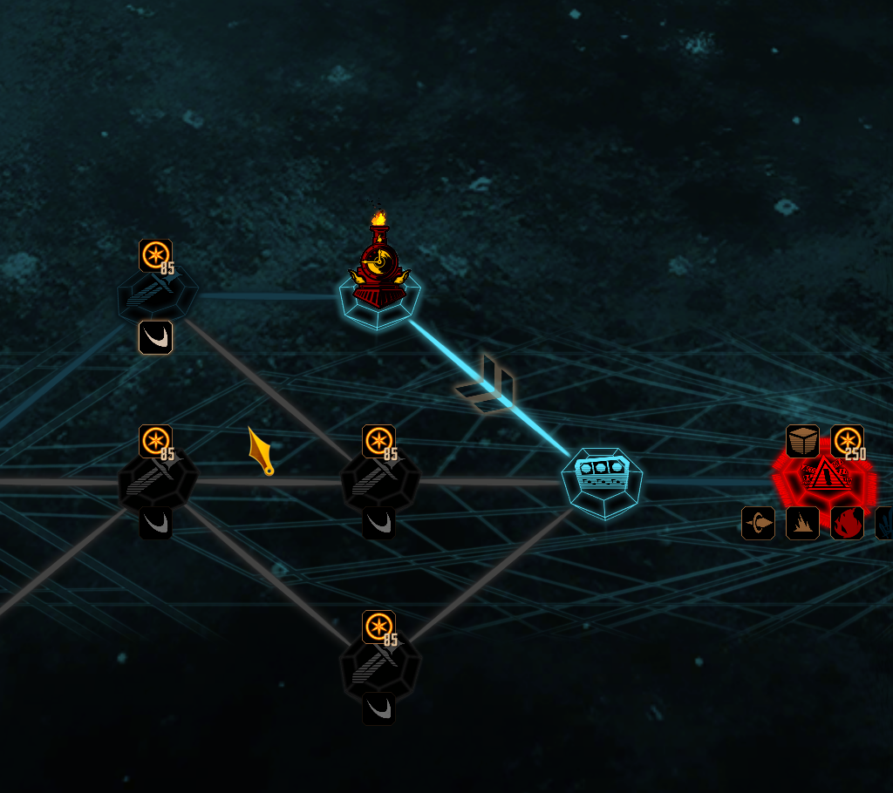
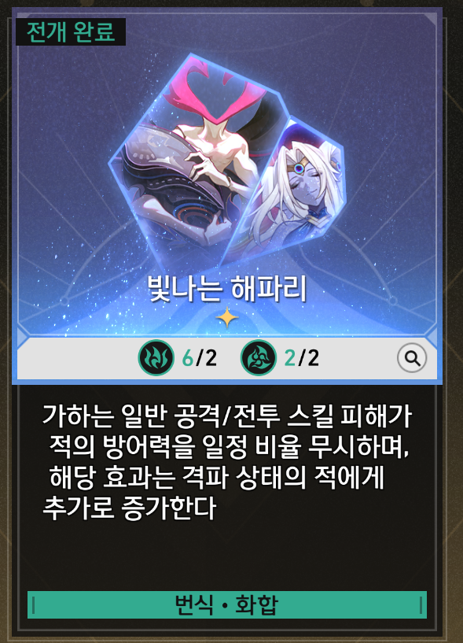
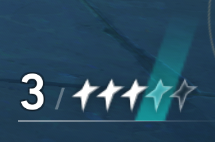
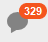

# UI기획서_V6_장보성

## 슬라이드 1

**UI기획서**

Light life 202313190 장보성

---

## 슬라이드 2

**문서 개요**

UI의 필요 기능,기획의도를 중점으로 작성한 문서

  - 게임 구조의 시각화하기전 필요 정보를 지정하기 위한 문서
**UI 기획의도, 목표**

게임 UI 시스템의 구조, 화면 구성, 인터랙션, 상태, 데이터 연결 방식을 정의함

**크기, 색상, 배치 위치,아이콘 모양, 애니메이션 등 기획되지 않은 UI디자인은 그래픽파트가 담당함**

| 역할 | 역할 |
| --- | --- |
| UI 그래픽 | UI 그래픽 제작 |
| 프로그래머(클라이언트 담당) | UI 구현 |
| 기획자 | 기능 정의 |

---

## 슬라이드 3

**UI 디자인 목표**

**정보를 빠르게 인지 할 수 있는 UX 목표**

  - 플레이 중 정보 인지 속도 1초 이내
  - **HUD 최소 시선 이동**
플레이어의 편의성 좋은 UX 목표

  - **한 손 플레이 가능 (마우스 만)**
  - **클릭,드래그 호버링 주로 이용**
| 항목 | 내용 |
| --- | --- |
| 스타일 | (UI그래픽의 지정) |
| 주요 색상 | (UI그래픽의 지정) |
| 강조 색 | (UI그래픽의 지정) |
| UI 프레임 | (UI그래픽의 지정) |

---

## 슬라이드 4

**핵심 플레이루프**

게임의 전체적인 UI화면 플로우

> 이 게임 기획 문서의 이미지는 앱의 화면 전환에 대한 흐름을 보여 주고 있습니다.

### 화면 레이아웃

*   화면은 사각형의 블록으로 구성되어 있으며, 각 블록은 하나의 화면을 나타냅니다.
*   블록은 녹색, 파란색, 주황색으로 구분됩니다.
    *   녹색 블록: 일반적인 게임 화면입니다. 
    *   파란색 블록: 앱의 시작 화면을 나타냅니다.
    *   주황색 블록: 게임의 종료를 나타냅니다.
*   블록을 연결하는 화살표는 화면 전환의 흐름을 보여 줍니다.

### 화면 설명

*   **앱 실행**: 게임의 시작 화면입니다. 
*   **로비 화면**: 게임의 메인 화면입니다. 
*   **스테이지 선택 화면**: 게임의 스테이지 선택 화면입니다.
*   **전투 스테이지**: 전투가 진행되는 화면입니다.
*   **보스 스테이지**: 보스와의 전투가 진행되는 화면입니다.
*   **사건 스테이지**: 이벤트가 발생하는 화면입니다.
*   **사건 화면**: 사건에 대한 설명이 나오는 화면입니다.
*   **전투 승리 했는가?**: 전투의 승리 여부를 확인하는 화면입니다.
*   **보상 선택**: 전투 승리 후 획득한 보상을 선택하는 화면입니다.
*   **보상 확인 화면**: 선택한 보상을 확인하는 화면입니다.
*   **캐릭터 선택 화면**: 플레이에 참여할 캐릭터를 선택하는 화면입니다.
*   **중간 선택 화면**: 게임 진행 중 선택하는 화면입니다.
*   **토벌 선택 화면**: 토벌할 대상을 선택하는 화면입니다.
*   **게임 결과 화면**: 게임의 결과를 보여 주는 화면입니다.

### 화면 전환 흐름

*   앱을 실행하면 로비 화면으로 전환됩니다.
*   로비 화면에서 스테이지 선택 화면으로 전환됩니다.
*   스테이지 선택 화면에서 전투 스테이지, 보스 스테이지, 사건 스테이지로 전환됩니다.
*   전투 스테이지에서 전투를 진행하고, 전투 승리 후 보상 선택 화면으로 전환됩니다.
*   보상 선택 화면에서 보상을 선택하고, 보상 확인 화면으로 전환됩니다.
*   보상 확인 화면에서 캐릭터 선택 화면이나 토벌 선택 화면으로 전환됩니다.
*   캐릭터 선택 화면에서 캐릭터를 선택하고, 중간 선택 화면으로 전환됩니다.
*   중간 선택 화면에서 선택을 하고, 게임 결과 화면으로 전환됩니다.
*   게임 결과 화면에서 토벌 선택 화면으로 전환됩니다.
*   토벌 선택 화면에서 토벌을 선택하고, 로비 화면으로 전환됩니다.

### 아이콘 및 캐릭터

*   이미지에는 아이콘과 캐릭터가 없습니다.

### 기타

*   화면의 등장과 우선순위를 고려하여, 화면 전환의 흐름이 결정됩니다.
*   게임의 흐름은 로비 화면에서 시작하여, 스테이지 선택 화면, 전투 스테이지, 보상 선택 화면, 캐릭터 선택 화면, 중간 선택 화면, 게임 결과 화면, 토벌 선택 화면으로 전환됩니다.
*   게임의 종료는 로비 화면에서 '끝'으로 표시된 주황색 블록으로 전환됩니다.

---

## 슬라이드 5

**기준 해상도 및 비율**

### 16:9비율

### (1920 x 1080px)

**가장 보편적인 크기 화면인 1920 x 1080px 사용**

  - PC 기준으로 가장 보급율이 높음
  - 캐릭터 배치할 공간 및 시킬 및 코스트 관리를 위한 공간 확보 필요함
---

## 슬라이드 6

**규격 지정 방법(예시)**

**크기 단위는 PX를 사용한다.**

마진

  - 마진 밖으로 UI가 배치가 되면 안된다.!!!
#### 설정

#### 버튼

#### 24px

#### 시작 버튼

#### 지정된 와이어프레임

#### 크기를 넘기면 안된다.

#### 60px

#### 18px

#### UI 그래픽은 와이어프레임의

---

## 슬라이드 7

**Grid 규칙**

모든 UI는 8px 단위로 배치한다.(UI 그래픽이 지정해 줘야함)

예)

  - 8px,16px,24px,32px
기획의도

  - 여러 화면에서 여백, 요소 간격, 배열을 통일하여 안정감 있는 레이아웃을 위함.
  - 많은 정보를 체계적으로 정돈하여 가독성을 높이기 위함
---

## 슬라이드 8

**HUD 규칙**

예)

  - HUD = 플레이어가 상호작용 불가능한 UI
기획의도

  - 여러 화면에서 여백, 요소 간격, 배열을 통일하여 안정감 있는 레이아웃을 위함.
  - 많은 정보를 체계적으로 정돈하여 가독성을 높이기 위함
---

## 슬라이드 9

**UI Scene 구조**

레이어 순서

#### UI 그래픽이 한번 확인하고 확정 바람

> 이미지는 다섯 개의 블록으로 구성된 순서도입니다. 각 블록은 수평으로 길게 뻗어 있으며, 블록 안에는 한국어로 된 텍스트가 포함되어 있습니다. 블록과 블록 사이에는 아래쪽을 가리키는 회색 화살표가 있습니다.

블록의 내용은 위에서 아래로 다음과 같습니다.

1. 배경
2. 화면 UI
3. 플레이 UI
4. 팝업
5. 알림

각 블록은 동일한 크기로 그려져 있으며, 블록과 블록은 화살표를 기준으로 수직으로 정렬되어 있습니다. 배경은 흰색이며, 블록의 윤곽선과 화살표는 회색입니다.

---

## 슬라이드 10

텍스트 규격

가독성

  - 텍스트의 문장은 가독성이 좋게 2줄씩만
  - 작성할 텍스트가 2줄을 넘어갈 경우 문장을 작성하고 한 칸씩 띄어서 추가로 작성
    - 예시
기획되지 않은 UI 디자인은 그래픽파트가 담당함  (글꼴, 크기, 외곽선등)

사건설명 어쩌구저쩌구 어쩌구저쩌구 어쩌구저쩌구 어쩌구저쩌구

어쩌구저쩌구 어쩌구저쩌구 어쩌구저쩌구 어쩌구저쩌구 어쩌구저

---

## 슬라이드 11

카메라 무빙

**무빙을 통한 강조 되어야 할 정보**

예) 스킬 시전자나 대상을 카메라로 줌인

자연스러운 화면 전환

  - 애니메이션을 통한 자연스러운 화면 전환으로 플레이어 몰입도에 지장을 줄임
주의

  - 액션성보다 출력에 대한 피드백에 초점
레퍼런스

  - 리버스1999
    - 아이콘의 애니메이션 화면 전환 및 애니메이션 카메라 무빙

> (이미지 설명 실패: Error code: 400 - {'error': {'message': 'animated GIFs are not supported', 'type': 'invalid_request_error'}})

---

## 슬라이드 12

**선택에 따른 배치 규격**

왼쪽 부정문, 오른쪽 긍정문

부정

긍정

---

## 슬라이드 13

버튼 상호작용

버튼의 공통적 상호작용 규격 표시용

상태 규격

  - 마우스와 상호작용하지 않을 경우 Normal상태
  - 마우스가 버튼 위에 있을 경우 Hovered상태
  - 마우스가 버튼에서  벗어날 경우 Normal 상태
  - 마우스가 버튼을 클릭할 때 Pressed 상태
예시 이미지

> 해당 문서는 게임 기획 문서의 일부로, UI(사용자 인터페이스) 섹션에 속하는 "메인 화면 UI"에 대한 설명입니다.

## 레이아웃 및 구조

문서는 다음과 같은 레이아웃과 구조로 구성되어 있습니다.

*   문서 상단 왼쪽에는 큰 검은 글씨로 **UI**라고 적혀 있고, 조금 더 작은 글씨로 **메인 화면 UI**라고 적혀 있습니다. 이 둘은 긴 검은 선으로 구분되어 있습니다.
*   문서의 왼쪽에는 검은 선으로 테두리가 둘러싸인 사각형이 있습니다. 사각형의 왼쪽 상단에는 톱니바퀴 모양의 아이콘이 있고, 사각형 안에는 다음과 같은 세 가지 항목이 빨간색 테두리로 표시되어 있습니다.
    *   **새 게임**
    *   **튜토리얼**
    *   **게임 종료**
*   문서의 오른쪽에는 3개의 3D 버튼이 있습니다. 버튼에는 **NEW GAME**이라는 노란색 텍스트가 표시되어 있습니다. 버튼은 다음과 같은 상태에 따라 다른 모양으로 표시됩니다.
    *   **Normal**: 버튼이 기본 상태일 때
    *   **Hovered**: 마우스를 버튼 위에 올렸을 때
    *   **Pressed**: 버튼을 클릭했을 때
*   버튼 아래에는 각 상태에 대한 간단한 설명이 있습니다.

## 텍스트 설명

문서 하단에는 버튼의 상태에 따른 동작을 설명하는 네 가지 항목이 있습니다.

*   마우스와 상호작용하지 않은 상태일 때는 **Normal** 버튼을 사용한다.
*   마우스가 버튼 위에 **Hovered**가 되면 **Hovered** 버튼을 사용하며, 사운드를 출력한다.
*   마우스 **Hovered**가 벗어나면 **Normal** 버튼으로 돌아간다.
*   마우스를 클릭(**LClick**)할 때 **Pressed** 버튼을 사용하며, 사운드를 출력한다.

## 요약

이 문서는 게임의 메인 화면 UI에 대한 설명을 제공합니다. 문서에는 버튼의 상태에 따른 동작과 레이아웃이 포함되어 있습니다. 버튼은 Normal, Hovered, Pressed의 세 가지 상태로 표시되며, 각 상태에 따라 다른 모양과 동작을 합니다.

---

## 슬라이드 14

텍스트 박스 상호작용

텍스트 박스의 공통적 상호작용 규격 표시용

  - Textbox는 추가적인 정보를 상호작용 시 제공하는 정보의 텍스트
  - 텍스트 박스의 위치는 좌측 상단에 표기
  - 만약 공간경우 상호작용 관계없이 여유공간에 배치한다.
상호작용 규격

  - 텍스트 박스는 조건에 맞게 등장, 소멸합니다
예시 이미지

#### 상호작용 불가한 허드

#### 추가적 정보 제공임!!!

팝업된 텍스트 박스

> 이미지는 게임의 한 장면으로, 화면 상단에는 큰 이미지와 텍스트가 있고, 화면 하단에는 여러 개의 버튼과 아이콘이 있습니다.

상단 이미지의 왼쪽에는 세로로 긴 분홍색 네모칸이 있고 그 안에는 분홍색 테두리의 네모 안에 한자 1자가 적혀 있습니다. 이미지의 오른쪽에는 여러 명의 사람들이 말을 타고 있는 모습이 그려져 있습니다.

화면 하단 중앙에는 두 개의 검색창이 있습니다. 왼쪽 검색창에는 "도경"이라는 단어가, 오른쪽 검색창에는 "조조"라는 단어가 입력되어 있습니다. 각 검색창 오른쪽에는 돋보기 모양의 아이콘이 있습니다.

왼쪽 메뉴에는 여러 항목이 나열되어 있습니다. 항목은 다음과 같습니다.

* 이야기들
* 배반 행위
* 선전 포고
* 선전 포고
* 외교 관계

각 항목 옆에는 작은 아이콘이 있습니다. 항목 아래에는 "우호적"이라는 단어가 있고, 그 아래에는 다음과 같은 세부 항목이 있습니다.

* 긍정적 요소 (+40)
	+ +36 아군과 조악을 맺음
	+ +2 적군과 전쟁 중
	+ +2 우군과 조약을 맺음
* 현재 태도 +41
* 다음 턴 추세 +40

오른쪽에는 "동지 않는다"라는 단어가 있고, 그 아래에는 다음과 같은 세부 항목이 있습니다.

* 포고: 조조, 도경
* 관계: 
	+ 도경에게 -80
	+ 조조에게 +80

화면 하단 오른쪽에는 작은 지도와 여러 아이콘들이 있습니다. 아이콘은 다음과 같습니다.

* 확대/축소 버튼
* 팝업 버튼
* 필터 버튼

아이콘들 옆에는 "황건적", "팽성", "여현"이라는 단어가 있습니다.

> 해당 이미지에는 다음과 같은 요소가 포함되어 있습니다.

*   검은색 커서 아이콘: 이미지 중앙에 위치한 화살표 모양의 커서 아이콘입니다. 배경은 흰색입니다. 화살표의 머리 부분은 뾰족하며, 꼬리 부분은 사각형 모양입니다. 화살표의 윤곽선이 약간 두꺼운 편입니다. 
*   배경: 이미지의 배경은 순백색입니다.

이미지에는 다른 UI 요소나 텍스트, 캐릭터가 포함되어 있지 않습니다.

---

## 슬라이드 15

**UI 네이밍규격**

데이터 Row ID 규칙 [System_[Name]_[Variant]

#### 예시

#### MON_Frog

#### MON_Chicken

#### ITEM_Potion_Small

#### ITEM_Potion_Large

| 네이밍 | 설명 |
| --- | --- |
| BTN | 버튼 |
| IMG | 이미지 |
| TXT | 텍스트 |
| BAR | 게이지 |
| SLOT | 슬롯 |
| TAB | 탭 |
| POP | 팝업 |
| HUD | 허드 구성요소 |

---

## 슬라이드 16

핵심 화면

프로젝트에 우선적으로 필요한 핵심 화면

---

## 슬라이드 17

로비 화면

#### E

| 알파벳 | 이름 | 타입 | 설명 |
| --- | --- | --- | --- |
| A | 스테이지  진행 단계 | BAR | 이번 런에서 현재까지 클리어한 진행된 스테이지의 정보  클릭을통해 게임을 시작할 수 있음을 인지 시켜야 함 |
| B | 보유 캐릭터 | HUD | 현재 보유 중인 캐릭터를  시각화하는 이미지  또한 캐릭터의 파티 편성이 변경 가능해야함 |
| C | 보유 증강 리스트 | HUD | 현재 보유 중인 증강의  (종류, 개수)  알려주는 이미지  스크롤로 많은 양의 증강 아이콘 들도 볼 수 있게 함 |
| D | 윤회하기 | BTN | 기존 런을 일부스텟을 유지하고 초기화하는 버튼  런을 초기화하는 질문하는 팝업 띄움 |
| E | 설정 | BTN | 설정 팝업을 열기 위한 버튼 중요도는 높지 않음 |

#### 스테이지 진행 단계

#### 보유중인 캐릭터

#### 보유중인 증강

#### 리스트

#### A

#### B

#### C

게임 전반적 컨셉을 보여주며 플레이하기 전 휴식 및 각 컨텐츠와 연결되는 중앙허브 화면

#### D

#### 증강

#### 아이콘

#### 보유 갯수

#### 윤회하기

---

## 슬라이드 18

스테이지 선택 화면

#### 현재 진행중 스테이지 3-2

#### E

#### F

#### I

#### J

| 알파벳 | 이름 | 타입 | 기능 |
| --- | --- | --- | --- |
| A | 진행된 스테이지 수 |  | 현재 진행중인 스테이지의  위치를 한눈에 보여주기 위함 |
| B | 보유중인 캐릭터 리스트 |  | 플레이어가 자신의 상태 및 관리를 위한 아이콘   플레이어가 클릭을 하여 상세 정보 팝업을 통해  캐릭터 교체, 보유 증강 확인, 보유 토템확인을 할 수 있게 한다. |
| C | - | - | - |
| D | - | - | - |
| E | 지나간 스테이지 |  | 지나간 스테이지는 딤드 및 선택 불가 |
| F | 진행불가 루트 |  | 갈 수 없다는 루트를 표기 |
| G | 현재 위치 아이콘 |  | 플레이어가 현재 위치한 스테이지 위에 아이콘을 두어  플레이어 위치 표기 |
| H | 현재 이동 가능한 루트 |  | 현재 상태에서 이동 가능한 루트는 색 변화 가 선이 아닌 점으로 이루어 짐 |
| I | 보스 스테이지 |  | 보스는 각 스테이지의 마지막으로서  다른 일반적인  스테이지와 구분이 되어야 한다. |
| J | 설정 |  | 설정 팝업을 열기 위한 버튼 중요도는 높지 않음 |

#### A

#### H

스테이지 구분및 현재 자신의 상태를 파악하고 다음으로 자신이 향할 스테이지를 선택하는데 도움을 줌

#### B

#### G

#### 캐릭터

#### 교체창

> 이미지는 게임 기획 문서의 일부로 추정되는 이미지입니다. 이미지의 구성 요소는 다음과 같습니다.

*   이미지의 형태: 이미지의 형태는 네모에 가까운 사각형입니다. 네모의 네 귀퉁이는 모두 둥글게 처리되어 있습니다. 
*   배경: 이미지의 배경은 흰색입니다. 
*   테두리: 이미지의 테두리는 회색입니다. 
*   이미지: 이미지 중앙에는 검은색 선으로 이루어진 악마의 얼굴이 그려져 있습니다. 악마의 얼굴은 눈 부분이 음영 처리되어 있고, 눈썹이 위로 솟아있어 화난 표정을 하고 있습니다. 악마의 얼굴 옆에는 두 개의 뿔이 그려져 있습니다. 

종합적으로, 이미지는 게임 기획 문서의 일부로 사용될 수 있는 아이콘입니다.

> 이미지는 게임 기획 문서의 일부로 보이는 이미지입니다. 이미지의 구성 요소는 다음과 같습니다.

*   이미지의 형태: 이미지의 형태는 네모입니다. 네모의 네 귀퉁이는 모두 둥근 형태입니다. 
*   배경: 이미지의 배경은 흰색입니다. 
*   테두리: 이미지의 테두리는 회색입니다. 
*   이미지: 이미지 중앙에는 악마의 얼굴을 묘사한 그림이 있습니다. 악마의 얼굴은 검은색으로 그려져 있습니다. 악마의 얼굴은 눈썹이 있고 눈이 있으며 코와 입이 있는 형태입니다. 눈썹은 마치 소의 뿔처럼 위로 솟아 있습니다. 눈은 반달 모양으로 그려져 있습니다. 코는 표현되어 있지 않고, 입은 미소를 띤 형태입니다. 

전체적으로 이 이미지는 게임 기획 문서에서 특정한 용도로 사용되는 아이콘일 것으로 추정됩니다.

> 이미지는 게임 기획 문서의 일부로, 하나의 아이콘을 나타냅니다.

*   이미지의 배경은 흰색이며, 모서리가 약간 둥근 사각형입니다. 
*   사각형의 테두리는 회색이며, 그림자의 효과를 줘 입체적으로 표현했습니다.
*   흰색 배경 중앙에 검은색 물음표가 있습니다. 
*   물음표 왼쪽에는 동그라미가 하나 있습니다.

> 이미지는 게임의 세계관, 스토리, 배경에 대한 정보를 제공하는 게임 기획 문서의 일부로 추정됩니다. 이미지의 레이아웃과 구조를 분석하면 다음과 같습니다.

*   화면 상단에는 게임의 상태를 나타내는 아이콘들이 있습니다. 
*   화면 중앙에는 여러 개의 노드들이 선으로 연결된 네트워크 구조가 있습니다. 각 노드는 원 또는 다각형 모양이며, 일부 노드에는 물음표가 표시되어 있습니다. 노드들은 서로 선으로 연결되어 있으며, 일부 선은 강조된 색상으로 표시되어 있습니다. 중앙에 있는 노드는 강조된 색상으로 표시되어 있습니다.
*   화면 하단에는 캐릭터나 아이템을 나타내는 아이콘들이 있습니다. 각 아이콘은 원형이며, 아이콘 내부에는 캐릭터나 아이템의 모습이 그려져 있습니다. 아이콘들은 빨간색 테두리로 둘러싸여 있습니다.

---

## 슬라이드 19

스테이지 진행 표기 방법

뒷 배경

  - 공간은 전적
노드 이동 가능 불가능 시각화

  - 현재 이동 가능한 스테이지,노드와
불가능한 노드를 시각적으로

**색상에 차이나 딤드등을 통해**

차별점을 두어야 한다.

예시 이미지

#### 어떤 스테이지로 이동 가능한지 및 어떤 이벤트가 발생할지 예상이 되도록

#### 현재 진행중 스테이지 3-2

#### 캐릭터

#### 교체창

> 네모, 세모, 선으로 연결된 도형을 기반으로 하는 네트워크 같은 화면이 있습니다.

화면의 왼쪽 상단부터 시계 방향으로 아래로 내려가며 다음과 같은 아이콘과 텍스트가 표시된 오브젝트가 있습니다.

*   주황색 동그라미 안에 하얀색 별 아이콘과 숫자 85가 적혀 있습니다. 검은색 손 모양 도형이 그려진 오브젝트가 있습니다. 손바닥 안에 X자 모양으로 검이 교차하고 있습니다. 그 옆에 흰색 체크 모양이 그려진 사각형이 있습니다.
*   주황색 동그라미 안에 하얀색 별 아이콘과 숫자 85가 적혀 있습니다. 검은색 손 모양 도형이 그려진 오브젝트가 있습니다. 손바닥 안에 X자 모양으로 검이 교차하고 있습니다. 그 옆에 불꽃 모양의 노란색 화살표가 있습니다.
*   주황색 동그라미 안에 하얀색 별 아이콘과 숫자 85가 적혀 있습니다. 검은색 손 모양 도형이 그려진 오브젝트가 있습니다. 손바닥 안에 X자 모양으로 검이 교차하고 있습니다. 그 옆에 흰색 체크 모양이 그려진 사각형이 있습니다.
*   주황색 동그라미 안에 하얀색 별 아이콘과 숫자 85가 적혀 있습니다. 검은색 손 모양 도형이 그려진 오브젝트가 있습니다. 손바닥 안에 X자 모양으로 검이 교차하고 있습니다.

그리고 화면의 중앙 상단에는 노란색 불꽃이 위에 있는 빨간색 원형 오브젝트가 있습니다. 

이 오브젝트에서 파란색 빛이 나와서 화면 중앙에 있는 파란색 정육면체로 향하고 있습니다.

화면의 오른쪽에는 빨간색 삼각형 안에 여러 아이콘과 숫자가 표시되어 있습니다.

*   왼쪽 위: 사각형 모양의 회색 아이콘
*   왼쪽 가운데: 주황색 동그라미 안에 하얀색 별 아이콘과 숫자 250이 적혀 있습니다.
*   왼쪽 아래: 노란색 경고등이 있는 삼각형 모양의 아이콘
*   오른쪽 위: 불꽃이 있는 주전자 모양의 아이콘
*   오른쪽 가운데: 연기나 불꽃이 있는 듯한 주황색 아이콘
*   오른쪽 아래: 화살표가 있는 노란색 아이콘

전체적으로 게임의 미니맵이나 어떤 게임의 세계관, 혹은 게임의 레벨 구조를 나타낸 것으로 추정됩니다.

> 이 게임의 이름은 'The Boundary: 먼지 와 별의 경계'입니다. 

화면 상단 왼쪽에는 게임의 이름인 'The Boundary: 먼지 와 별의 경계'와 함께 '포기한 시간: 20일'이라는 문구가 있습니다. 게임의 배경 화면은 밤에 숲속에 있는 듯한 느낌을 주고 있습니다. 화면 중앙에는 자동차 한 대가 있고 그 옆에 책이 하나 놓여 있습니다. 그 옆에는 조명이 밝혀진 테이블이 보입니다. 테이블 위에는 컵과 물체가 하나 놓여 있고 그 옆에는 컵과 촛불이 보입니다. 테이블과 자동차 사이에는 커다란 바위가 있습니다. 

화면 상단 오른쪽에는 한 여성이 총을 들고 있습니다. 여성의 오른쪽에는 흰색 박스 안에 '모든 스테이지 공략'이라는 문구가 있습니다. 

화면 중앙에는 여러 개의 오브젝트가 원형으로 연결되어 있습니다. 그 중 '이전 장'과 연결된 오브젝트에는 노란색 테두리가 그려져 있습니다. 오브젝트 안에는 'STAGE 05', 'STAGE 06', 'STAGE 07'이라는 문구와 함께 각각 다른 오브젝트가 그려져 있습니다. 'STAGE 05' 오브젝트 안에는 '뒷중 하나'라는 문구가 있고 그 옆에는 책이 그려져 있습니다. 'STAGE 06' 오브젝트 안에는 '천체와 신화'라는 문구가 있고 그 옆에는 저울이 그려져 있습니다. 'STAGE 07' 오브젝트 안에는 '먼지와 별'이라는 문구가 있고 그 옆에는 컵과 촛불이 그려져 있습니다. 'STAGE 05' 오브젝트와 '이전 장' 오브젝트 사이에는 자동차가 있고, 'STAGE 06' 오브젝트와 'STAGE 07' 오브젝트 사이에는 테이블이 있습니다. 

화면 왼쪽 상단에는 흰색 테두리에 검은색 삼각형이 있고, 화면 왼쪽 하단에는 검은색 원 안에 카메라 모양이 하얀색으로 그려져 있습니다.

> 이미지는 게임 기획 문서의 일부로 추정되는 이미지입니다. 이미지의 구성 요소는 다음과 같습니다.

*   이미지의 형태: 이미지의 형태는 네모에 가까운 사각형입니다. 네모의 네 귀퉁이는 모두 둥글게 처리되어 있습니다. 
*   배경: 이미지의 배경은 흰색입니다. 
*   테두리: 이미지의 테두리는 회색입니다. 
*   이미지: 이미지 중앙에는 검은색 선으로 그려진 악마의 얼굴이 있습니다. 악마의 얼굴은 눈 부분이 음영 처리되어 있고, 눈썹이 있는 듯한 두 개의 뿔이 머리 부분에 그려져 있습니다. 눈은 두 개이며 눈꼬리가 올라가있어 화난 표정으로 보입니다. 

종합하면, 이미지는 게임과 관련된 아이콘으로 보입니다. 악마의 얼굴을 묘사한 것으로, 게임 내에서 특정 캐릭터나 몬스터, 또는 게임 모드를 상징하는 아이콘으로 사용될 수 있습니다.

> 이미지는 게임 기획 문서의 일부로, 검은색 뿔이 달린 가면의 실루엣이 그려진 흰색 사각형 아이콘입니다.

아이콘의 구조는 다음과 같습니다:

*   **배경:** 이미지는 둥근 모서리가 있는 흰색 사각형입니다. 
*   **테두리:** 이미지의 테두리는 옅은 회색입니다. 
*   **아이콘:** 이미지 중앙에는 검은색 뿔이 달린 가면의 실루엣이 그려져 있습니다. 가면의 윤곽은 검은색이며, 눈 부분은 검은색으로 채워져 있습니다. 가면의 왼쪽과 오른쪽에는 뿔이 그려져 있습니다. 

아이콘의 전체적인 디자인은 단순하면서도 강렬한 인상을 주며, 게임의 분위기나 테마와 관련된 상징적인 의미를 나타낼 수 있습니다.

> 이미지는 게임 기획 문서의 일부로, 질문을 나타내는 검은색 물음표 아이콘이 포함된 흰색 사각형을 보여줍니다.

*   **아이콘**: 중앙에 있는 큰 검은색 물음표 아이콘(?)이 있습니다. 
*   **배경**: 물음표 아이콘은 둥근 모서리가 있는 흰색 사각형 안에 있습니다. 
*   **테두리**: 흰색 사각형은 얇은 회색 테두리로 둘러싸여 있습니다. 
*   **배경**: 이미지의 배경은 투명입니다.

---

## 슬라이드 20

전투 화면

| 알파벳 | 이름 | 타입 | 설명 |
| --- | --- | --- | --- |
| A | 아군 SD |  | 아군 캐릭터의 SD캐릭터로서 행동, 상태에 대한 피드백을 부여함 |
| B | 궁극기 게이지 |  | 궁극기에 사용을 위해 조건을 게이지 형태로 보여주는 게이지  궁극기 사용 가능할 시 구분이 되어야 함 |
| C | HP 게이지 |  | HP 프로그래스바로서 현재 남은 HP가 남아있는 정도 표기 (정확히 남은 HP 수치는 표기 x) |
| D | 상태 효과 |  | 캐릭터에 적용된 특수효과  (버프, 디버프) |
| E | 적 행동 유형 |  | 다음 턴의 적이 사용할 스킬의 유형을 파악할 수 있도록 하는 스킬 아이콘 |
| F | 스킬 카드 |  | 플레이어가 현재 보유한 스킬 카드 아이콘   사용 불가능한 카드는 딤드 처리 등으로 구분이 되도록  시너지가 효과를 얻는 카드나 사용 시 이득인 카드는 글로우등 으로 강조 |
| G | 소모될 코스트 |  | 카드를 사용하면 소모되는 카드의 코스트 수 |
| H | 특수 카드 스킬 |  | 플레이어가 처치한 적의 카드  시너지가 자유로운 특수한 카드 일반카드와 구분이 되도록 해야함 |

플레이어가 전투 중 원하는 공격 방식과 적의 행동을 예측하기 쉽도록 표기

#### C

#### G

#### E

#### D

#### H

#### B

#### C

#### A

#### F

> 이미지는 게임의 UI/UX를 표현하고 있는 와이어프레임입니다. 

## 레이아웃

이미지는 크게 세 부분으로 나뉩니다.

1.  **좌측 상단 - 아군 정보**
    *   플레이어(아군) 정보가 표시되는 영역입니다. 
    *   플레이어의 정보를 표시하는 큰 틀과, HP(체력) 바, 디버프(감소) 영역으로 구성되어 있습니다. 
    *   동일한 레이아웃의 아군 정보가 2개 존재합니다.

2.  **우측 상단 - 적 정보**
    *   적 정보가 표시되는 영역입니다.
    *   아군 정보와 동일하며, HP 바가 추가되어 있습니다.
    *   동일한 레이아웃의 적 정보가 2개 존재합니다.

3.  **하단 중앙 - 카드, 특수, 턴 넘기기**
    *   플레이어가 사용할 수 있는 카드와 특수 스킬이 표시되는 영역입니다.
    *   동일한 레이아웃의 카드가 7개 존재합니다.
    *   플레이어가 카드를 넘기는 턴 넘기기 버튼이 있습니다.

## UI 요소

*   설정 버튼
*   코스트 아이콘 버튼

## 구조

*   이미지 상단에는 아군과 적의 정보가 표시되며, 하단에는 플레이어가 사용할 수 있는 카드와 특수 스킬이 표시됩니다.
*   플레이어는 카드를 선택하여 턴을 진행하며, 턴이 끝나면 턴 넘기기 버튼을 통해 다음 턴으로 넘어갑니다.

---

## 슬라이드 21

전투 화면

플레이어의 현재 상태나 정보를 전달하는 목적

#### C

| 알파벳 | 이름 | 타입 | 설명 |
| --- | --- | --- | --- |
| A | 턴 넘기기 버튼 |  | 플레이어의 턴을 종료하고 적군 턴으로 변경하는 버튼 |
| B | 코스트 수 |  | 플레이어가 현재 사용한 수와 최대 보유할 수 있는 수를 보여줌 |
| C | 설정 |  | 설정 팝업을 열기 위한 버튼 중요도는 높지 않음 |
| D | 밸런스 |  | 주인공세력과 더 월드 세력의 균형을 나타내는 시스템  정방향과 역방향스킬  어느쪽의 세력이 더 우세한지 확실히 표기해야 함 |

#### A

B

#### 밸런스

#### D

> 이미지는 게임의 UI/UX를 표현하고 있습니다. 

상단 우측에 설정 버튼이 있습니다. 

화면 상단 중앙에 게임에 등장하는 아군 2명과 적군 2명이 표현되어 있습니다. 각 캐릭터의 HP가 표시되어 있고, 아군 1명의 경우 디버프가 표시되어 있습니다. 

화면 하단 중앙에는 카드 7장과 특수 능력 3개가 부채꼴로 펼쳐져 있습니다. 카드와 특수 능력은 게임에서 넘기는 턴을 의미하는 것으로 추정됩니다.

> 이미지는 게임 기획 문서의 일부로, 정치적 영향력과 권력의 균형을 나타내는 그래픽 요소로 구성되어 있습니다. 이미지를 상세하게 분석해 보겠습니다.

### **이미지 상세 설명**

#### **1. 배경 및 레이아웃**
- 배경은 주로 **검은색**이며, 상단과 하단에는 **장식적인 테두리**가 있습니다. 테두리는 **회색조**의 조각된 돌이나 금속 느낌을 주는 디자인으로, 고딕풍의 문헌이나 중세 판타지 게임에서 자주 볼 수 있는 스타일입니다.

#### **2. 텍스트 요소**
- **제목: "Balance of Power"**
  - 이미지 상단에 흰색 텍스트로 **"Balance of Power"**라는 제목이 있습니다. 이는 권력의 균형을 의미하며, 게임 내에서 정치적 또는 사회적 권력의 변화를 나타내는 지표로 사용될 수 있습니다.

- **하단 텍스트: "Anarchists Influencing Politics"**
  - 이미지 하단에는 **"Anarchists Influencing Politics"**라는 문구가 있습니다. 이는 **무정부주의자(Anarchists)가 정치에 미치는 영향력**을 나타내는 것으로 해석됩니다.

#### **3. 시각적 요소**
- **왼쪽 아이콘: 주먹 동상**
  - 이미지 왼쪽에는 **주먹을 쥐고 있는 조각상**이 있습니다. 이는 **혁명, 저항, 투쟁** 등을 상징하는 아이콘으로 사용될 수 있습니다. 무정부주의나 노동운동에서 자주 등장하는 이미지입니다.

- **오른쪽 아이콘: 낫과 월계수**
  - 이미지 오른쪽에는 **낫과 월계수**가 조합된 로고가 있습니다. 낫은 전통적으로 **혁명**이나 **사회주의/공산주의**를 상징하는 도구이며, 월계수는 **승리**를 상징합니다. 이 아이콘은 공산주의나 사회주의의 상징으로 사용될 수 있습니다.

#### **4. 중간 그래프**
- **슬라이더 그래프**
  - 이미지 중앙에는 여러 개의 **회색 점**이 가로로 나열되어 있으며, 각 점은 **수직선**으로 연결되어 있습니다. 이는 **권력의 스펙트럼**을 나타내는 것으로 보입니다.

- **녹색 원과 청색 블록**
  - 왼쪽에서 두 번째 점 위에 **녹색 원**이 표시되어 있습니다. 이 원은 현재 위치를 나타내는 요소로 보입니다.
  - 녹색 원 아래에는 **청색 블록**이 여러 개 쌓여 있습니다. 이는 **무정부주의자(Anarchists)의 영향력**을 나타내는 시각적 요소로 해석됩니다.

- **슬라이더의 의미**
  - 이 그래프는 **무정부주의자(Anarchists)와 다른 세력(공산주의/사회주의)** 간의 **정치적 영향력의 균형**을 나타낼 수 있습니다. 
  - 청색 블록이 왼쪽에 집중되어 있고 녹색 원이 그 위에 위치해 있는 것으로 보아, 현재 게임 상황에서는 **무정부주의자의 영향력이 우세**한 것으로 해석할 수 있습니다.

### **종합 해석**
이 그래픽은 게임 내에서 **정치적 영향력이 어떻게 분배되고 있는지**를 보여주는 요소로 사용될 가능성이 높습니다. 플레이어는 이 **권력 균형**을 통해 게임의 진행 상황을 파악하고, 전략을 세울 수 있습니다. 예를 들어, 무정부주의자의 영향력이 커질수록 특정 이벤트가 발생하거나, 게임 내 다른 세력과의 관계가 변화할 수 있습니다.

---

## 슬라이드 22

사건 선택지 화면

사건설명 어쩌구저쩌구 어쩌구저쩌구 어쩌구저쩌구 어쩌구저쩌구 어쩌구저쩌구 어쩌구저쩌구

#### 사건 이미지

| 알파벳 | 이름 |  | 설명 |
| --- | --- | --- | --- |
| A | 사건 제목 |  | 사건의 제목으로 간략한 사건 종류의 구분을 위함 |
| B | 사건 이미지 |  | 사건의 상황을 시각화해서  한눈에 파악할 수 있도록 함 |
| C | 사건 상세 내용 |  | 사건 내에 있는 사건의 내용 (상황)에 대한 내용 서술용 |
| D | 행동 선택 | Button | 플레이어가 해당 사건에서 행할 행동의 선택지 |
| E | 효과 대상 아이콘 | Image | 대상 사건 종류나  캐릭터의  아이콘으로 효과 적용 대상 표기 |
| F | 효과 설명 | Text | 적용되는 효과의 설명을 표기하기 위함 |
| G | 스크롤 바 | Scrollbar | 정보량이 많을 때 스크롤 바로 화면을 내릴 수 있게 하여 많은 양을 정보를 볼 수 있게 |

행동1 어쩌구저쩌구 어쩌구저쩌구 어쩌구저쩌구 어쩌구저쩌구

선택 시 얻는 / 보상

선택 시 얻는 / 보상

선택 시 얻는 / 보상

선택 시 얻는 / 보상

선택 시 얻는 / 보상

행동2 어쩌구저쩌구 어쩌구저쩌구 어쩌구저쩌구 어쩌구저쩌구

선택 시 얻는 / 보상

선택 시 얻는 / 보상

선택 시 얻는 / 보상

선택 시 얻는 / 보상

사건 내용

선택 시 얻는 / 보상

#### A

#### B

#### C

#### D

#### E

#### G

#### F

사건에 따른 선택으로 어떤 보상이나 이벤트를 볼지 고르기 쉽게 돕는 명확한 보상을 위한 화면

#### 보상 종류 아이콘

> 이미지는 게임의 한 화면으로 추정되며, 다양한 UI 요소와 텍스트가 포함되어 있습니다. 이미지를 분석하면 다음과 같습니다.

*   **상단 메뉴**: 이미지 상단에는 메뉴가 있습니다. 메뉴의 왼쪽에는 분홍색 네모 칸에 정사각형 안에 사각형이 겹쳐진 도안이 있고, 그 옆에 검은 바탕에 하얀색으로 된 한자가 있습니다. 메뉴 오른쪽에는 게임 화면의 일부가 보입니다. 

*   **텍스트 블록**: 이미지 상단 왼쪽에는 텍스트 블록이 있습니다. 텍스트 블록에는 여러 줄의 한자가 적혀 있습니다.

*   **게임 화면**: 이미지의 대부분을 차지하는 부분은 게임 화면입니다. 게임 화면에는 지도가 표시되어 있으며, 지도 위에는 여러 아이콘과 텍스트가 겹쳐져 있습니다.

*   **아이콘과 텍스트**: 게임 화면에는 여러 아이콘과 텍스트가 있습니다. 아이콘은 다양한 모양과 색상으로 구성되어 있으며, 텍스트는 한자와 숫자로 구성되어 있습니다.

*   **좌측 하단 패널**: 이미지의 왼쪽 하단에는 패널이 있습니다. 패널에는 여러 항목이 나열되어 있으며, 각 항목에는 아이콘과 텍스트가 있습니다. 패널의 상단에는 탭이 있습니다. 패널에는 녹색, 파란색, 하얀색 아이콘과 함께 한자가 적혀 있습니다.

*   **우측 하단 패널**: 이미지의 오른쪽 하단에도 패널이 있습니다. 패널에는 여러 항목이 나열되어 있으며, 각 항목에는 아이콘과 텍스트가 있습니다.

*   **지도**: 이미지의 배경에는 지도가 있습니다. 지도는 다양한 색상으로 구성되어 있으며, 여러 아이콘과 텍스트가 겹쳐져 있습니다.

*   **아이템 창**: 아이템 창에는 여러 아이템이 나열되어 있습니다. 각 아이템에는 아이콘과 텍스트가 있습니다.

*   **아이템 정보**: 아이템 정보에는 아이템의 이름, 설명, 능력치 등이 있습니다.

*   **스킬**: 스킬에는 스킬의 이름, 설명, 효과 등이 있습니다.

*   **버튼**: 이미지에는 여러 버튼이 있습니다. 버튼에는 텍스트가 적혀 있으며, 클릭하면 특정 동작을 수행할 수 있습니다.

*   **탭**: 이미지에는 여러 탭이 있습니다. 탭에는 텍스트가 적혀 있으며, 클릭하면 다른 화면으로 전환할 수 있습니다.

*   **목록**: 이미지에는 여러 목록이 있습니다. 목록에는 아이템, 스킬, 퀘스트 등이 포함될 수 있습니다.

*   **그래프**: 이미지에는 그래프가 있습니다. 그래프는 캐릭터의 능력치나 아이템의 성능 등을 표시할 수 있습니다.

*   **이미지**: 이미지에는 여러 이미지가 있습니다. 이미지는 캐릭터, 몬스터, 아이템 등을 나타낼 수 있습니다.

*   **경로**: 이미지에는 여러 경로가 있습니다. 경로는 노란색으로 표시되어 있습니다.

*   **아이콘**: 이미지에는 여러 아이콘이 있습니다. 아이콘은 다양한 모양과 색상으로 구성되어 있으며, 게임의 다양한 요소를 나타냅니다.

*   **배경**: 이미지의 배경은 어둡습니다. 배경에는 게임의 세계를 나타내는 지도가 있습니다.

*   **디테일**: 이미지에는 다양한 디테일이 있습니다. 디테일은 게임의 세계를 더 현실적으로 만들기 위해 사용됩니다.

---

## 슬라이드 23

윤회 종료 화면

#### 윤회 결과

#### 스테이지 진행 단계

#### 보유중인 캐릭터

윤회 종료

#### 보유중인 증강

#### 리스트

#### C

#### D

#### E

#### F

#### 실패

#### A

#### B

| 알파벳 | 이름 | 타입 | 설명 |
| --- | --- | --- | --- |
| A | 윤회 결과 |  | 현재 화면이 어떤 화면인지 구분 시켜주는 장치 |
| B | 결과 표기 |  | 실패 또는 클리어 시의 결과를 표기해 간략화하며 확실한 정보 표기 |
| C | 윤회 진행도 |  | 현재까지 클리어하며 진행된 스테이지를 보여주어 패배의 절망감 약화 |
| D | 보유 캐릭터 리스트 |  | 현재 보유 중인 캐릭터를 알려주는 이미지 리스트 |
| E | 보유 증강 리스트 |  | 현재 보유 중인 증강의  (종류, 개수)  알려주는 이미지  스크롤로 많은 양의 증강 아이콘 들도 볼 수 있게 함 |
| F | 윤회종료 |  | 이번 회차 윤회 내용을 확인 하고 보상화면으로 이동하기 위한 버튼 |

패배를 보다 경험 축적에 도움을 주며 달성한 성과 또한 보여주어 패배에 대한 완충 장치

#### 추후에 자신을 처치한 적을 표기하거나 할 수 있기에 확장성 있게 공간을 일부 비워둬도 좋을 듯함

#### 자신을 처치한 적

---

## 슬라이드 24

토템 선택 화면

#### 선택 완료

토템으로 만들 캐릭터 선택

999999/999999

#### 취소

| 알파벳 | 이름 |  | 설명 |
| --- | --- | --- | --- |
| A | 선택 가능 수량 |  | 얼마나 많이 선택이 가능한 지 여부를 수치화 |
| B | 캐릭터 이미지 |  | 토템으로 사용할 캐릭터 선택 |
| C | 토템 효과 종류 |  | 토템 효과에 대한 대분류로 버프 유형 판단 |
| D | 토템 효과 상세 내용 |  | 토템 효과에 대한 구체적인 내용 서술용 |
| E | 최소 |  | 선택된 내용 취소하는 버튼 |
| F | 선택 완료 |  | 선택된 내용을 확정하는 버튼 |

공격력 증가

디버프 관련 스킬 강화

스킬 코스트 감소

캐릭터 이미지

캐릭터 이미지

캐릭터 이미지

효과 상세 내용

효과 상세 내용

효과 상세 내용

#### A

#### B

#### C

#### D

함께 했던 캐릭터를 상기시키며 플레이어의 선택을 버프 내용을 표기하기 위한 화면

#### F

#### E

#### 토템으로 만들 캐릭터 선택 후

#### 2. 결정

---

## 슬라이드 25

보상 선택 종류

---

## 슬라이드 26

증강 선택 화면

증강 이미지

#### 증강

#### 증강

#### 선택 완료

선택 가능한 증강

999999/999999

#### 취소

#### B

#### D

#### A

#### F

#### E

| 알파벳 | 이름 | 타입 | 설명 |
| --- | --- | --- | --- |
| A | 선택 가능 수량 |  | 얼마나 많이 선택이 가능한 지 여부를 수치화 |
| B | 증강 이미지 |  | 증강 효과에 따라  다른 이미지를 사용하여 플레이어가 버프 종류에 따라 구분이 되게 함 |
| C | 증강 효과 종류 |  | 증강 효과에 대한 대분류로 버프 유형 판단 |
| D | 증강 효과 상세 내용 |  | 증강 효과에 대한 구체적인 내용 서술용 |
| E | 최소 |  | 선택된 내용 취소하는 버튼 |
| F | 선택 완료 |  | 선택된 내용을 확정하는 버튼 |
| G | 보유중인 증강 |  | 보유중인 증강을 보여주는 칸이라는걸 인지할 수 있도록 |
| H | 증강 아이콘 |  | 증강 효과에 따라  아이콘으로  사용하여 플레이어가 버프 종류와 소지중인 버프를 간략화해서 구분이 되게 함 |
| I | 동일 증강의 보유 수 |  | 만약 동일한 증강을 가지고 있을 경우 숫자로 몇 개 가지고 있는지 표기 |

사건설명 어쩌구저쩌구 어쩌구저쩌구 어쩌구저쩌구 어쩌

구저쩌구 어쩌구저쩌구 어쩌구저쩌구 어쩌구저

공격력 증가

#### C

플레이어가 자신이 원하는 증강 종류와 어떤 증강이 플레이에 도움이 되는지 판단하기 편한 화면

#### 상시 표기가 되지 않아도 되므로 버튼을 누르거나 하여 볼 수 있게 함(탭TAB)

> 이 게임 기획 문서의 일부인 이미지는 다음과 같은 내용을 포함하고 있습니다.

### 이미지 설명

*   **상단 좌측:** 작은 검은 사각형에 "전개 완료"라는 녹색 텍스트가 있습니다.
*   **중앙:** 두 캐릭터가 그려진 카드가 있습니다. 
    *   카드의 배경은 짙은 보라색이며, 별들이 흩어져 있습니다. 
    *   카드 안에는 두 캐릭터가 그려져 있습니다. 
    *   왼쪽 캐릭터는 상반신이 노출된 근육질의 남성이며, 등에 날개가 있고 허리춤에 손을 얹고 있습니다. 
    *   남성의 얼굴은 보이지 않으며, 분홍색 하트가 뒤로 날아가고 있는 듯한 자세를 취하고 있습니다. 
    *   오른쪽 캐릭터는 긴 하얀 머리의 여성으로, 눈을 감고 있습니다. 
    *   여성은 보라색 망토를 입고 있으며, 이마에는 보라색 눈이 그려진 마스크를 착용하고 있습니다. 
    *   카드는 각지게 생긴 투명한 유리 조각처럼 생겼으며, 약간의 빛나는 효과가 있습니다.
*   **카드 아래:** 하얀색 긴 직사각형이 있으며, 왼쪽에 불꽃 모양의 아이콘과 "6/2"이라는 숫자가 있고, 그 옆에 녹색 원에 불꽃이 그려진 아이콘과 "2/2"이라는 숫자가 있습니다. 
    *   직사각형 오른쪽에는 돋보기 모양의 검색 아이콘이 있습니다. 
    *   직사각형 아래에는 하얀색 텍스트로 "빛나는 해파리"라는 단어가 있습니다.
*   **하단:** 검은색 배경에 하얀색 텍스트가 있습니다. 
    *   텍스트 내용은 "가하는 일반 공격/전투 스킬 피해가 적의 방어력을 일정 비율 무시하며, 해당 효과는 격파 상태의 적에게 추가로 증가한다"입니다. 
    *   검은색 직사각형 밑에는 녹색 직사각형이 있으며, 여기에 검은색 텍스트로 "변식·화학"이라는 단어가 있습니다.

### 레이아웃 및 구조

*   이미지는 상단과 하단으로 나뉩니다. 
*   상단에는 캐릭터가 그려진 카드를 중심으로 별들이 흩어져 있는 보라색 배경이 있습니다. 
*   하단에는 카드의 효과에 대한 설명이 포함된 검은색 배경의 직사각형이 있습니다. 
*   레이아웃은 단순하고 깔끔하며, 시각적 효과가 포함되어 있습니다.

> 이 게임 기획 문서의 일부인 이미지는 다음과 같은 내용을 포함하고 있습니다.

### 이미지 설명

*   **상단 왼쪽**: "전개 완료"라는 문구가 있는 검은색 사각형이 있습니다.
*   **중앙**: 두 캐릭터가 그려진 카드가 있습니다. 
    *   카드는 마름모꼴이며, 왼쪽에는 가슴이 노출된 상의의 캐릭터가 있고 오른쪽에는 하얀 머리카락의 캐릭터가 있습니다. 
    *   카드는 반투명한 유리처럼 생겼고, 배경은 보라색입니다.
*   **카드 아래**: 하얀색 긴 띠에 "빛나는 해파리"라는 문구와 함께 두 개의 아이콘이 있습니다. 
    *   왼쪽 아이콘은 불꽃 모양이며, 오른쪽 아이콘은 번개 모양입니다. 
    *   각 아이콘 옆에는 숫자가 있습니다: "6/2"와 "2/2"입니다. 
    *   오른쪽에는 돋보기 아이콘이 있습니다.
*   **하단**: 검은색 배경에 하얀색 글씨로 설명이 있습니다. 
    *   내용은 "가하는 일반 공격/전투 스킬 피해가 적의 방어력을 일정 비율 무시하며, 해당 효과는 격파 상태의 적에게 추가로 증가한다"입니다.
*   **하단 녹색 버튼**: "변식·화학"이라는 문구가 있습니다.

### 레이아웃 및 구조

*   이미지는 상단, 중앙, 하단으로 나뉩니다.
*   상단에는 "전개 완료"와 카드가 있습니다.
*   중앙에는 카드와 그 아래 설명이 있습니다.
*   하단에는 검은색 배경에 하얀색 글씨로 된 설명과 녹색 버튼이 있습니다.

### UI 요소

*   카드
*   아이콘 (불꽃, 번개, 돋보기)
*   버튼 (녹색)

> 이미지는 게임의 캐릭터 카드로 추정되며, 다음과 같은 요소들로 구성되어 있습니다.

*   **상단 좌측:** 작은 검은색 사각형에 "전개 완료"라는 문구가 녹색으로 표시되어 있습니다.
*   **중앙:** 두 캐릭터의 모습이 그려진 카드를 보여주고 있습니다. 
    *   카드 속 캐릭터는 날개가 달린 갑옷을 입고 있으며, 왼쪽 캐릭터는 날개를 펼친 모습이고, 오른쪽 캐릭터는 옆모습으로 눈을 감고 있는 모습입니다. 
    *   두 캐릭터 모두 머리카락이 길고, 눈이 빛나는 모습입니다. 
    *   카드의 배경은 보라색이며, 별빛이 반짝이는 듯한 디자인이 있습니다.
*   **카드 하단:** 하얀색 막대에 "6/2"와 불꽃 아이콘, 그리고 "2/2"와 번개 모양의 아이콘이 있습니다. 
    *   불꽃과 번개 모양의 아이콘은 각각 다른 능력을 나타내는 것으로 추정됩니다. 
    *   그 오른쪽에는 돋보기 모양의 아이콘이 있습니다.
*   **카드 아래:** 검은색 배경에 하얀색 글씨로 다음과 같은 설명이 있습니다. 
    *   "가하는 일반 공격/전투 스킬 피해가 적의 방어력을 일정 비율 무시하며, 해당 효과는 격파 상태의 적에게 추가로 증가한다"
*   **하단:** 녹색 버튼에 검은색 테두리가 있고, 버튼에는 "변식·화학"이라는 문구가 있습니다.

전체적으로 이 카드는 게임에서 사용되는 캐릭터 카드로, 캐릭터의 능력치와 스킬 정보를 나타내고 있습니다.

> 해당 이미지 속 게임 화면은 모바일 게임 '펜타스톰'의 모습입니다. 

펜타스톰은 AOS 장르의 모바일 게임으로, 5:5 대전 형식으로 진행됩니다. 

펜타스톰의 게임 화면은 상단 중앙에 게임 진행 상황과 플레이어의 킬/데스/어시스트 점수가 표시되고, 하단에는 아군과 적군의 캐릭터가 표시됩니다. 

화면의 왼쪽에는 플레이어의 캐릭터 정보가 표시되고, 오른쪽에는 아군과 적군의 킬/데스/어시스트 점수가 표시됩니다.

화면 하단 중앙에는 게임 진행 상황과 플레이어의 점수가 표시됩니다.

화면 왼쪽 하단에는 플레이어의 캐릭터가 표시되고, 오른쪽 하단에는 게임 진행 상황을 표시하는 버튼이 있습니다.

화면 상단 왼쪽에는 게임 진행 상황과 플레이어의 킬/데스/어시스트 점수가 표시되고, 오른쪽에는 게임 진행 상황을 표시하는 버튼이 있습니다.

화면 중앙에는 게임 진행 상황이 표시됩니다.

화면 왼쪽 상단에는 플레이어의 캐릭터 정보가 표시되고, 오른쪽 상단에는 아군과 적군의 킬/데스/어시스트 점수가 표시됩니다.

화면 하단 왼쪽에는 플레이어의 캐릭터가 표시되고, 오른쪽에는 게임 진행 상황을 표시하는 버튼이 있습니다.

화면 중앙에는 게임 진행 상황이 표시됩니다.

화면 상단에는 게임 진행 상황과 플레이어의 킬/데스/어시스트 점수가 표시됩니다.

화면 왼쪽에는 플레이어의 캐릭터 정보가 표시되고, 오른쪽에는 아군과 적군의 킬/데스/어시스트 점수가 표시됩니다.

화면 하단에는 게임 진행 상황을 표시하는 버튼이 있습니다.

화면 중앙에는 게임 진행 상황이 표시됩니다.

화면 상단 왼쪽에는 게임 진행 상황과 플레이어의 킬/데스/어시스트 점수가 표시되고, 오른쪽에는 게임 진행 상황을 표시하는 버튼이 있습니다.

화면 왼쪽 하단에는 플레이어의 캐릭터가 표시되고, 오른쪽 하단에는 게임 진행 상황을 표시하는 버튼이 있습니다.

화면 중앙에는 게임 진행 상황이 표시됩니다.

화면 상단에는 게임 진행 상황과 플레이어의 킬/데스/어시스트 점수가 표시됩니다.

화면 왼쪽에는 플레이어의 캐릭터 정보가 표시되고, 오른쪽에는 아군과 적군의 킬/데스/어시스트 점수가 표시됩니다.

화면 하단에는 게임 진행 상황을 표시하는 버튼이 있습니다.

화면 중앙에는 게임 진행 상황이 표시됩니다.

화면 상단 왼쪽에는 게임 진행 상황과 플레이어의 킬/데스/어시스트 점수가 표시되고, 오른쪽에는 게임 진행 상황을 표시하는 버튼이 있습니다.

화면 왼쪽 하단에는 플레이어의 캐릭터가 표시되고, 오른쪽 하단에는 게임 진행 상황을 표시하는 버튼이 있습니다.

화면 중앙에는 게임 진행 상황이 표시됩니다.

화면 상단에는 게임 진행 상황과 플레이어의 킬/데스/어시스트 점수가 표시됩니다.

화면 왼쪽에는 플레이어의 캐릭터 정보가 표시되고, 오른쪽에는 아군과 적군의 킬/데스/어시스트 점수가 표시됩니다.

화면 하단에는 게임 진행 상황을 표시하는 버튼이 있습니다.

화면 중앙에는 게임 진행 상황이 표시됩니다.

화면 상단 왼쪽에는 게임 진행 상황과 플레이어의 킬/데스/어시스트 점수가 표시되고, 오른쪽에는 게임 진행 상황을 표시하는 버튼이 있습니다.

화면 왼쪽 하단에는 플레이어의 캐릭터가 표시되고, 오른쪽 하단에는 게임 진행 상황을 표시하는 버튼이 있습니다.

화면 중앙에는 게임 진행 상황이 표시됩니다.

화면 상단에는 게임 진행 상황과 플레이어의 킬/데스/어시스트 점수가 표시됩니다.

화면 왼쪽에는 플레이어의 캐릭터 정보가 표시되고, 오른쪽에는 아군과 적군의 킬/데스/어시스트 점수가 표시됩니다.

화면 하단에는 게임 진행 상황을 표시하는 버튼이 있습니다.

화면 중앙에는 게임 진행 상황이 표시됩니다.

화면 상단 왼쪽에는 게임 진행 상황과 플레이어의 킬/데스/어시스트 점수가 표시되고, 오른쪽에는 게임 진행 상황을 표시하는 버튼이 있습니다.

화면 왼쪽 하단에는 플레이어의 캐릭터가 표시되고, 오른쪽 하단에는 게임 진행 상황을 표시하는 버튼이 있습니다.

화면 중앙에는 게임 진행 상황이 표시됩니다.

화면 상단에는 게임 진행 상황과 플레이어의 킬/데스/어시스트 점수가 표시됩니다.

화면 왼쪽에는 플레이어의 캐릭터 정보가 표시되고, 오른쪽에는 아군과 적군의 킬/데스/어시스트 점수가 표시됩니다.

화면 하단에는 게임 진행 상황을 표시하는 버튼이 있습니다.

화면 중앙에는 게임 진행 상황이 표시됩니다.

화면 상단 왼쪽에는 게임 진행 상황과 플레이어의 킬/데스/어시스트 점수가 표시되고, 오른쪽에는 게임 진행 상황을 표시하는 버튼이 있습니다.

화면 왼쪽 하단에는 플레이어의 캐릭터가 표시되고, 오른쪽 하단에는 게임 진행 상황을 표시하는 버튼이 있습니다.

화면 중앙에는 게임 진행 상황이 표시됩니다.

화면 상단에는 게임 진행 상황과 플레이어의 킬/데스/어시스트 점수가 표시됩니다.

화면 왼쪽에는 플레이어의 캐릭터 정보가 표시되고, 오른쪽에는 아군과 적군의 킬/데스/어시스트 점수가 표시됩니다.

화면 하단에는 게임 진행 상황을 표시하는 버튼이 있습니다.

화면 중앙에는 게임 진행 상황이 표시됩니다.

화면 상단 왼쪽에는 게임 진행 상황과 플레이어의 킬/데스/어시스트 점수가 표시되고, 오른쪽에는 게임 진행 상황을 표시하는 버튼이 있습니다.

화면 왼쪽 하단에는 플레이어의 캐릭터가 표시되고, 오른쪽 하단에는 게임 진행 상황을 표시하는 버튼이 있습니다.

화면 중앙에는 게임 진행 상황이 표시됩니다.

화면 상단에는 게임 진행 상황과 플레이어의 킬/데스/어시스트 점수가 표시됩니다.

화면 왼쪽에는 플레이어의 캐릭터 정보가 표시되고, 오른쪽에는 아군과 적군의 킬/데스/어시스트 점수가 표시됩니다.

화면 하단에는 게임 진행 상황을 표시하는 버튼이 있습니다.

화면 중앙에는 게임 진행 상황이 표시됩니다.

화면 상단 왼쪽에는 게임 진행 상황과 플레이어의 킬/데스/어시스트 점수가 표시되고, 오른쪽에는 게임 진행 상황을 표시하는 버튼이 있습니다.

화면 왼쪽 하단에는 플레이어의 캐릭터가 표시되고, 오른쪽 하단에는 게임 진행 상황을 표시하는 버튼이 있습니다.

화면 중앙에는 게임 진행 상황이 표시됩니다.

화면 상단에는 게임 진행 상황과 플레이어의 킬/데스/어시스트 점수가 표시됩니다.

화면 왼쪽에는 플레이어의 캐릭터 정보가 표시되고, 오른쪽에는 아군과 적군의 킬/데스/어시스트 점수가 표시됩니다.

화면 하단에는 게임 진행 상황을 표시하는 버튼이 있습니다.

화면 중앙에는 게임 진행 상황이 표시됩니다.

화면 상단 왼쪽에는 게임 진행 상황과 플레이어의 킬/데스/어시스트 점수가 표시되고, 오른쪽에는 게임 진행 상황을 표시하는 버튼이 있습니다.

화면 왼쪽 하단에는 플레이어의 캐릭터가 표시되고, 오른쪽 하단에는 게임 진행 상황을 표시하는 버튼이 있습니다.

화면 중앙에는 게임 진행 상황이 표시됩니다.

화면 상단에는 게임 진행 상황과 플레이어의 킬/데스/어시스트 점수가 표시됩니다.

화면 왼쪽에는 플레이어의 캐릭터 정보가 표시되고, 오른쪽에는 아군과 적군의 킬/데스/어시스트 점수가 표시됩니다.

화면 하단에는 게임 진행 상황을 표시하는 버튼이 있습니다.

화면 중앙에는 게임 진행 상황이 표시됩니다.

화면 상단 왼쪽에는 게임 진행 상황과 플레이어의 킬/데스/어시스트 점수가 표시되고, 오른쪽에는 게임 진행 상황을 표시하는 버튼이 있습니다.

화면 왼쪽 하단에는 플레이어의 캐릭터가 표시되고, 오른쪽 하단에는 게임 진행 상황을 표시하는 버튼이 있습니다.

화면 중앙에는 게임 진행 상황이 표시됩니다.

화면 상단에는 게임 진행 상황과 플레이어의 킬/데스/어시스트 점수가 표시됩니다.

화면 왼쪽에는 플레이어의 캐릭터 정보가 표시되고, 오른쪽에는 아군과 적군의 킬/데스/어시스트 점수가 표시됩니다.

화면 하단에는 게임 진행 상황을 표시하는 버튼이 있습니다.

화면 중앙에는 게임 진행 상황이 표시됩니다.

화면 상단 왼쪽에는 게임 진행 상황과 플레이어의 킬/데스/어시스트 점수가 표시되고, 오른쪽에는 게임 진행 상황을 표시하는 버튼이 있습니다.

화면 왼쪽 하단에는 플레이어의 캐릭터가 표시되고, 오른쪽 하단에는 게임 진행 상황을 표시하는 버튼이 있습니다.

화면 중앙에는 게임 진행 상황이 표시됩니다.

화면 상단에는 게임 진행 상황과 플레이어의 킬/데스/어시스트 점수가 표시됩니다.

화면 왼쪽에는 플레이어의 캐릭터 정보가 표시되고, 오른쪽에는 아군과 적군의 킬/데스/어시스트 점수가 표시됩니다.

화면 하단에는 게임 진행 상황을 표시하는 버튼이 있습니다.

화면 중앙에는 게임 진행 상황이 표시됩니다.

화면 상단 왼쪽에는 게임 진행 상황과 플레이어의 킬/데스/어시스트 점수가 표시되고, 오른쪽에는 게임 진행 상황을 표시하는 버튼이 있습니다.

화면 왼쪽 하단에는 플레이어의 캐릭터가 표시되고, 오른쪽 하단에는 게임 진행 상황을 표시하는 버튼이 있습니다.

화면 중앙에는 게임 진행 상황이 표시됩니다.

화면 상단에는

---

## 슬라이드 27

상세 후순위 UI

---

## 슬라이드 28

전투 시뮬레이션 턴 화면

#### 공격실행

#### 카드

#### 아군

#### 카드

#### 카드

#### 카드

#### 카드

#### 카드

#### 카드

99

99

99

99

99

99

#### 적

#### 적

이름

#### 아군

이름

#### 아군

이름

이름

이름

#### 적

이름

#### 현재 턴 수

#### A

#### D

#### E

99

#### F

#### C

#### C

#### C

#### C

| 알파벳 | 타입 |  | 설명 |
| --- | --- | --- | --- |
| A | Text |  |  |
| B | Image |  |  |
| C | IMAGE |  |  |
| D | Progress bar |  |  |
| E |  |  |  |
| F |  |  |  |
| G |  |  |  |

#### 선택한 카드

---

## 슬라이드 29

전투 화면 (플레이어 턴)

#### 공격실행

#### 카드

#### 아군

#### 카드

#### 카드

#### 카드

#### 카드

#### 카드

#### 카드

99

99

99

99

99

99

#### 적

#### 적

9999

이름

#### 아군

이름

#### 아군

이름

이름

이름

#### 적

이름

#### 현재 턴 수

#### 보스

이름

#### A

#### B

#### D

#### E

99

#### F

#### C

#### C

#### C

#### C

| 알파벳 | 타입 |  | 설명 |
| --- | --- | --- | --- |
| A | Text |  |  |
| B | Image |  |  |
| C | IMAGE |  |  |
| D | Progress bar |  |  |
| E |  |  |  |
| F |  |  |  |
| G |  |  |  |

#### 보유 증강

#### 선택한 카드

---

## 슬라이드 30

전투 화면 (몬스터 턴)

#### 공격실행

#### 카드

#### 아군

#### 카드

#### 카드

#### 카드

#### 카드

#### 카드

#### 카드

99

99

99

99

99

99

#### 적

#### 적

9999

이름

#### 아군

이름

#### 아군

이름

이름

이름

#### 적

이름

#### 현재 턴 수

#### 보스

이름

#### A

#### B

#### D

#### E

99

#### F

#### C

#### C

#### C

#### C

| 알파벳 | 타입 |  | 설명 |
| --- | --- | --- | --- |
| A | Text |  |  |
| B | Image |  |  |
| C | IMAGE |  |  |
| D | Progress bar |  |  |
| E |  |  |  |
| F |  |  |  |
| G |  |  |  |

#### 보유 증강

#### 선택한 카드

---

## 슬라이드 31

승패 확인 화면

| 알파벳 |  |
| --- | --- |
| 1-배경 딤드 | 뒷 배경 딤드 처리, 조작 불가 |
| 2-승패 텍스트 | 영문으로 이미지로 전투 결과에 따라 승리 또는 패배의 이미지를 띄운다 |

#### 공격실행

#### 카드

#### 아군

#### 아군

#### 아군

#### 카드

#### 카드

#### 카드

#### 카드

#### 카드

#### 카드

코스트 수 X 9999

99

99

99

99

99

99

99

#### 적

#### 적

#### 적

### VICTORY

#### 1

#### 2

전투 결과에 따른 승패여부를 보여주는 화면

전투가 끝나고 N초 동안 띄우는 화면

> 이미지는 게임 화면으로 추정되며, 여러 가지 정보가 포함되어 있습니다.

* 화면 상단에는 두 개의 가로 막대가 있습니다. 왼쪽은 녹색이며, 오른쪽은 빨간색입니다. 두 막대기 중앙에는 숫자가 있습니다. 왼쪽에는 **8**과 **0:06**, 오른쪽에는 **13**이 있습니다. 
* 두 막대기 중간에는 흰색 테두리로 된 회색 삼각형이 있습니다. 
* 화면 상단 중앙에는 세 명의 플레이어 얼굴이 보입니다. 
* 화면 왼쪽 상단에는 미니맵이 있습니다. 미니맵은 회색으로 표시된 방의 레이아웃을 보여줍니다. 미니맵 안에는 작은 노란색과 파란색 아이콘이 있습니다. 
* 화면 중앙에는 "LOST"라는 단어가 보입니다. 그 뒤로는 노란색 별이 빛나는 모습이 보입니다. 
* 화면 중앙 하단에는 검은색 총이 보입니다. 
* 화면 오른쪽에는 여러 가지 정보가 포함된 패널이 있습니다. 
  * **KILLED BY** 섹션에는 플레이어의 프로필 사진과 이름 **Limmy Koff**가 표시되어 있습니다. 
  * **COMBAT REPORT** 섹션에는 여러 가지 통계가 있습니다. 
    * 플레이어의 레벨: **33**
    * 플레이어가 쏜 총알: **117**
    * 플레이어의 체력: **150/150**
    * 플레이어가 얻은 메달: **0**
  * 플레이어가 장착한 총과 방어구 사진이 있습니다. 
  * 플레이어의 사망 시간과 부활까지 남은 시간이 표시되어 있습니다. **E 0:00**, **C 0:02** 
  * **ALLIES TIMES** 섹션에는 **1**이라는 숫자가 있습니다. 
  * 사망한 플레이어의 이름과 게임 태그가 있습니다. **No information avaliable. (empty headset mouse cursor)**

---

## 슬라이드 32

캐릭터 상세 화면

| 알파벳 |  |
| --- | --- |
|  |  |
|  |  |
|  |  |
|  |  |
|  |  |
|  |  |
|  |  |

#### 스킬 일러스트

#### 돌아가기

#### 캐릭터 이름

#### 전투 스테이더스

#### 현재 캐릭터에

#### 적용된 증강

#### 스킬1

#### 스킬2

#### 궁극기

---

## 슬라이드 33

스킬 상세 화면

| 알파벳 |  |
| --- | --- |
|  |  |
|  |  |
|  |  |
|  |  |
|  |  |
|  |  |
|  |  |

#### 캐릭터

#### LD 일러스트

#### 돌아가기

#### 캐릭터 이름

#### 전투 스테이더스

#### 현재 캐릭터에

#### 적용된 증강

#### 스킬1

#### 스킬2

---

## 슬라이드 34

팝업

---

## 슬라이드 35

#### 카드

보상 확인 팝업

#### 공격실행

코스트 수 X 9999

99

99

99

99

99

99

99

| 알파벳 | 이름 | 타입 | 설명 |
| --- | --- | --- | --- |
| A |  |  |  |
| B |  |  |  |
| C |  |  |  |
| D |  |  |  |
| E |  |  |  |
| F |  |  |  |
| G |  |  |  |

#### A

플레이어가 결과적으로 획득한 보상을 각인 시키는 역할

#### 보상 내용

선택 완료

999K

999K

999K

999K

999K

999K

999K

보상이름

보상이름

보상이름

보상이름

보상이름

보상이름

보상이름

증강 이미지

사건설명 어쩌구저쩌구 어쩌구저쩌구 어쩌구저쩌구 어쩌구저쩌구 어쩌구저쩌구 어쩌구저쩌구 어쩌구저

공격력 증가

> 해당 이미지는 게임 내 메일함 보상에 관한 이미지입니다.

상단 중앙에는 흰색으로 된 봉투 모양의 아이콘과 함께 '메일함 보상'이라는 문구가 있습니다. 

메일을 상징하는 아이콘은 겉 봉투와 편지지 두 개가 겹쳐진 모양입니다.

아이콘 아래에는 게임에서 보상으로 지급된 아이템 4가지가 원형으로 정렬되어 있습니다.

*   첫 번째 아이템은 '오로배릴'이며, 금속 재질의 주황색 물질로 이루어진 큐브로, 그 위로 나선형의 금속 구조물이 감싸고 있는 모양입니다. 수량은 1K입니다.
*   두 번째 아이템은 '탈로시안 화폐'로, 금색 동전과 지폐가 함께 있는 모습입니다. 수량은 10K입니다.
*   세 번째 아이템은 '초급 인지 매개체'로, 전자기기의 회로 기판처럼 생긴 물체에 노란색, 파란색 등의 선이 복잡하게 연결된 모양입니다. 수량은 8입니다.
*   마지막 아이템은 '무기 접점 세트'로, 여러 개의 금속 띠가 겹겹이 쌓여 있는 모습의 물체입니다. 수량은 4입니다.

아이템들은 각각 라운드 사각형의 흰색 프레임에 담겨 있고, 이름과 수량이 한글로 표시되어 있습니다.

아이템 목록 하단 중앙에는 체크 표시가 동그란 원 안에 그려져 있습니다.

화면 왼쪽 하단에는 서버 지연을 나타내는 핑 21ms와 UID: 4994825915이 표시되어 있습니다.

화면의 배경은 짙은 회색이며, 왼쪽 상단에는 흰색 삼각형 로고가 있습니다.

---

## 슬라이드 36

선택 완료

취소

선택 스킵 확인 팝업

| 알파벳 |  |
| --- | --- |
|  |  |
|  |  |
|  |  |
|  |  |
|  |  |
|  |  |
|  |  |

#### 선택할 기회가 남아 있습니다.

#### 선택하지 않고 진행하시겠습니까?

#### 주의!!!

선택 완료

취소

플레이어가 실수로 선택했을 경우에 불쾌감 방지!

---

## 슬라이드 37

선택 완료

취소

선택 스킵 확인 화면

| 알파벳 |  |
| --- | --- |
|  |  |
|  |  |
|  |  |
|  |  |
|  |  |
|  |  |
|  |  |

#### 게임 종료하시겠습니까?

게임 종료

취소

---

## 슬라이드 38

#### 카드

#### 음향

#### 돌아가기

설정 팝업

#### 공격실행

코스트 수 X 9999

99

99

99

99

99

99

99

| 알파벳 | 타입 |  | 설명 |
| --- | --- | --- | --- |
| A | Text |  |  |
| B | Image |  |  |
| C | IMAGE |  |  |
| D | Progress bar |  |  |
| E |  |  |  |
| F |  |  |  |
| G |  |  |  |

#### A

#### 아군

#### 아군

#### 아군

#### 적

전체 음향

전체 음향

전체 음향

전체 음향

전체 음향

#### 카드

#### 카드

#### 카드

#### 카드

#### 카드

#### 카드

#### 적

#### 아군

#### 아군

#### 적

게임 종료

#### 음향

#### 단축키

#### 돌아가기

전체 음향

전체 음향

전체 음향

전체 음향

전체 음향

플레이어가 자신에 맞게

#### A

#### A

#### A

#### A

#### A

#### A

---

## 슬라이드 39

보류

---

## 슬라이드 40

로딩 화면

| 알파벳 |  |
| --- | --- |
|  |  |
|  |  |
|  |  |
|  |  |
|  |  |
|  |  |
|  |  |

스킬1의 스킬은 공격형 스킬로서 단일의 적에게 어쩌구저쩌구 어쩌구저쩌구 어쩌구저쩌구 어쩌구저쩌구 어쩌구저쩌구 어쩌구저쩌구 어쩌구저쩌구 어쩌구저쩌구 어쩌구저쩌구 어쩌구저쩌구 어쩌구저쩌구 어쩌구저쩌구 어쩌구저쩌구 어쩌구저쩌구 어쩌구저쩌구 어쩌구저쩌구 어쩌구저쩌구 어쩌구저쩌구 어쩌구저쩌구 어쩌구저쩌구 어쩌구저쩌구 어쩌구저쩌구 어쩌구저쩌구 어쩌구저쩌구 어쩌구저쩌구 어쩌구저쩌구 어쩌구저쩌구 어쩌구저쩌구 어쩌구저쩌구 어쩌구저쩌구 어쩌구저쩌구 어쩌구저쩌구 어쩌구저쩌구 어쩌구저쩌구어쩌구저쩌구어쩌구저쩌구어쩌구저

스킬1어쩌구저쩌구 어쩌구저쩌구 어쩌구저쩌구 어쩌구저쩌구 어쩌구저쩌구 어쩌구저쩌구 어쩌구저쩌구 어쩌구저쩌구 어쩌구저쩌구

윤회를 시작하기 위한 스테이지 생성 시간 같은 큰 용량의 데이터를 로딩하기 위한 시간 벌기 페이지

> 이미지는 검은색 배경에 하얀색으로 그려진 배의 조향장치(핸들, 스티어링 휠) 모양의 도형을 보여 주고 있습니다. 조향장치는 6개의 뾰족한 막대로 구성되어 있고, 가운데에는 원형의 구멍이 뚫려 있습니다. 조향장치의 바깥쪽은 원형이며, 가운데로 갈수록 뾰족하게 안쪽으로 몰려 있는 6개의 막대는 바퀴살처럼 생겼습니다. 막대의 끝에는 모두 동그란 구체가 달려 있습니다.

---

## 슬라이드 41

알림 시스템

| 유형 |  |  | 접근성 |
| --- | --- | --- | --- |
| Toast | 시스템 텍스트 | N초 후 소멸 | 터치로 닫기 |
| Modal | 확인 필요 사항 | 사용자 응답 까지 | 해당 아이콘 클릭 |
| Banner |  |  |  |
| Tooltip | 기능 설명 | 사용자 응답 까지 | 해당 아이콘 클릭, 해당 키 입력 |
| Outline | 외곽 강조 | 사용자 응답 까지 | 해당 아이콘 클릭 |

> 이미지는 게임 기획 문서의 일부로 보이는 이미지입니다. 이미지의 왼쪽에는 흰머리 캐릭터의 초상화가 있습니다. 이 초상화는 금색 테두리가 있는 팔각형 안에 위치하고 있습니다. 

오른쪽에는 큰 검은색 대화 상자가 있습니다. 대화 상자의 왼쪽 상단에는 노란색과 흰색의 한국어로 된 텍스트가 있습니다. 텍스트는 다음과 같습니다.

*   "아군과 적군의 머리 위에 있는 칠각형 아이콘을 스킬 슬롯이라고 합니다."

대화 상자의 상단과 하단에는 여러 색깔의 팔각형이 있습니다.

> 이미지는 게임 기획 문서의 일부로 보이는 이미지입니다. 이미지 중앙에는 노란색 사각형이 있고, 그 안에는 기어 모양의 테두리 안에 지구본이 그려져 있습니다. 지구본은 검은색과 회색 선으로 이루어져 있으며, 빨간색 원이 네 곳에 표시되어 있습니다. 

이미지의 오른쪽 하단에는 로봇으로 보이는 팔이 있고, 그 위쪽에는 기계 장치로 보이는 물체가 일부 보입니다. 배경은 검은색과 짙은 녹색으로 이루어져 있으며, 약간의 텍스처가 있는 것 같습니다.

이미지에는 텍스트가 포함되어 있지 않습니다.

> 이 이미지는 게임 기획 문서의 일부로, 디바이스 프레임 고정 및 콘텐츠 판의 방향과 관련된 설명을 담고 있습니다. 이미지의 레이아웃과 구조를 상세히 설명하겠습니다.

### 이미지 레이아웃 및 구조

이미지는 여러 개의 노트북과 사각형 박스, 그리고 화살표와 손가락 아이콘을 포함하고 있습니다. 레이아웃은 다음과 같습니다:

- **상단**: 두 대의 노트북이 나란히 배치되어 있습니다. 왼쪽 노트북 화면에는 "A"가 표시된 주황색 배경이 있고, 오른쪽 노트북 화면에는 "B"가 표시된 노란색 배경이 있습니다.

- **중간**: 노트북 아래에 두 개의 큰 사각형 박스가 나란히 배치되어 있습니다. 왼쪽 박스는 노란색이며 "B"가 표시되어 있고, 오른쪽 박스는 회색이며 아무 글씨도 없습니다.

- **하단**: 하나의 큰 회색 박스가 있습니다.

### 번호가 매겨진 설명

이미지에는 세 가지 설명이 번호 순으로 제시되어 있습니다:

1. **디바이스 프레임 고정**: 
   - 이 항목은 이미지 상단의 노트북과 그 아래에 배치된 사각형 박스들을 고정된 프레임으로 설정하는 것을 의미하는 것으로 보입니다.

2. **손가락(월)의 방향: 올라감**: 
   - 이 항목은 손가락 또는 어떤 개체가 위로 향하는 방향을 가리킵니다. 이미지에서는 손잡이 위로 향하는 화살표가 있는 마우스 손가락 아이콘으로 표현되어 있습니다.

3. **콘텐츠 판의 방향: 올라감**: 
   - 이 항목은 콘텐츠가 위로 이동하는 방향을 설명합니다. 이미지에서는 빨간색 화살표가 위로 향하며, 콘텐츠가 위로 올라가는 방향을 나타냅니다.

### 시각적 요소

- **노트북**: 두 대의 노트북이 상단에 나란히 배치되어 있습니다. 각 노트북 화면에는 각각 다른 색상(주황색과 노란색)과 라벨(A과 B)이 있습니다.
- **사각형 박스**: 노트북 아래에 배치된 큰 사각형 박스는 각각 노란색과 회색으로 색칠되어 있으며, "B"와 아무 글씨도 없습니다.
- **화살표**: 빨간색 화살표가 손잡이 위로 향하는 화살표가 있는 마우스 손가락 아이콘과 함께 그려져 있습니다. 이 화살표는 콘텐츠가 위로 이동하는 방향을 나타냅니다.
- **아이콘**: 마우스 손가락 아이콘이 손잡이 위로 향하는 화살표와 함께 그려져 있습니다.

### 텍스트 설명

- **텍스트**: 이미지에는 총 세 가지의 번호가 매겨진 설명이 있습니다.
  1. 디바이스 프레임 고정
  2. 손가락(월)의 방향: 올라감
  3. 콘텐츠 판의 방향: 올라감

이러한 레이아웃과 설명을 통해 이 이미지는 게임에서 디바이스의 프레임 고정과 콘텐츠의 방향을 설정하는 방법에 대한 설명을 제공하고 있습니다.

---

## 슬라이드 42

강조 활용 방법

튜토리얼과 같은 플레이어에게 행동을 강제해야 할 경우 사용된다.

필요한 부분만 상호작용 할 수 있게하며 불필요한 부분은 상호작용을 불가능하게 하여

딤드로 표시한다.

---
