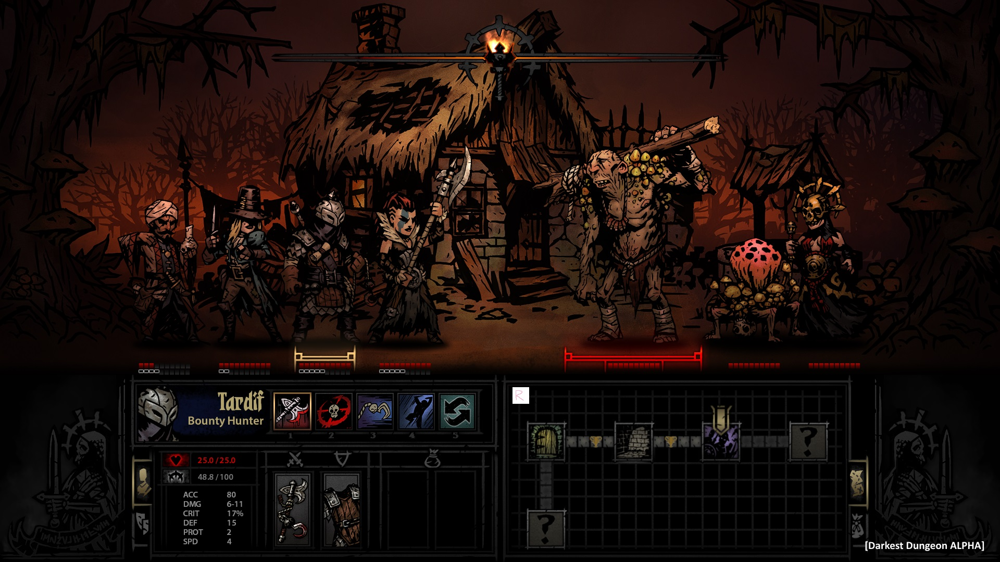
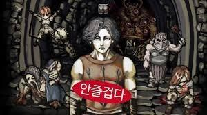
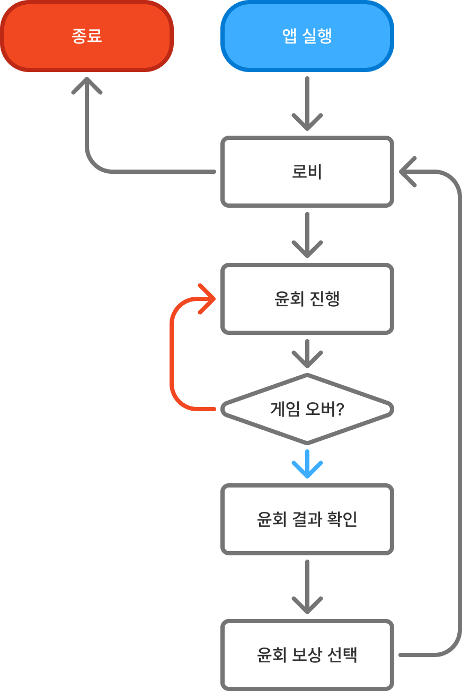

# 게임컨셉기획서_V0_장보성

## 슬라이드 1

게임컨셉기획서

Light life 202313190 장보성

---

## 슬라이드 2

**변경사항**

변경된 내용 정리

| 일시 | 작업자 | 변경 사항 |
| --- | --- | --- |
| 2026.02.11 | 장보성 | 컨셉기획서PPT버전으로 작성 |
|  |  |  |

---

## 슬라이드 3

**게임 개요**

### 아르카나

#### 로그라이트

#### 전략

#### 카드

#### 타로

#### 카드

#### 장르

#### 2D, 로그라이트

#### 턴제 전략 게임

#### 타겟층

#### 20~30대의 캐주얼 게이머

#### 목표를 클리어 할 때의 쾌감을 좋아하는 도전적인 플레이어

#### 플랫폼

#### PC

> 다음은 제공한 이미지에 대한 상세한 설명입니다.

이미지 중앙에는 게임 화면이 있습니다. 게임 화면에는 여러 캐릭터가 등장합니다.

*   게임 화면 왼쪽에는 동일한 모습의 캐릭터 2명이 동일하게 무기를 들고 있는 모습이 보입니다. 
*   게임 화면 중앙에는 머리카락이 주황색인 캐릭터가 있고, 그 옆에는 짙은 보라색 옷을 입은 캐릭터가 있습니다. 
*   게임 화면 오른쪽에는 머리카락이 회갈색인 캐릭터가 있습니다.

화면 하단에는 4개의 작은 화면이 있습니다.

*   가장 왼쪽의 화면에는 노란색 달과 흰색 깃털, 노란색 별이 그려져 있습니다. 
*   두 번째 화면에는 주황색 머리카락의 캐릭터가 그려져 있고, 세 번째와 네 번째 화면에는 흰색 깃털이 그려져 있습니다. 
*   각 화면 하단에는 Attack Attack이라는 동일한 문구가 적혀 있습니다.

전체적으로 게임 전투 장면을 연상케 하는 이미지입니다.

> 이미지는 게임 '다크에스트 던전'의 스크린샷입니다. 

### 이미지의 레이아웃

이미지는 상단 절반과 하단 절반으로 나뉩니다.

### 상단 절반

*   이미지의 상단 절반은 게임의 전투 화면을 보여줍니다. 
*   화면 중앙에는 여러 캐릭터가 그려져 있습니다. 
*   왼쪽부터 순서대로, 
    *   터번을 감은 남성이 창을 들고 있습니다. 
    *   긴 머리의 여성이 단검을 들고 있습니다. 
    *   갑옷을 입은 남성이 낫을 들고 있습니다. 
    *   가면을 쓴 남성이 낫을 들고 있습니다. 
    *   근육질의 남성이 몽둥이를 들고 있습니다. 
    *   버섯이 여러 개 달린 투구를 쓴 여성이 창을 들고 있습니다. 
*   캐릭터들은 각각 다른 방향을 보고 있습니다. 
*   캐릭터들의 뒤로는 나무로 지어진 집이 보입니다. 
*   집 뒤로는 나무가 보입니다. 
*   화면 상단 중앙에는 불이 타오르는 횃불이 보입니다. 
*   화면 상단과 하단에는 각각 불이 켜진 상태와 꺼진 상태를 나타내는 가로로 긴 아이콘이 있습니다. 
*   화면 하단 중앙에는 체력 게이지가 있습니다. 

### 하단 절반

*   이미지의 하단 절반은 게임의 캐릭터 정보와 맵을 보여줍니다. 
*   화면 왼쪽 하단에는 캐릭터의 정보가 있습니다. 
    *   캐릭터의 이름은 'Tariff Bounty Hunter'입니다. 
    *   캐릭터의 모습이 그려진 아이콘이 있습니다. 
    *   캐릭터의 체력이 25/25로 표시되어 있습니다. 
    *   캐릭터의 스탯이 표시되어 있습니다. 
        *   ACC: 80 
        *   DMG: 6-11 
        *   CRIT: 17% 
        *   DEF: 15 
        *   PROT: 2 
        *   SPD: 4 
    *   캐릭터가 착용한 아이템이 표시되어 있습니다. 
*   화면 중앙 하단에는 미니맵이 있습니다. 
    *   회색 타일로 구성된 맵에 여러 표시가 있습니다. 
    *   맵의 중앙에는 노란색 표시가 있습니다. 
    *   맵의 우측 하단에는 '?' 표시가 있습니다. 
    *   맵의 우측 상단에는 금색 방패가 있습니다. 
*   화면 우측 하단에는 로고가 있습니다. 
    *   로고는 해골을 묘사하고 있습니다. 
    *   로고 옆에는 'Darjest Dungeon ALPHA'라는 문구가 있습니다.

> 해당 이미지는 타로카드 메이저 아크나 22장을 보여 주고 있습니다.

이미지 중앙에 가로로 4줄, 세로로 5줄로, 총 20장의 카드를 배치하고, 여기에 추가로 2장의 카드를 더 배치하여 총 22장의 카드를 보여 주고 있습니다.

카드의 디자인은 일관되게 파란색 배경에 노란색 선과 그림으로 채워져 있습니다. 각 카드의 하단에는 카드의 이름이 적혀 있습니다.

카드들은 다음과 같은 순서로 배치되어 있습니다.

1. The Fool
2. The Magician
3. The High Priestess
4. The Empress
5. The Emperor
6. The Hierophant
7. The Lovers
8. The Chariot
9. Strength
10. The Hermit
11. Wheel of Fortune
12. Justice
13. The Hanged Man
14. Death
15. Temperance
16. The Devil
17. The Tower
18. The Star
19. The Moon
20. The Sun
21. Judgement
22. The World

이러한 배치는 타로카드가 가진 상징성과 의미를 시각적으로 잘 표현하고 있습니다.

---

## 슬라이드 4

**게임 개발 방향**

#### 빠른

#### 몰입

#### 전투

#### 전략

#### 스킬

#### 해석

패시브 키워드 등 전략적인 고려 요소 제공

빠르게 인상을 주기 위해 전투에 전략 요소 부여

스킬이 각 카드의 의미에 따라 어울려야 몰입도를 해치지 않음w

---

## 슬라이드 5

**핵심 재미요소**

#### 전략의 재미:

#### 플레이어가 빨리 게임에 몰입할 수 있도록 전투내에 전략을 중점

#### 전략의 재미

#### 전략의 재미:

#### 희귀 노드 등장보상에 랜덤성을 추가함

#### 예상치 못한 보상의 재미

#### 운적요소 포함으로 보상을 기대함

#### 전략의 재미:

#### 자신의 노드를 골라 피로도를 스스로 조절할 수 있도록

#### 선택의 재미

#### 전략의 재미:

#### 회귀를 통해 같은 적의 공략을 하거나기존 윤회의 능력치를 이전 받아 점점 강해짐

#### 회귀를 통한 강화

> 이미지는 하얀색 배경에 검은색 선과 원으로 구성된 그래픽입니다.

중앙에는 큰 검은색 원이 있고, 그 안에 흰색의 시계 바늘이 있는 시계 모양이 그려져 있습니다. 시계 바늘은 10시 15분 정도로 설정되어 있습니다.

검은색 원의 바깥쪽에는 흰색 테두리가 있고, 그 위에 화살표가 왼쪽을 가리키고 있습니다. 화살표는 커브를 그리며 시계 방향으로 회전하는 모양을 나타내고 있습니다.

화살표 아래쪽에는 5개의 작은 검은색 점이 일렬로 나열되어 있습니다. 점들은 화살표의 곡선과 일치하는 방향으로 배치되어 있습니다.

전체적으로 이 그래픽은 시간의 흐름이나 순환을 상징하는 아이콘으로 사용될 수 있습니다.

> 이미지는 화이트 배경에 검은색 선과 도형을 사용한 도식도를 보여 주고 있습니다.

도식도의 왼쪽 하단에는 'O' 모양의 아이콘이 있고, 여기서부터 오른쪽 위로 굽은 화살표가 나와서 오른쪽에 있는 'O' 모양의 아이콘을 가리킵니다.

화살표의 시작점인 왼쪽 아래의 'O' 모양의 아이콘과 화살표의 방향을 따라가면 가장 오른쪽에 있는 'O' 모양의 아이콘을 확인할 수 있습니다.

화살표의 시작점인 왼쪽 아래에는 'O' 모양의 아이콘과 'X' 모양의 아이콘이 있습니다. 화살표의 방향을 따라가면 가장 위쪽에 'X' 모양의 아이콘이 있고, 화살표가 끝나는 지점의 오른쪽에는 'O' 모양의 아이콘이 있습니다.

이러한 도식도는 어떤 프로세스나 시스템의 흐름을 나타내는 데 사용될 수 있습니다. 'O' 모양의 아이콘은 시작점이나 종착점, 'X' 모양의 아이콘은 중간 단계나 조건을 나타낼 수 있습니다. 화살표는 흐름이나 방향을 나타냅니다.

도식도의 레이아웃은 왼쪽 아래에서 시작하여 오른쪽 위로 곡선을 그리며 진행됩니다. 각 아이콘과 화살표는 명확하게 구분되어 있으며, 시각적으로 흐름을 따라가기 쉽게 구성되어 있습니다.

> 이미지는 하나의 화살표가 위로 직진하다가, 두 개로 갈라져 왼쪽과 오른쪽으로 굽어진 채로 각각 좌측과 우측을 가리키는 모습을 나타내고 있습니다. 화살표의 왼쪽과 오른쪽 끝에 각각 화살촉이 표현되어 있습니다. 

화살표의 시작 부분은 이미지 하단 중앙에 위치하고 있습니다. 화살표는 위로 직진하다가 중간에서 왼쪽과 오른쪽으로 갈라집니다. 왼쪽으로 굽어진 화살표는 왼쪽 상단을 가리키고, 오른쪽으로 굽어진 화살표는 오른쪽 상단을 가리킵니다. 

이미지 중앙에 위치한 직진하는 화살표는 뾰족한 화살촉을 나타내고 있습니다.

> 해당 이미지는 게임 기획 문서의 일부로 보이는 이미지입니다. 이미지는 검은색 주사위 아이콘을 포함하고 있습니다.

주사위는 3D 형태로 그려져 있으며, 주사위의 각 면에 하얀색 테두리와 함께 하얀색 점이 찍혀 있습니다.

주사위 아이콘은 다음과 같은 특징을 가지고 있습니다.

* 주사위는 6개의 면을 가지고 있으며, 각 면에는 1개에서 6개의 점이 찍혀 있습니다.
* 주사위의 위쪽 면에는 4개의 점이 찍혀 있습니다.
* 주사위의 오른쪽 면에는 1개의 점이 찍혀 있습니다.
* 주사위의 아래쪽 면에는 3개의 점이 찍혀 있습니다.

주사위 아이콘은 게임에서 무작위 이벤트나 결과를 나타내는 데 사용될 수 있습니다. 예를 들어, 플레이어가 주사위를 굴려서 나온 숫자에 따라 게임의 결과가 결정될 수 있습니다.

주사위 아이콘은 다음과 같은 게임에 사용될 수 있습니다.

* 보드 게임: 주사위는 보드 게임에서 자주 사용됩니다. 플레이어는 주사위를 굴려서 나온 숫자에 따라 게임의 결과를 결정할 수 있습니다.
* 롤플레잉 게임: 주사위는 롤플레잉 게임에서 캐릭터의 능력치나 스킬을 결정하는 데 사용될 수 있습니다.
* 카지노 게임: 주사위는 카지노 게임에서 자주 사용됩니다. 플레이어는 주사위를 굴려서 나온 숫자에 따라 게임의 결과를 결정할 수 있습니다.

주사위 아이콘은 게임의 분위기와 테마에 따라 다양한 색상과 디자인으로 변경될 수 있습니다. 예를 들어, 판타지 게임에서는 주사위가 마법의 아이템으로 그려질 수 있으며, 스포츠 게임에서는 주사위가 스포츠 장비로 그려질 수 있습니다.

---

## 슬라이드 6

**세계관**

**세계관 특징**

  - 운명의 교단이라는 종교 중심의 세계
  - 이들이 따르는 운명의 신은 모두에게 각자의 운명을 한 질서의 세계
**시놉시스**

  - 아르카나라는 운명의 신이 이 세상을 만들어냄
  - 모든 생명체는 자신만의 운명을 가지고 태어남
  - 운명을 지키려는 교단과 자유를 위해 운명을 거부하는 세력간의 혼란스러운 세계
#### 너무 고어, 인육 장기자랑 금지! 자세한 묘사는 금지!!!

#### 너무 가벼운 유치 찬란한 분위기 금지!!!

> 이미지는 게임 기획 문서의 일부로 보이는 캐릭터 이미지입니다.

이미지 중앙에는 노란색과 갈색 머리장식을 착용한 소녀가 그려져 있습니다. 

*   **캐릭터 얼굴 및 신체**

    *   머리: 이 캐릭터는 긴 갈색 머리를 가지고 있습니다. 머리의 오른쪽 위에는 노란색과 갈색으로 된 머리장식이 있습니다. 머리장식의 왼쪽에는 노란색 리본이 묶여 있습니다.
    *   눈: 보라색 눈을 가지고 있습니다. 눈동자는 옅은 하늘색입니다.
    *   볼: 분홍색 볼에 윤기가 있습니다.
    *   입: 입을 벌리고 있습니다.
    *   피부: 하얀 피부를 가지고 있습니다.
    *   머리칼: 긴 갈색 머리를 가지고 있습니다.
*   **캐릭터 의상**

    *   상의: 흰색 상의를 입고 있습니다. 
    *   하의: 노란색과 갈색 허리띠를 착용하고 있습니다. 
    *   장식품: 노란색과 갈색 팔찌를 착용하고 있습니다.

*   **시각적 레이아웃 및 구조**

    *   배경: 하늘색 배경에 흰색 구름이 떠 있습니다.

이 이미지는 게임 캐릭터의 모습을 보여주는 것으로 추정되며, 게임 기획 문서의 일부로 사용될 수 있습니다.

> 이미지는 게임 기획 문서의 일부로, 여러 캐릭터가 등장하는 장면입니다.

이미지 중앙에는 긴 회색 머리를 가진 남성이 있습니다. 남성은 두꺼운 가죽 갑옷을 입고 있습니다. 남성의 가슴에는 붉은색의 타원형 UI가 겹쳐져 있습니다. 타원형 UI에는 흰색의 한글 텍스트가 포함되어 있습니다. 텍스트는 '안줄겁다'로 읽힙니다.

남성의 왼쪽에는 회색 갑옷을 입은 남성이 무릎을 꿇은 채로 앉아 있습니다. 남성의 오른쪽에는 가면을 쓴 남성이 손가락을 세우고 있습니다. 손가락을 세우고 있는 남성의 뒤로는 석재로 만들어진 아치형 벽이 보입니다.

중앙에 있는 남성의 오른쪽에는 큰 덩치를 가진 남성이 있습니다. 남성은 회색 반팔 옷을 입고 있습니다. 남성의 왼쪽에는 짧은 금발을 가진 소녀가 있습니다. 소녀는 피 묻은 옷을 입고 있습니다.

이미지 상단에는 석재로 만들어진 아치형 벽과 통로가 보입니다. 벽면에는 횃불이 보입니다. 벽면의 오른쪽에는 석재로 만들어진 계단이 있습니다. 계단 위로는 불이 타오르는 화로가 보입니다.

이미지의 레이아웃은 중앙에 있는 남성을 중심으로 구성되어 있습니다. 다른 캐릭터들은 남성의 주변에 배치되어 있습니다. 이미지의 색상은 짙은 회색과 짙은 갈색이 주로 사용되었습니다.

---

## 슬라이드 7

**코어 루프**

**코어루프 설명**

**코어루프를 통한 전략적으로 성장은 전투의 전략과 맞물려 피로도가 너무 쌓이기에**

**코어루프에서는 증강이라는 보상과 비례해 적이 강해지는 성장을 한다.**

플레이어는 윤회를 시작하기 전 준비를 함

  - 증강 선택/캐릭터 선택등
플레이어는 자신이 이동할 노드를 선택함

  - 전투/보너스/보스/사건등
노드를 클리어하지 못하면 게임 오버

  - 다음 윤회를 위한 보상을 얻음
노드를 다 클리어 후 보스까지 클리어하면 엔딩

> 이 게임 기획 문서의 이미지는 게임의 흐름을 나타내는 순서도로, 여러 단계와 결정 과정을 보여 주고 있습니다. 각 단계와 결정 과정은 다음과 같습니다.

*   **순서도**
    *   **윤회 시작**: 게임이 시작되는 첫 단계입니다. 이 단계는 **윤회 준비**, **캐릭터 선택**, **증강 선택**, **플레이 노드 선택**, **선택된 노드 진행**, **스테이지 선택**으로 진행됩니다. 
    *   **윤회 준비**: 게임의 준비 단계로, 게임 시작 전에 필요한 초기 설정을 진행합니다.
    *   **캐릭터 선택**: 플레이어가 사용할 캐릭터를 선택하는 단계입니다.
    *   **증강 선택**: 캐릭터에 적용할 수 있는 추가적인 능력이나 아이템을 선택하는 단계입니다.
    *   **플레이 노드 선택**: 게임 진행 경로를 결정하는 단계입니다. 플레이어는 다양한 노드 중에서 하나를 선택하여 게임 진행 방향을 결정합니다.
    *   **선택된 노드 진행**: 선택한 노드에 따라 게임이 진행됩니다. 이 단계에서는 선택한 노드의 내용에 따라 다양한 이벤트나 미션이 발생할 수 있습니다.
    *   **스테이지 선택**: 플레이어는 진행할 스테이지를 선택합니다. 각 스테이지에는 고유한 도전 과제나 목표가 있을 수 있습니다.
*   **스테이지 클리어 여부**: 스테이지를 완료했는지 확인하는 단계입니다. 스테이지를 클리어하면 다음 단계로 진행하고, 실패하면 게임 오버가 됩니다.
*   **보스 스테이지인가?**: 현재 스테이지가 보스 스테이지인지 확인하는 단계입니다. 보스 스테이지라면 보스를 물리치고 엔딩으로 진행합니다. 보스 스테이지가 아니라면 스테이지 선택으로 돌아가서 다시 스테이지를 선택합니다.
*   **엔딩**: 게임이 끝나는 단계입니다. 모든 스테이지를 클리어하고 최종 목표를 달성하면 엔딩으로 진행합니다.
*   **게임 오버**: 게임에 실패한 경우입니다. 게임 오버가 되면 게임이 종료되고, 다시 게임을 시작할 수 있습니다.

결론적으로, 이 순서도는 게임의 전반적인 흐름을 보여 주고 있으며, 플레이어의 선택과 진행 상황에 따라 다양한 경로를 따르게 됩니다.

---

## 슬라이드 8

**메타 루프**

**스테이지를 진행해나가며 중간 중간 지정된 보스전 준비함**

**중간에 게임 오버 시 윤회 스테이지로 처음 초기화됨**

**전 윤회에서 얻은 능력치의 일부 돌려받음**

#### 메타루프 완료까지 예상 플레이 타임

#### 최소 15분~ 최대 20분 (20분 이내 최종 보스를 클리어 할 수 있어야 함)

> 이 게임 기획 문서의 이미지는 앱의 실행부터 종료까지의 흐름을 나타내는 순서도입니다. 각 단계는 다음과 같습니다.

1. **앱 실행**: 
- 앱이 실행됩니다.

2. **로비**:
- 앱 실행 후 로비 화면으로 이동합니다.

3. **윤회 진행**:
- 로비에서 게임이 시작되어 윤회가 진행됩니다.

4. **게임 오버?**:
- 윤회 진행 후 게임이 오버되었는지 확인하는 단계입니다.
  - **예**: 게임이 오버된 경우, 다음 단계로 진행됩니다.
  - **아니요**: 게임이 오버되지 않은 경우, 윤회 진행 단계로 돌아가 게임이 계속 진행됩니다.

5. **윤회 결과 확인**:
- 게임 오버 후 윤회의 결과가 표시되는 단계입니다.

6. **윤회 보상 선택**:
- 윤회 결과 확인 후, 플레이어가 보상을 선택하는 단계입니다.

7. **종료**:
- 모든 과정이 완료되면 앱이 종료됩니다.

이 순서도는 게임의 흐름을 로비, 진행, 결과 확인, 보상 선택, 그리고 종료로 나누어 체계적으로 보여주고 있습니다. 각 단계는 화살표로 연결되어 있어, 게임의 진행 과정을 직관적으로 이해할 수 있습니다.

---

## 슬라이드 9

**플레이 경험 곡선**

#### 난이도 낮춤

#### 특정한 단계마다 보스를 등장시키는 난이도

**도전을 클리어 했을 때 도파민으로 재미요소**

•플레이어가 도전적인 몬스터를 클리어 했을 때의 쾌감

•보스 다음 조우할 적의 난이도는 낮춰 자신이 강해졌다고 느끼게 함

> ## 이미지 설명

해당 이미지는 게임의 난이도 곡선을 표현한 그래프입니다. 그래프는 가로축이 시간, 세로축이 게임 난이도를 나타냅니다. 그래프 위쪽에는 게임의 튜토리얼과 레벨 1, 2, 3, 4 및 클라이맥스 구간이 표시되어 있습니다.

## 레이아웃 및 구조

- 그래프는 Tutorial, Level 1, Level 2, Level 3, Level 4, Climax로 구성되어 있습니다. 
- 각 레벨은 서로 다른 색상으로 표시되어 있습니다. 
- 그래프의 선은 계단처럼 상승하며, 각 레벨에서 새로운 메커니즘이 도입될 때마다 잠시 난이도가 하락했다가 다시 상승하는 패턴을 보여줍니다.

## 텍스트 설명

- 그래프의 제목은 "THE DIFFICULTY SAW!"입니다.
- 그래프의 왼쪽에는 "Game Difficulty"라는 레이블이 있고, 아래에는 "Time"이라는 레이블이 있습니다.
- 그래프에는 "New Mechanic Introduced"라는 라벨이 있습니다.

## 시각적 요소

- 그래프는 검은 선으로 그려져 있으며, 레벨에 따라 색상이 다르게 표시됩니다.
- 각 레벨은 서로 다른 색상으로 표시되어 있습니다.
- 그래프에는 화살표가 있습니다.

## 요약

이 그래프는 게임의 난이도가 시간에 따라 어떻게 변화하는지 보여줍니다. 게임은 튜토리얼부터 시작하여 레벨 1, 2, 3, 4로 진행되며, 각 레벨에서 새로운 메커니즘이 도입될 때마다 난이도가 잠시 하락했다가 다시 상승하는 패턴을 보여줍니다.

---

## 슬라이드 10

**제작 범위**

**제작범위**

  - 주인공 캐릭터 3종, 조력자(튜토리얼) 캐릭터 1종, 추가 캐릭터 1종
  - 중간 보스 캐릭터 2종, 최종 보스 캐릭터 1종
  - 중간 보스 캐릭터 2종과 최종 보스 캐릭터 1종의 스킬 구현.
  - 최종 보스 1종의 궁극기 구현
  - 캐릭터 당 스킬 1개씩, 궁극기 1개씩  총 4가지 스킬과 궁극기 4개 구현.
  - 모든 스킬과 궁극기의 역방향 버전의 효과 구현
  - 대체할 수 있는 추가 스킬 3종과 스킬의 역방향 버전의 효과 구현
---
