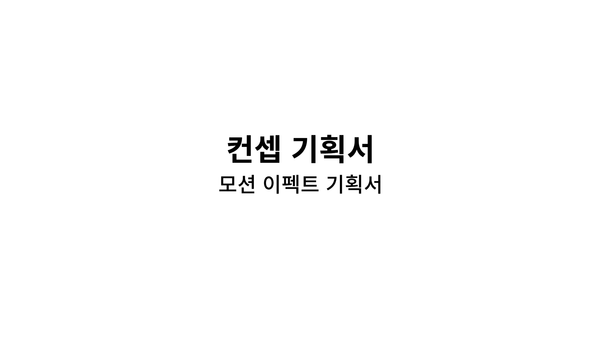
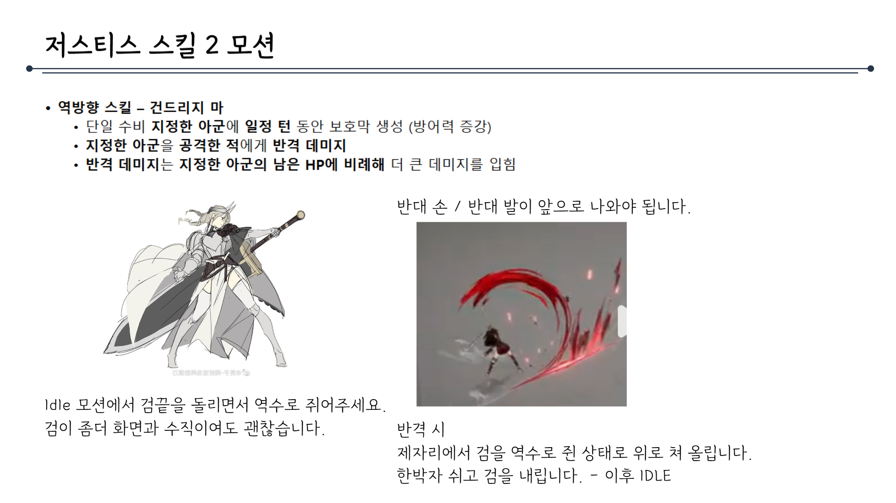
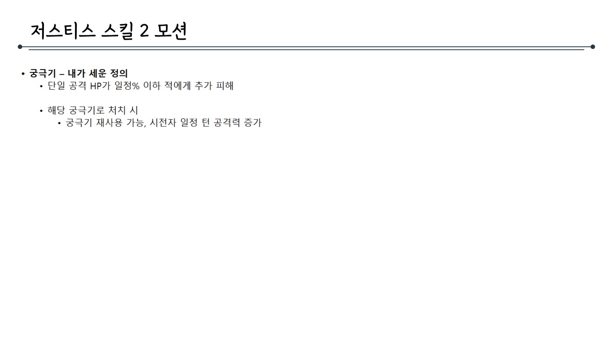
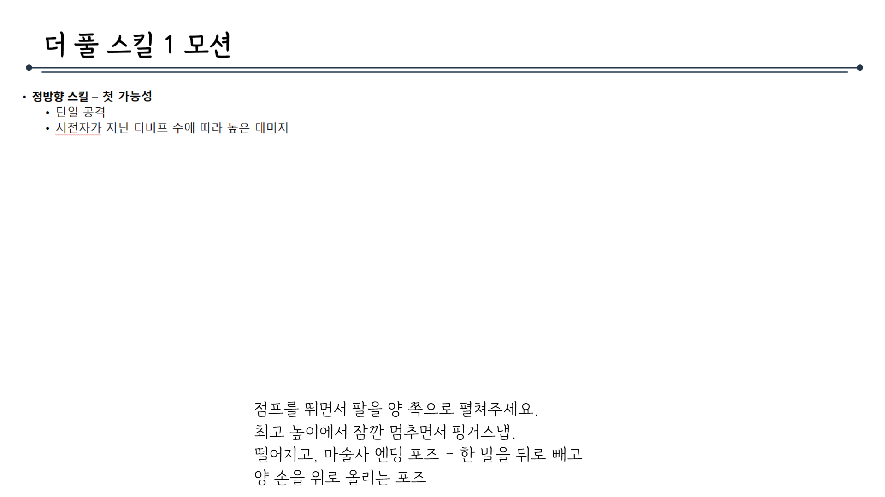

# 모션이펙트제안서_V0_김주연

## 슬라이드 1

> 이미지는 순백의 배경에 검은색 한글 텍스트가 포함되어 있습니다. 

가장 큰 폰트 사이즈로 **"컨셉 기획서"** 라는 문구가 중앙에 위치하고, 조금 더 작은 폰트 사이즈로 그 아래에 **"모션 이펙트 기획서"** 라는 문구가 위치합니다.

이미지에는 텍스트 외에 다른 시각적 요소, 레이아웃, UI 요소, 캐릭터, 아이콘 등은 포함되어 있지 않습니다.

---

## 슬라이드 2

> 해당 문서에는 게임 캐릭터의 포춘 스킬 모션에 대한 설명이 포함되어 있습니다. 문서의 구조와 내용을 상세하게 분석해 보겠습니다.

### 문서의 구조

*   제목: **포춘 스킬 1 모션**
*   부제목: 디버프 해제, 스킬 제거 및 힐 사용 아군 지원 캐릭터
*   내용:
    *   스킬 설명
    *   캐릭터 설명
    *   이미지

### 문서의 상세 내용

*   **제목과 부제목**

    문서의 제목은 **포춘 스킬 1 모션**이며, 부제목은 **디버프 해제, 스킬 제거 및 힐 사용 아군 지원 캐릭터**입니다. 이는 이 문서가 특정 게임 캐릭터의 스킬 모션을 설명하고 있음을 나타냅니다.

*   **스킬 설명**

    문서에는 다음과 같은 스킬 설명이 포함되어 있습니다.

    *   역방향 스킬 - 운명을 되돌리며
        *   아군 단일 디버프 해제
        *   아군 단일 회복
        *   (중간 코스트)

    이 스킬은 아군의 디버프를 해제하고 회복을 제공하는 지원형 스킬로 보입니다.

*   **캐릭터 설명 및 이미지**

    문서에는 캐릭터의 이미지와 동작에 대한 설명이 포함되어 있습니다.

    *   캐릭터 이미지: 작은 이미지에는 하얀 머리를 가진 캐릭터가 손을 허리에 얹고 바퀴를 메고 있는 모습이 그려져 있습니다. 캐릭터는 녹색 눈동자를 가지고 있으며, 짙은 갈색의 모자를 쓰고 있습니다. 캐릭터의 옷차림은 허벅지까지 오는 긴 부츠와 허리띠를 두르고 있습니다. 
    *   모션 이미지: 큰 이미지에는 두 장의 캐릭터 이미지(애니메이션)가 포함되어 있습니다. 
        *   첫 번째 이미지에서는 흰 머리의 캐릭터가 오른손을 얼굴까지 올리고 잠시 대기하는 자세를 취하고 있습니다. 
        *   두 번째 이미지에서는 캐릭터가 오른손(몬스터 쪽)으로 시선을 돌려 빠르게 핑거스냅을 하는 동작을 취하고 있습니다. 
    *   동작 설명: 오른손을 얼굴까지 올리고 잠시 대기합니다. 이후 오른손을 빠르게 뻗어 핑거스냅을 하고, 수레바퀴는 뒤에서 IDLE 상태로 있다가 핑거스냅 이후에 던져집니다.

### 문서의 레이아웃

문서는 깨끗하고 체계적인 레이아웃을 갖추고 있습니다. 제목과 부제목은 상단에 위치하며, 스킬 설명은 왼쪽에, 캐릭터 이미지 및 동작 설명은 오른쪽에 배치되어 있습니다. 이미지는 두 개로 나뉘어져 있으며, 각각의 이미지는 캐릭터의 동작을 명확하게 보여 주고 있습니다.

### 문서의 목적

이 문서의 목적은 게임 캐릭터의 포춘 스킬 모션을 설명하는 것으로 보입니다. 스킬의 효과, 캐릭터의 동작, 그리고 시각적 이미지를 통해 개발자나 디자이너가 캐릭터의 동작과 스킬 효과를 명확하게 이해할 수 있도록 돕고 있습니다.

---

## 슬라이드 3

> 해당 문서에는 게임 내 캐릭터의 기술과 관련된 내용이 포함되어 있습니다. 문서의 제목은 포춘 스킬 2모션입니다. 

### 문서의 레이아웃

문서는 위에서 아래로 긴 형태의 직사각형 레이아웃을 가지고 있습니다. 문서의 왼쪽 상단에는 제목과 부제가 있고, 왼쪽 중간에는 캐릭터의 설명과 캐릭터의 모습이 그려진 두 개의 그림이 있습니다. 문서의 오른쪽에는 하나의 큰 그림과 작은 그림 한 개가 있습니다.

### 문서의 텍스트

문서의 왼쪽 상단에는 다음과 같은 텍스트가 포함되어 있습니다.

* 포춘 스킬 2모션 
* 디버프 해제, 스킬 제거 및 힐 사용 아군 지원 캐릭터 

두 번째 줄의 텍스트는 다음과 같습니다.

* 정방향 스킬 - 운명을 지우고
* 단일, 디버프, 단일 공격
* 적 스킬 1개 제거 
* (높은 코스트)

문서의 오른쪽 하단에는 다음과 같은 텍스트가 포함되어 있습니다.

공중부양 + 왼쪽 팔을 위로 뻗으면서 왼쪽 발을 앞으로 내옴. 캐릭터의 뒷모습이 화면에 보이게 해주세요. 캐릭터 뒤에 있는 수레바퀴가 손 앞으로 나오면서 링 돌려주세요 스킬 사용 이후 다시 왼쪽 팔과 다리를 원상 복구

### 문서에 포함된 그림

문서에는 네 개의 그림이 포함되어 있습니다.

* 왼쪽에 있는 두 개의 그림은 같은 캐릭터를 묘사하고 있습니다. 두 그림 모두 하얀 머리를 가진 캐릭터가 허리춤에 손을 올리고 있는 자세를 보여 주고 있습니다. 두 그림의 차이는 캐릭터의 방향뿐입니다. 왼쪽에 있는 그림은 정면을 향해 있고, 가운데에 있는 그림은 왼쪽을 향해 있습니다. 두 캐릭터는 모두 갈색의 모자를 쓰고 있고, 녹색의 눈을 가지고 있습니다. 캐릭터의 왼쪽에는 노란색 테두리가 있는 갈색의 바퀴가 그려져 있습니다.
* 오른쪽 상단에 있는 그림은 작은 크기의 캐릭터 일러스트입니다. 하얀 머리를 가진 캐릭터가 그려져 있으며, 눈은 파란색입니다. 캐릭터는 하얀색과 검은색이 조합된 옷을 입고 있습니다. 
* 오른쪽 하단에 있는 그림은 게임 화면으로 추정됩니다. 화면에는 노란색 머리를 가진 캐릭터가 그려져 있습니다. 캐릭터는 손을 앞으로 뻗고 있으며, 눈부신 빛을 발하고 있습니다. 캐릭터의 뒤에는 두 명의 캐릭터가 더 그려져 있습니다. 화면의 배경은 주황색입니다.

---

## 슬라이드 4

> 이미지는 게임 기획 문서의 일부로, **"포춘 스킬 1 모션"**이라는 제목이 있습니다. 

*   제목 오른쪽에는 작은 글씨로 디버프 해제, 스킬 제거 및 힐 사용 아군 지원 캐릭터에 대한 설명이 있습니다.
*   이미지 상단에는 가로로 긴 선이 그어져 있습니다.

이미지 중앙에는 노란색의 밝은 빛이 강조된 일러스트가 있습니다. 

*   빛은 여러 겹의 고리로 이루어져 있으며, 그 중심에는 캐릭터가 보입니다. 
*   캐릭터는 양손을 앞으로 뻗고 있으며, 빛나는 구체를 양손으로 감싸고 있는 듯한 자세를 취하고 있습니다. 
*   캐릭터의 얼굴과 구체의 모습은 정확히 보이지 않지만, 캐릭터의 몸과 구체에서 뻗어 나온 빛줄기가 여러 방향으로 퍼져 나가고 있습니다. 
*   빛은 노란색과 흰색으로 표현되어 있으며, 역동적인 움직임을 나타내는 듯합니다.

이미지 하단에는 **"예시 이미지"**라는 설명과 함께 유튜브 링크가 제공되어 있습니다.

*   링크 주소는 <https://youtu.be/HDbg5SQ3n6E?t=20>입니다.

전체적으로 이 포춘 스킬 1 모션은 게임 내에서 캐릭터가 사용하는 특별한 능력으로, 디버프를 해제하고, 스킬을 제거하며, 아군에게 힐을 지원하는 기능을 가지고 있습니다.

---

## 슬라이드 5

> 이미지는 게임 캐릭터의 기술과 관련된 설명이 포함된 게임 기획 문서의 일부입니다. 

### 이미지 내용:

1. **제목 및 설명**
   - **제목**: 포춘 궁극기 모션
   - **설명**: 디버프 해제, 스킬 재거 및 힐 사용 아군 지원 캐릭터

2. **기술 설명**
   - 궁극기 스킬: 새 운명을 만든다
     - 아군 전체 디버프 해제
     - 아군 전체 궁극기 게이지 일정 수치 부여
     - 아군 전체 회복

3. **캐릭터 일러스트**
   - 이미지 하단에 한 캐릭터의 일러스트가 그려져 있습니다.
   - 캐릭터는 손에 무기를 들고 역동적인 자세를 취하고 있습니다.
   - 배경에는 커다란 수레바퀴가 그려져 있습니다.

### 레이아웃:
- **텍스트 부분**: 이미지 상단에 제목과 설명이 있고, 그 아래에 기술에 대한 세부 내용이 글머리 기호로 나열되어 있습니다.
- **이미지 부분**: 페이지 하단 왼쪽에 캐릭터와 수레바퀴가 그려진 일러스트가 배치되어 있습니다.

이 레이아웃은 게임 캐릭터의 기술과 그 효과를 명확히 설명하고, 캐릭터의 비주얼을 함께 제공하여 개발팀이나 디자인팀이 참고할 수 있도록 구성된 것으로 보입니다.

---

## 슬라이드 6

> 해당 문서에는 게임 내 캐릭터의 스킬 동작과 관련된 설명이 포함되어 있습니다.

문서의 제목은 **저스티스 스킬 1 모션**이며, 파란색 선이 가로로 길게 이어져 있습니다.

좌측 상단에는 다음과 같은 설명이 있습니다.

* 정방항 스킬 - 죄를 세긴다
* 광역 공격
* 광역 방어력 디버프

좌측에는 이미지 한 장이 포함되어 있습니다. 이미지에는 남성이 등장하며, 남성은 금색 무기를 들고 있습니다. 배경에는 금색과 노란색이 사용되었습니다.

우측 상단에는 캐릭터의 손과 관련된 설명이 있습니다. 내용은 다음과 같습니다.

반댓손입니다. 발은 동일

우측에는 캐릭터의 동작을 묘사한 스케치 2점이 포함되어 있습니다. 

첫 번째 스케치에는 캐릭터가 양손에 무기를 들고, 왼쪽에서 오른쪽으로 크게 휘두르는 모습이 그려져 있습니다.

두 번째 스케치에는 여성 캐릭터가 등장하며, 여성 캐릭터는 보라색 날개와 같은 무기를 들고 있습니다.

우측 하단에는 다음과 같은 설명이 있습니다.

가장 왼쪽의 몬스터 기준(순간) 이동한다. 모션 속도감이 느껴지게 엉덩이를 오른쪽으로 빼면서 검을 왼쪽에서 오른쪽으로 당겨 넣는 모션(검을 휘두르기 전 원심력을 받기 위해 반대 방향으로 최대한 돌리는 겁니다.) 한박자 쉬고 몬스터 쪽으로 크게 휘둘러 주세요. 모션 끝나고 페이드 아웃 후 제자리로 돌아옵니다.

문서의 배경은 흰색입니다.

---

## 슬라이드 7

> 해당 문서에는 게임 내 캐릭터의 스킬 동작에 대한 설명과 함께, 캐릭터의 동작을 묘사한 두 장의 이미지가 포함되어 있습니다.

문서의 구조는 다음과 같습니다.

*   제목: "저스티스 스킬 2 모션" 
*   제목 아래로 가는 선이 가로로 길게 이어져 있습니다.
*   왼쪽에는 캐릭터가 등장하는 이미지와 설명이 있고, 오른쪽에는 캐릭터의 공격 동작을 나타내는 이미지와 설명이 있습니다.

문서의 상세한 내용은 다음과 같습니다.

*   제목: 저스티스 스킬 2 모션
*   스킬 설명:
    *   역방항 스킬 - 건드리 지마
    *   단일 수비 지정한 아군에 일정 턴 동안 보호막 생성 (방어력 증가)
    *   지정한 아군을 공격한 적에게 반격 데미지
    *   반격 데미지는 지정한 아군의 남은 HP에 비례해 더 큰 데미지를 입힘
*   캐릭터 이미지 (왼쪽)
    *   여성 캐릭터가 큰 검을 들고 있는 모습
    *   캐릭터의 설명: Idle 모션에서 검끝을 돌리면서 역수로 쥐어주세요. 검의 방향이 화면과 수직이여도 괜찮습니다.
*   캐릭터 공격 동작 이미지 (오른쪽)
    *   캐릭터가 붉은색의 무언가를 공격하는 듯한 이미지
    *   캐릭터의 설명: 반대 손 / 반대 발이 앞으로 나와야 됩니다. 반격 시 제자리에서 검을 역수로 쥐인 상태로 위로쳐 올립니다. 한박자 쉬고 검을 내립니다. - 이후 IDLE

---

## 슬라이드 8

> ## 문서 레이아웃

문서는 다음과 같은 레이아웃을 가지고 있습니다.

*   **제목 영역**
    *   상단 중앙에 **"저스티스 스킬 2 모션"**이라는 타이틀 텍스트가 있습니다.
    *   타이틀 텍스트 왼쪽에는 작은 원이 있고, 오른쪽에는 긴 선이 있습니다.
*   **내용 영역**
    *   제목 아래에 3개의 항목이 있습니다.
    *   각 항목은 다음과 같습니다.
        *   궁극기 - 내가 세운 정의
            *   단일 공격 HP가 일정% 이하 적에게 추가 피해
        *   해당 궁극기로 처치 시
            *   궁극기 재사용 가능, 시전 중 발동된 공격력 강화

## 문서 내용

문서의 내용은 다음과 같습니다.

*   **제목:** 저스티스 스킬 2 모션
*   **내용:**
    *   궁극기 - 내가 세운 정의
        *   단일 공격 HP가 일정% 이하 적에게 추가 피해
    *   해당 궁극기로 처치 시
        *   궁극기 재사용 가능, 시전 중 발동된 공격력 강화

---

## 슬라이드 9

> 해당 문서의 제목은 **매지션 스킬 1 모션**입니다.

문서의 레이아웃은 다음과 같습니다.

*   페이지 상단 중앙에 **매지션 스킬 1 모션**이라는 타이틀을 포함하는 가로 줄이 위치해 있습니다.
*   왼쪽에는 게임 캐릭터의 동작을 묘사한 스케치와 설명이 포함된 두 개의 글머리 기호가 있습니다.
*   오른쪽에는 게임 캐릭터의 실제 애니메이션 이미지가 있습니다.

타이틀 밑에 있는 두 개의 글머리 기호의 내용은 다음과 같습니다.

*   정방항 스킬 - 스포트라이트
    *   단일 대상 공격
    *   방어 디버프 부여

페이지 하단에는 캐릭터의 움직임을 설명하는 추가 지침이 포함되어 있습니다.

*   점프를 뛰면서 팔을 양쪽으로 펼쳐주세요.
*   최고 높이에서 잠깐 멈추면서 핑거스냅.
*   마술사 엔딩 포즈 - 한 발을 뒤로 빼고 양 손을 위로 올리는 포즈

오른쪽에 있는 게임 캐릭터의 이미지는 하얀 머리와 보라색 눈을 가진 소녀의 모습을 하고 있습니다. 캐릭터는 하얀색 긴팔 옷과 검은 조끼, 그리고 하늘색 리본을 착용하고 있습니다. 캐릭터는 왼팔을 앞으로 뻗고, 오른팔을 뒤로 뻗은 채로 점프하고 있는 자세를 취하고 있습니다.

---

## 슬라이드 10

> 해당 문서에는 게임 내 캐릭터의 스킬 동작과 관련된 설명이 포함되어 있습니다.

문서의 제목은 '매지션 스킬 2 모션'이며, 파란색 선이 제목 위아래로 가로로 길게 이어져 있습니다.

제목 아래에는 다음과 같은 설명이 있습니다.

* 역방향 스킬 - 뺑내기
  * 광역 공격
  * 디버프에 수에 따른 추가 피해

문서의 오른쪽에는 한 캐릭터의 모습이 삽입되어 있습니다. 삽입된 캐릭터의 모습은 다음과 같습니다.

*   캐릭터는 오른쪽을 향해 앉아 있는 자세로, 하의가 허벅지까지 올라오는 짧은 바지입니다. 바지의 색은 밝은 회색이며, 캐릭터의 피부색과 유사해 보입니다. 
*   캐릭터의 상의는 짙은 보라색이며, 왼쪽 귀가 노출된 스타일입니다. 
*   캐릭터의 머리카락은 짙은 보라색이며, 왼쪽으로 흘러내려오게 표현되어 있습니다. 
*   캐릭터의 왼쪽에는 귀여운 외형을 가진 작은 캐릭터가 함께 그려져 있습니다. 작은 캐릭터는 눈이 보라색이며, 머리는 까만색입니다. 

삽입된 캐릭터의 동작과 관련된 설명은 다음과 같습니다.

*   가볍게 위로 뜨면서(점프) 이 때 채찍을 주변으로 휘날리게 한쪽 다리를 크게 올리면서 꼬아주세요.
*   양손으로 채찍 끝을 잡고, 팡 하고 땡겨주세요.
*   오른손에 채찍 손잡이가 잡혀있어야 함. 땡긴 이후에 크게 휘둘러서 적군 공격(저스티스 1스킬과 같은 방향)

---

## 슬라이드 11

> 이미지는 게임 기획 문서의 일부로, "더 풀 스킬 1모션"에 대한 설명이 포함되어 있습니다. 문서의 레이아웃과 구조는 다음과 같습니다.

*   **제목**: 문서의 제목은 "더 풀 스킬 1모션"으로, 중앙에 위치해 있습니다.
*   **내용**: 
    *   제목 아래에 작은 글씨로 세 가지 내용이 포함되어 있습니다.
        *   정방향 스킬 - 첫 가능성
        *   단일 공격
        *   시전자 가진 디버프 수에 따라 높은 대미지
    *   아래에 더 자세한 설명이 포함되어 있습니다.
        *   점프를 뛰면서 팔을 양쪽으로 펼쳐주세요.
        *   최고 높이에서 잠깐 멈추면서 핑거스냅.
        *   마술사 엔딩 포즈 - 한발을 뒤로 빼고 양 손을 위로 올리는 포즈

문서의 레이아웃은 심플하고 깔끔하며, 주요 내용을 강조하기 위해 글씨 크기와 색상을 구분하였습니다.

---

## 슬라이드 12

> 이미지는 게임 기획 문서의 일부로, **'더 풀 스킬 2모션'**에 대한 설명입니다. 레이아웃은 다음과 같습니다.

*   **제목 영역**: 
    *   페이지 상단 중앙에는 **'더 풀 스킬 2모션'**이라는 제목이 있습니다. 제목 위쪽과 아래에는 가로로 긴 점선이 배치되어 있습니다.
*   **텍스트 영역**: 
    *   왼쪽에는 3줄의 **텍스트 설명**이 있습니다. 
    *   내용은 다음과 같습니다. 
        *   역방향 스킬 - 무기한 도약 
        *   광역 공격 
        *   자신의 HP 일부 소모, 방어 디버프 
        *   HP가 낮을수록 높은 데미지 
*   **이미지 영역**: 
    *   오른쪽에는 게임 캐릭터의 모습이 삽입되어 있습니다. 
    *   이미지 속 캐릭터는 허벅지까지 오는 화려한 핑크색 머리를 가지고 있으며, 짙은 보라색 배경과 조화롭게 어우러진 블랙 계열의 의상을 입고 있습니다. 
    *   캐릭터의 왼쪽 아래에는 작은 캐릭터가 더 그려져 있습니다. 
*   **추가 설명 영역**: 
    *   이미지 아래에는 캐릭터의 동작에 대한 설명이 있습니다. 
    *   내용은 다음과 같습니다. 
        *   가볍게 위로 뜨면서(점프) 이 때 채찍을 주변으로 휘날리게 한쪽 다리를 크게 올리면서 꼬아주세요. 양 손으로 채찍 끝을 잡고, 팡 하고 땡겨주세요.

---
