# 배경컨셉_V0_이채연

## 슬라이드 1

배경 컨셉

---

## 슬라이드 2

이 문서를 읽을 때..

모든 것은 수정될 수 있습니다.

궁금한 점이 있으면 언제든 담당자 이채연에게 연락 부탁드립니다. (새벽에도  OK )

이채연 010 2988 7090

---

## 슬라이드 3

#### 뷰 참고

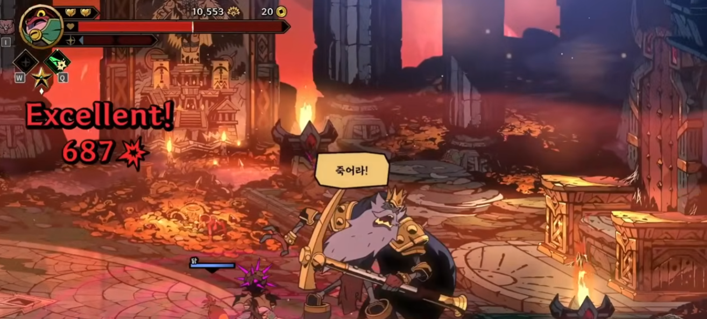

> 이미지는 게임 화면입니다. 

상단 왼쪽에는 캐릭터의 프로필 사진이 있고, 그 옆에 하트 모양의 아이콘 2개가 있습니다. 

*   하트 모양의 아이콘 오른쪽에는 숫자가 적혀 있습니다. 
*   화면 상단 중앙에는 체력 게이지 모양의 아이콘이 있고, 그 옆에 숫자가 적혀 있습니다. 
*   화면 상단 오른쪽에는 동그라미 모양의 아이콘이 있고, 그 옆에 숫자가 적혀 있습니다.

화면 왼쪽에는 다음과 같은 문구가 있습니다.

*   Excellent! 
*   687

화면 중앙에는 큰 새가 있습니다. 새의 머리 위에는 노란색으로 죽어리! 라고 적혀 있습니다.

화면 하단 중앙에는 가로로 긴 파란색 게이지가 있습니다.

화면 오른쪽에는 석상으로 추정되는 조각상들이 보입니다.

전체적으로 게임 화면이며, 게임 진행 상황과 플레이어의 상태를 나타내는 다양한 요소들이 포함되어 있습니다.

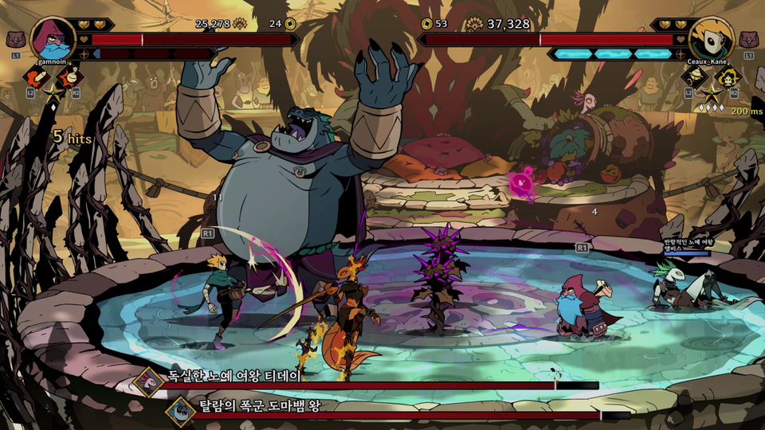

> 이미지는 게임의 한 장면을 보여 주고 있습니다. 

## 게임 화면 레이아웃

화면 상단에는 플레이어의 정보와 게임 진행 상황을 나타내는 요소들이 배치되어 있습니다. 화면 중앙에는 캐릭터들이 전투를 벌이고 있는 모습이 나타나 있습니다.

## 화면 상단 레이아웃

화면 상단에는 다음과 같은 요소들이 배치되어 있습니다.

* **플레이어 정보**
  * 화면 상단 좌측에는 플레이어의 프로필 아이콘과 이름이 표시되어 있습니다. 
    * 프로필 아이콘: 분홍색 머리의 캐릭터를 나타내는 아이콘
    * 이름: gammalin
  * 화면 상단 우측에는 다른 플레이어의 프로필 아이콘과 이름이 표시되어 있습니다.
    * 프로필 아이콘: 노란색 머리의 캐릭터를 나타내는 아이콘
    * 이름: Ceaux_Kane
* **게이지 바**
  * 화면 상단 중앙에는 두 개의 게이지 바가 있습니다. 
    * 첫 번째 게이지 바: 붉은색으로 표시되며, 25,278/24로 표시됩니다.
    * 두 번째 게이지 바: 남색으로 표시되며, 37,328로 표시됩니다.
* **아이콘**
  * 화면 상단 중앙에는 노란색 동전 모양의 아이콘과 숫자가 표시되어 있습니다. 
    * 아이콘: 노란색 동전 모양
    * 숫자: 53
  * 화면 상단 우측에는 노란색 하트 모양의 아이콘이 있습니다.

## 화면 중앙 레이아웃

화면 중앙에는 캐릭터들이 전투를 벌이고 있는 모습이 나타나 있습니다.

* **배경**
  * 배경에는 숲과 같은 자연 환경이 그려져 있습니다. 
  * 여러 캐릭터가 전투를 벌이고 있는 장소는 둥근 수영장 같은 공간이 설정되어 있습니다. 
* **캐릭터**
  * 큰 덩치를 가진 회색 캐릭터: 양손을 들고 있는 모습으로 표현되어 있습니다. 
  * 작은 캐릭터들: 여러 종류의 캐릭터가 전투를 벌이고 있습니다. 
    * 녹색 옷을 입은 캐릭터
    * 주황색 옷을 입은 캐릭터
    * 보라색 옷을 입은 캐릭터
    * 회색 옷을 입은 캐릭터
    * 하얀색 옷을 입은 캐릭터

## 화면 하단 레이아웃

화면 하단에는 다음과 같은 요소들이 배치되어 있습니다.

* **아이콘**
  * 화면 하단 좌측에는 네 개의 아이콘이 있습니다. 
    * 각 아이콘에는 캐릭터의 모습이 그려져 있습니다.
* **텍스트**
  * 화면 하단 중앙에는 두 줄의 텍스트가 있습니다.
    * 첫 번째 줄: 독실한 노예 여왕 티테어
    * 두 번째 줄: 달콤한 폭군 도마뱀 왕

## 기타 요소

* **타이머**
  * 화면 상단 우측에는 200ms라고 표시되어 있습니다. 
* **데미지 표시**
  * 화면 상단 좌측에는 5 hits라고 표시되어 있습니다.

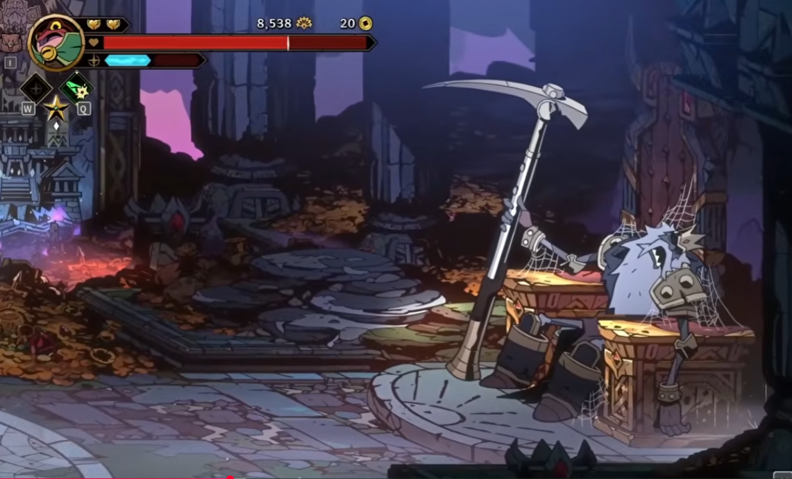

> 이미지는 게임의 한 장면을 보여주고 있습니다. 화면 상단에는 플레이어의 상태 표시줄이 있습니다. 상태 표시줄에는 플레이어의 프로필 아이콘, 체력 바, 두 개의 황금색 심장 아이콘, 태양 모양의 아이콘과 숫자가 표시되어 있습니다. 

플레이어의 프로필 아이콘 왼쪽 아래에는 네 개의 작은 아이콘이 있습니다. 위쪽에 "W"라는 글자가 적힌 검은 다이아몬드 모양의 아이콘, 왼쪽에 녹색 깔개가 그려진 검은 다이아몬드 모양의 아이콘, 노란 별이 그려진 검은 다이아몬드 모양의 아이콘, 하단에 "Q"라는 글자가 적힌 검은 다이아몬드 모양의 아이콘이 있습니다.

화면 중앙에는 큰 은색 낫이 있습니다. 낫의 오른쪽에는 테이블이 있고 테이블 위에는 거미줄이 덮여 있습니다. 테이블 뒤에는 로봇처럼 생긴 캐릭터가 앉아 있습니다. 로봇은 흰색이고 눈이 큽니다. 

로봇의 왼쪽에는 금화 더미가 있습니다. 금화 더미 뒤로는 부서진 기둥과 돌 조각들이 흩어져 있습니다. 배경에는 보라색 하늘이 보이고, 멀리 성곽이 있습니다.

화면 하단에는 빨간색 선이 있습니다.

---

## 슬라이드 4

#### 채색법

#### 리버스1999 배경 참고

#### 약 수분화

#### 밟고 있는 배경 / 뒷 배경

#### 레이어 나눠서 작업

#### 앞쪽 프레임은 거의 안 움직임

#### 채도 고정 명도 조절

#### 색이 너무 다양하지 않게

#### 메인 컬러 9 / 포인트 컬러 1

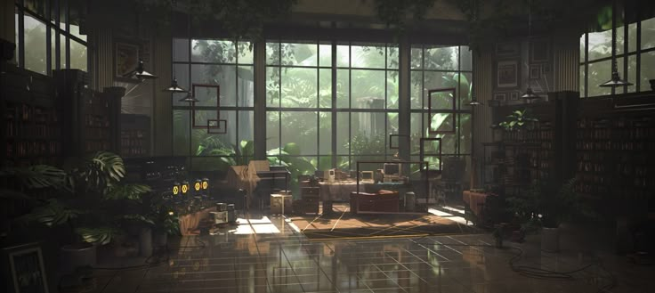

> 이미지는 실내 공간의 3D 렌더링으로, 넓은 공간의 실내를 조명과 사물, 식물 등이 사실적으로 표현되어 있습니다.

### 공간 레이아웃

*   이미지의 전반적인 공간 레이아웃은 다음과 같습니다.
    *   벽: 이미지의 왼쪽과 오른쪽에는 벽이 있으며, 벽에는 창문, 책장, 그림 등이 있습니다.
    *   바닥: 바닥은 타일로 되어 있으며, 빛에 반사되어 반짝이는 모습입니다.
    *   가구: 소파, 테이블, 의자 등이 공간 곳곳에 배치되어 있습니다.

### 조명

*   이미지의 조명은 자연광과 인공광이 적절히 활용되어 있습니다.
    *   자연광: 큰 창문을 통해 자연광이 유입되고 있습니다. 햇빛은 바닥과 벽에 반사되며, 공간을 밝고 따뜻하게 만들어 줍니다.
    *   인공광: 벽에 매달린 스탠드와 테이블 위에 있는 작은 조명이 공간을 추가로 비추고 있습니다.

### 사물

*   이미지에는 다양한 사물이 있습니다.
    *   책장: 벽을 따라 책장이 배치되어 있으며, 책과 장식품이 가득 차 있습니다.
    *   식물: 공간 곳곳에 다양한 종류의 식물이 배치되어 있습니다. 
    *   그림: 벽에 여러 점의 그림이 걸려 있습니다.
    *   소파 및 테이블: 공간 중앙에 소파와 테이블이 배치되어 있습니다.

### 창문

*   이미지의 배경에는 큰 창문이 있습니다. 창문 밖으로는 나무와 풀들이 보이며, 햇빛이 공간 내부로 들어오고 있습니다.

### 캐릭터 및 아이콘

*   이미지에는 캐릭터나 아이콘은 보이지 않습니다.

### UI 요소

*   이미지에는 UI 요소가 보이지 않습니다.

### 시각적 레이아웃과 구조

*   이미지는 전반적으로 어둡고 신비로운 분위기를 가지고 있습니다. 큰 창문을 통해 들어오는 자연광과 인공광이 조화롭게 어우러져 있습니다. 공간은 넓고 개방감이 있으며, 다양한 사물과 식물들이 배치되어 있습니다.

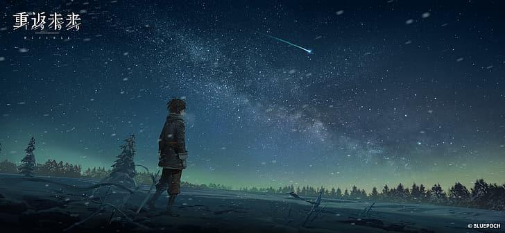

> 이미지는 게임의 홍보 일러스트레이션으로 추정되며, 게임의 분위기와 주요 캐릭터 또는 상징적인 요소를 나타내고 있습니다. 이미지를 분석하면 다음과 같은 요소들을 확인할 수 있습니다:

1. **텍스트 요소:**
   - **좌측 상단:** 흰색의 중국어가 적혀 있습니다. 내용은 "真源初露"로 추정되며, 게임의 제목이거나 게임 내 중요한 문구일 수 있습니다. 그 아래에 가는 선이 있습니다.
   - **하단 우측:** 작은 글씨로 "© BLUEPOCH"이 적혀 있습니다. 저작권 표시로, 이 이미지의 소유권이 블루포치(Bluepoch)임을 나타냅니다.

2. **시각적 레이아웃과 구조:**
   - 배경은 밤하늘을 표현하고 있으며, 수많은 별과 유성, 그리고 은하수가 선명하게 그려져 있습니다. 하늘은 짙은 남색에서 녹색빛이 감도는 지평선으로 그라데이션을 줘서 몽환적인 분위기를 강조하고 있습니다.
   - 눈이 내리고 있는 장면으로, 눈송이들이 여러 곳에서 떨어지고 있습니다.

3. **주인공:**
   - 이미지 중앙 왼쪽에 서 있는 캐릭터가 있습니다. 이 캐릭터는 짙은색의 외투와 바지를 입고 있으며, 등에 무언가를 메고 있습니다. 머리는 짧은 편이며, 머리카락이 다소 흐트러진 모습입니다. 
   - 캐릭터는 오른쪽을 향해 서 있으며, 멀리 있는 풍경을 응시하는 듯한 자세를 취하고 있습니다.

4. **배경:**
   - 캐릭터의 뒤로는 눈 덮인 들판이 있고, 여러 나무들이 보입니다. 나무들은 눈이 쌓여 있어 겨울 풍경을 나타내고 있습니다.

5. **아이콘 및 그래픽 요소:**
   - 이미지에는 특별한 아이콘은 보이지 않지만, 캐릭터가 메고 있는 가방이나 장비들이 디테일하게 표현되어 있습니다.

이 일러스트레이션은 게임의 분위기를 상징적으로 보여주는 이미지로, 게임의 배경이나 스토리의 일부분을 암시할 수 있습니다. 게임의 분위기는 몽환적이고 서정적인 느낌을 주고 있으며, 캐릭터의 모습과 배경의 풍경이 조화롭게 어우러져 있습니다.

---

## 슬라이드 5

#### 1스테이지 전투 노드 배경

#### 꽃밭의 정원에서 열리는 티파티.

#### 저지먼트가 있는 법정까지 가기 위한 중간 과정

#### 맨 뒤쪽에 법정 외관이 흐리게 보여도 좋을 듯

#### 정원에 퍼져있는 꽃은 노란 장미들로 부탁합니다.

#### 장미, 테이블 보, 금빛 차를 제외하고는 채도를 확 낮춰 거의 회색으로 처리

#### 차 관련된 조형물 (이상한 나라의 앨리스 참조)

#### 하트 여왕 같은 느낌

#### 붉은 빛 테이블 보, 금빛 차

> 해당 이미지에는 다음과 같은 요소가 포함되어 있습니다.

*   사진 중앙에 큰 분홍색, 노란색, 빨간색, 하얀색 꽃이 있는 화단이 있습니다.
*   사진 중앙에 녹색 잔디가 있고, 그 뒤로 큰 수풀이 보입니다.
*   사진 중앙 뒤로 여러개의 커다란 창문과 아치형 출입구가 있는 베르사유 궁전이 있습니다.
*   베르사유 궁전 뒤로 짙은 녹색의 나무들이 일정한 간격으로 심어져 있습니다.
*   베르사유 궁전 앞에는 큰 연못이 있습니다.
*   이미지 오른쪽 하단에 골로로 로고가 있습니다.

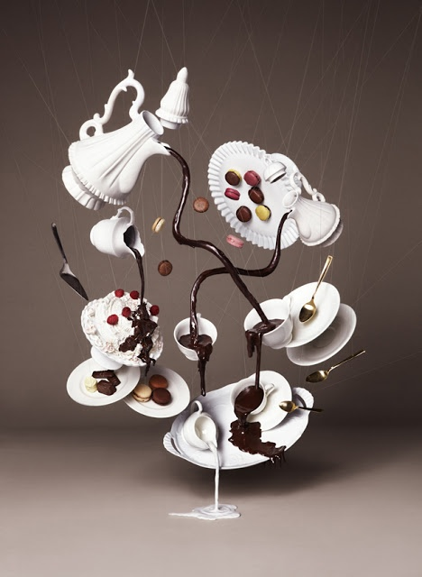

> 이미지는 여러 가지 종류의 디저트가 혼합된 듯한 구도를 보여 주고 있습니다. 

이미지 중앙에는 하트 모양의 접시에 여러 가지 젤리 같은 음식이 6개 놓여 있습니다. 이 접시의 왼쪽에는 아이스크림 한 덩어리가 보입니다. 이 아이스크림은 빨간색 과일이 3개 얹어져 있는 것으로 보아 라스베리 혹은 딸기 향이 나는 아이스크림 같습니다. 이 아이스크림의 왼쪽에는 작은 접시에 3개의 밤과 1개의 아몬드가 올려진 디저트가 보입니다.

이미지의 오른쪽에는 2개의 금색 포크가 위로 날아가는 듯한 모습으로 보입니다. 이 포크의 왼쪽에는 작은 접시에 마시멜로가 2개, 그 옆에는 티컵이 보입니다. 티컵 위로는 티포트가 뒤집어진 채로 날아가는 듯한 모습입니다. 이 티포트의 오른쪽에는 티컵과 티소서, 그리고 작은 접시가 보입니다.

이미지 중앙에는 티포트에서 흘러나온 듯한 초콜릿이 마치 뱀처럼 구불구불하게 흐르는 모습이 보입니다. 이 초콜릿은 여러 갈래로 나뉘어져서 디저트들을 자유롭게 연결하고 있는 듯합니다.

이미지의 하단에는 하얀 티컵이 하나 보입니다. 이 티컵은 뒤집어진 채로 놓여 있으며, 티컵의 입구로 초콜릿이 흘러나오고 있습니다. 이 티컵의 왼쪽에는 작은 접시에 마시멜로와 밤이 2개씩 올려진 디저트가 보입니다.

이미지의 배경은 짙은 갈색이며, 디저트와 티컵, 티포트는 가는 실에 매달린 듯한 모습입니다.

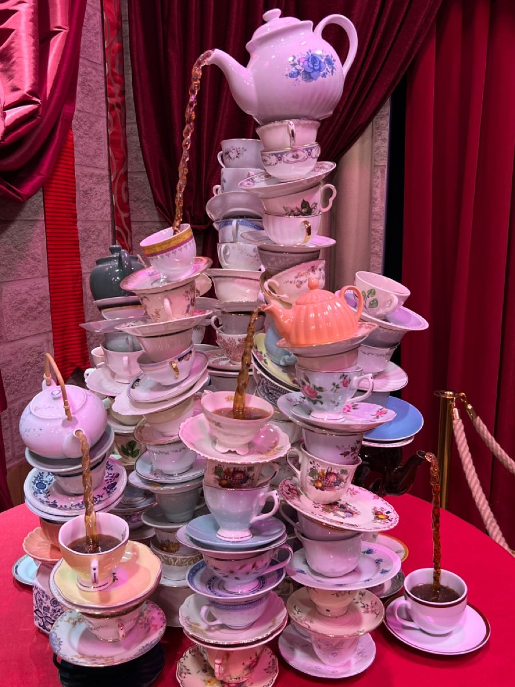

> 이미지는 분홍색 테이블 위의 차 컵과 주전자 탑을 보여줍니다. 

이미지 중앙에는 다양한 크기와 디자인의 차 컵과 접시가 여러 겹으로 쌓여 있습니다. 각 층마다 여러 개의 컵과 접시가 놓여 있으며, 일부 컵에서는 차가 쏟아지고 있습니다. 

분홍색, 흰색, 파란색, 금색 등 다양한 색상의 컵과 접시가 있으며, 꽃, 동물, 기하학적 패턴 등 다양한 디자인이 있습니다.

이미지 왼쪽에는 빨간 커튼이 있고, 오른쪽에는 금색 기둥과 로프가 있습니다. 배경에는 회색 벽이 있습니다.

전체적으로 이미지는 화려하고 기발한 분위기를 연출합니다.

---

## 슬라이드 6

#### 1스테이지 중간 보스 노드 배경

#### 붉은 색, 금색 기반 화려한 법정

#### 정의의 여신 조각상이 배치되었으면 합니다.

#### 조각상은 눈을 가리지 않고, 저울이 한쪽으로 과하게 기울어진 형태.

#### 맨 뒤에 개 큰 저울 둬주세요

#### 저울, 여신 예시 사진

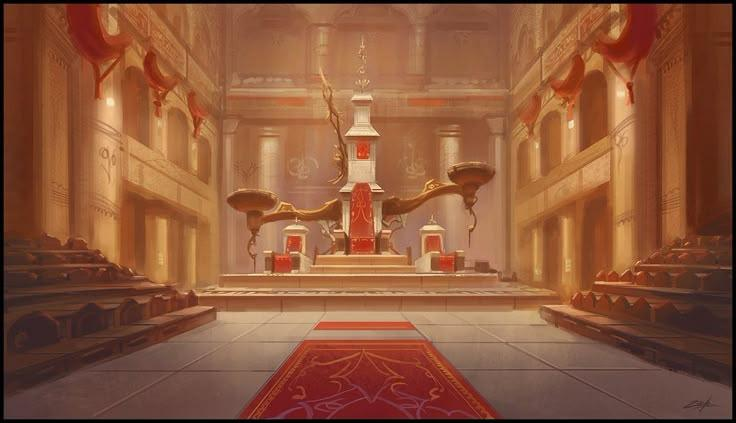

> 이미지는 고풍스러운 건축물이 있는 방의 내부 모습을 담고 있습니다. 이미지 중앙에는 붉은색과 하얀색으로 이루어진 탑이 있고, 그 앞으로는 붉은색 카펫이 바닥에 깔려 있습니다. 카펫의 앞쪽에는 붉은색과 노란색으로 장식된 두 개의 작은 탑이 양쪽에 자리 잡고 있습니다. 

이미지의 좌측과 우측에는 계단식으로 된 좌석이 배치되어 있습니다. 벽면에는 여러 개의 아치형 창문과 기둥이 있고, 위쪽에는 붉은색의 깃발 같은 장식품이 매달려 있습니다. 방 전체적으로 황금빛 조명이 비추고 있어 고요하고 화려한 분위기를 연출하고 있습니다. 

이미지 하단 중앙에는 붉은색 카펫이 길게 깔려 있어, 시선이 중앙으로 집중되게끔 유도하고 있습니다. 탑과 카펫, 그리고 주변의 장식품들이 조화롭게 배치되어, 고풍스럽고 화려한 인테리어를 자랑하는 공간임을 알 수 있습니다.

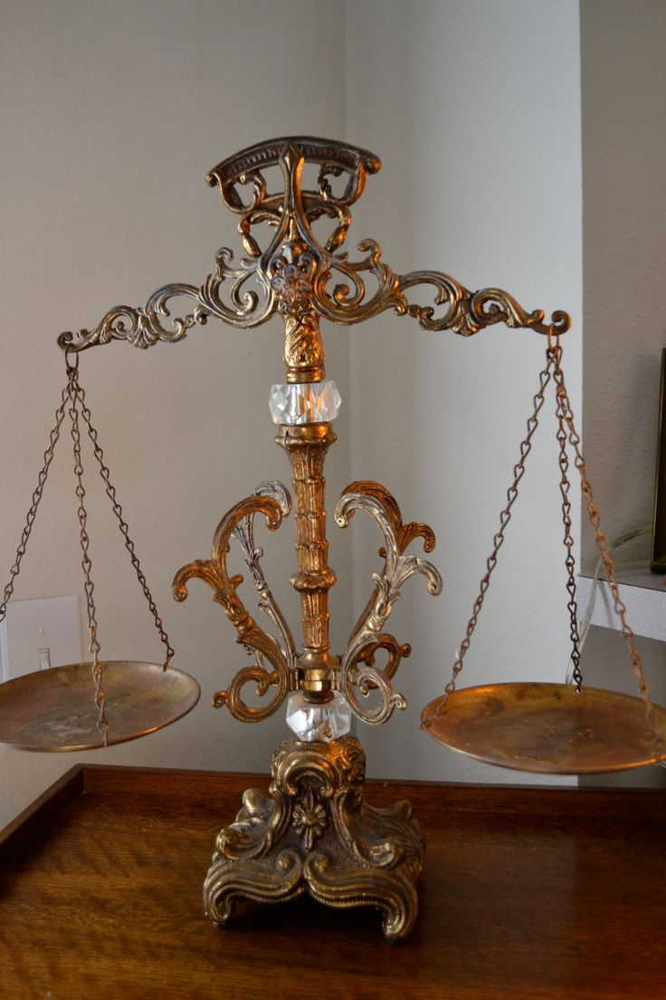

> 금색과 구리빛의 고전적인 디자인의 저울이 테이블 위에 놓여 있습니다. 저울의 중심 기둥은 투명한 유리로 장식되어 있고, 좌우로 뻗어 나온 금속 막대의 끝에는 각각 금속 재질의 접시가 체인으로 매달려 있습니다. 

저울의 중심 기둥은 아래로 내려올수록 폭이 넓어지며, 아래쪽에는 꽃과 같은 모양의 금속 조각이 새겨져 있습니다. 기둥의 윗부분과 아래부분에는 모두 투명한 유리 구체가 장식되어 있습니다. 

저울의 중심 기둥이 놓이는 바닥면에는 꽃과 같은 모양의 금속 조각이 새겨져 있습니다. 

전체적으로 이 저울은 고전적인 디자인과 정교한 디테일로 인해, 고풍스럽고 고급스러운 느낌을 줍니다. 배경에는 흰 벽이 있고, 저울은 나무 테이블 위에 놓여 있습니다.

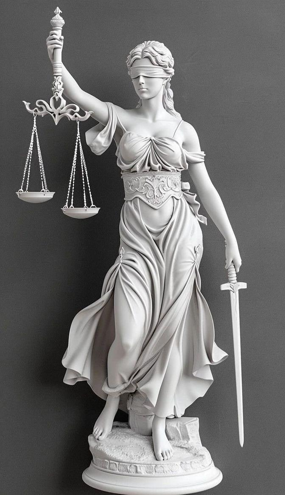

> 이미지는 정의의 여신상을 묘사하고 있습니다. 

정의의 여신상은 하얀 대리석으로 만들어진 조각상입니다. 

정의의 여신은 눈을 가리고 있습니다. 

정의의 여신은 왼손에 저울을 들고 있습니다. 

정의의 여신은 오른손에 칼을 들고 있습니다.

정의의 여신은 대리석 받침대 위에 서 있습니다.

배경은 짙은 회색입니다.

---

## 슬라이드 7

#### 오른쪽 끝에 앉아있는 보스(엠페러)를

#### 비추는 빛이 있으면 좋겠다.

#### 앞쪽 프레임으로 찢어진 깃발

#### 벽걸이 전등 정도 실루엣으로 표현

#### 왕국 1

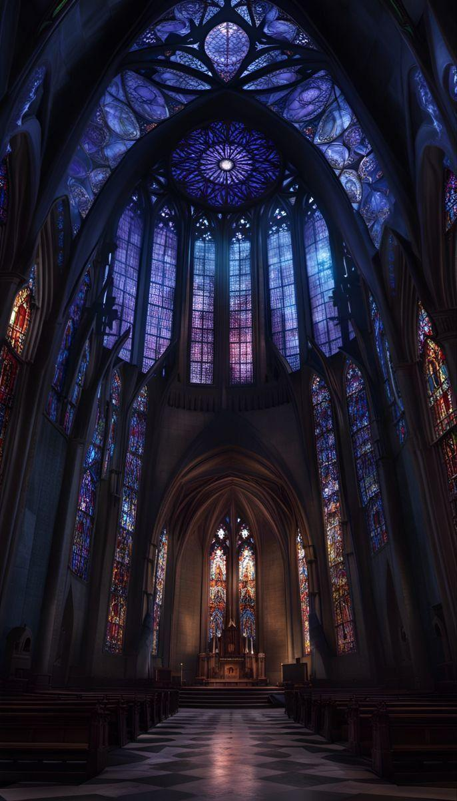

> 해당 이미지는 게임 기획 문서의 일부로 보이는 이미지입니다. 

이미지 중앙에는 커다란 아치형의 공간이 있고 그 안쪽 바닥에는 중앙 통로가 존재합니다. 중앙 통로의 좌측과 우측에는 나무로 만들어진 의자들이 일정한 간격으로 배치되어 있습니다. 

중앙 통로를 따라 앞으로 나아가면, 그 앞에는 높은 받침대 위에 특정한 물건이 놓여져 있는 것이 보입니다. 높은 받침대 앞쪽에는 사람의 형상이 그려진 스테인드글라스가 3개 보입니다. 

중앙에 위치한 아치형 공간의 상단에는 커다란 스테인드글라스가 원형으로 배치되어 있습니다. 그 아래로는 여러개의 커다란 직사각형 모양의 스테인드글라스가 일정한 간격으로 배치되어 있습니다. 

또한, 아치형 공간의 좌측과 우측에도 여러개의 스테인드글라스가 배치되어 있습니다. 스테인드글라스의 색깔은 주로 보라색과 남색, 그리고 노란색 등이 혼합되어 있습니다.

이미지 전반적으로 조명이 어둡게 처리되어 있어, 스테인드글라스의 색깔이 더욱 선명하게 돋보입니다.

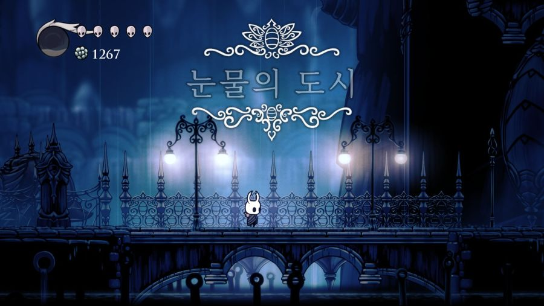

> 이미지는 게임의 한 장면으로, 눈물의 도시라는 곳을 배경으로 합니다. 화면 상단에는 여러 아이콘과 숫자가 표시되어 있습니다.

*   화면 상단 왼쪽에는 반달 모양의 아이콘과 1267이라는 숫자가 있습니다. 
*   화면 상단 중앙에는 흰색 선으로 그려진 장식품이 있고 그 아래에 눈물의 도시라는 뜻의 한글이 있습니다.
*   화면 중앙에는 작은 캐릭터가 서 있습니다. 
*   화면 중앙 하단에는 다리가 있고 그 밑으로는 어둡고 깊은 곳이 있습니다.

전체적으로 이 게임은 어둡고 신비로운 분위기를 가지고 있으며, 플레이어는 캐릭터를 조작하여 눈물의 도시를 탐험해야 할 것 같습니다.

---
