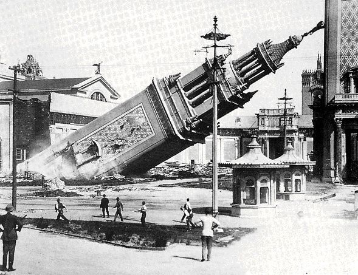
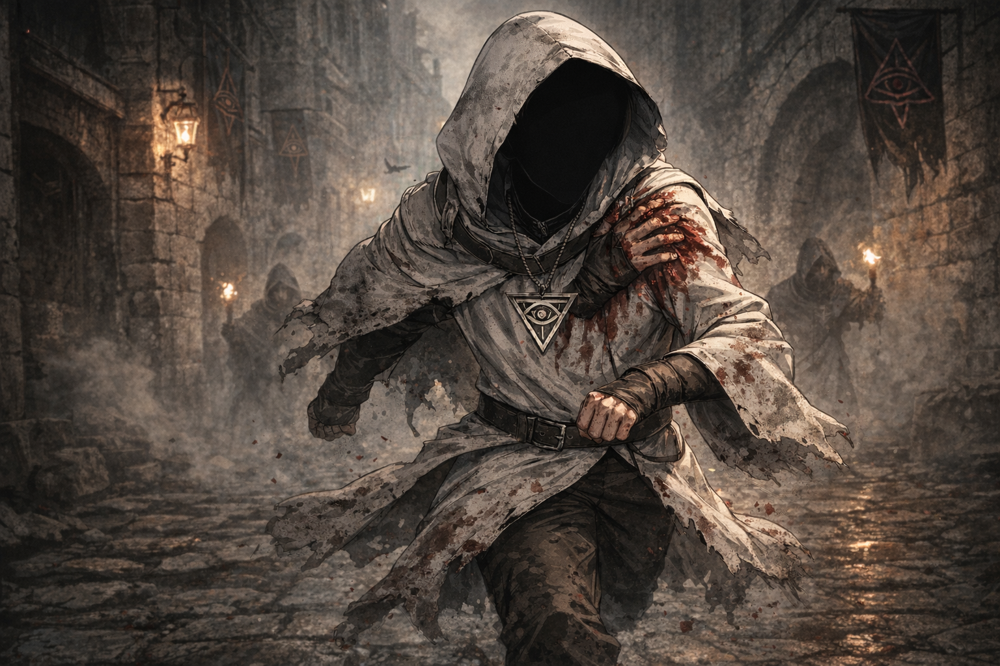
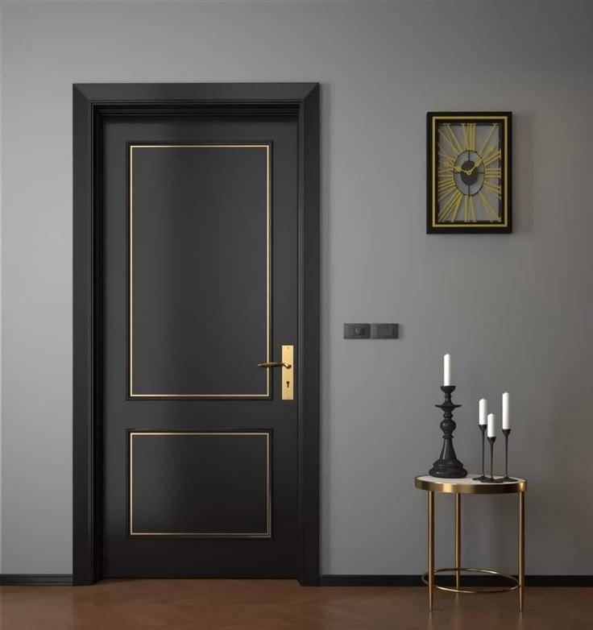
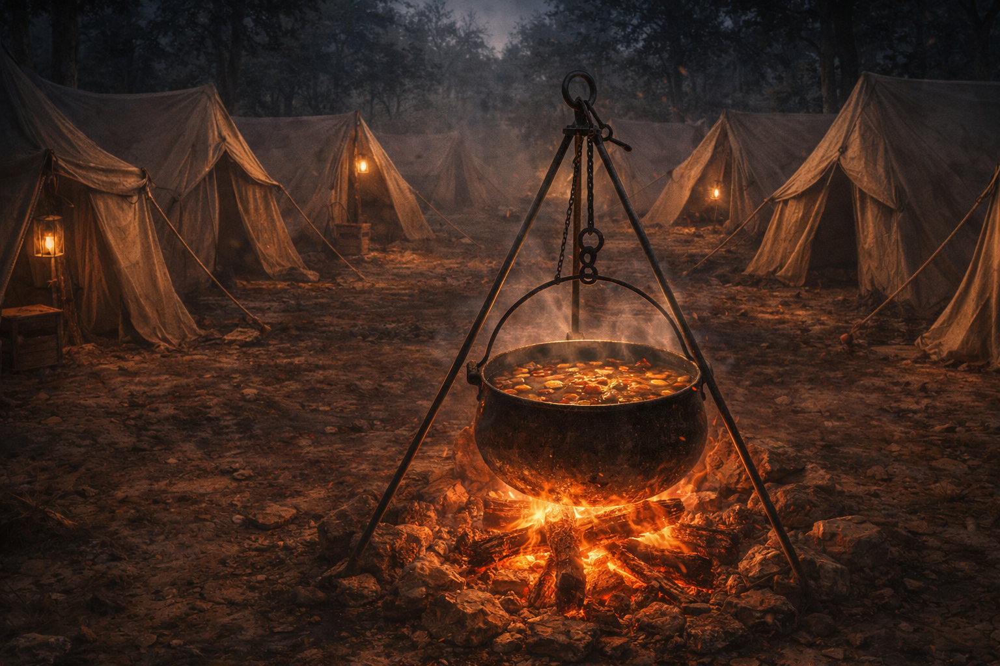
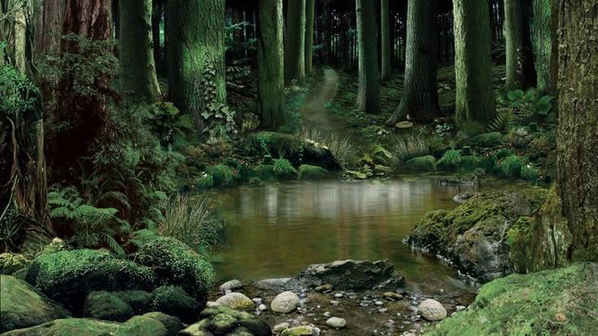
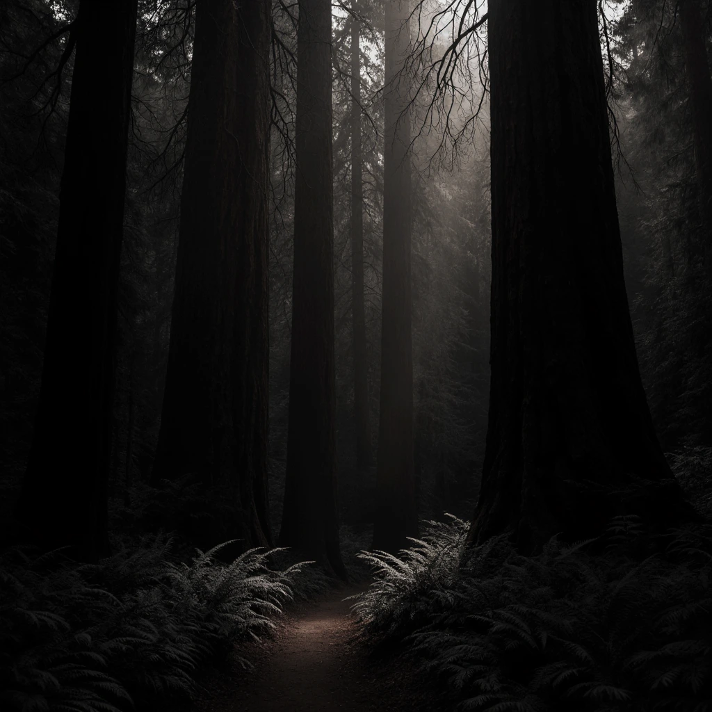

# 사건컨셉기획서_V0_장보성

## 슬라이드 1

사건 컨셉

Light life 202313190 장보성

---

## 슬라이드 2

사건 컨셉

**사건이란?**

  - 플레이어가 마주하는 사건 그 자체
  - 플레이어는 선택지에서 자신의 행동을 골라 결과를 얻는 이벤트
**한번 선택한 선택지는**

  - 리스크와 보상에 명확한 정보를 제공하고 유저가 선택하게 하게 해야함
  - 선택지에 리스크를 인지시키게 함으로 플레이어가 수용할 수 있게!
---

## 슬라이드 3

사건의 경험

**재미요소 및 경험 목표**

  - 선택을 통해 얻는 보상이 달라져 결과를 보는 재미
  - 전투에서의 피로도를 줄이는 조금 쉬어 가는 스테이지
  - 더 좋아 보이는 또는 자신이 원하는 선택지를 골라 결과를 보는 재미
  - 플레이어를 세계관에 몰입하게 만드는 장치임
플레이어가 선택하는 것이 정답!

  - 플레이 스타일에 따라 선택이 달라짐
  - 현재 상황에 따라 보상의 가치가 달라짐
  - **전략적 선택 경험을 제공함!!!**
---

## 슬라이드 4

사건의 보상

사건읋 통해 얻을 수 있는 보상의 가치

  - 캐주얼 유저들은 큰 손해를 보는 것을 매우 싫어함(손실 회피 심리)
  - 사건 내의 보상은 확실한 성장을 이룰 수 있다 라는 선택지 간에 결과의 차이를 크게 두어야 한다.
보상내용은 임시일 뿐 데이터 테이블에서 관리한다.

#### 이번 보상 대박인데? 다 부숴버리겠다!

#### 보유한 세팅에 맞게

#### 이걸 선택해야지

---

## 슬라이드 5

사건의 주의점

사건을 제작할 때 고려해야 할 사항

  - 전투와 전혀 상관없는 퀴즈가 나오거나 운빨 테스트가 나오면 유저는 억까 당하는 불쾌감!!!
  - 유저가 사건 노드에서 간단한 선택으로 다음 전투를 이기기 위한 전략은 짜게하여 몰입도는 유지시켜야함!!
  - 사건내의 보상은 확실한 성장을 이룰 수 있다 라는 선택지 간에 보상 종류에 차이를 크게 둠
  - 선택을 통해 확률은 있어도 디버프만 얻는 경우는 없게 해야한다.
---

## 슬라이드 6

사건 선택

사건설명 어쩌구저쩌구 어쩌구저쩌구 어쩌구저쩌구 어쩌구저쩌구 어쩌구저쩌구 어쩌구저쩌구

행동1 어쩌구저쩌구 어쩌구저쩌구 어쩌구저쩌구 어쩌구저쩌구

행동1에 대한 효과 +20% 어쩌구저쩌구 어쩌구저쩌구 어쩌구저쩌구

행동1에 대한 효과 +20% 어쩌구저쩌구 어쩌구저쩌구 어쩌구저쩌구

행동1에 대한 효과 +20% 어쩌구저쩌구 어쩌구저쩌구 어쩌구저쩌구

뭐랑 관련 증강 3개 선택 어쩌구저쩌구 어쩌구저쩌구 어쩌구저쩌구

행동1에 대한 효과 +20% 어쩌구저쩌구 어쩌구저쩌구 어쩌구저쩌구

행동2 어쩌구저쩌구 어쩌구저쩌구 어쩌구저쩌구 어쩌구저쩌구

행동2에 대한 효과 +20% 어쩌구저쩌구 어쩌구저쩌구 어쩌구저쩌구

행동2에 대한 효과 +20% 어쩌구저쩌구 어쩌구저쩌구 어쩌구저쩌구

행동2에 대한 효과 +20% 어쩌구저쩌구 어쩌구저쩌구 어쩌구저쩌구

행동2에 대한 효과 +20% 어쩌구저쩌구 어쩌구저쩌구 어쩌구저쩌구

사건설명 어쩌구저쩌구 어쩌구저쩌구 어쩌구저쩌구 어쩌구저쩌구 어쩌구저쩌구 어쩌구저쩌구 어쩌구저

어쩌구저쩌구 어쩌구저쩌구 어쩌구저쩌구 어쩌구저

사건설명 어쩌구저쩌구 어쩌구저쩌구 어쩌구저쩌구 사건설명 어쩌구저쩌구 어쩌구저쩌구 어쩌구저쩌구 어쩌구저쩌구 어쩌구저쩌구 어쩌구저쩌구 어쩌구저

사건설명 어쩌구저쩌구 어쩌구저쩌구 어쩌구저쩌구 어쩌구저쩌구 어쩌구저쩌구 어쩌구저쩌구 어쩌구저

어쩌구저쩌구 어쩌구저쩌구 어쩌구저쩌구 어쩌구저

어쩌구저쩌구 어쩌구저쩌구 어쩌구저쩌구 어쩌구저

행동2에 대한 효과 +20% 어쩌구저쩌구 어쩌구저쩌구 어쩌구저쩌구

#### A

#### B

#### C

#### D

#### E

#### F

| 알파벳 | 이름 | 설명 |
| --- | --- | --- |
| A | 사건 제목 | 사건의 제목으로 간략한 사건 종류의 구분을 위함 |
| B | 사건 이미지 | 사건의 상황을 시각화해서  한눈에 파악할 수 있도록 함 |
| C | 사건 상세 내용 | 사건 내에 있는 사건의 내용 (상황)에 대한 내용 서술용 |
| D | 행동 선택 | 플레이어가 해당 사건에서 행할 행동의 선택지 |
| E | 효과 대상 아이콘 | 대상 사건 종류나  캐릭터의  아이콘으로 효과 적용 대상 표기 |
| F | 효과 설명 | 적용되는 효과의 설명을 표기하기 위함 |
| G | 스크롤 바 | 정보량이 많을 때 스크롤 바로 화면을 내릴 수 있게 하여 많은 양을 정보를 볼 수 있게 |

#### 현재 보유 캐릭터

#### 현재 보유 증강

---

## 슬라이드 7

사건 1 – 붕괴

상황

  - 멀리서 거대한 탑이 무너진다.
  - 어떻게 할까?
| 선택지 | 보상 |
| --- | --- |
| 안에 있는 물건을 훔친다. | 최대 체력 – N, 증강 +N , 캐릭터 사망 |
| 안에 있는 사람을 구한다. | 최대 체력 – N, 사건 1-1 출력 |
| 빨리 대피한다. | 코스트 증가 |

> 이 사진은 흑백 사진으로, 기울어진 탑의 모습을 담고 있습니다. 탑은 정교한 건축 양식으로 지어져 있으며, 사진 속에서는 파괴된 상태로 기울어져 있습니다. 

사진 중앙에 위치한 탑은 아래쪽으로 무너져 내리고 있으며, 그 주변에는 사람들이 걸어가고 있습니다. 탑의 무너짐으로 인해 먼지가 피어오르고 있습니다.

사진 왼쪽 하단에는 경찰로 추정되는 인물이 총을 들고 서 있고, 그 외 여러 명의 사람들이 길가에 서 있거나 걸어가고 있습니다. 

사진 오른쪽에는 작은 건축물이 있고, 그 뒤로는 여러 건축물이 자리 잡고 있습니다.

사진 속 거리에는 가로등이 보입니다. 

전체적으로 이 사진은 파괴된 탑과 그 주변의 혼란스러운 상황을 포착한 것으로 보입니다.

---

## 슬라이드 8

사건 1-1 붕괴

상황

  - 구해준 인물이 보상을 주겠다고 한다.
  - 무엇을 요구할까?
| 선택지 | 보상 |
| --- | --- |
| 증강을 교환하자 한다. | 증강 +N |
| 구해준 인물을 죽이고 물건을 훔친다. | 캐릭터 증강 +N, 캐릭터 사망 |
| 난 너를 가지고 싶어 | 캐릭터 보상 |

> 이 사진은 흑백 사진으로, 기울어진 탑의 모습입니다. 탑은 정교한 조각과 장식품으로 장식되어 있습니다. 탑의 바닥 부분은 부서진 벽과 잔해 더미에 박혀 있고, 상단 부분은 공중으로 솟아 있습니다. 사람들은 거리에서 이 장면을 보고 있습니다. 탑의 기울어진 모습과 그 주변의 파괴된 환경이 인상적입니다. 사진 속 사람들의 표정이나 행동은 보이지 않지만, 그들이 상황을 주시하고 있는 모습이 느껴집니다.

---

## 슬라이드 9

사건 2 - 도망치는 부상자

  - 상황
    - 도망치는 윤회 교단 복장의 부상자가 있다.
  - 어떻게 할까?
| 선택지 | 보상 |
| --- | --- |
| 직접 죽인다. | 캐릭터 증강 +N |
| 별을 쫓는 자에게 넘긴다. | 증강 +N |
| 도와준다. | 코스트 증가 |

> 이미지는 어둡고 으스스한 중세 느낌의 환경을 배경으로 한 일러스트레이션입니다. 

전경에는 얼굴이 보이지 않는 캐릭터가 있습니다. 이 캐릭터는 뒤집어쓴 후드를 쓴 머리와 눈 부분이 완전히 검은 실루엣으로 묘사되어 있습니다. 캐릭터는 회색의 더러워진 로브를 입고 있으며, 로브 곳곳에 피 얼룩이 보입니다. 로브 위에는 비슷한 모양의 금속 목걸이를 착용하고 있습니다. 허리에는 검은 벨트를 착용하고 있습니다. 오른팔에는 피가 흐르고 있으며, 왼팔은 팔꿈치까지 감싼 붕대를 하고 있습니다. 

배경에는 석조 건물의 어두운 복도가 보입니다. 벽에는 횃불이 걸려있고, 그 불빛이 어둡고 짙은 안개에 반사되어 희미하게 빛나고 있습니다. 뒤편의 인물들은 후드를 뒤집어쓴 모습으로 횃불을 들고 있습니다. 

오른쪽 벽면에는 피라미드와 눈을 상징하는 듯한 삼각형 모양의 깃발이 보입니다. 

전체적으로 이 일러스트레이션은 어둡고 긴장감이 넘치는 분위기를 연출하고 있습니다. 아마도 공포, 판타지 또는 미스터리한 상황을 표현한 것으로 보입니다.

---

## 슬라이드 10

사건  3 – 변화의 문

상황

  - 폐허가 된 길을 지나던 중, 길 한가운데에  수상한 검은 문 하나가 서 있다.
  - 들어온 발자국과 지나간 발자국이 달라 보인다.
  - 어떻게 할까?
| 선택지 | 보상 |
| --- | --- |
| 문으로 들어간다. | 캐릭터 보상, 전체 증강 +N |
| 문을 닫는다 | 캐릭터 증강 +N |

> 이미지는 방의 일부를 보여 주고 있습니다. 

왼쪽에는 검은색 문이 있고, 오른쪽에는 벽시계와 테이블이 있습니다.

*   **검은색 문**

    *   문은 검은색이며, 가로로 긴 직사각형 모양입니다.
    *   문의 왼쪽에는 금색 손잡이와 열쇠 구멍이 있습니다.
    *   문의 오른쪽에는 금색 선으로 테두리가 그려져 있습니다. 
    *   위쪽에는 긴 직사각형 모양으로 테두리가 있고, 아래에는 정사각형에 가까운 직사각형 모양으로 테두리가 있습니다.
*   **금색 벽시계**

    *   벽시계는 벽에 걸려 있습니다. 
    *   시계의 테두리는 검은색이고, 시계 바늘 및 숫자는 금색입니다.
    *   시계의 중심에는 동그라미 모양의 회전 가능한 부품이 있습니다. 
    *   시계 바늘은 12시와 1시 사이에 있습니다.
*   **테이블**

    *   테이블은 벽 오른쪽에 있습니다. 
    *   테이블의 다리는 금색이며, 테이블 위에는 금색 테두리가 있습니다.
    *   테이블 위에는 세 개의 흰색 촛불이 있는 두 개의 촛대와 하나의 촛불이 있는 하나의 촛대가 있습니다. 
    *   하나의 촛불이 있는 촛대는 비교적 크기가 크고, 세 개의 촛불이 있는 촛대는 크기가 작습니다.

---

## 슬라이드 11

사건  4 – 반가운 지원군

상황

  - 화난 듯한 별을 쫓는 자 무리가 있다.
  - 자신들이 선봉에 서겠다고 한다.
  - 물자를 좀 나눠 달라한다.
  - (후순위)다음 전투 시 전투의 흔적을 간단하게 남겨 주면 어떨까? (널부러져 있는 시체나 무기등 )
| 선택지 | 보상 |
| --- | --- |
| 물자를 일부 넘긴다. | 이후 척 전투 노드의 적 몬스터가 피해를 받고 시작 |
| 우리가 처리하겠다고 한다. | 코스트 N개 획득 |

> 해당 이미지에는 어떠한 텍스트 정보도 포함되어 있지 않습니다.

이미지는 음악 공연장이나 콘서트장에서 관객들이 열광하는 장면을 담고 있습니다. 

이미지의 구성 요소:

- 배경: 짙은 안개나 연기가 자욱한 공연장 내부의 흐릿한 배경
- 인물: 수많은 사람들의 손과 팔이 어둡게 실루엣 처리되어 보입니다. 
- 분위기: 짙은 안개, 어둡게 처리된 사람들의 실루엣, 열광하는 듯한 손동작이 공연장 내부의 열광적인 분위기를 강조합니다.

---

## 슬라이드 12

사건 5 - 수상한 야영지

상황

  - 모닥불이 있는 야영지를 발견했다.
  - 모닥불 위에 스프가 혼자 끓고 있다.
| 선택지 | 보상 |
| --- | --- |
| 스프를 몰래 마셔본다. | 캐릭터 증강 +N |
| 스프에 독을 넣는다. | 이후 척 전투 노드의 적 몬스터가 피해를 받고 시작 |
| 불을 더 키워 다 태워버린다. | 플레이어HP 감소  이후 척 전투 노드의  적 몬스터가 피해를 받고 시작 |

> 이미지는 야영지 풍경을 묘사하고 있습니다. 

이미지 중앙에는 커다란 화덕이 있고 그 위에 거대한 가마솥이 놓여 있습니다. 가마솥 안에는 음식이 요리되고 있는 것으로 보입니다. 가마솥은 철로 만들어진 것으로 추정되며, 그 아래에는 장작이 타오르고 있습니다. 

화덕과 가마솥의 뒤로는 여러 개의 천막이 줄지어 있습니다. 각 천막은 베이지색 또는 밝은 회색이며, 조명된 램프가 보입니다. 

이미지의 전반적인 색조는 따뜻하고 황금빛이며, 저녁 시간대를 암시하는 듯합니다. 나무가 우거진 숲속의 어둡고 짙은 분위기와 대조를 이룹니다. 

이미지에는 텍스트, UI 요소, 캐릭터 또는 아이콘이 포함되어 있지 않습니다.

---

## 슬라이드 13

사건 6 – 균형의 샘

상황

  - 예로부터 존재한 질서의 샘으로
  - 두 개의 강물이 한 곳에서 섞인다.
  - 물이 닿은 곳은 모든 것이 안정된다.
| 선택지 | 보상 |
| --- | --- |
| 다 같이 들어간다. | 캐릭터 증강 +N |
| 시험 삼아 한 명만 들어간다. | 증강 +N |
| 물을 담아간다. | 코스트 증가 |

> 이미지는 숲 속의 작은 시냇물을 보여 주고 있습니다. 

시냇물은 숲의 중심에 위치하고 있으며, 여러 개의 크고 작은 바위들과 자갈들이 물에 잠겨 있거나 물가에 흩어져 있습니다. 시냇물의 물은 맑고 깨끗해 보이며, 숲의 나무와 식물들이 반영되어 있습니다.

시냇물의 주변에는 크고 작은 나무들이 빽빽하게 자리 잡고 있습니다. 나무들은 주로 짙은 녹색의 잎을 가지고 있으며, 일부 나무는 이끼가 덮여 있습니다. 

바위와 나무들 사이로는 다양한 종류의 식물과 꽃들이 자라고 있습니다. 특히, 시냇물 주변에는 녹색의 식물들이 무성하게 자라고 있어, 자연 그대로의 아름다움을 보여 주고 있습니다.

이미지 전체적으로 자연의 평화로움과 아름다움을 강조하고 있습니다.

---

## 슬라이드 14

사건 7 – 왜곡된 심판

상황

  - 저울이 있는 단상 위에서 한 사람이 소리친다.
  - 이자는 윤회 교단을 오랫동안 근무했으나 개인을 위해 배신을 한 자입니다.
  - 이자를 죽일까요? 살릴까요?
| 선택지 | 보상 |
| --- | --- |
| 그자는 무죄다! | 아군 Hp일부 감소, 전체 증강 +N |
| 내가 처리하겠다! | 캐릭터 증강 +N |
| 심판의 저울이 기울었다. | 코스트 증가 |

> 이 사진은 어떤 게임의 컨셉 아트 또는 프로토 타입 화면으로 추정됩니다. 이미지는 흑백으로, 위에서 아래를 내려다보는 시점으로 묘사되어 있습니다. 

이미지 중앙에는 큰 석조 건축물이 있고, 그 앞에는 사람들이 북적입니다. 차량 한 대가 돌출된 부분에 주차되어 있고, 여러 사람들이 차량을 에워싸고 있습니다. 

이미지 왼쪽 하단에는 많은 사람들이 보이고, 오른쪽 하단에는 사람들이 조금 더 적은 모습입니다. 사람들마다 다양한 자세를 취하고 있습니다. 어떤 사람들은 서 있고, 어떤 사람들은 앉아 있습니다. 어떤 사람들은 손을 들고 있고, 어떤 사람들은 손을 내리고 있습니다. 

이미지 상단에는 더 많은 건물과 창문, 나무가 보입니다. 

이미지 중앙의 석조 건축물은 큰 돌로 만들어진 기둥과 벽으로 구성되어 있습니다. 기둥과 벽에는 작은 창문과 램프가 있습니다. 

이미지 오른쪽에는 나무가 심어져 있습니다. 나무는 커다란 화분에 심어져 있고, 그 옆에는 작은 벤치가 있습니다. 

이미지의 전반적인 분위기는 어둡고, 사람들의 움직임이 분주한 것으로 보아 사건이 발생한 후의 긴박한 상황을 표현한 것으로 추정됩니다.

---

## 슬라이드 15

사건 8 – 떨어진 별

상황

  - 밤하늘에 유난히 밝은 별이 떨어졌다.
  - 빛이 떨어진 장소에서 빛이 빛나고 있다.
| 선택지 | 보상 |
| --- | --- |
| 빛을 따라간다 | 코스트 증가 |
| 여기서 휴식을 취한다 | 전체 증강 +N |

> 이미지는 밤하늘에 운석이 떨어지는 듯한 풍경을 묘사하고 있습니다. 

이미지 중앙 상단에는 밝은 별똥별이 밤하늘에 나타나고 있습니다. 별똥별은 노란색과 흰색으로 이루어져 있으며, 별똥별에서 뻗어 나온 꼬리가 반원형으로 퍼져나가고 있습니다. 

이미지의 하단에는 강과 들판이 있고, 들판 너머로 마을과 교회 첨탑이 보입니다. 배경에는 어두운 산맥이 펼쳐져 있습니다.

전체적으로 고요하고 평화로운 밤하늘의 풍경을 그리고 있습니다.

---

## 슬라이드 16

사건 9 – 붕괴

상황

  - 밤길에서 작은 등불 하나가 흔들린다.
  - 등불 주변에는 발자국이 하나뿐이다.
| 선택지 | 보상 |
| --- | --- |
| 빛을 따라간다 | 전체 증강 +N |
| 빛을 조사한다 | 스킬 카드 등장 확률 선택 |
| 빛을 끈다 | 코스트 증가 |

> 이미지는 짙은 안개가 자욱한 숲을 묘사하고 있습니다. 여러 그루의 큰 나무가 줄지어 있고, 그 앞쪽으로 작은 식물이 깔려 있습니다. 나무 사이로 희미한 빛이 새어 들어오고 있습니다.

이미지에는 눈에 띄는 UI 요소나 아이콘, 캐릭터가 보이지 않습니다.

---

## 슬라이드 17

사건 10 – 멈추지 않는 행군

상황

  - 먼 거리에서 군세가 진격하는 소리가 들린다.
  - 군세가 옆을 지나간다.
| 선택지 | 보상 |
| --- | --- |
| 진격에 합류 | 스킬 카드 등장 확률 선택 |
| 독을 든 음식을 준다 | 이후 척 전투 노드의 적 몬스터 체력, 방어력 N% 감소 |

> 이미지는 눈이 내리는 전장에서 행진하는 군단의 모습을 묘사하고 있습니다. 이미지 중앙에는 녹색 갑옷을 입은 전사들이 줄을 지어 행진하고 있습니다. 이들의 갑옷은 금속성 재질로 만들어진 것으로 보이며, 어깨 부분에 날개 모양의 장식이 특징입니다. 

전사들은 방패를 들고 있으며, 일부는 깃발을 들고 있습니다. 깃발에는 흰색 십자가가 그려져 있습니다. 

배경에는 눈사태가 발생하고 있는 듯한 산이 보입니다. 눈사태로 인해 눈이 많이 쌓여 있고, 눈보라가 치고 있습니다. 

전사들은 전투를 준비하는 듯한 모습을 보여주고 있습니다. 이미지의 전반적인 분위기는 춥고 어둡습니다.

---
