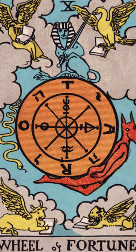
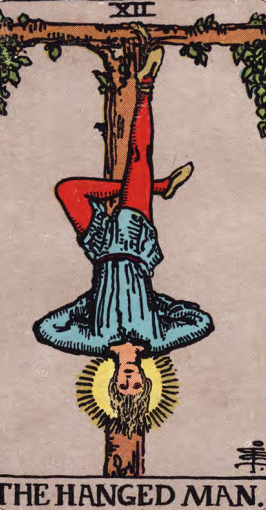
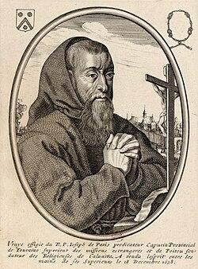
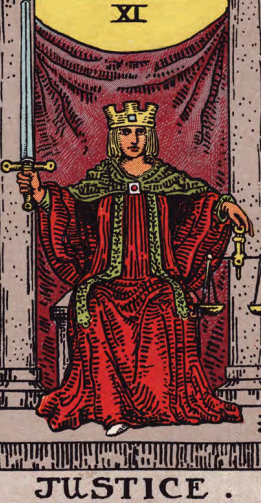
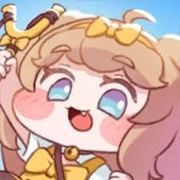

# 스토리세계관컨셉_V1_장보성

**세계관과 스토리 컨셉 기획서**

작성자: 장보성

Team: Light life

학번: 202313190

전화번호: 010-5617-3724

**내용**

**목차 **

## 문서 개요

게임내의 스토리 및 세계관을 지정하여 방향성, 컨셉 통일을 위함

## 세계관

**기획의도**

턴제 특성의 주인공의 선택을 운명을 깨부수는 캐릭터의 행동과 몰입할 수 있는 세계관

**시대적**

암흑기에서 > 르네상스 시대 14세기 인문주의로 변화되는 과정

**문화적**

군주제이지만 종교의 힘이 강한 세계 

운명의 교단이라는 종교 중심의 세계

불결한 운명을 정화한다라는 모순적인 교리로 살생을 서슴치 않는다.

**세계관 특징**

사람들은 각 각 자신만의 운명을 가지고 태어남

선천적으로  **Wheel Of Fortune, **Hangedman등 타로카드를 기반으로 권능을 지니고 있으며 권능의 세기는 경험에 따라 차이남

평상시에는 정방향효과의 권능을 사용하나 극한의 상황에 역방향의 권능을 사용할 수 있다.

**종족**

**	인간이 아닌 크리처 (판타지) 종족 또한 존재한다.**

**세력**

**아르카나**

교회와 황제가 통치하는 종교 국가이자 세계 그 자체 

운명의 교단

오랫동안 아르카나를 통치한 집단

운명에 따르는 것에 극도로 민감한 집단

꿈을 쫓는자

운명을 믿지 않거나 거부하며 자신의 꿈을 위해 살고 싶어하는 집단

**배경**** 스토리 (개발 내)**

아르카나라는 운명의 신이 모든 것에 운명을 지정하는 질서의 세계를 창조했다.

초반에는 운명의 교단으로 하나의 목표를 위해 각각의 운명을 짊어지며 (임시)200년간 번창했다.

하지만 태어날 때부터 자신의 운명을 타고난다는 사실에 일부 세력들은 반발하며 운명을 거부하기 시작했다.

이로 인해 점점 많은 변수로 인해 서서히 운명을 예측할 수 없게 되며 신앙이 점점 약해지며 운명을 믿지 않게 되었다.

운명의 교단은 Emperor의 권능으로 대다수의 국민을 복종시키는데 성공했으나 

더 많은 사람들이 자신의 운명에서 벗어나 혼돈에 빠지는 걸 막기 위해 **「****Judgment****」**의 지시의 따라 폭력으로 진압을 시도하다 실패하여 내전이 일어난 폭력으로 혼란스러운 상황

**이 세상의 주된 문제**

운명을 거부해 자유를 찾으려는 세력과 운명으로 질서를 유지하는 세력간의 내전

## 인게임 스토리

**시놉시스**

주인공은 운명이 정해진 세계를 부수려는 스토리

**활동**

개척

**스토리**

운명이라는 이유로 자신의 소중한 이들이 한순간에 죽임을 당했다. 

주인공은　복수를 위해 꿈을 쫓는자와 함께 The Emperor를 처리하러 갔다

주인공은 The Emperor의 권능으로 세뇌당해 자신의 손으로 동료를 죽임

조력자 Hangedman(꿈을 쫒는자)의 희생으로 주인공는 세뇌에서 풀려났을 때는 동료들이 학살당한 상황을 마주함

이 때 주인공은 절망하며 역방향의 능력을 발현시킴  

게임 시작!!!

결말 주인공 또한 아르카나를 빈사상태로 만들었으나 아르카나를 죽이면 운명의 권능이 모두 사라지며 조력자 또한 죽는다는 운명에 깨달음 

주인공은 조력자를 살리기 위해 권능으로 윤회를 다시하려 함

조력자는 주인공의 카드를 찢으면서 희생함(키스하거나 상관없음) 

주인공은 아르카나와 마지막 전투를 진행하며 승리함

조력자가 만들고 싶었던 세계를 바라보며 엔딩!

## 플레이 내의 스토리

**스토리**

운명이라는 이유로 자신의 소중한 이들이 한순간에 죽임을 당했다. 

주인공은　복수를 위해 꿈을 쫓는자와 함께 The Emperor를 처리하러 갔다

주인공은 The Emperor의 권능으로 세뇌당해 자신의 손으로 동료를 죽임

조력자 Hangedman(꿈을 쫒는자)의 희생으로 주인공는 세뇌에서 풀려났을 때는 동료들이 학살당한 상황을 마주함

이 때 주인공은 절망하며 역방향의 능력을 발현시킴  

게임 시작!!!

아르카나를 죽이면 운명의 권능이 모두 사라지며 조력자 또한 죽는다는 운명에 깨달음 

조력자는 주인공의 카드를 찢으면서 희생함(키스하거나 상관없음) 

주인공은 아르카나와 마지막 전투를 진행하며 승리함

## 주인공 Wheel Of Fortune 컨셉

> 해당 이미지는 타로카드 중 '운명의 바퀴 (Wheel of Fortune)' 카드입니다. 

### 이미지 상세 설명

- 배경: 
  - 타로카드의 배경은 하늘색이며, 구름이 회색으로 그려져 있습니다. 
  - 구름은 둥근 형태를 이루고 있습니다.

- 중앙:
  - 큰 주황색의 원이 중앙에 위치하고 있습니다. 
  - 원 안에는 여러 기호가 새겨져 있으며, 원의 중심에는 십자가가 내장된 원이 있습니다. 
  - 원의 바깥쪽에는 히브리어 또는 룬 문자가 원형으로 배치되어 있습니다.

- 상단:
  - 이집리시아 스타일의 스핑크스가 중앙에 그려져 있습니다. 
  - 스핑크스는 오른손에 막대를 들고 왼손에 책을 들고 있습니다. 
  - 스핑크스 위에는 날개를 펼친 채로 책을 물고 있는 두 마리의 노란색 새가 있습니다.

- 하단:
  - 중앙에는 붉은 악마의 손이 그려져 있으며, 바퀴를 돌리고 있는 모습입니다.
  - 악마의 손 아래에는 노란색 날개 달린 황소가 책을 물고 있습니다.

- 텍스트:
  - 카드 하단에는 'WHEEL of FORTUNE'이라는 문구가 검은색으로 표시되어 있습니다.

- 전체 구성:
  - 이미지는 신비로운 느낌을 주며, 운명과 변화, 순환을 상징하는 듯한 구도로 구성되어 있습니다.

**주인공(주인공 캐릭터)**

임시] 주인공은 운명이 정해진 세계를 부수려는 인물 

**키워드**

**Wheel Of Fortune**

**성격**

**능력**

운명의 교단에 모든걸 빼앗긴 주인공 

역방향의 능력으로 운명을 되돌릴 수 있다.

**주인공 목표 **

아르카나** **「THE WORLD」를 파괴하여
‘정해진 운명의 세계’대신 실존주의의 세계를 만들려 함

**인물간 관계**

아르카나** **「THE WORLD」를 파괴하여
‘정해진 운명의 세계’대신 실존주의의 세계를 만들려 함

## 조력자 Hangedman 컨셉

> 해당 이미지는 타로카드의 'The Hanged Man'을 묘사하고 있습니다.

### 이미지 상세 설명

*   **카드의 구성 요소:**  
    *   **나무:**  
        *   사람의 발이 묶여 있는 나무는 십자가 모양입니다.  
        *   나무 위쪽에는 로마 숫자 'XII'가 표시되어 있습니다.  
        *   나무에는 녹색 잎이 달린 덩굴이 걸쳐져 있습니다.  
    *   **인물:**  
        *   남자가 거꾸로 매달려 있습니다.  
        *   남성의 머리는 아래로 향하고 있으며, 눈은 반쯤 감긴 채로 평화로운 표정을 하고 있습니다.  
        *   남성의 머리를 중심으로 노란색 광선이 퍼져 나가고 있습니다.  
        *   남성은 하늘색 옷과 빨간색 바지를 입고 있습니다.  
        *   발목은 나무에 묶여 있습니다.  
    *   **텍스트:**  
        *   카드 하단에는 'THE HANGED MAN.'이라는 문구가 검은색 글씨로 적혀 있습니다.  
        *   카드 오른쪽 하단에는 작은 문신이 그려져 있습니다.  
    *   **배경:**  
        *   배경은 연한 회색이며, 질감이 종이처럼 느껴집니다.  

*   **시각적 레이아웃과 구조:**  
    *   이미지는 인물과 나무를 중심으로 구성되어 있습니다.  
    *   인물은 중앙에 위치하며, 나무는 가로로 길게 걸쳐져 있습니다.  
    *   카드의 제목은 하단에 배치되어 있습니다.  
    *   전체적으로 균형 잡힌 구도로 안정감을 줍니다.  

*   **아이콘과 그래픽 요소:**  
    *   로마 숫자 'XII'는 카드의 번호를 나타냅니다.  
    *   노란색 광선은 인물 주변에 퍼져 나가고 있어 신성함을 상징합니다.  
    *   녹색 잎이 달린 덩굴은 자연과 생명력을 상징할 수 있습니다.  
    *   인물과 나무의 구도는 희생과 헌신을 나타내는 아이콘으로 해석될 수 있습니다.  

*   **종합 설명:**  
    *   이 카드는 'The Hanged Man'으로, 전통적으로 희생, 새로운 관점, 인내를 상징합니다.  
    *   거꾸로 매달린 남성의 평화로운 표정은 현재의 상황을 받아들이고 있음을 나타냅니다.  
    *   이미지는 상징적이며, 고요하고 명상적인 분위기를 전달합니다.

**이름**

조력자(가명)

**성별**

**여성**

**특징**

희생하기전 조력자로서 주인공를 세뇌에서 풀어줌

어떻게든 죽는 캐릭터

주인공의 운명을 역방향으로 바꾸는데 영향을 주며 
자기자신을 주인공을 위해 희생함

내심 주인공을 좋아함 

결말: 자신이 만들고 싶었던 세계를 위해 스스로 희생함

 **Judgment의 여동생**

**키워드**

Hangedman

**게임 내 역할 **

튜토리얼 설명

주인공의 게임 진행 동기 제공

스토리의 로맨스

## 아군 캐릭터 The Fool 컨셉

> 이미지는 타로카드의 'THE FOOL' 카드를 묘사하고 있습니다.

*   이미지 상단에는 하늘이 노란색으로 그려져 있으며, 하단에는 바다가 그려져 있습니다. 
*   바다 위에는 바위가 있고, 바위 위에는 남자가 서 있습니다. 
*   남자는 꽃이 그려진 옷을 입고 있으며, 왼손에 꽃을 들고 있고, 오른손에는 막대를 들고 있습니다. 
*   남자의 머리 위에는 해가 있고, 해에서 햇살이 퍼지는 모습이 그려져 있습니다. 
*   남자의 옆에는 흰색의 개가 함께 서 있습니다. 
*   카드의 하단에는 'THE FOOL'이라는 텍스트가 있습니다.

**이름**

(가명)

**키워드**

**The Fool -> Temprance**

**특징**

정의를 우선시하는 바보 같은 성격

주변 인물에 따라 성장함

**목표 **

더 많은 정의를 세우며 더 많은 사람을 행복하게 만드는 것

**    캐릭터 변화**

정의롭지만 바보같은 상냥한 아이 > 새로운 시대를 이어나가는 성장한 영웅

**    전투 특징(임시)**

**성장하는 도화지: 파티에 포함된 캐릭터에 따라 디버프가 버프로 바뀌는 캐릭터**

**무모함: 방어력 디버프 -> 용맹함: 공격력 버프**

**서투름: 공방 디버프 -> 능숙한: 공방 버프**

**불안: 공격력 디버프 -> 신중함: **

**고집:  버프,디버프효과 약화 -> 끈기: **

**나약한: -> 이타적인: 캐릭터 생존시 아군 캐릭터 방어력버프**

**반항심: 버프 약화: **

## 아군 캐릭터 Death 컨셉

> 이미지는 타로카드 '죽음(Death)'을 묘사하고 있습니다. 

카드 하단에는 'DEATH'이라는 단어가 크게 새겨져 있습니다. 

카드를 구성하는 주요 요소는 다음과 같습니다.

* 중앙에 하얀색의 말과 기병이 묘사되어 있습니다. 기병은 갑옷을 입고 있으며, 손에는 기를 들고 있습니다. 기에는 'XIII'이라는 숫자와 꽃이 그려져 있습니다. 
* 기병의 왼쪽에는 여성이 태양을 안고 있는 모습이 그려져 있습니다. 여성은 노랗고 긴 옷을 입고 있습니다. 
* 기병의 오른쪽 하단에는 잘린 것으로 추정되는 신체 부위가 그려져 있습니다. 
* 카드의 배경에는 하늘이 그려져 있습니다. 

전체적으로 이 카드는 죽음과 변화를 상징하는 것으로 보입니다.

**이름**

(가명)

**키워드**

**Judgment**

**특징**

전 운명의 교단의 이단 심문관으로 많은 이들을 해치나 지속적으로 후회 및 회의감으로 흔들림

조력자의 오빠, 허밋 그레이스의 제자

조력자의 죽음으로 운명의 교단을 배신하게 됨

**목표 **

자신의 선택에 대한 탕감을 위해 운명의 교단을 무너트리려함

여동생의 복수 및 운명 개척

**    캐릭터 변화**

전 운명의 교단의 이단 심문관 > 

**    전투 특징(임시)**

**업보**: 해당 캐릭터의 **남은 체력에 비례해 공격력 증가**

무자비:  **공격한 적에게 피해량 증가**

## 아군 캐릭터 Judgment 컨셉

**이름**

(가명)

**키워드**

**Judgment**

**특징**

전 운명의 교단의 이단 심문관으로 많은 이들을 해치나 지속적으로 후회 및 회의감으로 흔들림

조력자의 오빠, 허밋 그레이스의 제자

조력자의 죽음으로 운명의 교단을 배신하게 됨

**목표 **

자신의 선택에 대한 탕감을 위해 운명의 교단을 무너트리려함

여동생의 복수 및 운명 개척

**    캐릭터 변화**

전 운명의 교단의 이단 심문관 > 

**    전투 특징(임시)**

**업보**: 해당 캐릭터의 **남은 체력에 비례해 공격력 증가**

무자비:  **공격한 적에게 피해량 증가**

## 아군 캐릭터 The Devil 컨셉

**이름**

(가명)

**키워드**

**The Devil**

**특징**

츤데레, 마음은 매우 여림, 티는 안 내려하지만 들어남

매우 선한 사람이나 **The Devil이라는 키워드로 인해 오랫동안 차별 받으며 삼**

**자유를 가져다 주는 것을 질서를 파괴하는 행위로 세간에 미움을 삼**

도덕적 반실재론을 따르는 탈옥수

**목표 **

모두에게 운명에 묶이지 않는 실존주의적 세계를 열기 위함

어린아이의 웃는 모습을 보기 위하여

**    전투 특징(임시)**

**본능**: 일정 체력이하의 적대적 NPC에 추가 데미지

**해방: 해당 캐릭터가 캐릭터(적,아군 상관 없이) 처치 시 공격력 증가**

## 적대적 NPC The Hermit 컨셉

**중간보스**

**이름**

허밋 그레이스

**키워드**

**중간보스: **「The Hermit」운둔자

잿빛 교황 (키포인트로 회색 추천)

**특징**

**오로지 아르카나의 번영만을 위한 그 외에는 아무것도 
관심이 없는 인물 어떤 것에도 흔들리지 않고 아르카나를 위한 결정만을 내리는 인물**

**Judgment를 진심으로 아낌**

**성격**

**냉철하며 직접 나서지 않으며 뒤에서 계속 지휘하는 흑막 같은 존재**

**전투 특징(임시)**

나만의 길: **버프, 디버프 면역효과 **

**업보**: 해당 캐릭터의 **남은 체력에 비례해 공격력 증가**

**사제관계: Judgment에 가하는 공격 디버프**

**(연출) 해당 캐릭터가 고독한 세상 효과 발동 시 일정 조건 달성 시 색상이 흑백으로 필터로 분위기 살림**

레퍼런스

> 이미지는 게임 기획 문서의 일부가 아닌, 17세기에 제작된 판화 작품입니다. 

이미지 중앙에는 큰 타원형 테두리 안에 수도승의 모습이 그려져 있습니다. 수도승은 긴 흰 수염과 짧은 머리를 가지고 있으며, 손가락을 꼬아서 기도하는 듯한 자세로 묘사되어 있습니다. 수도승의 뒤로는 마을 풍경이 그려져 있습니다. 

타원형 테두리의 왼쪽 상단에는 방패 모양의 문장학이 새겨져 있고, 오른쪽 상단에는 화환 모양의 도안이 있습니다. 이미지 하단에는 프란체스코 수사가 쓴 라틴어 문구가 적혀 있습니다. 

이미지에는 프란체스코 수사의 모습, 풍경, 다양한 도안과 문구 등이 포함되어 있습니다.

https://fr.wikipedia.org/wiki/Fran%C3%A7ois_Leclerc_du_Tremblay

## 적대적 NPC Justice 컨셉

> 이미지는 타로카드 중 'Justice' 카드를 묘사하고 있습니다. 카드는 정면을 향해 앉아 있는 왕을 보여주고 있습니다. 왕은 붉은색 옷과 녹색 금테로 장식된 망토를 입고 있으며, 왕관을 쓰고 있습니다. 왕의 왼손에는 저울이 들려져 있고, 오른손에는 검이 들려져 있습니다.

왕의 뒤로는 붉은색 커튼이 있고, 그 위에는 노란색 반달 모양의 영역에 로마 숫자 'XI'가 새겨져 있습니다. 왕의 아래에는 'JUSTICE'라는 단어가 영어로 적혀 있습니다.

이미지 중앙에는 왕이 앉아 있는 모습이 정면으로 그려져 있으며, 왕의 표정은 진중하고 엄숙해 보입니다. 전체적으로 이미지는 정의와 균형을 상징하는 타로카드 'Justice'의 전통적인 디자인을 따르고 있습니다.

**중간보스**

**이름**

**Justice**

**키워드**

**중간보스: **「**Justice**」정의

눈 가리개를 함

**특징**

**남의 죄를 판단하며 심판을 함**

**자신이 남에게 벌을 줄 자격이 있는지 회의감을 가짐**

**성격**

**기계와 같이 벌을 내림**

**전투 특징(임시)**

카르마: **플레이어가 지금까지 처치한 캐릭터 수 에 비례하여 공격력 증가**

**회의감**: 플레이어진영의 캐릭터에 피해가 발생할 때 마다  방어력 약화됨

## 적대적 NPC The Emperor 컨셉

> 해당 이미지는 타로카드 "The Emperor" 입니다. 

*   이미지 상단 중앙에는 로마 숫자 $\rm \small IV$가 있습니다.
*   이미지 중앙에는 왕좌에 앉아 있는 황제(Emperor)가 있습니다. 
    *   황제는 길고 흰 수염과 머리카락을 가지고 있습니다. 
    *   황제는 붉은색 옷을 입고 왼쪽에는 노란색 손잡이의 검이 있습니다. 
    *   황제는 금색 왕관을 쓰고 있습니다. 
*   이미지 하단에는 "THE EMPEROR"이라는 문구가 있습니다. 
*   이미지의 배경은 주황색입니다. 
*   왕좌의 등받이에는 노란색과 주황색 꽃이 그려져 있습니다. 
*   왕좌의 팔걸이에는 흰색 두 마리의 숫양 머리가 새겨져 있습니다. 
*   황제는 왼쪽에 손잡이가 있는 노란색의 긴 막대를 들고 있습니다. 
*   황제의 왼쪽 다리 아래에는 검이 십자가 모양으로 교차되어 있습니다.

**이름**

루트비히 칸트(임시)

**키워드**

**중간보스: 「The Emperor」**

질서를 가장 중시하며 운명에 따르는 게 가장 중요하다 생각함

**전투 특징(임시)**

나를 따라라: 플레이어 파티의 캐릭터를 일정 턴 동안 몬스터로 바꿈

체계화된 조직: 생존한 몬스터 수에 비례해 버프

고집: 버프,디버프효과 감소

## 적대적 NPC THE WORLD 컨셉

**이름**

아르카나

**키워드**

**최종 보스: 「THE WORLD」**

아르카나 세계 그 자체

모든 윤회를 관장하는 존재

최종 보스를 클리어하며 이전 운명으로 결정되는 세계를 부숴 신세계의 제작 가능성을 만드는 엔딩으로 사용하기 적합함

**전투 특징(임시)**

카드 덱 자체를 재구성

윤회로 전 보스나 스킬등의 공격 수단으로 사용

주인공의 과거 선택을 재현

## 캐릭터 관계도

**캐릭터간의 관계성을 부여해 세계관 몰입도, 캐릭터의 깊이 및 약점 공략법 추가로 가벼운 전략요소 **

## 스토리 컨셉 방향성

**유연한 스토리 컨셉**

**캐릭터의 수의 조절을 위해 캐릭터 일부가 사라져도 어색하지 않게 각 캐릭터는 개별적 스토리 및 개인의 신념을 독립적으로 분리함**

**금지된 톤**

**너무 가벼운 유치 찬란한 분위기 금지!!!**

> 해당 이미지에는 게임 캐릭터의 얼굴이 그려져 있습니다. 

*   캐릭터의 눈은 크고 반짝이며, 밝은 하늘색과 보라색으로 그라데이션을 준 것이 특징입니다. 눈동자는 하얀색입니다. 눈썹은 굵고 짧은 두 개의 선으로 표현되어 있습니다. 
*   캐릭터의 머리카락은 밝은 갈색이며, 귀엽고 작은 노란색 리본이 머리에 있습니다. 
*   캐릭터의 입은 크게 벌리고 있으며, 혀가 살짝 나와 있습니다. 볼은 분홍색으로 표현되어 있습니다. 
*   캐릭터의 머리를 장식하고 있는 노란색 뿔은 노란색과 갈색으로 이루어져 있습니다. 
*   배경은 밝은 하늘색이며, 캐릭터의 어깨와 귀걸이가 살짝 보입니다. 

전체적으로 이 캐릭터는 밝고 귀여운 이미지를 가지고 있습니다.

**후엥~세계관의 감정의 깊이가 부적절해요!**

**너무 고어, 인육 장기자랑 금지! 자세한 묘사는 금지!!!**

> 이미지는 게임 기획 문서의 일부로 보이는 일러스트입니다. 이미지 중앙에 서 있는 남성을 중심으로, 주변에 여러 캐릭터들이 배치되어 있습니다.

중앙의 남성:
- 중앙에 위치한 남성은 짙은 회색 머리를 가지고 있으며, 눈은 녹색입니다.
- 그는 탄띠가 있는 가죽 갑옷을 입고 있습니다.
- 남성의 가슴 부분에 붉은색의 타원형이 겹쳐져 있으며, 그 안에 하얀색의 한국어가 적혀 있습니다. 
- 텍스트: 안줄겁다

주변 캐릭터들:
- 왼쪽 하단:
  - 짙은 회색 머리와 눈을 가진 남성이 바닥에 웅크리고 앉아 있습니다. 
  - 그는 파란색 옷을 입고 있으며, 왼팔이 잘린 모습입니다.
- 왼쪽 상단:
  - 한쪽 눈을 가린 남성이 양손으로 긴 창을 들고 있습니다. 
  - 그는 회색 옷을 입고 있으며, 머리에는 붉은색 뿔이 달린 투구를 쓰고 있습니다.
- 오른쪽 하단:
  - 붉은 머리를 가진 남성이 무릎을 꿇고 앉아 있습니다. 
  - 그는 눈을 가리고 있으며, 입에서 피가 흘러나오고 있습니다. 
  - 남성은 회색 옷을 입고 있습니다.
- 오른쪽 상단:
  - 근육질의 남성이 오른팔을 들고 서 있습니다. 
  - 그는 회색 옷을 입고 있으며, 얼굴에 두툼한 흉터가 있습니다.

배경:
- 이미지 배경에는 돌로 만든 아치형 통로가 있습니다.
- 통로의 벽은 돌로 구성되어 있으며, 중앙에는 나무로 된 큰 문이 있습니다.
- 문의 상단에는 작은 사각형의 장식품이 있습니다.

이미지 전체적으로 게임의 분위기를 나타내는 듯한 느낌을 주고 있습니다. 캐릭터들의 표정과 자세는 긴장감이 느껴지며, 배경의 어두운 톤은 게임의 분위기를 강조하고 있습니다.

** 타겟층 고려 불필요한 갈등을 최소화**

**예외처리**

**슬프거나 캐릭터가 사망해도 됨 **

| 일시 | 작업자 | 변경 사항 |
| --- | --- | --- |
| 2026.01.28 | 장보성 | 세계관과 스토리 작업 시작 |
|  |  |  |
