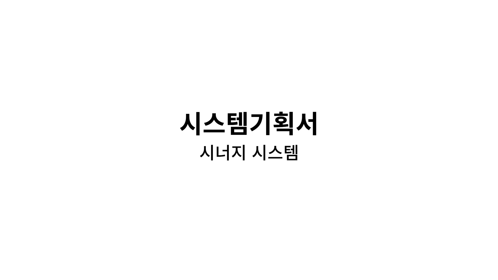
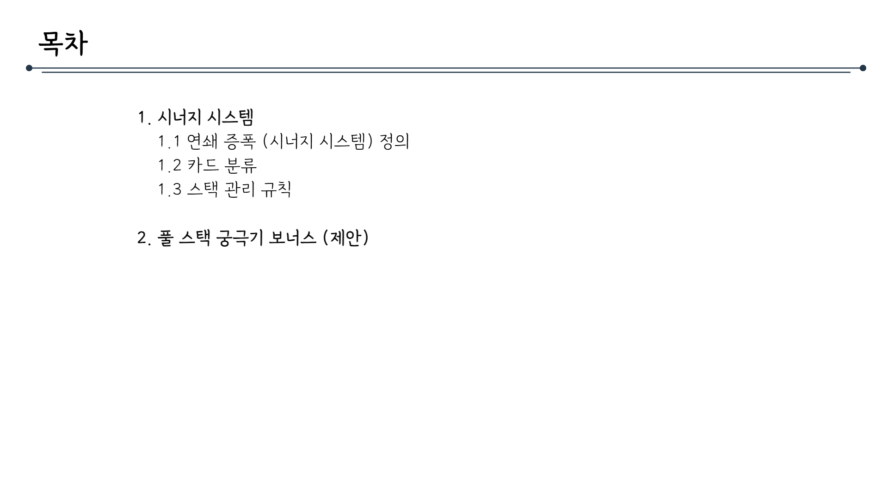
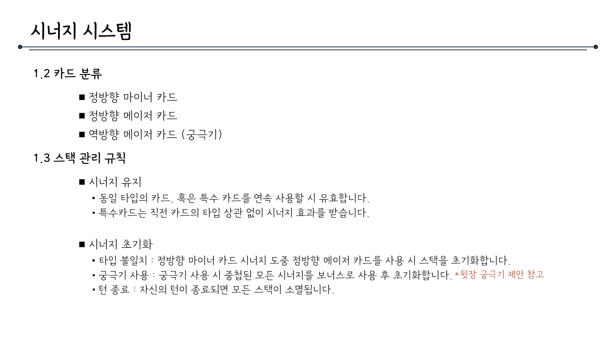

# 시너지시스템_V2_김주연

## 슬라이드 1

> 이 게임 기획 문서에는 다음과 같은 내용이 포함되어 있습니다.

*   **제목:** 시스템기획서
*   **부제목:** 시너지 시스템

문서의 레이아웃과 구조는 간단하고 명확합니다. 제목과 부제목이 중앙에 위치하며, 각각 한 줄씩 차지하고 있습니다. 제목과 부제목은 굵은 글씨로 표시되어 강조되었습니다.

문서에 포함된 시각적 요소는 없으며, 텍스트만 포함되어 있습니다.

---

## 슬라이드 2

> 해당 이미지는 게임 기획 문서의 일부로, 목차 페이지로 보입니다.

*   화면 상단 좌측에는 '목차'라는 타이틀 텍스트가 있고, 우측에는 긴 라인이 가로로 이어져 있습니다.
*   목차는 총 2개의 큰 카테고리로 나누어져 있습니다.
*   1번 항목은 '시너지 시스템'으로, 하위 항목으로 1.1 '연쇄 증폭 (시너지 시스템) 정의', 1.2 '카드 분류', 1.3 '스택 관리 규칙'이 있습니다.
*   2번 항목은 '풀스택 궁극기 보너스 (제안)'입니다.

전체적으로 간결하고 명확한 구조로 되어 있어, 게임의 핵심 시스템을 소개하는 문서의 목차로 적합해 보입니다.

---

## 슬라이드 3

> ## 이미지의 텍스트 설명

이미지에는 게임 기획 문서의 일부로 보이는 '시너지 시스템'이라는 제목의 섹션이 포함되어 있습니다. 

### 제목
- **시너지 시스템**: 이 제목은 게임 내의 새로운 시스템 또는 메커니즘을 소개하는 헤딩입니다.

### 부제목
- 직전에 사용한 카드에 따라 현재 사용하는 카드의 위력이 결정되는 연쇄 증폭 시스템입니다.

### 1.1 연쇄 증폭 정의
- **시너지 발동**: 
  - 직전 카드 타입과 현재 카드 타입이 일치할 경우 공격력 버프를 중첩합니다.
  - 증폭 수치는 퍼센트로 결정됩니다. (예: 중첩당 공격력 +n%) *합연산입니다.

- **스택 중첩 예시**:
  - 1회: 기본 대미지 (시너지 시작점)
  - 2회: n% 공격력 증가
  - 3회: 2n% 공격력 증가
  - 4회: 3n% 공격력 증가 (풀 스택)

### 추가 정보
- 시너지는 4회까지 중첩 가능하며, 턴이 변경되면 초기화됩니다.

### 레이아웃 및 구조
- **텍스트 레이아웃**: 
  - 제목과 부제목은 큰 글씨로 강조되어 있습니다.
  - 세부 설명은 글머리 기호(▪︎)로 구분되어 있습니다.
  - 리스트 형태의 정보는 순서가 번호로 표시되어 있습니다.
  - 추가 정보는 강조를 위해 주황색으로 표시되어 있습니다.

- **시각적 구조**:
  - 페이지 상단에 제목과 부제목이 있고, 하단에 세부 규칙과 예시가 나열되어 있습니다.
  - 페이지 하단에는 시너지 시스템의 한계와 조건에 대한 정보가 강조되어 있습니다.

### UI 요소
- **아이콘**: 이미지에는 아이콘은 포함되어 있지 않습니다.
- **다이어그램**: 포함되어 있지 않습니다.
- **차트**: 포함되어 있지 않습니다.

### 캐릭터
- 이미지에 캐릭터는 포함되어 있지 않습니다.

### 기타
- 이 섹션은 게임의 핵심 시스템 중 하나인 '시너지 시스템'에 대한 설명을 제공하고 있습니다. 
- 게임 내에서 카드의 사용 순서에 따라 공격력이 증가하는 메커니즘을 설명하고 있으며, 최대 4회까지 중첩이 가능하고 턴이 변경되면 효과가 초기화됨을 강조하고 있습니다.

---

## 슬라이드 4

> ## **시너지 시스템**

### **1.2 카드 분류**

*   정방향 마이너 카드
*   정방향 메이저 카드
*   역방향 메이저 카드 (궁극기)

### **1.3 스택 관리 규칙**

*   **시너지 유지**
    *   동일 타입의 카드, 혹은 특수 카드를 연속 사용할 시 유효합니다.
    *   특수카드는 직전 카드의 타입 상관 없이 시너지 효과를 받습니다.
*   **시너지 초기화**
    *   **타입 불일치**: 정방향 마이너 카드 시너지 도중 정방향 메이저 카드를 사용 시 스택을 초기화합니다.
    *   **궁극기 사용**: 궁극기 사용 시 중첩된 모든 시너지를 보너스로 사용 후 초기화합니다. \*뒷장 궁극기 제안 참고
    *   **턴 종료**: 자신의 턴이 종료되면 모든 스택이 소멸됩니다.

---

## 슬라이드 5

> 이미지는 게임 기획 문서의 일부로, "풀 스택 궁극기 보너스"에 대한 설명을 담고 있습니다. 문서의 구조와 내용을 상세히 분석해 보겠습니다.

### 레이아웃 및 구조
- **제목**: "풀 스택 궁극기 보너스"라는 제목이 중앙에 위치하며, 제목 오른쪽에는 작은 글씨로 *제안입니다.*라고 표시되어 있습니다.
- **분리선**: 제목 아래에 긴 수평선이 그어져 있어, 제목과 본문을 구분합니다.
- **본문**: 제목 아래에 설명 문단이 있고, 두 가지 주요 포인트가 bullet point로 나열되어 있습니다.

### 텍스트 내용
- **설명 문단**: 
  - "시너지가 최대 중첩 상태일 때, 역방향 궁극기를 사용하면 아래의 특수 효과를 발동합니다."
- **bullet point 1**: 
  - "화력 증폭"
  - "현재 시너지 보너스의 2배 수치를 대미지에 적용합니다."
- **bullet point 2**: 
  - "관통 효과"
  - "적의 방어력을 일정 수치 무시하는 효과를 부여합니다."

### 시각적 요소
- **아이콘**: 별다른 아이콘은 보이지 않으며, 텍스트 기반의 설명으로 구성되어 있습니다.
- **폰트**: 
  - 제목과 본문은 동일한 기본 폰트를 사용하며, 중요도에 따라 크기나 색상의 변화는 없습니다.
  - *제안입니다.* 부분만 빨간색으로 표시되어 강조하고 있습니다.

### 요약
이 문서는 게임에서 "풀 스택 궁극기 보너스" 기능에 대한 설명입니다. 특정 조건(시너지 최대 중첩 상태)에서 역방향 궁극기를 사용할 경우, 두 가지 특수 효과(화력 증폭, 관통 효과)가 발동된다고 설명하고 있습니다. 레이아웃은 깔끔하며, 텍스트가 주요 내용을 차지합니다.

---
