# 아트컨셉_V1_이채연

## 슬라이드 1

아트 컨셉

---

## 슬라이드 2

이 문서를 읽을 때..

모든 것은 수정될 수 있습니다.

궁금한 점이 있으면 언제든 담당자 이채연에게 연락 부탁드립니다. (새벽에도  OK )

이채연 010 2988 7090

---

## 슬라이드 3

1-1. 배경(초반)

#### 초반부에는 종교적 색체가 간접적으로만 드러남.

#### 좀 더 모험, 자연스러운 느낌

#### 전투 필드

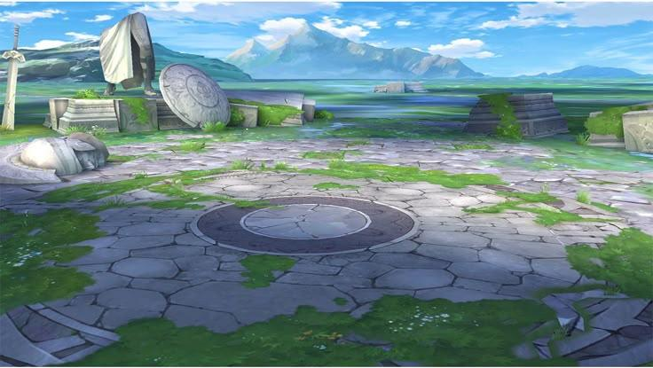

> 이미지는 게임의 한 장면을 묘사한 일러스트입니다. 

### 이미지의 구성 요소

1. **배경**: 
   - 배경에는 푸른 하늘이 흰 구름과 함께 펼쳐져 있습니다. 
   - 멀리서 보이는 산맥은 짙은 녹색과 회색조의 바위들로 구성되어 있습니다.

2. **주변 환경**: 
   - 바닥은 크고 불규칙한 돌들이 깔려 있으며, 곳곳에 녹색의 풀이 자라고 있습니다. 
   - 중앙에는 원형의 금속 뚜껑이 있는 구조물이 있습니다.

3. **물체들**: 
   - 왼쪽에는 큰 돌과 방패 모양의 돌이 세워져 있습니다. 
   - 방패 모양의 돌은 비스듬히 쓰러져 있습니다. 
   - 왼쪽 상단에는 검이 땅에 박혀 있습니다.

4. **구조물들**: 
   - 여러 개의 크고 작은 돌기둥과 돌 구조물들이 곳곳에 흩어져 있습니다.

5. **전체적인 분위기**: 
   - 평화롭고 신비로운 분위기를 주고 있습니다. 

### 요약
이미지는 게임의 한 장면을 묘사한 일러스트로, 신비롭고 평화로운 분위기를 가지고 있습니다.

> 이미지는 게임의 한 장면을 묘사한 일러스트입니다. 

신전과 같은 구조물이 있고, 그 앞에는 정원이 있습니다. 

구조물은 여러 개의 기둥으로 지지되고 있으며, 기둥에는 녹색의 덩굴이 감겨 있습니다. 

구조물의 지붕은 아치형으로 되어 있으며, 여러 개의 아치형 창문으로 구성되어 있습니다. 

구조물 앞 정원에는 여러 종류의 꽃과 나무가 심어져 있습니다. 

정원의 오른쪽에는 동상이 있습니다. 

구조물 오른쪽에는 더 큰 규모의 건축물이 있고, 그 뒤로는 나무들이 보입니다. 

하늘은 밝은 하늘색이며, 몇 개의 구름이 떠 있습니다. 

이미지에는 UI 요소나 아이콘, 캐릭터 등은 포함되어 있지 않습니다. 

이미지 중앙 하단에는 흰색 여백 공간이 있습니다. 

이미지는 게임의 세계관이나 분위기를 소개하기 위한 컨셉 아트일 가능성이 있습니다.

---

## 슬라이드 4

1-2 배경(후반)

#### 교단 건물(과할 정도로 종교적 색체 강함)

#### 최종 보스

#### 전투 배경

#### 2페이즈 (시계 깨지고 별하늘 보임)

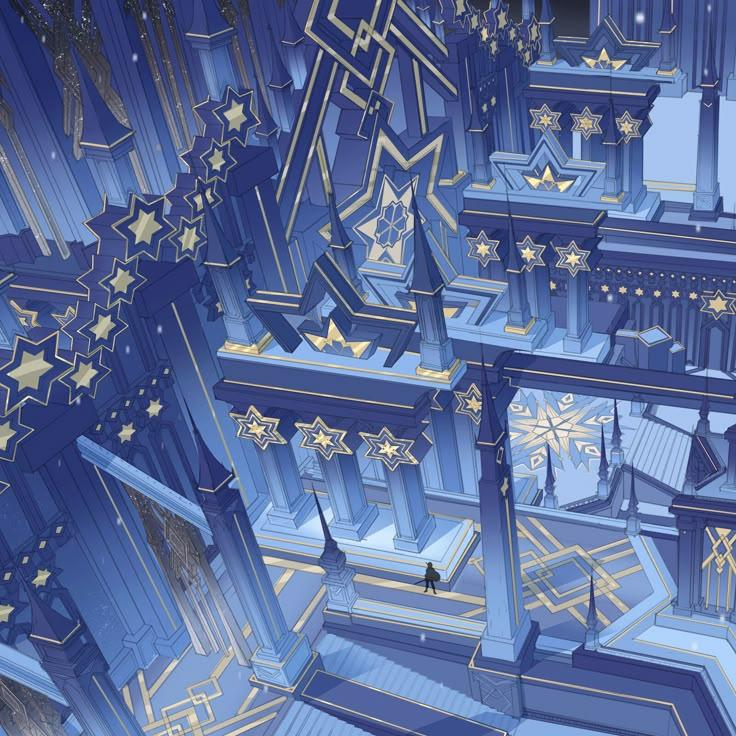

> 이미지는 게임 기획 문서의 일부로 보이는 일러스트레이션입니다. 이미지는 여러 층으로 구성된 복도와 방이 있는 궁전 내부의 모습을 담고 있습니다. 

## 이미지 레이아웃

이미지는 주로 짙은 파란색과 밝은 파란색으로 구성되어 있으며, 금색 액센트가 곳곳에 추가되어 있습니다. 이미지 중앙에는 여러 층으로 된 구조물이 있으며, 각 층은 기둥과 아치형 통로로 연결되어 있습니다. 

구조물의 벽과 바닥에는 금색 선과 별 모양의 장식이 있습니다. 

이미지의 왼쪽 상단에는 더 많은 별 모양의 장식과 기하학적 패턴이 있습니다.

이미지 중앙의 구조물 아래에는 작은 인물이 서 있습니다.

## 이미지 요소

*   **색상**: 짙은 파란색, 밝은 파란색, 금색
*   **장식**: 별 모양, 기하학적 패턴
*   **구조물**: 여러 층으로 된 복도와 방
*   **인물**: 이미지 중앙의 구조물 아래에 작은 인물이 서 있음

## 요약

이미지는 게임 기획 문서의 일부로 보이는 일러스트레이션입니다. 이미지는 여러 층으로 구성된 복도와 방이 있는 궁전 내부의 모습을 담고 있습니다. 이미지는 주로 짙은 파란색과 밝은 파란색으로 구성되어 있으며, 금색 액센트가 곳곳에 추가되어 있습니다. 이미지 중앙에는 여러 층으로 된 구조물이 있으며, 각 층은 기둥과 아치형 통로로 연결되어 있습니다. 구조물의 벽과 바닥에는 금색 선과 별 모양의 장식이 있습니다. 이미지 왼쪽 상단에는 더 많은 별 모양의 장식과 기하학적 패턴이 있습니다. 이미지 중앙의 구조물 아래에는 작은 인물이 서 있습니다.

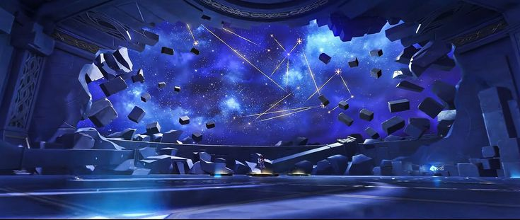

> 이미지는 게임의 한 장면을 보여 주고 있습니다. 

### 이미지의 레이아웃

이미지는 가로로 긴 직사각형의 구조로 되어 있습니다. 이미지의 상단에는 게임의 배경으로 추정되는 푸른색의 밤하늘과 별들이 보입니다. 

### 이미지의 구성 요소

*   밤하늘: 배경은 짙은 푸른색의 밤하늘을 연상시키며, 별들이 흩어져 있습니다. 별들은 노란색 선으로 연결되어 있어, 마치 별자리를 이루는 듯한 모습을 보여 줍니다.
*   무너진 벽: 이미지의 중앙에는 벽이 무너져 내리고 있습니다. 벽은 회색이며, 여러 개의 큰 돌 블록이 떨어지고 있습니다. 벽의 일부는 이미 무너져 내린 상태이며, 바닥에 떨어진 돌 블록들이 흩어져 있습니다.
*   캐릭터: 이미지의 중앙 바닥에 작은 캐릭터가 서 있습니다. 캐릭터는 짙은 보라색과 하얀색의 옷을 입고 있으며, 오른손에 무기를 들고 있습니다. 캐릭터의 모습은 선명하지 않지만, 게임의 주인공으로 추정됩니다.

### 이미지의 분위기

이미지는 게임의 한 장면을 보여 주고 있으며, 밤하늘과 무너진 벽의 모습으로 인해 긴박하고 위험한 상황을 연상시킵니다. 캐릭터의 존재는 게임의 주인공이 이 상황에서 무엇을 하고 있는지를 보여 줍니다. 

### 이미지의 목적

이미지는 게임의 한 장면을 보여 주어, 게임의 분위기와 상황을 전달하는 데 목적이 있습니다. 이미지의 구성 요소와 레이아웃은 게임의 세계관과 스토리를 표현하고 있습니다.

> 이미지는 게임 기획 문서의 일부로 보이는 이미지입니다. 이미지는 보라색과 푸른색 톤으로 이루어져 있으며, 시계와 기어, 톱니바퀴 등이 보이는 장면입니다.

이미지의 중앙에는 큰 원형 시계가 있습니다. 시계의 중심에는 하얀 빛이 있고, 시계 바깥에는 여러 개의 기어와 톱니바퀴가 있습니다. 시계의 오른쪽에는 작은 톱니바퀴가 있고, 왼쪽에는 기어가 있습니다. 시계의 위쪽과 아래쪽에는 복잡한 장식이 있습니다.

시계의 아래쪽에는 반사된 빛이 바닥에 비치고 있습니다. 바닥은 나무로 되어 있는 것 같습니다.

이미지 전체적으로 여러 개의 하얀 별이 흩어져 있습니다. 

이미지의 전반적인 분위기는 신비롭고 몽환적입니다.

---

## 슬라이드 5

2-1 아군 캐릭터

#### 서사, 특징이 잘 나타나는 아이템들.

#### 적대적 캐릭터보다 자유로운 색 구성.

#### 카드 형태에서는 배경 간략화

#### 명확히 나뉜 경계, 간결한 채색과 상징색(포인트)

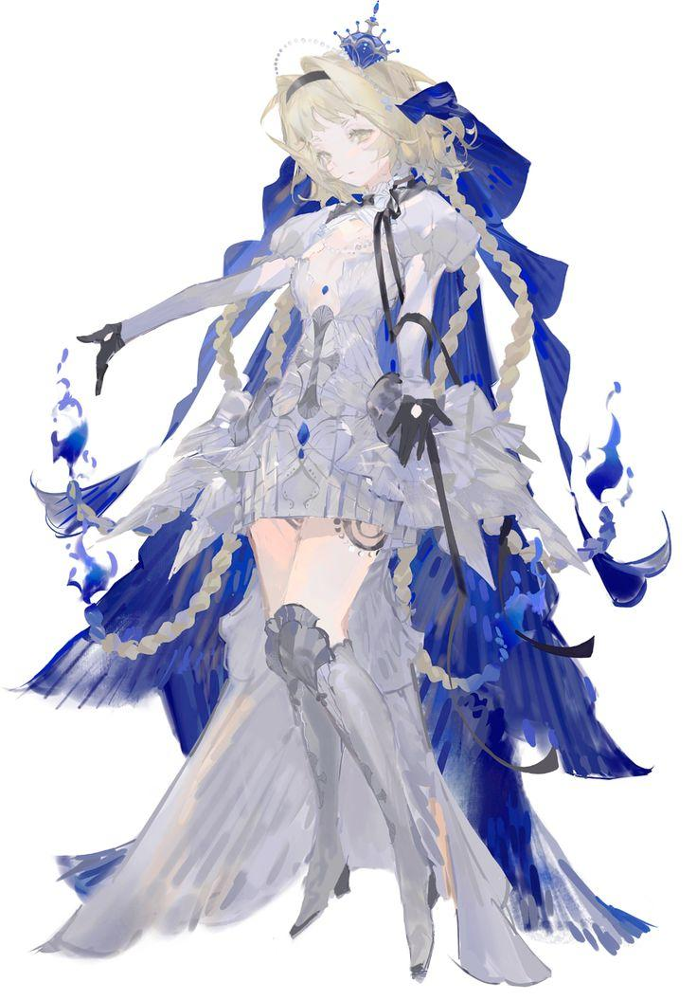

> 해당 이미지에는 게임 캐릭터가 그려져 있습니다. 

*   캐릭터의 생김새 

    *   캐릭터는 여성을 묘사하고 있습니다. 
    *   캐릭터의 머리는 금발이며, 귀는 뾰족한 편입니다. 눈동자는 녹색입니다. 
    *   이마에는 하얀 구슬로 이어진 머리띠를 착용하고 있습니다. 
    *   머리 위에는 왕관을 연상케 하는 푸른색 머리장식을 착용하고 있습니다. 
*   캐릭터의 의상 

    *   상의는 하얀색이며, 프릴이 여러 겹 겹쳐져 있습니다. 
    *   하의는 짧은 치마를 입고 있으며, 그 위로 길고 푸른색의 옷이 여러 가닥으로 갈라져 있습니다. 
    *   무릎까지 오는 높은 장갑을 착용하고 있습니다. 
    *   발에는 부츠를 착용하고 있습니다. 
*   캐릭터의 표현 

    *   캐릭터는 왼팔을 뻗고, 오른팔을 몸통에 붙인 채로 있습니다. 
    *   캐릭터의 몸과 옷 곳곳에는 푸른색 불꽃이 표현되어 있습니다. 
    *   캐릭터의 뒤에는 하얀색 배경이 있습니다.

> 이미지는 게임 캐릭터의 정보를 보여주는 화면입니다. 화면 상단에는 게임 캐릭터의 모습이 크게 그려져 있습니다. 이 캐릭터는 흰 머리와 짙은 구릿빛 피부색을 가지고 있습니다. 눈은 한쪽은 푸른색이고 다른 한쪽은 노란색입니다. 캐릭터는 흰색과 노란색의 화려한 옷을 입고 있으며, 양손에 노란색의 오브젝트를 들고 있습니다. 

화면 하단에는 캐릭터의 이름이 "Gavus"로 표시되어 있습니다. 캐릭터 이름 아래에는 세 개의 탭이 있습니다. 왼쪽 탭에는 "Chân dung", 가운데 탭에는 "Chuyện", 오른쪽 탭에는 "Phòng"이라는 문구가 적혀 있습니다. 

이미지 중앙에 위치한 캐릭터의 모습은 화려한 옷과 액세서리를 착용하고 있어 신성한 느낌을 줍니다. 배경에는 복잡한 무늬가 새겨진듯한 패턴이 있습니다.

> 이미지는 게임 캐릭터를 묘사한 것으로 보입니다. 

이미지 중앙에는 하얀색 긴 머리를 가진 캐릭터가 있습니다. 캐릭터는 녹색 눈을 가지고 있으며, 귀는 뾰족하게 표현되어 있습니다. 캐릭터는 하얀색과 하늘색의 옷을 입고 있으며, 옷에는 녹색과 금색의 장식이 있습니다. 캐릭터는 오른손에 무언가를 쥐고 있는 듯한 자세를 취하고 있으며, 왼손은 약간 구부린 채로 공중을 가리키는 듯한 자세를 취하고 있습니다. 

캐릭터의 뒤에는 노란색 배경에 무늬가 새겨져 있습니다. 무늬는 꽃과 잎사귀 모양으로 구성되어 있습니다. 이미지 하단에는 "THE FLORAL WONDER"라는 텍스트와 "SOLISE"라는 텍스트가 있습니다. 

이미지 전체적으로는 신비롭고 마법 같은 분위기를 연출하고 있습니다.

---

## 슬라이드 6

2-2. 아군 캐릭터

#### 전투 시

#### 4.5~5등신

#### 머리, 머리카락, 팔, 다리, 손목으로 파츠 분리

#### 파츠는 캐릭터 별로 추가되거나 삭제될 수 있음

#### 카드 형태에서는 LD

#### 라이브 2D 희망 (눈 깜빡이기 등..)

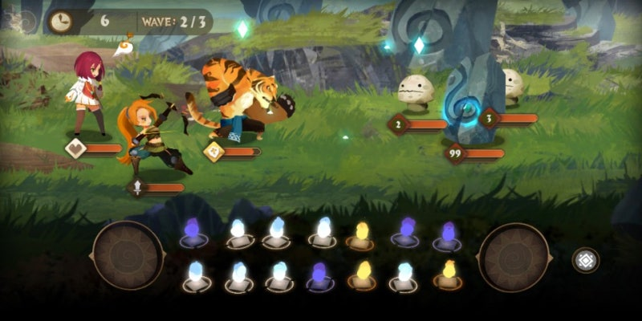

> 이미지 속 게임 화면은 두 명의 플레이어블 캐릭터와 두 마리의 몬스터가 대결하는 장면입니다.

상단 왼쪽에는 시계 모양의 아이콘과 숫자 6이 표시되어 있습니다. Wave: 2/3이라는 텍스트가 표시된 회색 막대가 있습니다.

두 명의 캐릭터가 보입니다. 

*   첫 번째 캐릭터는 분홍색 머리를 가진 여성 캐릭터이며, 흰색과 주황색 옷을 입고 있습니다. 
*   두 번째 캐릭터는 주황색 긴 머리를 가진 여성 캐릭터이며, 녹색과 파란색 옷을 입고 있습니다.

캐릭터 옆에는 각각 다이아몬드 아이콘이 있는 주황색 막대가 있습니다.

배경에는 큰 나무, 바위, 풀, 작은 동물 모양의 몬스터가 보입니다.

화면 하단에는 여러 가지 색깔의 보석이 보입니다.

*   왼쪽과 오른쪽에 각각 큰 원형 버튼이 있습니다. 
*   가운데에는 여러 가지 색깔의 보석이 일렬로 나열되어 있습니다. 
*   오른쪽 하단에는 네모 격자 모양의 아이콘이 있습니다.

전체적으로 이 게임은 전략적 요소가 포함된 RPG로 보입니다. 캐릭터와 몬스터가 전투를 벌이고 있으며, 플레이어는 다양한 스킬과 전략을 사용하여 전투에서 승리해야 합니다.

> 이미지는 게임 캐릭터의 정보를 보여주는 UI 화면입니다. 화면 중앙에는 한 캐릭터의 일러스트가 크게 그려져 있습니다. 캐릭터는 짙은 피부색을 가진 남성으로, 긴 하얀 머리카락을 가지고 있습니다. 그는 흰색과 노란색이 주조인 화려한 옷을 입고 있습니다. 그의 앞뒤로 노란색과 흰색의 천이 펼쳐져 있습니다. 그의 양손에는 노란색으로 빛나는 구체가 각각 떠 있습니다. 

그의 옷에는 여러 개의 노란색과 파란색의 장식품이 달려 있습니다. 그의 발 아래에는 연기가 나고 있습니다. 

일러스트 아래에는 캐릭터의 이름이 적혀 있습니다. 텍스트는 "Thủ Hộ Trật Tự Gavus"이며, 한국어로는 "질서 수호자 가버스"로 번역됩니다.

화면 하단에는 세 개의 탭이 있습니다. 왼쪽부터 순서대로 "Chân dung", "Chuyện", "Phòng"이며, 한국어로는 각각 "정보", "이야기", "방"으로 번역됩니다. 

전체적으로 이 화면은 게임 내에서 캐릭터에 대한 정보를 제공하거나, 캐릭터를 관리하는 용도로 사용되는 것으로 보입니다.

> 해당 이미지는 게임의 한 장면입니다. 

### 이미지 레이아웃

이미지 상단에는 라운드 정보가 표시되어 있습니다. 라운드:1/1, 1/20으로 표시되어 있습니다. 

이미지 상단 중앙에는 체력 표시 줄이 있습니다. 

이미지 상단 오른쪽에는 설정, 메뉴 버튼이 있습니다.

이미지 왼쪽 상단에는 검색창이 있습니다.

### 게임 화면

게임 화면에는 여러 캐릭터와 몬스터가 등장합니다.

*   큰 검은 고양이 모양의 몬스터가 가운데 있습니다. 
*   고양이 주변에 작은 몬스터 3개가 있습니다. 
*   고양이 모양의 몬스터 오른쪽에 2명의 여성 캐릭터가 있습니다. 
*   고양이 모양의 몬스터 왼쪽에 1개의 고양이 모양의 몬스터가 더 있습니다.

### 스킬 아이콘

화면 하단에는 5개의 스킬 아이콘이 있습니다. 각 아이콘은 서로 다른 스킬을 나타냅니다. 스킬 아이콘에는 각기 다른 그림이 그려져 있습니다.

*   첫 번째 스킬 아이콘은 달과 별이 그려져 있습니다. 
*   두 번째 스킬 아이콘은 공격하는 모습이 그려져 있습니다. 
*   세 번째 스킬 아이콘은 공격하는 모습이 그려져 있습니다. 
*   네 번째 스킬 아이콘은 공격하는 모습이 그려져 있습니다. 
*   다섯 번째 스킬 아이콘은 공격하는 모습이 그려져 있습니다.

각 스킬 아이콘 아래에는 "Attack"이라는 단어가 적혀 있습니다.

---

## 슬라이드 7

3-1 적군 캐릭터(보스)

#### 종교적 포인트가 강렬한 디자인

#### 같은 집단이라는 것이 나타나는 요소가 있으면 됨.

#### 카드 형태에서는 배경 간략화

#### 명확히 나뉜 경계, 간결한 채색과 상징색(포인트)

> 이미지는 게임 캐릭터 '조흐라'의 일러스트입니다. 

### 이미지의 레이아웃 및 구조

*   이미지 중앙에는 여성 캐릭터가 있습니다. 
*   여성 캐릭터의 오른쪽에는 노란색 테두리가 있는 보라색의 나선형 무늬가 그려져 있습니다. 
*   여성 캐릭터의 왼쪽에는 노란색 테두리가 있는 보라색의 나선형 무늬가 그려져 있습니다. 
*   이미지의 하단에는 '스텔라 라디언스 조흐라'라는 문구가 있습니다. 
*   이미지의 배경에는 노란색 바탕에 무늬가 그려져 있습니다.

### 이미지의 상세한 설명

*   여성 캐릭터의 머리는 흰색이며, 머리를 묶은 모습입니다. 
*   여성 캐릭터의 눈은 감긴 모습입니다. 
*   여성 캐릭터는 귀고리를 착용하고 있습니다. 
*   여성 캐릭터는 푸른색과 하얀색의 긴 드레스를 입고 있습니다. 
*   여성 캐릭터는 오른손에 액세서리를 착용하고 있습니다. 
*   여성 캐릭터의 뒤에는 날개가 그려져 있습니다. 
*   여성 캐릭터의 뒤에는 커다란 보라색의 나선형 무늬가 있습니다. 
*   여성 캐릭터의 주변에는 노란색의 별 모양이 여러 개 그려져 있습니다. 
*   여성 캐릭터의 하단에는 'STELLAR RADIANCE'와 'ZOHRA'라는 문구가 있습니다. 
*   이미지의 배경에는 노란색 바탕에 무늬가 그려져 있습니다. 
*   이미지의 테두리에는 노란색의 장식적인 테두리가 있습니다. 
*   이미지의 상단에는 노란색의 별 모양이 여러 개 그려져 있습니다. 
*   이미지의 하단에는 노란색의 장식적인 테두리가 있습니다.

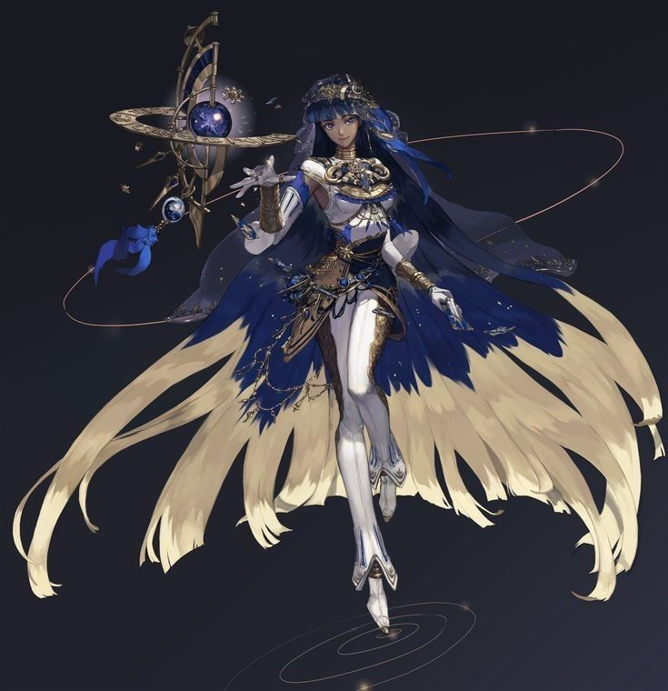

> 이미지 중앙에는 여성 캐릭터가 위치하고 있습니다. 여성 캐릭터는 긴 검은 머리를 가지고 있으며, 그녀의 앞머리는 파란색입니다. 그녀는 하얀색과 금색으로 장식된 갑옷과 같은 옷을 입고 있습니다. 그녀의 옷은 상의와 하의가 분리되어 있고, 그 사이로 하얀색의 허벅지가 노출되어 있습니다. 옷의 형태는 마치 춤을 추는 듯한 모양으로 디자인되어 있습니다. 그녀의 옷은 검은색과 하얀색, 그리고 금색으로 이루어져 있으며, 옷의 가장자리는 깃털처럼 길게 뻗어져 있습니다. 그녀의 왼쪽에는 크고 작은 구체가 달린 금속 막대가 있습니다. 구체는 푸른색이며, 그 구체를 중심으로 금속 막대가 여러 개 달려있습니다. 막대 뒤에는 파란색 리본이 묶여있습니다. 캐릭터의 뒤에는 여러 개의 가는 금색 선이 원을 그리며 퍼져나가고 있습니다. 배경은 검은색입니다.

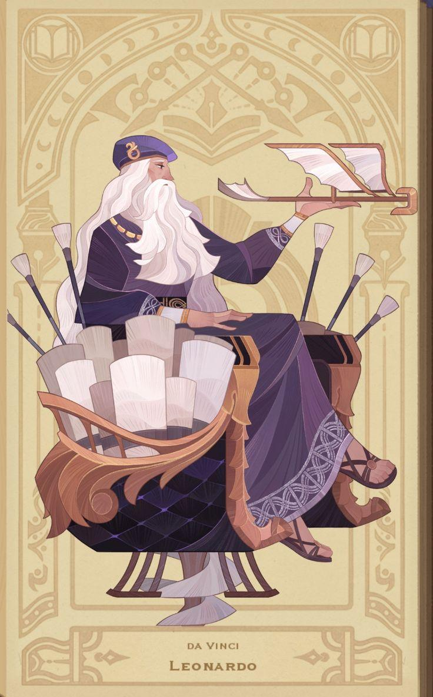

> 이미지는 레오나르도 다 빈치의 일러스트입니다.

*   이미지 중앙에는 화가가 등장합니다. 남성의 머리는 흰색이며, 눈은 감긴 상태입니다. 남성은 보라색 모자를 쓰고 있으며, 모자에는 금색 장식이 있습니다. 남성의 옷은 보라색이며, 옷에는 금색 장식이 있습니다. 남성의 왼쪽에는 여러 개의 붓이 뒤로 젖혀져 있습니다. 남성의 오른쪽에는 비행기 날개가 있습니다. 남성은 비행기 날개를 잡고 있습니다. 
*   이미지 하단에는 "DA VINCI LEONARDO"라는 문구가 있습니다.
*   이미지 배경에는 노란색 바탕에 다양한 문양이 있습니다.

---

## 슬라이드 8

3-2. 적군 캐릭터

#### 전투 시

#### 4.5~5등신

#### 머리, 머리카락, 팔, 다리, 손목으로 파츠 분리

#### 파츠는 캐릭터 별로 추가되거나 삭제될 수 있음

#### 마이너 아르카나 컨셉

#### 잡 몬스터는 디자인 간결하게.

#### 사물 기반 크리쳐 추천!

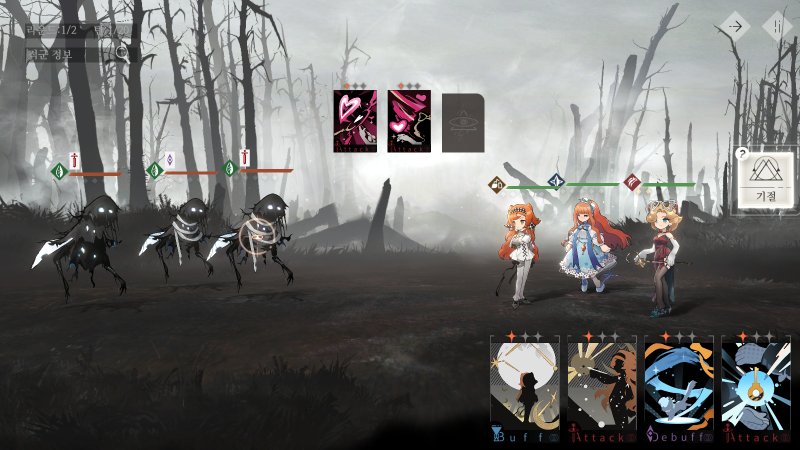

> 이미지는 게임의 전투 화면으로 추정됩니다. 화면은 두 팀으로 나뉘어져 있습니다. 

왼쪽 팀은 몬스터 3마리이며, 오른쪽 팀은 3명의 캐릭터가 있습니다. 

각 팀은 녹색과 주황색의 수평선이 있고, 다이아몬드 아이콘이 있습니다. 

아이콘은 각각 녹색, 흰색, 보라색, 빨간색입니다. 

화면 상단에는 두 개의 카드가 있고, 화면 하단에는 4개의 아이콘이 있습니다.

화면 상단 왼쪽에는 '1/2'과 '턴 종료' 버튼이 있습니다. 

오른쪽 상단에는 흰색 네모 안에 삼각형이 2개 겹쳐진 아이콘과 '?' 아이콘이 있습니다.

화면 왼쪽 하단에는 다음과 같은 문구가 적혀있는 아이콘이 있습니다.

*   버프 
*   공격 
*   디버프 
*   공격 

각 아이콘은 서로 다른 색상과 디자인을 가지고 있습니다.

캐릭터와 몬스터는 각자 다른 외형을 가지고 있습니다. 

배경은 어둡고, 나무가 많이 죽어있는 숲으로 묘사되어 있습니다.

> 해당 이미지에는 게임 캐릭터가 그려져 있습니다. 

### 이미지 레이아웃 

* 배경: 연한 하늘색 배경에 금색, 파란색, 흰색 등을 사용하는 일러스트입니다.
* 중앙에 큰 달과 날개를 펼친 채로 달을 등지고 있는 새가 그려져 있습니다.
* 새의 날개는 검은색이며, 별이 흩뿌려져 있습니다. 
* 새의 몸과 날개는 여러 개의 구체로 연결되어 있습니다. 
* 구체는 크기가 다양하며, 금색과 파란색 등이 섞여 있습니다.
* 새의 머리 부분에는 날카로운 금속 조각이 여러 개 달려 있습니다. 
* 머리 부분에는 보석이 박혀 있습니다. 
* 왼쪽 상단에는 "KAKA 151111 RIAN"이라는 문구가 있습니다. 
* 별 모양의 무늬가 여럿 그려져 있습니다. 

### 이미지 내용 

* 게임 캐릭터
* 달
* 새
* 구체
* 금속 조각
* 보석
* 별

### 이미지 분위기 

* 신비로운
* 화려한
* 미래 지향적인

### 이미지 용도 

* 게임 캐릭터 디자인
* 게임 컨셉 아트
* 일러스트레이션

### 요약 

이 이미지는 게임 캐릭터를 묘사한 일러스트입니다. 새의 날개와 몸이 여러 개의 구체로 연결되어 있고, 머리 부분에는 날카로운 금속 조각이 달려 있습니다. 배경에는 달과 별이 그려져 있습니다. 이미지의 분위기는 신비롭고 화려하며, 미래 지향적인 느낌을 줍니다.

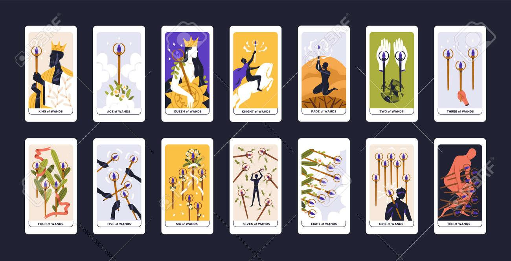

> 해당 이미지는 타로카드 중 완드(Wands) 12가지 카드를 보여 주고 있습니다. 

### 완드(Wands) 패 

완드 패는 타로 카드의 네 가지 패 중 하나로, 창의성, 에너지, 열정, 영감, 아이디어, 사업, 모험, 위험을 상징합니다. 완드 패는 일반적으로 빨간색과 주황색으로 표현되며, 불의 기운을 가지고 있습니다. 완드 패는 다음과 같은 의미를 가지고 있습니다.

*   창의성과 영감: 완드 패는 창의성과 영감을 상징합니다. 이 패의 카드는 새로운 아이디어와 가능성을 나타냅니다.
*   에너지와 열정: 완드 패는 에너지와 열정을 상징합니다. 이 패의 카드는 활동성과 추진력을 나타냅니다.
*   사업과 모험: 완드 패는 사업과 모험을 상징합니다. 이 패의 카드는 새로운 도전과 성취를 나타냅니다.
*   위험과 도전: 완드 패는 위험과 도전을 상징하기도 합니다. 이 패의 카드는 어려움을 극복하고 성장하는 것을 나타냅니다.

### 이미지 속 카드 

이미지 속 카드는 완드 패의 12가지 카드입니다. 각 카드는 고유한 이미지와 의미를 가지고 있습니다.

1.  킹 오브 완즈 (King of Wands)
2.  에이스 오브 완즈 (Ace of Wands)
3.  퀸 오브 완즈 (Queen of Wands)
4.  나이트 오브 완즈 (Knight of Wands)
5.  페이지 오브 완즈 (Page of Wands)
6.  투 오브 완즈 (Two of Wands)
7.  쓰리 오브 완즈 (Three of Wands)
8.  포 오브 완즈 (Four of Wands)
9.  파이브 오브 완즈 (Five of Wands)
10. 식스 오브 완즈 (Six of Wands)
11. 세븐 오브 완즈 (Seven of Wands)
12. 에잇 오브 완즈 (Eight of Wands)
13. 나인 오브 완즈 (Nine of Wands)
14. 텐 오브 완즈 (Ten of Wands)

### 타로카드 레이아웃 

모든 카드는 동일한 크기로 그려져 있으며, 가로로 3줄, 세로로 4줄의 격자 모양으로 배치되어 있습니다. 각 카드는 화이트 테두리가 있고, 완드 패의 상징인 완드 모양의 지팡이를 들고 있는 일러스트가 그려져 있습니다. 카드의 이름은 카드 하단에 검은색 폰트로 표시되어 있습니다.

### 배경 

배경은 짙은 남색이며, 각 카드의 오른쪽 상단과 왼쪽 하단에는 로고가 새겨져 있습니다. 로고는 흰색으로 된 사각형 안에 검은색으로 된 타로카드 모양이 그려져 있고 그 위에 "123RF"라는 문구가 적혀 있습니다. 배경에는 로고가 대각선으로 새겨져 있습니다.

---

## 슬라이드 9

4. UI

#### 각종 아이콘은 최대한 간결하고 명확하게.

#### 검정 배경 + 금색 추천, 색을 많이 쓰지 않는 방향으로

#### 종이 질감 살려서 타로 책, 카드 느낌 살리기

#### 과하지 않은 아르누보풍 곡선 적극 활용

#### 모서리 강조

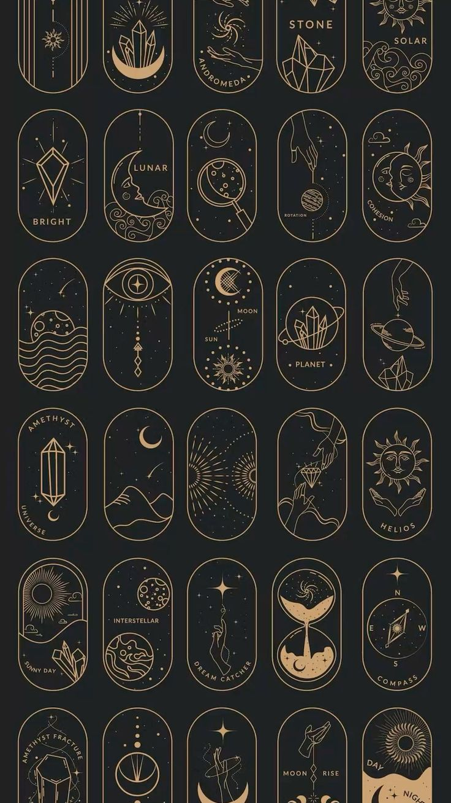

> 해당 이미지는 게임 기획 문서의 일부로 추정되며, 여러 개의 타원형 아이콘들이 모여 있는 것을 볼 수 있습니다. 

아이콘들은 대부분 밤하늘을 배경으로 태양, 달, 별, 행성, 우주, 돌, 수정, 보석 등과 관련된 일러스트로 구성되어 있습니다. 각 아이콘은 테두리가 있고, 테두리 안쪽으로 아이콘에 어울리는 한두 단어가 새겨져 있습니다. 

아이콘의 크기는 가로 5줄, 세로 8줄로 배치되어 있으며, 일부 아이콘은 잘려서 보이지 않는 경우도 있습니다.

아이콘에 포함된 텍스트를 정리하면 다음과 같습니다.

* STONE
* SOLAR
* BRIGHT
* LUNAR
* ROTATION
* ADHESION
* MOON
* SUN
* PLANET
* AMETHYST UNIVERSE
* HELIOS
* DANNY DAY
* INTERSTELLAR
* DREAM CATCHER
* COMPASS
* AMETHYST FRACTURE
* MOON RISE
* DAY NIGHT 

이미지 내의 아이콘은 게임의 개념, 아이템, 상태, 효과 등을 상징적으로 표현하는 용도로 사용될 수 있습니다. 예를 들어, 'STONE' 아이콘은 게임 내에서 사용되는 자원이나 아이템을 나타낼 수 있으며, 'LUNAR' 아이콘은 달과 관련된 능력이나 현상을 상징할 수 있습니다. 'COMPASS' 아이콘은 방향을 결정하거나 특정 위치를 가리키는 용도로 사용될 수 있습니다. 

아이콘들은 일관된 디자인 스타일을 가지고 있어, 게임의 시각적 통일성을 제공할 수 있습니다. 각 아이콘의 테두리와 내부 일러스트, 텍스트는 금색으로 처리되어 있어 고급스럽고 신비로운 느낌을 줍니다. 밤하늘을 배경으로 한 디자인은 우주, 마법, 판타지 등의 테마를 암시하며, 이는 게임의 세계관이나 분위기를 설정하는 데 중요한 요소가 될 수 있습니다.

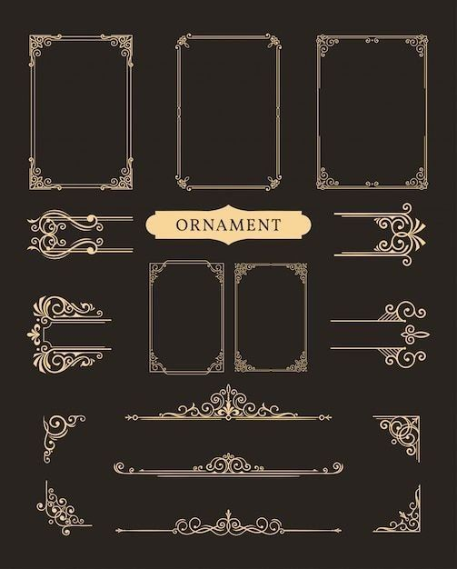

> 다음은 제공한 이미지에 대한 상세한 설명입니다.

이미지는 검은 배경에 금색으로 디자인된 여러 가지 장식적인 요소들이 모여 있습니다. 이미지 중앙에는 "ORNAMENT"이라는 단어가 금색의 가로로 긴 타원형 프레임 안에 새겨져 있습니다. 이 단어는 고딕체와 비슷한 폰트로 작성되었습니다.

이미지는 여러 종류의 장식용 테두리, 프레임, 라인, 모서리 장식 등이 포함되어 있습니다. 

1. **프레임**: 
   - 이미지 상단에는 3개의 큰 직사각형 프레임이 있습니다. 이 프레임들은 모두 금색으로 장식되어 있으며, 각 프레임의 네 모서리에는 꽃이나 덩굴과 같은 모양의 장식이 있습니다.

2. **중앙 프레임**:
   - 중앙에는 "ORNAMENT"이라는 단어가 포함된 금색 라벨이 있습니다.

3. **장식 요소**:
   - 이미지 왼쪽에는 다양한 크기와 디자인의 장식 테두리가 있습니다. 이 테두리들은 주로 꽃이나 덩굴 모양으로 디자인되어 있습니다.
   - 이미지 오른쪽에도 다양한 크기와 디자인의 장식 테두리가 있습니다.

4. **라인**:
   - 이미지 하단에는 여러 가지 라인 요소가 있습니다. 이 라인들은 화려한 패턴으로 장식되어 있으며, 일부 라인은 화살표 모양으로 끝나는 경우도 있습니다.

5. **모서리 장식**:
   - 이미지 하단과 오른쪽에는 모서리를 장식할 수 있는 다양한 디자인 요소가 있습니다.

이러한 디자인 요소들은 주로 금색으로 되어 있으며, 고전적이고 고급스러운 느낌을 줍니다. 이러한 요소들은 인쇄물, 웹사이트, 프레젠테이션 등 다양한 디자인 프로젝트에 사용할 수 있습니다.

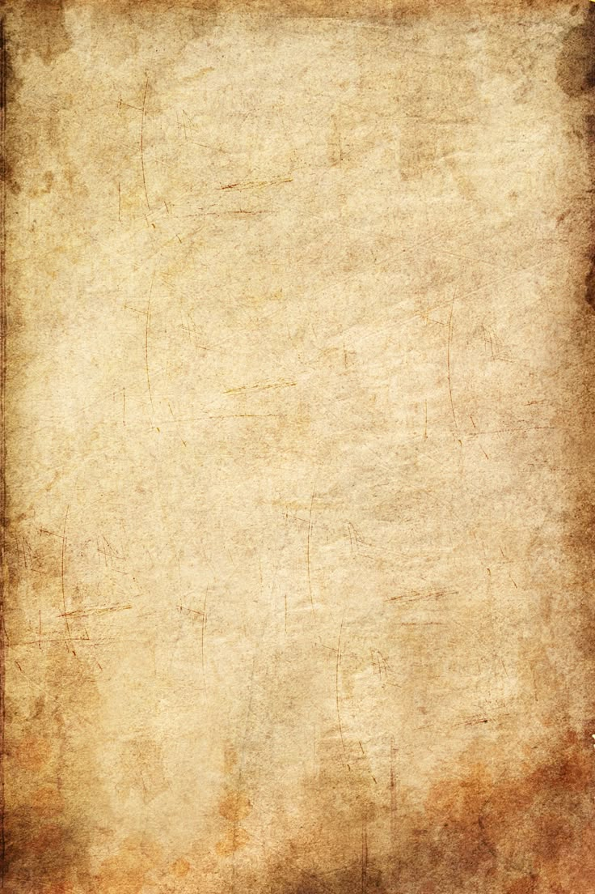

> 이미지는 오래된 종이 질감을 나타내고 있습니다. 이미지의 중앙에는 아무런 텍스트나 그래픽 요소가 포함되어 있지 않습니다. 배경은 노란색과 베이지색의 혼합된 색상으로, 오래된 종이의 질감을 연상시킵니다. 이미지의 가장자리에는 짙은 갈색의 테두리가 있으며, 전체적으로 종이의 질감이 거칠고 낡은 느낌을 주고 있습니다. 이미지에는 텍스트, 다이어그램, UI 요소, 캐릭터, 아이콘 등이 포함되어 있지 않습니다.

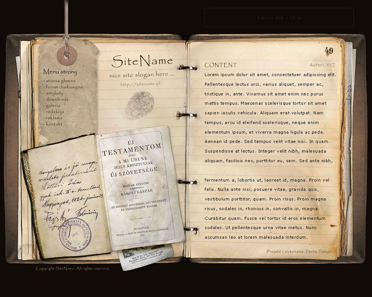

> 이미지는 오래된 책을 연 모습입니다. 책은 두꺼운 가죽 커버로 되어 있고, 페이지가 누렇게 변색되어 있습니다. 책의 왼쪽 페이지에는 다음과 같은 요소가 포함되어 있습니다.

*   종이 태그: 페이지 상단에 종이 태그가 묶여 있습니다. 태그에는 "Menu strony"라는 제목 아래에 여러 항목이 나열되어 있습니다. 항목은 다음과 같습니다.
    *   strona glowna
    *   forum dyskusyjne
    *   galeria
    *   download
    *   artykuly
    *   redakcja
    *   reklama
    *   kontakt
*   SiteName: 페이지 상단에는 "SiteName"이라는 제목과 "nice site slogan here..."라는 문구가 있습니다. 그 아래에 웹사이트 주소가 있습니다. 
*   지문: SiteName과 웹사이트 주소 아래에는 지문이 있습니다.
*   편지지: 페이지 하단에는 편지지 조각이 있습니다. 편지지에는 손으로 쓴 글이 있고, 편지지 오른쪽 하단에는 도장이 찍혀 있습니다.

오른쪽 페이지에는 다음과 같은 요소가 포함되어 있습니다.

*   CONTENT: 페이지 상단에는 "CONTENT"이라는 제목과 "Autor: XYZ"라는 문구가 있습니다.
*   텍스트: 페이지에는 여러 줄의 텍스트가 있습니다. 텍스트는 라틴어로 작성되어 있으며, 의미없는 더미 데이터인 '리플스' 텍스트로 작성되어 있습니다. 페이지 하단에는 페이지 번호가 49로 표시되어 있습니다.

페이지 중앙에는 책의 묶음 부분을 나타내는 검은 고리가 세 개 보입니다. 책의 왼쪽 아래에는 종이 조각이 더미로 쌓여 있습니다. 책 오른쪽 하단에는 "Projekty i wykonanie: Dechta Design"이라는 문구가 있습니다. 배경은 검은색입니다.

---
