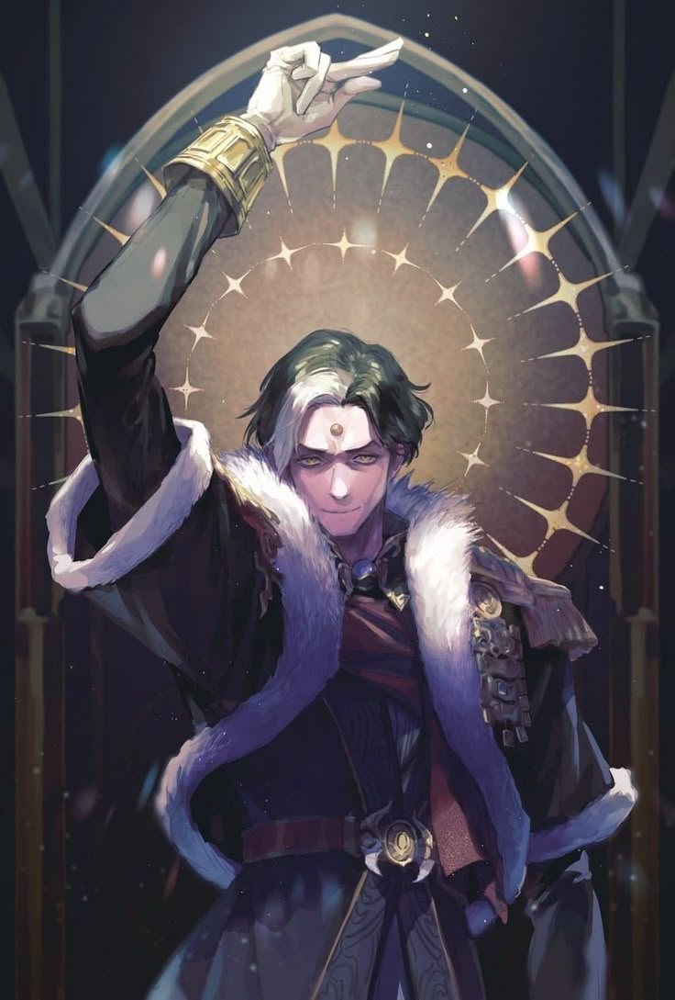
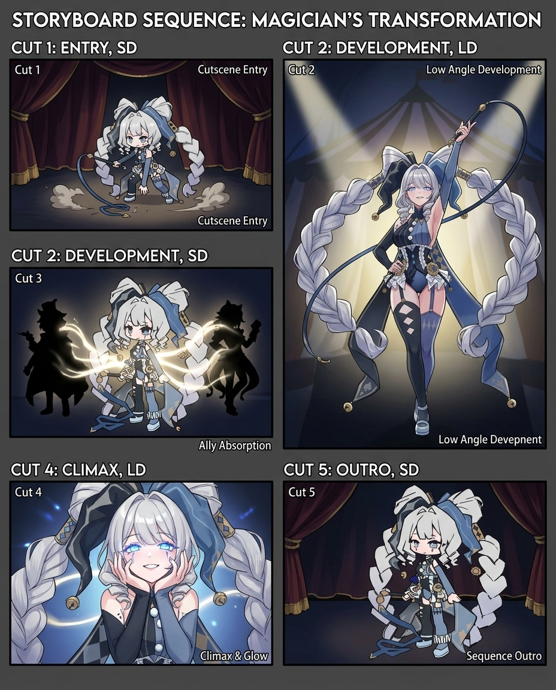

# 연출컨셉문서_V1_이채연

## 슬라이드 1

연출 컨셉 문서

이채연

---

## 슬라이드 2

이 문서를 읽을 때

절대 AI 러프를 믿지마십시오, 참고용입니다.

디자인과 미감은 디자이너분들의 몫입니다.

질문 있으면 언제든 연락 주세요

---

## 슬라이드 3

노드 화면 -> 전투 화면

수풀 같은 것이 화면을 가득 채운 상태로 한쪽으로 샥 지나가며 전투 연출

---

## 슬라이드 4

캐릭터 등장 애니메이션

---

## 슬라이드 5

더 풀 등장

**컷 1 (진입 - LD): 화면 왼쪽에서 지팡이가 먼저 쑥 들어옵니다. 카메라는 지팡이 끝을 따라가다 뒤이어 등장하는 더 풀의 발끝에서 멈추며, 느긋한 걸음으로 걸어 들어오는 하체만 보입니다. 후드를 쓴 채 지팡이를 바닥에 통통 두드리며 걷는 리듬감 있는 실루엣.**

**컷 2 (전개 - LD): 카메라가 천천히 틸트 업(Tilt-up)하며 전신이 드러납니다. 지팡이를 어깨 위로 걸치고 그 위에 양손을 늘어뜨린 특유의 포즈. 까무잡잡한 피부 위로 햇살이 비치고, 후드 안쪽 그림자 사이로 한쪽 눈이 반짝이며 능글맞은 미소가 보입니다. 배경에 바람에 흩날리는 나뭇잎이나 풀씨가 날리며 방랑자의 분위기를 연출합니다.**

**컷 3 (절정, 퇴장 - LD): 바람이 후드를 뒤로 확 젖히며 얼굴 전체가 드러나는 클로즈업. 바람에 빨간 머리카락이 크게 휘날리고, 기본적으로 웃는 얼굴이 카메라를 정면으로 바라봅니다. 동시에 발 밑에서 풀과 덩굴이 빠르게 자라나며 지팡이를 타고 올라오는 자연 이펙트. 타로 "The Fool" 카드가 화면에 떴다가 사라지며 애니메이션 마무리**

---

## 슬라이드 6

하이 프리스테스  등장

**컷 1 (진입 - LD): 어두운 화면에서 촛불 하나가 켜지며, 그 불빛에 하이 프리스테스의 손만 비춰집니다. 길고 마른 손가락이 타로 카드 한 장을 테이블 위에 뒤집어 놓는 모션. 카드가 뒤집히는 순간 은빛 파문이 화면 전체로 퍼져나갑니다.**

**컷 2 (전개 - LD): 은빛 파문이 가라앉으며 카메라가 천천히 줌 아웃(Zoom-out). 촛불 여러 개가 하이 프리스테스를 둘러싸고 있고, 꼿꼿한 자세로 앉아있는 전신이 서서히 드러납니다. 눈은 살짝 내리깔고 있으며, 배경에 달빛이나 장막 사이로 들어오는 푸른 빛이 신비로운 분위기를 만듭니다. 주름진 얼굴이지만 위엄 있고 아름다운 인상.**

**컷 3 (절정, 퇴장 - LD): 하이 프리스테스가 천천히 눈을 들어 카메라를 정면으로 응시하는 얼굴 클로즈업. 눈동자 안에 달의 위상(초승달→보름달)이 빠르게 변화하며, 모든 것을 꿰뚫어 보는 듯한 시선. 입꼬리가 아주 미세하게 올라가며 의미심장한 미소. 타로 "The High Priestess" 카드가 화면에 떴다가 사라지며 애니메이션 마무리**

---

## 슬라이드 7

더 스타  등장

---

## 슬라이드 8

궁극기 애니메이션

컷 4개(진입, 전개, 절정, 퇴장)로 이루어진 1초에 24프레임 기준 애니메이션.

진입, 퇴장은 3콤마 (1초당 3프레임, 1초 채우기 위해 8장 필요)

전개는 2~3콤마 (1초당 2~3프레임, 1초 채우기 위해 8~12장 필요)

절정은 1콤마 (1초당 1프레임, 1초 채우기 위해 24장 필요)

캐릭터 모션 별로 완급 조절을 위해 줄거나 늘 수 있음. (디자이너 미감 의지)

AI 활용 필수

---

## 슬라이드 9

주인공 궁극기 스토리보드

눈을 감고 있는 주인공의 얼굴이 확 클로즈업 된다. 상반신과 얼굴이 크게 클로즈업 되었을 때 주인공이 결연한 표정으로 눈을 번쩍 뜨면 눈이 빛나며 눈 안에 있는 수레바퀴가 반시계 방향으로 돌아간다.

주인공이 오른손을 머리 위로 들어올려(카메라가 주인공의 올라가는 오른손을 따라 올라간다.) 핑거 스냅하면 카메라줌 아웃이 확 되면서 허공에 떠있는 주인공의 전신 보여주고 배경에 펼쳐진 거대한 수레바퀴가 점점 더 빨리 돌면서 녹색 빛이 뿜어져 나오며 마무리.

> 이미지는 게임 기획 문서의 일부로 보이는 일러스트레이션입니다. 이미지를 상세하게 분석해 보겠습니다.

### 캐릭터
- **캐릭터의 모습**: 이미지 중앙에 서 있는 한 남성이 있습니다. 
- **남성의 생김새**: 짙은 녹색과 흰색 혼합된 머리카락에 노란색 눈을 가지고 있습니다. 이마에는 점과 같은 무늬가 있고, 입꼬리가 살짝 올라간 채로 미소를 띤 듯한 표정입니다.
- **의상**: 짙은 색의 외투를 입고 있으며, 외투 안쪽과 깃 부분에 하얀색의 털이 둘러져 있습니다. 허리에는 붉은색 허리띠를 착용하고 있으며, 허리띠에는 둥근 모양의 장식품이 있습니다. 왼쪽 어깨에는 금속 갑옷이 일부 노출되어 있습니다. 오른팔에는 금색 장갑을 착용하고 있습니다.

### 배경
- 배경에는 큰 아치형의 무늬가 그려진 유리나 거울 같은 것이 있습니다. 
- 유리나 거울에는 노란색 별 모양의 빛나는 무늬가 여러 개 새겨져 있습니다. 
- 배경의 색은 짙은 보라색과 금색으로 구성되어 있어 화려하고 신비로운 느낌을 줍니다.

### 레이아웃 및 구조
- 이미지는 중앙에 캐릭터가 위치하고, 그 뒤로 아치형의 배경이 펼쳐져 있습니다. 
- 캐릭터의 손가락이 포인트가 되는 듯한 구도로 그려져 있습니다.

### 요약
- 이 일러스트레이션은 게임의 캐릭터를 묘사한 것으로 보입니다. 
- 캐릭터는 신비롭고 화려한 배경과 어우러져 있어 게임 속에서 중요한 역할을 맡고 있을 것으로 예상됩니다. 
- 이미지의 전체적인 분위기는 판타지적이고 마법적인 요소를 내포하고 있습니다.

---

## 슬라이드 10

저스티스 궁극기 스토리보드

저스티스가 족쇄에 묶여 있는 채로 대검을 질질 끌며 무겁게 앞으로 걸어나가는 모습을 사이드뷰로 하반신까지만 나오도록 연출한다.

저스티스가 화면에서 반쯤 사라졌을 때 손잡이를 꽉 쥐는 클로즈업 샷으로 보여주고 저스티스가 쥔 손잡이부터 붉은 이펙트가 피어오른다. 카메라 구도가 정면으로 바꾸며 저스티스가 화면을 향해 달려들고 화면을 대각선으로 확 베어낸다.

> 이 게임 기획 문서의 일부로 보이는 이미지는 주로 한 명의 캐릭터로 구성되어 있습니다. 

*   **배경**: 배경은 짙은 청록색이며, 사슬과 어둡고 무거운 분위기를 나타내고 있습니다. 
*   **로고**: 이미지 오른쪽 상단에는 게임의 로고가 있습니다. 로고는 흰색과 금색으로 구성되어 있으며, 한자로 작성된 것으로 추정됩니다. 
*   **캐릭터**: 중앙에는 젊은 남성 캐릭터가 있습니다. 이 캐릭터는 긴 검은 머리와 흰색과 검은색의 혼합된 머리카락을 가지고 있으며, 이마에는 푸른색 뿔이 있습니다. 그의 눈은 한쪽은 붉고, 다른 한쪽은 푸른색입니다. 그는 하얀색과 푸른색이 혼합된 옷을 입고 있으며, 그의 왼쪽 귀에는 금색 귀걸이를 착용하고 있습니다. 캐릭터는 사슬에 묶여 있는 듯한 모습이며, 그의 옷에는 금색과 푸른색의 장식이 있습니다. 

이러한 이미지의 구도와 레이아웃은 게임의 캐릭터 소개 또는 홍보용으로 사용될 수 있습니다.

---

## 슬라이드 11

매지션 궁극기

**[컨셉: 생명력을 찬탈하는 화려한 피날레]**

**컷 1 (진입 - SD): SD 매지션이 채찍을 휘둘러 화면을 '착!' 소리와 함께 가로지릅니다. 그 궤적을 따라 서커스 막(Curtain)이 내려오며 LD 컷신 전환됩니다.**

**컷 2 (전개 – LD): * 카메라: 매지션을 중심으로 원을 그리며 도는 오빗(Orbit) 무빙.**

  - **액션: 화려한 조명 아래 매지션이 우아하게 턴을 하며 채찍을 허공에 휘두릅니다. 채찍이 지나간 자리에 아군의 실루엣이 아군들의 영혼(빛의 구체)으로 변해 매지션의 손바닥 위로 모여듭니다.**
**컷 3 (절정 - LD): * 카메라: 매지션의 손에서 얼굴로 빠르게 줌 인(Zoom-in).**

  - **액션: 모여든 에너지를 흡수한 매지션이 양손으로 턱을 괴는 '꽃받침' 포즈를 취하며 입맛 다시기하고 카메라를 응시합니다.**
**컷 4 (퇴장 - SD): 서커스 막이 다시 올라가며 전투 필드. SD 매지션이 관객에게 인사하듯 모자를 벗어 가볍게 목례하는 포즈로 마무리합니다.**

---

## 슬라이드 12

매지션 궁극기 AI

> 해당 이미지는 게임 기획 문서의 일부로, 마법사의 변신 시퀀스(Storyboard Sequence: Magician's Transformation)를 위한 스토리보드이다.

타이틀은 흰색의 동일한 폰트로 표시되어 있다. 이미지는 5개의 컷(Cut 1-5)으로 구성되어 있으며, 각 컷은 두 가지 버전으로 제공된다.

*   SD 버전(Cut 1, 2, 5): 캐릭터가 SD 스타일로 그려져 있다.
*   LD 버전(Cut 2, 4): 캐릭터가 LD(Long Detail) 스타일로 그려져 있다.

각 컷의 내용은 다음과 같다.

*   **Cut 1: Entry, SD**

    *   마법사가 무대 커튼 뒤에서 등장하는 장면이다. 
    *   커튼은 가운데가 열려 있고, 마법사는 오른손에 채찍을 들고 있다. 
    *   머리카락은 큐빗 모양으로 묶여 있다.
    *   마법사는 하의가 짧은 검은색 마법사 옷을 입고 있다. 
    *   무대 아래에는 연기 효과가 있다.
*   **Cut 2: Development, LD**

    *   마법사가 스포트라이트를 받으며 등장하는 장면이다. 
    *   마법사는 채찍을 들고 있고, 머리카락은 길게 풀어헤쳐져 있다. 
    *   마법사는 하의가 짧은 검은색 마법사 옷을 입고 있다. 
    *   배경에는 서커스 천막이 있다.
*   **Cut 3: Development, SD**

    *   마법사가 두 흑실루엣과 마주하고 있는 장면이다. 
    *   마법사는 손을 앞으로 내밀고 있고, 그 손에서 빛나는 빛이 흑실루엣을 향해 발사되고 있다. 
    *   마법사는 하의가 짧은 검은색 마법사 옷을 입고 있다.
*   **Cut 4: Climax, LD**

    *   마법사가 양손에 빛나는 구체를 쥐고 있는 장면이다. 
    *   마법사는 하의가 짧은 검은색 마법사 옷을 입고 있다. 
    *   마법사의 눈은 빛나고 있다.
*   **Cut 5: Outro, SD**

    *   마법사가 무대 커튼 앞으로 퇴장하는 장면이다. 
    *   마법사는 오른손에 채찍을 들고 있다. 
    *   마법사는 하의가 짧은 검은색 마법사 옷을 입고 있다.

이러한 시퀀스는 마법사의 변신 과정을 시각적으로 표현한 것으로, 게임에서 마법사의 변신 장면을 연출하는 데 사용될 수 있다.

---

## 슬라이드 13

더 풀 궁극기

**[컨셉: 하늘에서 쏟아지는 지팡이의 비]**

**컷 1 (진입 - SD): SD 더 풀이 지팡이를 공중으로 던지고 자신의 거대한 망토를 펼쳐 카메라를 완전히 덮어버립니다. 망토가 걷히며 LD 컷신 전환**

**컷 2 (전개 – LD): * 카메라: 발끝에서 얼굴까지 천천히 틸트 업(Tilt-up) 하다가 미소를 짓는 순간 얼굴을 익스트림 클로즈업.**

  - **액션: 평온하던 얼굴이 쾌녀 씨익 미소로 변하며 손가락을 하늘로 치켜듭니다. 하늘에는 수천 개의 지팡이 환영이 마법진과 함께 생성됩니다.**
**컷 3 (절정 – LD): * 카메라: 하늘 높은 곳에서 지면을 향해 수직으로 떨어지는 버즈 아이 뷰(Bird＇s eye view).**

  - **액션: 지휘자가 손을 내리듯 더 풀이 손을 내리치면, 지팡이 소나기가 화면 전체를 폭격합니다. 폭발 이펙트가 화면을 가득 채웁니다.**
**컷 4 (퇴장 - SD): 연기가 자욱한 가운데 다시 전투 화면. SD 더 풀이 하늘에서 내려오는 자신의 지팡이를 가볍게 낚아채며 스탠딩 포즈로 복귀합니다.**

---

## 슬라이드 14

더 풀 궁극기 AI

> 이미지는 타로 카드 'The Fool'에서 영감을 얻은 듯한 애니메이션 스타일의 만화 같은 그래픽 일러스트입니다. 일러스트는 네 개의 패널로 구성되어 있습니다.

1. **패널 1: 엔트리 (SD)**
- 캐릭터는 황금색 긴 머리를 가진 소년이며, 푸른 눈과 짧은 칼집이 달린 막대를 들고 있습니다. 
- 배경은 고대 유적지이며, 캐릭터는 모험을 떠나는 듯한 자세를 취하고 있습니다. 
- 텍스트: "The Fool takes a leap." (어리석은 자가 도약한다.)

2. **패널 2: 전개 (LD 클로즈업)**
- 캐릭터의 클로즈업 이미지입니다. 
- 캐릭터는 오른손 검지와 중지를 펴서 앞으로 향하게 한 채 미소를 띤 채로 당당한 표정을 짓고 있습니다. 
- 텍스트: "The Vision Unfolds." (비전이 펼쳐진다.)

3. **패널 3: 클라이맥스 (SD)**
- 캐릭터가 막대를 휘두르고 있습니다. 
- 배경에는 여러 개의 단검이 날아다니는 듯한 표현이 되어 있습니다. 
- 텍스트: "STAFF RAIN STORM!" (막대 비 폭풍!)

4. **패널 4: Outro (SD 여파)**
- 캐릭터가 막대를 꽂은 채로 앉아 있습니다. 
- 배경에는 여러 개의 단검이 땅에 꽂혀 있고, 캐릭터의 뒤로 타로 카드 'The Fool'이 그려져 있습니다. 
- 텍스트: "LEAP OF FAITH - SUCCESS TAROT: THE FOOL" (믿음의 도약 - 성공 타로: The Fool)

일러스트는 'The Fool' 카드의 상징적 의미를 표현한 것으로 보입니다. 'The Fool' 카드는 새로운 시작, 무모한 도전을 상징합니다. 일러스트 속 캐릭터의 행동과 표현은 이러한 의미를 시각적으로 잘 전달하고 있습니다.

---

## 슬라이드 15

하이 프리스테스 궁극기

---

## 슬라이드 16

하이 프리스테스 궁극기 AI

---

## 슬라이드 17

더 스타 궁극기

---

## 슬라이드 18

더 스타 궁극기 AI

---

## 슬라이드 19

최종 보스 1~2 페이즈 기믹 연출

---

## 슬라이드 20

최종 보스 2~3 페이즈 기믹 연출

---

## 슬라이드 21

저지먼트 등장

1. 저지먼트를 상징하는 천칭 아이콘이 화면에 크게 나타나며

---
