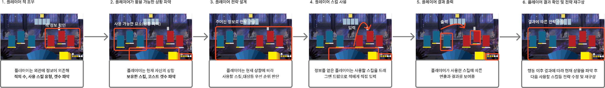

# 전투컨셉기획서_V4_장보성

## 슬라이드 1

전투 컨셉 기획서

Light life 202313190 장보성

---

## 슬라이드 2

**변경사항**

변경된 내용 정리

| 일시 | 작업자 | 변경 사항 |
| --- | --- | --- |
| 2026.03.08 | 장보성 | 컨투 컨셉 기획 방향성 작성 |
| 2026.03.09 | 장보성 | 플레이어 전투 경험 기획 |
| 2026.03.10 | 장보성 | 전투내의 재미요소 및 전략의 재미를 위한 전략 추가요소 |
| 2026.03.11 | 장보성 | 전투의 탬포 및 게임 컨셉 특성에 따른 게임의 컨셉 지정 |
| 2026.03.12 | 장보성 | 피드백 내용에 따른 수정 |

---

## 슬라이드 3

**문서 개요**

**게임의 핵심 콘텐츠인 전투의 컨셉을 지정하는 문서**

**전투 템포, 플레이 방식, 캐릭터 역할, 카드 구조를 통합적으로 설계한다.**

**전투 자체에서의 재미요소 따른 방향성 지정 문서!!!**

**전투 밸런싱은 따로 분리할 예정**

---

## 슬라이드 4

**전투 컨셉**

**불완전한 카드 드로우 속에서 덱 시너지와 전략 판단으로 매 턴 퍼즐을 해결하는 로그라이크 카드 전투 시스템**

**전투의 핵심**

  - 빠른 전투 템포
  - 랜덤으로 들어오는 덱
  - 캐릭터 중심 플레이
  - 카드 기반 전투
**핵심 전투 경험**

  - 매 턴 카드 선택 → 전략 실행 → 덱 성장
  - 랜덤 카드 획득을 통한 빌드 다양성
  - 보스 패턴 공략
---

## 슬라이드 5

**전투 내의 재미요소**

**전략을 짜는 재미**

  - **카드 드로우와 적 행동이 매 턴 달라짐=매 턴 새로운 전략 퍼즐을 해결하는 경험을 하게 된다.**
  - **제한된 카드와 에너지를 활용해 최적의 전략을 찾아가는 과정에서 발생한다.**
  - 자신의 전략을 통해 충분한 데미지나 원하는 결과가 나왔을 때의 재미
**성장을 직접적으로 느낄 수 있는 재미요소**

  - 노드를 진행을 통해 성장한 플레이어의 전투를 통해서 성장의 피드백을 받음
  - 사용 가능한 코스트 등이 늘어남으로 자신의 턴에 여러 번 딜을 넣는 자유로움
---

## 슬라이드 6

**전투 핵심 구조**

**전투내에 일어나는 플로우 차트**

아군 코스트 획득

> 이미지는 게임 기획 문서의 일부로, 게임의 전투 시스템을 설명하는 플로우차트입니다. 이미지를 분석하면 다음과 같은 내용을 알 수 있습니다.

*   **전투 시작**: 전투가 시작되면 아군과 적군의 순서로 스킬을 사용할 수 있는 상태가 됩니다.
*   **스킬 사용**: 아군이 스킬을 사용할 수 있는 상태에서 스킬을 사용하면, 사용한 스킬을 기록하고 비용을 차감합니다. 비용이 부족한 경우 스킬을 사용할 수 없습니다.
*   **스킬 비용**: 스킬을 사용할 때 비용이 부족한 경우, 비용을 충족할 수 있는 다른 방법을 찾아야 합니다. 예를 들어, 특수 카드를 드로우하거나 공극기 스택을 증가시킬 수 있습니다.
*   **적군 HP 0**: 적군의 HP가 0이 되면 전투를 노드 클리어하고 보상을 받을 수 있습니다.
*   **턴 넘기기**: 아군의 턴이 끝나면 적군의 턴이 시작됩니다. 적군은 스킬을 사용할 수 있는 상태에서 스킬을 사용하고, 패턴에 따라 스킬을 발동합니다.
*   **패배 판정**: 적군의 공격으로 아군의 HP가 0이 되면 패배 판정을 받습니다.

전투 시스템은 아군과 적군의 순서로 스킬을 사용하며, 각자의 HP를 관리하는 것이 중요합니다. 스킬을 사용할 때 비용을 고려해야 하며, 비용이 부족한 경우 다른 방법을 찾아야 합니다. 전투를 승리하기 위해서는 적군의 HP를 0으로 만들어야 하며, 패배를 피하기 위해서는 아군의 HP를 관리해야 합니다.

---

## 슬라이드 7

**전투 경험 스토리보드**

플레이어의 경험을 예상하여 제작한 전투 스토리보드

#### 위 스토리보드를 반복하며 효율적인 카드 사용으로 쉬워지는 전투 중에도 성장하는 느낌

#### 플레이어에게 지속적인 몰입감과 사고 기반 재미를 제공한다.

#### 자신의 판단이 전투 결과에 직접 영향을 미친다는 느낌을 받아야 함

#### 구조에 따른 재미요소(인지적 재미요소)

#### 전투 종료까지 반복

> 이미지는 게임 기획 문서의 일부로, 게임의 플레이 흐름을 단계별로 설명하고 있습니다. 이미지에는 6개의 단계가 있으며, 각 단계는 다음과 같습니다.

1. **플레이어 적 조우**: 
- **텍스트**: 플레이어는 외관에 정보에 의존해 적의 수, 사용 스킬 유형, 갯수 파악
- **다이어그램 및 UI 요소**: 
  - 게임 화면에 여러 개의 막대 그래프가 표시되어 있습니다. 
  - 막대 그래프는 노란색, 빨간색, 파란색으로 구분됩니다. 
  - 막대 그래프 위쪽에 빨간색 네모 박스가 표시되어 있습니다.

2. **플레이어가 활용 가능한 상황 파악**: 
- **텍스트**: 플레이어는 현재 자신의 상황 보유한 스킬, 코스트 갯수 파악
- **다이어그램 및 UI 요소**: 
  - 게임 화면에 여러 개의 막대 그래프가 표시되어 있습니다. 
  - 막대 그래프는 노란색, 빨간색, 파란색으로 구분됩니다. 
  - 막대 그래프 위쪽에 빨간색 네모 박스가 표시되어 있습니다.

3. **플레이어 전략 설계**: 
- **텍스트**: 주어진 정보로 전략 구상
- **다이어그램 및 UI 요소**: 
  - 게임 화면에 여러 개의 막대 그래프가 표시되어 있습니다. 
  - 막대 그래프는 노란색, 빨간색, 파란색으로 구분됩니다. 
  - 막대 그래프 위쪽에 빨간색 네모 박스가 표시되어 있습니다.

4. **플레이어 스킬 사용**: 
- **텍스트**: 정보를 얻은 플레이어는 사용할 스킬, 대상등 우선 순위 판단
- **다이어그램 및 UI 요소**: 
  - 게임 화면에 여러 개의 막대 그래프가 표시되어 있습니다. 
  - 막대 그래프는 노란색, 빨간색, 파란색으로 구분됩니다. 
  - 막대 그래프 위쪽에 빨간색 네모 박스가 표시되어 있습니다.
  - 빨간색 화살표가 막대 그래프를 가리키고 있습니다.

5. **플레이어 결과 출력**: 
- **텍스트**: 얻은 정보를 얻은 플레이어는 사용할 스킬을 드래그해서 적에게 직접 입력
- **다이어그램 및 UI 요소**: 
  - 게임 화면에 여러 개의 막대 그래프가 표시되어 있습니다. 
  - 막대 그래프는 노란색, 빨간색, 파란색으로 구분됩니다. 
  - 막대 그래프 위쪽에 빨간색 네모 박스가 표시되어 있습니다.
  - 빨간색 화살표가 막대 그래프를 가리키고 있습니다.

6. **플레이어 결과 확인 및 전략 재구상**: 
- **텍스트**: 
  - 플레이어가 사용한 스킬에 따른 연출과 결과를 보여줌
  - 행동 이후 결과에 따라 현재 상황을 파악 후 다음 사용할 스킬등 전략 수정 및 재구상
- **다이어그램 및 UI 요소**: 
  - 게임 화면에 여러 개의 막대 그래프가 표시되어 있습니다. 
  - 막대 그래프는 노란색, 빨간색, 파란색으로 구분됩니다. 
  - 막대 그래프 위쪽에 빨간색 네모 박스가 표시되어 있습니다.

전체적으로, 이 게임은 플레이어가 적의 정보를 파악하고, 자신의 스킬을 사용하여 전략을 설계하고, 결과를 확인하고, 전략을 재구상하는 과정을 거치는 게임으로 보입니다.

> 해당 이미지는 게임 기획 문서의 일부로, "Steep and Shallow"라는 제목의 그래프를 포함하고 있습니다. 이 그래프는 경험과 학습의 관계를 나타냅니다.

*   그래프의 제목: Steep and Shallow
*   그래프의 축:
    *   X축: Experience (경험)
    *   Y축: Learning (학습)
*   그래프의 내용:
    *   빨간 실선: 급격한 상승을 나타내며, 짧은 기간 내에 빠르게 학습이 이루어짐을 의미합니다. 
    *   파란 점선: 완만한 상승을 나타내며, 오랜 기간에 걸쳐 학습이 이루어짐을 의미합니다.
*   그래프 오른쪽에 있는 범례:
    *   steep (short) - 빨간 실선
    *   shallow (long) - 파란 점선
*   저작권 정보: 
    *   작성자: Alan Fletcher
    *   작성 연도: 2013
    *   라이선스: Creative Commons Attribution-Share Alike 3.0 Unported
    *   사용 도구: R-studio를 사용하여 'R'로 작성

해당 그래프는 학습 곡선을 나타내며, 두 가지 유형의 학습 곡선을 비교합니다. 빨간 실선은 짧은 기간 내에 빠르게 학습이 이루어지는 "steep"한 학습 곡선을 나타내고, 파란 점선은 오랜 기간에 걸쳐 학습이 이루어지는 "shallow"한 학습 곡선을 나타냅니다. 이 그래프는 학습과 경험의 관계를 이해하는 데 도움이 됩니다.

---

## 슬라이드 8

**특수 카드 경험**

**적을 처치한 보상으로서 주어지는 비영구적인 무료 카드다.**

**특수 카드로 플레이어 목표 경험**

  - 적을 처치한 보상에 대한 만족감
  - 처치를 통해 떨어지는 추가적인 공격수단으로서 전략요소
  - 시너지 조합을 자유롭게 이용 가능해 시너지 조합이 더 쉬워지는 보상
  - 자신이 싫어하는 적의 카드를 그대로 적에게 되돌려주는 복수를 통한 쾌감

> 이 문서는 게임 기획 문서의 일부로, 게임 내에서의 플레이어의 행동과 그에 따른 게임 요소들의 변화를 순서대로 설명하고 있습니다. 이미지와 텍스트로 구성되어 있으며, 플레이어가 적을 처치하고, 처치를 통해 특수 스킬을 획득하여 사용하는 과정을 묘사하고 있습니다.

문서의 레이아웃은 세 개의 동일한 구조로 나뉘어져 있습니다. 각 구조는 다음과 같습니다.

1. **플레이어 적 처치**
- 이미지: 게임 화면으로, 플레이어가 적을 처치하는 장면입니다. 화면에는 여러 개의 기둥이 있고, 플레이어와 적이 표현되어 있습니다. 
- 텍스트: 플레이어가 적을 처치하는 과정에 대한 설명입니다.

2. **처치를 통한 특수 스킬 확인**
- 이미지: 첫 번째 이미지에서 플레이어가 적을 처치한 후, 특수 스킬이 드롭되는 장면입니다. 드롭된 스킬을 플레이어의 덱에 들어가는 애니메이션이 포함되어 있습니다.
- 텍스트: 처치를 통해 특수 스킬이 드롭되고, 해당 특수 스킬이 플레이어의 덱에 들어가는 과정에 대한 설명입니다.

3. **플레이어 스킬 사용**
- 이미지: 플레이어가 특수 스킬을 사용하여 공격하는 장면입니다. 
- 텍스트: 플레이어가 특수 스킬을 사용하여 적을 공격하는 과정에 대한 설명입니다.

이러한 구조를 통해, 플레이어가 적을 처치하고, 그 보상으로 특수 스킬을 얻어 덱에 추가하고, 이를 사용하여 전투를 진행하는 흐름을 명확히 알 수 있습니다.

---

## 슬라이드 9

**전투 내의 전략**

**불완전한 카드 드로우 속에서 덱 시너지와 전략 판단으로 매 턴 퍼즐을 해결하는 전투 시스템**

카드 덱을 기반으로 전투 전략을 구성함 확률·전략·자원관리를 핵심 플레이 요소로 삼는다.

  - 플레이어가 전략을 짜 효율적으로 승리 하는 걸 목표로 삼게 함
**전략을 통한 재미요소**

  - 전투 자체에서 전략을 짜게 하여 빠른 몰입감을 느끼게 함
  - 전투내의 전략으로 플레이어는 인지적 재미를 느낌
**전투내의 고려할 전략요소**

  - 현재 사용 가능한 카드
  - 코스트 관리, 궁극기 게이지
  - 정방향 역방향의 스킬 사용 우선순위
---

## 슬라이드 10

**자원 설계**

**제한된 자원**

  - 플레이어는 해당 턴에 생성된 코스트내의 스킬을 사용할 수 있음
  - 제한된 코스트로 플레이어에게 전략적인 선택을 요구함
**후반의 용도**

  - 코스트가 늘어남에 따라 플레이어는 사용할 수 있는 스킬 종류가 늘어나며 더 많은 스킬을 사용 할 수 있게됨.
  - 플레이어는 더 자유롭게 스킬을 사용하며 플레이를 하기 원할 것 이며 성장의 보상으로 제공함
  - 전 윤회보다 자유로운 전투를 위해 윤회를 여러 번 하는 동력원이 된다.
---

## 슬라이드 11

**시너지**

**제한된 자원**

  - 플레이어는 해당 턴에 생성된 코스트내의 스킬을 사용할 수 있음
  - 제한된 코스트로 플레이어에게 전략적인 선택을 요구함
**후반의 용도**

  - 코스트가 늘어남에 따라 플레이어는 사용할 수 있는 스킬 종류가 늘어나며 더 많은 스킬을 사용 할 수 있게됨.
  - 플레이어는 더 자유롭게 스킬을 사용하며 플레이를 하기 원할 것 이며 성장의 보상으로 제공함
  - 전 윤회보다 자유로운 전투를 위해 윤회를 여러 번 하는 동력원이 된다.
---

## 슬라이드 12

**인지적 재미요소**

**랜덤으로 변하는 상황에 따라 예상하고 다른 전략을 짬**

  - 달라진 상황에 따라 성공적인 대처에 대한 피드백
  - 플레이어가 선택하고 그에 따른 결과를 받아 몰입감 높힘
  - 자신의 선택으로 어려운 도전을 클리어 함에 대한 카타르시스
#### 확률 요소

#### 전략을 짜고 결과를 확인함

> 이미지는 검은색 배경에 흰색으로 그려진 클립보드 아이콘입니다. 클립보드의 상단에는 클립 형태의 흰색 윤곽선이 있고, 중앙에는 다음과 같은 요소들이 그려져 있습니다:

* 왼쪽 상단: 흰색 원이 있고 그 중앙에 작은 검은색 점이 있습니다.
* 중앙: 굽어진 화살표가 아래에서 위로 향하고 있습니다. 이 화살표는 왼쪽 하단에서 시작하여 위로 굽어져 있습니다.
* 오른쪽 하단: 화살표 아래에 흰색 X자 모양이 있습니다.

클립보드 아이콘은 일반적으로 문서나 데이터를 복사하거나 이동할 때 사용되는 도구입니다. 이 아이콘은 게임 기획 문서에서 특정 기능이나 작업을 나타내는 아이콘으로 사용될 수 있습니다.

---

## 슬라이드 13

**RNG (전투내의 확률 요소) 설계**

**전투 내의 확률 요소**

  - 고정된 패턴을 없애 반복적인 플레이를 방지함
  - 보상 결과 등에 변화를 주어 플레이어가 계속 도전하게함
  - 고숙련도보다 운에 의한 성공 가능성을 제공해 초보자도 성취감을 느낌
  - 콘텐츠 소모 후에도 랜덤 보상 등으로 플레이어 유지함
**플레이 중 확률로 인해 얻는 (억까)불쾌감을 줄여야 함**

  - 스킬은 사용할 캐릭터의 스킬은 랜덤으로 제공함
  - 드로우 시 기본적으로 정방향으로 제공함
  - 플레이어가 자신의 선택으로 등장 확률에 변화를 주어 확실한 이득을 줌
**확률의 중요도**

운의 영향으로 인해 전략이 사라지는 걸 우선적으로 막음

#### 확률 요소

#### 운에 요소가 강해 전략에 무력감을

#### 느끼지 않도록

> 해당 이미지에는 하얀색 배경에 하나의 주사위가 포함되어 있습니다. 주사위는 정육면체이며, 검은색입니다. 주사위에는 여섯 면이 있지만, 면이 하나만 보입니다. 주사위에는 하얀색 테두리가 있고, 면에는 점들이 있습니다.

주사위 위쪽 면에는 4개의 점이 있고, 아래쪽 면에는 3개의 점이 있으며, 오른쪽 면에는 1개의 점이 있습니다. 주사위 왼쪽 면과 앞쪽 면, 뒤쪽 면은 보이지 않습니다.

주사위 면의 점들은 면마다 다르게 배치되어 있습니다. 위쪽 면의 점은 2x2 격자 형태로 배치되어 있고, 아래쪽 면의 점은 마름모 형태로 배치되어 있습니다. 오른쪽 면의 점은 정중앙에 있습니다.

주사위의 시각적 레이아웃과 구조는 정육면체의 형태를 유지하면서도, 각 면의 점들이 다르게 배치되어 있습니다. 주사위의 크기는 이미지의 상당 부분을 차지하고 있으며, 배경은 단순한 하얀색입니다.

---

## 슬라이드 14

**전투 UX 설계**

**UX/UI는 전투 이해도와 전략성을 크게 영향을 끼침**

  - 가장 중요한 것은 필요 정보 전달과 조작 편의성이 핵심!!!!
  - 플레이어가 매 턴 상황을 빠르게 이해하고 전략적 결정을 내릴 수 있도록 함
**정보 가독성**

  - 적 행동과 카드 효과를 직관적으로 이해 가능 해야함
**빠른 의사결정**

  - 드래그 앤 드랍으로 원하는 대상에 바로 스킬을 사용할 수 있게함
**전략 피드백**

  - 플레이어가 어떤 행동으로 어떤 결과가 나왔는지를 보여줘야 함
  - 스킬의 데미지 표시나 턴내에서 스킬 사용을 통한 코스트가 표기가 되어야 함
#### 정보에 정확한 이해

#### 플레이어가 매 턴 상황을 빠르게 이해하고 전략적 결정

> 이미지는 흰색 배경에 검은색 실루엣으로 표현된 사람의 머리 측면 프로필을 보여 주고 있습니다. 

머리 내부에는 흰색으로 된 그래프 모양의 도형과 덧셈 기호가 그려져 있습니다. 

그래프 모양의 도형은 가운데에 있는 하나의 점과, 그 점에서 양쪽으로 벌려진 두 개의 점이 선으로 연결되어 있는 형태입니다. 

덧셈 기호는 그래프 모양의 도형을 중심으로 하여 상하좌우에 하나씩, 총 네 개가 배치되어 있습니다.

전체적으로 창의력, 문제 해결 능력 또는 혁신과 관련된 컨셉을 상징하는 듯한 이미지입니다.

---

## 슬라이드 15

**일반 전투 컨셉**

**단순 패턴 적**

  - 적은 이해하기 쉬운 패턴을 가지기에 연습장으로서 활용 가능한 스테이지
**덱 테스트 환경**

  - 보스전을 위한 전투시스템을 익혀가는 전투!!!!
  - 상대적으로 약한 적이기에  다양한 또는 공격적인 스킬로 처치할 수 있는 여유를 제공
**덱 성장 경험 제공**

  - 강해진 플레이어의 피드백을 보여주는 스테이지
  - 난 성장하고 있다!!! 라는 경험
---

## 슬라이드 16

**보스 전투 경험**

**패턴 기반 전투**

  - 보스는 여러 행동 패턴을 가진다.
  - 적에 맞춰서 공격 우선 순위, 스킬 순서 고려할 경우 더욱 쉽게 클리어 할 수 있게 함
**기획의도**

  - 시너지로만 적을 효과적으로 공격한다는 전투 자체의 단순화를 맞기 위함
  - 보스 처치로 더 큰 보상을 얻어 플레이어에게 강한 성취감을 제공용
**유의 사항**

  - 초반에 보스를 공략한다 자체를 이해하기 어려움 → 갑자기 높아진 난이도에 불쾌감
**해결방법(소거법으로 이중에 선택하면 됨)**

  - 초반 튜토리얼에 보스마다 약점이 있다는 사실
  - 보스 전투 전에 보스 특징을 미리 알려주는 시스템을 제공한다.
    - 전투 패턴 시각화 위험한 스킬은 화살표나 느낌표등 공격 대상이나 스킬 유형 표기
    - 약점 UI외곽 글로우로 표기등

> 이미지 속 게임 화면은 두 명의 플레이어와 여러 캐릭터가 등장하는 장면입니다. 

* 화면 상단 중앙에는 경험치와 포인트를 표시하는 검은색 상자가 있습니다. 
* 왼쪽에는 플레이어 1의 캐릭터 정보가 표시되고, 오른쪽에는 플레이어 2의 캐릭터 정보가 표시됩니다. 
* 화면 하단 중앙에는 두 플레이어의 캐릭터 선택 화면이 보입니다. 각 플레이어는 여러 캐릭터를 선택한 상태이며, 선택한 캐릭터의 프로필과 스킬 정보가 표시됩니다. 
* 화면 중앙에는 두 플레이어의 캐릭터가 상대편을 향해 서 있습니다. 
* 화면 상단에는 여러 개의 아이콘이 표시되며, 게임 진행 상황을 나타냅니다. 
* 배경에는 큰 원형의 구조물이 있고, 그 앞에는 여러 개의 기둥이 있습니다. 

이 게임은 2:2 대전 게임으로 보입니다. 두 명의 플레이어가 팀을 이뤄 상대 팀과 대결하는 게임으로 추정되며, 플레이어는 각자의 캐릭터를 선택하고 스킬을 사용해 상대편을 공격하고 방어해야 합니다. 게임의 목표는 상대편을 물리치고 포인트를 얻는 것으로 보입니다.

---
