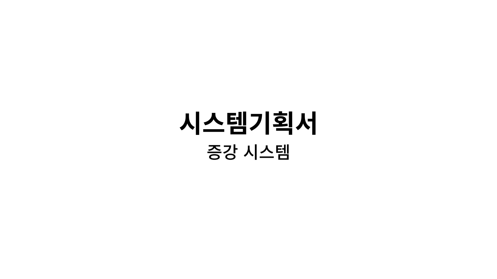
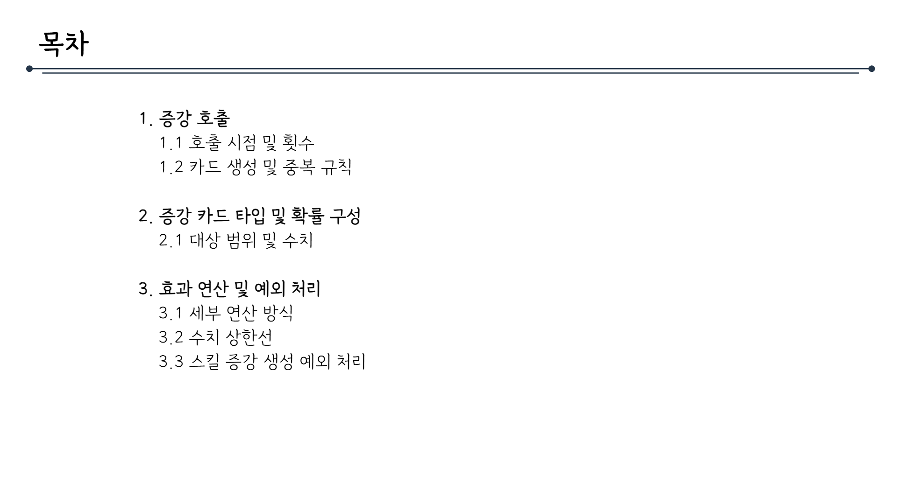
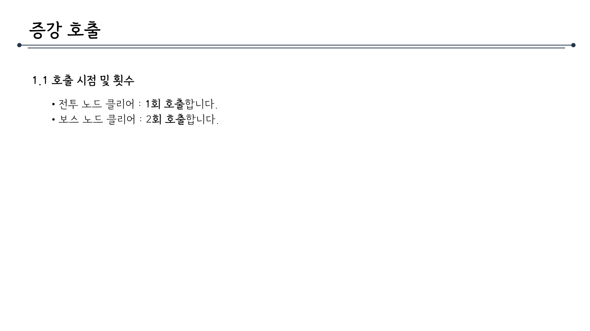
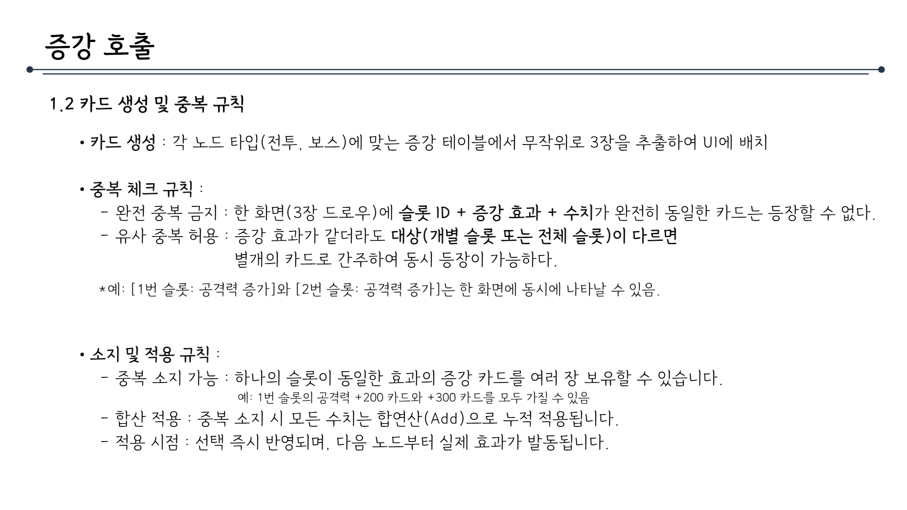
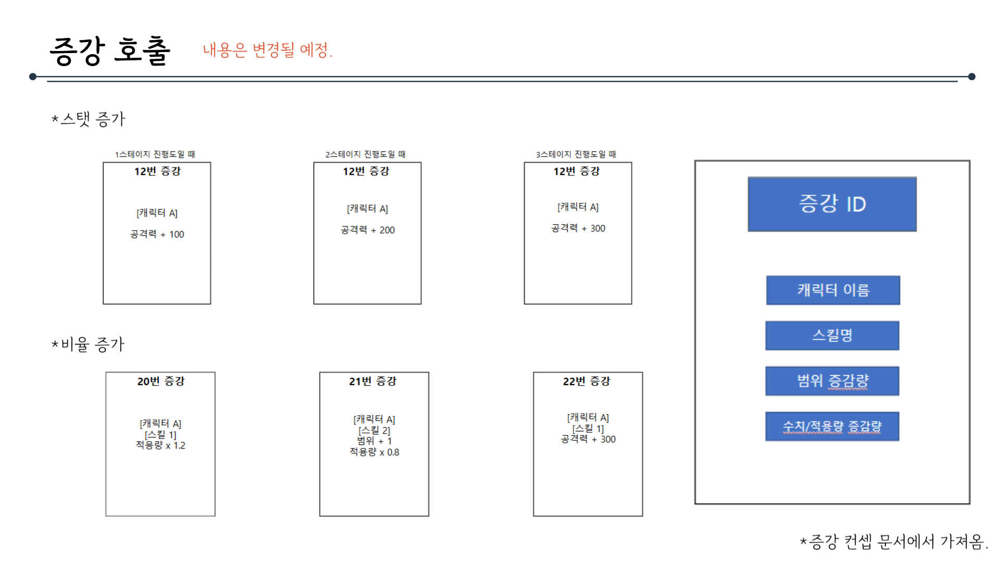
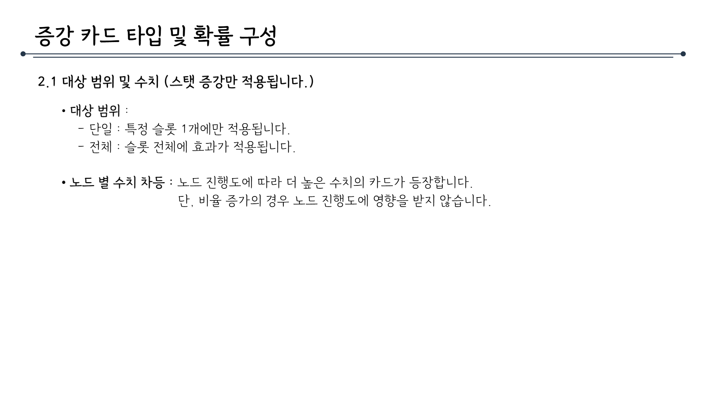
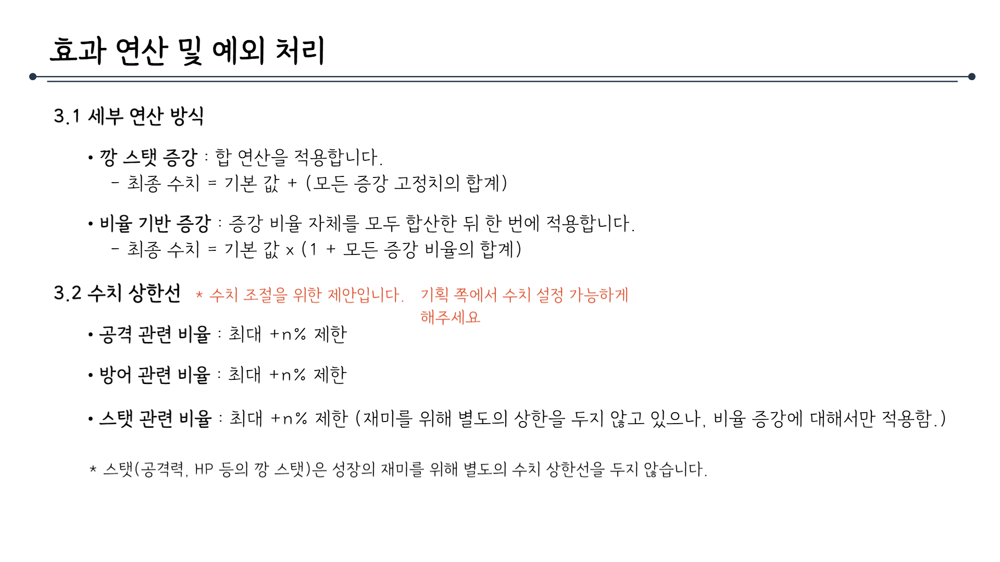
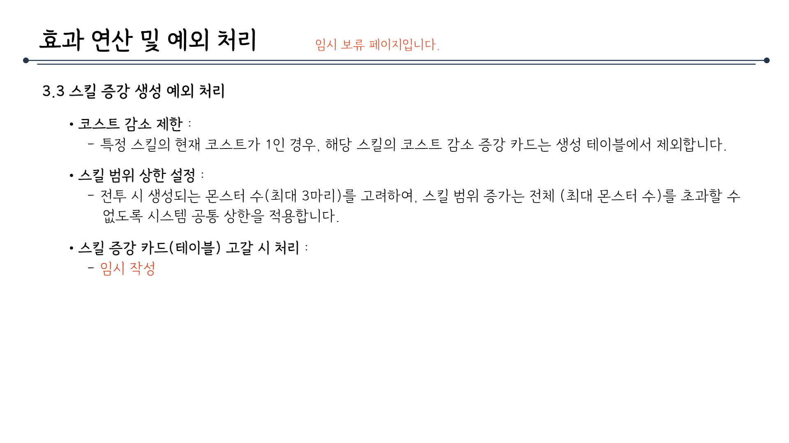

# 증강시스템_V2_김주연

## 슬라이드 1

> 이 게임 기획 문서에는 다음과 같은 요소가 포함되어 있습니다.

*   **텍스트**: 
    *   시스템기획서
    *   증강 시스템
*   **시각적 레이아웃과 구조**: 
    *   텍스트가 포함된 이미지 중앙 정렬
    *   첫 번째 줄에는 '시스템기획서'라는 텍스트가 있고, 두 번째 줄에는 '증강 시스템'이라는 텍스트가 있습니다. 
    *   배경은 흰색입니다.

---

## 슬라이드 2

> 해당 이미지는 게임 기획 문서의 일부로 보이는 '목차' 파트입니다. 

*   레이아웃 및 구조: 

    *   문서의 가장 상단 왼쪽에는 '목차'라는 타이틀 텍스트가 있고, 그 오른쪽에는 긴 선이 가로로 이어져 있습니다. 선의 왼쪽 끝과 오른쪽 끝에는 작은 동그라미가 있습니다. 
    *   목차는 총 3개의 큰 카테고리로 구성되어 있고, 각각의 큰 카테고리 밑에는 작은 카테고리가 더 세부적으로 분류되어 있습니다. 

*   세부 텍스트:

    *   목차: 
    *   1. 증강 호출 
        *   1.1 호출 시점 및 횟수 
        *   1.2 카드 생성 및 중복 규칙 
    *   2. 증강 카드 타입 및 확률 구성 
        *   2.1 대상 범위 및 수치 
    *   3. 효과와 연산 및 예외 처리 
        *   3.1 세부 연산 방식 
        *   3.2 수치 상한선 
        *   3.3 스킬 증강 생성 예외 처리 

*   이미지에는 텍스트, 레이아웃 외에 다른 시각적 요소는 보이지 않습니다.

---

## 슬라이드 3

> 증강 호출

1.1 호출 시점 및 횟수

* 전투 노드 클리어 : 1회 호출합니다.
* 보스 노드 클리어 : 2회 호출합니다.

위 이미지는 게임 기획 문서의 일부로, '증강 호출'이라는 기능에 대한 설명을 담고 있습니다. 문서의 레이아웃과 구조는 다음과 같습니다.

문서의 제목은 '증강 호출'이며, 제목 아래에 긴 가로선이 그어져 있습니다. 이 선은 문서의 제목과 내용을 구분하는 역할을 합니다.

제목 아래에는 '1.1 호출 시점 및 횟수'라는 문단이 있습니다. 이 문단에는 두 가지 조건에 따라 호출 횟수가 다르다는 내용이 포함되어 있습니다.

* 전투 노드 클리어 시 1회 호출합니다.
* 보스 노드 클리어 시 2회 호출합니다.

문서의 배경은 흰색이며, 텍스트는 검은색입니다. 전반적으로 간결하고 명확한 레이아웃을 갖추고 있어, 게임 개발팀이나 관련 담당자가 쉽게 이해할 수 있도록 구성되어 있습니다.

---

## 슬라이드 4

> 이 문서는 게임 기획 문서의 일부로, 증강 호출 기능에 대한 규칙과 세부 사항을 설명하고 있습니다. 문서의 구조와 내용을 상세히 분석해 보겠습니다.

### 문서 구조
- **제목**: 문서의 제목은 "증강 호출"로, 이 기능에 대한 규칙을 설명하는 파트인 듯합니다.
- **문단 구조**: 
  - 1.2 카드 생성 및 중복 규칙
  - 카드 생성 규칙
  - 중복 체크 규칙
  - 소지 및 적용 규칙

### 상세 설명

#### 1.2 카드 생성 및 중복 규칙
- **카드 생성**:
  - 각 노드 타입(전투, 보스 등)에 맞는 증강 테이블에서 무작위로 카드를 3장 추출하여 UI에 배치합니다.

#### 중복 체크 규칙
- **완전 중복 금지**: 
  - 한 화면(3장 드로우)에 슬롯 ID + 증강 효과 + 수치가 완전히 동일한 카드는 등장할 수 없습니다.
- **유사 중복 허용**: 
  - 증강 효과가 같더라도 대상(개별 슬롯 또는 전체 슬롯)이 다르면 별개의 카드로 간주하여 동시에 등장할 수 있습니다.
  - 예를 들어, [1번 슬롯: 공격력 증가]와 [2번 슬롯: 공격력 증가]는 한 화면에 동시에 나타날 수 있습니다.

#### 소지 및 적용 규칙
- **중복 소지 가능**: 
  - 하나의 슬롯이 동일한 효과의 증강 카드를 여러 장 보유할 수 있습니다. 
  - 예를 들어, 1번 슬롯의 공격력 +200 카드와 +300 카드를 모두 가질 수 있습니다.
- **합산 적용**: 
  - 중복 소지 시 모든 수치는 합연산(Add)으로 누적 적용됩니다.
- **적용 시점**: 
  - 선택 즉시 반영되며, 다음 노드부터 실제 효과가 발동됩니다.

### 시각적 레이아웃
- **텍스트 레이아웃**: 
  - 제목과 주요 문단은 왼쪽 정렬되어 있습니다.
  - 항목(카드 생성, 중복 체크, 소지 및 적용)은 글머리 기호로 구분되어 가독성을 높였습니다.
  - 하위 항목은 들여쓰기를 통해 시각적으로 구분하였습니다.
- **디자인**: 
  - 배경은 흰색이며, 검은색 텍스트가 사용되었습니다.
  - 섹션을 나누는 수평선이 상단에 배치되어 문서의 구조를 명확히 구분하였습니다.

이 문서는 게임 내 증강 호출 기능의 카드 생성, 중복 규칙, 그리고 적용 방식에 대해 체계적으로 설명하고 있습니다. 규칙들이 명확히 나뉘어 있어 개발 및 기획 과정에서 참고하기 용이한 구조로 설계되었습니다.

---

## 슬라이드 5

> 이 문서는 게임 기획 문서의 일부로, 증강 효과에 대한 정보를 담고 있습니다. 문서의 제목은 '증강 효과'이며, 하단에 '내용은 변경될 예정'이라는 문구가 표시되어 있습니다.

문서는 두 가지 유형의 증강 효과를 설명합니다.

*   **스택 증가**: 게임의 스테이지 진행도에 따라 공격력이 증가하는 효과를 설명합니다. 
    *   1스테이지 진행도일 때: 공격력이 12번 증강되며, 캐릭터 A의 공격력이 +100 증가합니다.
    *   2스테이지 진행도일 때: 공격력이 12번 증강되며, 캐릭터 A의 공격력이 +200 증가합니다.
    *   3스테이지 진행도일 때: 공격력이 12번 증강되며, 캐릭터 A의 공격력이 +300 증가합니다.

*   **비율 증가**: 게임 내에서 특정 스킬의 효과가 증가하는 것을 설명합니다.
    *   20번 증강: 캐릭터 A의 스킬 1의 적용량이 1.2배 증가합니다.
    *   21번 증강: 캐릭터 A의 스킬 2의 범위가 +1 증가하고, 적용량이 0.8배 증가합니다.
    *   22번 증강: 캐릭터 A의 스킬 1의 공격력이 +300 증가합니다.

문서의 오른쪽에는 블루 컬러의 직사각형이 나열되어 있습니다. 각 직사각형에는 다음과 같은 레이블이 지정되어 있습니다.

*   증강 ID
*   캐릭터 이름
*   스킬명
*   범위 증감량
*   수치/적용량 증감량

이러한 레이아웃과 구조를 통해, 이 문서는 게임 내 캐릭터의 능력치와 스킬 효과를 체계적으로 정리하고 있습니다.

---

## 슬라이드 6

> 증강 카드 타입 및 확률 구성

### 2.1 대상 범위 및 수치 (스택 증강만 적용됩니다.)

*   대상 범위 
    *   단일: 특정 슬롯 1개에만 적용됩니다.
    *   전체: 슬롯 전체에 효과가 적용됩니다.
*   노드 별 수치 차등: 노드 진행도에 따라 더 높은 수치의 카드가 등장합니다. 단, 비율 증가의 경우 노드 진행도에 영향을 받지 않습니다.

---

## 슬라이드 7

> 해당 문서의 제목은 **효과 연산 및 예외 처리**입니다.

문서의 구조는 다음과 같습니다.

*   제목: 효과 연산 및 예외 처리
*   3.1 세부 연산 방식
    *   깡 스탯 증가: 합 연산을 적용합니다.
        *   최종 수치 = 기본값 + (모든 증가 고정치의 합계)
    *   비율 기반 증가: 증가 비율 자체를 모두 합산한 뒤 한 번에 적용합니다.
        *   최종 수치 = 기본값 × (1 + 모든 증가 비율의 합계)
*   3.2 수치 상한선 
    *   *수치 조정을 위한 제안입니다. 기획 쪽에서 수치 설정 가능하게 해주세요.*
    *   공격 관련 비율: 최대 +n% 제한
    *   방어 관련 비율: 최대 +n% 제한
    *   스탯 관련 비율: 최대 +n% 제한 (재미를 위해 별도의 상한을 두지 않고 있으나, 비율 증가에 대해서만 적용함.)
    *   *스탯(공격력, HP 등의 깡 스탯)은 성장의 재미를 위해 별도의 수치 상한선을 두지 않습니다.* 

문서는 게임 내 효과 연산 및 예외 처리에 대한 세부 사항을 설명하고 있습니다. 깡 스탯 증가와 비율 기반 증가에 대한 수식과 공격, 방어, 스탯 관련 비율의 상한선에 대한 설명이 포함되어 있습니다.

---

## 슬라이드 8

> 이미지는 게임 기획 문서의 일부로, 제목은 '효과 연산 및 예외 처리'입니다. 문서의 상단에는 파란색 선이 가로로 길게 이어져 있으며, 선의 왼쪽에는 제목이 있고 오른쪽에는 빨간색으로 '임시 보류 페이지입니다.'라는 문구가 있습니다.

내용은 다음과 같습니다.

### 효과 연산 및 예외 처리

- **3.3 스킬 증강 생성 예외 처리**

  - **비용 감소 제한**: 
    - 특정 스킬의 현재 비용이 1인 경우, 해당 스킬의 비용 감소 증강 카드는 생성 테이블에서 제외합니다.

  - **스킬 범위 상한 설정**: 
    - 전투 시 생성되는 몬스터 수(최대 3마리)를 고려하여, 스킬 범위 증가는 전체(최대 몬스터 수)를 초과할 수 없도록 시스템 공통 상한을 적용합니다.

  - **스킬 증강 카드(테이블) 고갈 시 처리**: 
    - 임시 작성

문서의 레이아웃은 깔끔하며, 텍스트는 읽기 쉽게 배열되어 있습니다. 각 항목은 글머리 기호로 구분되어 있고, 세부 설명이 따라옵니다.

---
