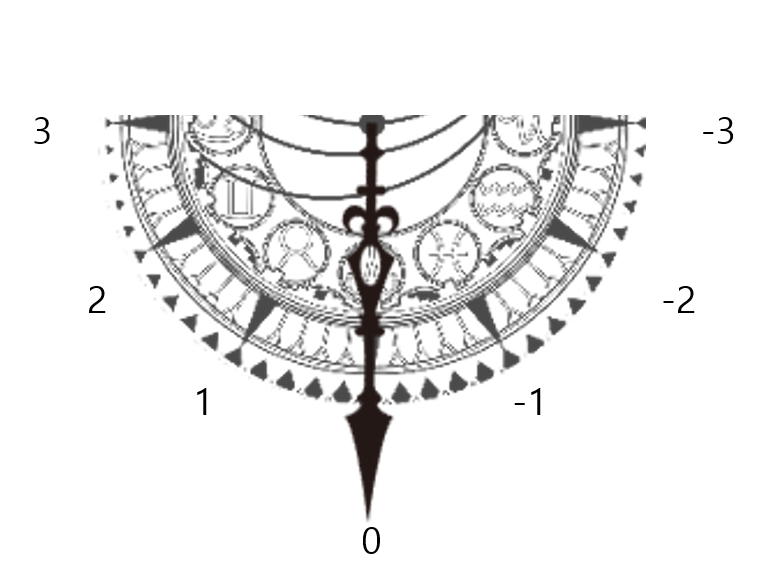

# 천칭시스템기획서_V1_이채연

## 슬라이드 1

천칭 시스템 기획서

이채연

---

## 슬라이드 2

천칭 시스템 정의

역, 정방향 카드 사용에 따른 하이 리스크 하이 리턴, 로우 리스크 로우 리턴의 전략적 요소를 위한 시스템

역방향 사용 = 하이 리스크 하이 리턴

정방향 사용 = 로우 리스크 로우 리턴

---

## 슬라이드 3

천칭 시스템 처리

전투 노드 입장할 때 천칭 시스템 초기화.

-> 플레이어가 스킬 사용

-> 스킬 사용에 따른 증감치에 따라 침의 기울기 실시간 변화

-> 칸에 도달할 시 효과를 정해진 대상에게 즉시 적용

---

## 슬라이드 4

스킬 카드 증감치

스킬의 종류에 따라 정해진 증감량이 있다.

역방향 = 운명 수치 + 10

정방향 = 운명 수치 - 10

상세 수치 레벨링에서 조절 가능 해야함

---

## 슬라이드 5

기울기 표시

칸에 대한 텍스트는 비주얼 적으로 표시하지 않음

한 칸 마다 수치 50을 가짐.

Ex)

0에서 1까지 한 칸 가려면 +50의 운명 수치 필요

0에서 -3까지 세 칸 가려면 -150의 운명 수치 필요

> 이미지는 게임 기획 문서의 일부로 보이는 반원형의 그래픽 요소입니다. 중앙에 위치한 십자가 형태의 축을 중심으로, 여러 개의 원형 패턴과 기어 또는 톱니바퀴 모양의 장식들이 배치되어 있습니다. 

주변에는 숫자가 표시되어 있는데, 위쪽에는 3, 오른쪽에는 -3, 왼쪽에는 2와 1, 아래쪽에는 0, 그리고 오른쪽 아래에는 -1, -2가 위치해 있습니다. 

전체적으로 이 그래픽 요소는 일종의 게임 메커니즘, 스킬 게이지, 또는 스테이터스 조절과 관련된 UI 요소로 사용될 수 있습니다. 각 숫자와 그래픽 요소의 의미는 게임의 맥락에 따라 다를 수 있습니다.

---

## 슬라이드 6

효과

| 칸 | 운명 저항 |
| --- | --- |
| -1 | 아군팀 전체 공격력 수치 8% 증가  아군팀 전체 hp 수치 5% 감소, 아군팀 전체 방어력 수치 5% 감소 |
| -2 | 아군팀 전체 공격력 수치 16% 증가  아군팀 전체 hp 수치 10% 감소, 아군팀 전체 방어력 수치 10% 감소 |
| -3 | 아군팀 전체 공격력 수치 32% 증가  아군팀 전체 hp 수치 20% 감소, 아군팀 전체 방어력 수치 20% 감소 |

| 칸 | 운명 순응 |
| --- | --- |
| 1 | 적에게 데미지를 넣을 때마다 데미지 넣은 캐릭터의 전체 hp의 3% 회복 파티 전체 공격력의 3% 감소 |
| 2 | 적에게 데미지를 넣을 때마다 데미지 넣은 캐릭터의 전체 hp의 6% 회복 파티 전체 공격력의 6% 감소 |
| 3 | 적에게 데미지를 넣을 때마다 데미지 넣은 캐릭터의 전체 hp의 12% 회복 파티 전체 공격력의 12% 감소 |

칸마다 증감량이 2배 씩 늘어난다.

상세 수치 레벨링에서 조절 가능 해야함

---

## 슬라이드 7

효과 계산식

적에게 데미지를 넣을 때마다

-> 적에게 데미지 넣었는지 체크

데미지 넣은 캐릭터의 전체 hp의 3% 회복

-> 데미지를 넣은게 체크가 되었으면 데미지를 넣은 캐릭터의 전체 hp 기준으로 3%의 hp 회복이 즉시 적용.

Ex) 최대 hp가 100인 캐릭터가 해당 효과를 얻으면 3의 hp가 회복 됨.

파티 전체 공격력의 3% 감소

-> 아군팀에 소속된 캐릭터들의 최대 공격력 기준 3% 만큼 공격력 수치 감소

Ex) 아군 팀에 소속 되어 있는 최대 공격력이 100인 캐릭터, 최대 공격력이 600인 캐릭터, 최대 공격력이 300인 캐릭터가 해당 효과를 얻으면 각각 3, 18 , 9의 공격력이 감소함.

상세 수치 레벨링에서 조절 가능 해야함

---
