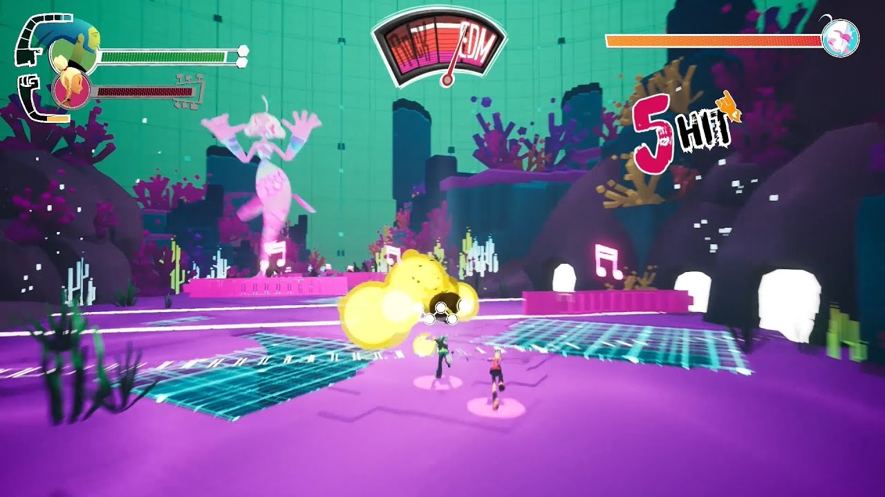

# 천칭컨셉기획서_V1_이채연

## 슬라이드 1

천칭 컨셉 기획서

이채연

---

## 슬라이드 2

천칭이란?

전투 노드에 진입 했을 때 화면 상단에 뜨는 수레바퀴(임시) 모양 시스템

플레이어가 역방향 카드를 사용하면 운명 저항 쪽으로 기울고

정방향 카드를 사용하면 운명 순응 쪽으로 기운다.

저항, 순응 방향에 각각 그라데이션으로 더월드 상징 색, 플레이어 상징색을 넣는다.

다키스트 던전 사기 시스템, 노 스트레이트 로드 락 앤 edm 시스템 레퍼런스

> 이 게임 기획 문서에 포함된 이미지는 하단의 도안처럼 생긴 원형의 일러스트입니다.

가장 바깥쪽 테두리에는 뾰족한 삼각형의 무늬가 일정한 간격으로 반복됩니다. 

그 안쪽에는 숫자가 하나도 없는 원형 시계 모양이 있습니다. 

시계 모형의 중심에는 가로로 길게 뻗어있는 긴 선이 있고, 그 선의 중앙에는 작은 동그라미가 있습니다. 

그리고 이 동그라미의 하단에는 아래로 길게 뻗어있는 화살표 모양의 선이 연결되어 있습니다.

시계 모형의 테두리에는 12개의 숫자가 없는 원형의 공간이 있고, 각각의 공간 안에는 게임에 등장하는 것 같은 무늬가 그려져 있습니다.

시계 모형의 중심에서 바깥쪽을 향하는 4개의 선은 시계의 시침과 분침처럼 생겼지만, 시계 숫자판의 시침과 분침과는 다르게 생긴 것은 2개뿐입니다. 

나머지 2개는 가운데에 있는 동그라미와 연결되어 있습니다.

전체적으로 이 일러스트는 게임의 세계관과 관련된 상징적인 의미를 가진 것으로 추정됩니다.

> 이미지는 게임 화면으로, 여러 가지 시각적 요소와 인터페이스가 포함되어 있습니다. 

상단 왼쪽에는 캐릭터의 모습이 나타납니다. 캐릭터는 녹색과 노란색의 머리를 가지고 있으며, 분홍색 반투명한 원 안쪽에 그려져 있습니다. 이 캐릭터가 나타나는 반투명한 분홍색 원은 흰색 윤곽선으로 된 더 큰 원 안에 위치하며, 이 흰색 윤곽선 원은 검은색과 하얀색 타일로 만들어진 튜브 모양의 구조물에 연결되어 있습니다. 이 튜브 구조물은 왼쪽 상단에서 오른쪽으로 수평으로 뻗어 있습니다. 이 튜브 안에는 녹색과 노란색의 선이 교대로 표시되어 있습니다. 튜브의 오른쪽 끝에는 작은 하얀색 원이 세 개 수평으로 나란히 붙어 있습니다. 이 하얀색 원 아래에는 노란색과 빨간색의 선이 수평으로 표시되어 있습니다.

화면 상단 중앙에는 'EDM'이라는 문자가 포함된 부채꼴 모양의 로고가 있습니다. 이 로고는 분홍색과 빨간색으로 그라데이션을 이룹니다. 로고 아래에 있는 분홍색과 빨간색의 원형 구조물 중앙에는 빨간색 액체가 들어간 유리관처럼 생긴 구조물이 있습니다.

화면 상단 오른쪽에는 주황색의 긴 직사각형이 수평으로 표시되어 있습니다. 이 직사각형 안에는 분홍색과 주황색의 선이 표시되어 있습니다. 직사각형의 오른쪽 끝에는 작은 원이 있습니다. 이 원 안에는 분홍색 머리의 캐릭터가 나타납니다.

화면 중앙에는 보라색의 타일링된 바닥이 있습니다. 바닥에는 네모 격자가 여러 개 보입니다. 격자의 일부 칸에는 밝은 하늘색의 빛나는 선이 나타납니다. 바닥의 왼쪽에는 작은 분홍색 플랫폼이 있고, 그 위에는 음악 음표가 나타납니다.

화면 중앙에는 두 명의 캐릭터가 보입니다. 한 캐릭터는 녹색과 검은색 옷을 입고 있고, 다른 캐릭터는 분홍색과 검은색 옷을 입고 있습니다. 두 캐릭터는 모두 노란색의 빛나는 구체를 공격하는 듯한 자세를 취하고 있습니다.

화면 오른쪽 상단에는 '5 HIT'이라는 문자가 나타납니다. '5'는 분홍색이고 'HIT'는 흰색입니다.

화면의 배경에는 여러 가지의 보라색과 분홍색의 식물과 바위가 보입니다. 화면 왼쪽 상단에는 큰 보라색 바위가 있고, 그 위에는 분홍색의 괴물이 날고 있습니다. 괴물은 여러 개의 팔다리를 가지고 있습니다. 괴물의 뒤에는 녹색의 벽이 있습니다. 벽에는 여러 개의 선이 수직으로 그어져 있습니다.

---

## 슬라이드 3

기울기

세밀한 칸으로 나뉘어진 느낌.

기본적으로 스킬을 쓸 때마다 해당 스킬의 역/정방향 종류에 따라 역/정방향으로 전진한다.

캐릭터 패시브의 영향을 받을 경우 전진하는 칸 수가 달라질 수 있다.

운명

저항

역방향

스킬 사용

운명

순응

운명

저항

운명

순응

> 이 게임 기획 문서에 포함된 도면은 **고리 모양의 아스트롤라베**를 묘사하고 있습니다. 아스트롤라베는 고대 천문학에서 천체의 위치를 측정하고 항법 등에 사용되었던 도구입니다. 이 도면은 여러 가지 기호와 아이콘으로 장식되어 있어 게임의 세계관이나 테마와 관련이 있을 것으로 추정됩니다.

도면의 중앙에는 **태양 또는 달을 상징하는 원형 도형**이 있습니다. 이 원형 도형은 여러 개의 곡선이 교차하며, 마치 **지구와 태양의 궤도**를 나타내는 것처럼 보입니다. 이 원형 도형의 상단에는 **다섯 개의 작은 원**이 원형으로 배치되어 있습니다. 이 작은 원들은 각각 다른 모양으로 디자인되어 있으며, 게임의 다양한 요소나 지역을 상징할 수 있습니다.

원형 도형의 하단에는 **길고 뾰족한 화살표**가 중앙에서 아래로 뻗어져 있습니다. 이 화살표는 아스트롤라베의 **기준점**을 나타내는 것으로 추정되며, 방향을 결정하는 데 중요한 역할을 할 수 있습니다.

원형 도형의 바깥쪽에는 **다각형의 뾰족한 화살표**가 일정한 간격으로 배치되어 있습니다. 이 화살표들은 **시간을 나타내는 시계 방향의 표시**로 사용될 수 있습니다. 또한, 원형 도형의 가장 바깥쪽에는 **작은 삼각형**이 연속적으로 배치되어 있습니다. 이 삼각형들은 아스트롤라베의 **장식적인 요소**로 사용될 수 있습니다.

전체적으로 이 도면은 **고대 천문학의 아스트롤라베를 모티브로 한 게임 내 요소**로 사용될 것으로 보입니다. 이 아스트롤라베는 게임에서 **시간, 방향, 위치를 결정하는 데 중요한 도구**로 사용될 수 있으며, 게임의 세계관이나 테마와 밀접한 관련이 있을 것으로 추정됩니다.

> 이미지는 게임 기획 문서의 일부로 보이는 이미지입니다. 이미지 중앙에는 커다란 원형 도안이 있고, 그 중앙에는 긴 화살표가 아래로 뾰족하게 나와 있습니다.

도안의 중앙에는 가로로 5줄의 곡선이 있고, 그 위로 여러개의 아이콘이 원형으로 배치되어 있습니다. 아이콘은 총 6개로 보이며, 각 아이콘은 다른 모양을 가지고 있습니다. 

아이콘의 상단에는 6개의 마크가 원형으로 배치되어 있습니다. 

커다란 원형 도안의 테두리에는 삼각형 모양의 장식들이 일정한 간격으로 배치되어 있습니다. 원형 도안의 바깥쪽에는 12개의 선이 방사형으로 뻗어져 있으며, 각 선의 끝에는 작은 삼각형이 있습니다. 

이미지에는 텍스트가 포함되어 있지 않습니다.

---

## 슬라이드 4

세계관 연계 컨셉

운명 순응: 로우 리스크, 로우 리턴

정방향 사용 시 해당 방향으로 전진

운명에 순응하여 더 월드가 칭찬하는 느낌

+

기본적인 적의 방해

효과: 딜 넣은 만큼 hp 회복, 공격력 약간 약화

운명

저항

운명

순응

운명

저항

운명

순응

운명 저항: 하이 리스크, 하이 리턴

역방향 사용 시 해당 방향으로 전진

운명에 저항하여 아군팀이 각성하는 느낌

+

더 월드의 방해

효과: 아군팀 hp, 아군 방어력 약화, 공격력 증가.

> 이 게임 기획 문서에 포함된 도면은 원형의 시계 또는 천문도와 같은 모양을 나타내고 있습니다. 도면의 중앙에는 긴 화살표가 아래로 뾰족하게 나와있고, 그 위로 여러 개의 곡선이 가로로 겹겹이 쌓여있는 동그란 형태가 그려져 있습니다. 

화살표가 가리키는 방향은 12시 방향입니다. 

중앙의 동그란 형태를 감싸고 있는 원형 테두리에는 12개의 마름모꼴 도형이 일정한 간격으로 배치되어 있습니다. 각 마름모 안에는 다양한 도안이 그려져 있습니다. 

또한 바깥쪽 테두리에는 삼각형 모양의 도형들이 일정한 간격으로 배치되어 있습니다. 

전체적으로 이 도면은 천문학이나 점성술과 관련된 상징적인 요소를 포함하고 있는 것으로 보입니다.

> 이 게임 기획 문서에 포함된 이미지는 하나의 원형 도면이며, 여러 개의 원이 겹쳐진 형태입니다. 이 도면은 시계나 나침반처럼 생겼지만, 중앙에 위치한 큰 화살표가 아래를 가리키고 있어 방향을 나타내는 용도로 사용된 것으로 추정됩니다.

*   원형 도면의 가장 바깥쪽 테두리에는 작은 삼각형이 일정한 간격으로 배치되어 있습니다. 
*   두 번째 테두리에는 숫자가 아닌, 글자가 원형으로 표시되어 있습니다. 위쪽에 있는 원형의 테두리에는 상단 기준 시계 방향으로 가, 나, 다, 라, 마, 바, 사, 아, 자, 차, 카, 타가 표시되어 있습니다. 
*   세 번째 테두리에는 두 번째 테두리와 동일한 글자가 시계 반대 방향으로 표시되어 있습니다. 
*   네 번째 테두리에는 두 번째, 세 번째 테두리와 동일한 글자가 더 작은 크기로 표시되어 있습니다. 
*   중앙에는 5개의 가로줄이 그어져 있고, 그 위에 다양한 모양의 도안이 그려져 있습니다. 
*   원형의 중심에는 아래로 뾰족하게 나온 화살표가 있습니다.

---

## 슬라이드 5

세계관 연계 컨셉

중립: 안정적 플레이

저항과 순응을 반복하며 운명 변동이 없는 상태

효과: 아무 효과 없음

운명

저항

운명

순응

> 이 게임 기획 문서에 포함된 도면은 원형의 시계 또는 천문학적 도구로 보이는 일종의 아스트롤라베(astrolabe)입니다.

가장 바깥쪽 테두리에는 작은 삼각형들이 일정한 간격으로 배치되어 있습니다. 이 삼각형들은 아스트롤라베의 가장자리로 사용되거나, 방향이나 시간 등을 표시하는 기능적 요소로 추정됩니다.

그 안쪽에는 숫자와 기호가 표시된 원형 띠가 있습니다. 이 띠는 시간이나 날짜를 표시하는 것으로 추정되며, 숫자와 기호들은 시간, 날짜 또는 천문학적 데이터를 나타낼 수 있습니다.

중앙에는 여러 개의 곡선이 교차하며, 가운데에는 십자가 모양의 선이 있고 그 아래에는 뾰족한 화살표 모양의 선이 있습니다. 이 십자가와 화살표 모양의 선은 아스트롤라베의 중심축을 나타내는 것으로 추정되며, 방향이나 기준점을 설정하는 데 사용될 수 있습니다.

또한, 아스트롤라베의 중앙 부분에는 여러 개의 작은 원이나 타원이 배치되어 있습니다. 이 작은 원이나 타원들은 아마도 행성이나 별의 위치를 나타내는 것으로 추정됩니다.

전체적으로 이 도면은 천문학적 관찰이나 항법, 시간 측정 등을 위한 도구로 사용되었을 것으로 추정되며, 게임 기획 문서에서는 이 아스트롤라베를 활용하여 게임의 세계관이나 시스템을 설명하는 데 사용되고 있을 수 있습니다.

---
