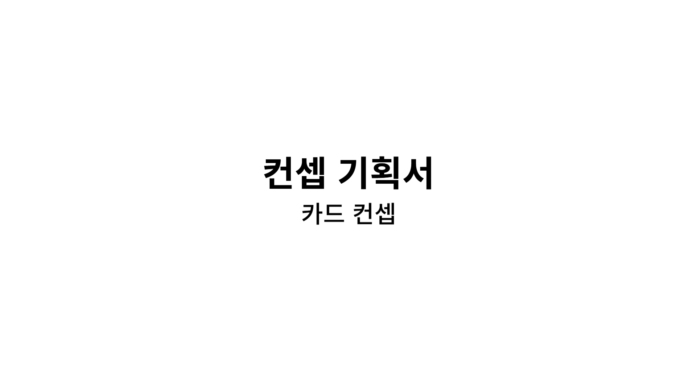
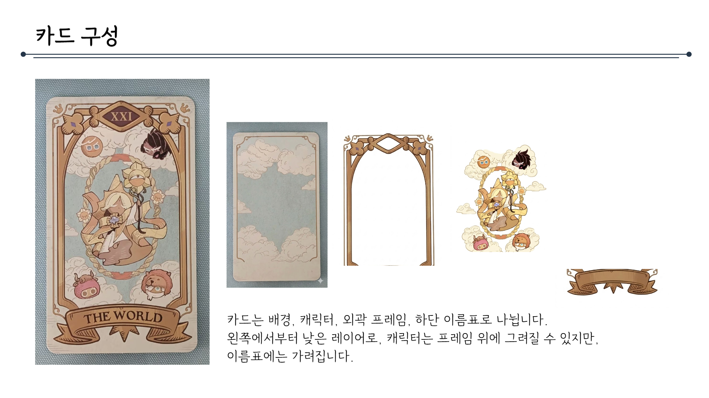
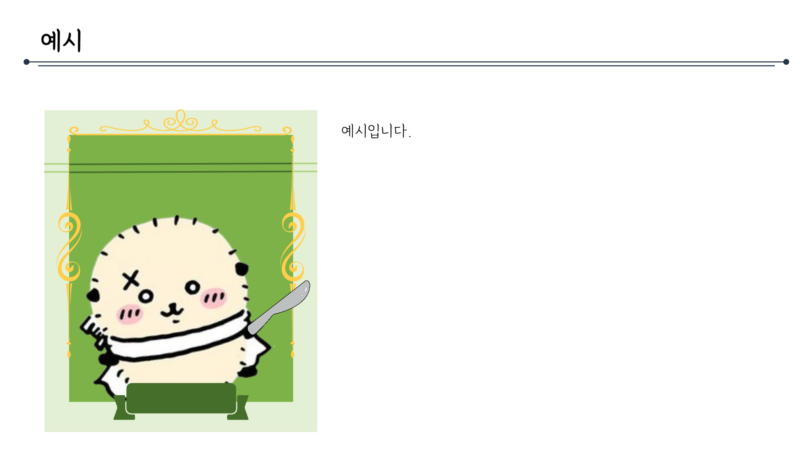
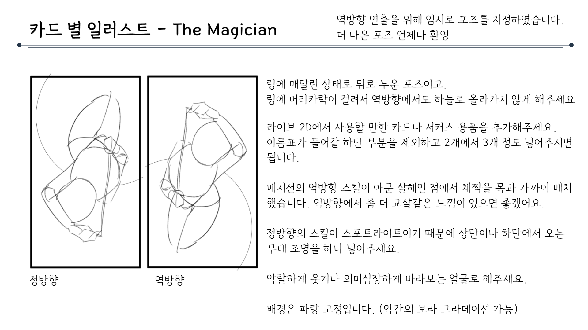
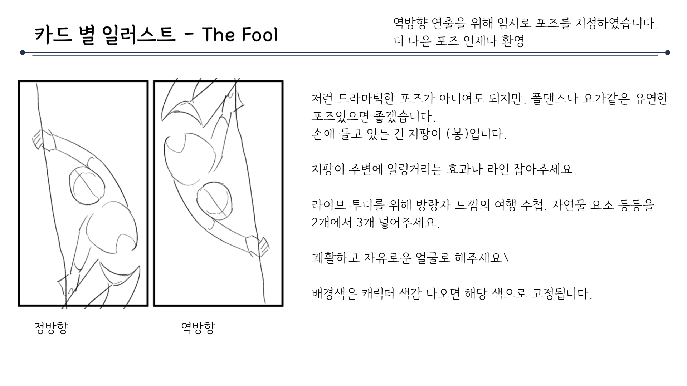
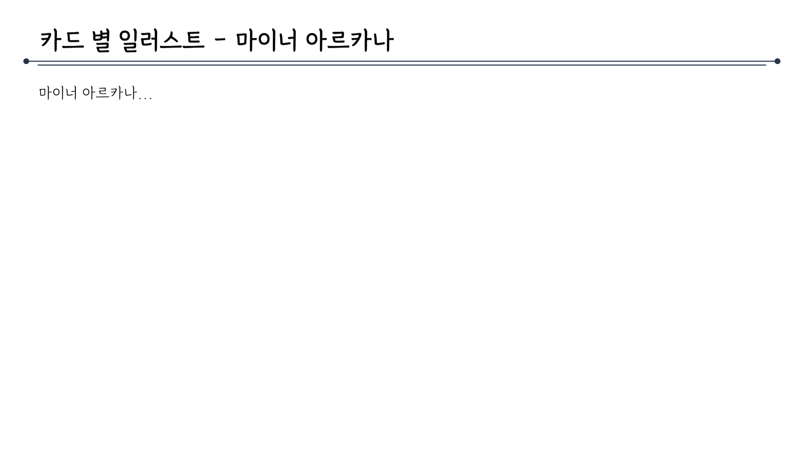
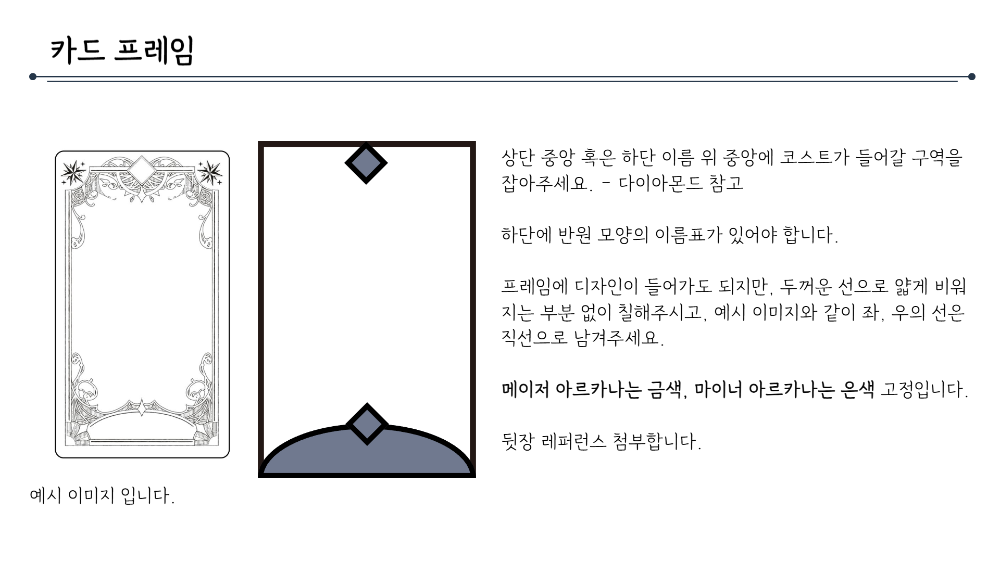
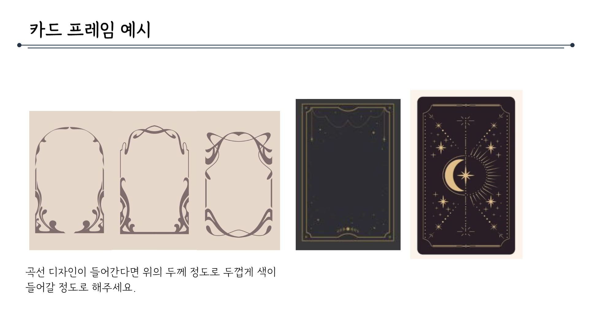
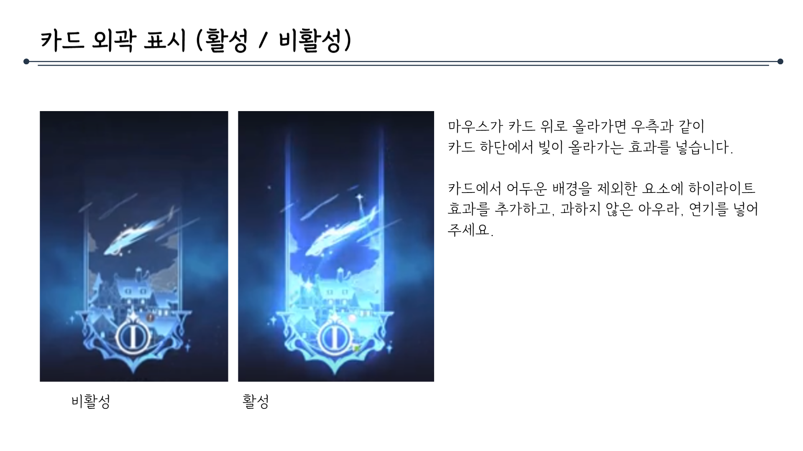
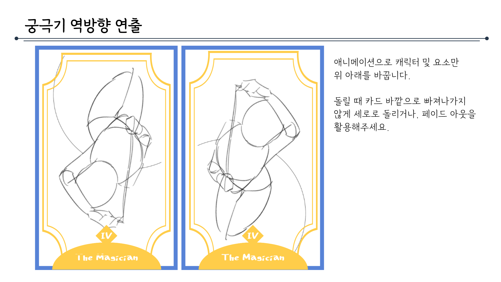

# 카드컨셉문서_V2_김주연

## 슬라이드 1

> 이미지는 흰색 배경에 검은색 텍스트가 포함된 간단한 구도입니다. 

가운데 정렬된 두 줄의 텍스트가 있습니다. 

첫 번째 줄에는 큰 글씨로 **"컨셉 기획서"**가 적혀 있고, 

두 번째 줄에는 조금 더 작은 글씨로 **"카드 컨셉"**이라고 적혀 있습니다. 

이미지에는 아이콘, 캐릭터, 다이어그램이나 UI 요소 등은 포함되어 있지 않습니다.

---

## 슬라이드 2

> 이미지는 게임 기획 문서의 일부로, 카드 구성에 대한 설명입니다. 이미지의 구성 요소는 다음과 같습니다.

*   **타이틀**: 
    *   문서의 제목은 "카드 구성"입니다. 
    *   제목 오른쪽에는 긴 가로선이 있습니다.
*   **카드**: 
    *   카드의 레이아웃은 배경, 캐릭터, 외각 프레임, 하단 이름표로 나뉩니다. 
    *   왼쪽에서부터 낮은 레이어로, 캐릭터는 프레임 위에 그려질 수 있지만, 이름표에는 가려집니다.
    *   카드는 세로로 길쭉한 직사각형 모양이며, 배경은 하늘색입니다. 
    *   프레임 안에는 여러 캐릭터가 그려져 있습니다. 
    *   프레임의 위쪽에는 로마 숫자 "XXI"가 있고, 아래쪽에는 "THE WORLD"라는 텍스트가 있습니다.
*   **프레임**: 
    *   프레임은 아치형의 구조물입니다. 
    *   프레임의 세부 디자인은 꽃과 리본으로 구성되어 있습니다. 
*   **레이어**: 
    *   프레임과 캐릭터, 이름표가 분리되어 있습니다. 
*   **아이콘**: 
    *   이름표의 디자인은 두루마리 모양입니다. 
    *   프레임 위쪽에는 여러 개의 작은 캐릭터가 그려져 있습니다.

---

## 슬라이드 3

> 이미지는 게임 기획 문서의 일부로, 카드 배경에 대한 설명과 이미지가 포함되어 있습니다.

*   **제목:** 카드 배경
*   **이미지:** 
    *   이미지 중앙에 하얀 머리를 가진 남자가 등장합니다. 
    *   남자는 흰색의 긴팔 옷과 검은 색의 서스펜더, 검은 색의 바지, 그리고 남자의 눈은 붉은 색입니다. 
    *   남자의 왼쪽에는 종이비행기가 여러 대 보입니다. 
    *   이미지 하단에는 Wheel of Fortune이라는 문구가 적혀있는 깃발이 있습니다. 
    *   이미지의 배경은 보라색과 푸른색의 조합이며, 금색 액자가 그려져 있습니다. 
    *   이미지 오른쪽 하단에는 붉은 색의 한자가 적혀있습니다. 
*   **설명:**
    *   이미지 오른쪽에 설명이 있습니다. 
    *   설명의 내용은 이미지와 같이 단색(그라데이션 포함), 빛 표현을 위한 라인, 아르누보 스타일의 배경 요소는 가능합니다. 
    *   배경의 프레임 바깥쪽은 배경 색보다 어두운 같은 계열의 단색으로 밀어주세요. 요소, 라인 전부 같은 색으로 처리해서 외곽선 느낌이 나면 됩니다. 단색/배경 색과 구분이 되어야 합니다.

---

## 슬라이드 4

> 이미지는 게임 기획 문서의 일부로, 다음과 같은 요소들을 포함하고 있습니다.

*   **제목:** 문서의 상단 왼쪽에는 "예시"라는 제목이 있습니다. 
*   **수평선**: 제목 오른쪽에는 긴 수평선이 그어져 있습니다. 
*   **패널**: 이미지 왼쪽에는 녹색 패널이 있습니다. 패널은 연녹색 테두리 안에 위치하며, 노란색으로 된 꾸밈 요소가 상단에 있습니다. 패널 내부에는 흰색과 노란색의 귀여운 동물 캐릭터가 칼을 들고 있습니다. 
*   **텍스트:** 패널 오른쪽에는 "예시입니다."라는 텍스트가 있습니다. 
*   **배경:** 이미지의 배경은 흰색입니다.

이러한 요소들이 포함된 이 이미지는 게임 기획 문서의 일부로서, 게임의 캐릭터나 UI 요소, 또는 게임의 세계관 등을 소개하기 위한 목적으로 사용될 수 있습니다.

---

## 슬라이드 5

> 해당 이미지는 게임 기획 문서의 일부로, "카드 별 일러스트 - wheel of fortune"에 대한 설명입니다. 

문서의 레이아웃은 다음과 같습니다. 

*   문서의 상단에는 "카드 별 일러스트 - wheel of fortune"이라는 제목이 표시되어 있습니다. 
*   문서의 오른쪽 상단에는 "역방향 연출을 위해 임 시로 포즈를 지정하였습니다. 더 나은 포즈 언제나 환영"이라는 부가 설명이 있습니다. 
*   문서의 왼쪽에는 두 장의 스케치 이미지가 있습니다. 
*   이미지의 왼쪽에는 큰 사이즈의 스케치 이미지가 있고, 오른쪽에는 작은 사이즈의 스케치 이미지가 있습니다. 
*   큰 사이즈의 스케치 이미지 아래에는 "정방향"이라는 단어가, 작은 사이즈의 스케치 이미지 아래에는 "역방향"이라는 단어가 표시되어 있습니다. 
*   문서의 오른쪽에는 이미지와 관련된 설명이 있습니다. 
*   문서의 하단에는 가로로 긴 선이 표시되어 있습니다.

두 장의 스케치 이미지를 보면, 두 이미지 모두에 커다란 수레바퀴가 그려져 있는 것을 알 수 있습니다. 수레바퀴를 돌리는 사람의 모습도 함께 그려져 있습니다. 

큰 사이즈의 스케치 이미지(정방향)에 포함된 요소는 다음과 같습니다.

*   화면 왼쪽에 수레바퀴를 돌리는 사람의 모습이 그려져 있습니다. 
*   사람의 머리 위로 "스케치 방향"이라는 단어가 적혀 있고, 화살표가 우측을 가리키고 있습니다. 
*   수레바퀴의 오른쪽에는 "수레바퀴 방향"이라는 단어가 적혀 있고, 화살표가 좌측을 가리키고 있습니다. 
*   수레바퀴의 바퀴살은 6개이고, 바퀴살이 아닌 나머지 부분에는 '?'로 표시된 부분이 여러 곳에 있습니다. 

작은 사이즈의 스케치 이미지(역방향)에 포함된 요소는 다음과 같습니다.

*   화면 중앙에 수레바퀴가 있고, 그 뒤로 조력자로 추정되는 인형이 수레바퀴의 회전 방향과 반대 방향으로 달리고 있는 모습이 그려져 있습니다. 
*   수레바퀴의 바퀴살은 5개입니다. 

문서 오른쪽에 있는 이미지와 관련된 설명은 다음과 같습니다.

*   수레바퀴 동그란 부분(손잡이 제외)이 3분의 1까지 작아져야 합니다. 
*   조력자 인형 더 커져야 합니다. 
*   조력자 인형은 수레바퀴 회전과 반대 방향으로 가야 합니다. 
*   표정은 자유입니다. 
*   배경은 초록색 고정입니다. 

즉, 정방향 이미지에서 수레바퀴를 돌리는 사람의 모습과, 역방향 이미지에서 수레바퀴를 뒤에서 민다는 듯한 조력자 인형의 모습이 함께 그려져 있습니다.

---

## 슬라이드 6

> 이미지는 게임 기획 문서의 일부로, "카드 별 일러스트 - Justice"라는 제목이 포함되어 있습니다. 문서의 레이아웃과 구조는 다음과 같습니다.

*   **제목**: 문서의 상단에는 "카드 별 일러스트 - Justice"라는 제목이 포함되어 있습니다. 
*   **설명**: 제목 오른쪽 상단에는 "역방향 연출을 위해 임시로 포즈를 지정하였습니다. 더 나은 포즈 언제나 환영"이라는 설명이 포함되어 있습니다. 
*   **이미지**: 문서의 왼쪽에는 두 장의 스케치 이미지가 나란히 배치되어 있습니다. 각 이미지는 정면과 후면의 모습을 보여주고 있습니다. 이미지는 캐릭터가 손에 무기를 들고 있는 모습을 표현하고 있습니다. 각 이미지의 왼쪽 하단에는 '정방향', '역방향'이라는 단어가 포함되어 있습니다. 
*   **텍스트**: 문서의 오른쪽에는 이미지에 대한 세부적인 설명이 포함되어 있습니다. 텍스트는 다음과 같습니다.

    *   카드 안에서 저스티스의 봉대가 없던 모습이 같이 나오면 좋겠습니다. 옆의 임시 지정 포즈에서는 검에 비친 거꾸로 된 저스티스로 해주세요.
    *   봉대가 없는 저스티스가 원본과 방향이 다르게 있다면 어떤 포즈, 요소 상관없습니다. 다만 정방향에 원본이 정방향 포즈(거꾸로 x)로 있게 해주세요.
    *   진지한 표정으로 넣어주세요!
    *   천칭이 들어가도 됩니다만 대검보다는 비중을 작게 잡아주세요. 요소보단 라인이 위주 배경 잡아주세요.
    *   배경은 붉은색 고정입니다.

요약하면, 이 문서는 게임의 카드 일러스트에 대한 설명과 이미지를 포함하고 있습니다. 일러스트는 정면과 후면의 모습을 보여주며, 캐릭터의 자세와 표정, 배경 등에 대한 세부적인 지침이 포함되어 있습니다.

---

## 슬라이드 7

> 이 문서는 게임 기획 문서의 일부로, "The Magician"이라는 카드의 일러스트에 대한 지침을 제공합니다. 문서의 레이아웃과 구조는 다음과 같습니다.

*   **제목**: 문서의 제목은 "카드 별 일러스트 - The Magician"이며, 제목 위쪽에는 가는 선이 가로로 그어져 있습니다.
*   **이미지**: 문서의 왼쪽에는 두 개의 그림이 나란히 배치되어 있습니다. 두 그림 모두 인물과 링을 표현하고 있습니다. 왼쪽 그림은 정방향이고, 오른쪽 그림은 역방향입니다. 두 그림 모두 인물과 링의 형태를 나타내는 윤곽선으로 구성되어 있습니다. 
*   **설명**: 문서의 오른쪽에는 이미지와 관련된 설명이 있습니다. 설명은 여러 단락으로 나누어져 있으며, 각 단락은 특정한 내용을 담고 있습니다.

설명 내용을 요약하면 다음과 같습니다.

*   링에 매달린 상태로 뒤로 누운 포즈이고, 링에 머리카락이 걸려서 역방향에서도 하늘로 올라가지 않게 해주세요.
*   라이브 2D에서 사용할 만한 카드나 서커스 용품을 추가해 주세요. 이름표가 들어갈 하단 부분을 제외하고 2개에서 3개 정도 넣어주시면 됩니다.
*   매지션의 역방향 스킬이 아군 살해인 점에서 착정을 목과 가까이 배치했습니다. 역방향에서 좀 더 교살 같은 느낌이 있으면 좋겠어요.
*   저박한 스킨이 소프트라이팅이기 때문에 사다리나 하단에서 오는 무대 조명을 하나 넣어주세요.
*   악랄하게 웃거나 의심심장하게 바라보는 얼굴로 해주세요.
*   배경은 파랑 고정입니다. (약간의 보라 그라데이션 가능)

이러한 레이아웃과 구조를 통해, 이 문서는 "The Magician" 카드의 일러스트에 대한 구체적인 지침을 제공하고 있습니다.

---

## 슬라이드 8

> 이미지는 게임 기획 문서의 일부로, '카트 별 일러스트 - The Fool'이라는 제목이 있습니다. 이미지의 주요 구성 요소는 다음과 같습니다.

*   **제목:** "카트 별 일러스트 - The Fool"
*   **설명:** 이미지 상단에는 "역방향 연출을 위해 임의로 포즈를 지정하였습니다. 더 나은 포즈 언제나 환영"이라는 설명이 있습니다. 
*   **이미지:** 두 개의 스케치 이미지가 나란히 배치되어 있습니다. 두 이미지 모두 인물과 날개가 그려져 있습니다. 
    *   **왼쪽 이미지:** 인물은 왼쪽을 보고 있으며, 왼팔을 뻗고, 오른손에 무엇인가를 들고 있습니다. 
    *   **오른쪽 이미지:** 인물은 정면이 아닌 뒤를 보고 있습니다. 
*   **레이아웃:** 이미지는 정면과 역방향으로 구분되어 있습니다. 
*   **텍스트:** 이미지 오른쪽에는 구체적인 인물 일러스트에 대한 설명이 있습니다. 
    *   "저런 드라마틱한 포즈가 아니어도 되지만, 폴댄스나 요가 같은 유연한 포즈였으면 좋겠습니다."
    *   "손에 들고 있는 것은 지팡이 (복)입니다."
    *   "지팡이 주변에 일렁거리는 효과나 라인 잡아주세요."
    *   "라이브 투디를 위해 방랑자 느낌의 여행 수첩, 자연물 요소 등을 2개에서 3개 넣어주세요."
    *   "쾌활하고 자유로운 얼굴로 해주세요."
    *   "배경색은 캐릭터 색감 나오면 해당 색으로 고정됩니다."

---

## 슬라이드 9

> 이미지는 게임 기획 문서의 일부로, "Judgement"라는 카드를 위한 일러스트 가이드입니다. 

## 레이아웃
- **제목**: 
  - "카드 별 일러스트 - Judgement"라는 제목이 중앙 상단에 위치해 있습니다. 
  - 제목 오른쪽에는 "더 나은 포즈 언제나 환영"이라는 문구가 있습니다.

- **가이드 텍스트**: 
  - 이미지 오른쪽에 설명하는 텍스트가 있습니다.

- **스케치**: 
  - 이미지의 왼쪽과 중앙에 나란히 배치된 두 개의 스케치가 있습니다.

## 스케치 설명
- **캐릭터**: 
  - 한 손에 천칭을 들고 있는 캐릭터의 스케치입니다. 
  - 다른 손에는 꽃을 들고 있습니다.

- **디테일**: 
  - 한쪽 천칭에는 아네모네를 배치할 수 있습니다. 
  - 부정의 팬 라더니 기호에 따라 천칭에 올릴 물건을 교체할 수 있습니다.

- **얼굴**: 
  - 자신만만한 얼굴에 조또 오니짱 또는 똘똘이 포즈로 부탁했습니다.

- **배경**: 
  - 배경은 노란색으로 고정입니다.

## 종합
이 가이드는 Judgement 카드의 일러스트를 위한 것으로, 캐릭터가 천칭과 꽃을 들고 있는 자세와 디테일에 대한 지침을 제공하고 있습니다.

---

## 슬라이드 10

> 해당 이미지는 게임 기획 문서의 일부로, "카드 별 일러스트 - 마이너 아르카나"에 대한 설명입니다.

*   제목: "카드 별 일러스트 - 마이너 아르카나"
*   부제목: "마이너 아르카나..."
*   레이아웃: 
    *   가로로 긴 선이 중앙에 위치하며, 선의 왼쪽과 오른쪽에는 작은 검은 점이 있습니다.
    *   선의 왼쪽에는 부제목 "마이너 아르카나..."가 있습니다.

이 설명은 이미지의 콘텐츠와 레이아웃을 상세하게 기술하고 있습니다.

---

## 슬라이드 11

> 이미지는 게임 기획 문서의 일부로, 카드 프레임에 대한 설명입니다. 

*   **제목**: 이미지 상단에는 '카드 프레임'이라는 제목이 있습니다.
*   **카드 프레임 디자인**: 이미지 왼쪽에는 카드 프레임의 디자인 예시가 있습니다. 이 카드는 직사각형 모양이며, 테두리에는 꽃, 나비 등의 패턴이 장식되어 있습니다. 
*   **카드 프레임 구조**: 이미지 오른쪽에는 카드 프레임의 구조를 나타내는 도형이 있습니다. 이 도형은 직사각형이며, 상단 중앙에는 마름모 모양의 영역이 있고, 하단에는 반원 모양의 영역이 있습니다. 
*   **텍스트**: 이미지 오른쪽에는 카드 프레임에 대한 설명이 있습니다. 
    *   상단 중앙 혹은 하단 이름 위 중앙에 코스트가 들어갈 구역을 잡아주세요. - 다이아몬드 참조
    *   하단에 반원 모양의 이름표가 있어야 합니다.
    *   프레임에 디자인이 들어가도 되지만, 두꺼운 선으로 앞게 비워 지는 부분 없이 칠해주시고, 예시 이미지와 같이 좌, 우의 선은 직선으로 남겨주세요.
    *   메이저 아르카나는 금색, 마이너 아르카나는 은색 고정입니다.
    *   뒷장 레퍼런스 첨부합니다.

*   **레이아웃**: 이미지는 왼쪽에 카드 프레임 디자인 예시와 구조를 나타내는 도형을 배치하고, 오른쪽에 카드 프레임에 대한 설명을 배치하여, 카드 프레임에 대한 이해를 돕고 있습니다.

---

## 슬라이드 12

> 이미지는 게임 기획 문서의 일부로, 카드 프레임에 대한 예시입니다. 

문서의 레이아웃과 구조는 다음과 같습니다.

*   제목: 문서의 상단에 **카드 프레임 예시**라는 제목이 있습니다.
*   수평선: 제목 아래에 긴 수평선이 그어져 있습니다.
*   카드 프레임 예시: 이미지의 왼쪽에는 세 가지 다른 카드 프레임 디자인이 나란히 표시되어 있습니다. 이 프레임은 아트 데코 스타일의 장식적인 테두리 디자인을 가지고 있습니다. 
*   완성된 카드 프레임: 이미지의 오른쪽에는 두 장의 완성된 카드가 나란히 표시되어 있습니다. 왼쪽 카드는 검은 배경에 금색 테두리가 있고, 오른쪽 카드는 달과 별이 그려진 밤하늘을 배경으로 가지고 있습니다.

문서의 하단에는 *곡선 디자인이 들어간다면 위의 두께 정도로 두껍게 색이 들어갈 정도로 해주세요.* 라는 설명이 있습니다. 

이러한 레이아웃과 구조는 게임의 카드 디자인에 대한 구체적인 지침이나 예시를 제공하기 위한 것으로 보입니다.

---

## 슬라이드 13

> 이미지 중앙에 가로로 세 장의 카드를 비롯해, 카드에 담긴 이미지, 그리고 카드 우측에 카드와 관련된 설명이 포함되어 있습니다.

### 이미지

*   **카드**

    *   이미지 중앙에는 가로로 세 장의 카드가 있습니다. 각 카드의 크기는 가로 90픽셀, 세로 220픽셀입니다. 
    *   **카드 1**

        *   카드의 배경은 밝은 노란색입니다. 
        *   카드 위쪽에는 "EVIL EYE"라는 문구가 있고, 카드 아래쪽에도 동일한 문구가 있습니다. 
        *   카드에는 달과 해, 눈, 별 등의 아이콘과 함께 손이 그려져 있습니다. 
    *   **카드 2**

        *   카드의 배경은 짙은 갈색입니다. 
        *   카드에는 해와 손이 그려져 있습니다. 
        *   손은 짙은색과 밝은색으로 그려져 있습니다. 
    *   **카드 3**

        *   카드의 배경은 짙은 남색입니다. 
        *   카드에는 달, 뿔, 왕관, 손, 컵 등의 아이콘이 그려져 있습니다. 
*   **아이콘**

    *   이미지 상단에는 게임 기획 문서의 일부임을 나타내는 문구가 있습니다. 
    *   이미지 하단에는 가로로 긴 선이 있습니다. 
*   **텍스트**

    *   이미지 우측에는 카드와 관련된 설명이 포함되어 있습니다. 
    *   첫 문단은 카드에 포함되어야 하는 요소에 대한 설명입니다. 
    *   두 번째 문단은 카드에 추가되어야 하는 요소에 대한 설명입니다. 
    *   세 번째 문단은 카드의 구성에 대한 설명입니다. 
    *   네 번째 문단은 카드의 색상에 대한 설명입니다. 

### 레이아웃

*   이미지 상단에는 게임 기획 문서의 일부임을 나타내는 문구가 있고, 이미지 중앙에는 세 장의 카드가 있습니다. 
*   이미지 우측에는 카트에 대한 설명이 포함되어 있습니다. 
*   이미지 하단에는 가로로 긴 선이 있습니다. 
*   카드의 레이아웃은 위에서부터 아래로 카드 1, 카드 2, 카드 3의 순으로 배치되어 있습니다. 
*   각 카드는 동일한 크기로 그려져 있습니다.

---

## 슬라이드 14

> 해당 이미지에는 게임 기획 문서의 일부로 추정되는 카드의 예시 디자인이 포함되어 있습니다. 이미지의 레이아웃과 구조, 포함된 텍스트와 시각적 요소에 대한 상세한 설명은 다음과 같습니다.

### **상단 텍스트 및 레이아웃**
- **텍스트**: 
  - 이미지 상단에는 **"카드 예시"**라는 한국어 텍스트가 있습니다.
  - 이 텍스트는 중앙에 위치하며, 텍스트의 왼쪽에는 긴 가로선이 그려져 있습니다. 
  - 선의 오른쪽 끝에는 작은 검은 점이 있습니다.

### **카드 디자인**
이미지에는 두 장의 카드가 나란히 배치되어 있습니다. 각 카드는 다음과 같은 특징을 가지고 있습니다.

#### **카드 1 (왼쪽)**
- **프레임**: 
  - 프레임은 바깥쪽에 **파란색** 테두리가 있고, 안쪽에 **노란색** 테두리가 있습니다.
  - 네 개의 모서리는 둥근 장식 모양입니다.
- **그림**: 
  - 카드는 인물(마법사)의 스케치로, 윤곽만 그려진 인물과 손이 그려져 있습니다.
  - 인물은 아래쪽에 **"IV"**라는 숫자가 있고, 그 아래 노란색 반원형 영역에 **"The Magician"**이라는 영문 텍스트가 흰색으로 표시되어 있습니다.

#### **카드 2 (오른쪽)**
- **프레임**: 
  - 동일한 디자인으로, 파란색과 노란색 테두리가 있습니다.
- **그림**: 
  - 두 개의 검은 손이 카드를 뒤집어 놓은 모습이 그려져 있습니다.
  - 손가락 사이에서 카드와 다이아몬드 모양의 오브젝트가 떠 있습니다.
  - 카드에는 조커 카드의 앞면과 유사한 디자인이 그려져 있습니다.

### **종합 설명**
- 이 디자인은 타로 카드 중 하나인 **'The Magician (마법사)'** 카드를 예시로 보여 주고 있습니다.
- 왼쪽 카드는 기본적인 구도와 배치를 보여 주는 스케치 버전이며, 오른쪽 카드는 구체적인 그래픽 요소가 포함된 완성된 버전으로 보입니다.
- 게임에서 사용되는 카드의 시각적 스타일과 레이아웃을 미리 계획하고 논의하기 위한 자료로 활용된 것으로 추정됩니다.

---

## 슬라이드 15

> 이미지는 게임 기획 문서의 일부로, 카드 외관 표시(활성/비활성)에 대한 설명입니다.

*   제목: "카드 외관 표시 (활성 / 비활성)"
*   이미지: 두 개의 이미지가 나란히 배치되어 있습니다. 
    *   왼쪽 이미지: 비활성 상태의 카드를 나타냅니다. 
        *   배경은 짙은 파란색이며, 카드 중앙에는 하얀색의 배가 그려져 있습니다. 
        *   배의 뒤로는 달과 별들이 보입니다. 
        *   카드 하단에는 빛나는 원형의 로고가 있습니다. 
    *   오른쪽 이미지: 활성 상태의 카드를 나타냅니다. 
        *   배경은 짙은 파란색이며, 카드 중앙에는 하얀색의 배가 그려져 있습니다. 
        *   배의 뒤로는 달과 별들이 보입니다. 
        *   카드 하단에는 빛나는 원형의 로고가 있습니다. 
        *   카드 하단에서 빛이 올라오는 효과가 있습니다.
*   텍스트: 
    *   "마우스가 카드위로 올라가면 우측과 같이 카드 하단에서 빛이 올라가는 효과를 넣습니다."
    *   "카드에서 어두운 배경을 제외한 요소에 하이라이트 효과를 추가하고, 과하지 않은 아우라, 연기를 넣어주세요."
*   레이아웃: 
    *   이미지는 나란히 배치되어 있으며, 텍스트는 이미지 오른쪽에 배치되어 있습니다. 
    *   레이아웃은 깔끔하고 정돈되어 있으며, 가독성이 뛰어납니다.

---

## 슬라이드 16

> 해당 이미지에는 게임 기획 문서의 일부로 보이는 두 장의 카드 일러스트 레이아웃이 포함되어 있습니다. 

### 이미지 레이아웃 

*   페이지 상단에는 **"궁극기 역방향 연출"**이라는 타이틀과 함께 가는 선이 가로로 그어져 있습니다. 
*   선 아래로 **파란색과 노란색의 테두리**로 둘러싸인 카드 일러스트 2개가 나란히 배치되어 있습니다. 
*   각 카드에는 **중앙에 스케치 형태의 캐릭터**가 그려져 있고, 하단에는 **노란색의 반원형**이 있으며, 그 안에 **"IV The Magician"**이라는 문구가 적혀 있습니다. 
*   카드의 테두리는 **모서리가 둥근 직사각형**으로, 파란색 테두리 안에 노란색 테두리가 또 하나 들어간 형태입니다. 
*   테두리의 상단과 하단 모서리는 **장식적인 디자인**이 추가되어 있습니다. 
*   페이지 우측에는 **세 줄의 설명문**이 포함되어 있습니다.

### 텍스트 

*   페이지 상단: 궁극기 역방향 연출
*   카드 하단: IV The Magician 
*   우측 설명문: 
    *   애니메이션으로 캐릭터 및 요소만 위아래를 바꿉니다.
    *   돌릴 때 카드 바깥으로 빠져나가지 않게 새로 돌리거나, 페이드 아웃을 활용해주세요.

### 요약 

두 종류의 카드 일러스트 레이아웃이 포함된 게임 기획 문서입니다. 각 카드는 동일한 레이아웃과 디자인을 가지고 있지만, 내부의 캐릭터 스케치는 다릅니다. 문서에는 각 카드의 애니메이션과 관련한 지시사항도 포함되어 있습니다.

---
