# 캐릭터비주얼컨셉_V1_이채연

## 슬라이드 1

캐릭터 비주얼 컨셉

---

## 슬라이드 2

이 문서를 읽을 때..

모든 것은 수정될 수 있습니다.

궁금한 점이 있으면 언제든 담당자 이채연에게 연락 부탁드립니다. (새벽에도  OK )

캐릭터 별 나이는 모두 외형을 기준으로 합니다.

이채연 010 2988 7090

---

## 슬라이드 3

### 주인공

| 항목 | 내용 |
| --- | --- |
| 이름 | 휠 오브 포춘 |
| 성별 | 여성 |
| 키/나이 | 165cm/19세 |
| 체형 | 슬랜더, 평평한 가슴. |
| 성격 | 안정형 여친, 포용력 넓고 무던, 먼저 다가가진 않음. |
| 말투 |  |
| 역할 | 주인공 |

> 해당 이미지에는 한 명의 캐릭터가 등장합니다. 

*   캐릭터의 상반신이 묘사되어 있습니다. 
*   캐릭터는 검은색의 모자를 쓰고 있습니다. 
*   캐릭터의 머리카락은 왼쪽이 짙은 회색, 오른쪽이 밝은 회색입니다. 
*   캐릭터의 눈동자는 녹색입니다. 
*   캐릭터는 검은색의 자켓을 입고 있습니다. 
*   자켓에는 푸른색의 테두리가 있습니다. 
*   자켓 앞면에는 6개의 단추와 푸른색의 띠가 있습니다. 
*   자켓 안쪽에는 회색의 꽃 무늬가 있습니다. 
*   캐릭터는 하얀색의 칼라를 착용하고 있습니다. 
*   칼라 안에는 보라색의 보석이 박힌 브로치가 있습니다. 
*   배경은 회색이며, 배경에는 글씨가 일부 보입니다. 
*   이미지 오른쪽 하단에는 주황색의 둥근 형태가 있습니다.

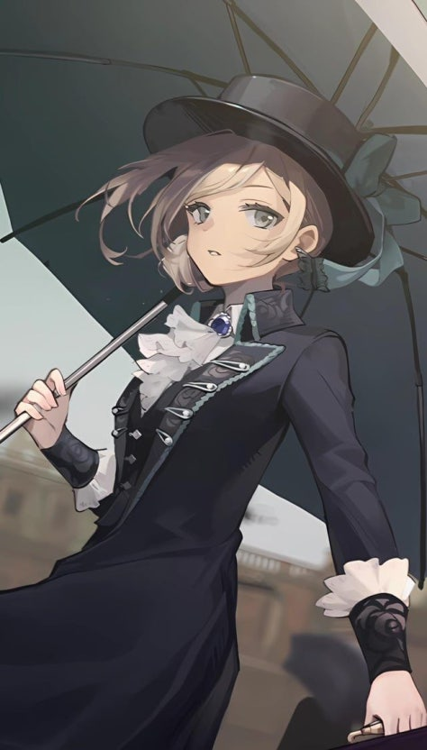

> 이미지는 애니메이션 스타일의 일러스트레이션으로, 여성 캐릭터가 우산을 들고 있는 모습을 그리고 있습니다.

*   캐릭터: 여성 캐릭터는 짧은 갈색 머리와 녹색 눈을 가지고 있습니다. 그녀는 검은색 모자를 쓰고 있으며, 모자 뒤에는 리본이 묶여 있습니다. 캐릭터는 검은색 재킷과 흰색 블라우스, 그리고 긴 치마를 입고 있습니다. 재킷에는 흰색 프릴이 달려 있으며, 재킷 앞면에는 장식적인 요소가 있습니다. 
*   우산: 캐릭터는 검은색 우산를 들고 있습니다. 우산의 손잡이는 은색이며, 우산 위쪽에는 금색의 뼈대가 여러 개 있습니다. 
*   배경: 배경은 도시의 거리로 추정됩니다. 건물의 윤곽이 희미하게 보이며, 하늘은 흐립니다.

전체적으로 이 일러스트레이션은 비 오는 날의 도시를 배경으로 한 여성 캐릭터를 묘사하고 있습니다. 캐릭터의 우산과 옷차림, 그리고 배경의 표현을 통해 그녀가 처한 상황을 표현하고 있습니다.

---

## 슬라이드 4

### 주인공

#### 골반 너무 넓지 않은

#### 여캐 체형

#### 손목, 발목 얇음

#### 얼굴이 좀 평범해서

#### 옷이 좀 과캐디여도 좋을 듯

#### 르네상스 해적? 같은 느낌

#### 팔 쪽이 강조 되는 느낌

#### 머리 장식이 있어도

#### 좋을 듯

#### 단검 쓸 것 같은 이미지

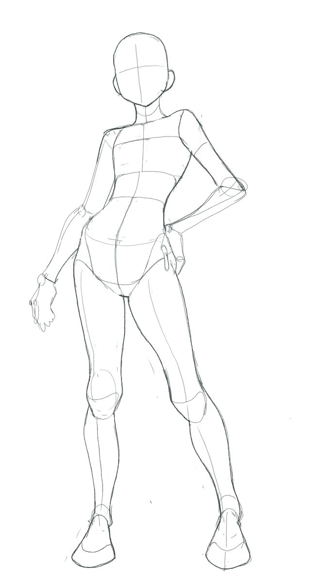

> 이미지는 인물 그리기 연습을 위한 인체 도식도입니다. 

## 이미지 상세 설명

이미지 중앙에는 머리가 없는 여성의 모습이 그려져 있습니다. 

*   **신체**: 여성의 신체는 가는 선으로 윤곽선이 표현되어 있고, 근육과 뼈, 관절의 형태를 나타내는 선이 함께 그려져 있습니다. 
*   **얼굴**: 얼굴은 정면을 향하고 있지만, 그려져 있지 않습니다. 
*   **머리**: 머리는 그려져 있지 않지만, 머리 크기와 위치를 나타내는 선이 머리가 있어야 하는 자리에 그려져 있습니다. 
*   **눈, 코, 입, 귀**: 눈, 코, 입, 귀 등은 그려져 있지 않습니다. 
*   **의상**: 인물은 알몸 상태입니다. 
*   **신발**: 양쪽에 모두 신발이 그려져 있습니다. 
*   **배경**: 인물은 흰색 배경에 그려져 있습니다. 
*   **손**: 왼쪽 손은 손가락이 펴진 채 아래로 자연스럽게 내려와 있고, 오른손은 허리춤에 위치해 있습니다. 
*   **자세**: 인물은 왼쪽 다리에 무게 중심이 실린 채로, 오른쪽 다리를 뒤로 빼고 서 있는 자세입니다. 

전체적으로 인체의 기본적인 형태와 비율을 연습하기 위한 자료로 활용할 수 있습니다.

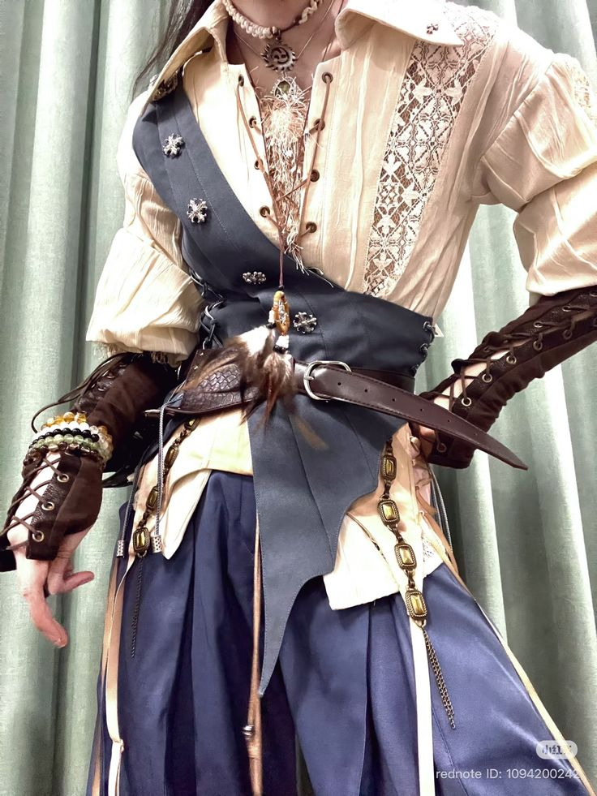

> 이미지는 게임 캐릭터의 의상과 관련한 게임 기획 문서의 일부로 추정됩니다. 이미지 중앙에 게임 캐릭터가 입고 있는 의상이 보입니다. 

### 의상 설명

*   **상의**: 베이지색의 긴팔 셔츠를 입고 있습니다. 셔츠의 앞면과 소매 부분은 격자 무늬와 꽃 무늬로 장식되어 있습니다. 
*   **허리 장식**: 허리에는 짙은 파란색의 천을 허리춤에 묶어 고정하였습니다. 허리춤 왼쪽에는 짙은 갈색의 벨트를 착용하고 있습니다. 
*   **하의**: 짙은 파란색의 바지를 입고 있습니다. 바지 옆에는 베이지색의 가죽이 덧대어져 있습니다. 
*   **장갑**: 짙은 갈색의 가죽 장갑을 착용하고 있습니다. 
*   **액세서리**: 목에는 여러 종류의 목걸이를 착용하고 있습니다. 왼쪽 팔에는 여러 개의 팔찌를 착용하고 있습니다. 

### 배경 

이미지 배경에는 연한 초록색의 커튼이 펼쳐져 있습니다. 

### 워터마크 

이미지 하단 우측에는 흰색 워터마크가 있습니다. 내용은 "rednote ID: 1094200242"입니다.

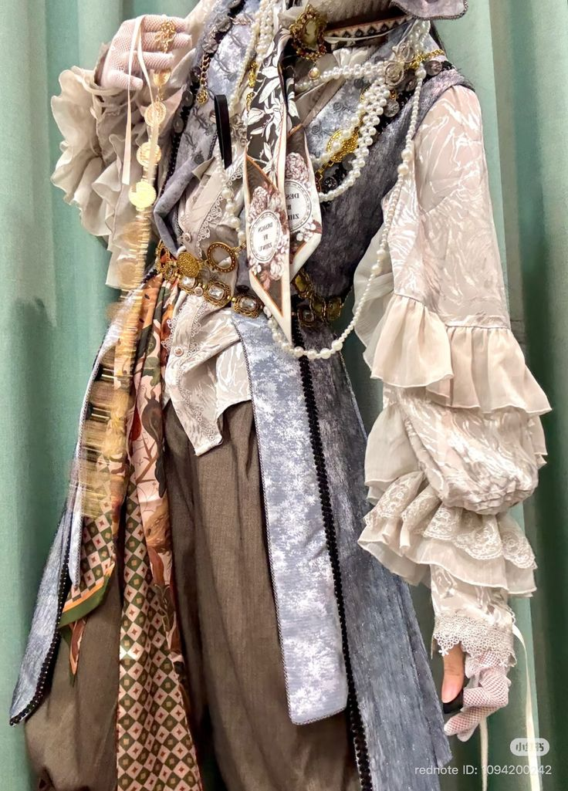

> 이미지는 게임 기획 문서의 일부로 보이는 이미지입니다. 이 이미지는 한 인형의 상반신을 촬영한 사진입니다. 이 사진 속의 인형은 머리가 잘려나간 상태이며, 녹색 커튼을 배경으로 촬영되었습니다.

인형의 신발은 사진에 보이지 않습니다. 

인형이 입고 있는 의상은 여러 겹의 옷이 레이어드되어 있습니다. 바지 위로 갈색의 긴 천이 겹쳐져 있고, 그 위로 또 회색의 긴 천이 겹쳐져 있습니다. 회색 천의 가운데에는 길고 좁은 띠가 있고, 띠 위로 여러 장의 천이 묶여 있습니다. 이 띠의 왼쪽에는 여러 개의 커다란 단추들이 묶여 있습니다.

옆으로 긴 천이 묶여 있는 띠의 오른쪽에는 여러 개의 목걸이가 묶여 있습니다. 목걸이는 여러 줄의 진주알로 된 목걸이, 금으로 된 체인, 진주알과 금 체인이 섞인 목걸이 등이 있습니다. 

인형의 상의는 흰색과 회색 무늬가 있는 천으로 되어 있습니다. 이 천은 어깨 부분에 여러 겹의 주름 장식이 있고, 팔 부분에도 여러 겹의 주름 장식이 있습니다. 주름 장식은 팔꿈치 위까지 이어져 있습니다.

인형의 왼쪽에는 긴 천이 여러 겹으로 묶여 있습니다. 이 천은 회색, 주황색, 녹색, 흰색 등이 섞인 무늬가 있습니다.

사진 하단 오른쪽에는 작은 글씨로 **rednote ID: 094200042**라고 적혀 있습니다.

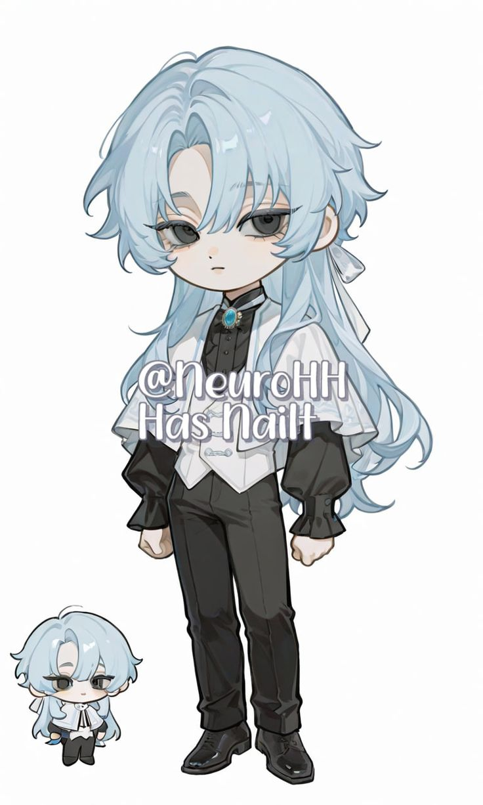

> 해당 이미지에는 한 명의 캐릭터가 등장합니다. 캐릭터는 긴 하늘색 머리카락과 검은 눈을 가지고 있습니다. 캐릭터는 남성의 모습을 하고 있지만, 섬세한 이목구비와 머리카락의 길이로 보아 여성일 수도 있습니다. 

 캐릭터는 검은 바지와 검은 넥타이, 하얀 조끼가 달린 검은 재킷을 입고 있습니다. 재킷의 소매 부분은 검은 색깔의 퍼프 소매로 디자인되어 있습니다. 재킷의 가슴 부분에는 커다란 터번 모양의 푸른색 보석이 달린 액세서리가 묶여 있습니다. 

 캐릭터의 왼쪽에는 동일한 캐릭터의 모습이 축소되어 그려져 있습니다. 큰 캐릭터와 작은 캐릭터 모두 동일한 표정을 하고 있습니다. 큰 캐릭터의 왼손에는 무언가를 쥐고 있는 듯 손가락이 뭉쳐져 있습니다. 

이미지 중앙에는 "@neuroHH Has nailt"이라는 문구가 흰색으로 적혀 있습니다. 배경은 하얀색입니다.

---

## 슬라이드 5

### 조력자

| 항목 | 내용 |
| --- | --- |
| 이름 | 행드맨 |
| 성별 | 여성 |
| 키/나이 | 155cm/19세 |
| 체형 | 마른 미소녀 체형, 약 슬랜더, 가슴은 좀 나오게 |
| 성격 | 털털하고 웃음이 많음, 약간 엉뚱한 면이 있음, 활기참 |
| 말투 |  |
| 역할 | 분위기 메이커, 첫사랑 재질, 누구나 마음 속으로 짝사랑했던 그런 여자 |

> 해당 이미지에는 애니메이션으로 묘사된 한 소녀가 등장합니다. 소녀의 머리카락은 길고 하얗게 표현되어 있으며, 눈은 감긴 상태로 크게 웃고 있는 표정입니다. 소녀는 하늘색의 반팔 티셔츠를 입고 있습니다. 배경은 하늘이 그려져 있으며, 푸른색의 맑은 하늘에 하얀 구름이 떠 있습니다. 이미지 오른쪽 하단에는 작고 희미한 글씨로 저작권과 관련된 정보가 적혀 있습니다.

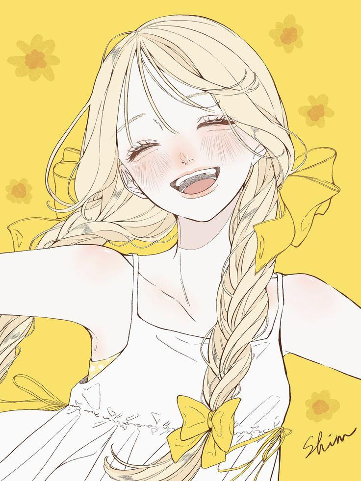

> 해당 이미지에는 한 여성 캐릭터의 모습이 그려져 있습니다. 

*   캐릭터의 생김새

    *   노란색 배경에 노란색과 갈색 꽃이 여러개 그려져 있습니다.
    *   긴 금발머리, 하얀 피부톤을 가지고 있습니다.
    *   눈은 감긴 상태이며, 웃는 표정으로 입꼬리가 올라가 있습니다.
    *   머리카락은 왼쪽으로 긴 땋은 머리를 하고 있습니다.
    *   흰색 민소매 드레스를 입고 있으며, 노란색 리본이 가슴 부분에 있습니다.
    *   왼쪽 팔꿈치 위까지 노출된 채로 팔을 뻗고 있는 모습입니다.

*   이미지 하단 우측에는 검은색 필기체로 **Shim**이라는 문구가 적혀 있습니다.

---

## 슬라이드 6

### 조력자

#### 얇은 허리, 다리.

#### 흔히 연예인 몸매 하면

#### 떠오르는 체형

#### 가슴 좀 더 크게

#### 여리여리한 느낌

#### 시골 소녀 같은 느낌.

#### 코르셋 말고 리본이 더 귀여움

#### 팔에 꽃다발을 안겨줘도 귀여울 듯

#### Sd 레퍼런스

#### 길게 내려오는 치마

#### 도톰한 짧은 치마

#### 펑퍼짐 바지

#### 셋 다 귀여울 듯

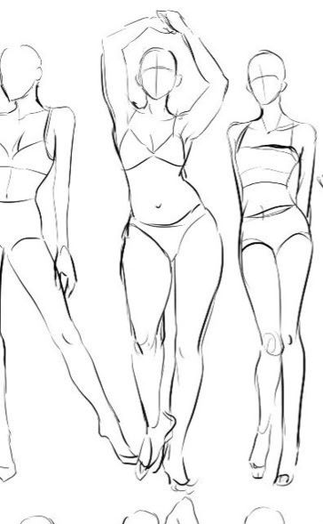

> 이미지는 여성의 모습을 묘사한 3개의 스케치 도면이 포함되어 있습니다. 

*   도면은 흑백으로 그려져 있으며, 각 인물은 다른 포즈를 취하고 있습니다.
*   왼쪽부터 첫 번째 인물은 왼쪽 다리를 앞으로 뻗은 채로 서 있습니다. 
*   가운데 인물은 한쪽 손을 머리 위로 올리고 다른 한쪽 손은 아래로 내린 채로 서 있습니다. 
*   오른쪽 인물은 왼쪽 손을 엉덩이에 올리고 오른쪽 손은 내린 채로 서 있습니다.
*   각 인물은 얼굴과 머리가 그려지지 않았으며, 몸의 윤곽과 근육, 뼈대의 형태를 나타내는 선들이 그려져 있습니다. 
*   이미지 하단에는 원 모양의 오브젝트가 일부 잘려서 표시되어 있습니다. 
*   이미지의 배경은 하얗습니다.

> 이미지는 게임 기획 문서의 일부로 보이는 이미지입니다. 이미지 중앙에 서 있는 한 여성의 모습이 담겨 있습니다.

*   **여성 캐릭터**

    *   여성은 갈색 긴 머리를 땋아내렸으며, 올림머리 옆에 꽃을 꽂고 있습니다. 꽃은 왼쪽 위에 꽂혀 있습니다.
    *   여성은 짙은 갈색의 눈과 옅은 갈색의 입술을 가지고 있습니다. 
    *   여성은 큰 은색 귀걸이를 착용하고 있으며, 목에는 가는 은색 목걸이를 착용하고 있습니다.
    *   여성은 흰색 긴팔을 입고 있으며, 소매 부분에 잔잔한 주름이 잡혀 있습니다. 
    *   여성은 녹색 가슴 장식을 입고 있습니다. 장식의 윗부분은 하얀색이며, 가슴을 덮습니다. 장식의 아래 부분은 녹색 허리띠로 허리를 묶습니다. 
    *   여성은 베이지색 긴 치마를 입고 있습니다. 
    *   여성은 맨발에 가볍고 얇은 가죽 샌들을 착용하고 있습니다. 
    *   여성은 왼손에 짚으로 만든 듯한 갈색 바구니를 들고 있습니다.

*   **배경**

    *   배경은 짙은 갈색이며, 바닥은 밝은 회색 타일로 구성되어 있습니다.

이미지에는 UI 요소나 아이콘, 텍스트 등이 포함되어 있지 않습니다.

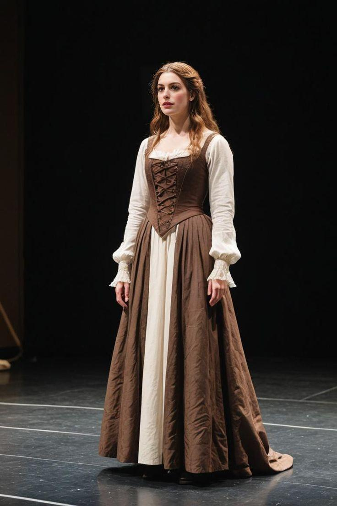

> 이미지는 무대 위에 서 있는 한 여성의 사진입니다. 여성은 무대에서 조명 빛을 받으며 중앙에 위치하고 있습니다. 

*   여성의 머리카락은 긴 갈색입니다. 머리는 땋은 듯한 머리 스타일이며, 얼굴은 약간 오른쪽을 보고 있습니다. 입꼬리가 약간 올라가 있는 미소를 띤 표정입니다. 
*   여성의 의상은 가슴 부분이 노출된 흰색 블라우스 위에 허리 부분이 끈으로 묶인 형태의 갈색 코르셋을 입고 있습니다. 코르셋 위로는 갈색 치마를 입고 있으며, 안쪽에는 또 다른 흰색 치마가 있는 이중치마 형태입니다. 
*   무대는 짙은 회색이며, 무대 바닥에는 하얀색 선이 격자 모양으로 그어져 있습니다. 
*   배경은 짙은 검은색입니다.

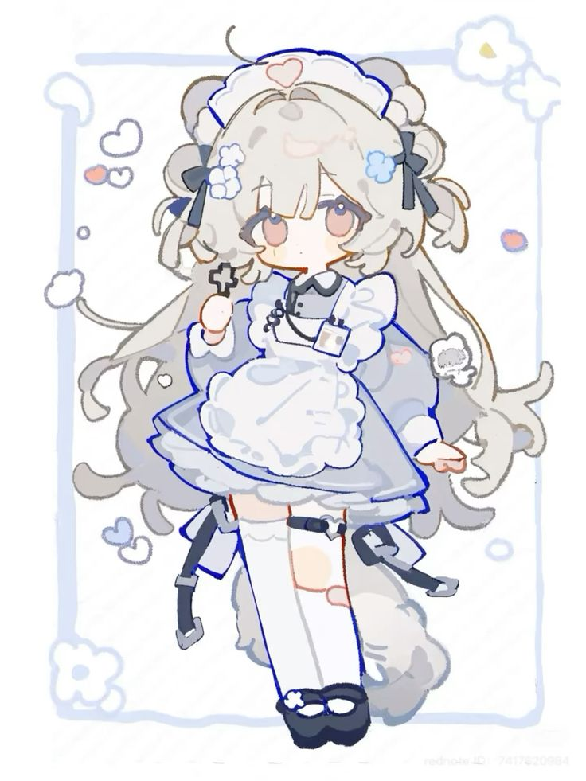

> 해당 이미지에는 한 명의 캐릭터가 그려져 있습니다. 

*   캐릭터의 생김새: 

    *   긴 회색 머리카락에, 파란색과 검은색 리본이 묶여있습니다. 
    *   눈은 큰 편이며, 눈동자는 분홍색입니다. 
    *   왼쪽 귀에는 귀걸이를 착용하고 있습니다. 
*   캐릭터의 의상: 

    *   분홍색 하트 모양 장식이 달린 흰색 머리띠를 착용하고 있습니다. 
    *   분홍색과 하얀색이 섞인 귀여운 디자인의 드레스를 입고 있습니다. 
    *   무릎까지 오는 하얀색 스타킹을 착용하고 있습니다. 
    *   검은색 단화를 신고 있습니다. 
*   배경 

    *   하얀색 배경에 연한 파란색 테두리가 있습니다. 
    *   테두리 안에는 여러 가지의 하트와 꽃, 구름 모양이 그려져 있습니다. 
    *   캐릭터의 하단에는 흐린 회색으로 테두리가 그려져 있습니다. 
*   추가적인 요소 

    *   캐릭터의 오른쪽 하단에는 작은 글씨로 "redhois_7417620994"라는 문구가 적혀 있습니다.

---

## 슬라이드 7

### 아군 1

| 항목 | 내용 |
| --- | --- |
| 이름 | 더 풀 |
| 성별 | 여성 |
| 키/나이 | 177cm/24세 |
| 체형 | 마른 근육, 겉으로는 안 드러나지만 벗겨보면 근육이 꽉 찬 느낌 |
| 성격 | 능글능글, 여유있고 규율에 얽매이지 않는 자유로움 |
| 말투 |  |
| 역할 | 방랑자, 유랑인, 중간에 합류를 위한 캐릭터. |

#### 몸만 참고

> 해당 이미지에는 한 여성 캐릭터가 그려져 있습니다. 

*   **캐릭터의 생김새**: 캐릭터는 긴 하얀 머리를 가지고 있으며 귀는 뾰족한 고양이 귀를 하고 있습니다. 눈은 노란색이며 입꼬리가 올라가 있는 표정으로 묘사되어 있습니다. 
*   **의상**: 캐릭터는 검은색 민소매 상의와 검은색 바지를 입고 있습니다. 허리춤은 회색 띠로 묶여져 있으며, 왼쪽 허벅지 위에는 방어구로 추정되는 물건이 허벅지에 묶여져 있습니다. 
*   **액세서리**: 캐릭터는 검은색 장갑을 착용하고 있습니다. 
*   **꼬리**: 캐릭터의 등에 노란색과 보라색이 섞인 꼬리가 그려져 있습니다. 

전체적으로 이 캐릭터는 강한 인상을 주는 캐릭터로 묘사되어 있습니다.

> 해당 이미지에는 한 명의 캐릭터가 등장합니다. 

*   캐릭터의 신체적 특징: 짧은 빨간색 머리와 뾰족한 눈을 가지고 있습니다. 왼쪽 귀에는 귀걸이를 착용하고 있습니다. 목에는 은색 펜던트가 달린 목걸이를 착용하고 있습니다. 
*   캐릭터의 의상: 블랙 터틀넥을 입고 있고, 그 위에 가죽 재킷을 입고 있습니다. 허리에는 은색 버클이 달린 벨트를 착용하고 있습니다. 짧은 반바지 형태의 치마를 입고 있고, 그 위에 여러 줄의 벨트를 허벅지와 허리에 착용하고 있습니다. 바지에는 여러 개의 벨트를 추가로 착용하고 있습니다. 
*   캐릭터의 액세서리: 날카로운 날 모양으로 생긴 장갑을 착용하고 있습니다. 
*   캐릭터의 배경: 짙은 파란색의 사각형 형태의 배경이 있습니다. 캐릭터의 뒤편으로 팔과 목 부분에 검은색과 보라색의 줄무늬 형태의 무늬가 그려져 있습니다. 

전체적으로 캐릭터는 짙은 색상의 의상을 입고 날카로운 장갑을 착용하고 있어 강렬한 인상을 주고 있습니다.

---

## 슬라이드 8

### 아군 1

#### 양치기, 숲 떠돌이 같은 이미지

#### 기본적으로 웃는 얼굴

#### 피부도 타서 까무잡잡

#### 후드 쓰고 있는 복식

#### 자연 친화적, 생존 친화적

#### + 지팡이

#### Sd 레퍼런스

#### 지팡이 짚고 있는 느낌

#### 여유롭게 상체를 뒤로 약간 눕힘

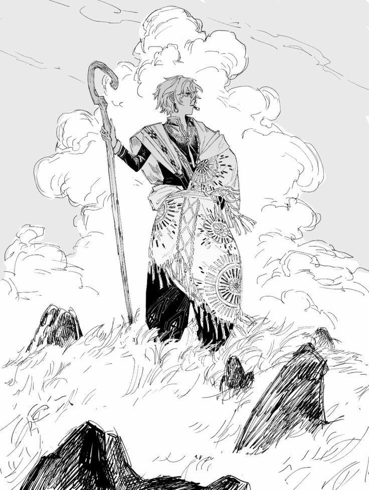

> 이 그림은 한 인물을 중심으로 구성된 흑백 일러스트입니다. 

중앙에 위치한 인물은 남자로, 풍성한 머리를 가지고 있으며, 전통적이면서도 화려한 옷차림을 하고 있습니다. 그는 왼손에 지팡이를 들고 있습니다. 지팡이는 상단부가 곡선형으로 디자인되어 특이합니다. 

남성의 옷은 여러 겹의 옷이 겹쳐 입혀져 있으며, 각 옷마다 다양한 패턴과 장식품이 달려 있습니다. 옷의 소매는 길고, 옷자락이 길게 늘어져 있습니다. 허리에는 띠를 두르고 있으며, 띠 아래로 여러 겹의 옷이 층을 이룹니다. 

배경에는 구름이 가득 차 있습니다. 구름은 여러 형태로 흩어져 있으며, 인물의 뒤와 옆을 감싸고 있습니다. 구름의 표현은 부드럽고 흐릿하게 처리되어 있습니다. 

전반적으로 이 일러스트는 몽환적이고 신비로운 분위기를 연출하고 있습니다. 남성의 화려한 옷차림과 지팡이, 그리고 그를 둘러싼 구름이 어우러져 독특한 이미지를 형성하고 있습니다.

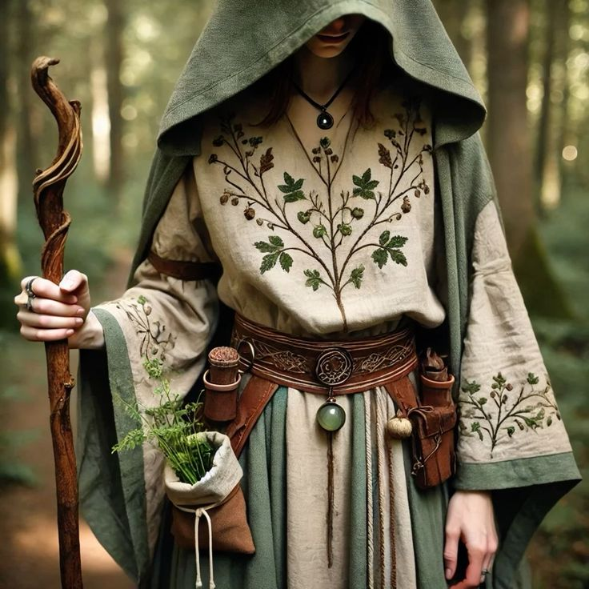

> 이미지는 숲 속에 서 있는 한 인물의 상반신을 보여 주고 있습니다. 이 인물은 녹색 후드를 쓴 머리를 가리고 있으며, 베이지색의 긴 소매 옷을 입고 있습니다. 옷의 소매와 앞면에는 녹색 식물과 나무가 수 놓아져 있습니다. 인물은 녹색 망토를 입고 있으며, 허리에는 가죽 벨트를 착용하고 있습니다. 벨트에는 여러 도구들이 묶여 있습니다. 

인물의 왼손에는 나무 지팡이를 들고 있으며, 오른손은 허리 옆에 있습니다. 허리 왼쪽에는 작은 천으로 된 주머니가 묶여 있으며, 그 안에는 녹색의 풀이 들어 있습니다. 배경은 숲으로, 여러 나무들이 보입니다. 

이미지 속 인물은 마치 마법사나 무녀와 같은 느낌을 주고 있습니다.

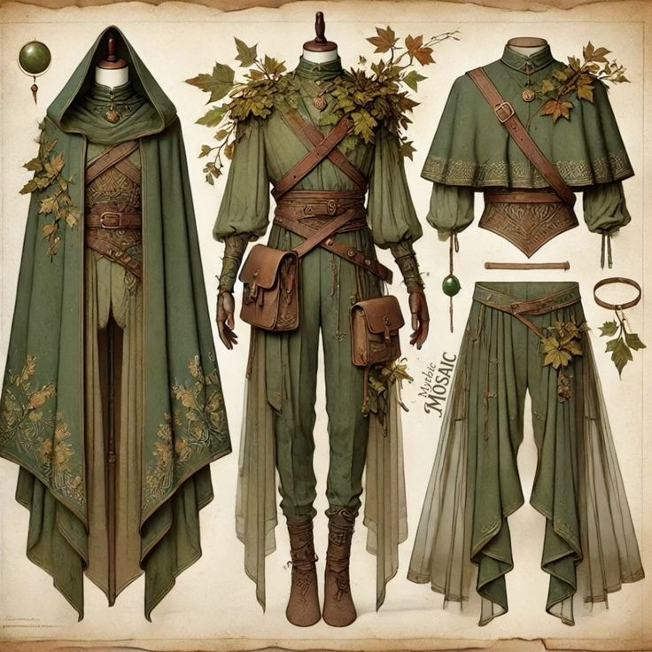

> 이미지는 게임 캐릭터의 의상 디자인 컨셉 아트입니다. 이미지 중앙에 캐릭터가 입을 수 있는 의상과 장비를 세세하게 표현하였습니다. 

이미지 중앙에 있는 캐릭터는 녹색 옷과 가죽 허리띠를 착용하고 있습니다. 캐릭터의 상의는 긴 소매가 있으며, 가슴 부분에 가죽 허리띠를 두르고 있습니다. 또한, 어깨에는 나뭇잎이 달린 가지를 올리고 있습니다. 하의는 바지이며, 바지 왼쪽에는 작은 가방을 메고 있습니다. 캐릭터의 신발은 긴 부츠이며, 부츠 위쪽에는 무늬가 새겨져 있습니다.

이미지 왼쪽에는 캐릭터가 착용할 수 있는 망토가 표현되어 있습니다. 망토의 앞면에는 무늬가 새겨져 있으며, 망토 뒤쪽에는 두건을 가지고 있습니다. 

이미지 오른쪽에는 캐릭터가 착용할 수 있는 상의와 하의가 표현되어 있습니다. 상의는 짧은 소매가 있으며, 가슴 부분에 가죽 허리띠를 두르고 있습니다. 하의는 긴 치마이며, 치마 아래쪽에는 투명한 천이 달려 있습니다.

이미지 중앙 오른쪽에는 허리띠와 귀걸이가 표현되어 있습니다. 

이미지 중앙에는 "Marble MOSAIC"이라는 문구가 적혀 있습니다. 배경은 베이지색이며, 이미지의 가장자리는 갈색 테두리로 둘러싸여 있습니다.

> 이 그림은 게임 캐릭터에 대한 기획 문서의 일부로 추정됩니다. 그림은 네 부분으로 나누어져 있으며, 각 부분은 동일한 캐릭터의 다른 각도를 나타냅니다.

*   그림의 캐릭터는 머리가 크고 몸이 작은 막대기처럼 생긴 캐릭터입니다. 
*   위쪽 왼쪽 그림의 캐릭터는 정면이 아닌 측면을 보고 있습니다. 캐릭터는 왼팔을 굽혀서 손을 배꼽 근처에 위치시키고, 오른팔을 곧게 펴서 아래로 내리고 있습니다. 
*   위쪽 오른쪽 그림의 캐릭터는 측면을 보고 있지만, 왼쪽 캐릭터와는 반대로 왼쪽 팔을 펴서 앞으로 내밀고, 오른팔을 굽혀서 공을 잡고 있습니다. 
*   아래쪽 왼쪽 그림의 캐릭터는 후면을 보고 있습니다. 두 팔을 굽혀서 팔짱을 풀지 않은 채로 앞으로 내밀고 있습니다. 
*   아래쪽 오른쪽 그림의 캐릭터는 후면을 보고 있지만, 왼쪽 캐릭터와는 반대로 왼쪽 팔을 굽혀서 손을 배꼽 근처에 위치시키고, 오른팔을 펴서 앞으로 내밀고 있습니다.

배경은 흰색이며, 그림의 오른쪽 하단에는 작은 글씨로 중국어로 추정되는 문자가 적혀 있습니다.

---

## 슬라이드 9

### 아군 2

| 항목 | 내용 |
| --- | --- |
| 이름 | 저스티스 |
| 성별 | 남성 |
| 키/나이 | 155cm/13세 |
| 체형 | 짜리몽땅, 팔 다리가 긴 어린이~청소년 체형. |
| 성격 | 냉정하고 무뚝뚝, 자기 희생적. 책임감 있어 보이는 가장 같지만 어린아이 같은 면모를 숨기지 못함. |
| 말투 |  |
| 역할 | 적군이었다가 아군이 된 캐릭터, 죄책감과 속죄. 적군에 대한 부정적 인식 강화. |

#### 얼굴 인상 참고

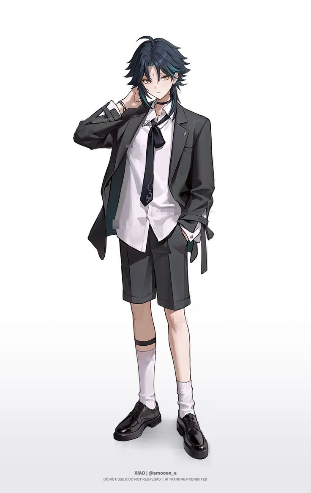

> 해당 이미지에는 한 명의 캐릭터가 등장합니다. 

*   **배경**: 캐릭터가 서 있는 배경은 흰색입니다. 
*   **캐릭터**: 짙은 녹색과 검은색이 섞인 머리카락을 가진 남성이 등장합니다. 눈동자는 노란색입니다. 캐릭터는 왼쪽 손으로 귀 근처 머리카락을 만지고 있고, 오른쪽 손은 바지 주머니에 넣고 있습니다. 
*   **캐릭터의 의상**: 캐릭터는 검은색 재킷과 회색 반팔 드레스 셔츠, 검은색 넥타이, 검은색 반바지, 무릎까지 오는 흰색 양말, 그리고 검은색 구두를 착용하고 있습니다. 
*   **이미지 하단**: 이미지 하단에는 "XIAO | @amoon_e"라는 문구와 함께 "DO NOT USE & DO NOT REUPLOAD | AI TRAINING PROHIBITED"이라는 문구가 회색으로 표시되어 있습니다.

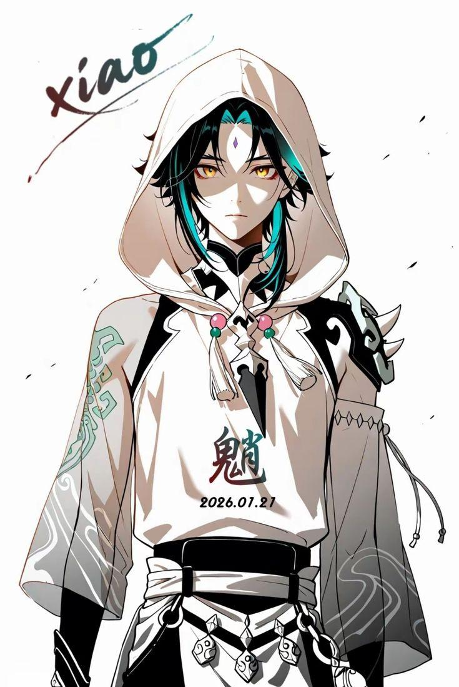

> 이미지는 애니메이션 스타일의 캐릭터 일러스트입니다. 

*   캐릭터는 검은 머리와 노란 눈을 가지고 있습니다. 이마에는 하얀색과 보라색의 표시가 있고, 머리에는 녹색 줄무늬가 있습니다. 
*   캐릭터는 하얀색 후드를 쓰고 있으며, 옷에는 녹색과 하얀색 무늬가 있습니다. 
*   옷에는 분홍색과 녹색의 묵주 같은 장식품이 있고, 왼쪽 가슴에는 2026.01.21이라는 날짜가 적혀 있습니다. 
*   오른쪽 팔에는 녹색의 무늬가 있고, 허리에는 검은색 허리띠를 착용하고 있습니다. 
*   이미지 상단에는 XIAO라는 이름이 표시되어 있습니다. 
*   이미지 배경은 하얀색입니다.

---

## 슬라이드 10

### 아군 2

#### 어린이~ 청소년이지만

#### 청소년에 좀 더 가깝게

#### 위 그림보다 근육 추가

#### 부분 갑주 + 망토

#### 대검 사용 or 소드를 대검처럼 활용

#### + 눈가리개

#### Sd 레퍼런스

#### 어깨는 갑주로 강조

#### 덩치 커보이게,

#### 망토로 아래쪽 강조

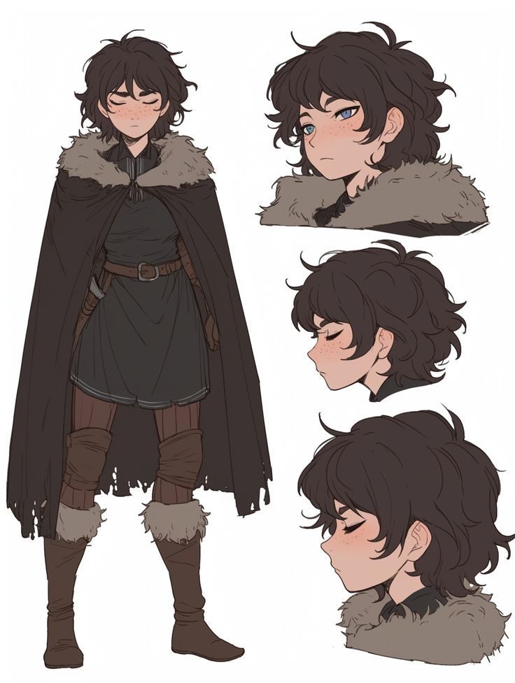

> 해당 이미지는 게임 캐릭터의 컨셉 아트입니다. 

이미지 중앙에 있는 캐릭터는 짙은색의 짧은 머리를 가지고 있습니다. 눈은 파란색이며, 눈꼬리가 올라가있어 화난 것처럼 보입니다. 눈 밑에 점이 있습니다.

옷차림은 짙은 회색의 상의에 허리끈을 묶었습니다. 회갈색의 허리띠를 두르고 있고, 왼쪽에는 칼집이 묶여있는 것을 확인할 수 있습니다. 하의는 회색의 짧은 치마를 입고 있으며, 바지처럼 생긴 회갈색의 긴 통 다리 보호대를 착용하고 있습니다. 발에는 회색 털이 달린 짙은색의 긴 부츠를 착용하고 있습니다. 

등에는 짙은색의 망토를 두르고 있으며, 망토의 어깨 부분에는 회색의 털이 달려있습니다.

캐릭터의 정면과, 오른쪽에는 같은 캐릭터의 옆 모습과, 뒤에서 본 머리의 모습이 그려져 있습니다. 

배경은 흰색입니다.

> 해당 이미지에는 한 명의 캐릭터가 등장합니다. 

*   캐릭터의 생김새

    *   짧은 회색 머리카락과 녹색 눈을 가지고 있습니다. 
    *   왼쪽 눈 밑에 눈물을 연상케 하는 분홍색의 그림이 그려져 있습니다. 
    *   이마에는 리본이 묶여져 있습니다. 
*   캐릭터의 의상

    *   검은 바지와 녹색과 금색이 조합된 상의를 입고 있습니다. 
    *   왼쪽에는 허리띠를 두르고 있으며, 허리띠 아래에는 여러 개의 액세서리가 달려 있습니다. 
    *   액세서리는 푸른색을 띕니다. 
    *   녹색과 베이지색이 조합된 망토를 입고 있습니다. 
    *   망토 뒤에는 베이지색의 날개가 그려져 있습니다. 
    *   검은 부츠를 신고 있으며, 부츠에는 금색의 장식이 있습니다. 
*   배경 

    *   캐릭터를 중심으로 한 흰색 배경이 있습니다. 
    *   이미지 오른쪽 하단에는 작은 글씨로 판권 정보가 적혀 있습니다. 

종합하면, 이미지는 게임 캐릭터의 디자인에 대한 계획이나 소개를 목적으로 하는 것으로 보입니다.

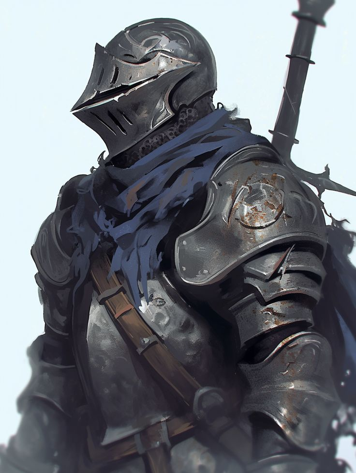

> 이미지는 갑옷을 입고 무기를 들고 있는 전사의 상반신을 묘사하고 있습니다.

*   **전사**: 이미지 중앙에 위치한 전사는 왼쪽을 향하고 있습니다. 
*   **갑옷**: 전사는 머리부터 어깨, 가슴, 팔 등을 덮는 갑옷을 착용하고 있습니다. 갑옷은 어둡고 금속성 재질로 만들어진 것으로 보이며, 일부 부위는 녹이 슨 것처럼 보입니다. 
*   **헬멧**: 전사는 얼굴을 보호하기 위한 헬멧을 착용하고 있습니다. 헬멧은 코와 입을 덮는 형태이며, 눈 부분에 구멍이 뚫려 있습니다. 헬멧의 표면에는 금속성 재질의 질감을 강조하기 위한 선들이 새겨져 있습니다. 
*   **깃털 또는 천**: 전사는 어깨와 목을 감싸는 깃털 또는 천을 착용하고 있습니다. 깃털 또는 천은 짙은 파란색이며, 깃털의 형태를 나타내는 선들이 그려져 있습니다. 
*   **무기**: 전사는 등에 긴 손잡이를 가진 무기를 메고 있습니다. 무기는 손잡이 부분에 띠 또는 가죽을 감은 것으로 보이며, 날카로운 날 부분이 보입니다. 
*   **배경**: 배경은 연한 하늘색이며, 전사가 입고 있는 갑옷과 무기의 디테일을 강조하기 위해 밝은 색상으로 설정된 것으로 보입니다.

전체적으로 이미지는 중세 시대의 기사나 전사를 연상케 하는 강인하고 위협적인 인상을 주고 있습니다.

> 해당 이미지에는 한 명의 캐릭터가 등장합니다. 캐릭터의 이름은 지ルフリート (질프리트)입니다.

*   캐릭터의 생김새: 짧은 금발에 파란 눈을 가지고 있습니다. 
*   캐릭터의 의상: 검은색과 금색이 조합된 군복과 비슷한 디자인의 상의를 입고 있습니다. 허리에는 벨트를 착용하고 있으며, 왼쪽에는 검이 있습니다. 또한, 어깨에는 날개처럼 생긴 장식이 있습니다. 캐릭터의 하의는 회색 바지를 입고 있으며, 무릎까지 올라오는 검은색 부츠를 착용하고 있습니다. 캐릭터의 뒤에는 푸른색과 하늘색이 조합된 듯한, 그라데이션이 적용된 긴 망토가 있습니다.

캐릭터의 왼쪽에는 일본어로 작성된 문구가 있습니다.

*   문구 내용: 

    *   첫번째 줄: 【死神さまと三年契約】キャラクターデザイン 
    *   두번째 줄: 지ルフリート 
    *   세번째 줄: イラスト: MONA 
*   번역: 
    *   첫번째 줄: [죽은 신님과 3년 계약] 캐릭터 디자인 
    *   두번째 줄: 지ルフリート 
    *   세번째 줄: 일러스트: MONA 

이미지 하단에는 일본어로 작성된 문구가 있습니다.

*   문구 내용: 
    *   원작: 櫻田りん / 캐릭터 디자인 & 설정: MONA / 소라지마 
*   번역: 
    *   원작: 사쿠라다 린 / 캐릭터 디자인 & 설정: MONA / 소라지마

---

## 슬라이드 11

### 아군 3

| 항목 | 내용 |
| --- | --- |
| 이름 | 매지션 |
| 성별 | 여성 |
| 키/나이 | 165cm/21세 |
| 체형 | 얇은 허리, 허벅지 강조 살짝 통통해서 살이 눌리는 체형 |
| 성격 | 능글맞음, 예측 불가, 선/악 안 따지고 재밌으면 다임~,광기 |
| 말투 |  |
| 역할 | 예측 불가의 말광량이/광대, 인형술사 같은 느낌, |

> 해당 이미지 속에는 여러 캐릭터가 등장합니다. 가장 먼저 눈에 띄는 인물은 이미지 상단에 있는 여자 캐릭터입니다. 

*   이 여성 캐릭터는 긴 검은 머리를 가지고 있으며, 머리를 양쪽으로 묶은 듯한 헤어스타일을 하고 있습니다. 
*   눈은 핑크색이며, 눈동자 안쪽에는 붉은색 동그라미가 그려져 있습니다. 
*   입꼬리가 올라가 있는 미소를 띤 표정으로 묘사되어 있습니다. 
*   분홍색과 검은색이 섞인 옷을 입고 있으며, 같은 색상의 리본이 달린 머리장식을 하고 있습니다. 
*   목에는 분홍색과 검은색 리본이 묶여져 있고, 옷과 동일한 색상의 긴 끈이 달린 귀걸이를 착용하고 있습니다. 
*   이 캐릭터의 손에서는 여러 가닥의 핑크색 실이 이어져 있는데, 이 실이 아래에 있는 캐릭터들과 연결된 모습입니다.

다음은 이 여성 캐릭터 아래에 있는 캐릭터들입니다.

*   가장 왼쪽에 있는 캐릭터는 검은색과 노란색 머리를 가지고 있으며, 고양이 귀가 달린 분홍색 머리장식을 하고 있습니다. 
*   눈은 빨간색이며, 눈꼬리가 살짝 올라간 미소를 띤 표정으로 묘사되어 있습니다. 
*   빨간색과 보라색이 섞인 옷을 입고 있으며, 동일한 색상의 꽃이 그려진 스타킹을 착용하고 있습니다. 
*   왼쪽에는 흰색 꽃이, 오른쪽에는 분홍색 꽃이 그려져 있습니다. 
*   허리에는 보라색 리본을 묶고 있으며, 리본 가운데에는 보라색 구슬이 달려 있습니다. 
*   손에는 분홍색과 흰색 깃털이 달린 막대를 들고 있습니다.

*   가운데에 있는 캐릭터는 새의 모습을 한 작은 동물입니다. 
*   눈은 파란색이며, 머리에 검은색 탑을 쓰고 있습니다. 
*   노란색 깃털이 달린 옷을 입고 있습니다.

*   가장 오른쪽에 있는 캐릭터는 짧은 회색 머리를 가지고 있으며, 귓구멍이 뚫린 모습으로 묘사되어 있습니다. 
*   눈은 빨간색이며, 눈꼬리가 살짝 올라간 미소를 띤 표정으로 묘사되어 있습니다. 
*   검은색 슈트를 입고 있으며, 검은색 넥타이를 착용하고 있습니다. 
*   오른손에 주먹을 쥐고 있으며, 왼손은 펴서 허공에 들고 있습니다.

이러한 캐릭터들은 마치 서커스에서 등장하는 인물들을 연상케 하는 모습입니다. 실제로 이들이 서커스 무대에 있는 모습인지는 명확하지 않지만, 해당 이미지의 배경에는 서커스 천막이 그려져 있기 때문에 서커스 무대라고 추측할 수 있습니다.

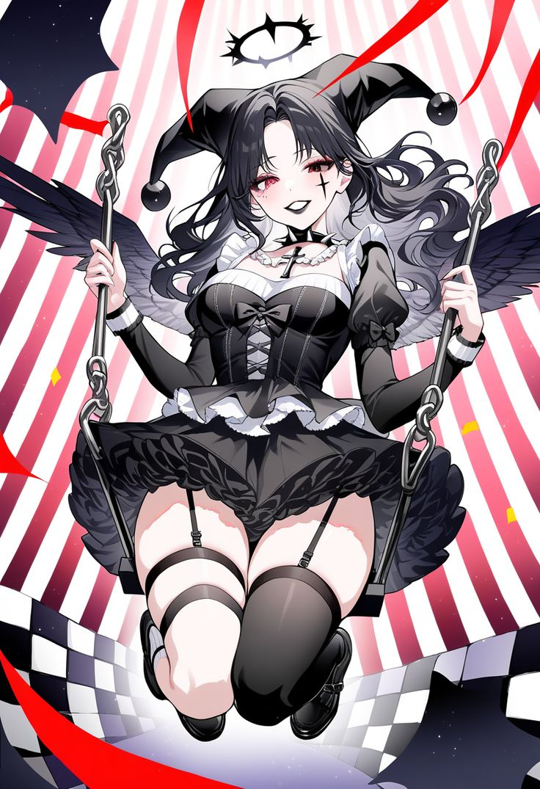

> 해당 이미지는 게임 기획 문서의 일부로 추정되며, 다음과 같은 내용을 포함하고 있습니다.

*   **캐릭터:** 이미지 중앙에는 검은색과 흰색의 줄무늬가 있는 하프컷 긴 머리를 가진 여성 캐릭터가 있습니다. 이 캐릭터는 블랙과 화이트가 조합된 분홍색 눈동자를 가지고 있습니다. 캐릭터는 블랙과 화이트가 조합된 의상을 입고 있으며, 검은색과 흰색의 조커 모자를 쓰고 있습니다. 
*   **의상:** 캐릭터는 블랙 컬러의 상의와 짧은 치마를 입고 있습니다. 상의는 심장 모양이며, 가운데 검은색 리본이 묶여 있습니다. 치마는 검은색 레이스로 장식되어 있습니다. 또한, 캐릭터는 무릎까지 오는 검은색 스타킹과 높은 굽의 검은색 부츠를 착용하고 있습니다. 
*   **액세서리:** 캐릭터는 목에 흰색의 묵주를 착용하고 있습니다. 귀에는 날개가 있으며, 손에는 쇠사슬이 달린 그네를 잡고 있습니다. 
*   **배경:** 배경에는 빨간색과 흰색의 줄무늬가 있습니다. 줄무늬 패턴은 뒤로 갈수록 옅은 보라색으로 변하며, 검은색과 흰색의 체크무늬가 바닥에 깔려 있습니다. 
*   **디테일:** 이미지에는 빨간색 리본과 노란색 별 모양의 장식이 있습니다. 또한, 이미지 상단에는 스파이크가 달린 눈 모양의 장식이 있습니다. 

전체적으로 이 이미지는 게임의 캐릭터 소개나 홍보 자료로 사용될 수 있습니다.

---

## 슬라이드 12

### 아군 3

#### 광대 복장, 짧고 약간 섹시하게

#### 제발 허벅지를 드러나게 해주세요.

#### 밴딩이나 장식을 추가하면 좋을 듯

#### 위 체형보다 조금만 더 통통하게

#### 끈 같은 것에 살이 눌릴 정도.

#### SD 레퍼런스

#### 과한 자세 좋아요.

#### 공중에 떠있는 형태여도 좋을 듯

#### 체인, 검, 가면, 채찍, 인형 조종 줄 등 광대랑 어울리는 무기로 들려주세요

> 해당 이미지에는 13명의 서커스 광대의 모습이 그려져 있습니다.

이미지 중앙에 가장 큰 캐릭터를 제외하면, 12개의 작은 사각형 영역에 각각 다른 모습의 광대가 그려져 있습니다. 

가장 왼쪽 상단의 광대는 남색, 노란색, 빨간색, 녹색의 다이아몬드 무늬가 있는 옷을 입고, 검은색 라켓과 테니스공을 들고 있습니다. 이 광대는 베레모를 쓰고, 하얀색 깃이 달린 옷을 입고 있습니다. 

두 번째 줄의 첫 번째 광대는 남색, 노란색, 빨간색 줄무늬가 있는 바지와 노란색, 주황색 줄무늬가 있는 상의를 입고, 긴 코가 달린 모자를 쓰고 있습니다. 이 광대는 주황색 막대를 들고 있습니다. 

세 번째 줄의 첫 번째 광대는 주황색 옷을 입고, 왼쪽 귀가 긴 모자를 쓰고, 왼손에 부채를 들고 있습니다.

첫 번째 줄의 두 번째 광대는 회색, 빨간색, 노란색 줄무늬가 있는 옷을 입고, 회색 헬멧을 쓰고, 막대를 어깨에 메고 있습니다. 

두 번째 줄의 두 번째 광대는 하얀색 옷을 입고, 얼굴에 하얀색 가루가 칠해져 있습니다. 이 광대는 동그란 물체를 들고 있습니다.

세 번째 줄의 두 번째 광대는 회색 옷을 입고, 긴 코가 달린 모자를 쓰고, 검은색 막대를 들고 있습니다.

첫 번째 줄의 세 번째 광대는 보라색, 노란색, 녹색 옷을 입고, 긴 코가 달린 모자를 쓰고, 두 개의 새를 들고 있습니다.

두 번째 줄의 세 번째 광대는 하얀 옷을 입고, 얼굴에 하얀색 가루가 칠해져 있습니다. 이 광대는 노란색 컵을 들고 있습니다.

세 번째 줄의 세 번째 광대는 하얀색, 회색 옷을 입고, 하얀색 긴 코가 달린 모자를 쓰고, 키를 들고 있습니다.

첫 번째 줄의 네 번째 광대는 빨간색 옷을 입고, 검은색 망토를 두르고, 노란색 신발을 신고 있습니다. 이 광대는 검은색 모자를 쓰고, 왼손에 물건을 들고 있습니다.

두 번째 줄의 네 번째 광대는 빨간색, 하얀색 옷을 입고, 빨간색 긴 코가 달린 모자를 쓰고, 신문지를 들고 있습니다.

세 번째 줄의 네 번째 광대는 하얀색, 회색, 빨간색 옷을 입고, 하얀색 긴 코가 달린 모자를 쓰고, 키를 들고 있습니다.

첫 번째 줄의 다섯 번째 광대는 주황색 옷을 입고, 주황색 긴 코가 달린 모자를 쓰고, 두 개의 막대를 들고 있습니다.

두 번째 줄의 다섯 번째 광대는 노란색, 파란색, 빨간색 옷을 입고, 하얀색 깃이 달린 옷을 입고, 노란색 머리를 하고 있습니다.

세 번째 줄의 다섯 번째 광대는 하얀색, 검은색, 빨간색 옷을 입고, 검은색 긴 코가 달린 모자를 쓰고 있습니다. 이 광대는 왼손에 부채를 들고 있습니다.

첫 번째 줄의 여섯 번째 광대는 빨간색, 노란색, 파란색, 하얀색 줄무늬가 있는 옷을 입고, 하얀 깃이 달린 옷을 입고 있습니다.

두 번째 줄의 여섯 번째 광대는 하얀색, 회색 옷을 입고, 하얀색 긴 코가 달린 모자를 쓰고, 키를 들고 있습니다.

세 번째 줄의 여섯 번째 광대는 노란색, 파란색, 빨간색 옷을 입고, 하얀색 깃이 달린 옷을 입고 있습니다. 이 광대는 오른손에 새를 들고 있습니다.

이미지 중앙에 있는 가장 큰 광대는 빨간색 옷을 입고, 하얀색 긴 코가 달린 모자를 쓰고, 하얀색 깃이 달린 옷을 입고 있습니다. 이 광대는 한쪽 다리를 꼬고 앉아 있습니다.

> 해당 이미지에는 13명의 서커스 광대의 모습이 그려져 있습니다.

이미지 중앙에 가장 큰 광대를 기준으로 시계 방향으로 광대의 모습을 설명하겠습니다.

*   **중앙 상단부**
    *   1번: 남성이 테니스 라켓과 검을 들고 있습니다. 
        *   상의: 하트, 다이아몬드, 스페이드, 클럽이 합쳐진 패턴의 긴팔 옷
        *   하의: 하트, 다이아몬드, 스페이드, 클럽이 합쳐진 패턴의 긴바지
        *   머리: 베레모
        *   신발: 부츠
    *   2번: 남성이 손에 막대를 들고 있습니다.
        *   상의: 노란색, 하얀색, 갈색, 빨간색 줄무늬 패턴의 긴팔 옷
        *   하의: 노란색, 하얀색, 갈색, 빨간색 줄무늬 패턴의 긴바지
        *   머리: 헬멧
        *   신발: 부츠
    *   3번: 남성이 양손에 물건을 들고 있습니다.
        *   상의: 보라색, 연두색 줄무늬 패턴의 민소매 옷
        *   하의: 보라색, 연두색 줄무늬 패턴의 짧은 바지
        *   머리: 머리 장식
        *   신발: 부츠
    *   4번: 남성이 검은 망토를 입고 있습니다.
        *   상의: 빨간색 긴팔 옷
        *   하의: 빨간색 타이트한 바지
        *   머리: 빨간색 머리띠
        *   신발: 노란색
*   **중앙 왼쪽**
    *   5번: 남성이 허리춤에 손을 얹고 있습니다.
        *   상의: 주황색, 빨간색 줄무늬 패턴의 긴팔 옷
        *   하의: 주황색, 빨간색 줄무늬 패턴의 바지
        *   머리: 긴 모자
        *   신발: 긴 구두
    *   6번: 남성이 신문을 읽고 있습니다.
        *   상의: 주황색, 하얀색 줄무늬 패턴의 긴팔 옷
        *   하의: 주황색, 하얀색 줄무늬 패턴의 바지
        *   머리: 긴 모자
        *   신발: 긴 구두
*   **중앙**
    *   7번: 남성이 양손에 물건을 들고 있습니다.
        *   상의: 노출
        *   하의: 주황색, 하얀색 줄무늬 패턴의 바지
        *   머리: 긴 모자
        *   신발: 긴 구두
    *   8번: 남성이 피리를 들고 있습니다.
        *   상의: 하얀색 긴팔 옷
        *   하의: 하얀색 바지
        *   머리: 동물 머리 장식
        *   신발: 긴 구두
*   **중앙 오른쪽**
    *   9번: 남성이 키를 들고 있습니다.
        *   상의: 하얀색, 회색 줄무늬 패턴의 긴팔 옷
        *   하의: 하얀색, 회색 줄무늬 패턴의 바지
        *   머리: 새장식
        *   신발: 긴 구두
*   **하단부 왼쪽**
    *   10번: 남성이 머리를 짚고 있습니다.
        *   상의: 주황색 긴팔 옷
        *   하의: 주황색 바지
        *   머리: 긴 모자
        *   신발: 긴 구두
    *   11번: 남성이 손에 막대를 들고 있습니다.
        *   상의: 회색, 하얀색 줄무늬 패턴의 긴팔 옷
        *   하의: 회색, 하얀색 줄무늬 패턴의 바지
        *   머리: 긴 머리
        *   신발: 긴 구두
*   **하단부 중앙**
    *   12번: 남성이 고양이를 안고 있습니다.
        *   상의: 노란색, 파란색, 빨간색 줄무늬 패턴의 긴팔 옷
        *   하의: 노란색, 파란색, 빨간색 줄무늬 패턴의 바지
        *   머리: 긴 머리
        *   신발: 긴 구두
*   **하단부 오른쪽**
    *   13번: 여성이 민소매 옷을 입고 있습니다.
        *   상의: 민소매 블랙 상의
        *   하의: 블랙 타이트한 바지
        *   머리: 머리 장식
        *   신발: 높은 구두

이상으로 이미지 속 광대들의 모습에 대한 설명을 마칩니다.

> 해당 이미지에는 게임 캐릭터의 컨셉 아트가 포함되어 있습니다. 

이미지 상단에는 여성 캐릭터의 수영복 차림의 모습이 4가지 각도로 그려져 있습니다. 왼쪽부터 시계 방향으로 정면, 후면, 측면을 표현한 그림, 색상이 입혀진 정면 모습입니다. 

이미지 하단에는 같은 캐릭터의 유니폼 차림의 모습이 3가지 각도로 그려져 있습니다. 왼쪽부터 시계 방향으로 후면, 정면, 측면을 표현한 그림입니다. 

캐릭터의 유니폼과 수영복에는 라벨과 같은 표시가 되어 있습니다. 캐릭터의 눈과 손등의 디테일도 삽입되어 있습니다. 

이미지 중앙 하단에는 캐릭터의 키, 몸무게 등의 신상 정보가 막대 그래프로 표현되어 있습니다. 

이미지 왼쪽 하단에는 'UNIFORM'이라는 단어가 있고, 이미지 왼쪽 상단에는 'SWIMWEAR'이라는 단어가 있습니다. 

이미지 왼쪽에는 'MILINA'라는 단어가 세로로 적혀 있습니다.

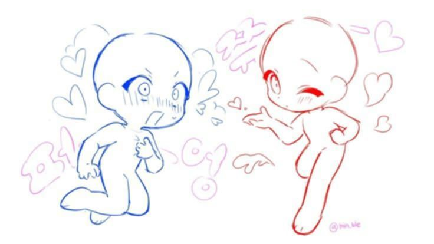

> 해당 이미지에는 두 개의 캐릭터가 그려져 있습니다. 

*   두 캐릭터 모두 머리가 크고 눈이 큰 아기 캐릭터이며, 몸에 비해 머리가 큰 일종의 데포르메 캐릭터로 그려져 있습니다. 
*   왼쪽에 있는 캐릭터는 몸과 얼굴이 파란색으로 칠해져 있고, 오른쪽에 있는 캐릭터는 몸과 얼굴이 빨간색으로 칠해져 있습니다. 
*   두 캐릭터 모두 하트 모양과 흘러나오는 땀방울이 그려져 있어, 사랑과 설렘, 그리고 당황스러움을 표현하고 있습니다. 
*   왼쪽에 있는 캐릭터는 손가락을 입에 물고 당황스러워하는 표정을 짓고 있습니다. 
*   오른쪽에 있는 캐릭터는 한 손을 허벅지에 올리고 한 손을 내밀어 무언가를 말하는 듯한 자세를 취하고 있습니다. 
*   이미지 하단 중앙에는 "@win_ble"이라는 문구가 분홍색으로 적혀 있습니다.

> 해당 이미지는 게임 기획 문서의 일부가 아닌, 인터넷에서 찾을 수 있는 팬아트입니다.

이미지 중앙에 아기 천사 두 명이 묘사되어 있습니다. 

*   두 천사 모두 머리가 크고 눈이 큰 일러스트 스타일로 그려져 있습니다. 
*   왼쪽 천사는 빨간색으로, 오른쪽 천사는 파란색으로 윤곽선이 그려져 있습니다. 
*   두 천사 모두 하체가 묘사되어 있지 않습니다. 
*   왼쪽 천사는 두 손을 입에 가까이 가져가며 수줍은 듯한 표정을 짓고 있습니다. 
*   오른쪽 천사는 손가락으로 왼쪽 천사를 가리키고 있습니다. 
*   두 천사 모두 날개가 그려져 있지만 크기가 작습니다.

이미지에는 하트, 버블 등 귀여움을 강조하는 요소가 포함되어 있습니다. 

*   왼쪽 천사 주변에는 분홍색 하트가 여러 개 그려져 있습니다. 
*   오른쪽 천사 위에는 말풍선이 그려져 있습니다. 
*   두 천사 아래에는 글씨가 적혀 있지만, 선명하지 않아 알아보기 어렵습니다.

이미지 왼쪽 상단에는 "@min_ble"이라는 워터마크가 있습니다.

---

## 슬라이드 13

### 아군 4

| 항목 | 내용 |
| --- | --- |
| 이름 | 더 스타 |
| 성별 | 남성 |
| 키/나이 | 148.5cm |
| 체형 | 전형적인 쇼타 체형. 초 5~6정도. 무릎이 핑크 |
| 성격 | 말랑말랑 활기참, 어리숙하고 미숙한 부분이 있으며 그 점을 부끄러워함. 완벽함을 추구하지만 완벽하지 못함. |
| 말투 |  |
| 역할 | 팀 내 막내, 반짝반짝 빛나고 챙겨주고 싶어지는 포지션 |

#### 인상 참고

#### 체형 참고

> 해당 이미지는 게임 캐릭터의 설정화입니다. 

이미지 중앙에 동일한 캐릭터의 두 가지 버전이 그려져 있습니다. 

두 캐릭터 모두 단발의 검은 머리를 가지고 있으며, 왼쪽 캐릭터는 왼쪽 눈을 가리고 있고, 오른쪽 캐릭터는 양쪽 눈이 모두 보입니다.

캐릭터들은 검은색과 회색조의 혼합된 옷차림을 하고 있습니다. 

*   캐릭터의 상의는 검은색 재킷과 회색조의 꽃무늬가 있는 안감을 가지고 있습니다. 재킷 위에는 여러 개의 장식품이 달려 있습니다. 
*   캐릭터의 하의는 짧은 검은색 바지와 검은색 긴 양말을 착용하고 있습니다. 
*   신발은 높은 굽에 리본이 묶여 있는 부츠를 착용하고 있습니다.

캐릭터의 동작과 표정은 서로 다릅니다. 

*   왼쪽 캐릭터는 손잡이를 들고 있으며, 오른쪽 캐릭터는 모자를 만지고 있습니다.

이미지 중앙에는 캐릭터의 이름과 제작자가 적혀 있습니다. 

*   왼쪽에는 '괴담의28시간'이라는 문구가 있고, 오른쪽에는 '@Dlynn1105'라는 문구가 있습니다.

캐릭터의 배경에는 검은색의 덩굴과 꽃이 그려져 있습니다. 

*   덩굴은 캐릭터의 뒤쪽과 옆쪽으로 뻗어져 있으며, 꽃은 덩굴에 붙어 있습니다. 
*   또한, 두 캐릭터 사이에 하트 모양의 꽃도 그려져 있습니다.

이미지의 전체적인 분위기는 어둡고 신비로우며, 캐릭터의 차림과 배경이 조화롭게 어우러져 있습니다.

> 이미지는 "Bouquet of Dawn"이라는 게임 캐릭터 소개 페이지입니다. 페이지 중앙에는 흰색과 회색의 여우 같은 귀와 꼬리를 가진 소녀가 그려져 있습니다. 소녀는 흰색과 검은색 옷을 입고 있으며, 왼쪽에는 작은 여우 인형를 들고 있습니다. 

페이지 상단에는 "Bouquet of Dawn"이라는 게임 이름과 "SEO"라는 단어가 적혀 있습니다. 페이지 왼쪽에는 "NG"이라는 단어와 함께 "무단 전재", "AI 학습/자체 발언", "다른 사이트에 게시하지 마십시오", "복제 및 2차 사용 금지"라는 문구가 적혀 있습니다. 

페이지 하단에는 일러스트레이터의 정보가 있습니다. 일러스트레이터는 ゆにこん(@yunikon147)입니다. 페이지 오른쪽에는 소녀의 얼굴을 확대한 이미지가 3개 있습니다. 배경은 회색이며, 금색 선과 십자가 모양의 장식이 있습니다.

---

## 슬라이드 14

### 아군 4

#### 바지와 니삭스 사이 살 영역 좁게

#### 달라붙는 짧은 반바지, 벙벙한 겉옷

#### + 코트 테일 + 금속제 장식 많이

#### 머리카락으로 강아지 or 롭이어 토끼 귀 형태 만들기

#### 체형 참고

#### 마른 쇼타 체형

#### 손이 작다.

#### 발도 작다.

#### Sd 스탠딩 레퍼런스

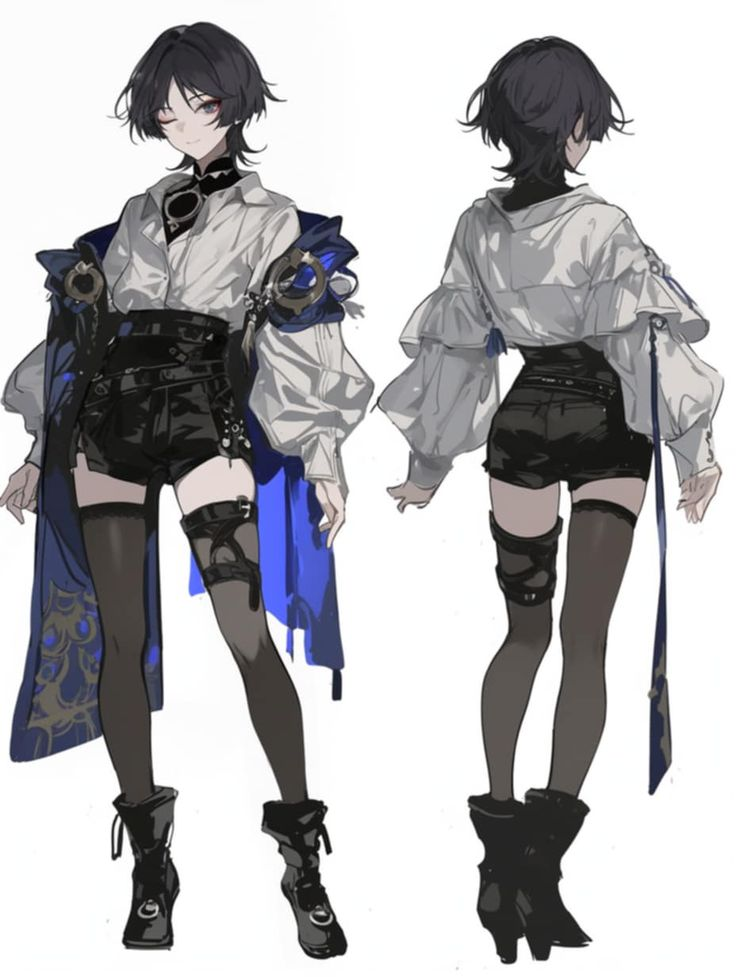

> 해당 이미지는 게임 캐릭터의 기획 문서 일부로 추정됩니다. 

이미지에는 동일한 캐릭터의 전면과 후면의 모습이 담겨 있습니다. 

*   캐릭터의 생김새 

    *   짧은 검은색 머리카락과 한쪽 눈이 감긴 채 있는 캐릭터입니다. 
    *   캐릭터의 눈동자는 적색입니다. 
    *   키가 큰 편이며 날씬한 체형입니다. 
*   캐릭터의 의상 

    *   회색 긴팔 셔츠와 검은색 반바지를 입고 있습니다. 
    *   추가로, 왼쪽에는 파란색과 금색 무늬가 있는 긴 코트를 입고 있습니다. 
    *   코트의 왼쪽에는 금속장식이 묶여 있습니다. 
    *   검은색 하이힐 부츠를 착용하고 있습니다. 
    *   무릎 부위에 검은색 스타킹이 찢어져 있습니다. 
*   캐릭터의 표현 

    *   전면의 모습에서는 캐릭터가 정면을 응시하고 있습니다. 
    *   후면의 모습에서는 캐릭터의 뒷모습을 표현했습니다. 
    *   후면의 모습에서는 캐릭터가 뒤를 돌아보는 듯한 모습을 표현했습니다. 
*   배경 

    *   이미지의 배경은 흰색입니다.

> 해당 이미지는 게임 캐릭터의 일러스트입니다. 

### 캐릭터 

*   **캐릭터의 생김새**: 단발의 회색 머리를 가진 캐릭터입니다. 눈은 보라색이며, 캐릭터의 왼쪽 눈썹은 반달 모양입니다. 
*   **캐릭터의 의상**: 흰색과 하늘색이 섞인 옷을 입고 있습니다. 옷에는 달과 별 모양의 금색 장식품이 있습니다. 
*   **캐릭터의 무기**: 오른손에 금색 지팡이를 들고 있습니다. 

### 배경 

*   배경은 짙은 남색이며, 캐릭터의 뒤로 달과 별 모양의 금색 장식품이 있습니다. 

### UI 요소 

*   **레이어 창**: 이미지의 오른쪽에 포토샵의 레이어 창이 있습니다. 
*   **텍스트**: 이미지의 하단에 "DO NOT USE"라는 텍스트가 있습니다. 또한, "This is an individual commission work. Please do not use, repost, or re-edit this picture without permission of the author."라는 텍스트가 있습니다. 
*   **워터마크**: 이미지의 하단에는 하트 모양의 워터마크가 있고, 그 옆에 "@若舟"라는 텍스트가 있습니다. 
*   **투톤 효과**: 이미지의 하단에는 "FRIENDS OF FANTASY"라는 텍스트가 반투명한 흰색으로 표시되어 있습니다. 

### 아이콘 

*   **달과 별**: 이미지의 상단에는 달과 별 모양의 금색 장식품이 있습니다. 
*   **금색 지팡이**: 캐릭터의 오른손에 금색 지팡이가 있습니다. 

### 구조 

*   **이미지 레이아웃**: 이미지는 캐릭터가 중앙에 위치하도록 배치되어 있습니다. 
*   **배경**: 배경은 짙은 남색이며, 캐릭터의 뒤로 달과 별 모양의 금색 장식품이 있습니다.

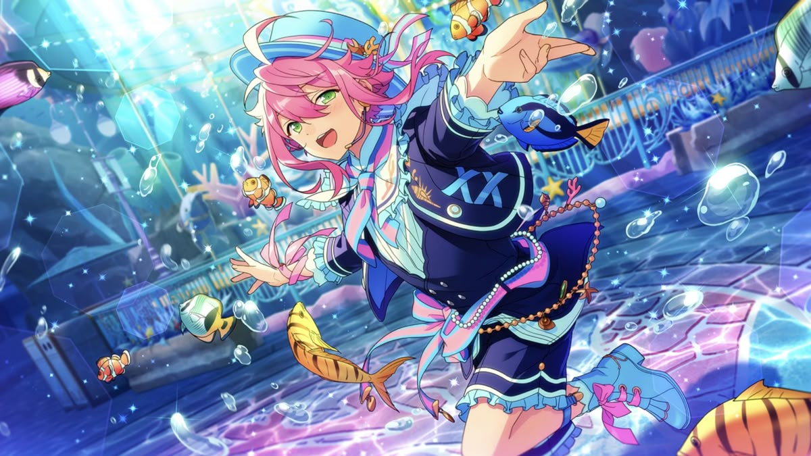

> 해당 이미지에는 한 명의 캐릭터와 여러 마리의 물고기, 그리고 수중 구조물과 같은 배경이 포함되어 있습니다.

*   캐릭터: 이미지 중앙에는 분홍색 머리와 녹색 눈을 가진 소녀가 있습니다. 그녀는 파란색과 흰색의 모자를 쓰고 있으며, 파란색과 흰색이 섞인 옷을 입고 있습니다. 그녀의 옷에는 여러 가지 장식품이 달려 있습니다. 그녀의 왼팔에는 하트 모양의 펜던트가 달린 목걸이를 착용하고 있습니다. 오른손은 들어 올리고 왼손은 내리고 있습니다.
*   물고기: 여러 마리의 물고기들이 캐릭터 주변을 헤엄치고 있습니다. 물고기들은 주황색, 노란색, 그리고 하얀색입니다. 
*   배경: 배경에는 수중 구조물이 있습니다. 구조물은 파란색과 보라색으로 구성되어 있으며, 여러 가지 조명과 거품이 떠 있습니다. 배경의 오른쪽에는 하얀 난간이 보입니다.

전체적으로 이 이미지는 밝고 화려한 색상으로 구성되어 있으며, 캐릭터와 물고기들이 함께 어우러져 있습니다.

---

## 슬라이드 15

### 아군 5

| 항목 | 내용 |
| --- | --- |
| 이름 | 하이 프리스테스 |
| 성별 | 여성 |
| 키/나이 | 170cm/67세 |
| 체형 | 가슴 크고 꼿꼿한 느낌. |
| 성격 | 신중하고 차분하다. 우아하고 고고한 느낌의 비밀스러운 여제 같은 스타일 |
| 말투 |  |
| 역할 | 신비롭고 믿음이 가는 조언자, 리더 캐릭터. 계략가 |

> 이미지 중앙에는 여성, 에바 노이만의 모습이 그려져 있습니다. 여성은 금발의 머리를 가지고 있으며, 회갈색의 눈과 빨간 입술이 인상적입니다. 그녀는 화려한 귀걸이와 목걸이를 착용하고 있으며, 회백색의 긴팔 옷을 입고 있습니다. 옷은 V넥에 벨트가 허리 부분에 묶여 있습니다. 여성은 짙은 갈색의 가죽 의자에 앉아 있습니다.

이미지 상단 왼쪽에는 "Eva Neumann"이라는 이름이 붉은 필기체로 적혀 있습니다. 이미지 상단 오른쪽에는 "생일: 3월 19일, 나이: 43세, 신장: 168cm"이라는 문구가 붉은 필기체로 적혀 있습니다. 이미지 하단 왼쪽에는 "@lyuksa"라는 문구가 붉은 필기체로 적혀 있습니다.

이미지의 배경은 흰색이며, 여성의 뒤에는 흐릿한 무늬가 있습니다.

> 이미지 중앙에 서 있는 여성 캐릭터의 모습이 그려져 있습니다. 여성은 짧은 백발에 피부가 하얗고, 파란 눈을 가지고 있습니다. 입술은 옅은 핑크색입니다.

여성의 머리는 약간 긴 단발머리이며, 머리를 넘긴 오른쪽 귀 뒤에 커다란 귀걸이가 보입니다. 

얼굴 왼쪽에 위치한 눈과 오른쪽에 위치한 눈의 크기가 다른 것을 확인할 수 있습니다.

여성은 흰색의 오프숄더 드레스를 입고 있습니다. 드레스의 상의는 트임이 있고, V자 모양으로 가슴 부분이 깊게 파여 있습니다. 

고개를 숙이면 풍만한 가슴이 노출될 것 같은 착안입니다. 드레스 하의는 무릎까지 오는 길이로, 허리 부분이 잘록해 보입니다.

여성의 어깨에는 흰색 깃털이 달린 망토를 착용하고 있습니다. 망토의 깃털은 왼쪽 어깨부터 시작하여, 양쪽 어깨를 덮고 있습니다. 

망토의 본체는 짙은 검은색이며, 은색 실이 오간 자수가 새겨져 있습니다. 허리에는 검은색 허리띠를 착용하고 있습니다.

여성의 손은 양손을 포개어 앞으로 내밀고 있습니다. 손톱이 길게 그려져 있으며, 손등에 반지는 착용하고 있습니다.

여성의 목에는 여러 개의 목걸이를 착용하고 있습니다. 귀걸이는 귓불에 가까울수록 큰 꽃 모양의 디자인입니다.

배경은 단조로운 하늘색입니다.

---

## 슬라이드 16

### 아군 5

#### 시민 스타일 복식

#### 모자부터 이어진 얼굴을 가린 베일

#### 넣으면 좋겠다.

#### 레퍼런스 이미지보다는 가슴 크게

#### 곡선 강조.

#### 팔 다리 길게

#### 전체적 모양새는 긴 삼각형

#### SD 모양새도

#### 아래로 갈 수록

#### 펑퍼짐

> 이미지는 게임 기획 문서의 일부가 아닌 것 같습니다. 

이미지 중앙에는 검은색 모자를 쓴 여성이 테이블에 앉아 있는 모습이 담겨 있습니다. 이 여성은 검은색 상의를 입고 있으며, 동일한 색상의 긴 장갑을 착용하고 있습니다. 

여성의 얼굴은 보이지 않으며, 시야를 가리는 긴 술 장식이 달린 모자를 쓰고 있습니다. 

그녀는 테이블에 팔꿈치를 대고 양손을 모으고 있습니다. 테이블 위에는 빨간색의 둥근 테이블보가 깔려 있고, 그 위에 책 한 권과 와인잔이 놓여 있습니다. 책은 검은색 커버에 흰색 페이지가 있는 것으로 보입니다. 

배경에는 회색 벽과 나무 패널이 보입니다. 이 이미지는 게임 기획 문서와 관련이 없어 보이며, 예술적 표현이나 특정한 분위기를 전달하기 위해 사용된 이미지일 수 있습니다.

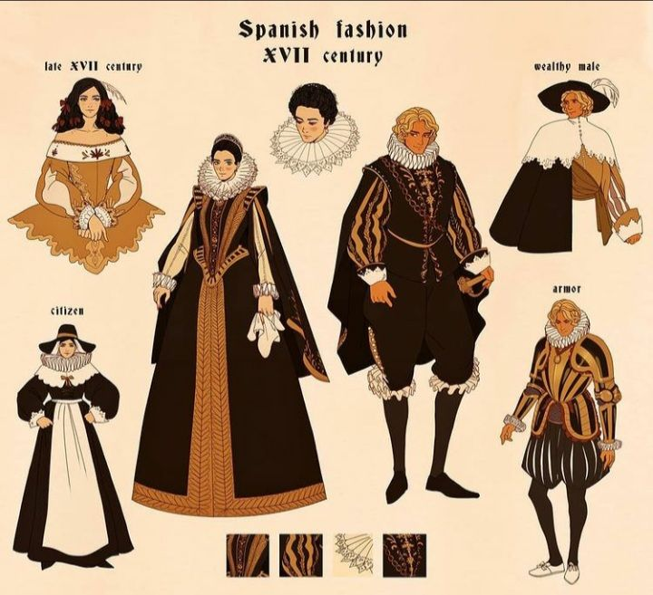

> 스페인 17세기 패션

이미지 중앙 상단에 **"Spanish fashion XVII century"**라고 쓰여 있습니다.

이미지 상단 왼쪽에는 **17세기 후반**의 여성 복식이 그려져 있습니다. 긴, 구불구불한 갈색 머리를 가진 여성은 오프숄더 스타일의 노란색 드레스를 입고 있습니다. 

그 오른쪽에는 검은 머리를 짧게 자른 여성의 모습이 그려져 있습니다. 이 여성은 하얀 깃털 달린 모자를 쓰고 하얀 레이스가 달린 검은색 옷을 입고 있습니다. 

이미지 중앙에는 **시민**의 모습이 왼쪽에, **부유한 남성**의 모습이 오른쪽에 그려져 있습니다. 

시민으로 추정되는 여성은 검은색과 하얀색의 긴 드레스를 입고 검은색의 큰 모자를 쓰고 있습니다. 

부유한 남성은 검은색과 노란색 줄무늬가 있는 옷을 입고 있습니다. 

가장 오른쪽 상단에는 부유한 남성의 모습이 또 그려져 있습니다. 이 남성은 큰 검은색 모자를 쓰고, 검은색 망토를 입고 있습니다. 

가장 왼쪽 하단에는 중세 갑옷을 입은 남성의 모습이 그려져 있습니다. 

가장 오른쪽 하단에는 노란색과 검은색 줄무늬가 있는 옷을 입은 남성이 그려져 있습니다. 

화면 중앙 하단에는 4개의 작은 직사각형이 있습니다. 

첫 번째와 세 번째, 네 번째 직사각형에는 노란색과 검은색 줄무늬가 있는 패턴이 그려져 있고, 두 번째 직사각형에는 노란색과 검은색의 꽃 패턴이 그려져 있습니다. 

이미지 배경은 살구색입니다.

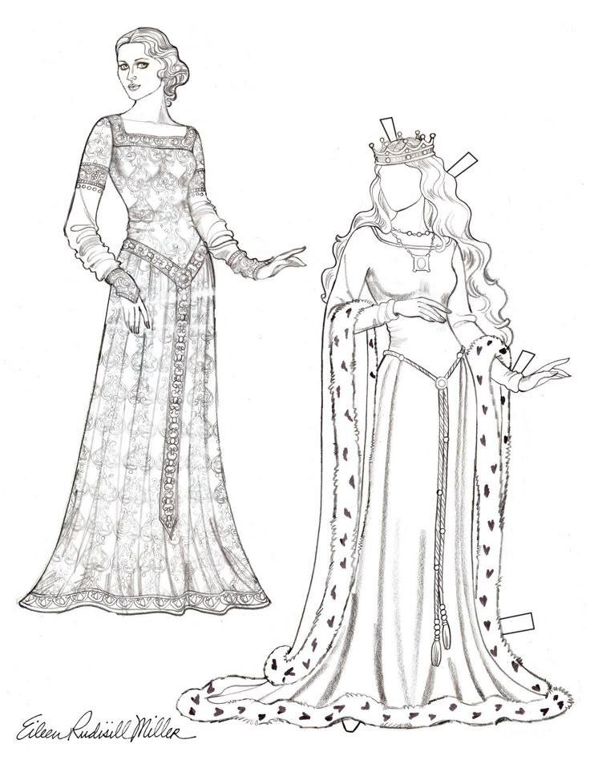

> 해당 이미지는 두 명의 여성 캐릭터의 컨셉 아트로 추정됩니다. 

왼쪽 여성 캐릭터는 머리를 묶은 포니테일 헤어스타일을 하고 있습니다. 눈동자가 녹색으로 그려진 것이 특징입니다. 여성 캐릭터는 긴 소매가 달린 드레스를 입고 있습니다. 드레스의 상의와 하의에는 동일한 패턴의 꽃무늬가 그려져 있습니다. 드레스 상의 왼쪽에는 3개의 단추, 하의에는 중앙에 꽃 패턴의 띠가 그려져 있습니다. 

오른쪽 여성 캐릭터는 긴 머리를 한 캐릭터로 왕관을 쓰고 있습니다. 왕관 뒤로는 두 개의 칼이 십자가 모양으로 꽂혀 있는 것을 확인할 수 있습니다. 왕을 상징하는 듯한 왕관을 쓴 캐릭터는 긴팔 옷을 입고 있으며, 옷 위로 겉옷을 입고 있습니다. 겉옷에는 하트 모양의 무늬가 그려져 있습니다. 캐릭터는 허리춤에 로프 모양의 허리띠를 착용하고 있습니다. 

두 캐릭터 모두 얼굴을 제외한 전신의 모습을 그리고 있습니다. 이미지 하단 왼쪽에는 Eileen Rudisill Miller라는 이름이 영문으로 적혀 있습니다.

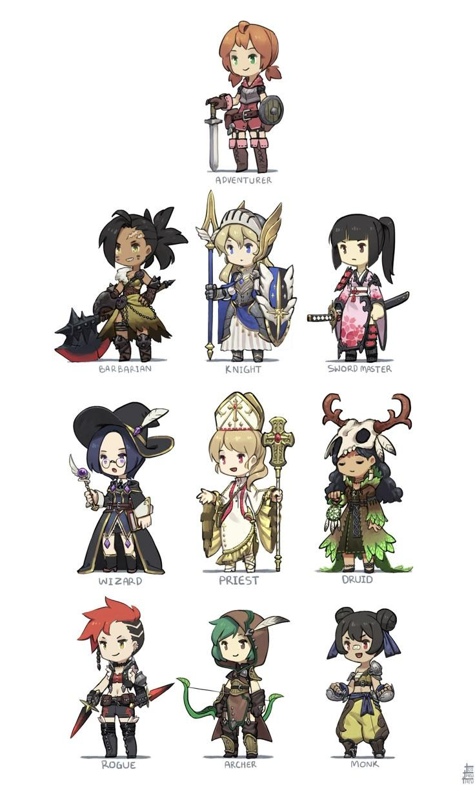

> 해당 이미지에는 게임 캐릭터 10개의 직업군이 그려져 있습니다.

각각의 직업 캐릭터는 다음과 같습니다.

*   **어드벤처러(Adventurer)**: 오렌지색 머리를 가진 여성 캐릭터입니다. 오른손에 방패를 들고 왼손에 검을 착용하고 있습니다. 
*   **바바리안(Barbarian)**: 검은 머리를 한 여성 캐릭터입니다. 왼손에 무기를 들고 오른쪽 허벅지에 검은색 방패가 묶여있습니다. 
*   **나이트(Knight)**: 금발의 긴 머리를 한 여성 캐릭터입니다. 왼손에 방패를 들고, 오른손에 검이 있습니다. 
*   **소드 마스터(Sword Master)**: 검은 머리를 한 여성 캐릭터입니다. 허리춤에 일본도를 착용하고 있습니다. 
*   **위자드(Wizard)**: 짧은 보라색 머리를 한 여성 캐릭터입니다. 왼손에 지팡이를 들고 있습니다. 
*   **프리스트(Priest)**: 금발의 긴 머리를 한 여성 캐릭터입니다. 오른손에 지팡이를 들고 있습니다. 
*   **드루이드(Druid)**: 긴 검은 머리를 한 여성 캐릭터입니다. 사슴뿔이 달린 모자를 쓰고 있습니다. 
*   **로그(Rogue)**: 빨간 머리를 한 남성 캐릭터입니다. 허리춤에 단검을 착용하고 있습니다. 
*   **아처(Archer)**: 녹색 머리를 한 여성 캐릭터입니다. 등에 녹색 활을 메고 있습니다. 
*   **몽크(Monk)**: 검은 머리를 한 여성 캐릭터입니다. 주먹을 쥐고 있습니다. 

모든 캐릭터는 만화 캐릭터처럼 귀엽게 생긴 모습이며, 각각의 직업에 맞는 무기를 착용하고 있습니다.

---

## 슬라이드 17

### 중간보스 1

| 항목 | 내용 |
| --- | --- |
| 이름 | 채리엇 |
| 성별 | 남성 |
| 키/나이 | 190cm/30세 |
| 체형 | 역삼각형의 다부진 근육 몸매 굳은 살 많은 굵은 손가락 |
| 성격 | 하고 싶은 대로 하는 성격.  화가 많고 원하는 대로 안되면 부숴버린다. |
| 말투 |  |
| 역할 | 힘만 좋은 교단의 개 칭찬 좋아하고 무자비한 악당 |

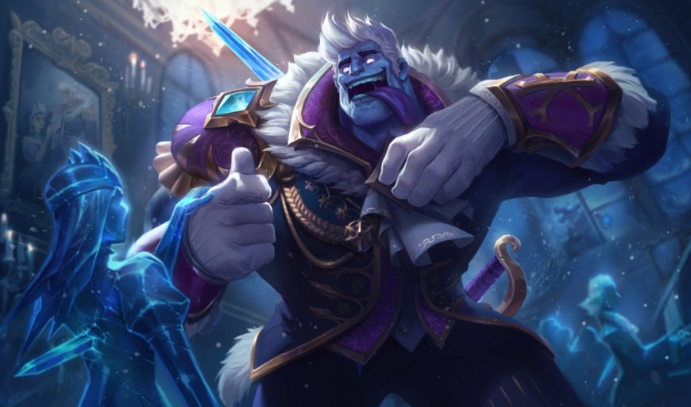

> 이미지는 게임 캐릭터가 등장하는 일러스트입니다. 

### 이미지 속 캐릭터 

*   큰 키와 근육질의 체격을 가진 남성이 중앙에 위치하고 있습니다. 
*   남성의 머리는 흰색이며, 눈은 보라색입니다. 눈은 반만 뜨인 채로 표현되어 있습니다. 
*   남성의 입꼬리는 올라가 있고, 송곳니가 노출되어 있어 공격적인 인상을 줍니다. 
*   남성의 오른쪽 눈썹은 짙은 보라색이며, 왼쪽 눈썹은 하얀색입니다. 
*   남성의 머리는 가운데가 아닌 오른쪽으로 치우쳐져 있습니다. 
*   남성의 귀는 뾰족하며, 귀 끝은 날카롭습니다. 
*   남성의 왼쪽 귀에는 보라색의 긴 리본이 묶여 있습니다. 
*   남성의 목과 어깨에는 하얀색 털이 나 있습니다. 
*   남성의 가슴과 어깨에는 보라색 갑옷이 착용되어 있습니다. 
*   갑옷에는 금색 테두리가 있고, 어깨 부분에는 날개 모양의 금색 장식이 있습니다. 
*   남성의 왼쪽 팔꿈치에는 날개 모양의 금속 보호대가 있습니다. 
*   남성의 오른팔에는 보라색과 금색의 팔보호구가 있습니다. 
*   오른팔의 보호구에는 날카로운 날이 솟아 있습니다. 
*   남성의 손가락은 굵고 길며, 손톱은 날카롭습니다. 
*   남성의 손바닥에는 털이 나 있습니다. 
*   남성의 왼쪽에는 파란색의 유령과 같은 캐릭터가 있습니다. 
*   유령과 같은 캐릭터는 긴 머리를 가지고 있습니다. 
*   유령과 같은 캐릭터의 오른쪽에는 보라색과 금색의 화려한 액자가 벽에 붙어 있습니다. 
*   액자 안에는 두 명의 남성이 그려져 있습니다. 
*   이미지의 배경에는 여러 개의 창문과 벽난로가 있습니다. 
*   벽난로 안에는 촛불이 밝혀져 있습니다. 
*   이미지의 오른쪽 하단에는 유령과 같은 캐릭터가 또 하나 있습니다. 
*   유령과 같은 캐릭터는 바이올린을 연주하고 있습니다. 
*   이미지의 전반적인 색감은 보라색과 파란색입니다. 
*   이미지의 분위기는 어둡고, 신비로워 보입니다. 
*   이미지의 중앙에 위치한 캐릭터는 분노한 표정으로 무언가를 크게 외치고 있는 듯한 모습을 하고 있습니다. 
*   이미지의 중앙에 위치한 캐릭터의 오른팔에는 보라색과 금색의 팔보호구가 있습니다. 
*   이미지의 중앙에 위치한 캐릭터의 왼팔에는 금속 보호대가 있습니다. 
*   이미지의 중앙에 위치한 캐릭터의 가슴에는 보라색과 금색의 가슴보호구가 있습니다. 
*   이미지의 중앙에 위치한 캐릭터의 어깨에는 하얀색 털이 나 있습니다. 
*   이미지의 중앙에 위치한 캐릭터의 머리는 흰색이며, 눈은 보라색입니다. 
*   이미지의 중앙에 위치한 캐릭터의 귀는 뾰족하며, 귀 끝은 날카롭습니다. 
*   이미지의 중앙에 위치한 캐릭터의 왼쪽 귀에는 보라색의 긴 리본이 묶여 있습니다. 
*   이미지의 중앙에 위치한 캐릭터의 입꼬리는 올라가 있고, 송곳니가 노출되어 있어 공격적인 인상을 줍니다. 
*   이미지의 중앙에 위치한 캐릭터의 눈은 반만 뜨인 채로 표현되어 있습니다. 
*   이미지의 중앙에 위치한 캐릭터의 손가락은 굵고 길며, 손톱은 날카롭습니다. 
*   이미지의 중앙에 위치한 캐릭터의 손바닥에는 털이 나 있습니다. 
*   이미지의 중앙에 위치한 캐릭터는 큰 키와 근육질의 체격을 가지고 있습니다.

> 이미지는 왕관을 쓴 남성의 상반신 일러스트입니다.

*   이미지 중앙에는 왕관을 쓴 남성이 있습니다. 남성은 수염을 길게 기르고 있으며, 짙은 보라색과 금색이 조합된 왕관을 쓰고 있습니다. 왕관의 왼쪽에는 보석이 박혀 있습니다. 남성의 눈썹은 짙고 두꺼우며, 코는 크고 입꼬리가 아래로 향하고 있습니다. 남성의 머리카락은 가운데로 갈라진 상태로 어깨까지 내려오고, 수염은 가슴까지 내려와 있습니다. 남성의 오른쪽 귀 뒤로는 긴 머리가 목을 따라 내려와 있습니다.
*   남성은 보라색과 금색이 조합된 옷을 입고 있습니다. 옷의 왼쪽 어깨에는 붉은색 무늬가 있고, 오른쪽 어깨에는 금색으로 된 식물 무늬가 있습니다. 남성의 가슴에는 금색 허리띠를 착용하고 있으며, 허리띠 중앙에는 사자 머리가 그려져 있습니다. 
*   남성의 왼쪽 팔에는 팔찌를 착용하고 있습니다. 팔찌는 여러 개의 사각형이 모여 있는 형태입니다. 남성의 오른쪽 팔꿈치 안쪽에는 여러 개의 선이 새겨져 있습니다. 
*   남성의 오른쪽 손가락은 굽어진 채로 앞으로 뻗어져 있습니다. 왼손은 옷 위로 올려진 채로 손바닥이 아래를 향하고 있습니다. 
*   배경은 보라색과 주황색이 혼합된 색상으로, 구름이 흐르는 듯한 모습을 하고 있습니다.

---

## 슬라이드 18

### 중간보스 1 레퍼런스

#### 복식

#### 하층민식 전투복

#### (더럽고 찢어져야 할 듯)

#### 몸 자체가 크고 단단함

#### 피부 톤이 까무잡잡한 느낌

#### 너무 쾌남이 되지 않게 주의

#### 지성 빼주세요

#### SD 상태 스탠딩에서는

#### 더 과한 상체 근육 뚱뚱 데포르메로 디자인

#### SD 데포르메 예시

#### 주먹으로 싸우기

#### 너클 추가해도 좋을 듯

#### LD 데포르메 예시

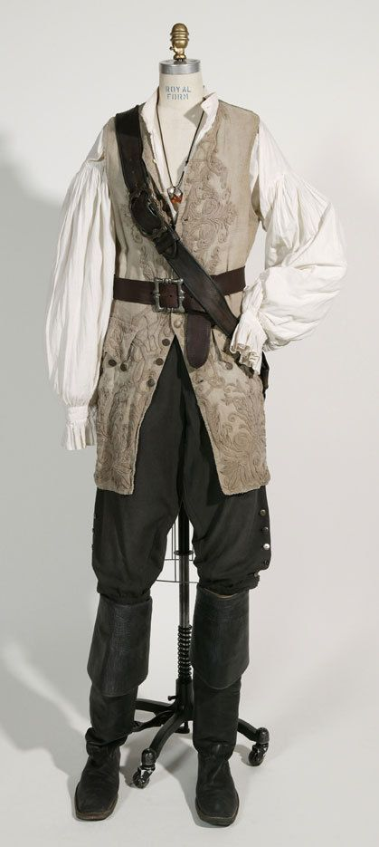

> 해당 이미지에는 사람의 상반신 형태를 표현한 마네킹이 있습니다. 마네킹의 머리는 보이지 않으며, 마네킹의 몸통에는 'ROYAL FORM'이라는 문구가 적혀 있습니다. 

마네킹은 하얀색의 긴 소매 옷을 입고 있으며, 그 위에 베이지색의 조끼를 입고 있습니다. 조끼의 앞면에는 꽃과 덩굴이 어우러진 듯한 무늬가 있습니다. 조끼의 왼쪽에는 주머니가 있고, 단추는 4개입니다. 마네킹은 조끼 밑에 묶여 있는 허리띠를 착용하고 있습니다. 허리 왼쪽으로는 짙은 갈색의 가방이 걸쳐져 있습니다. 마네킹은 검은 바지와 부츠를 착용하고 있습니다. 바지 왼쪽 허벅지에는 단추 4개가 묶여있습니다. 마네킹의 왼쪽 손목에는 커프스가 묶여있습니다. 마네킹에는 목걸이가 묶여있습니다. 

마네킹은 네 개의 바퀴가 달린 받침대 위에 서 있습니다. 받침대의 윗부분에는 금색의 장식품이 있습니다. 배경은 밝은 회색이며, 마네킹의 그림자가 벽에 드리워져 있습니다.

> 사쿠라기 하나미치(桜木花道, Sakuragi Hanamichi)라는 남자 캐릭터의 일러스트입니다. 

*   캐릭터의 생김새: 

    *   붉은색 짧은 헤어스타일에 바스켓볼 유니폼을 입고 있습니다. 
    *   눈꼬리가 올라간 표정으로 웃고 있는 모습입니다. 
    *   왼쪽 귀에 귀걸이를 착용하고 있습니다. 
    *   이마와 얼굴, 팔 등에 땀이 맺혀 있는 것으로 보아 운동 후인 것 같습니다. 
*   배경 

    *   배경은 흰색이며, 뒷배경에 슬래시마크가 그어진 듯한 디자인이 있습니다. 
*   텍스트 

    *   왼쪽에 '쇼호쿠', '4', '사쿠라기 하나미치'라고 적혀 있습니다. 
    *   '쇼호쿠'와 '4'는 검은색으로, '사쿠라기 하나미치'는 빨간색으로 표시되어 있습니다. 
*   오브젝트 

    *   화면 왼쪽에 농구공이 일부 보입니다.

> 이미지는 게임 캐릭터의 콘셉트 아트 또는 프로토 타입으로 추정되는 스케치입니다. 

## 이미지의 레이아웃 및 구조

이미지는 중앙에 근육질의 남성 캐릭터가 크게 그려져 있습니다. 

## 캐릭터

*   근육질의 남성 캐릭터가 중앙에 크게 그려져 있습니다.
*   캐릭터는 상의를 탈의한 상태이며, 바지와 벨트를 착용하고 있습니다.
*   얼굴은 그려져 있지 않습니다.

## 배경

*   배경은 흰색이며, 캐릭터의 움직임과 근육을 강조하기 위해 최소한의 선과 음영만으로 구성되어 있습니다.

## 텍스트 및 아이콘

*   이미지에는 텍스트나 아이콘이 포함되어 있지 않습니다. 
*   다만, 우측 상단에 작게 흘림체로 된 한국어 문자가 일부 보입니다.

> 이미지는 게임의 전투 장면을 보여 주고 있습니다. 게임 화면은 여러 부분으로 나뉘어져 있습니다.

*   화면 상단: 

    *   시계 모양의 아이콘과 숫자가 표시되어 있습니다. (예: 6)
    *   웨이브 정보를 표시하는 영역이 있습니다. (예: WAVE: 2/3)
*   화면 상단 중앙: 

    *   플레이어 캐릭터 2명과 몬스터가 전투를 벌이고 있습니다.
    *   플레이어 캐릭터는 각각 다른 능력을 가진 것으로 보입니다. 
    *   각 캐릭터의 이름이나 정보는 표시되지 않았지만, 플레이어 캐릭터의 머리색, 복장, 무기 등이 서로 다릅니다.
    *   몬스터는 큰 고양이 형태입니다.
    *   플레이어 캐릭터와 몬스터의 체력바가 표시되어 있습니다. 
*   화면 하단:

    *   여러 가지 색상의 보석 또는 수정이 있습니다. 
    *   각 보석은 다른 색상을 나타냅니다. (예: 파란색, 보라색, 노란색 등)
    *   보석들은 배열되어 있고, 플레이어가 사용할 수 있는 스킬 또는 능력과 관련된 것으로 보입니다.
    *   화면 하단 중앙: 
        *   두 개의 큰 원형 버튼이 있습니다. 
        *   버튼은 활성화된 상태로 보입니다. 
    *   화면 하단 우측:

        *   원형의 아이콘이 있습니다.

---

## 슬라이드 19

### 중간보스 2

| 항목 | 내용 |
| --- | --- |
| 이름 | 허밋 |
| 성별 | 여성 |
| 키/나이 | 175cm/72세 |
| 체형 | 마른 근육, 길쭉한 느낌 |
| 성격 | 말이 많지 않음, 신중하고 침착. |
| 말투 |  |
| 역할 | 충성 계열 지능 캐릭터, 아군 NPC의 반대 되는 쪽. |

> 해당 이미지는 애니메이션 스타일의 일러스트입니다. 

이미지 중앙에는 커다란 의자에 노인이 앉아 있습니다. 노인은 흰 머리를 짧게 자르고 왼쪽 머리를 핀으로 고정하고 있습니다. 머리의 오른쪽에는 분홍색 머리장식이 있습니다. 노인은 붉은색과 노란색이 조합된 고급스러운 옷을 입고 있습니다. 옷에는 여러 개의 보석이 박혀 있습니다. 노인은 왼팔을 의자에 기대고 손을 턱에 괴고 있습니다. 

노인의 오른쪽에는 작은 테이블이 있습니다. 테이블 위에는 강아지가 유리구에 갇혀 있습니다. 강아지는 몸이 통통한 편이며, 귀가 쳐지면서 털이 복슬복슬합니다. 강아지는 엎드려 있습니다. 테이블의 왼쪽에는 긴 손잡이가 있습니다.

노인의 오른쪽 뒤로는 젊은 여성이 서 있습니다. 여성은 머리가 짧고, 눈이 크며, 입꼬리가 올라가 있습니다. 여성은 베이지색 재킷과 흰색 바지를 입고 있습니다. 재킷의 앞면에는 버튼이 하나 있고, 옷깃은 하얀색입니다.

이미지의 배경에는 큰 창문과 바깥 풍경이 있습니다. 창문 밖에는 나무와 잔디가 보입니다. 바닥은 타일로 되어 있습니다. 

이미지에는 텍스트가 없습니다.

---

## 슬라이드 20

### 중간보스 2 레퍼런스

#### 팔 다리가 길쭉하고 얇은 느낌

#### 살짝 창백한 피부, 주름 많이.

#### 장교 같은 느낌.

#### 비밀스러운 느낌으로

#### 후드를 씌워도 좋을 듯

#### 푸근한 할머니처럼

#### 나왔다가 후드 벗으면서

#### 섹시 할머니가 되는거 좋네요

#### SD는 지팡이 짚은 포즈

#### 얇고 길쭉한 형태감

> 이 게임 기획 문서의 일부인 이미지는 여러 캐릭터의 디자인 컨셉 아트를 보여 주고 있습니다. 

이미지는 상하 두 부분으로 나뉘어져 있습니다. 상단에는 네 명의 캐릭터가, 하단에는 다섯 명의 캐릭터가 그려져 있습니다.

상단 왼쪽부터 첫 번째 캐릭터는 검은색과 금색으로 장식된 군복을 입고 있습니다. 이 캐릭터는 허리춤에 손을 넣고 있습니다. 두 번째 캐릭터는 회색과 금색으로 장식된 군복을 입고 있습니다. 이 캐릭터는 한 손을 주머니에 넣고 있습니다. 세 번째 캐릭터는 회색과 금색으로 장식된 군복을 입고 있습니다. 이 캐릭터는 한쪽 손을 내리고 있습니다. 네 번째 캐릭터는 검은색과 금색으로 장식된 군복을 입고 있습니다. 이 캐릭터는 한쪽 손을 내리고 있습니다.

하단 왼쪽부터 첫 번째 캐릭터는 회색과 금색으로 장식된 군복을 입고 있습니다. 이 캐릭터는 손을 허리춤에 넣고 있습니다. 두 번째 캐릭터는 회색과 금색으로 장식된 군복을 입고 있습니다. 이 캐릭터의 디자인은 미완성으로 그려져 있습니다. 세 번째 캐릭터는 회색과 금색으로 장식된 군복을 입고 있습니다. 이 캐릭터는 양쪽 손을 내리고 있습니다. 네 번째 캐릭터는 하얀색과 금색으로 장식된 군복을 입고 있습니다. 이 캐릭터의 디자인은 미완성으로 그려져 있습니다.

모든 캐릭터는 유사한 체형과 헤어스타일을 가지고 있지만, 각기 다른 색상과 디자인의 군복을 입고 있습니다. 배경은 베이지색입니다.

> 이미지는 한 여성 캐릭터의 컨셉 아트입니다. 여성은 짧은 백발에 노란색의 선글라스를 착용하고 있으며, 녹색 바지 정장과 검은색 상의를 입고 있습니다. 바지 정장의 벨트에는 'AUX'라는 단어가 적혀 있습니다. 여성은 한 손에는 담배를 들고 있고, 다른 한 손에는 검은색의 카드를 들고 있습니다. 또한 회색의 옷이 걸쳐져 있습니다. 여성은 검은색의 하이힐을 착용하고 있습니다. 배경은 검은색이며, 미세한 격자 무늬가 있습니다.

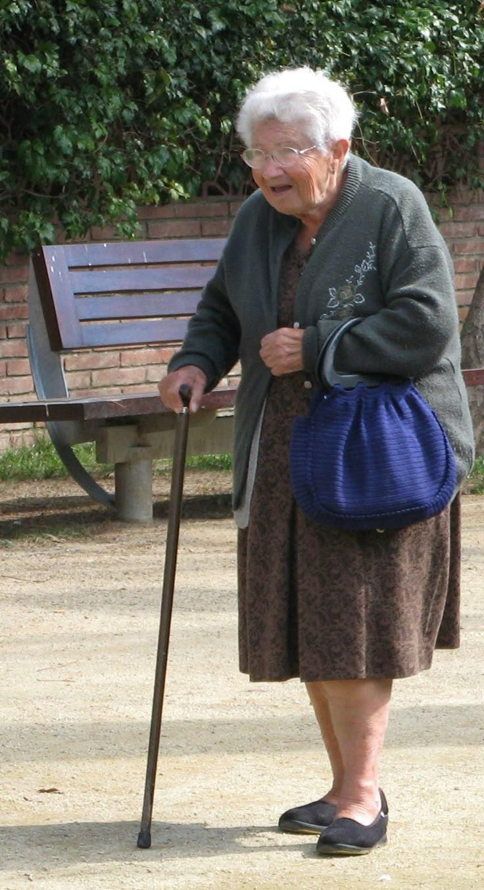

> 이 사진은 한 노인을 묘사하고 있습니다. 노인은 흰 머리를 가지고 있으며, 짙은 녹색의 스웨터를 입고 있습니다. 그 아래에는 짙은 갈색의 꽃무늬가 있는 드레스를 입고 있습니다. 그녀는 검은색 신발을 신고 있으며, 파란색의 가방을 들고 있습니다. 또한, 노인은 검은색 지팡이를 잡고 있습니다. 

사진의 배경에는 나무 벤치가 보입니다. 벤치는 짙은 갈색이며, 벽돌 벽 앞에 위치해 있습니다. 벽 뒤로는 녹색의 나무가 보입니다. 노인은 벤치 앞의 모래 위에 서 있습니다.

> 이미지는 게임 기획 문서의 일부로 추정되며, 다음과 같은 요소들을 포함하고 있습니다.

*   이미지 중앙에는 한 소녀가 있습니다. 
*   소녀의 생김새: 긴 베이지색 머리카락과, 뾰족한 귀, 큰 눈, 짙은 눈썹, 작은 코, 옅은 핑크색 입술이 있습니다. 
*   캐릭터의 복장은 갈색 상의, 짧은 치마, 부츠를 착용하고 있습니다. 
*   캐릭터는 오른손에 지팡이를 들고 있습니다. 지팡이의 머리 부분에는 노란색의 별 모양의 빛나는 무늬가 있습니다. 
*   캐릭터의 왼손에는 푸른색의 빛나는 구체를 쥐고 있습니다. 
*   캐릭터의 머리 뒤쪽에는 커다란 갈색 날개가 있습니다. 
*   캐릭터는 푸른색의 구체 안에 있습니다. 구체 안에는 푸른색의 액체가 소용돌이 치듯이 표현되어 있습니다. 
*   구체의 아래쪽에는 3개의 촛불이 있습니다. 
*   이미지의 하단 왼쪽에는 빨간색 삼각형이 있습니다. 
*   이미지의 오른쪽에는 하얀색 여백이 있습니다.

---

## 슬라이드 21

### 중간보스 3

| 항목 | 내용 |
| --- | --- |
| 이름 | 저지먼트 |
| 성별 | 여성 |
| 키/나이 | 155cm/17세 |
| 체형 | 얇은 여자아이 체형 |
| 성격 | 성가신 여자아이, 질투 많고 찌질, 거만, 와가마마, 츤데레(메스가키 아님) |
| 말투 |  |
| 역할 | 저스티스의 경쟁자, 인정 욕구가 커서 주인공을 처리하려는 포지션 |

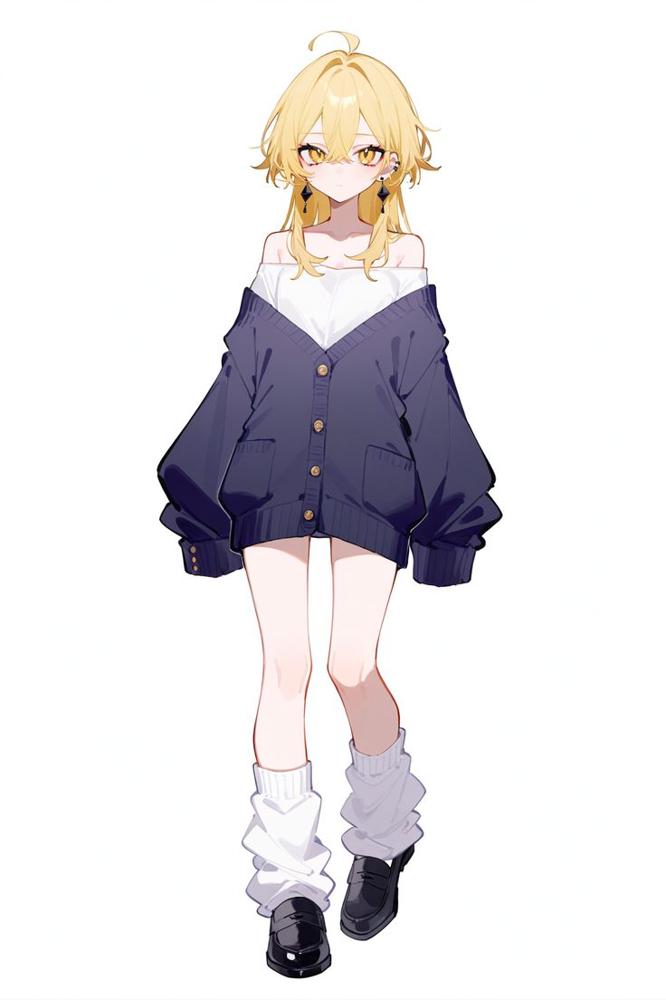

> 해당 이미지에는 한 여성 캐릭터가 그려져 있습니다. 

*   **캐릭터의 생김새**: 
    *   노란색의 짤막한 머리카락을 가지고 있습니다. 
    *   눈은 노란색이며 눈꼬리가 살짝 올라가 있습니다. 
    *   캐릭터의 표정은 다소곳한 표정입니다. 
*   **캐릭터의 의상**: 
    *   짙은 남색의 민소매 가디건을 입고 있습니다. 
    *   가디건 밑으로는 하얀색의 오프숄더가 노출되어 있습니다. 
    *   오프숄더 윪편으로는 짙은 남색의 귀고리가 양쪽에 있습니다. 
    *   바지 대신에 하얀색의 긴 부츠를 착용하고 있습니다. 
    *   신발은 검은색의 단화를 신고 있습니다. 
*   **배경**: 
    *   해당 캐릭터는 흰색의 배경에 혼자 서 있습니다. 
    *   이미지에 텍스트나 다른 오브젝트는 존재하지 않습니다.

> 해당 이미지에는 한 여성 캐릭터가 그려져 있습니다.

*   **캐릭터의 생김새**: 

    *   긴 금발의 머리카락을 가지고 있습니다. 
    *   캐릭터의 눈은 짙은 갈색입니다. 
    *   캐릭터의 피부색은 밝은 피부입니다. 
*   **캐릭터의 표정**: 

    *   손을 허벅지에 올리고 있는 캐릭터의 표정은 약간의 미소를 띤 것으로 보입니다. 
*   **캐릭터의 의상**: 

    *   붉은색의 가디건과 회색 치마를 입고 있습니다. 
    *   가디건의 앞면에는 금색 단추가 5개 있습니다. 
    *   회색 치마의 안쪽에는 하얀색의 팬티가 그려져 있습니다. 
    *   치마 아래에는 검은색의 긴 스타킹을 착용하고 있습니다. 
*   **배경**: 

    *   해당 이미지의 배경은 흰색입니다.

---

## 슬라이드 22

### 중간보스 3

#### 얇은 어린 아이 체형.

#### 가슴 작게,하얀 피부

#### 동글동글한데 눈꼬리 삐죽

#### 눈썹 얇음

#### 아가씨 같은 느낌

#### 위 레퍼런스보다 움직이기 편하게

#### 양산을 가지고 있어도 좋고

#### 숄을 무기처럼 활용해도 좋음

#### Sd 레퍼런스

#### 말광량이 같은 느낌

#### 좀 더 화내는 표정이면

#### 좋을 듯..

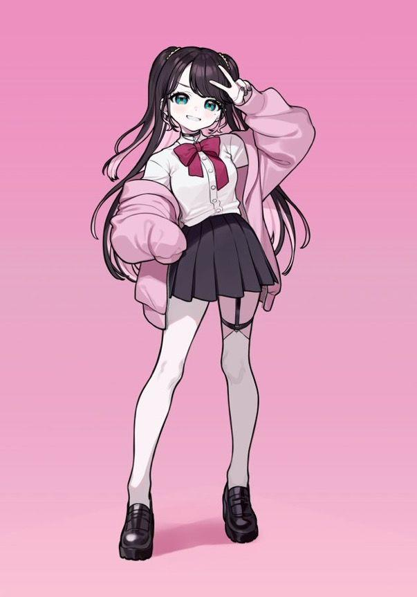

> 해당 이미지에는 애니메이션 스타일의 캐릭터 일러스트가 포함되어 있습니다.

*   **배경**: 배경은 옅은 분홍색에서 진한 분홍색으로 이어지는 그라데이션 효과를 나타내고 있습니다. 
*   **캐릭터**: 캐릭터는 검은색 긴 생머리에 앞머리가 있는 여성 캐릭터입니다. 눈은 녹색이며, 분홍색 블레이저와 흰색 셔츠, 검은색 치마, 검은색 가터벨트, 검은색 구두를 착용하고 있습니다. 또한, 흰색 셔츠에는 분홍색 넥타이를 착용하고 있습니다. 
*   **표정 및 포즈**: 캐릭터는 미소를 띤 채로 왼손을 머리카락에 올리고 있습니다. 캐릭터의 시선은 정면이며, 캐릭터의 왼쪽 다리는 살짝 뒤로 물러나 있는 자세로 그려져 있습니다. 캐릭터의 왼쪽 팔꿈치는 구부려져 있고, 오른손은 허리춤에 위치하고 있습니다. 
*   **그 외**: 이미지에는 텍스트나 UI 요소, 아이콘 등은 포함되어 있지 않습니다.

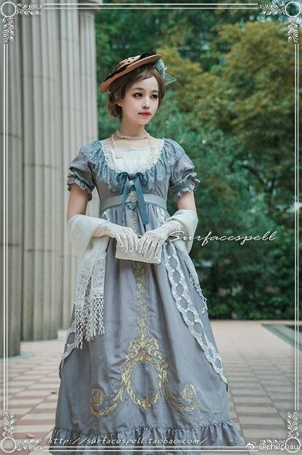

> 이 자료는 게임 기획 문서의 일부로 보이는 이미지입니다. 이미지 중앙에는 여성 캐릭터가 등장합니다. 여성은 고전적인 유럽의 상류사회 여성을 연상케 하는 옷차림을 하고 있습니다. 여성의 옷은 연회복처럼 보입니다. 옷의 색은 연한 회색이며, 옷에 금색 자수가 놓여 있습니다. 옷의 윗부분은 하얀색 레이스로 장식되어 있고, 리본이 묶여 있습니다. 여성은 긴 장갑을 착용하고 하얀 클러치를 들고 있습니다. 머리는 짧은 단발이며, 모자를 쓰고 있습니다. 

이미지 오른쪽에는 하얀색 바탕이 있고, 왼쪽에는 기둥이 보입니다. 기둥 뒤로는 나무가 우거져 있습니다. 

이미지에는 테두리가 있습니다. 테두리 안쪽에는 가는 흰색 선이 있고 바깥쪽에는 화려한 무늬가 있습니다. 이미지 하단에는 URL이 있고, 우측 하단에는 "@cnzkau"이라는 문구가 있습니다. 이미지 중앙에는 "surface spell"이라는 문구가 있습니다.

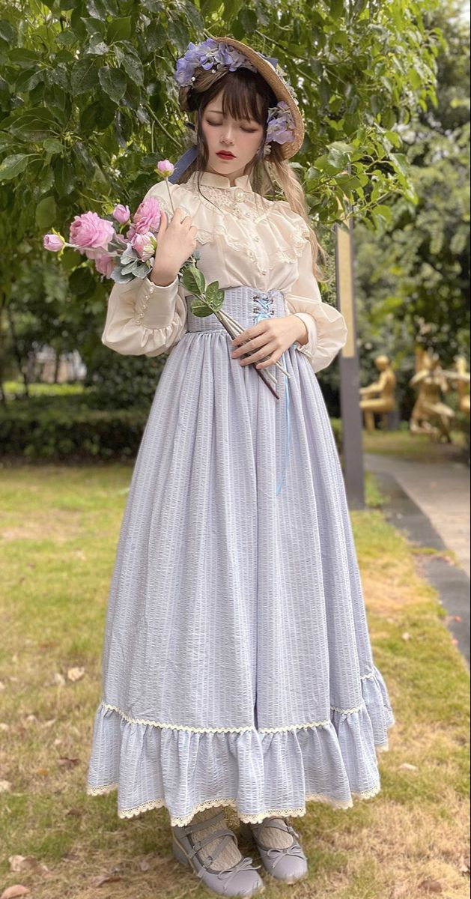

> 이미지는 여성 캐릭터의 모습입니다. 여성은 잔디가 깔린 공원이나 정원에 서 있습니다. 여성의 키는 160센티미터 정도로 보입니다.

여성은 리본이 묶인 회색 단화를 신었습니다. 여성의 옷차림은 19세기 후반의 여성의 전형적인 모습을 보여 주고 있습니다. 여성은 베이지색 블라우스에 프릴이 달린 긴 소매를 입었습니다. 블라우스 위에는 묶인 허리 부분이 노출되어 있으며, 허리 아랫부분에는 회색 치마를 입었습니다. 회색 치마에는 노란색 띠가 둘려져 있고, 치마의 아래쪽에는 노란색 레이스가 달려 있습니다. 여성의 머리는 긴 편이며, 이마에는 뱅이 있습니다. 여성은 밀짚으로 만든 모자를 머리에 썼으며, 모자에는 보라색 꽃이 여러 개 꽂혀 있습니다. 여성은 왼손에 보라색과 분홍색 꽃을 들고 있습니다. 

사진 오른쪽으로는 분홍색과 보라색 꽃이 핀 나무가 보입니다. 나무 뒤로는 황금색 동상이 멀리서 보입니다.

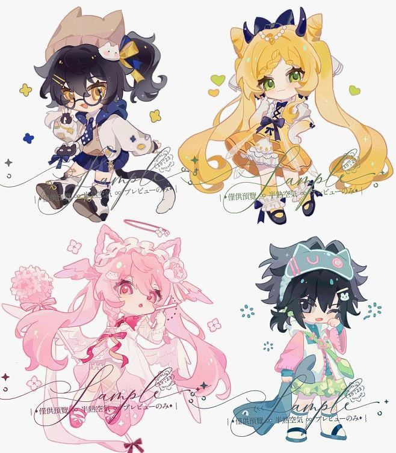

> 해당 이미지에는 4개의 일러스트가 포함되어 있습니다. 

각각의 일러스트는 귀여운 외형을 가진 4명의 캐릭터를 묘사하고 있습니다. 

**왼쪽 상단**

* 검은색과 하얀색의 줄무늬 꼬리, 검은색 귀가 달린 베이지색의 모자를 쓰고 있습니다. 
* 검은 머리카락과 노란색 눈을 가지고 있습니다. 
* 흰색과 하늘색이 섞인 옷과 짧은 치마를 입고 있습니다. 
* 무릎까지 오는 하얀색 양말과, 검은색과 하얀색이 섞인 운동화를 착용하고 있습니다. 
* 손에는 하얀색과 노란색이 섞인 봉제 인형을 들고 있습니다. 
* 일러스트의 오른쪽 하단에는 'Sample'이라는 문구와 함께, 일본어로 추정되는 문구가 포함된 워터마크가 새겨져 있습니다.

**오른쪽 상단**

* 노란색 머리카락과 녹색 눈을 가지고 있습니다. 
* 노란색과 하얀색이 섞인 옷과 긴 치마를 입고 있습니다. 
* 검은색과 노란색 리본이 달린 모자를 쓰고 있습니다. 
* 파란색과 노란색이 섞인 신발을 착용하고 있습니다. 
* 일러스트의 중앙 하단에는 'Sample'이라는 문구와 함께, 일본어로 추정되는 문구가 포함된 워터마크가 새겨져 있습니다.

**왼쪽 하단**

* 핑크색 머리카락과 핑크색 눈을 가지고 있습니다. 
* 핑크색과 하얀색이 섞인 옷과 긴 치마를 입고 있습니다. 
* 머리카락을 묶은 리본과 동일한 색상의 리본이 달린 신발을 착용하고 있습니다. 
* 일러스트의 하단에는 'Sample'이라는 문구와 함께, 일본어로 추정되는 문구가 포함된 워터마크가 새겨져 있습니다.

**오른쪽 하단**

* 검은색 머리카락과 보라색 눈을 가지고 있습니다. 
* 핑크색과 하늘색이 섞인 옷과 짧은 치마를 입고 있습니다. 
* 회색 고양이 모양의 모자를 쓰고 있습니다. 
* 회색과 하늘색이 섞인 슬리퍼를 착용하고 있습니다. 
* 일러스트의 하단에는 'Sample'이라는 문구와 함께, 일본어로 추정되는 문구가 포함된 워터마크가 새겨져 있습니다.

모든 일러스트의 배경은 하얀색입니다.

---

## 슬라이드 23

### 최종보스 1페이즈(튜토리얼에서도 등장)

| 항목 | 내용 |
| --- | --- |
| 이름 | 엠페러 |
| 성별 | 남성 |
| 키/나이 | 210cm / 23세 |
| 체형 | 망토, 두터운 옷으로 가려져 있음  내부는 거의 해골 |
| 성격 | 꼭두각시, 껍데기만 남음, 피폐하고 음침하고 어두움 |
| 말투 |  |
| 역할 | 진정한 최종 보스가 조종하는 꼭두각시, 얘도 이렇게 강한데 얠 조종하는 최종 보스는 얼마나 강한거야? 같은 느낌 |

#### 얼굴이 나올까? 싶지만..

#### 광대뼈 강조 피폐 남캐

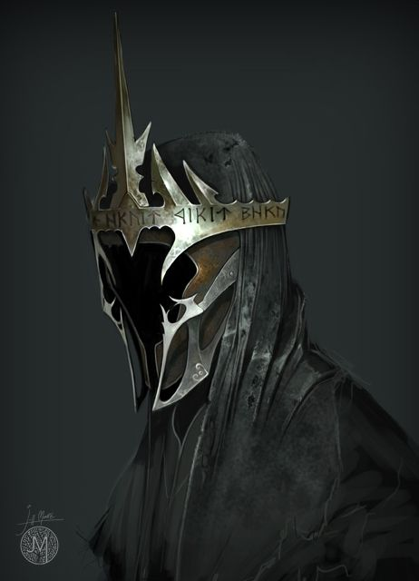

> 이미지는 어둡고 짙은 회색 배경에 금속 갑옷을 입고 왕관을 쓴 캐릭터의 모습입니다.

*   캐릭터의 머리는 왕관에 의해 가려져 있어 보이지 않습니다. 왕관은 날카로운 금속 조각이 여러 개 솟아 있고, 가운데가 뚫려 있는 금속 왕관입니다. 왕관의 정면에는 문자가 새겨져 있습니다. 왕관의 표면은 금색이며, 여러 개의 날카로운 금속 조각이 왕관을 장식하고 있습니다. 
*   캐릭터의 가면은 왕관과 연결되어 있으며, 가면의 정면은 비어있어 눈, 코, 입이 보입니다. 가면의 옆면과 뒷면은 천으로 가려져 있습니다. 
*   캐릭터의 몸은 짙은 회색의 천으로 된 옷을 입고 있습니다. 옷은 주름이 지고, 묵직한 느낌을 줍니다. 
*   이미지의 왼쪽 하단에는 화이트 컬러의 로고가 있습니다. 로고는 원 모양이며, 원 내부에는 'JM'이라는 이니셜이 있습니다. 로고의 왼쪽 상단에는 서명도 함께 적혀 있습니다. 
*   캐릭터의 분위기는 어둡고, 위협적이며, 신비로움을 줍니다.

> 이미지는 한 남성의 모습을 묘사하고 있습니다. 

*   남성의 모습

    *   남성의 머리는 짧은 회색 머리입니다.
    *   남성의 눈은 녹색입니다.
    *   남성은 검은색 재킷을 입고 있습니다. 재킷의 왼쪽 팔에는 주황색 띠가 있고, 재킷 안쪽의 오른쪽에는 흰색 띠가 있습니다.
    *   남성의 바지는 검은색입니다.
    *   남성의 신발은 검은색이며, 발등 부분이 살짝 노출되어 있습니다.
    *   남성의 왼쪽 허리에는 검은색 벨트를 착용하고 있습니다. 
    *   남성의 왼쪽 다리는 구부리고, 오른손은 남성의 왼쪽 무릎 위에 올려져 있습니다.

*   배경

    *   배경은 붉은색 벽을 기반으로 한 금속 구조물입니다. 
    *   금속 구조물은 사선으로 배치되어 있습니다. 
    *   금속 구조물에는 여러 개의 볼트가 존재합니다. 
    *   벽면의 윗부분에는 검은 구름이 존재합니다.

---

## 슬라이드 24

### 최종보스 1페이즈

#### 망토, 갑주 섞인거

#### Or

#### 과하고 두터운 복식

#### 어느 쪽이든 낡고 부식

#### 배경에 이런 초상화 걸려도

#### 좋을 듯

#### Sd 레퍼런스

#### 왕좌에 앉아있다가

#### 일어나서

#### 축 늘어진 채로

#### 검 휘두르기

#### 여왕의 왕관을

#### 들고 있음

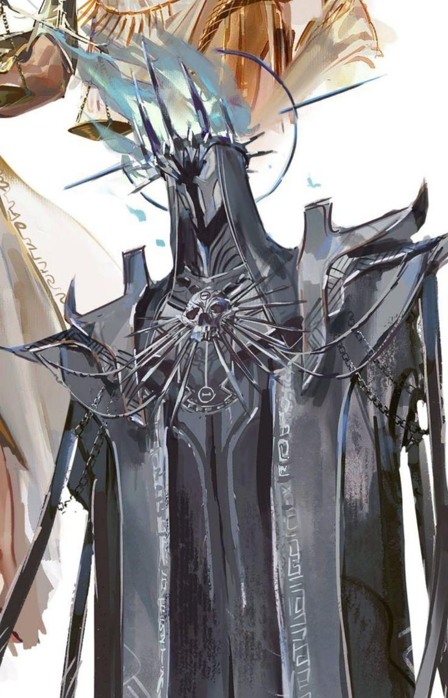

> 이미지는 검은 갑옷을 입은 캐릭터의 상반신을 묘사하고 있습니다. 

*   **캐릭터의 갑옷과 복장**: 캐릭터는 어두운 색상의 갑옷을 입고 있습니다. 갑옷은 여러 조각으로 구성되어 있으며, 가슴 부분에는 복잡한 디자인의 장식이 있습니다. 장식 중앙에는 동그라미 안에 선이 하나 있는 문양이 있고 그 주변으로 뾰족한 금속 조각들이 방사형으로 뻗어 있습니다. 갑옷의 오른쪽에는 글자가 새겨져 있지만, 명확히 알아볼 수는 없습니다. 
*   **캐릭터의 머리**: 캐릭터의 머리는 뾰족한 모양으로, 머리 뒤쪽으로 푸른색의 긴 머리카락이 뻗어 있습니다. 
*   **배경**: 배경은 흰색이며, 이미지의 왼쪽 상단에는 다른 캐릭터의 손과 옷자락이 일부 보입니다. 

이미지 속 캐릭터의 전체적인 분위기는 어둡고 강인해 보입니다.

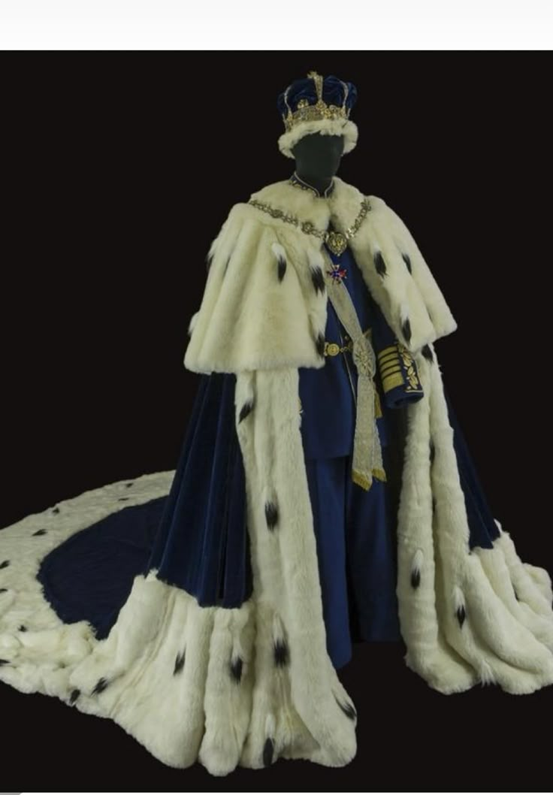

> 해당 이미지에는 왕과 같은 복장을 한 사람의 모습이 담겨 있습니다. 

이미지 중앙에 있는 사람의 얼굴은 보이지 않으며, 왕관을 쓰고 있는 것으로 보아 왕을 상징하는 캐릭터로 추정됩니다. 

왕의 머리에는 짙은 남색과 금색으로 장식된 왕관이 씌어져 있습니다. 왕관 위에는 하얀 털이 솟아나와 있습니다.

왕의 몸에는 남색의 긴 옷이 입혀져 있습니다. 옷의 앞면에는 금색 허리띠가 묶여져 있고, 왼쪽에는 꽃 모양의 장식품이 부착되어 있습니다. 

또한 왕의 어깨에는 짙은 남색과 하얀색의 털이 혼합된 듯한 겉옷이 어깨에 걸쳐져 있습니다. 이 겉옷에는 짙은 남색의 털이 뭉쳐진듯한 무늬가 곳곳에 새겨져 있습니다. 이 옷의 길이는 상당히 길어, 왕의 뒤에 길게 트레일되며, 바닥에 가까울수록 더욱 화려한 무늬가 새겨져 있습니다.

옷의 왼쪽에는 꽃 모양의 장식품이 부착되어 있습니다. 왕의 목에는 금색 목걸이를 착용하고 있습니다.

전체적으로 왕의 모습은 화려하고 고급스러운 느낌을 주고 있습니다.

> 이미지는 흰색 벽과 기둥이 있는 방 안에서 제복을 입은 한 남성의 모습을 담고 있습니다. 그는 흰색과 검은색 옷을 입고 있으며, 왼손에 흰색 지팡이를 쥐고 있습니다. 방 바닥은 검은색과 흰색 타일로 되어 있습니다. 방 왼쪽에는 벽에 문이 있고, 그 옆에 기둥이 있습니다. 기둥 위에는 조각된 디자인이 있습니다. 방의 벽은 회백색이며, 바닥은 검은색과 흰색 타일로 되어 있습니다. 방의 왼쪽에는 흰색 옷이 접혀져 있습니다. 남성의 옷은 검은색과 흰색이며, 금색 장식이 있습니다. 남성의 머리는 짧고, 그는 중립적인 표정을 하고 있습니다.

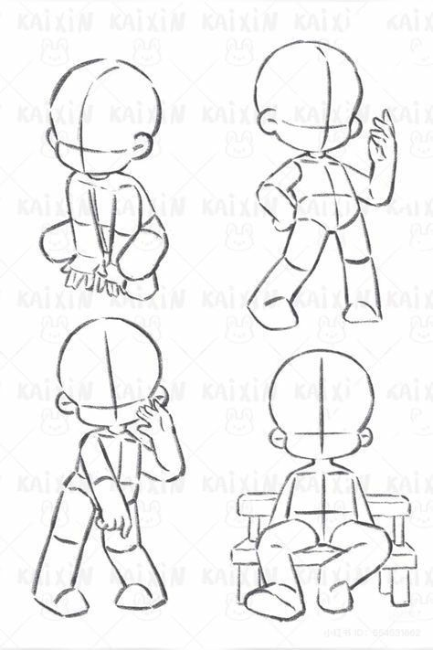

> 이 그림은 게임 캐릭터의 컨셉 아트 또는 캐릭터 디자인에 사용되는 참조 이미지로 보입니다. 이미지에는 네 가지 다른 자세로 그려진 캐릭터가 있습니다. 

*   **왼쪽 상단** : 이 캐릭터는 뒤로 돌아앉은 자세로 손을 무릎 위에 올리고 있습니다. 
*   **오른쪽 상단** : 이 캐릭터는 왼쪽 손을 들어 올리고, 오른쪽 손을 내린 채로 서 있는 자세입니다. 
*   **왼쪽 하단** : 이 캐릭터는 왼쪽 손으로 얼굴을 가리고, 오른쪽 손을 내린 채로 서 있는 자세입니다. 
*   **오른쪽 하단** : 이 캐릭터는 의자에 앉아 있는 자세입니다. 

모든 캐릭터는 머리가 크고 몸이 작게 그려져 있습니다. 각 캐릭터의 몸에는 선이 그어져 있어 비율을 가늠할 수 있게 표현되어 있습니다. 배경에는 "KAIxIN"이라는 워터마크가 반복적으로 표시되어 있습니다.

> 이미지는 게임 캐릭터의 자세를 표현한 스케치입니다. 

## 이미지 레이아웃 및 구조

이미지는 흰색 배경에 빨간색 선으로 그려진 캐릭터의 스케치로 구성되어 있습니다. 

### 캐릭터 자세
- 캐릭터는 왼쪽을 향해 서 있습니다.
- 왼팔을 뻗어 벽이나 기둥에 왼손의 검지 손가락을 대고 있습니다.
- 오른팔은 구부린 채 뒤로 뺀 상태입니다.
- 캐릭터의 상반신과 하반신이 연결된 형태입니다.

### 추가 요소
- 이미지 왼쪽에 빨간색 수직선이 그려져 있습니다. 
- 캐릭터의 머리 부분에 화살표가 그려져 있습니다. 화살표는 위쪽을 가리킵니다.

## 요약
이 스케치는 게임 캐릭터의 특정 동작이나 포즈를 표현하기 위한 초기 구상 단계로 보입니다.

---

## 슬라이드 25

### 최종보스 (튜토리얼에서 등장 안함)

| 항목 | 내용 |
| --- | --- |
| 이름 | 더 월드 |
| 성별 | 여성 |
| 키/나이 | 300cm/23세 |
| 체형 | 가슴이 큼, 거대 여성, 손가락이 길고 얇고 뾰족 |
| 성격 | 자비로움, 자애로움. 모두의 행복을 위해 오류인 주인공을 제거하려 함 |
| 말투 |  |
| 역할 | 세계를 지휘하는 지휘자. 인외 마망 |

#### 이런 손 >

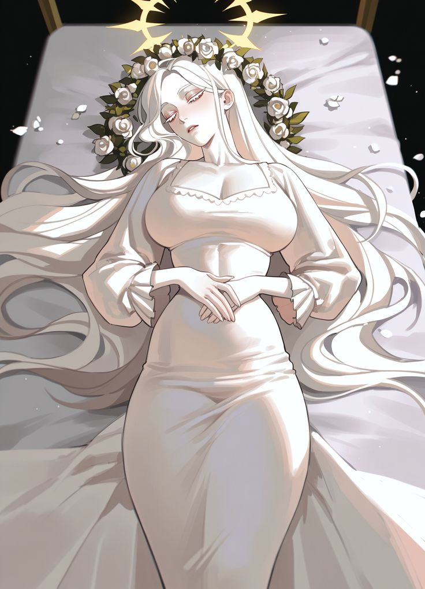

> 해당 이미지에는 한 여성 캐릭터가 등장합니다. 여성은 긴 하얀 머리카락을 가지고 있으며, 흰색 꽃으로 만든 화관을 머리에 쓰고 있습니다. 여성은 흰색 웨딩드레스를 입고 있으며, 눈은 감긴 상태입니다. 

여성의 눈썹은 옅은 갈색빛을 띠고 있으며, 속눈썹이 짙게 그려져 있습니다. 입꼬리가 살짝 올라가 있는 것으로 보아 웃는 표정으로 묘사된 것을 알 수 있습니다.

여성의 옆에는 하얀 꽃잎들이 흩어져 있습니다. 배경에는 노란 별 모양의 빛이 있습니다.

전체적으로 고요하고 평화로운 분위기를 연출하고 있습니다. 침대 시트와 이불은 흰색이며, 침대 헤드는 금색입니다.

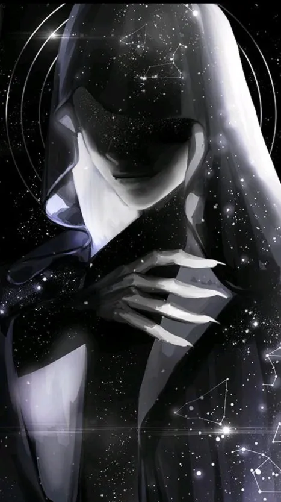

> 이미지는 흑백 일러스트로, 게임 기획 문서에 포함된 이미지입니다. 이미지 중앙에는 한 인물이 어두운 배경에 하얀 별들이 흩어져 있는 우주를 배경으로 그려져 있습니다. 

인물은 여성으로 추정되며, 긴 머리를 가지고 있고, 얼굴은 정면이 아닌 약간 아래를 향하고 있습니다. 눈은 감긴 상태이며, 이마에는 별들이 그려져 있습니다. 왼쪽 손은 가슴 부위에 위치하고 있습니다. 

배경에는 별들이 흩어져 있고, 인물 뒤에는 원 모양의 무늬가 있습니다. 원의 안쪽과 바깥쪽에는 작은 별들이 그려져 있습니다. 

이미지 상단에는 텍스트나 UI 요소는 보이지 않으며, 오직 일러스트 이미지로 구성되어 있습니다.

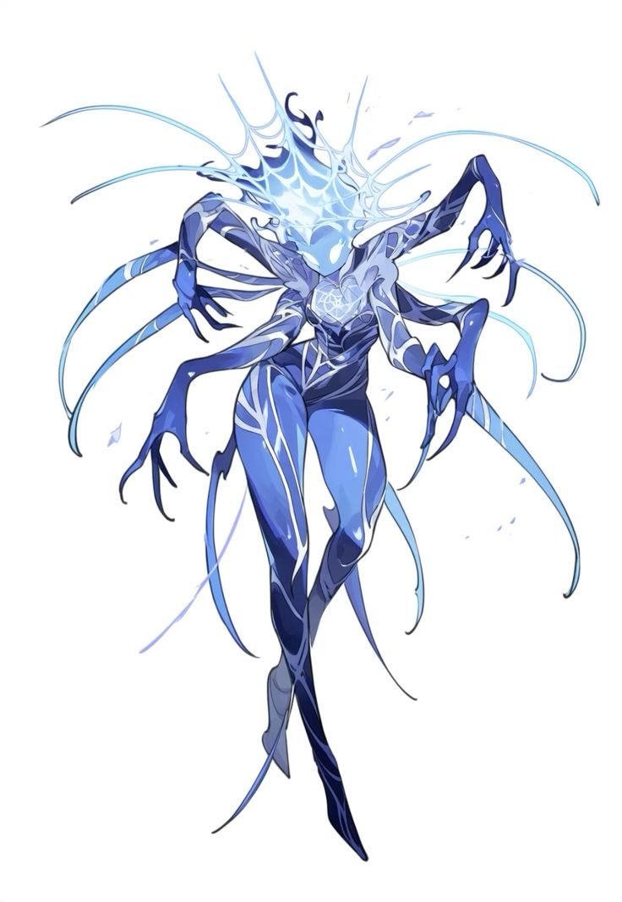

> 해당 이미지에는 게임 캐릭터 일러스트가 포함되어 있습니다.

이미지 중앙에는 여성형 캐릭터가 그려져 있습니다. 캐릭터의 신체는 푸른색이며, 머리 부분은 여러 갈래로 갈라진 듯한 모습을 하고 있습니다. 캐릭터의 상의는 노출이 심한 편이며, 하의는 길고 날렵한 형태의 바지 또는 스커트처럼 보입니다. 캐릭터의 몸 곳곳에는 푸른색과 하얀색 선이 교차하는 복잡한 패턴이 그려져 있습니다.

캐릭터의 머리 위로는 여러 줄기의 빛나는 푸른색 선이 뻗어 나와 있습니다. 이 선들은 마치 신경 세포나 전기 신호를 연상케 하며, 캐릭터의 정수리에서부터 사방으로 뻗어 나와 있습니다. 캐릭터의 양손은 길고 날카로운 손톱을 가지고 있으며, 각 손가락은 날렵하게 디자인되어 있습니다.

캐릭터의 전체적인 디자인은 미래적이면서도 판타지적인 느낌을 주고 있으며, 사이파이 또는 판타지 세계관의 캐릭터로 보입니다. 캐릭터의 의상은 매우 독특하고 화려하며, 빛나는 효과와 선명한 색상이 인상적입니다.

---

## 슬라이드 26

### 최종보스 (튜토리얼에서 등장 안함)

#### 가슴 큰 길고 얇은 체형

#### (도자기 같은..)

#### 인간 피부 아니여도 됨

#### 팔 다리 늘려도 됨

#### 하늘 그 자체,..

#### 세계 그 자체 같은 복장

#### 마녀 같은 느낌

#### 하늘하늘하고

#### 옷이라는 느낌보단

#### 천을 두른 느낌

#### Sd 레퍼런스

#### 마에스트로 자세나

#### 누워서 떠다니는 자세

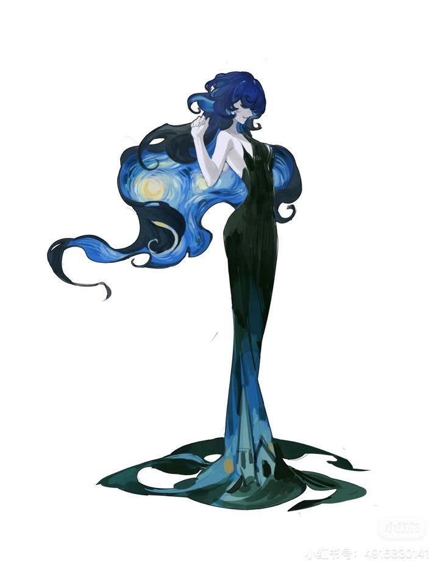

> 해당 이미지에는 한 여성 캐릭터가 그려져 있습니다. 

*   **배경**: 캐릭터가 그려진 배경은 흰색입니다.

*   **캐릭터**: 여성 캐릭터는 긴 생머리이며, 파란색과 검은색이 혼합된 머리카락을 가지고 있습니다. 캐릭터의 머리는 정면을 향해 있고, 몸은 왼쪽을 향하고 있습니다. 캐릭터의 상의는 노출이 심한 상의이며, 하의는 길고 검은 드레스입니다. 드레스의 색은 위에서 아래로 갈수록 진한 녹색과 파란색으로 그라데이션이 적용되어 있습니다. 캐릭터의 왼쪽 팔꿈치는 굽혀진 상태이며, 왼손은 입 근처에 위치해 있습니다. 

*   **아이콘 및 텍스트**: 이미지 하단 중앙에는 작은 글씨로 중국어 텍스트가 포함되어 있습니다. 텍스트의 내용은 이미지의 출처를 나타내는 것으로 추정됩니다. 

*   **레이아웃**: 이미지는 캐릭터가 중앙에 위치하도록 배치되어 있습니다. 캐릭터의 드레스 아래에는 옷의 일부가 마치 물에 젖은 듯한 표현이 추가되어 있습니다.

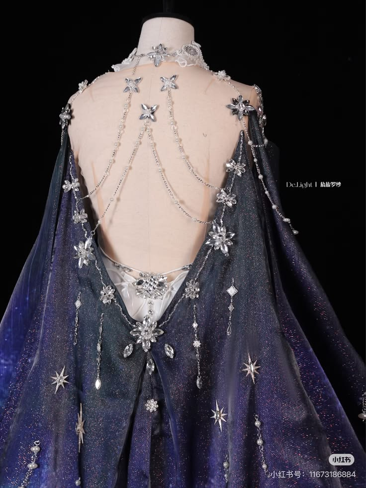

> 이미지는 게임 기획 문서의 일부로 추정되는 이미지입니다. 이미지에는 하얀 마네킹의 뒷면이 보입니다. 마네킹은 어깨와 뒷면이 노출된 채로, 짙은 보라색의 망토를 입고 있습니다. 망토는 어깨 부분이 뾰족하게 솟아올라와 있고, 등 부분에는 심플한 디자인으로 V자가 패어 있습니다. 망토에는 여러 개의 은색 체인, 보석, 꽃 모양의 액세서리 등이 달려 있습니다. 

이미지의 오른쪽 하단에는 중국어로 추정되는 문구와 함께 아이디로 추정되는 숫자가 있습니다. 아이디는 11673186884로 추정됩니다. 아이디의 왼쪽에는 동그라미 안에 중국어가 적혀 있습니다. 

이미지 중앙의 오른쪽에는 'DeLight'이라는 문구와 함께 중국어로 추정되는 문구가 있습니다.

이미지의 배경은 검은색입니다.

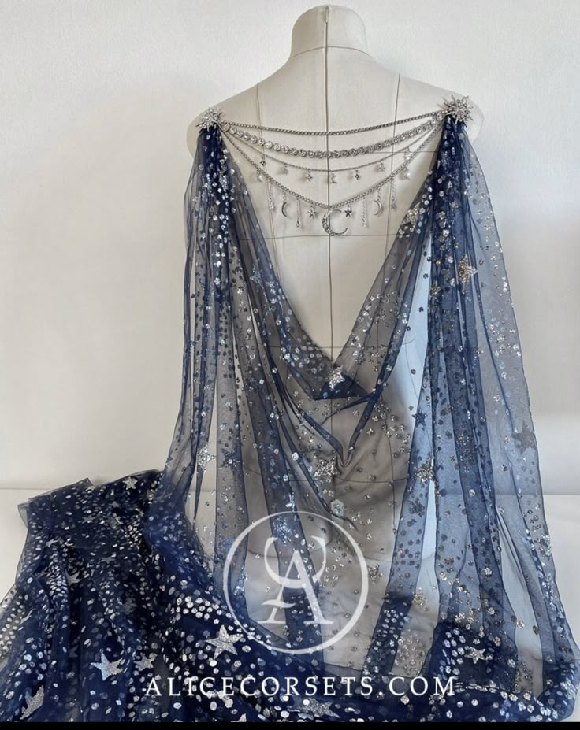

> 이미지는 게임 기획 문서의 일부가 아닌, 제품 홍보를 위한 이미지로 보입니다. 이 제품은 스타일이 돋보이는 고급스러운 디자인으로, 의상과 액세서리로 구성되어 있습니다.

### 이미지 상세 설명

#### 의상:
- **색상**: 짙은 남색에서 옅은 하늘색으로 그라데이션이 적용된 쉬어 패브릭으로 만들어졌습니다.
- **디자인**: 
  - 등 뒤가 깊게 파인 V자형 디자인입니다.
  - 어깨 부분이 고정된 스트랩이 없이 자유롭게 흘러내리는 스타일입니다.
  - 의상의 앞부분은 허벅지 위까지 내려오는 길이로, 여러 겹의 쉬어 패브릭이 레이어링되어 있습니다.
  - 패브릭 전체에 은색 반짝임과 별, 달 모양의 디테일이 있습니다.

#### 액세서리:
- **목걸이**: 
  - 여러 겹의 체인으로 구성되어 있으며, 각 체인에는 작은 달, 별, 십자가 등의 펜던트가 달려 있습니다.
  - 목걸이는 등 뒤에서 어깨로 걸쳐져 있습니다.

#### 마네킹:
- 의상은 하얀 마네킹에 착용되어 있습니다.
- 마네킹은 머리 부분이 없이 목 부분에서 절단된 형태입니다.

#### 배경:
- 배경은 밝은 회색 벽으로, 제품의 디테일을 강조할 수 있도록 심플하게 구성되어 있습니다.

#### 워터마크:
- 이미지 중앙 하단에 흰색 워터마크가 있습니다.
  - 워터마크에는 원형 로고 안에 "A"와 유사한 문자가 있고, 그 아래에 "ALTCECORSETS.COM"이라는 웹사이트 주소가 있습니다.

이 이미지는 고급스러운 패션 제품, 특히 코스튬이나 특별한 이벤트를 위한 의상을 홍보하기 위한 것으로 보입니다.

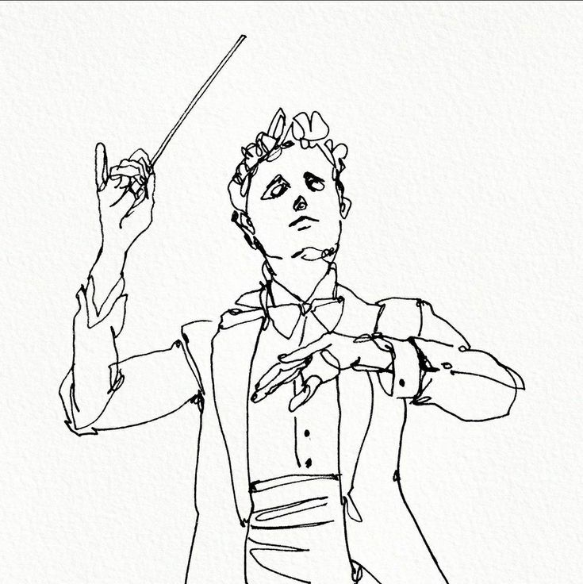

> 이 그림은 한 남자가 지휘봉을 들고 있는 모습을 묘사하고 있습니다. 

*   남자는 화려한 패턴의 왕관을 쓰고 있으며, 정장 차림입니다. 
*   그는 왼손에 지휘봉을 들고 있고, 오른손은 가슴 앞에 위치해 있습니다. 
*   남자의 시선은 오른쪽 위를 향하고 있습니다. 
*   그림은 선만으로 그려져 있으며, 채색되어 있지 않습니다. 
*   배경은 흰색입니다. 

전체적으로 이 그림은 클래식 음악 공연, 아마도 오케스트라 지휘자를 나타내는 듯합니다.

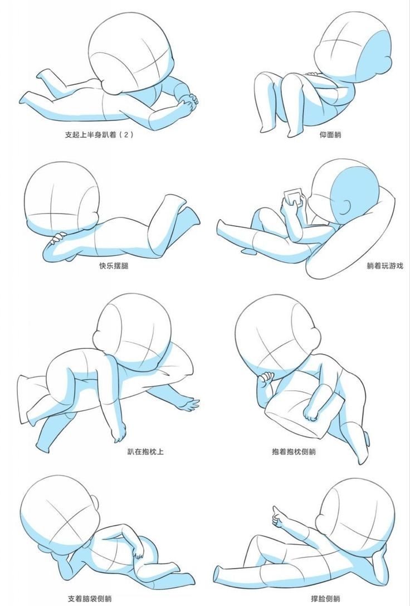

> 이 자료는 게임 캐릭터의 컨셉 아트 또는 캐릭터 디자인에 사용되는 참조 이미지로 보입니다. 이미지에는 다양한 자세로 누워 있는 아기 캐릭터의 스케치가 포함되어 있습니다.

*   **이미지 레이아웃:** 이미지는 3행 2열의 격자 레이아웃으로 구성되어 있으며, 각 셀에 아기 캐릭터의 다른 자세가 포함되어 있습니다. 
*   **캐릭터 디자인:** 아기 캐릭터는 머리가 크고 몸이 작으며, 팔다리가 짧은 비율로 묘사되어 있습니다. 
*   **자세:** 각 셀에는 아기 캐릭터가 다양한 자세로 누워 있는 모습이 그려져 있습니다. 자세는 다음과 같습니다. 

    *   첫 번째 행: 엎드려 있음,仰面翘(등을 대고 누움)
    *   두 번째 행:快乐蹬腿(즐거운 다리뻗기), 睡着玩游戏(자면서 게임하기)
    *   세 번째 행: 趴在抱枕上(베개에 엎드려 있음), 抱着抱枕侧躺(베개를 안고 옆으로 누움)
    *   네 번째 행: 支着腮帮侧躺(턱을 괴고 옆으로 누움), 撅脸侧躺(입을 삐죽이고 옆으로 누움)

*   **텍스트:** 각 셀 아래에는 중국어로 된 설명이 포함되어 있습니다. 설명은 각각의 자세를 설명하는 것으로 보입니다.

*   **색상:** 이미지는 흑백과 옅은 파란색으로 구성되어 있습니다. 

    *   검은 선으로 캐릭터의 형태를 나타내고, 옅은 파란색은 캐릭터의 형태를 나타내는 음영 또는 밑칠로 사용됩니다.

*   **UI 요소:** 이미지에는 별도의 UI 요소는 포함되어 있지 않습니다. 

    *   이미지는 게임 캐릭터의 컨셉 아트 또는 캐릭터 디자인에 사용되는 참조 이미지로 보입니다.

---
