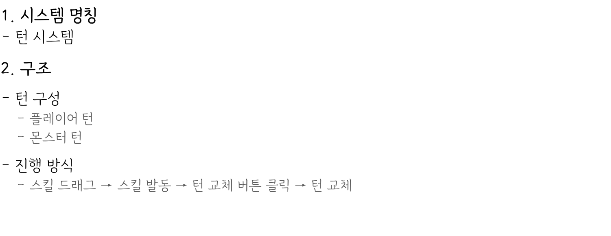
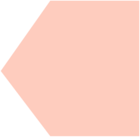

# 턴시스템_V3_김주연

## 슬라이드 1

---

## 슬라이드 2

> 해당 이미지는 게임 기획 문서의 일부로, 게임의 핵심 시스템 중 하나인 '턴 시스템'에 대한 설명을 담고 있습니다. 

이미지에는 다음과 같은 내용이 포함되어 있습니다.

*   **1. 시스템 명칭**
    *   - 턴 시스템
*   **2. 구조**
    *   - 턴 구성
        *   - 플레이어 턴
        *   - 몬스터 턴
    *   - 진행 방식
        *   - 스킬 드래그 → 스킬 발동 → 턴 교체 버튼 클릭 → 턴 교체

이미지의 레이아웃과 구조는 간단명료하며, 게임의 턴 시스템을 이해하는 데 필요한 핵심 정보를 제공하고 있습니다.

---

## 슬라이드 3

> 해당 이미지는 게임 기획 문서의 일부로, 게임의 기본 구조와 규칙에 관한 목차를 보여 주고 있습니다. 

## 레이아웃 및 구조

*   **배경**: 이미지는 흰색 배경을 가지고 있습니다.
*   **텍스트**: 검은색 텍스트가 사용되었습니다.

## 목차

1.  **기본 구조**
    *   1.1 전투 턴의 기본 구조
    *   1.2 플레이어 턴의 기본 구조
        *   1.2.1 행동 단계
        *   1.2.2 턴 종료
    *   1.4 몬스터 턴의 기본 구조
        *   1.4.1 행동 단계
2.  **턴 전환 규칙**
3.  **HP 처리 규칙**
4.  **특수 카드**
5.  **전투 흐름 정리**

## 설명

*   이 목차는 게임의 기본적인 구조와 규칙을 설명하기 위한 것으로, 게임의 전투 시스템, 플레이어와 몬스터의 턴 구조, HP 관리, 특수 카드 사용, 그리고 전투의 흐름 등을 포함하고 있습니다.

---

## 슬라이드 4

> 이 문서는 게임 기획 문서의 일부로, 게임의 전투 시스템에 대한 설명을 담고 있습니다. 문서의 내용은 다음과 같습니다.

* 전투는 플레이어 턴과 몬스터 턴이 교차로 진행됩니다.
  * 1. 플레이어 턴
  * 2. 몬스터 턴

각 캐릭터(캐릭터)는 개별 HP를 가지고 있습니다.

문서는 텍스트로 구성되어 있으며, 시각적 레이아웃과 구조는 간단한 목록 형식입니다. 배경은 흰색이며, 검은색 텍스트가 왼쪽 정렬되어 있습니다. 문서에는 다이어그램, UI 요소, 캐릭터, 아이콘 등은 포함되어 있지 않습니다.

---

## 슬라이드 5

> 해당 이미지는 게임 기획 문서의 일부로, 다음과 같은 내용을 포함하고 있습니다.

* 제목: 턴 시작 시 카드 드로우
* 내용:
  * 드로우는 턴 시작 직후 자동으로 진행된다.
  * 드로우는 행동 단계 이전에 완료되어야 한다.

이미지에는 텍스트 외에 다른 시각적 요소가 포함되어 있지 않습니다. 레이아웃은 왼쪽 정렬이며, 제목과 내용이 순서대로 나열되어 있습니다. 배경색은 흰색입니다.

> 이미지는 게임 기획 문서의 일부로, 캐릭터별 HP 보유에 대한 설명입니다.

*   **제목:** 검은 사각형 아이콘과 함께 "캐릭터별 HP 보유"라는 제목이 있습니다.
*   **내용:**
    *   HP는 캐릭터 단위로 관리된다.
    *   피해 및 회복은 해당 캐릭터에게만 적용된다.

텍스트는 왼쪽 정렬로 작성되어 있으며, 제목과 내용이 순서대로 나열되어 있습니다. 배경은 흰색이며, 텍스트는 검은색입니다.

> 이미지는 게임 기획 문서의 일부로, 전투 불능 상태에 대한 설명입니다.

*   **전투 불능 상태**
    *   캐릭터의 HP가 0이 되면 해당 캐릭터는 전투 불능 상태에 진입한다.
    *   해당 캐릭터는 더 이상 행동할 수 없다.

이 텍스트는 게임에서 캐릭터가 HP가 0이 되었을 때의 상태를 설명하고 있습니다. 

*   **구조**: 
    *   제목: "전투 불능 상태" 
    *   내용이 두 줄로 나뉘어져 있음 
    *   내용은 글머리 기호(*)로 표시됨 
    *   배경은 흰색이고, 검은색 폰트의 텍스트로 구성되어 있음

> 해당 이미지에는 게임 기획 문서의 일부로 보이는 텍스트 블록이 포함되어 있습니다.

*   검은색 네모 형태의 글머리 기호가 포함된 문단이 있습니다. 
*   왼쪽에 검은색 사각형이 있고, 그 옆에 **전투 불능 시 덱 처리**라는 문장이 있습니다.
*   **전투 불능 시 덱 처리** 다음에 2개의 글머리 기호가 있습니다.
    *   첫 번째 글머리 기호: 캐릭터의 HP가 0이 되어 전투 불능이 된 캐릭터의 스킬 카드는 스킬 덱 구성에서 즉시 제외된다.
    *   두 번째 글머리 기호: 다음 플레이어의 턴에서 드로우 시 해당 캐릭터의 카드는 등장하지 않는다.

텍스트 이외에 다른 시각적 요소나 레이아웃, 구조는 보이지 않습니다.

---

## 슬라이드 6

> 해당 이미지는 게임 기획 문서의 일부로, 플레이어 턴에 가능한 행동과 카드 사용 시 적용되는 규칙에 대해 설명하고 있습니다.

### **1. 텍스트 내용**

- **1.2.1 행동 단계**
  - 플레이어 턴에서는 다음 행동이 가능합니다.
    - 스킬 카드 선택
    - 특수 카드 선택

  - 카드를 사용하였을 때,
    - 스킬의 연출 및 데미지를 즉시 적용한다.

### **2. 시각적 레이아웃 및 구조**
- **제목: "1.2.1 행동 단계"**
  - 가장 상단에 위치하며, 굵은 글씨로 표시되어 있습니다.

- **플레이어 턴 행동 설명**
  - 플레이어 턴에서 가능한 두 가지 행동이 글머리 기호(•)로 나열되어 있습니다.
    - 첫 번째 항목: "스킬 카드 선택"
    - 두 번째 항목: "특수 카드 선택"

- **카드 사용 시 효과 설명**
  - 카드를 사용했을 때의 효과도 글머리 기호로 제공됩니다.
    - "스킬의 연출 및 데미지를 즉시 적용한다."

- **구조**
  - 내용은 왼쪽 정렬되어 있으며, 각 항목은 글머리 기호로 구분되어 가독성을 높였습니다.
  - 배경은 흰색이며, 검은색 텍스트가 사용되어 명확한 가독성을 제공합니다.

### **3. UI 요소 및 아이콘**
- 이미지에는 별도의 UI 요소나 아이콘은 포함되어 있지 않습니다. 텍스트 기반의 설명만 존재합니다.

### **4. 캐릭터**
- 이미지에는 어떤 캐릭터에 대한 정보나 그래픽도 포함되어 있지 않습니다.

이 이미지는 게임의 플레이어 턴에 대한 규칙과 카드 사용 메커니즘을 설명하는 간단한 문서로, 텍스트 기반의 설명으로 구성되어 있습니다.

---

## 슬라이드 7

> 해당 이미지는 게임 기획 문서의 일부입니다. 

이미지에는 다음과 같은 요소가 포함되어 있습니다.

*   **제목:** 
    *   1.2.2 턴 종료
*   **내용:**
    *   플레이어는 반드시 턴 종료 버튼을 눌러야 턴이 종료된다.
*   **하위 내용:**
    *   턴 종료 버튼을 눌렀을 때,
        *   플레이어 입력 차단

이상의 내용이 문서에 포함되어 있습니다.

---

## 슬라이드 8

> 해당 문서는 게임 기획 문서의 일부로, 특정 게임의 몬스터 행동 로직에 대한 내용을 담고 있습니다. 

*   문서의 제목은 **1.4.1 행동 단계**입니다. 
*   문서의 구조는 다음과 같습니다. 
    *   1.4.1 행동 단계
        *   ● 몬스터의 ID 순으로 행동을 진행
        *   ● 해당 몬스터의 스킬 패턴 중 랜덤 선택된 패턴을 순차 실행
        *   ● 마지막 ID의 몬스터의 행동 종료 후 아군 턴으로 전환

문서는 게임 내 몬스터의 행동 패턴에 대해 명시하고 있습니다. 

1.  몬스터의 행동은 ID 순으로 진행됩니다. 
2.  각 몬스터는 미리 정의된 스킬 패턴을 가지고 있으며, 이 패턴 중 하나를 무작위로 선택하여 실행합니다. 
3.  마지막 ID의 몬스터 행동이 끝나면, 게임 턴이 아군으로 넘어갑니다. 

이러한 규칙은 게임의 전투 흐름을 결정짓는 중요한 요소로, 몬스터의 행동을 체계적으로 관리하고 플레이어와의 상호작용을 원활하게 하기 위해 설계되었습니다.

---

## 슬라이드 9

---

## 슬라이드 10

> 이미지는 게임 기획 문서의 일부로, HP(Health Points) 처리 규칙에 대한 설명입니다. 

*   레이아웃: 
    *   이미지는 왼쪽에 검은색 사각형 아이콘이 있고, 그 옆에 **HP 처리 규칙**이라는 제목이 있습니다. 
    *   제목 아래에 3개의 항목이 있습니다. 
*   구조: 
    *   항목은 다음과 같습니다.
        *   스킬 발동 이후 전투 불능 여부를 판단한다.
        *   HP는 0 미만으로 내려가지 않는다.
        *   최대 HP를 초과하지 않는다.

간단하게 요약하면, 이 규칙에 따르면 게임에서 스킬을 사용한 후 캐릭터의 HP가 0 미만으로 떨어지지 않도록 하며, 최대 HP 이상으로 회복되지 않도록 합니다.

---

## 슬라이드 11

> 해당 문서는 게임 기획 문서의 일부로, **특수 카드**에 대한 설명입니다. 문서의 레이아웃과 구조는 다음과 같습니다.

*   **제목**: 왼쪽 상단에 **특수 카드**라는 제목이 있습니다. 제목은 큰 글씨로 표시되어 있습니다.
*   **설명**: 제목 아래에 HP가 0인 몬스터가 발생할 경우에 대한 설명이 있습니다. 
*   **설명**: 총 4가지로 나누어져 있으며, 각 항목은 다음과 같습니다.
    *   해당 몬스터의 고유한 특수 카드 획득 플래그가 설정된다.
    *   특수 카드는 몬스터가 가진 스킬 중 랜덤 1종으로 설정된다.
    *   특수 카드는 지급 받은 턴 동안만 사용 가능하며, 플레이어의 덱에 바로 지급된다.
    *   특수 카드는 코스트를 사용하지 않는다.

문서의 전반적인 레이아웃은 간결하고 명확합니다. 왼쪽에 점이 찍힌 항목 기호가 있고, 각 항목은 작은 글씨로 표시되어 있습니다. 문서에는 이미지나 그래픽이 포함되어 있지 않으며, 텍스트만 포함되어 있습니다.

---

## 슬라이드 12

---
