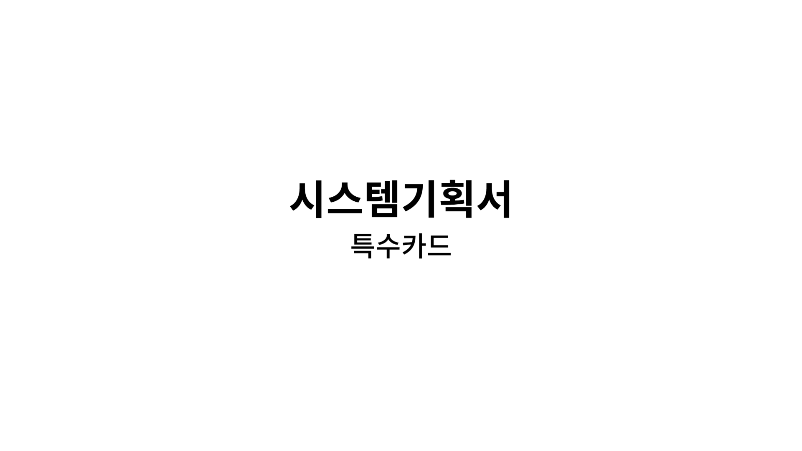
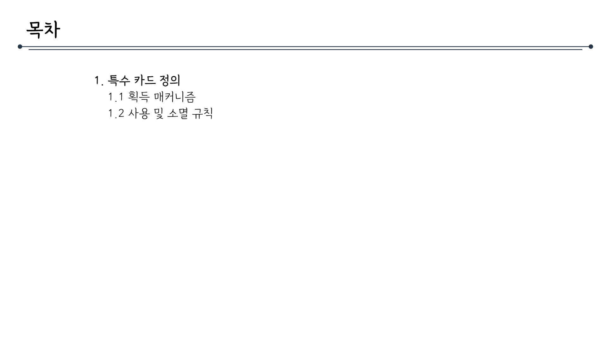
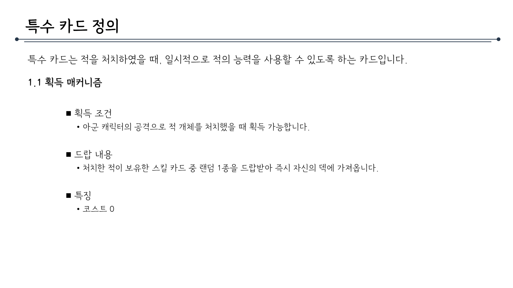
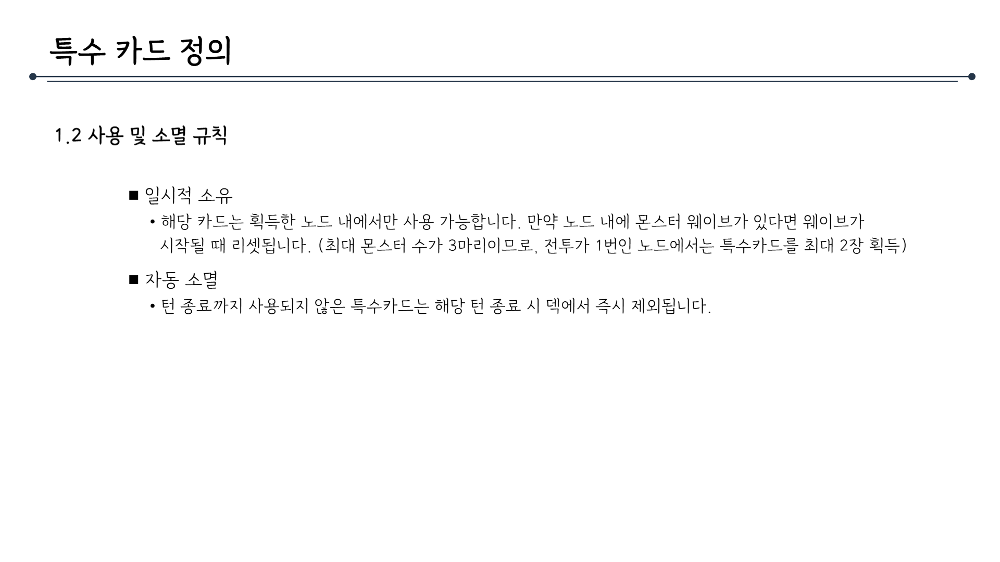

# 특수카드시스템_V2_김주연_pptx

## 슬라이드 1

> 이 문서는 게임 기획 문서의 일부로, "시스템기획서"와 "특수카드"에 대한 정보를 포함하고 있습니다.

문서의 레이아웃과 구조는 다음과 같습니다.

*   중앙에 큰 제목이 있고, 그 아래에 작은 제목이 있습니다.
*   큰 제목: **시스템기획서** (시스템 기획에 대한 문서라는 것을 나타냅니다.)
*   작은 제목: **특수카드** (특수카드에 대한 정보를 포함하고 있음을 나타냅니다.)

문서의 배경은 흰색이며, 텍스트는 검은색입니다. 

문서에 포함된 텍스트는 "시스템기획서"와 "특수카드" 두 가지입니다.

---

## 슬라이드 2

> 해당 이미지는 게임 기획 문서의 일부로, 목차 페이지로 보입니다. 페이지의 구조와 내용을 상세하게 설명해 드리겠습니다.

### 페이지 레이아웃

*   **배경**: 페이지의 배경은 흰색입니다.
*   **텍스트 색상**: 모든 텍스트는 검은색입니다.
*   **타이틀**: 페이지 상단 왼쪽에 **목차**라는 타이틀이 있습니다.
*   **디바이더**: 타이틀 아래에 긴 가로선이 그어져 있습니다. 이 선은 왼쪽에 작은 검은 점이 있고 오른쪽에도 작은 검은 점이 있습니다.

### 목차 내용

1.  **특수 카드 정의**
    *   1.1 획득 매커니즘
    *   1.2 사용 및 소멸 규칙

### 요약

이 페이지는 게임의 특수 카드와 관련된 정의를 포함하는 목차 페이지입니다. 여기에는 특수 카드의 획득 방법과 사용 및 소멸에 관한 규칙에 대한 설명이 포함될 것으로 예상됩니다.

---

## 슬라이드 3

> 이미지는 게임 기획 문서의 일부로, "특수 카드 정의"에 대한 설명입니다.

## 레이아웃 및 구조

- 제목: 문서의 상단에 **특수 카드 정의**라는 제목이 크게 표시되어 있습니다. 제목 아래에 가는 가로선이 그어져 있어 시각적으로 구분됩니다.

- 본문: 
  - 특수 카드에 대한 설명이 제공됩니다. 
  - 특수 카드는 적을 처치하였을 때, 일시적으로 적의 능력을 사용할 수 있도록 하는 카드입니다.

## 1.1 획득 매커니즘

- 획득 조건: 
  - 아군 캐릭터의 공격으로 적 개체를 처치하였을 때 획득 가능합니다.

- 드랍 내용: 
  - 처치한 적이 보유한 스킬 카드 중 랜덤 1종을 드랍받아 즉시 자신의 덱에 가져옵니다.

- 특징: 
  - 코스트 0

---

## 슬라이드 4

> 이미지는 게임 기획 문서의 일부로, "특수 카드 정의"라는 제목이 있습니다. 문서의 레이아웃과 구조는 다음과 같습니다.

*   제목: "특수 카드 정의" 
*   가로로 긴 검은 점이 있는 선이 제목의 위아래로 각각 위치해 있습니다.
*   왼쪽 정렬로 작성된 "1.2 사용 및 소멸 규칙" 
    *   검은 네모 기호로 표시된 두 가지 항목이 포함되어 있습니다.
    *   첫 번째 항목: "임시적 소멸" 
        *   해당 카드는 획득한 노드 내에서만 사용 가능합니다. 만약 노드 내에 몬스터 웨이브가 있다면 웨이브가 시작될 때 리셋됩니다. (최대 몬스터 수가 3마리이므로, 전투가 1번인 노드에서는 특수카드를 최대 2장 획득)
    *   두 번째 항목: "자동 소멸" 
        *   턴 종료까지 사용되지 않은 특수카드는 해당 턴 종료 시 덱에서 즉시 제외됩니다.

문서는 흰색 배경에 검은 텍스트로 작성되어 있습니다.

---
