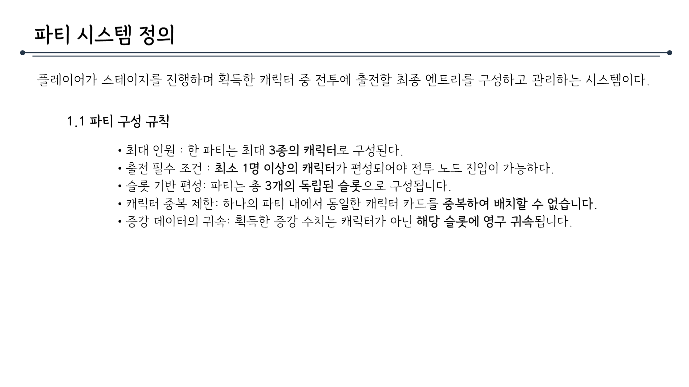
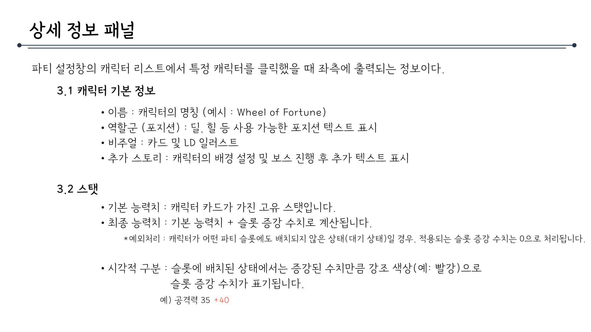

# 파티시스템_V2_김주연

## 슬라이드 1

> 이 게임 기획 문서에는 다음과 같은 내용이 포함되어 있습니다.

* **제목**: 시스템 기획서
* **부제목**: 파티 시스템

텍스트는 두 줄로 구성되어 있으며, 첫 번째 줄에는 큰 글씨로 '시스템 기획서'가 적혀 있고, 두 번째 줄에는 작은 글씨로 '파티 시스템'이 적혀 있습니다. 

이미지의 배경은 흰색이며, 검은색 텍스트가 중앙에 위치해 있습니다.

---

## 슬라이드 2

> 이미지는 게임 기획 문서의 일부로 보이는 목차 페이지입니다. 페이지의 레이아웃과 구조는 다음과 같습니다.

*   **제목**: 페이지 상단 왼쪽에는 "목차"라는 제목이 있습니다.
*   **디자인 요소**: 제목 오른쪽에는 점과 긴 선이 있습니다. 선의 왼쪽에는 점이 하나 더 있습니다.
*   **목차**: 페이지의 주요 내용은 4개의 주요 항목으로 구성된 목차입니다. 각 항목은 고유 번호가 매겨져 있으며, 부 항목에는 항목 번호와 마침표가 포함됩니다. 목차의 항목은 다음과 같습니다.

    1.  파티 시스템 정의
        1.1 파티 구성 규칙
    2.  파티 설정창
        2.1 호출 시점
        2.2 UI 레이아웃 상세
    3.  상세 정보 패널
        3.1 캐릭터 기본 정보
        3.2 스탯
    4.  파티 설정창 조작 및 상태 관리
        4.1 파티 편성

목차는 게임의 파티 시스템과 관련된 다양한 측면을 다루고 있습니다. 여기에는 파티의 정의, 설정 방법, 상세 정보 표시, 조작 및 상태 관리가 포함됩니다.

---

## 슬라이드 3

> 이 문서는 게임의 '파티 시스템 정의'에 대한 설명입니다. 문서의 구조와 내용을 상세히 분석해 보겠습니다.

### **문서의 구조**

*   **제목**: "파티 시스템 정의"라는 제목이 중앙에 위치해 있습니다. 제목 아래에 긴 선이 그어져 있어 시각적으로 강조되어 있습니다.
*   **내용 요약**: 첫 번째 문단에서는 파티 시스템이 무엇인지에 대한 간략한 설명이 있습니다. 이 시스템은 플레이어가 스테이지를 진행하며 획득한 캐릭터 중 전투에 출전할 최종 엔트리를 구성하고 관리하는 시스템이라고 설명하고 있습니다.
*   **세부 규칙**: 1.1 파티 구성 규칙이라는 소제목 아래, 파티 구성을 위한 구체적인 규칙들이 나열되어 있습니다. 

### **규칙 설명**

*   **최대 인원**: 한 파티는 최대 3종의 캐릭터로 구성됩니다.
*   **출전 필수 조건**: 최소 1명 이상의 캐릭터가 편성되어야 전투 노드 진입이 가능합니다.
*   **슬롯 기반 편성**: 파티는 총 3개의 독립된 슬롯으로 구성됩니다.
*   **캐릭터 중복 제한**: 하나의 파티 내에서 동일한 캐릭터 카드를 중복하여 배치할 수 없습니다.
*   **증강 데이터의 귀속**: 획득한 증강 수치는 캐릭터가 아닌 해당 슬롯에 영구 귀속됩니다.

### **시각적 레이아웃**

*   **배경**: 문서의 배경은 흰색입니다.
*   **글꼴**: 검은색 글꼴이 사용되었습니다.
*   **목록**: 규칙은 글머리 기호(점 형태의 아이콘)로 구분되어 있어 가독성이 좋습니다.

이 문서는 게임의 파티 시스템을 정의하고, 이를 구성할 때의 규칙을 명확히 제시하고 있습니다. 규칙들이 체계적으로 나열되어 있어 개발자들이 시스템을 구현하는 데 참고할 수 있는 중요한 자료로 활용될 수 있습니다.

---

## 슬라이드 4

> 이 문서는 게임의 '파티 설정창'과 관련된 기획 문서입니다. 문서의 구조와 내용을 상세히 설명해 드리겠습니다.

### 문서 레이아웃
- **제목**: 문서의 상단에는 "파티 설정창"이라는 제목이 있습니다. 제목 아래에는 긴 가로선이 그어져 있어, 제목과 본문과의 구분을 명확히 하고 있습니다.
- **문서 구조**: 본문은 두 가지 주요 항목으로 구성되어 있습니다.  
  1. **2.1 호출 시점**: 파티 설정창을 호출하는 시점에 대한 설명입니다.  
  2. **2.2 UI 레이아웃 상세**: 파티 설정창의 UI 레이아웃에 대한 상세한 설명입니다.

### 내용 설명

#### 2.1 호출 시점
- 전투/보스 노드 진입 시: 맵에서 노드를 클릭하면 즉시 파티 설정창이 호출됩니다.  
- 메인 메뉴: 전투 외 상황에서 상시적으로 정비를 위해 파티 설정창을 호출할 수 있습니다.

#### 2.2 UI 레이아웃 상세
파티 설정창의 UI 레이아웃은 여러 요소로 구성되어 있습니다. 각 요소의 설명은 다음과 같습니다.

- **보유 캐릭터 리스트**:  
  - 우측에 수직 스크롤 리스트로 캐릭터 초상화가 표시됩니다.  
  - 이 리스트를 통해 플레이어가 현재 보유하고 있는 캐릭터들을 확인할 수 있습니다.

- **메인 디스플레이 (좌측)**:  
  - 선택한 캐릭터의 LD 일러스트와 카드 일러스트가 크게 표시됩니다.  
  - 선택한 캐릭터의 정보를 직관적으로 확인할 수 있도록 디자인되었습니다.

- **능력치 (중상단)**:  
  - 주요 스탯 수치(공격력, 방어력, HP 등)를 표시합니다.  
  - 플레이어가 캐릭터의 성능을 쉽게 파악할 수 있도록 돕습니다.

- **파티 구성 (하단)**:  
  - 캐릭터가 파티에 추가할 수 있는 3종의 카드 정보가 표시됩니다.  
  - 이를 통해 플레이어는 파티 구성을 실시간으로 확인하고 수정할 수 있습니다.

### 종합 설명
이 문서는 게임의 '파티 설정창'과 관련된 기능 및 UI/UX 요구사항을 정의한 것으로 보입니다. 호출 시점과 UI 레이아웃에 대한 상세한 설명을 통해 개발팀이 구현해야 할 기능과 디자인의 기준을 제시하고 있습니다.

---

## 슬라이드 5

> 파티 설정창

*   파티 설정창은 게임에서 파티를 설정하는 공간입니다.
*   레이아웃은 다음과 같습니다.
    *   상단: 탭 - '보유 캐릭터'가 초록색으로 활성화된 상태입니다.
    *   좌측: 캐릭터 일러스트
    *   우측 상단: 
        *   큰 칸: 농력치
        *   작은 칸 3개: 지정된 카드 (가로로 3개)
    *   우측: 버튼 6개 (세로로 6개) 
        *   나가기
        *   초기화
        *   미표기 버튼 4개

---

## 슬라이드 6

> ## **상세 정보 패널 설명**

### **제목: 상세 정보 패널**
- **위치**: 문서 상단에 중앙 정렬된 큰 글씨로 **"상세 정보 패널"**이라는 제목이 있습니다.  
- **디자인**: 제목 아래에 가는 가로선이 그어져 있습니다. (중앙에 점을 포함하여 선이 끊어짐)

### **내용 설명**
파티 설정창의 캐릭터 리스트에서 특정 캐릭터를 클릭했을 때 좌측에 출력되는 정보입니다.

### **3.1 캐릭터 기본 정보**
- **이름**: 캐릭터의 명칭 (예시: Wheel of Fortune)
- **역할군 (포지션)**: 딜, 힐 등 사용 가능한 포지션 텍스트 표시
- **비주얼**: 카드 및 LD 일러스트
- **추가 스토리**: 캐릭터의 배경 설정 및 보스 진행 후 추가 텍스트 표시

### **3.2 스탯**
- **기본 능력치**: 캐릭터 카드가 가진 고유 스탯입니다.
- **최종 능력치**: 기본 능력치 + 슬롯 증가 수치로 계산됩니다.  
  *예외처리: 캐릭터가 어느 파티 슬롯에도 배치되지 않은 상태(대기 상태)일 경우, 적용되는 슬롯 증가 수치는 0으로 처리됩니다.*
- **시각적 구분**: 슬롯에 배치된 상태에서는 증가된 수치만큼 강조 색상(예: 빨강)으로 슬롯 증가 수치가 표기됩니다.  
  *예) 공격력 35 +40*

---

## 슬라이드 7

> 이 문서는 게임 기획 문서의 일부로, **파티 설정창 조작 및 상태 관리**에 관한 내용을 담고 있습니다. 문서의 제목은 중앙 상단에 위치하며, 제목 아래에는 가로로 긴 점선이 있습니다.

문서의 주요 내용은 **4.1 파티 편성**으로, 다음과 같은 하위 항목들이 포함되어 있습니다:

*   **캐릭터 배치**:
    *   조작: 우측의 '보유 캐릭터 리스트'에서 초상화를 드래그하여 슬롯에 드롭합니다.
    *   데이터: 해당 슬롯의 증강 데이터 컨테이너에 저장된 증강 수치를 호출하여 캐릭터의 '임시 스탯 필드'에 합산(참조)합니다.
    *   출력: 좌측 메인 디스플레이에 캐릭터 LD 일러스트와 슬롯 증강 수치가 합산된 최종 능력치가 실시간으로 동기화되어 출력됩니다.
*   **캐릭터 배치 및 해제**:
    *   조작: 캐릭터를 슬롯 밖으로 빼내거나 다른 캐릭터를 그 위에 덮어씌웁니다.
    *   데이터: 캐릭터의 임시 스탯 필드에 합산되었던 수치는 즉시 0으로 초기화됩니다.
*   **슬롯 능력치 유지 및 초기화 규칙**:
    *   수치 보존: 슬롯에 쌓인 증강 수치는 캐릭터가 죽거나 다른 캐릭터로 바뀌어도 사라지지 않고 그 자리(슬롯의 증강 데이터 컨테이너)에 그대로 남습니다.
    *   유지 기간: 한 번 시작한 런이 완전히 끝나기 전까지는 슬롯의 강화 상태가 계속 유지됩니다.
    *   초기화 시점: 게임 오버가 되어 처음부터 다시 시작할 때만(윤회) 슬롯의 수치가 0으로 초기화됩니다.

이 문서는 게임 내에서 파티를 설정하고 관리하는 방법, 캐릭터를 배치하고 해제하는 방법, 슬롯 능력치를 유지하고 초기화하는 규칙 등을 상세하게 설명하고 있습니다.

---
