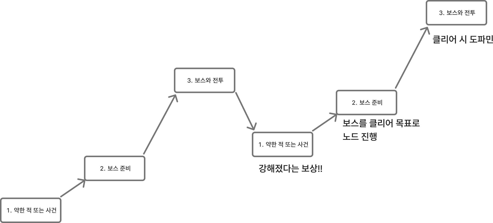

# 플레이경험기획문서_V2_장보성

## 슬라이드 1

**플레이 경험 기획서**

Light life 202313190 장보성

---

## 슬라이드 2

**변경사항**

변경된 내용 정리

| 일시 | 작업자 | 변경 사항 |
| --- | --- | --- |
| 2026.02.20 | 장보성 | 기획해야 할 항목 작성 |
| 2026.02.21 | 장보성 | 핵심 재미요소 |
| 2026.02.22 | 장보성 | 유의사항, 난이도 컨셉 |
| 2026.02.24 | 장보성 | 전체 난이도와 경험 직결 |
| 2026.02.25 | 장보성 | 전투 경험 구체화 |
| 2026.02.26 | 장보성 | 오타 수정 |

---

## 슬라이드 3

**문서 개요**

**프로젝트의 로그라이트 플레이 경험 구조를 정의함**

게임 전반의 설계 판단 기준이 되는 감정 설계 방향성과 구조적 원칙을 명확히 규정하기 위해 작성함

  - **기획 의도를 통합해 시스템,컨텐츠를 만들 수 있음!!!**
  - 플레이 시 감정,재미요소에 영향을 토대를 제공하는 문서
  - 시스템·밸런스 설계 이전 단계의 경험을 예상하고 기획!!!
---

## 슬라이드 4

**플레이어 경험 비전 문서**

**핵심 유저 경험 목표**

  - 짧은 시간 안에 빌드를 완성하고, 게임오버를 해도 성장하며 불쾌감을 줄이는캐릭터의 성장 순간을 체험하게 한다.
**플레이어가 느껴야 할 경험**

  - 예측 불가능한 적이나 사건 등장으로 흥미를 떨어지지 않는 로그라이트 경험
**경험 설계 목표**

  - 전투 안에서 전략이 나오게 함!!!!!
  - 캐릭터가 윤회하며 더욱 강해지는 육성의 재미
  - 플레이어의 선택에 따라 달라지는 결과를 보는 인지적 재미
  - 보스 및 어려운 도전을 클리어하는 쾌감
#### 인지적 재미

#### 회귀

#### 간단한 조작

#### 빠른

#### 성장

---

## 슬라이드 5

**핵심 경험 요소**

#### 전략의 재미:

#### 캐주얼

#### 전략의 재미:

#### 명확한 보상

#### 전략의 재미:

#### 빠른 몰입

#### 전략의 재미:

#### 선택의 자유

**중점으로 삼아야 게임의 방향성**

#### 진입장벽을 위해 전략의 중요도를

#### 낮춤

#### 승리에 대한

#### 명확한 보상으로 동기 제공

#### 전투 자체의 경험을 중점으로

#### 전략을 짜는 게임

#### 노드를 골라 피로도를 스스로 조절할 수 있도록 함

> 이미지는 검은색 인물 아이콘과 흰색 배경으로 구성되어 있습니다.

중앙에 있는 검은색 인물 아이콘은, 의자에 앉아 있는 사람 모습을 표현하고 있습니다. 

인물 아이콘은 간결한 형태의 실루엣으로 표현되어 있습니다. 

*   아이콘의 상반신은 왼쪽으로 기울어져 있고, 팔은 뒤로 젖혀져 있습니다. 
*   머리는 검은색 동그라미로 표현되어 있고, 목 부분에 흰색 라인이 그려져 있습니다. 
*   몸통과 하체는 의자에 걸쳐져 있는 모습이며, 왼쪽 다리는 직각 모양으로 표현되어 있습니다. 
*   의자는 사각형과 직사각형으로 표현되어 있고, 가로로 긴 직사각형 2개와 가로로 짧은 직사각형 1개가 의자의 가로대를 표현하고 있습니다.

전체적으로 단순화된 형태를 띄고 있어, 다양한 컨텍스트에서 활용될 수 있는 범용적인 아이콘으로 보입니다.

> 해당 이미지는 게임 기획 문서의 일부가 아닌, 선물을 상징하는 픽토그램입니다.

이미지는 검은색 선으로 이루어진 선물 상자 모양입니다. 

이미지의 중앙에는 가로로 긴 직사각형이 있고, 

위쪽에는 두 개의 원이 겹쳐져 있는 고리 모양의 도형이 있습니다.

이는 전통적인 선물 상자의 뚜껑 부분을 상징하는 것으로 보입니다.

전체적으로 깔끔하고 간결한 디자인으로, 

다양한 상황이나 플랫폼에서 활용할 수 있는 범용적인 선물 아이콘으로 활용될 수 있습니다.

> 이미지는 검은색 배경에 하얀색으로 디자인된 클럭 모양의 로고입니다.

로고의 왼쪽에는 3개의 가로로 된 검은색 막대가 왼쪽부터 차례대로 짧게, 길게, 짧게 위치하고 있습니다. 막대들은 수평으로 정렬되어 있습니다.

오른쪽에는 큰 검은색 원이 있고, 원 내부에는 하얀색 클럭 모양이 가운데에 위치해 있습니다. 클럭의 시침과 분침은 12시와 3시 방향 사이에 위치해 있습니다.

전체적으로 간결하고 현대적인 디자인으로, 시계나 시간과 관련된 아이콘으로 보입니다.

> 이미지는 화살표와 기호가 포함된 단순한 다이어그램입니다.

*   왼쪽 상단: **X** 표시
*   오른쪽 상단: **O** 표시
*   왼쪽 하단: **O** 표시
*   오른쪽 하단: **X** 표시
*   왼쪽 하단의 **O** 표시에서 시작하여 오른쪽 상단의 **O** 표시를 향하는 화살표

이미지 중앙에 위치한 굵은 검은색 화살표가 **왼쪽 하단**에서 시작하여 **오른쪽 상단**을 가리킵니다. 화살표는 왼쪽에서 오른쪽으로 곡선 형태로 그려져 있습니다.

배경은 하얀색이며, 모든 요소는 검은색입니다.

---

## 슬라이드 6

**유의해야 할 요소**

#### 전략의 재미:

#### 반복 피로 누적

#### 전략의 재미:

#### 확률 의존 체감 증가

#### 전략의 재미:

#### 후반 난이도 급상승 또는 붕괴

#### 전략의 재미:

#### 복잡한 시너지

#### 전략의 재미:

#### 플레이 동기 약화

**프로젝트 특성상 해결해야 할 문제**

#### 반복되는 전투에

#### 빠른 피로도 누적

#### 운에 요소가 강해 전략에 무력감을 느끼지 않도록

#### 뒤로 갈 수 록

#### 난이도가

#### 급상승하지 않도록 함

#### 복잡하고 직관적이지 않은 전략은 몰입도 저하

#### 패배의 좌절감

#### 게임 오버에도

#### 재도전 할 만한 보상

> 해당 이미지에는 하얀색 배경에 하나의 주사위가 검은색으로 그려져 있습니다.

주사위는 3D로 표현되었으며, 정육면체입니다. 주사위의 각 면에는 하얀색으로 점을 찍어 숫자를 표현하는 방식으로 이루어져 있습니다.

주사위 왼쪽 면에는 3개의 점이 찍혀 있고, 주사위 윗 면에는 4개의 점이 찍혀 있습니다. 주사위 오른쪽 면에는 1개의 점이 찍혀 있습니다.

주사위 모서리는 뾰족하지 않고 무디게 표현되었습니다. 주사위 면과 면이 이어지는 부분에는 하얀색 테두리가 있습니다.

주사위 오른쪽 면은 정면이 아닌 약간 기울어진 각도로 그려져 있습니다.

> 배터리 잔량 부족 상태를 나타내는 아이콘입니다.

위쪽에는 배터리 모양의 아이콘이 있고, 아래에는 사람의 실루엣이 있습니다.

배터리 아이콘은 검은색 윤곽선에 내부가 흰색인 직사각형으로 표현되어 있습니다. 배터리의 오른쪽 상단에는 작은 충전 단자 모양이 있습니다. 배터리의 흰색 내부 영역은 왼쪽에 절반 정도의 크기만 채워져 있어서, 배터리 잔량이 부족한 상태를 나타냅니다.

사람의 실루엣은 검은색으로, 몸통과 머리는 단순한 원형과 곡선으로 표현되었습니다. 두 다리는 굽어진 자세를 하고 있습니다. 

이러한 아이콘은 모바일 기기나 게임에서 배터리 잔량 부족을 나타내는 심볼로 자주 사용됩니다.

> 해당 이미지는 게임 기획 문서의 일부로 추정되며, 막대 그래프를 사용하여 상승세를 표현하고 있습니다.

이미지 중앙에는 3개의 검은 막대가 왼쪽부터 오른쪽으로 차례대로 위치하고 있습니다. 막대의 크기는 왼쪽에서 오른쪽으로 갈수록 커지고 있습니다. 막대 그래프의 오른쪽에는 위쪽을 가리키는 커다란 검은 화살표가 있습니다. 화살표의 크기는 막대 그래프보다 큽니다.

이미지의 배경은 흰색이며, 막대 그래프와 화살표는 검은색입니다. 레이아웃은 간단하고 명확하며, 시각적으로 상승세를 강조하고 있습니다.

> 이미지는 게임이 끝났음을 나타내는 "GAME OVER" 라는 문구가 포함된 검은색 사각형입니다.

*   **텍스트 레이아웃 및 구조**

    *   이미지 중앙에 가로로 "GAME OVER"라는 흰색 텍스트가 있습니다.
    *   텍스트는 두 행으로 구성되어 있습니다. 첫 번째 행에는 "GAME"이, 두 번째 행에는 "OVER"가 있습니다.
    *   텍스트는 동일한 글꼴과 크기로 표시됩니다.
    *   텍스트는 검은색 사각형에 포함되어 있습니다.
*   **시각적 레이아웃 및 구조**

    *   검은색 사각형의 네 귀퉁이는 모두 둥글게 처리되어 있습니다.
    *   검은색 사각형의 두께는 일정합니다.
    *   이미지는 흰색 배경을 가지고 있습니다.

> 이미지는 기어와 기어 연결 라인의 실루엣으로 구성되어 있습니다. 중앙에 하나의 큰 기어가 있고, 이를 중심으로 상하좌우 및 대각선에 6개의 기어가 균형 있게 배치되어 있습니다. 각 기어는 원형의 중심을 기준으로 바깥쪽으로 뻗어 나온 톱니를 가지고 있습니다. 

기어들은 서로 점선 형태의 짧은 선분과 긴 선분으로 연결되어 있습니다. 연결 라인은 각 기어의 톱니 부분에서 다른 기어의 톱니 부분으로 향하고 있습니다. 

이미지 중앙의 큰 기어는 다른 기어와 비교했을 때, 상대적으로 크기가 크고, 다른 기어와 구별되는 중심에 위치하고 있습니다. 

이미지의 배경은 흰색이며, 기어와 연결 라인은 검은색으로 표현되어 있습니다. 

이러한 구성은 기계적인 요소들이 유기적으로 연결되어 작동하는 시스템을 상징적으로 표현한 것으로 보입니다.

---

## 슬라이드 7

**윤회(코어 루프) 경험 기획**

#### 보스 다음 조우할 적의 난이도는 낮추는 난이도

#### 상대적으로 약해진 적 자신이 강해졌다고 느끼게 함

#### 높은 피로도의 전투 후 재정비 할 수 있게!

#### 난이도 낮춤

#### :보스와 전투

> ## 이미지 설명

해당 이미지는 게임 난이도 곡선을 표현한 그래프입니다. 영어 원제는 "THE DIFFICULTY SAW!"이며, 그래프의 제목은 게임 난이도와 시간에 따른 상관관계를 보여 줍니다.

### 그래프 구조

*   가로축: 시간
*   세로축: 게임 난이도

### 그래프 영역

그래프는 여러 구역으로 나뉘어져 있으며, 각 구역은 다른 색상으로 표시되어 있습니다.

*   Tutorial (연한 청록색): 게임 튜토리얼 구간
*   Level 1 (연한 보라색): 1단계 레벨
*   Level 2 (연한 분홍색): 2단계 레벨
*   Level 3 (분홍색): 3단계 레벨
*   Level 4 (연한 주황색): 4단계 레벨
*   Climax (베이지색): 클라이맥스 구간

### 그래프 선

그래프에는 검은 실선과 점선이 있습니다.

*   검은 실선: 게임 난이도의 전반적인 추세를 나타냅니다. 난이도가 상승하는 구간과 감소하는 구간이 반복되며, 전반적으로는 상승하는 경향입니다.
*   검은 점선: 새로운 게임 메커닉이 도입되는 시점을 표시합니다.

### 그래프 해석

그래프는 게임의 난이도가 시간에 따라 어떻게 변화하는지 보여 줍니다. 튜토리얼 구간에서는 난이도가 낮고, 레벨이 올라갈수록 난이도가 증가합니다. 각 레벨의 도입부에서는 새로운 메커닉이 도입되며, 이로 인해 난이도가 일시적으로 감소했다가 다시 증가하는 패턴을 보입니다. 클라이맥스 구간에 가까워질수록 난이도가 더욱 증가합니다.

### 요약

이 그래프는 게임의 난이도가 어떻게 설계되어야 플레이어에게 적절한 도전을 제공할 수 있는지, 그리고 새로운 메커닉을 도입하여 난이도를 조절하는 방법을 보여 주는 중요한 자료입니다.

> 이미지는 게임 기획 문서의 일부로 보이는 흐름도입니다. 이 흐름도는 게임의 진행 구조를 설명하고 있습니다. 

흐름도의 구조는 다음과 같습니다.

*   **1. 약한 적 또는 사건**: 
    *   가장 왼쪽 하단에 위치한 사각형으로, 게임의 시작점입니다. 
    *   게임 속 표현은 알 수 없지만, 플레이어가 처음 게임을 시작할 때 발생하는 이벤트나 약한 적을 만나는 상황을 의미하는 것으로 추정됩니다.
*   **2. 보스 준비**: 
    *   왼쪽에서 두 번째에 위치한 사각형으로, '1. 약한 적 또는 사건'에서 화살표가 이어져 있습니다. 
    *   이 단계는 플레이어가 보스를 만나기 전 준비를 하는 단계를 의미하는 것으로 보입니다. 
    *   이 사각형의 오른쪽에는 '보스를 클리어 목표로 노드 진행'이라는 설명이 있습니다. 이는 플레이어에게 보스를 클리어하는 것을 목표로 설정하고, 그에 따른 진행 경로를 제공한다는 것을 의미합니다.
*   **3. 보스와 전투**: 
    *   중앙과 오른쪽 상단에 위치한 사각형으로, '2. 보스 준비'에서 화살표가 이어져 있습니다. 
    *   이 단계는 플레이어가 보스와 전투를 벌이는 상황을 의미합니다. 
    *   이 사각형의 오른쪽에는 '클리어 시 도파민'이라는 설명이 있습니다. 이는 플레이어가 보스를 클리어했을 때 느끼는 성취감이나 만족감을 의미하는 것으로 보입니다.

또한, 이 흐름도의 중간에는 '강해졌다는 보상!!'이라는 문구가 있습니다. 이는 플레이어가 게임에서 성장하고 보상을 받는 것을 의미하는 것으로 보입니다.

전체적으로 이 흐름도는 게임의 진행 구조를 설명하고 있으며, 플레이어가 보스를 클리어하는 것을 목표로 설정하고, 그에 따른 진행 경로를 제공하고 있습니다.

---

## 슬라이드 8

**전체 경험 기획**

#### 윤회를 통한 캐릭터의 영구적 성장

#### 캐릭터 자체의 성장에 따라 플레이 난이도가 낮아지며

#### 간단한 전략요소로 빠른 전략 학습

#### 반복 플레이에 따른 전략 구성의 이해도가

#### 늘어나 플레이어 자체의 전략 성장

#### 전투 이해한 순간

> 이미지는 'Steep and Shallow'라는 제목의 그래프입니다. 그래프는 경험과 학습의 상관관계를 나타내고 있습니다. 

그래프의 가로축은 '경험'을 나타내고, 세로축은 '학습'을 나타냅니다. 

그래프 안에는 두 개의 곡선이 그려져 있습니다. 

*   실선: 완만한 곡선
*   점선: 가파른 곡선

두 곡선 모두 왼쪽 아래에서 시작하여 오른쪽 위로 올라가는 형태입니다. 

곡선의 라벨은 다음과 같습니다.

*   오른쪽 상단에 'steep (short)' 
*   오른쪽 하단에 'shallow (long)' 

두 라벨은 각각 점선과 실선을 가리킵니다.

그래프의 하단에는 'Experience'라는 단어가 있고, 왼쪽에는 'Learning'이라는 단어가 있습니다.

이미지 하단에는 저작권 정보가 있습니다.

*   ' Alan Fletcher 2013 This file is licensed under the Creative Commons Attribution-Share Alike 3.0 Unported'
*   'Drawn with 'R' using R-studio'

이미지의 배경은 진한 회색입니다.

---

## 슬라이드 9

**전체 난이도 보완**

#### 초반 진입 장벽이 매우 높음

#### 시스템 설명 부족

#### 라이트 유저 이탈 가능성

#### 한계점 분석

#### 전투 학습 개선

#### 코인 기대값 시각화

#### 전투 튜토리얼 분리

#### 감정 완충 장치

#### 게임오버 시 능력치 보정

#### 이전 능력치 일부 유지

#### 콘텐츠 기획 관점 개선 제안

---

## 슬라이드 10

**프로젝트 제작용도에 따른 UX**

#### 한정된 시간으로 게임을 보여주기 위한 UX

#### 20분내에 클리어 가능

#### 중간 저장 없음

#### 게임 오버를 통해 크게 성장 시켜 다시 도전을 유도

#### 정보를 시각적 표현(단순화)을 통해 학습

**프로젝트 특성상 해결해야 할 문제**

---

## 슬라이드 11

**전투 코스트 구조 설계**

**항상 부족하다고 느끼는 자원 량**

  - 한정된 수량으로 전략의 필요성 부여 할 수 있도록
**자원간 상호작용**

  - 자원의 효과는 서로 상호작용이 가능하도록
**선택의 무게**

  - 모든 자원은 선택지 간 기회비용을 발생시킴
  - 코스트 보유량은 전략(전투) 난이도와 직결됨
#### 부족한 자원

#### 선택의 중요성

#### 자원간 상호작용

#### 플레이어가 초반에 얻는 자원 지정을 위함

---

## 슬라이드 12

**전투 중 부여할 경험**

**핵심 감정 키워드**

  - 호기심, 파악, 설계, 쾌감
**플레이어가 느껴야 할 상태**

  - 플레이어가  적을 파악하고 이를 자신의 방법대로 처치할 떄의 쾌감
**경험 설계 목표**

  - 전투 안에서 전략이 나오게 함!!!!!
  - 카드 사용 / 턴 운영 / 시너지 / 판단
  - 캐릭터가 윤회하며 더욱 강해지는 육성의 재미
  - 플레이어의 선택에 따라 달라지는 결과를 보는 인지적 재미
  - 보스 및 어려운 도전을 클리어하는 쾌감
#### 전략

#### 코스트 관리

#### 간단한 조작

| 경험 종류 | 기획 목표 |
| --- | --- |
| 전략성 | 턴마다 ‘최적 수’를 고민하고 |
| 긴장감 | 항상 패배 가능성이 열려 있는 상태 유지 |
| 통제감 | 운 요소가 존재하되, 극복 가능해야 함 |
| 인지적 재미 | 초반 선택이 후반 난이도에 직접 영향 (설계) |
| 도파민 | 보스 처치라는 명확한 보상 |

#### 보스를 첫 조우

---

## 슬라이드 13

**전투 스토리보드**

#### 전투 경험 핵심 목표

  - 아군의 상황 확인
  - 우선순위의 적 판단
  - 사용 가능한 스킬 확인
  - 키워드 연계 예상
#### 상태 확인

#### 스킬 확인

#### 공격할 대상 선택

#### 사용할 스킬 선택

#### 활성화된 키워드 확인

#### 행동 선택완료

#### 스킬 사용 확인

#### 스킬에 대한 결과 확인

#### 결과에 따른 플레이어의 반응

#### 다음 전략 구상 또는 결과의 만족감

#### 행동 결과

#### 행동 선택

---

## 슬라이드 14

**각 스테이지별 경험**

**선택의 강점**

  - 자신의 선택으로 피로도 조절 목적
**핵심 재미요소**

  - 우연히 나오는 사건 스테이지는 전투를 하지 않기에 피로도를 낮춤
  - 좋은 보상을 얻는 대신 전투를 진행할지 선택
  - 전투에서의 설계로 피로도가 쌓였을 때 약간 휴식하는 용도
#### 행운

#### 피로도

#### 단순 선택

#### 노드에서 스테이지를 선택하게 함

> 이 문서는 게임 기획 문서의 일부로, 게임의 전체 구조 설계에 대한 설명입니다. 문서의 제목은 **전체 구조 설계**이며, 문서의 첫 부분에 위치해 있습니다.

문서의 첫 번째 항목은 **1.1 스테이지 구성 개요**입니다. 이 항목은 게임이 총 4개의 스테이지로 구성되어 있으며, 각 스테이지는 4개의 노드로 구성되어 있음을 설명합니다. 각 스테이지의 노드는 고정되어 있으며, 플레이어는 이를 선형 구조로 순차 진행합니다.

이어서 각 스테이지의 기본 구성에 대한 설명이 있습니다. 각 스테이지의 기본 구성은 다음과 같습니다.

1. **일반 전투 노드 (고정)**
2. **일반 전투 노드 (사건 노드 대체 가능)**
3. **일반 전투 노드 (사건 노드 대체 가능)**
4. **보스 노드 (고정)**

이러한 기본 구성은 도식화되어 문서에 포함되어 있습니다. 도식은 네 개의 노드를 선형으로 연결한 구조로, 각 노드는 원형의 아이콘으로 표시되어 있습니다. 노드의 종류는 **일반**, **일반/사건**, **일반/사건**, **보스**로 구분되며, 각각 노드의 색상으로 구분됩니다. 노드의 색상은 왼쪽부터 노란색, 반으로 나뉘어진 노란색과 녹색, 빨간색입니다. 각 노드 사이에는 국은 선이 연결되어 있으며, 이 선은 오른쪽을 가리키는 화살표로 끝납니다.

문서의 마지막에는 참고 사항으로 *다음 장에 이해를 돕기 위한 전체 스테이지 구조를 첨부함.*이라는 문구가 있습니다.

---

## 슬라이드 15

**로그라이트 동기 구조**

  - 전투 생존
  - 다음 보상 획득
#### 단기 동기

#### 빌드 완성

#### 보스 돌파

#### 자신만의 전략 설정

#### 중기 동기

#### 게임 클리어

#### 적을 양학

#### 보지 못한 보스

#### 모든 캐릭터 성장

#### 장기 동기

---
